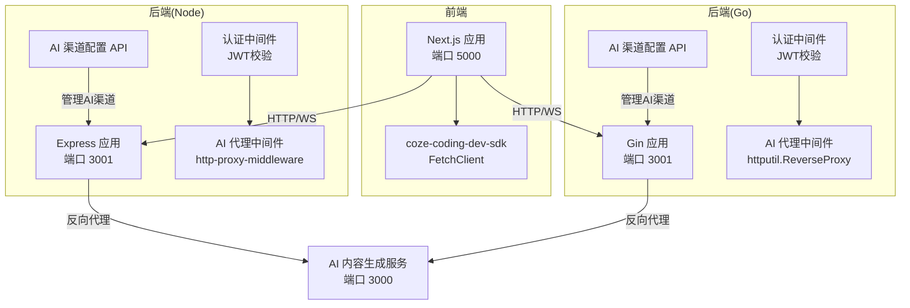
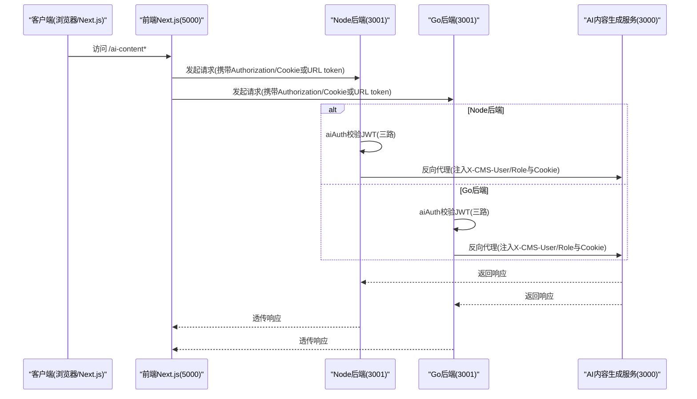
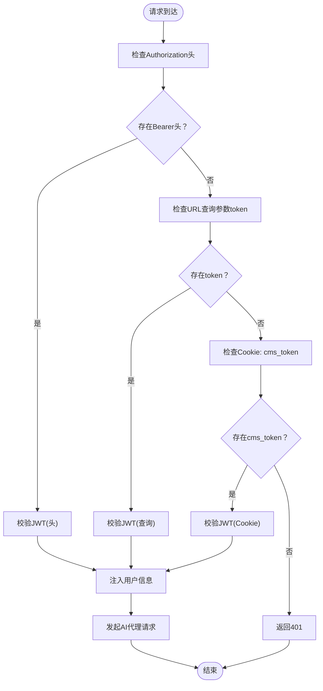
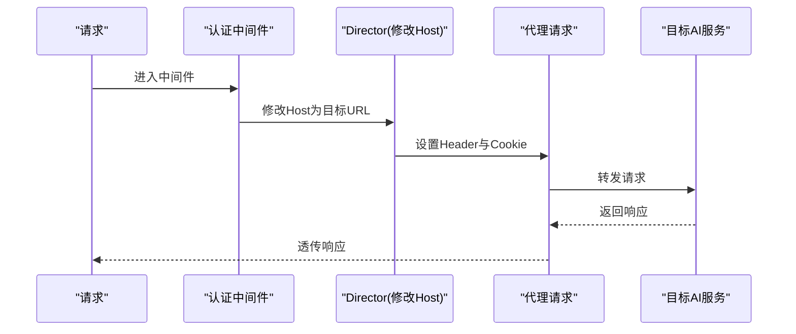
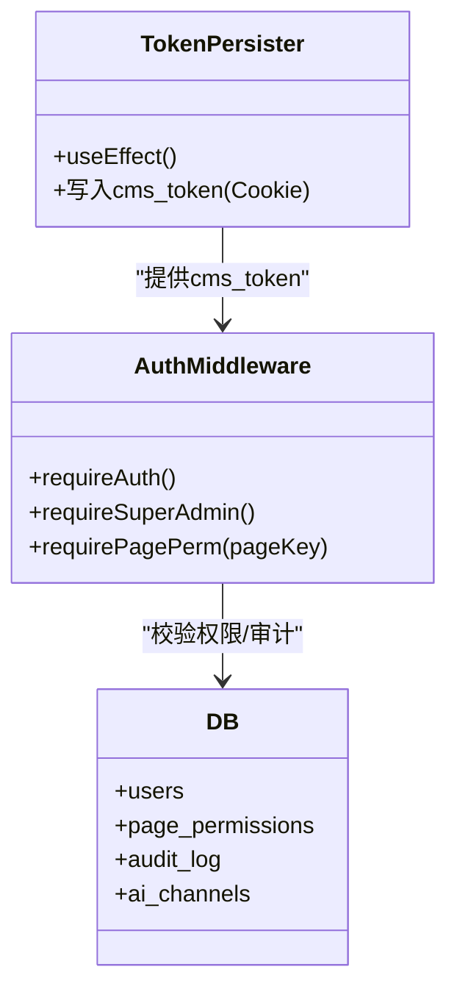
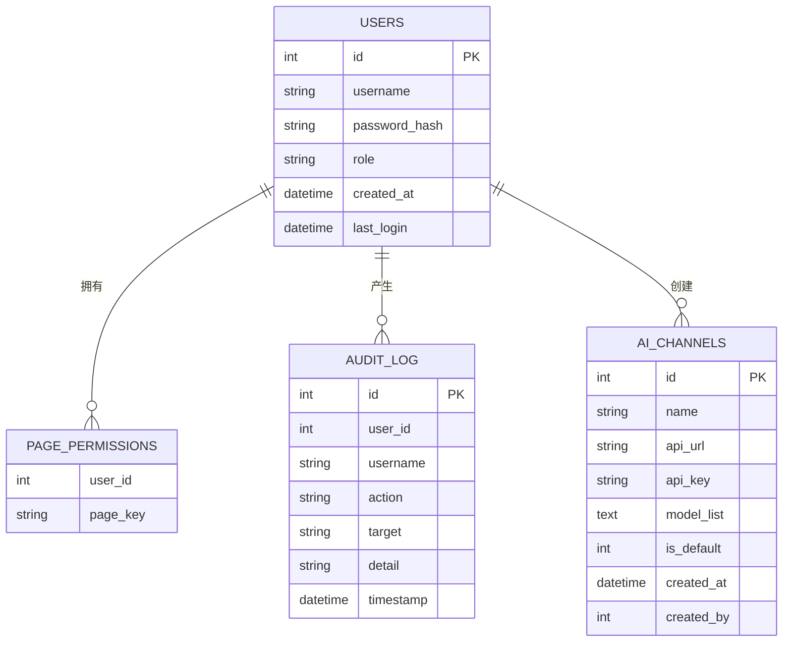
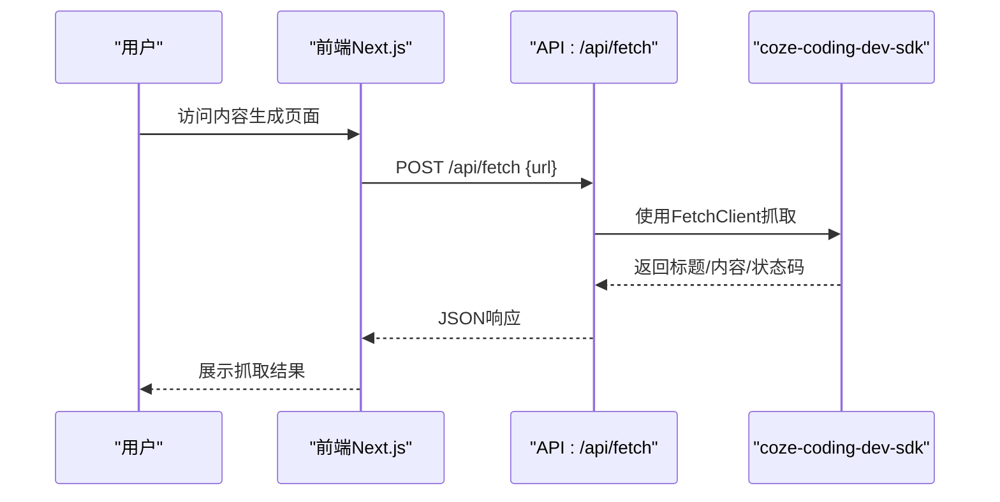
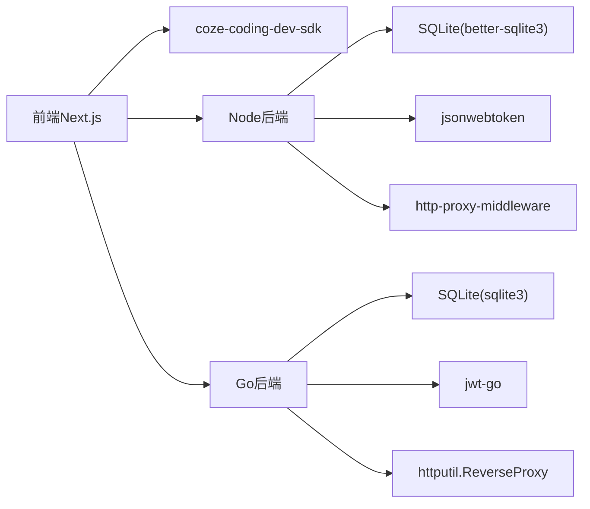

# AI代理服务

<cite>
**本文引用的文件**
- [package.json](file://ai-content-project/package.json)
- [server.ts](file://ai-content-project/src/server.ts)
- [route.ts](file://ai-content-project/src/app/api/fetch/route.ts)
- [AGENTS.md](file://ai-content-project/AGENTS.md)
- [DESIGN.md](file://ai-content-project/DESIGN.md)
- [app.js](file://business-core/cms-server/app.js)
- [auth.js](file://business-core/cms-server/middleware/auth.js)
- [ai-channels.js](file://business-core/cms-server/routes/ai-channels.js)
- [main.go](file://business-core/cms-server-go/main.go)
- [config.go](file://business-core/cms-server-go/config/config.go)
- [ai_channels.go](file://business-core/cms-server-go/routes/ai_channels.go)
- [setup.js](file://business-core/cms-server/db/setup.js)
- [setup.go](file://business-core/cms-server-go/db/setup.go)
- [token-persister.tsx](file://ai-content-project/src/components/token-persister.tsx)
</cite>

## 目录
1. [引言](#引言)
2. [项目结构](#项目结构)
3. [核心组件](#核心组件)
4. [架构总览](#架构总览)
5. [详细组件分析](#详细组件分析)
6. [依赖分析](#依赖分析)
7. [性能考量](#性能考量)
8. [故障排查指南](#故障排查指南)
9. [结论](#结论)
10. [附录](#附录)

## 引言
本文件为“AI代理服务”的技术文档，聚焦以下目标：
- 代理服务的架构设计与认证机制
- 请求转发逻辑与JWT令牌传递
- 用户权限验证与会话管理
- AI服务提供商集成、API密钥管理与负载均衡策略
- 错误处理、超时控制与重试策略
- 代理配置选项、安全考虑与性能监控方案
- 与AI内容生成前端的数据交互协议与通信格式

## 项目结构
该仓库包含两套后端实现与一套前端应用：
- 前端应用（Next.js 16 App Router）：负责AI内容生成的交互界面与部分数据抓取能力
- 后端（Node.js Express）：提供认证、权限校验、AI代理与静态资源服务
- 后端（Go/Gin）：提供认证、权限校验、AI代理与静态资源服务；同时提供AI渠道配置API

图表来源
- [server.ts:1-36](file://ai-content-project/src/server.ts#L1-L36)
- [app.js:163-225](file://business-core/cms-server/app.js#L163-L225)
- [main.go:86-290](file://business-core/cms-server-go/main.go#L86-L290)
- [route.ts:1-25](file://ai-content-project/src/app/api/fetch/route.ts#L1-L25)

章节来源
- [AGENTS.md:15-39](file://ai-content-project/AGENTS.md#L15-L39)
- [AGENTS.md:41-50](file://ai-content-project/AGENTS.md#L41-L50)
- [package.json:15-76](file://ai-content-project/package.json#L15-L76)

## 核心组件
- 前端Next.js服务：提供AI内容生成的交互界面与数据抓取能力，监听端口5000
- Node.js后端：提供认证、权限校验、AI代理与静态资源服务，监听端口3001
- Go后端：提供认证、权限校验、AI代理与静态资源服务，监听端口3001
- AI渠道配置API：统一管理AI服务提供商的接入地址、模型列表与默认渠道
- 令牌持久化组件：解决iframe内客户端导航导致的令牌丢失问题

章节来源
- [server.ts:1-36](file://ai-content-project/src/server.ts#L1-L36)
- [app.js:163-225](file://business-core/cms-server/app.js#L163-L225)
- [main.go:86-290](file://business-core/cms-server-go/main.go#L86-L290)
- [ai-channels.js:1-113](file://business-core/cms-server/routes/ai-channels.js#L1-L113)
- [ai_channels.go:17-28](file://business-core/cms-server-go/routes/ai_channels.go#L17-L28)
- [token-persister.tsx:15-37](file://ai-content-project/src/components/token-persister.tsx#L15-L37)

## 架构总览
AI代理服务采用“前端直连后端，后端统一反向代理至AI服务”的架构。后端提供两种实现（Node与Go），均支持：
- 多通道认证：Authorization头、URL查询参数token、Cookie回退
- 会话与用户上下文注入：通过自定义Header与Cookie传递用户身份
- AI渠道配置：集中管理API地址、模型列表与默认渠道
- CORS与静态资源服务

图表来源
- [app.js:163-225](file://business-core/cms-server/app.js#L163-L225)
- [main.go:209-290](file://business-core/cms-server-go/main.go#L209-L290)

## 详细组件分析

### 认证与会话管理
- 多通道认证
  - Authorization头：Bearer <JWT>
  - URL查询参数：?token=<JWT>
  - Cookie回退：cms_token
- 令牌校验：使用JWT_SECRET进行签名验证，成功后将用户信息注入请求上下文
- 会话注入：后端在代理请求中设置自定义Header与Cookie，用于下游AI服务识别用户身份

图表来源
- [app.js:168-196](file://business-core/cms-server/app.js#L168-L196)
- [main.go:233-273](file://business-core/cms-server-go/main.go#L233-L273)

章节来源
- [auth.js:20-35](file://business-core/cms-server/middleware/auth.js#L20-L35)
- [app.js:168-196](file://business-core/cms-server/app.js#L168-L196)
- [main.go:233-273](file://business-core/cms-server-go/main.go#L233-L273)

### 请求转发与代理逻辑
- Node后端使用http-proxy-middleware，Go后端使用httputil.ReverseProxy
- 在代理前注入用户身份信息（X-CMS-User、X-CMS-Role）与Cookie
- 支持WebSocket代理（ws: true）

图表来源
- [main.go:210-290](file://business-core/cms-server-go/main.go#L210-L290)
- [app.js:198-213](file://business-core/cms-server/app.js#L198-L213)

章节来源
- [app.js:198-213](file://business-core/cms-server/app.js#L198-L213)
- [main.go:210-290](file://business-core/cms-server-go/main.go#L210-L290)

### JWT令牌传递与用户权限验证
- 前端通过URL参数传递token，前端组件负责将其写入Cookie，解决iframe内客户端导航导致的令牌丢失
- 后端通过多通道校验JWT，成功后将用户角色与用户名注入代理请求
- 权限控制：超级管理员拥有全部页面编辑权限；普通编辑需具备特定页面权限

图表来源
- [token-persister.tsx:15-37](file://ai-content-project/src/components/token-persister.tsx#L15-L37)
- [auth.js:20-63](file://business-core/cms-server/middleware/auth.js#L20-L63)
- [setup.js:18-53](file://business-core/cms-server/db/setup.js#L18-L53)

章节来源
- [token-persister.tsx:15-37](file://ai-content-project/src/components/token-persister.tsx#L15-L37)
- [auth.js:20-63](file://business-core/cms-server/middleware/auth.js#L20-L63)
- [setup.js:18-53](file://business-core/cms-server/db/setup.js#L18-L53)

### AI服务提供商集成与API密钥管理
- 渠道配置API支持增删改查与设为默认
- 存储字段包括名称、API地址、API密钥、模型列表、是否默认等
- 前端通过后端API管理渠道，后端在代理请求中将密钥与模型信息传递给AI服务

图表来源
- [ai-channels.js:25-36](file://business-core/cms-server/routes/ai-channels.js#L25-L36)
- [ai_channels.go:30-75](file://business-core/cms-server-go/routes/ai_channels.go#L30-L75)
- [setup.js:55-68](file://business-core/cms-server/db/setup.js#L55-L68)
- [setup.go:92-108](file://business-core/cms-server-go/db/setup.go#L92-L108)

章节来源
- [ai-channels.js:1-113](file://business-core/cms-server/routes/ai-channels.js#L1-L113)
- [ai_channels.go:17-28](file://business-core/cms-server-go/routes/ai_channels.go#L17-L28)
- [setup.js:55-68](file://business-core/cms-server/db/setup.js#L55-L68)
- [setup.go:92-108](file://business-core/cms-server-go/db/setup.go#L92-L108)

### 负载均衡策略
- 当前实现为单主机反向代理（Node使用http-proxy-middleware，Go使用httputil.ReverseProxy）
- 若需水平扩展，可在网关层引入负载均衡器（如Nginx/HAProxy/Kubernetes Service），将请求分发至多个AI服务实例

[本节为概念性说明，不直接分析具体文件]

### 错误处理、超时控制与重试策略
- 错误处理
  - 后端统一捕获异常并返回500错误
  - 认证失败返回401，权限不足返回403
- 超时控制
  - 未在现有代码中发现显式的超时配置
- 重试策略
  - 未在现有代码中发现显式的重试逻辑

章节来源
- [app.js:304-308](file://business-core/cms-server/app.js#L304-L308)
- [main.go:105-114](file://business-core/cms-server-go/main.go#L105-L114)

### 代理配置选项与安全考虑
- 配置项
  - JWT_SECRET：用于JWT签名验证
  - AI_PROXY_URL：AI服务代理目标地址
  - PORT：服务监听端口
  - UPLOAD_DIR/CONTENT_DIR/GLOBAL_DIR/ADMIN_DIR：静态资源目录
- 安全建议
  - 生产环境务必替换默认JWT_SECRET
  - 令牌应通过HTTPS传输，避免明文泄露
  - Cookie建议设置HttpOnly与Secure属性，结合SameSite策略
  - 对外暴露的API应限制来源域名（CORS）

章节来源
- [config.go:26-57](file://business-core/cms-server-go/config/config.go#L26-L57)
- [config.go:83-89](file://business-core/cms-server-go/config/config.go#L83-L89)
- [app.js:163-225](file://business-core/cms-server/app.js#L163-L225)
- [main.go:116-129](file://business-core/cms-server-go/main.go#L116-L129)

### 性能监控方案
- 建议在代理层增加指标采集（请求耗时、成功率、错误码分布）
- 对AI服务调用增加链路追踪（Trace ID），便于定位性能瓶颈
- 对热点接口进行缓存优化（如渠道配置、模型列表）

[本节为通用指导，不直接分析具体文件]

### 与AI内容生成前端的数据交互协议与通信格式
- 前端Next.js应用监听端口5000，提供AI内容生成界面
- 数据抓取API：POST /api/fetch，接收URL，返回标题、内容、状态码等
- 令牌持久化：前端组件从URL读取token并写入Cookie，解决iframe导航丢失问题

图表来源
- [route.ts:1-25](file://ai-content-project/src/app/api/fetch/route.ts#L1-L25)
- [package.json:51](file://ai-content-project/package.json#L51)

章节来源
- [server.ts:1-36](file://ai-content-project/src/server.ts#L1-L36)
- [route.ts:1-25](file://ai-content-project/src/app/api/fetch/route.ts#L1-L25)
- [package.json:51](file://ai-content-project/package.json#L51)

## 依赖分析
- 前端依赖
  - Next.js 16、React 19、TypeScript 5、shadcn/ui、Tailwind CSS 4
  - coze-coding-dev-sdk用于数据抓取
- 后端依赖
  - Node后端：express、http-proxy-middleware、jsonwebtoken、better-sqlite3
  - Go后端：gin、jwt-go、sqlite3驱动

图表来源
- [package.json:15-76](file://ai-content-project/package.json#L15-L76)
- [app.js:163-225](file://business-core/cms-server/app.js#L163-L225)
- [main.go:86-290](file://business-core/cms-server-go/main.go#L86-L290)

章节来源
- [package.json:15-76](file://ai-content-project/package.json#L15-L76)
- [app.js:163-225](file://business-core/cms-server/app.js#L163-L225)
- [main.go:86-290](file://business-core/cms-server-go/main.go#L86-L290)

## 性能考量
- 代理层尽量减少不必要的Header转换与字符串拼接
- 对静态资源与预览客户端JS设置合理的缓存策略
- 对AI服务调用增加超时与重试，避免阻塞请求
- 数据库查询使用索引与事务批处理，降低锁竞争

[本节为通用指导，不直接分析具体文件]

## 故障排查指南
- 401未认证
  - 检查Authorization头、URL token或Cookie是否正确传递
  - 确认JWT_SECRET一致且未过期
- 403权限不足
  - 检查用户角色与页面权限映射
- 500服务器错误
  - 查看后端日志，定位异常堆栈
- 代理不通
  - 检查AI_PROXY_URL配置与目标服务可达性
  - 确认CORS与跨域设置

章节来源
- [auth.js:20-63](file://business-core/cms-server/middleware/auth.js#L20-L63)
- [app.js:304-308](file://business-core/cms-server/app.js#L304-L308)
- [main.go:105-114](file://business-core/cms-server-go/main.go#L105-L114)

## 结论
本项目提供了完整的AI代理服务方案：前后端分离、多通道认证、统一代理与渠道管理。通过JWT与Cookie实现会话与权限控制，借助反向代理实现与AI服务的解耦。建议在生产环境中强化安全配置、引入超时与重试机制，并建立完善的监控体系。

## 附录
- 前端页面路由概览
  - /create：AI创作助手
  - /article：文章编辑器
  - /poster：海报编辑器
  - /result：生成结果页

章节来源
- [AGENTS.md:41-50](file://ai-content-project/AGENTS.md#L41-L50)
- [DESIGN.md:37-44](file://ai-content-project/DESIGN.md#L37-L44)