# AI内容生成系统

<cite>
**本文档引用的文件**
- [package.json](file://ai-content-project/package.json)
- [next.config.ts](file://ai-content-project/next.config.ts)
- [layout.tsx](file://ai-content-project/src/app/layout.tsx)
- [server.ts](file://ai-content-project/src/server.ts)
- [create/page.tsx](file://ai-content-project/src/app/create/page.tsx)
- [article/page.tsx](file://ai-content-project/src/app/article/page.tsx)
- [poster/page.tsx](file://ai-content-project/src/app/poster/page.tsx)
- [result/page.tsx](file://ai-content-project/src/app/result/page.tsx)
- [logs/page.tsx](file://ai-content-project/src/app/logs/page.tsx)
- [token-persister.tsx](file://ai-content-project/src/components/token-persister.tsx)
- [data.ts](file://ai-content-project/src/lib/data.ts)
- [route.ts](file://ai-content-project/src/app/api/fetch/route.ts)
- [route.ts](file://ai-content-project/src/app/api/image/route.ts)
- [route.ts](file://ai-content-project/src/app/api/generate/route.ts)
- [route.ts](file://ai-content-project/src/app/api/publish-to-news/route.ts)
- [button.tsx](file://ai-content-project/src/components/ui/button.tsx)
- [input.tsx](file://ai-content-project/src/components/ui/input.tsx)
- [use-mobile.ts](file://ai-content-project/src/hooks/use-mobile.ts)
- [app.js](file://cms-server/app.js)
- [auth.js](file://cms-server/middleware/auth.js)
- [ai-channels.js](file://cms-server/routes/ai-channels.js)
</cite>

## 更新摘要
**所做更改**
- 新增内容解析能力提升功能分析（自动提取标题、摘要、标签）
- 新增沙特新闻管理功能集成说明
- 新增海报编辑器增强功能说明
- 新增网络故障时的模拟响应机制
- 更新AI代理服务配置和认证机制
- 完善数据模型和API路由设计文档
- 增强性能优化策略和视频处理系统

## 目录
1. [简介](#简介)
2. [项目结构](#项目结构)
3. [核心组件](#核心组件)
4. [架构概览](#架构概览)
5. [详细组件分析](#详细组件分析)
6. [依赖关系分析](#依赖关系分析)
7. [性能考虑](#性能考虑)
8. [故障排除指南](#故障排除指南)
9. [结论](#结论)

## 简介

AI内容生成系统是一个基于Next.js构建的现代化内容创作平台，专注于为用户提供智能化的内容生成、编辑和分发解决方案。该系统集成了AI代理服务、海报编辑器、视频处理系统等功能模块，支持多渠道内容分发。

系统采用前后端分离架构，前端使用React 19和Next.js 16，后端提供RESTful API服务，支持JWT认证和多环境部署。核心功能包括AI驱动的文章生成、智能海报编辑、视频内容处理以及完整的权限管理体系。

**章节来源**
- [package.json:15-75](file://ai-content-project/package.json#L15-L75)
- [package.json:62-68](file://ai-content-project/package.json#L62-L68)

## 项目结构

### 前端应用结构

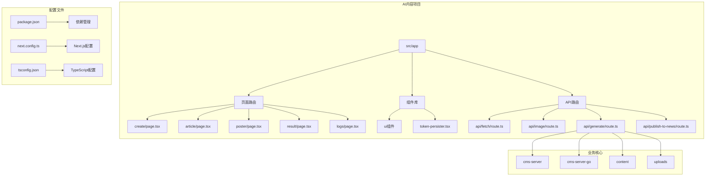

**图表来源**
- [package.json:1-100](file://ai-content-project/package.json#L1-L100)
- [next.config.ts:1-23](file://ai-content-project/next.config.ts#L1-L23)

### 核心技术栈

系统采用现代化的技术栈组合：

- **前端框架**: Next.js 16.1.1, React 19.2.3
- **UI组件库**: Radix UI + 自定义组件
- **状态管理**: React Hooks + Context API
- **构建工具**: Turbopack, TypeScript
- **样式系统**: Tailwind CSS
- **AI集成**: Coze Coding SDK, ffmpeg.wasm
- **后端服务**: Node.js/Express + Go/Gin

**章节来源**
- [package.json:15-75](file://ai-content-project/package.json#L15-L75)
- [package.json:62-68](file://ai-content-project/package.json#L62-L68)

## 核心组件

### 页面路由系统

系统采用Next.js App Router架构，实现了完整的页面路由体系：

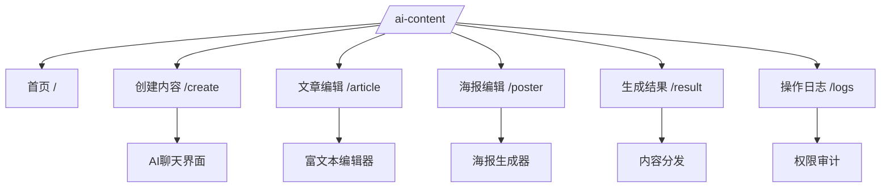

**图表来源**
- [layout.tsx:15-33](file://ai-content-project/src/app/layout.tsx#L15-L33)

### 组件层次结构

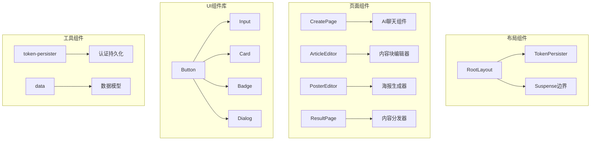

**图表来源**
- [layout.tsx:22-30](file://ai-content-project/src/app/layout.tsx#L22-L30)
- [token-persister.tsx:15-34](file://ai-content-project/src/components/token-persister.tsx#L15-L34)

**章节来源**
- [layout.tsx:1-34](file://ai-content-project/src/app/layout.tsx#L1-L34)
- [token-persister.tsx:1-38](file://ai-content-project/src/components/token-persister.tsx#L1-L38)

## 架构概览

### 整体系统架构

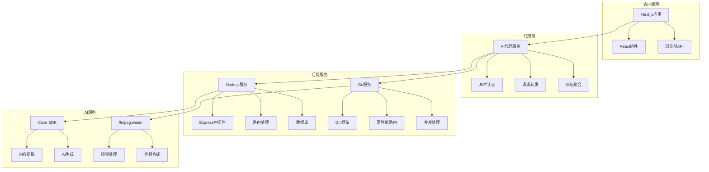

**图表来源**
- [app.js:163-225](file://cms-server/app.js#L163-L225)

### 数据流设计

系统采用双向数据流架构，支持实时内容生成和编辑：

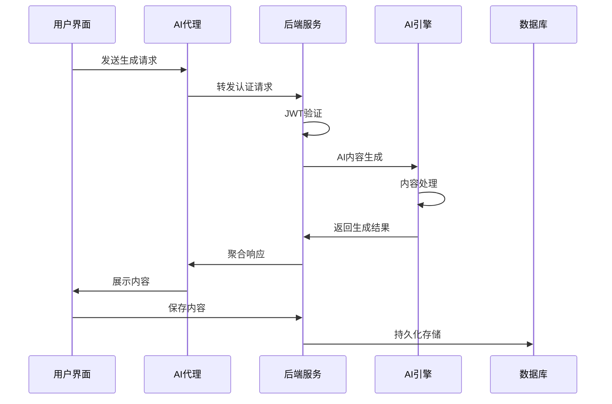

**图表来源**
- [create/page.tsx:376-395](file://ai-content-project/src/app/create/page.tsx#L376-L395)
- [app.js:168-196](file://cms-server/app.js#L168-L196)

**章节来源**
- [app.js:1-315](file://cms-server/app.js#L1-315)

## 详细组件分析

### AI内容生成模块

#### AI聊天助手组件

AI聊天助手是系统的核心交互组件，提供了智能化的内容生成体验：

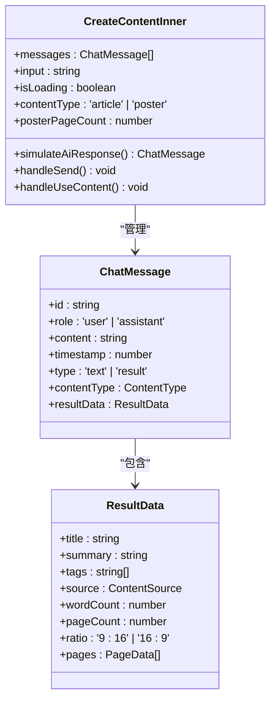

**图表来源**
- [create/page.tsx:59-422](file://ai-content-project/src/app/create/page.tsx#L59-L422)

#### 内容生成算法

系统实现了智能的内容生成算法，支持多种内容类型：

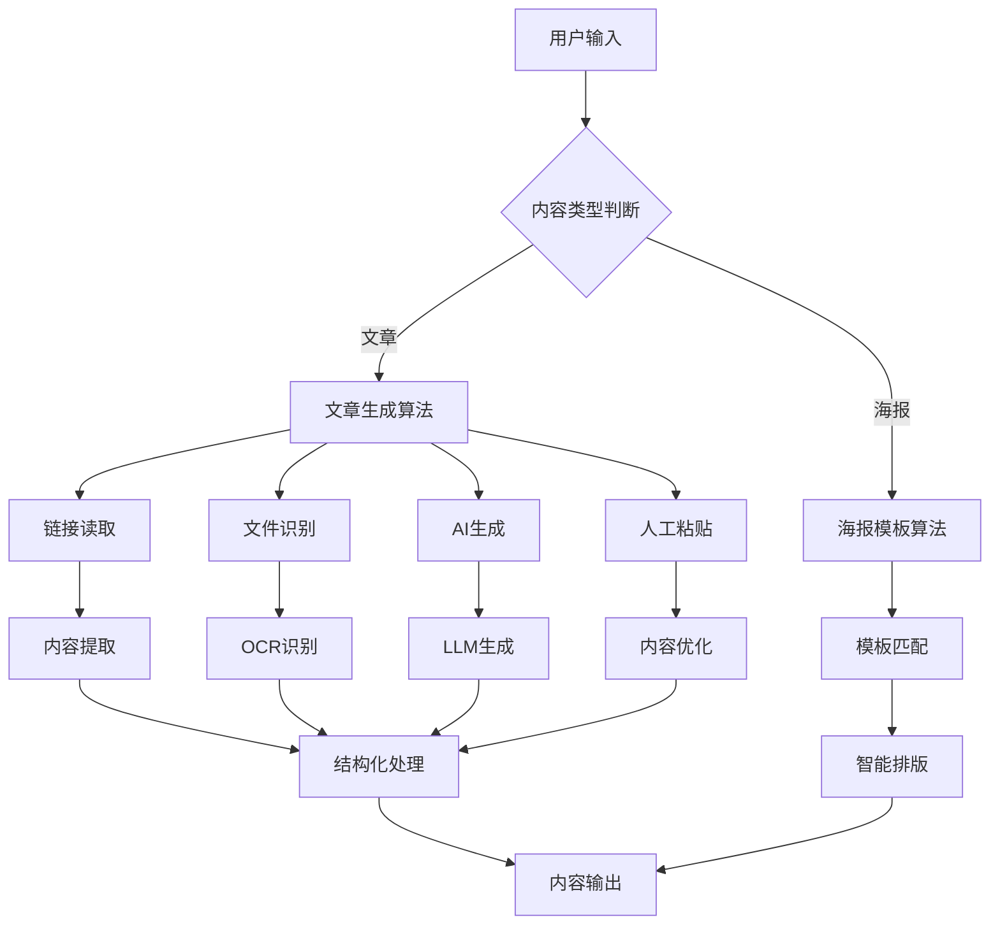

**图表来源**
- [create/page.tsx:154-374](file://ai-content-project/src/app/create/page.tsx#L154-L374)

#### 内容解析能力提升

系统新增了强大的内容解析能力，能够自动提取标题、摘要和标签：

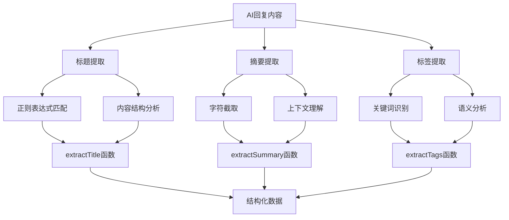

**图表来源**
- [create/page.tsx:376-412](file://ai-content-project/src/app/create/page.tsx#L376-L412)

**章节来源**
- [create/page.tsx:1-761](file://ai-content-project/src/app/create/page.tsx#L1-L761)

### 文章编辑器模块

#### 富文本编辑器

文章编辑器提供了专业的富文本编辑功能，支持多种内容块类型：

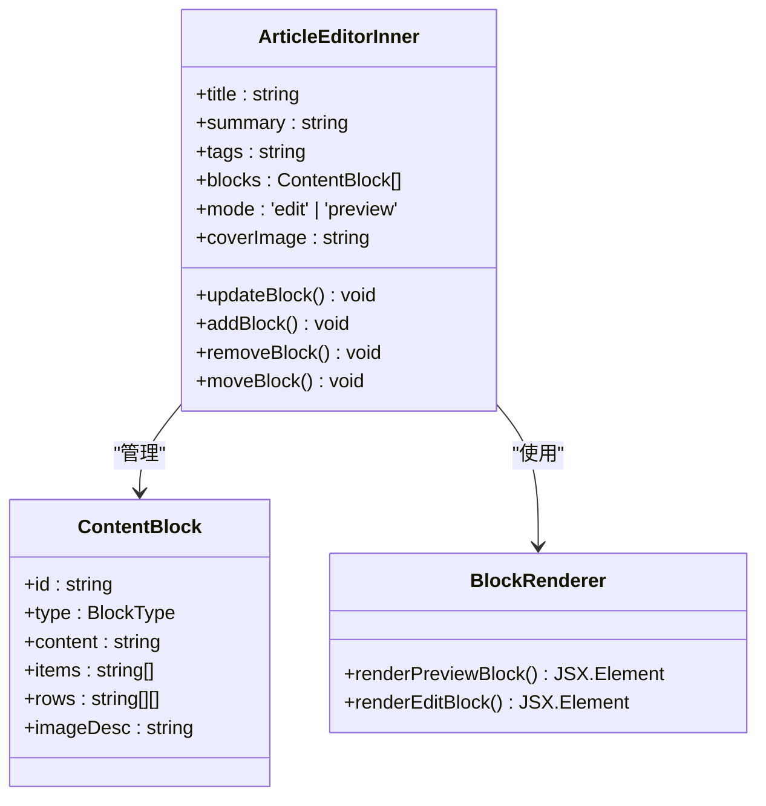

**图表来源**
- [article/page.tsx:198-622](file://ai-content-project/src/app/article/page.tsx#L198-L622)

#### 内容块类型系统

系统支持多种内容块类型，每种类型都有特定的编辑和渲染逻辑：

| 块类型 | 描述 | 编辑器 | 预览渲染 |
|--------|------|--------|----------|
| heading | 标题 | Input组件 | h2标签 |
| paragraph | 段落 | textarea | p标签 |
| image | 图片 | 图片选择器 | img标签 |
| list | 列表 | 动态输入 | ul列表 |
| table | 表格 | 网格编辑器 | HTML表格 |
| tip | 提示 | textarea | 警告卡片 |
| quote | 引用 | textarea | 引用块 |

#### 沙特新闻管理功能集成

系统集成了专门的沙特新闻管理功能，支持内容发布到沙特资讯平台：

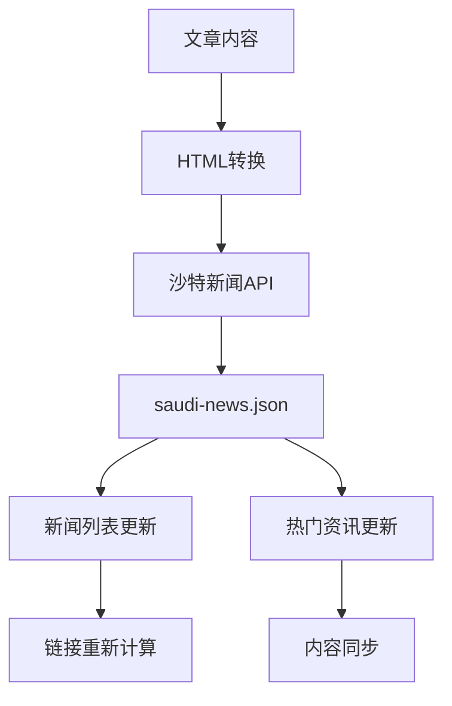

**图表来源**
- [article/page.tsx:308-382](file://ai-content-project/src/app/article/page.tsx#L308-L382)

**章节来源**
- [article/page.tsx:38-183](file://ai-content-project/src/app/article/page.tsx#L38-L183)

### 海报编辑器模块

#### 海报生成器

海报编辑器是系统的核心创意工具，支持复杂的视觉内容制作：

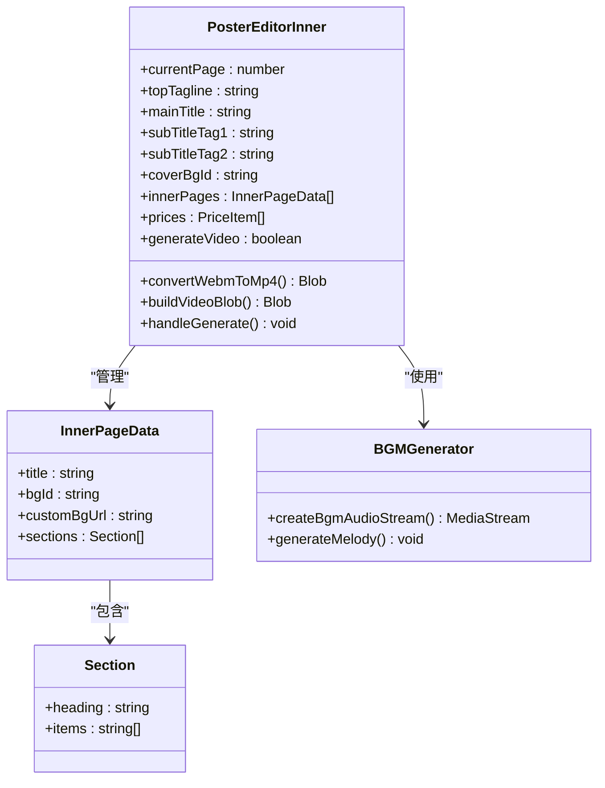

**图表来源**
- [poster/page.tsx:203-694](file://ai-content-project/src/app/poster/page.tsx#L203-L694)

#### 海报编辑器增强功能

系统新增了多项海报编辑器增强功能：

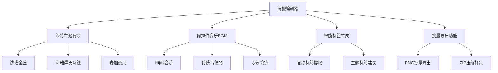

**图表来源**
- [poster/page.tsx:43-54](file://ai-content-project/src/app/poster/page.tsx#L43-L54)
- [data.ts:86-128](file://ai-content-project/src/lib/data.ts#L86-L128)

#### 视频处理系统

系统集成了完整的视频处理能力，支持实时视频生成和导出：

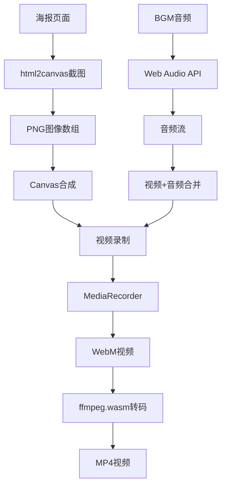

**图表来源**
- [poster/page.tsx:404-535](file://ai-content-project/src/app/poster/page.tsx#L404-L535)

**章节来源**
- [poster/page.tsx:1-800](file://ai-content-project/src/app/poster/page.tsx#L1-L800)

### AI代理服务配置

#### 认证机制

系统实现了多层认证机制，确保内容生成的安全性和可控性：

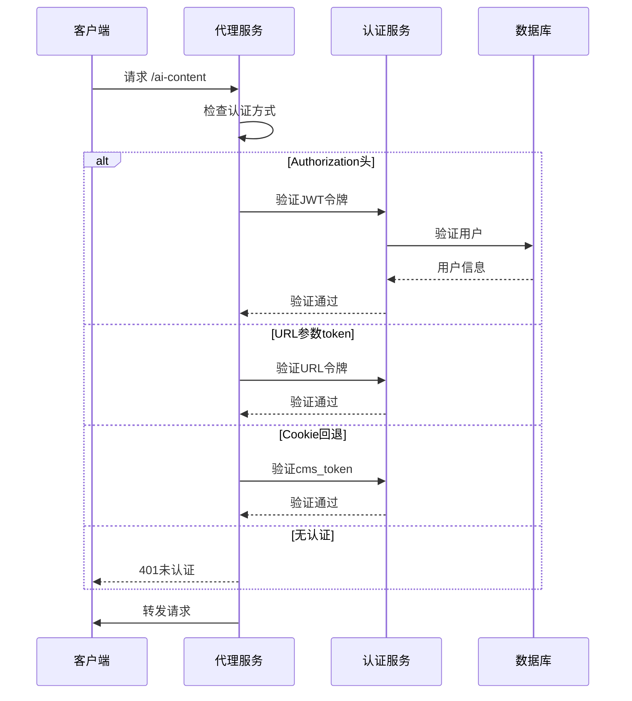

**图表来源**
- [app.js:168-196](file://cms-server/app.js#L168-L196)

#### AI渠道配置

系统支持多AI渠道管理，便于内容生成的灵活配置：

| 配置项 | 类型 | 描述 |
|--------|------|------|
| name | string | 渠道名称 |
| api_url | string | API地址 |
| api_key | string | 访问密钥 |
| model_list | string[] | 支持的模型列表 |
| is_default | boolean | 是否默认渠道 |
| created_by | number | 创建者ID |

#### 网络故障模拟响应机制

系统实现了智能的网络故障检测和模拟响应机制：

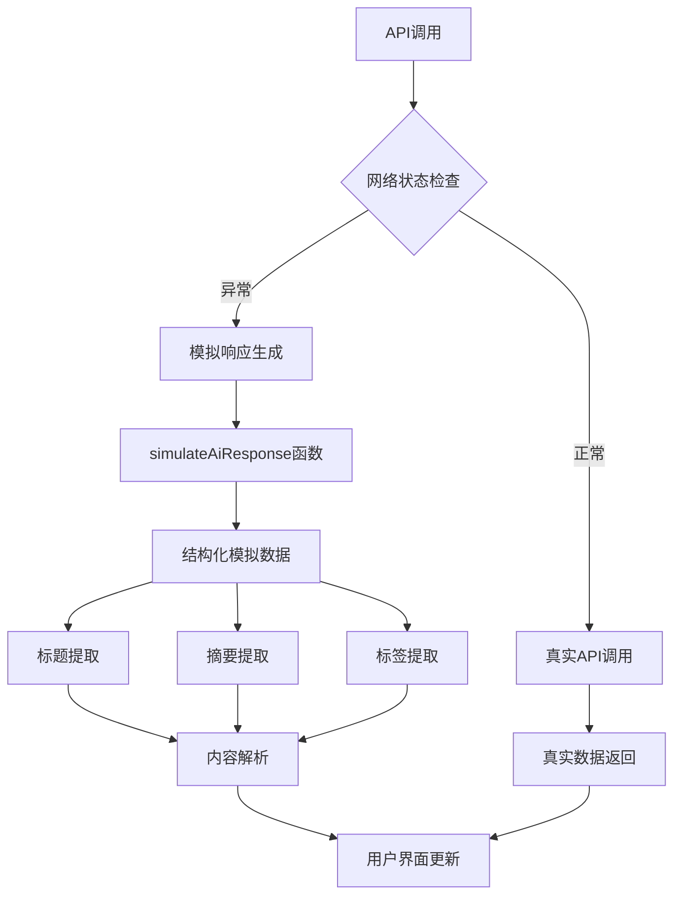

**图表来源**
- [create/page.tsx:487-495](file://ai-content-project/src/app/create/page.tsx#L487-L495)

**章节来源**
- [ai-channels.js:25-36](file://cms-server/routes/ai-channels.js#L25-L36)

### 数据模型设计

#### 内容管理系统

系统采用了统一的数据模型设计，支持不同类型内容的统一管理：

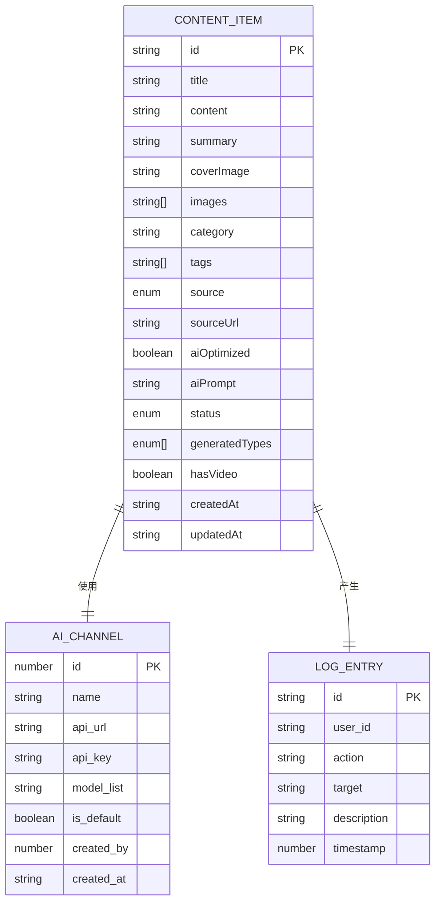

**图表来源**
- [data.ts:5-23](file://ai-content-project/src/lib/data.ts#L5-L23)

#### 沙特新闻数据模型

系统新增了专门的沙特新闻数据模型：

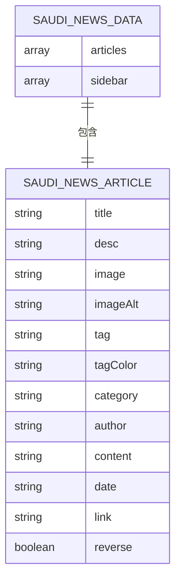

**图表来源**
- [publish-to-news/route.ts:7-17](file://ai-content-project/src/app/api/publish-to-news/route.ts#L7-L17)

**章节来源**
- [data.ts:1-218](file://ai-content-project/src/lib/data.ts#L1-L218)

### API路由设计

#### 内容抓取API

系统提供了专门的API路由来处理内容抓取和图片生成：

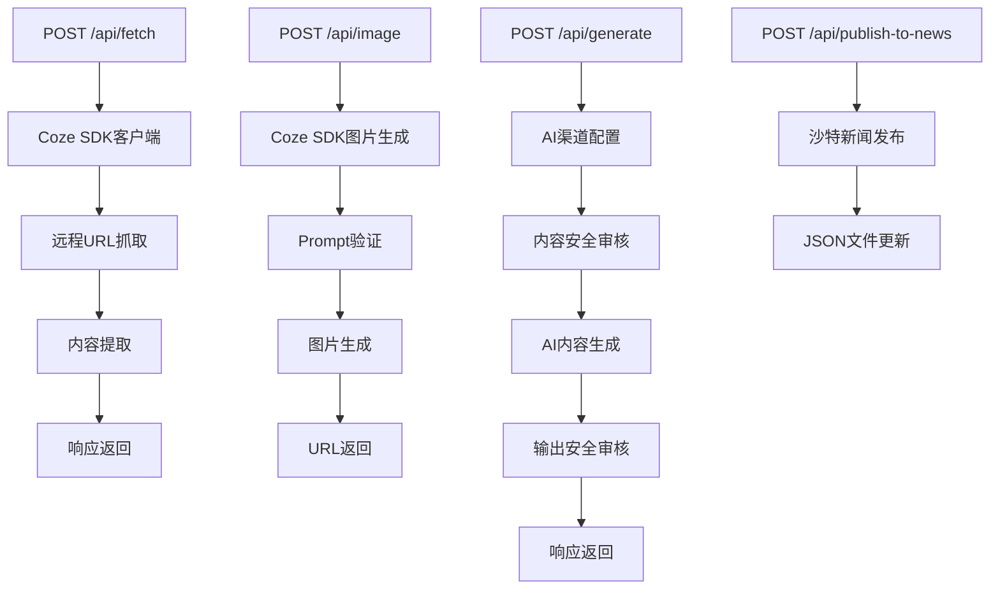

**图表来源**
- [route.ts:1-25](file://ai-content-project/src/app/api/fetch/route.ts#L1-L25)
- [route.ts:1-36](file://ai-content-project/src/app/api/image/route.ts#L1-L36)
- [route.ts:1-312](file://ai-content-project/src/app/api/generate/route.ts#L1-L312)
- [route.ts:1-82](file://ai-content-project/src/app/api/publish-to-news/route.ts#L1-L82)

#### 内容安全防护机制

系统实现了双层内容安全防护机制：

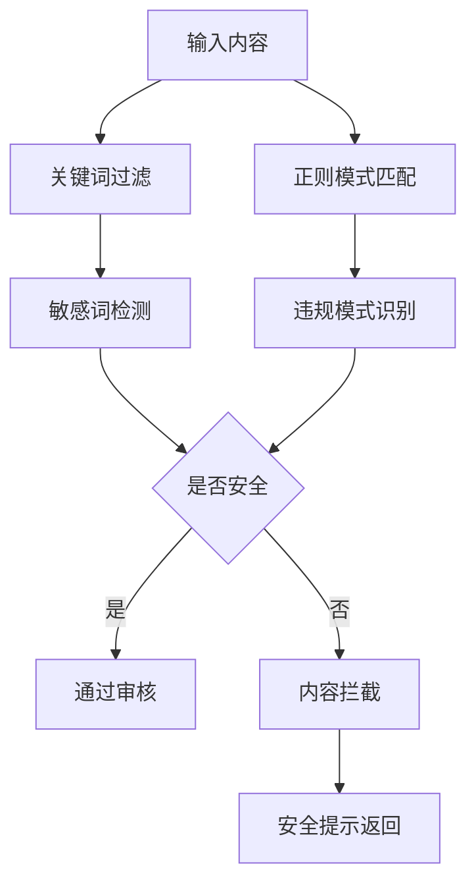

**图表来源**
- [generate/route.ts:72-120](file://ai-content-project/src/app/api/generate/route.ts#L72-L120)

**章节来源**
- [route.ts:1-25](file://ai-content-project/src/app/api/fetch/route.ts#L1-L25)
- [route.ts:1-36](file://ai-content-project/src/app/api/image/route.ts#L1-L36)
- [route.ts:1-312](file://ai-content-project/src/app/api/generate/route.ts#L1-L312)
- [route.ts:1-82](file://ai-content-project/src/app/api/publish-to-news/route.ts#L1-L82)

## 依赖关系分析

### 前端依赖关系

```mermaid
graph TB
subgraph "核心依赖"
A[next] --> B[React 19]
C[react-dom] --> B
D[typescript] --> E[类型系统]
end
subgraph "UI组件库"
F[lucide-react] --> G[图标系统]
H[@radix-ui/react-*] --> I[基础组件]
J[recharts] --> K[数据可视化]
end
subgraph "AI集成"
L[coze-coding-dev-sdk] --> M[内容提取]
N[@ffmpeg/ffmpeg] --> O[视频处理]
P[@ffmpeg/util] --> O
end
subgraph "工具库"
Q[html2canvas-pro] --> R[截图功能]
S[jszip] --> T[压缩处理]
U[zod] --> V[数据验证]
end
```

**图表来源**
- [package.json:15-75](file://ai-content-project/package.json#L15-L75)

### 后端服务依赖

```mermaid
graph TB
subgraph "Node.js服务"
A[express] --> B[CORS支持]
C[multer] --> D[文件上传]
E[jsonwebtoken] --> F[JWT认证]
G[better-sqlite3] --> H[SQLite数据库]
end
subgraph "Go服务"
I[gin-gonic/gin] --> J[HTTP框架]
K[golang-jwt/jwt/v5] --> L[JWT处理]
M[mattn/go-sqlite3] --> N[SQLite驱动]
end
subgraph "AI服务"
O[coze-coding-dev-sdk] --> P[内容服务]
Q[http-proxy-middleware] --> R[请求代理]
end
```

**图表来源**
- [app.js:6-11](file://cms-server/app.js#L6-L11)

**章节来源**
- [package.json:1-100](file://ai-content-project/package.json#L1-L100)
- [app.js:1-315](file://cms-server/app.js#L1-315)

## 性能考虑

### 前端性能优化

系统采用了多项性能优化策略：

1. **懒加载组件**: 使用React.lazy和Suspense实现组件懒加载
2. **虚拟滚动**: 对长列表使用虚拟滚动减少DOM节点
3. **图片优化**: 使用next/image组件实现响应式图片加载
4. **缓存策略**: 实现本地缓存和CDN加速
5. **代码分割**: 按路由进行代码分割，减少初始包体积

### 后端性能优化

```mermaid
flowchart TD
A[请求到达] --> B{请求类型}
B --> |静态资源| C[CDN缓存]
B --> |API请求| D[连接池复用]
B --> |AI请求| E[异步队列]
C --> F[快速响应]
D --> G[数据库连接复用]
E --> H[并发处理]
G --> I[减少连接开销]
H --> J[提高吞吐量]
F --> K[用户体验提升]
```

### 视频处理性能

系统针对视频处理进行了专门的性能优化：

- **WebAssembly加速**: 使用ffmpeg.wasm实现浏览器内视频处理
- **渐进式编码**: 支持边播边录的视频生成
- **内存管理**: 实现高效的内存回收机制
- **并发处理**: 支持多任务并发处理

**章节来源**
- [poster/page.tsx:271-292](file://ai-content-project/src/app/poster/page.tsx#L271-L292)

## 故障排除指南

### 常见问题诊断

#### 认证相关问题

| 问题症状 | 可能原因 | 解决方案 |
|----------|----------|----------|
| 401未认证 | 令牌过期或格式错误 | 检查JWT令牌有效性 |
| 403权限不足 | 用户角色权限不够 | 验证用户角色和页面权限 |
| 代理失败 | CORS配置问题 | 检查CORS允许的域名 |
| iframe认证丢失 | Cookie跨域问题 | 使用TokenPersister组件 |

#### AI内容生成问题

| 问题症状 | 可能原因 | 解决方案 |
|----------|----------|----------|
| 生成超时 | AI服务响应慢 | 检查网络连接和AI服务状态 |
| 内容质量差 | 提示词不明确 | 优化提示词结构和细节描述 |
| 图片加载失败 | Pexels API限制 | 使用备用图片源或本地上传 |
| 视频生成失败 | 浏览器兼容性 | 检查MediaRecorder支持情况 |
| 内容安全拦截 | 敏感内容检测 | 调整输入内容或提示词 |

#### 性能问题

| 问题症状 | 可能原因 | 解决方案 |
|----------|----------|----------|
| 页面加载慢 | 资源过大 | 启用图片压缩和懒加载 |
| 内存泄漏 | 组件未清理 | 检查事件监听器和定时器清理 |
| 视频处理卡顿 | CPU占用过高 | 降低视频分辨率或帧率 |
| 并发请求过多 | 服务器压力大 | 实现请求节流和缓存机制 |

#### 网络故障模拟响应

| 问题症状 | 可能原因 | 解决方案 |
|----------|----------|----------|
| API调用失败 | 网络不稳定 | 系统自动回退到模拟响应 |
| 模拟响应延迟 | 本地处理耗时 | 优化simulateAiResponse函数 |
| 标题提取错误 | 内容格式变化 | 更新extractTitle函数逻辑 |

**章节来源**
- [token-persister.tsx:15-34](file://ai-content-project/src/components/token-persister.tsx#L15-L34)
- [logs/page.tsx:34-193](file://ai-content-project/src/app/logs/page.tsx#L34-L193)

### 调试工具和技巧

1. **浏览器开发者工具**: 使用Network面板监控API请求
2. **日志系统**: 实现详细的错误日志记录
3. **性能分析**: 使用React DevTools分析组件性能
4. **网络监控**: 监控AI服务的响应时间和成功率
5. **模拟响应测试**: 验证handleSend函数的错误处理逻辑

### 开发脚本说明

系统提供了完整的开发脚本支持：

- **build.sh**: 生产环境构建脚本
- **dev.sh**: 开发环境启动脚本
- **start.sh**: 应用启动脚本
- **validate.sh**: 代码验证脚本
- **prepare.sh**: 项目准备脚本

**章节来源**
- [package.json:5-13](file://ai-content-project/package.json#L5-L13)

## 结论

AI内容生成系统是一个功能完整、架构清晰的现代化内容创作平台。系统通过合理的组件设计、完善的认证机制、高效的内容解析能力和智能的网络故障处理，为用户提供了优质的AI内容生成体验。

### 系统优势

1. **技术先进性**: 采用最新的React 19和Next.js 16技术栈
2. **功能完整性**: 覆盖内容生成、编辑、分发的完整流程
3. **扩展性强**: 模块化设计便于功能扩展和维护
4. **用户体验佳**: 智能化的AI交互和直观的操作界面
5. **安全性强**: 多层内容安全防护和认证机制
6. **鲁棒性强**: 网络故障时的智能模拟响应机制

### 新增功能亮点

1. **内容解析能力提升**: 自动提取标题、摘要、标签，提升内容质量
2. **沙特新闻管理**: 专门的内容发布到沙特资讯平台功能
3. **海报编辑器增强**: 沙特主题背景、阿拉伯音乐BGM、智能标签生成
4. **网络故障处理**: 智能模拟响应机制，确保系统稳定性

### 发展方向

1. **AI能力增强**: 集成更多AI模型和服务
2. **性能优化**: 进一步提升视频处理和内容生成效率
3. **生态建设**: 开发插件系统和第三方集成能力
4. **国际化**: 支持多语言和多地区内容管理
5. **内容质量**: 增强内容审核和质量控制机制

该系统为内容创作者提供了强大的技术支持，通过智能化的AI工具大大提升了内容生产的效率和质量。