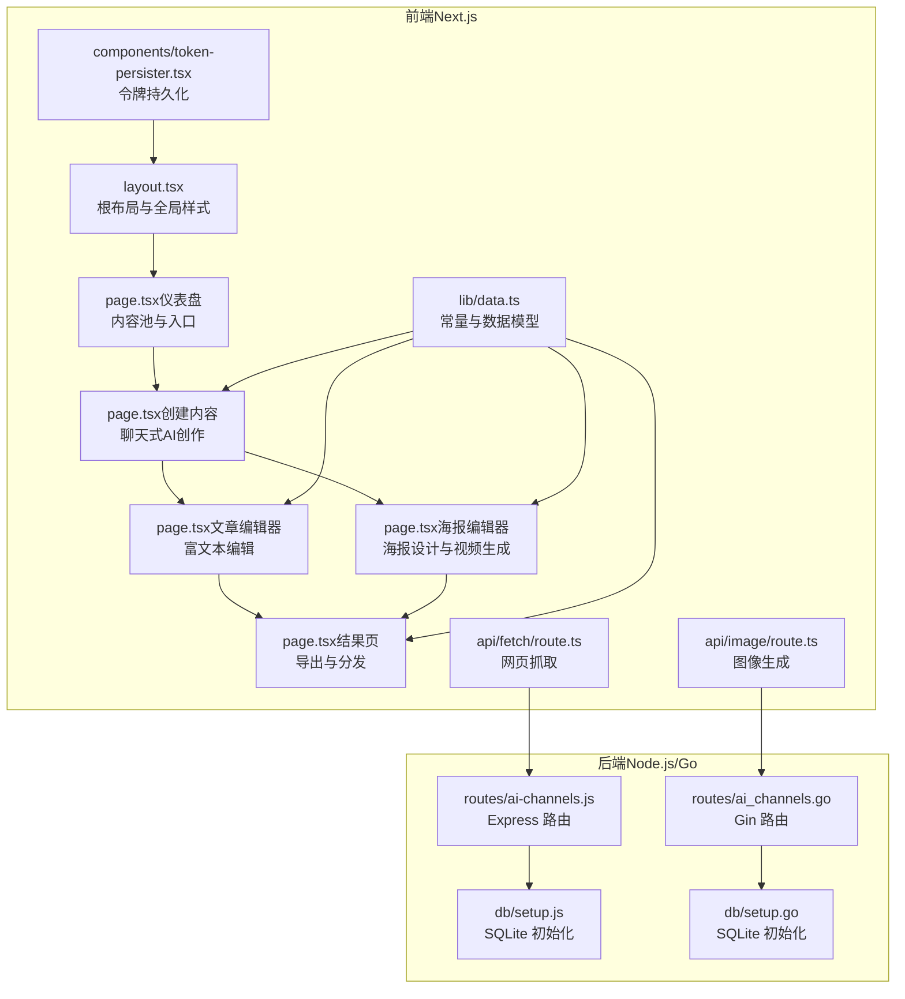
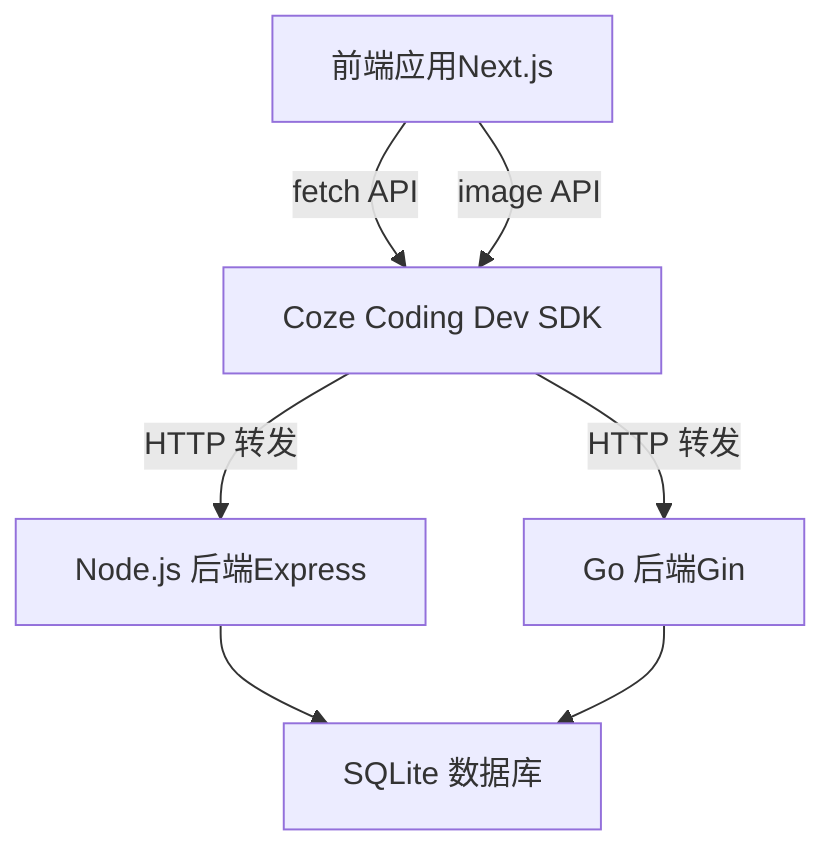
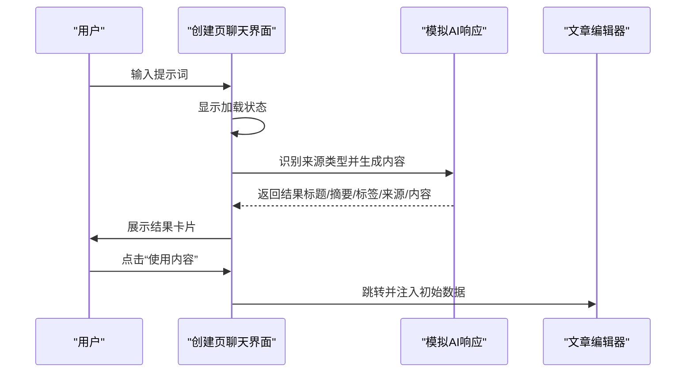
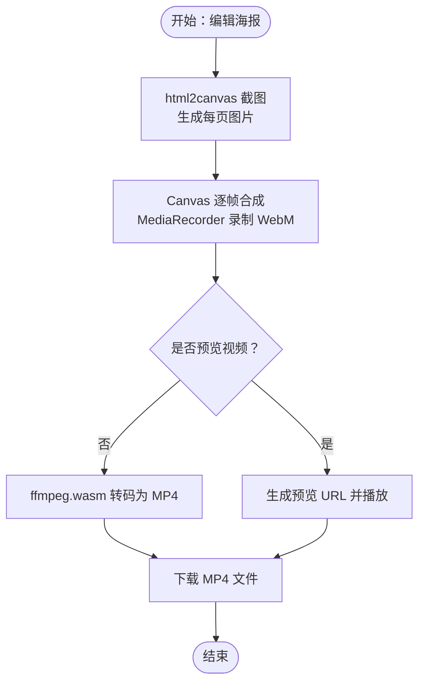
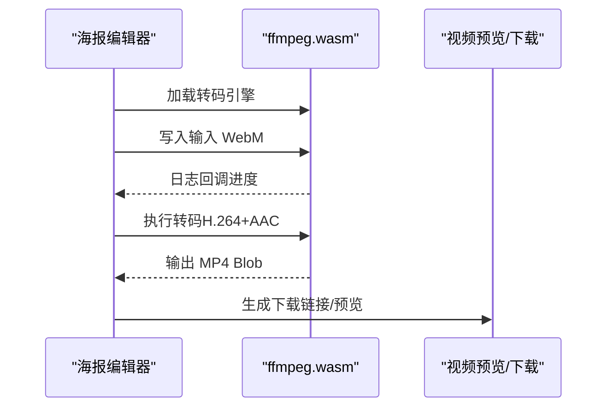
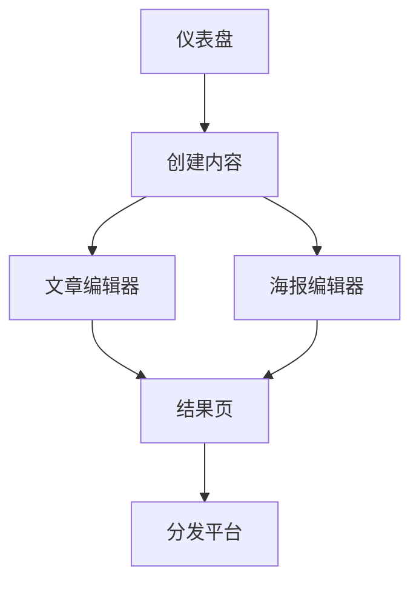
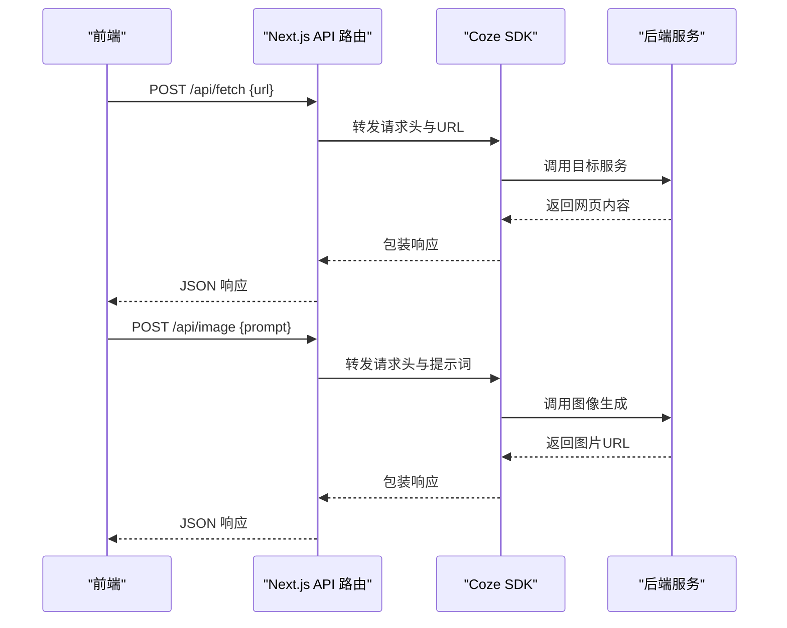
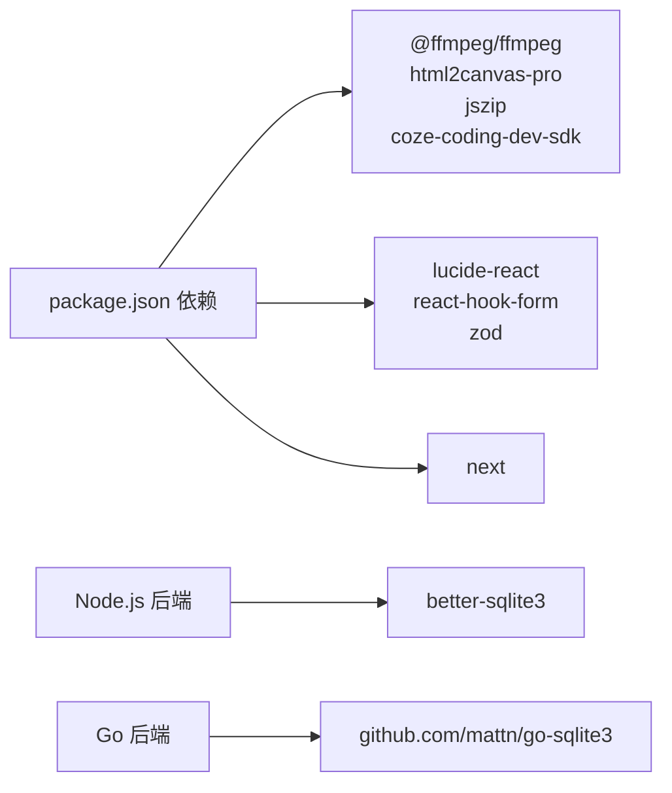

# AI功能模块

<cite>
**本文档引用的文件**
- [package.json](file://ai-content-project/package.json)
- [layout.tsx](file://ai-content-project/src/app/layout.tsx)
- [page.tsx（仪表盘）](file://ai-content-project/src/app/page.tsx)
- [page.tsx（创建内容）](file://ai-content-project/src/app/create/page.tsx)
- [page.tsx（文章编辑器）](file://ai-content-project/src/app/article/page.tsx)
- [page.tsx（海报编辑器）](file://ai-content-project/src/app/poster/page.tsx)
- [page.tsx（结果页）](file://ai-content-project/src/app/result/page.tsx)
- [data.ts](file://ai-content-project/src/lib/data.ts)
- [token-persister.tsx](file://ai-content-project/src/components/token-persister.tsx)
- [route.ts（fetch）](file://ai-content-project/src/app/api/fetch/route.ts)
- [route.ts（image）](file://ai-content-project/src/app/api/image/route.ts)
- [ai-channels.js](file://business-core/cms-server/routes/ai-channels.js)
- [ai_channels.go](file://business-core/cms-server-go/routes/ai_channels.go)
- [setup.js](file://business-core/cms-server/db/setup.js)
- [setup.go](file://business-core/cms-server-go/db/setup.go)
</cite>

## 目录
1. [简介](#简介)
2. [项目结构](#项目结构)
3. [核心组件](#核心组件)
4. [架构总览](#架构总览)
5. [详细组件分析](#详细组件分析)
6. [依赖分析](#依赖分析)
7. [性能考虑](#性能考虑)
8. [故障排除指南](#故障排除指南)
9. [结论](#结论)
10. [附录](#附录)

## 简介
本文件为“AI功能模块”的全面技术文档，覆盖以下能力：
- 文章生成功能：提示词驱动的智能创作、来源类型识别、内容优化与分发。
- 海报编辑器：可视化海报设计、批量导出、视频合成与转码。
- 视频处理系统：浏览器内转码（ffmpeg.wasm）、WebM→MP4、BGM音轨合成、渐进式播放预览。
- 用户界面与交互：聊天式引导、编辑器双模式（编辑/预览）、图片选择器、分发平台集成。
- 后端支撑：AI渠道配置（模型列表、默认渠道）、数据库初始化与审计日志。

## 项目结构
前端采用 Next.js 应用程序，后端提供 AI 渠道配置接口；两者通过统一的数据库与鉴权机制协同工作。

**图表来源**
- [layout.tsx:1-34](file://ai-content-project/src/app/layout.tsx#L1-L34)
- [page.tsx（仪表盘）:1-285](file://ai-content-project/src/app/page.tsx#L1-L285)
- [page.tsx（创建内容）:1-761](file://ai-content-project/src/app/create/page.tsx#L1-L761)
- [page.tsx（文章编辑器）:1-800](file://ai-content-project/src/app/article/page.tsx#L1-L800)
- [page.tsx（海报编辑器）:1-800](file://ai-content-project/src/app/poster/page.tsx#L1-L800)
- [page.tsx（结果页）:1-800](file://ai-content-project/src/app/result/page.tsx#L1-L800)
- [route.ts（fetch）:1-25](file://ai-content-project/src/app/api/fetch/route.ts#L1-L25)
- [route.ts（image）:1-36](file://ai-content-project/src/app/api/image/route.ts#L1-L36)
- [ai-channels.js:1-113](file://business-core/cms-server/routes/ai-channels.js#L1-L113)
- [ai_channels.go:1-197](file://business-core/cms-server-go/routes/ai_channels.go#L1-L197)
- [setup.js:1-115](file://business-core/cms-server/db/setup.js#L1-L115)
- [setup.go:1-187](file://business-core/cms-server-go/db/setup.go#L1-L187)

**章节来源**
- [package.json:1-100](file://ai-content-project/package.json#L1-L100)
- [layout.tsx:1-34](file://ai-content-project/src/app/layout.tsx#L1-L34)

## 核心组件
- 聊天式AI创作（创建页）：支持多种来源类型（链接读取、文件识别、AI生成、人工粘贴），模拟响应与结果卡片，支持“使用内容”跳转至文章或海报编辑器。
- 文章编辑器：富文本块（标题、段落、图片、列表、表格、提示、引用）编辑，支持封面图、摘要、标签、编辑/预览模式切换。
- 海报编辑器：封面与内页模板、背景图选择（预设/自定义）、BGM音轨生成、浏览器内视频合成（WebM）、转码为MP4、批量PNG导出与ZIP打包。
- 结果页：海报翻页预览、一键复制标题与标签、视频生成与预览、分发平台一键打开。
- AI渠道配置：前后端均提供REST接口，支持增删改查、设为默认、审计日志。
- 数据与UI常量：内容项模型、来源/状态颜色映射、BGM选项、分享平台、标签生成规则。

**章节来源**
- [page.tsx（创建内容）:1-761](file://ai-content-project/src/app/create/page.tsx#L1-L761)
- [page.tsx（文章编辑器）:1-800](file://ai-content-project/src/app/article/page.tsx#L1-L800)
- [page.tsx（海报编辑器）:1-800](file://ai-content-project/src/app/poster/page.tsx#L1-L800)
- [page.tsx（结果页）:1-800](file://ai-content-project/src/app/result/page.tsx#L1-L800)
- [data.ts:1-218](file://ai-content-project/src/lib/data.ts#L1-L218)
- [ai-channels.js:1-113](file://business-core/cms-server/routes/ai-channels.js#L1-L113)
- [ai_channels.go:1-197](file://business-core/cms-server-go/routes/ai_channels.go#L1-L197)

## 架构总览
前端通过Next.js应用承载，后端提供AI渠道配置接口，二者共享SQLite数据库。前端通过SDK封装的API转发请求，实现网页抓取与图像生成。

**图表来源**
- [route.ts（fetch）:1-25](file://ai-content-project/src/app/api/fetch/route.ts#L1-L25)
- [route.ts（image）:1-36](file://ai-content-project/src/app/api/image/route.ts#L1-L36)
- [ai-channels.js:1-113](file://business-core/cms-server/routes/ai-channels.js#L1-L113)
- [ai_channels.go:1-197](file://business-core/cms-server-go/routes/ai_channels.go#L1-L197)
- [setup.js:1-115](file://business-core/cms-server/db/setup.js#L1-L115)
- [setup.go:1-187](file://business-core/cms-server-go/db/setup.go#L1-L187)

## 详细组件分析

### 文章生成功能
- 输入与来源识别：根据用户输入关键词识别来源类型（链接、文件、AI生成、粘贴），模拟不同类型的优化结果。
- 输出结构：标题、摘要、标签、来源、字数统计、分页信息（海报模式）。
- 交互流程：发送消息→加载状态→生成结果→“使用内容”跳转编辑器。

**图表来源**
- [page.tsx（创建内容）:154-374](file://ai-content-project/src/app/create/page.tsx#L154-L374)
- [page.tsx（文章编辑器）:198-214](file://ai-content-project/src/app/article/page.tsx#L198-L214)

**章节来源**
- [page.tsx（创建内容）:1-761](file://ai-content-project/src/app/create/page.tsx#L1-L761)
- [data.ts:1-218](file://ai-content-project/src/lib/data.ts#L1-L218)

### 海报编辑器设计与导出
- 模板与布局：封面+多内页，支持9:16竖版与16:9横版，预设背景与自定义背景。
- 编辑能力：标题/副标题标签、价格卡片、内页板块与条目编辑、背景图替换。
- 导出与视频：html2canvas截图→Canvas逐帧合成→MediaRecorder录制→WebM预览→ffmpeg.wasm转码MP4→批量PNG导出与ZIP打包。
- BGM音轨：基于Web Audio API生成Hijaz音阶旋律，可叠加到视频轨道。

**图表来源**
- [page.tsx（海报编辑器）:357-535](file://ai-content-project/src/app/poster/page.tsx#L357-L535)

**章节来源**
- [page.tsx（海报编辑器）:1-800](file://ai-content-project/src/app/poster/page.tsx#L1-L800)
- [page.tsx（结果页）:1-800](file://ai-content-project/src/app/result/page.tsx#L1-L800)

### 视频处理系统（浏览器内转码与质量控制）
- 转码参数：H.264 视频编码、AAC 音频编码、像素格式 yuv420p、CRF 23、快速启动（movflags +faststart）。
- 质量与兼容：在浏览器内使用 ffmpeg.wasm，兼顾兼容性与性能；WebM→MP4确保跨平台播放。
- 进度反馈：监听转码日志提取进度信息，实时更新UI。

**图表来源**
- [page.tsx（海报编辑器）:275-331](file://ai-content-project/src/app/poster/page.tsx#L275-L331)

**章节来源**
- [page.tsx（海报编辑器）:1-800](file://ai-content-project/src/app/poster/page.tsx#L1-L800)

### 用户界面与交互流程
- 仪表盘：内容池筛选与搜索、状态徽标、操作入口（生成/查看）。
- 创建页：快捷提示词、类型切换（文章/海报）、页数调节、结果卡片操作。
- 文章编辑器：封面图选择、标题/摘要/标签、内容块增删改、编辑/预览切换。
- 海报编辑器：封面/内页切换、背景图选择、BGM选择、生成/预览/下载。
- 结果页：海报翻页、一键复制标题与标签、视频生成与分发平台集成。

**图表来源**
- [page.tsx（仪表盘）:127-196](file://ai-content-project/src/app/page.tsx#L127-L196)
- [page.tsx（创建内容）:656-743](file://ai-content-project/src/app/create/page.tsx#L656-L743)
- [page.tsx（文章编辑器）:624-774](file://ai-content-project/src/app/article/page.tsx#L624-L774)
- [page.tsx（海报编辑器）:1-800](file://ai-content-project/src/app/poster/page.tsx#L1-L800)
- [page.tsx（结果页）:1-800](file://ai-content-project/src/app/result/page.tsx#L1-L800)

**章节来源**
- [page.tsx（仪表盘）:1-285](file://ai-content-project/src/app/page.tsx#L1-L285)
- [page.tsx（创建内容）:1-761](file://ai-content-project/src/app/create/page.tsx#L1-L761)
- [page.tsx（文章编辑器）:1-800](file://ai-content-project/src/app/article/page.tsx#L1-L800)
- [page.tsx（海报编辑器）:1-800](file://ai-content-project/src/app/poster/page.tsx#L1-L800)
- [page.tsx（结果页）:1-800](file://ai-content-project/src/app/result/page.tsx#L1-L800)

### 状态管理与数据传递
- 创建页：消息列表、输入框、加载状态、复制状态、海报页数。
- 文章编辑器：标题/摘要/标签、封面图、内容块数组、编辑/预览模式、分发开关。
- 海报编辑器：封面/内页字段、背景图、BGM、视频生成状态、画廊预览。
- 结果页：海报翻页索引、视频生成状态、BGM模式与上传文件、导出状态。

**章节来源**
- [page.tsx（创建内容）:59-430](file://ai-content-project/src/app/create/page.tsx#L59-L430)
- [page.tsx（文章编辑器）:198-271](file://ai-content-project/src/app/article/page.tsx#L198-L271)
- [page.tsx（海报编辑器）:203-270](file://ai-content-project/src/app/poster/page.tsx#L203-L270)
- [page.tsx（结果页）:227-290](file://ai-content-project/src/app/result/page.tsx#L227-L290)

### API调用示例与错误处理
- 网页抓取API（POST /api/fetch）
  - 请求体：{ url: string }
  - 成功响应：{ title, content, url, status_code }
  - 错误处理：捕获异常并返回500
- 图像生成API（POST /api/image）
  - 请求体：{ prompt: string }
  - 成功响应：{ imageUrl }
  - 错误处理：校验参数与生成结果，返回500

**图表来源**
- [route.ts（fetch）:1-25](file://ai-content-project/src/app/api/fetch/route.ts#L1-L25)
- [route.ts（image）:1-36](file://ai-content-project/src/app/api/image/route.ts#L1-L36)

**章节来源**
- [route.ts（fetch）:1-25](file://ai-content-project/src/app/api/fetch/route.ts#L1-L25)
- [route.ts（image）:1-36](file://ai-content-project/src/app/api/image/route.ts#L1-L36)

### 模块间协作与数据传递
- 令牌持久化：通过URL查询参数写入cookie，解决iframe内客户端导航丢失token的问题。
- 数据传递：创建页将海报分页数据写入sessionStorage，供海报编辑器读取；结果页通过隐藏全尺寸渲染区进行视频截图合成。

**章节来源**
- [token-persister.tsx:1-38](file://ai-content-project/src/components/token-persister.tsx#L1-L38)
- [page.tsx（创建内容）:412-422](file://ai-content-project/src/app/create/page.tsx#L412-L422)
- [page.tsx（结果页）:287-316](file://ai-content-project/src/app/result/page.tsx#L287-L316)

## 依赖分析
- 前端依赖：@ffmpeg/ffmpeg、@ffmpeg/util、html2canvas-pro、jszip、coze-coding-dev-sdk、react-hook-form、lucide-react、next、zod等。
- 后端依赖：Express/Gin、better-sqlite3/golang.org/x/crypto/bcrypt、sqlite3驱动、审计中间件。

**图表来源**
- [package.json:15-75](file://ai-content-project/package.json#L15-L75)
- [ai-channels.js:12-23](file://business-core/cms-server/routes/ai-channels.js#L12-L23)
- [ai_channels.go:3-15](file://business-core/cms-server-go/routes/ai_channels.go#L3-L15)

**章节来源**
- [package.json:1-100](file://ai-content-project/package.json#L1-L100)
- [ai-channels.js:1-113](file://business-core/cms-server/routes/ai-channels.js#L1-L113)
- [ai_channels.go:1-197](file://business-core/cms-server-go/routes/ai_channels.go#L1-L197)

## 性能考虑
- 浏览器内转码：使用ffmpeg.wasm，参数偏向兼容与速度（ultrafast、yuv420p、CRF 23），适合移动端与弱设备。
- 截图与合成：html2canvas高倍率截图（scale: 4）换取高质量导出；Canvas逐帧合成时注意帧率与淡入淡出效果的平滑过渡。
- 图片资源：Pexels图片直链与本地回退策略，减少二次请求失败风险。
- 状态更新：React状态粒度合理划分，避免不必要的重渲染；图片选择器异步加载与缓存结果。

## 故障排除指南
- token丢失导致401：确认URL包含token且已被写入cookie；检查SameSite/Lax设置与路径。
- 网页抓取失败：检查目标站点反爬策略与网络连通性；确认SDK转发头正确。
- 图像生成失败：检查提示词合法性与后端可用性；查看错误信息集合。
- 海报截图失败：确认DOM元素已渲染；检查CORS与allowTaint配置；降低截图scale验证问题。
- 视频转码失败：确认浏览器支持的MIME类型；检查ffmpeg.wasm加载与日志回调；确保清理临时文件。

**章节来源**
- [token-persister.tsx:1-38](file://ai-content-project/src/components/token-persister.tsx#L1-L38)
- [route.ts（fetch）:1-25](file://ai-content-project/src/app/api/fetch/route.ts#L1-L25)
- [route.ts（image）:1-36](file://ai-content-project/src/app/api/image/route.ts#L1-L36)
- [page.tsx（海报编辑器）:357-389](file://ai-content-project/src/app/poster/page.tsx#L357-L389)

## 结论
本AI功能模块以“聊天式引导+可视化编辑+浏览器内视频处理”为核心，结合前后端统一的AI渠道配置与SQLite数据库，实现了从内容生成到海报设计与视频导出的一体化工作流。通过合理的状态管理、UI交互与性能优化策略，能够在保证易用性的同时满足多场景内容生产需求。

## 附录
- 数据模型与常量：内容项、来源/状态颜色映射、BGM选项、分享平台、标签生成规则。
- 数据库初始化：users、page_permissions、audit_log、ai_channels表结构与默认超级管理员。

**章节来源**
- [data.ts:1-218](file://ai-content-project/src/lib/data.ts#L1-L218)
- [setup.js:55-104](file://business-core/cms-server/db/setup.js#L55-L104)
- [setup.go:92-172](file://business-core/cms-server-go/db/setup.go#L92-L172)