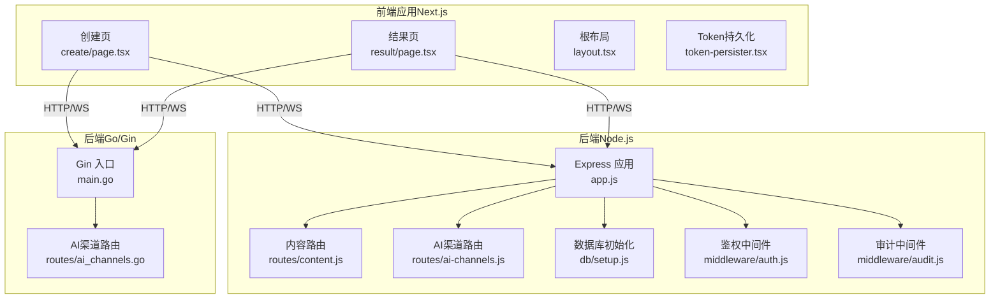
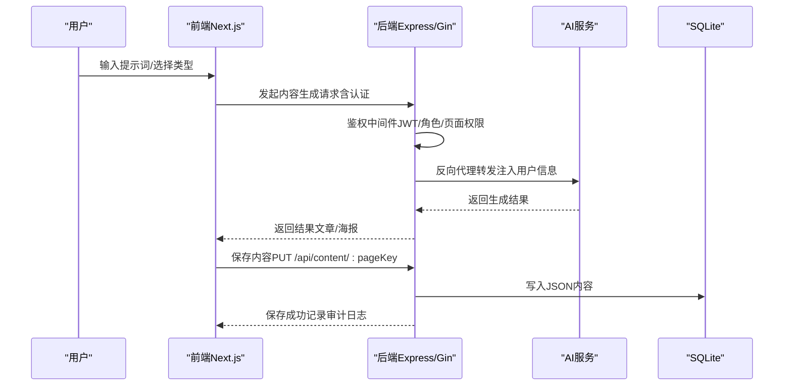
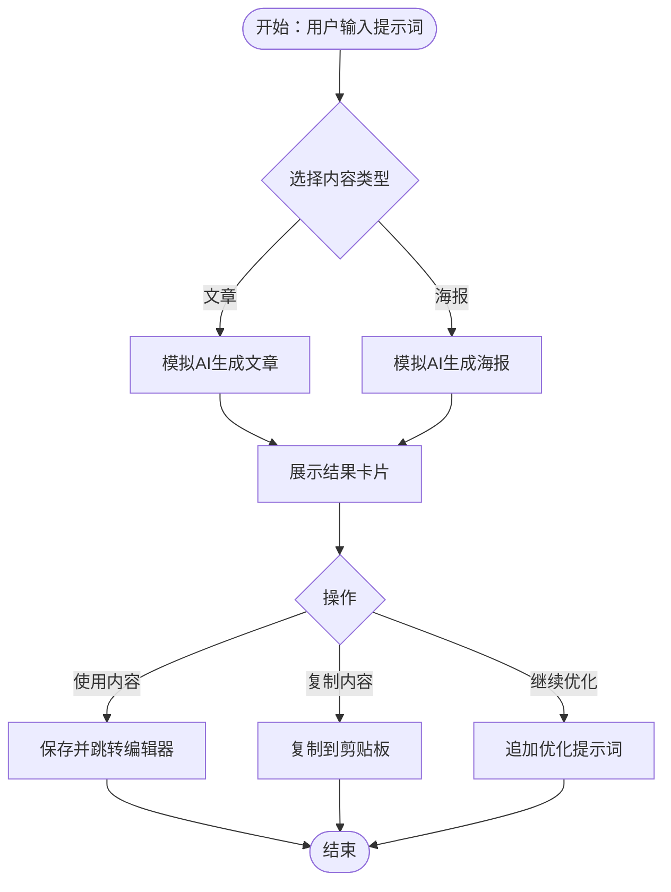
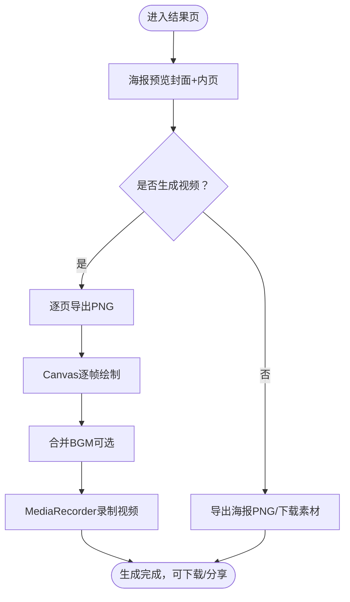
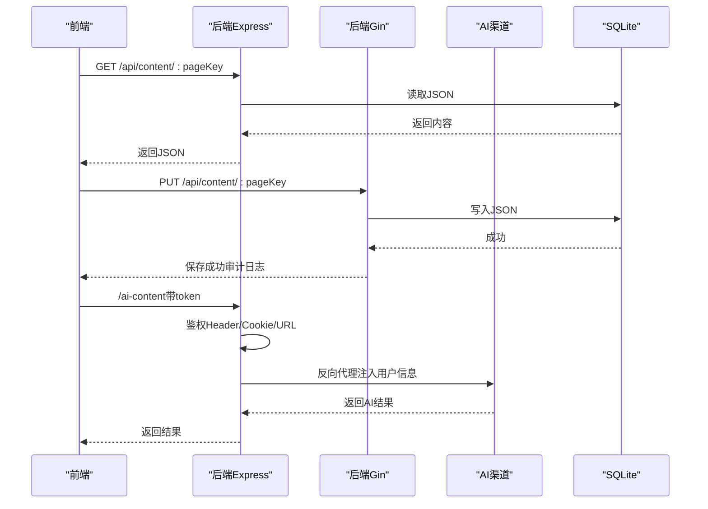
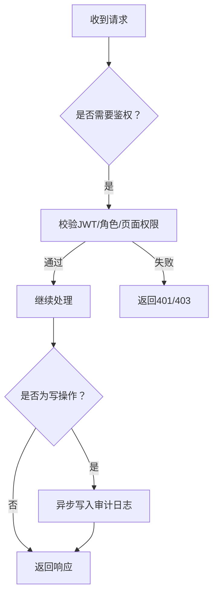
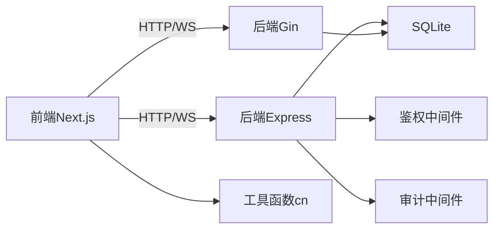

# 内容创作工作流

<cite>
**本文引用的文件**
- [package.json](file://ai-content-project/package.json)
- [layout.tsx](file://ai-content-project/src/app/layout.tsx)
- [create/page.tsx](file://ai-content-project/src/app/create/page.tsx)
- [result/page.tsx](file://ai-content-project/src/app/result/page.tsx)
- [DESIGN.md](file://ai-content-project/DESIGN.md)
- [token-persister.tsx](file://ai-content-project/src/components/token-persister.tsx)
- [app.js](file://business-core/cms-server/app.js)
- [main.go](file://business-core/cms-server-go/main.go)
- [content.js](file://business-core/cms-server/routes/content.js)
- [ai-channels.js](file://business-core/cms-server/routes/ai-channels.js)
- [ai_channels.go](file://business-core/cms-server-go/routes/ai_channels.go)
- [auth.js](file://business-core/cms-server/middleware/auth.js)
- [audit.js](file://business-core/cms-server/middleware/audit.js)
- [setup.js](file://business-core/cms-server/db/setup.js)
- [utils.ts](file://ai-content-project/src/lib/utils.ts)
</cite>

## 目录
1. [引言](#引言)
2. [项目结构](#项目结构)
3. [核心组件](#核心组件)
4. [架构总览](#架构总览)
5. [详细组件分析](#详细组件分析)
6. [依赖关系分析](#依赖关系分析)
7. [性能考量](#性能考量)
8. [故障排查指南](#故障排查指南)
9. [结论](#结论)
10. [附录](#附录)

## 引言
本文件面向“AI内容创作工作流”的端到端流程与系统设计，覆盖从提示词输入、AI生成、内容审核、编辑与发布，到质量控制、批量处理与自动化、性能监控与用户体验优化的完整闭环。文档同时解释AI助手的交互设计（智能提示、上下文理解、对话管理）、内容质量控制机制（审核、格式校验、一致性检查），以及工作流优化策略与故障恢复机制。

## 项目结构
该项目采用前后端分离与多语言并行的架构：
- 前端：Next.js 应用，负责内容创作、海报编辑与结果导出、视频生成等交互界面。
- 后端（Node.js）：Express 服务，提供内容读写、AI代理、静态资源托管、预览模式、鉴权与审计。
- 后端（Go/Gin）：Gin 服务，提供与 Node.js 后端一致的功能，增强并发与稳定性。
- 数据库：SQLite（better-sqlite3 与 sqlite3），用于用户、权限、审计日志与AI渠道配置。
- 资源：本地上传目录、CDN、预览客户端脚本等。

图表来源
- [app.js:1-315](file://business-core/cms-server/app.js#L1-L315)
- [main.go:1-317](file://business-core/cms-server-go/main.go#L1-L317)
- [content.js:1-104](file://business-core/cms-server/routes/content.js#L1-L104)
- [ai-channels.js:1-113](file://business-core/cms-server/routes/ai-channels.js#L1-L113)
- [ai_channels.go:1-197](file://business-core/cms-server-go/routes/ai_channels.go#L1-L197)
- [auth.js:1-86](file://business-core/cms-server/middleware/auth.js#L1-L86)
- [audit.js:1-75](file://business-core/cms-server/middleware/audit.js#L1-L75)
- [setup.js:1-115](file://business-core/cms-server/db/setup.js#L1-L115)
- [create/page.tsx:1-761](file://ai-content-project/src/app/create/page.tsx#L1-L761)
- [result/page.tsx:1-800](file://ai-content-project/src/app/result/page.tsx#L1-L800)
- [layout.tsx:1-34](file://ai-content-project/src/app/layout.tsx#L1-L34)
- [token-persister.tsx:1-38](file://ai-content-project/src/components/token-persister.tsx#L1-L38)

章节来源
- [package.json:1-100](file://ai-content-project/package.json#L1-L100)
- [layout.tsx:1-34](file://ai-content-project/src/app/layout.tsx#L1-L34)
- [create/page.tsx:1-761](file://ai-content-project/src/app/create/page.tsx#L1-L761)
- [result/page.tsx:1-800](file://ai-content-project/src/app/result/page.tsx#L1-L800)
- [DESIGN.md:1-53](file://ai-content-project/DESIGN.md#L1-L53)
- [token-persister.tsx:1-38](file://ai-content-project/src/components/token-persister.tsx#L1-L38)
- [app.js:1-315](file://business-core/cms-server/app.js#L1-L315)
- [main.go:1-317](file://business-core/cms-server-go/main.go#L1-L317)
- [content.js:1-104](file://business-core/cms-server/routes/content.js#L1-L104)
- [ai-channels.js:1-113](file://business-core/cms-server/routes/ai-channels.js#L1-L113)
- [ai_channels.go:1-197](file://business-core/cms-server-go/routes/ai_channels.go#L1-L197)
- [auth.js:1-86](file://business-core/cms-server/middleware/auth.js#L1-L86)
- [audit.js:1-75](file://business-core/cms-server/middleware/audit.js#L1-L75)
- [setup.js:1-115](file://business-core/cms-server/db/setup.js#L1-L115)

## 核心组件
- 前端交互层
  - 内容创建页：支持“文章/海报”两种生成类型，内置快捷提示词、智能提示与对话式交互；支持将海报分页数据传递至编辑器。
  - 结果页：支持海报预览、分发平台配置、视频生成（PNG帧合成）、下载与复制文案。
  - 根布局与Token持久化：统一注入开发调试工具、Token跨页面传递，保障iframe场景下的认证连贯性。
- 后端服务层
  - Express/Gin：统一提供内容读写、AI代理、静态资源、预览模式、鉴权与审计。
  - AI渠道管理：支持多渠道配置、默认渠道设置、模型列表管理。
  - 数据库：SQLite，含用户、权限、审计日志、AI渠道等表。
- 质量控制与发布
  - 内容审核：通过审计日志与权限控制实现可追溯与合规。
  - 格式与一致性：前端组件规范与设计约束，后端接口约束与校验。
  - 发布与分发：结果页集成多平台标题、话题标签、描述与发布链接。

章节来源
- [create/page.tsx:1-761](file://ai-content-project/src/app/create/page.tsx#L1-L761)
- [result/page.tsx:1-800](file://ai-content-project/src/app/result/page.tsx#L1-L800)
- [layout.tsx:1-34](file://ai-content-project/src/app/layout.tsx#L1-L34)
- [token-persister.tsx:1-38](file://ai-content-project/src/components/token-persister.tsx#L1-L38)
- [content.js:1-104](file://business-core/cms-server/routes/content.js#L1-L104)
- [ai-channels.js:1-113](file://business-core/cms-server/routes/ai-channels.js#L1-L113)
- [ai_channels.go:1-197](file://business-core/cms-server-go/routes/ai_channels.go#L1-L197)
- [auth.js:1-86](file://business-core/cms-server/middleware/auth.js#L1-L86)
- [audit.js:1-75](file://business-core/cms-server/middleware/audit.js#L1-L75)
- [setup.js:1-115](file://business-core/cms-server/db/setup.js#L1-L115)

## 架构总览
AI内容创作工作流的关键路径：
- 提示词输入 → 前端创建页 → 生成模拟结果（文章/海报）→ 结果页编辑与导出 → 视频生成（可选）→ 分发平台。
- AI代理：后端对AI服务的反向代理，统一鉴权（Header/Cookie/URL token），注入用户身份信息，转发WS。
- 内容存储：页面内容以JSON形式存储于后端content目录，支持全局配置与页面级配置。
- 审计与权限：所有写操作均记录审计日志，内容编辑受角色与页面权限控制。

图表来源
- [create/page.tsx:376-422](file://ai-content-project/src/app/create/page.tsx#L376-L422)
- [result/page.tsx:227-483](file://ai-content-project/src/app/result/page.tsx#L227-L483)
- [content.js:67-101](file://business-core/cms-server/routes/content.js#L67-L101)
- [auth.js:20-44](file://business-core/cms-server/middleware/auth.js#L20-L44)
- [audit.js:22-40](file://business-core/cms-server/middleware/audit.js#L22-L40)
- [app.js:163-225](file://business-core/cms-server/app.js#L163-L225)
- [main.go:209-289](file://business-core/cms-server-go/main.go#L209-L289)

## 详细组件分析

### 前端交互与AI助手
- 智能提示与快捷词：内置多种场景提示词，支持一键填充输入框，提升首屏效率。
- 对话式交互：消息列表支持用户消息与AI助手回复，加载态与复制、继续优化等操作按钮。
- 内容类型选择：文章与海报双模式，海报支持页数调节，生成后自动分页。
- 结果使用：将海报分页数据写入sessionStorage，跳转至海报编辑器；文章模式跳转至文章编辑页。
- Token持久化：解决iframe场景下客户端导航丢失token的问题，确保后续请求可被后端代理正确识别。

图表来源
- [create/page.tsx:48-53](file://ai-content-project/src/app/create/page.tsx#L48-L53)
- [create/page.tsx:154-374](file://ai-content-project/src/app/create/page.tsx#L154-L374)
- [create/page.tsx:408-422](file://ai-content-project/src/app/create/page.tsx#L408-L422)
- [token-persister.tsx:15-34](file://ai-content-project/src/components/token-persister.tsx#L15-L34)

章节来源
- [create/page.tsx:1-761](file://ai-content-project/src/app/create/page.tsx#L1-L761)
- [token-persister.tsx:1-38](file://ai-content-project/src/components/token-persister.tsx#L1-L38)
- [DESIGN.md:1-53](file://ai-content-project/DESIGN.md#L1-L53)

### 结果页与视频生成
- 海报预览：支持封面与内页分页预览，翻页控制与页码指示。
- 内页分页算法：将板块内容按最大项数切分为多页，保证视觉与阅读体验。
- 视频生成：将每页海报导出为PNG，再通过Canvas逐帧绘制合成视频，支持BGM叠加与进度反馈。
- 平台分发：内置微信视频号、抖音、小红书等平台的标题、话题标签、描述与发布链接配置。

图表来源
- [result/page.tsx:133-176](file://ai-content-project/src/app/result/page.tsx#L133-L176)
- [result/page.tsx:292-483](file://ai-content-project/src/app/result/page.tsx#L292-L483)

章节来源
- [result/page.tsx:1-800](file://ai-content-project/src/app/result/page.tsx#L1-L800)

### 后端内容读写与AI代理
- 内容读写：GET读取页面JSON，PUT更新页面JSON；全局配置与页面配置分别处理；权限校验与审计日志。
- AI代理：支持三种认证途径（Header/Cookie/URL token），统一注入用户身份信息，转发WS，便于iframe嵌入。
- Go/Gin版本：提供与Node.js版本一致的能力，增强并发与稳定性。

图表来源
- [content.js:48-101](file://business-core/cms-server/routes/content.js#L48-L101)
- [app.js:163-225](file://business-core/cms-server/app.js#L163-L225)
- [main.go:209-289](file://business-core/cms-server-go/main.go#L209-L289)

章节来源
- [content.js:1-104](file://business-core/cms-server/routes/content.js#L1-L104)
- [ai-channels.js:1-113](file://business-core/cms-server/routes/ai-channels.js#L1-L113)
- [ai_channels.go:1-197](file://business-core/cms-server-go/routes/ai_channels.go#L1-L197)
- [app.js:1-315](file://business-core/cms-server/app.js#L1-L315)
- [main.go:1-317](file://business-core/cms-server-go/main.go#L1-L317)

### 鉴权与审计
- 鉴权中间件：支持requireAuth、requireSuperAdmin、requirePagePerm，统一从Header解析JWT，支持超级管理员与页面权限矩阵。
- 审计中间件：拦截写操作，异步记录操作日志，包含用户、动作、目标与请求体摘要，便于合规与追踪。

图表来源
- [auth.js:20-63](file://business-core/cms-server/middleware/auth.js#L20-L63)
- [audit.js:22-72](file://business-core/cms-server/middleware/audit.js#L22-L72)

章节来源
- [auth.js:1-86](file://business-core/cms-server/middleware/auth.js#L1-L86)
- [audit.js:1-75](file://business-core/cms-server/middleware/audit.js#L1-L75)
- [setup.js:14-108](file://business-core/cms-server/db/setup.js#L14-L108)

## 依赖关系分析
- 前端依赖：Next.js、Radix UI组件库、React Hook Form、Tailwind CSS、AWS SDK、FFmpeg、html2canvas等，支撑UI、表单、媒体处理与云存储。
- 后端依赖：Express/Gin、JWT、Multer、http-proxy-middleware、sqlite3、better-sqlite3等，支撑Web服务、代理、鉴权与数据库。
- 组件耦合：前端通过HTTP/WS与后端交互；后端路由与中间件解耦；AI代理独立于业务路由，便于扩展。

图表来源
- [package.json:15-75](file://ai-content-project/package.json#L15-L75)
- [app.js:16-225](file://business-core/cms-server/app.js#L16-L225)
- [main.go:39-114](file://business-core/cms-server-go/main.go#L39-L114)
- [utils.ts:1-7](file://ai-content-project/src/lib/utils.ts#L1-L7)

章节来源
- [package.json:1-100](file://ai-content-project/package.json#L1-L100)
- [utils.ts:1-7](file://ai-content-project/src/lib/utils.ts#L1-L7)

## 性能考量
- 前端性能
  - 组件懒加载与Suspense：减少首屏压力，提升交互流畅度。
  - 视频生成：Canvas逐帧绘制与MediaRecorder录制，建议在低分辨率与合理帧率下运行，避免高负载。
  - 图片导出：html2canvas截图时设置合适scale与宽高，避免内存峰值过高。
- 后端性能
  - Go/Gin版本：利用Gin高性能特性与并发模型，适合高并发场景。
  - 代理转发：合理设置超时与缓冲，避免长尾请求占用资源。
  - 数据库：SQLite适用于中小规模数据，注意写操作事务与索引优化。
- 资源管理
  - 上传限制与文件过滤：控制文件大小与类型，降低存储与处理成本。
  - 缓存策略：预览客户端JS禁用缓存，确保开发阶段快速迭代。

## 故障排查指南
- 认证相关
  - 401未提供令牌/令牌失效：检查Header中的Authorization或URL token，确认Cookie是否正确写入（Token持久化组件）。
  - 403权限不足：确认用户角色与页面权限矩阵，必要时联系超级管理员授权。
- 代理与AI通道
  - 代理失败：检查JWT密钥、目标AI服务地址与网络连通性；确认代理中间件已正确注入用户信息。
  - 渠道配置异常：核对AI渠道名称、API地址、模型列表与默认渠道设置。
- 内容读写
  - 写入失败：检查JSON格式与权限；查看审计日志定位具体错误。
  - 读取空内容：确认页面键值合法且文件存在。
- 视频生成
  - 录制失败：检查浏览器权限、Canvas绘制与BGM加载；尝试更换编码类型与比特率。
  - 进度异常：确认帧率与每页时长设置合理。

章节来源
- [token-persister.tsx:15-34](file://ai-content-project/src/components/token-persister.tsx#L15-L34)
- [auth.js:20-44](file://business-core/cms-server/middleware/auth.js#L20-L44)
- [audit.js:22-40](file://business-core/cms-server/middleware/audit.js#L22-L40)
- [content.js:67-101](file://business-core/cms-server/routes/content.js#L67-L101)
- [ai-channels.js:25-110](file://business-core/cms-server/routes/ai-channels.js#L25-L110)
- [ai_channels.go:30-190](file://business-core/cms-server-go/routes/ai_channels.go#L30-L190)
- [result/page.tsx:318-483](file://ai-content-project/src/app/result/page.tsx#L318-L483)

## 结论
本工作流以“前端交互 + 后端代理 + 数据库存储 + 审计与权限”为核心，构建了从提示词到内容产出与分发的闭环。通过智能提示、上下文管理与可视化编辑，显著提升内容生产效率；通过鉴权与审计，确保合规与可追溯；通过视频生成与多平台分发，加速内容传播。建议持续优化代理性能、完善质量控制与批量化能力，并加强监控与告警体系。

## 附录
- 设计规范：色彩、字体、动效与页面结构，确保产品气质与一致性。
- 工具函数：cn（Tailwind类名合并），简化样式组合逻辑。

章节来源
- [DESIGN.md:1-53](file://ai-content-project/DESIGN.md#L1-L53)
- [utils.ts:1-7](file://ai-content-project/src/lib/utils.ts#L1-L7)