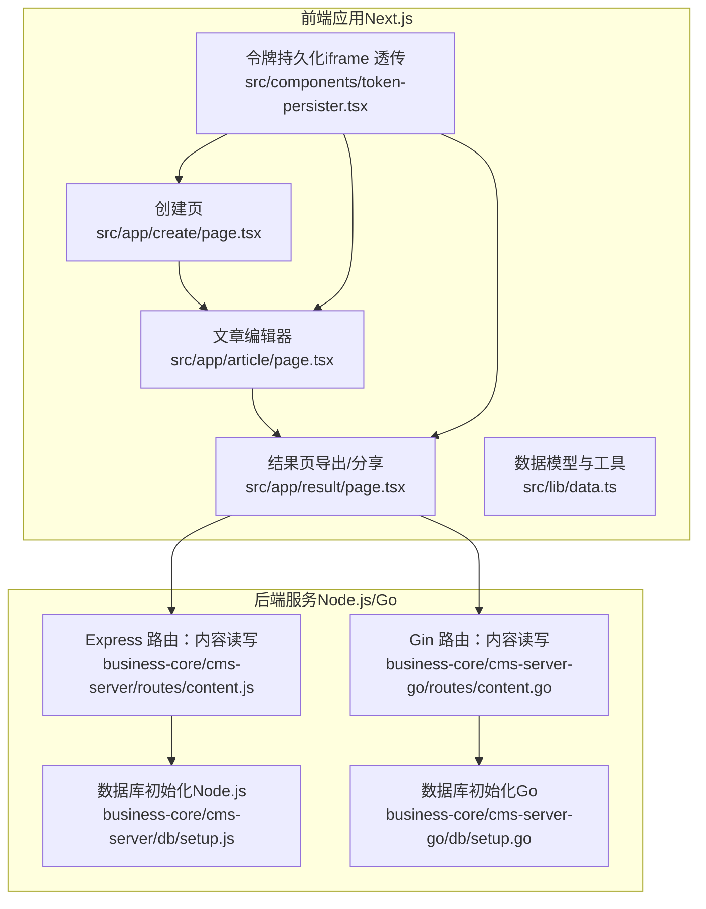
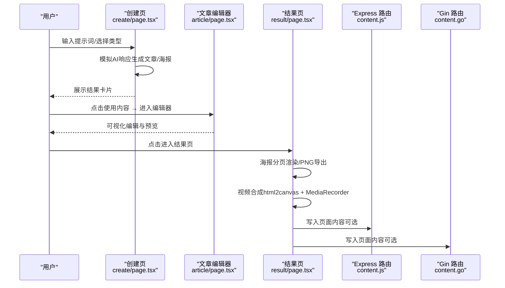
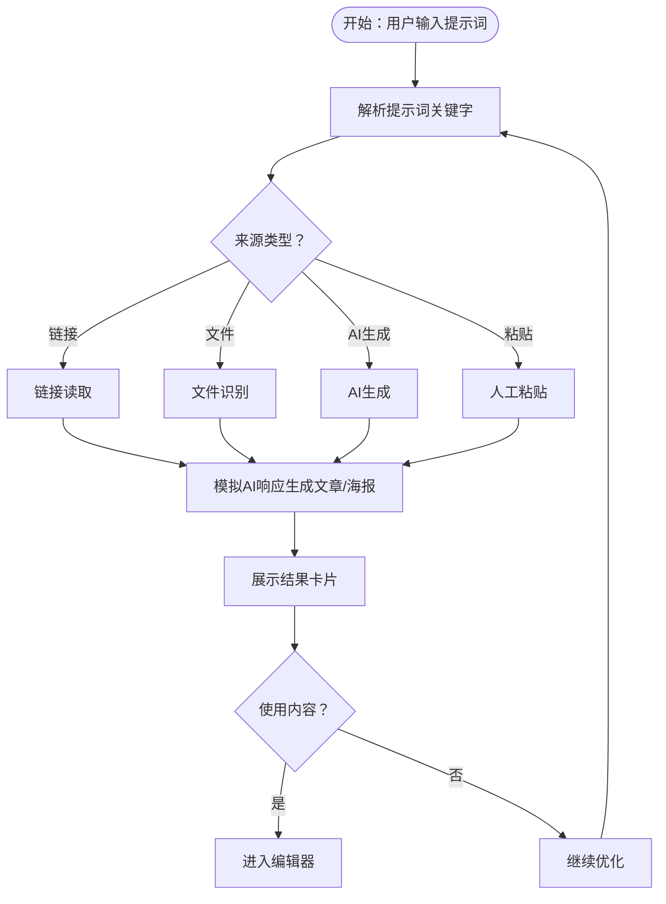
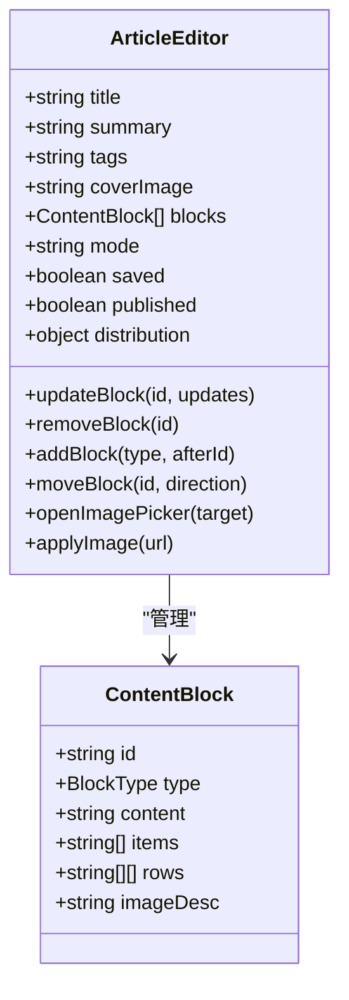
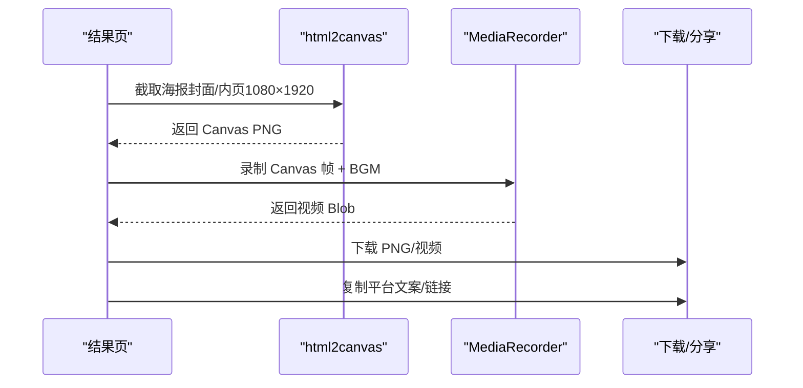
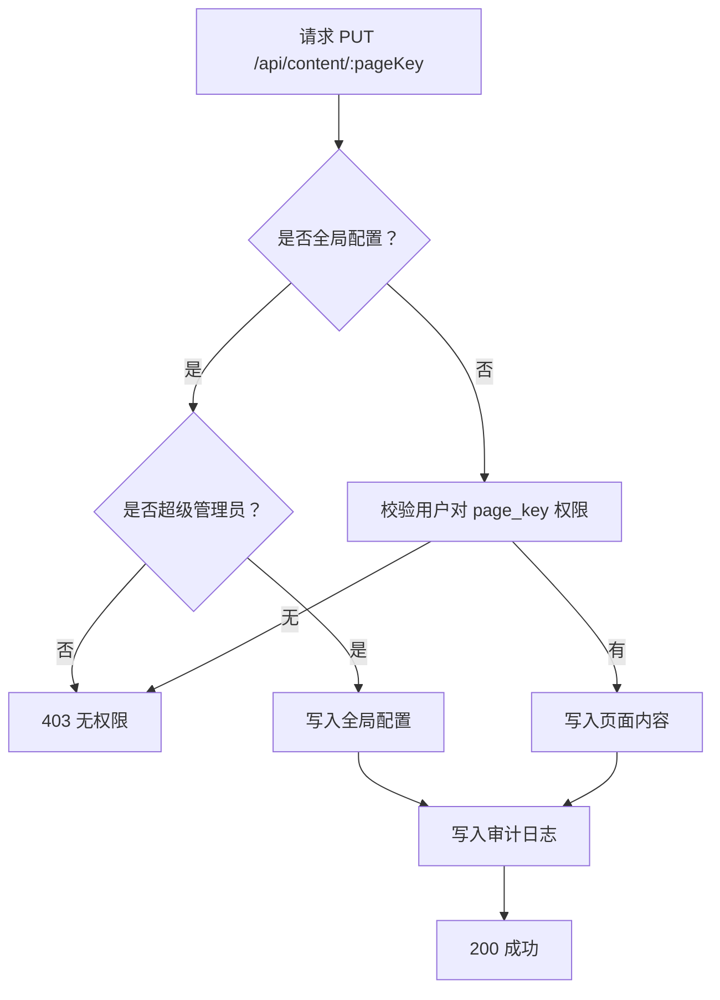
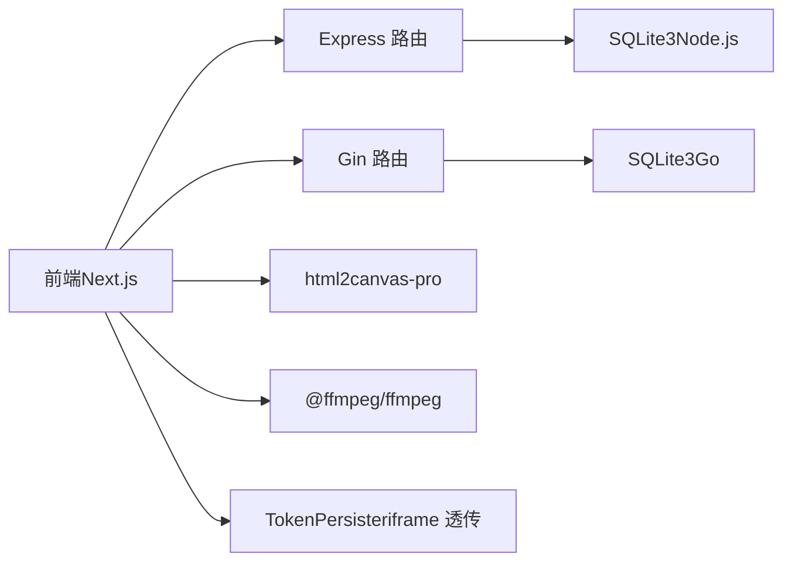

# 文章生成功能

<cite>
**本文档引用的文件**
- [ai-content-project/src/app/create/page.tsx](file://ai-content-project/src/app/create/page.tsx)
- [ai-content-project/src/app/article/page.tsx](file://ai-content-project/src/app/article/page.tsx)
- [ai-content-project/src/app/result/page.tsx](file://ai-content-project/src/app/result/page.tsx)
- [ai-content-project/src/lib/data.ts](file://ai-content-project/src/lib/data.ts)
- [business-core/cms-server/routes/content.js](file://business-core/cms-server/routes/content.js)
- [business-core/cms-server-go/routes/content.go](file://business-core/cms-server-go/routes/content.go)
- [ai-content-project/src/components/token-persister.tsx](file://ai-content-project/src/components/token-persister.tsx)
- [business-core/cms-server/db/setup.js](file://business-core/cms-server/db/setup.js)
- [business-core/cms-server-go/db/setup.go](file://business-core/cms-server-go/db/setup.go)
- [ai-content-project/DESIGN.md](file://ai-content-project/DESIGN.md)
- [ai-content-project/README.md](file://ai-content-project/README.md)
- [ai-content-project/package.json](file://ai-content-project/package.json)
- [business-core/cms-server/package.json](file://business-core/cms-server/package.json)
- [business-core/cms-server-go/go.mod](file://business-core/cms-server-go/go.mod)
</cite>

## 目录
1. [引言](#引言)
2. [项目结构](#项目结构)
3. [核心组件](#核心组件)
4. [架构总览](#架构总览)
5. [详细组件分析](#详细组件分析)
6. [依赖分析](#依赖分析)
7. [性能考虑](#性能考虑)
8. [故障排除指南](#故障排除指南)
9. [结论](#结论)
10. [附录](#附录)

## 引言
本文件围绕“文章生成功能”展开，系统性阐述提示词处理、内容优化与结构化输出、文章模板系统、富文本编辑器、导出与分享、错误处理策略、性能优化与用户体验改进。目标读者既包括前端/后端工程师，也包括内容运营与产品人员。

## 项目结构
该仓库包含两个主要子项目：
- ai-content-project：前端 Next.js 应用，负责提示词输入、AI 内容生成、文章编辑与海报视频导出。
- business-core：后端 CMS 服务，提供页面内容读写接口、权限与审计日志、SQLite 初始化与配置。

图表来源
- [ai-content-project/src/app/create/page.tsx:1-761](file://ai-content-project/src/app/create/page.tsx#L1-L761)
- [ai-content-project/src/app/article/page.tsx:1-1026](file://ai-content-project/src/app/article/page.tsx#L1-L1026)
- [ai-content-project/src/app/result/page.tsx:1-1647](file://ai-content-project/src/app/result/page.tsx#L1-L1647)
- [business-core/cms-server/routes/content.js:1-104](file://business-core/cms-server/routes/content.js#L1-L104)
- [business-core/cms-server-go/routes/content.go:1-298](file://business-core/cms-server-go/routes/content.go#L1-L298)

章节来源
- [ai-content-project/README.md:29-51](file://ai-content-project/README.md#L29-L51)
- [ai-content-project/DESIGN.md:37-53](file://ai-content-project/DESIGN.md#L37-L53)

## 核心组件
- 提示词与内容生成：在创建页接收用户输入，根据输入类型（链接读取、文件识别、AI生成、人工粘贴）模拟生成文章或海报内容，支持快捷提示词与继续优化。
- 文章编辑器：支持标题、摘要、标签、封面图、多种内容块（标题、段落、图片、列表、表格、提示、引用）的可视化编辑与预览。
- 结果页与导出：支持海报分页渲染、PNG 导出、视频合成（html2canvas + MediaRecorder）、BGM 音频叠加、平台分享配置。
- CMS 内容存储：提供页面内容读取与写入接口，支持全局配置与页面级权限控制、审计日志。

章节来源
- [ai-content-project/src/app/create/page.tsx:59-422](file://ai-content-project/src/app/create/page.tsx#L59-L422)
- [ai-content-project/src/app/article/page.tsx:198-622](file://ai-content-project/src/app/article/page.tsx#L198-L622)
- [ai-content-project/src/app/result/page.tsx:227-483](file://ai-content-project/src/app/result/page.tsx#L227-L483)
- [business-core/cms-server/routes/content.js:48-101](file://business-core/cms-server/routes/content.js#L48-L101)
- [business-core/cms-server-go/routes/content.go:80-157](file://business-core/cms-server-go/routes/content.go#L80-L157)

## 架构总览
前端通过 Next.js App Router 提供页面级路由；结果页通过 html2canvas 截图并结合 MediaRecorder 合成视频；后端提供内容读写接口，支持权限校验与审计。

图表来源
- [ai-content-project/src/app/create/page.tsx:376-422](file://ai-content-project/src/app/create/page.tsx#L376-L422)
- [ai-content-project/src/app/article/page.tsx:264-267](file://ai-content-project/src/app/article/page.tsx#L264-L267)
- [ai-content-project/src/app/result/page.tsx:292-483](file://ai-content-project/src/app/result/page.tsx#L292-L483)
- [business-core/cms-server/routes/content.js:67-101](file://business-core/cms-server/routes/content.js#L67-L101)
- [business-core/cms-server-go/routes/content.go:110-157](file://business-core/cms-server-go/routes/content.go#L110-L157)

## 详细组件分析

### 提示词处理与内容生成
- 输入类型识别：根据提示词包含的关键字（如链接、文件、生成、优化等）判断来源类型，分别返回不同结构化结果。
- 快捷提示词：提供“读取链接/识别文件/生成文章/优化内容”等快捷入口，提升效率。
- 模拟响应：在 1.5–3 秒延迟内返回结构化内容，包含标题、摘要、标签、字数统计、海报分页等。
- 继续优化：支持将“已生成内容”再次交给 AI 优化，形成迭代闭环。

图表来源
- [ai-content-project/src/app/create/page.tsx:48-53](file://ai-content-project/src/app/create/page.tsx#L48-L53)
- [ai-content-project/src/app/create/page.tsx:154-374](file://ai-content-project/src/app/create/page.tsx#L154-L374)
- [ai-content-project/src/app/create/page.tsx:397-429](file://ai-content-project/src/app/create/page.tsx#L397-L429)

章节来源
- [ai-content-project/src/app/create/page.tsx:59-422](file://ai-content-project/src/app/create/page.tsx#L59-L422)

### 文章模板系统与编辑器
- 模板要素：标题、摘要（150 字以内）、标签、封面图、正文内容块（标题、段落、图片、列表、表格、提示、引用）。
- 内容块模型：统一的 ContentBlock 接口，支持增删改、拖拽排序、批量添加。
- 预览渲染：编辑态与预览态双模式，预览采用卡片化布局，图片、表格、提示、引用等块类型分别渲染。
- 图片选择器：支持 Pexels 搜索与本地上传两种来源，覆盖图与正文图片均可替换。

图表来源
- [ai-content-project/src/app/article/page.tsx:41-48](file://ai-content-project/src/app/article/page.tsx#L41-L48)
- [ai-content-project/src/app/article/page.tsx:198-622](file://ai-content-project/src/app/article/page.tsx#L198-L622)

章节来源
- [ai-content-project/src/app/article/page.tsx:198-622](file://ai-content-project/src/app/article/page.tsx#L198-L622)

### 富文本编辑、样式控制与预览
- 编辑控件：输入框、文本域、列表项增删、表格行列增删、图片占位与替换、提示/引用块专用编辑器。
- 样式控制：基于 Tailwind CSS 的主题变量与组件库，确保一致的视觉与交互体验。
- 预览模式：卡片化排版，图片最大高度限制、表格条纹与标题样式、提示块警示色、引用块斜体强调。

章节来源
- [ai-content-project/src/app/article/page.tsx:409-407](file://ai-content-project/src/app/article/page.tsx#L409-L407)
- [ai-content-project/DESIGN.md:7-21](file://ai-content-project/DESIGN.md#L7-L21)

### 导出与分享实现
- 海报导出：将封面与内页分页渲染为 PNG，支持批量下载。
- 视频合成：逐页截图生成高清 PNG，Canvas 播放并叠加 BGM，MediaRecorder 输出 WebM。
- 平台分享：内置平台配置（标题、话题、描述、发布地址），一键复制文案与链接。
- 平台分发：支持 CMS 官网、微信视频号、抖音、小红书等渠道的分发开关与状态反馈。

图表来源
- [ai-content-project/src/app/result/page.tsx:292-483](file://ai-content-project/src/app/result/page.tsx#L292-L483)

章节来源
- [ai-content-project/src/app/result/page.tsx:227-483](file://ai-content-project/src/app/result/page.tsx#L227-L483)

### CMS 内容存储与权限
- 接口职责：GET 读取页面 JSON，PUT 更新页面 JSON；支持全局配置 nav/footer/consultation 与页面级内容。
- 权限控制：普通页面写入需用户具备对应 page_key 权限；全局配置仅超级管理员可写。
- 审计日志：记录更新动作、目标与详情，便于追踪。
- 数据库初始化：创建 users、page_permissions、audit_log、ai_channels 表，插入默认超级管理员并授予全部页面权限。

图表来源
- [business-core/cms-server/routes/content.js:67-101](file://business-core/cms-server/routes/content.js#L67-L101)
- [business-core/cms-server-go/routes/content.go:110-157](file://business-core/cms-server-go/routes/content.go#L110-L157)

章节来源
- [business-core/cms-server/routes/content.js:48-101](file://business-core/cms-server/routes/content.js#L48-L101)
- [business-core/cms-server-go/routes/content.go:80-157](file://business-core/cms-server-go/routes/content.go#L80-L157)
- [business-core/cms-server/db/setup.js:14-108](file://business-core/cms-server/db/setup.js#L14-L108)
- [business-core/cms-server-go/db/setup.go:18-175](file://business-core/cms-server-go/db/setup.go#L18-L175)

## 依赖分析
- 前端依赖：Next.js 16、shadcn/ui、Lucide React、html2canvas-pro、FFmpeg、Tailwind CSS v4、React Hook Form + Zod 等。
- 后端依赖：Express/Gin、SQLite3、bcrypt、jsonwebtoken、cors、cookie-parser、http-proxy-middleware 等。
- 关键集成点：前端通过 Next.js 路由与后端 API 交互；结果页视频合成依赖 html2canvas 与 MediaRecorder；iframe 场景通过 TokenPersister 解决跨文档认证问题。

图表来源
- [ai-content-project/package.json:15-76](file://ai-content-project/package.json#L15-L76)
- [business-core/cms-server/package.json:10-21](file://business-core/cms-server/package.json#L10-L21)
- [business-core/cms-server-go/go.mod:5-11](file://business-core/cms-server-go/go.mod#L5-L11)
- [ai-content-project/src/components/token-persister.tsx:15-37](file://ai-content-project/src/components/token-persister.tsx#L15-L37)

章节来源
- [ai-content-project/package.json:15-76](file://ai-content-project/package.json#L15-L76)
- [business-core/cms-server/package.json:10-21](file://business-core/cms-server/package.json#L10-L21)
- [business-core/cms-server-go/go.mod:5-11](file://business-core/cms-server-go/go.mod#L5-L11)

## 性能考虑
- 前端渲染优化
  - 使用 Suspense 与懒加载减少首屏压力。
  - 编辑器采用局部状态更新，避免整树重渲染。
  - 预览渲染按块类型差异化处理，减少不必要的 DOM。
- 导出与视频合成
  - html2canvas 截图采用固定分辨率（1080×1920），降低内存占用。
  - 视频帧率控制为 30fps，分页淡入淡出动画平滑过渡。
  - BGM 与视频轨道合并录制，避免额外解码开销。
- 后端接口
  - GET /api/content 无需认证，支持预览模式直连。
  - PUT /api/content 前置权限校验，减少无效写入。
- 存储与初始化
  - SQLite 初始化脚本一次性创建表与默认管理员，避免运行时反复迁移。

章节来源
- [ai-content-project/src/app/result/page.tsx:292-483](file://ai-content-project/src/app/result/page.tsx#L292-L483)
- [business-core/cms-server/routes/content.js:49-65](file://business-core/cms-server/routes/content.js#L49-L65)
- [business-core/cms-server-go/routes/content.go:81-108](file://business-core/cms-server-go/routes/content.go#L81-L108)

## 故障排除指南
- iframe 认证丢失（401）
  - 现象：iframe 内导航后丢失 token 导致鉴权失败。
  - 处理：TokenPersister 将 URL 中的 token 写入 cookie，后续客户端导航自动携带。
- 视频合成失败
  - 现象：MediaRecorder 不支持当前 MIME 类型或 Canvas 2D 上下文创建失败。
  - 处理：回退到受支持的 MIME 类型；检查浏览器兼容性与权限（摄像头/麦克风）。
- 图片搜索无结果
  - 现象：Pexels API 请求失败或返回空。
  - 处理：降级为内置示例图片；检查网络与 API Key。
- 权限不足
  - 现象：PUT /api/content 返回 403。
  - 处理：确认用户角色与 page_key 权限；全局配置仅超级管理员可写。

章节来源
- [ai-content-project/src/components/token-persister.tsx:15-37](file://ai-content-project/src/components/token-persister.tsx#L15-L37)
- [ai-content-project/src/app/result/page.tsx:319-483](file://ai-content-project/src/app/result/page.tsx#L319-L483)
- [business-core/cms-server/routes/content.js:74-82](file://business-core/cms-server/routes/content.js#L74-L82)
- [business-core/cms-server-go/routes/content.go:123-136](file://business-core/cms-server-go/routes/content.go#L123-L136)

## 结论
该文章生成功能以“提示词驱动 + 可视化编辑 + 结构化导出”为核心路径，从前端交互到后端存储形成完整闭环。通过模块化的内容块与海报分页机制，满足多渠道分发与快速迭代的需求；通过权限与审计保障内容安全与可追溯。建议持续优化视频合成性能与跨平台兼容性，完善错误兜底与监控告警。

## 附录
- 设计规范与配色：参考 DESIGN.md 的气质、配色、字体与交互细节。
- 项目结构与开发规范：参考 README.md 的目录结构、组件开发、路由开发、依赖管理与样式开发。
- 数据模型：参考 data.ts 的内容项、来源与状态映射，以及海报标签生成规则。

章节来源
- [ai-content-project/DESIGN.md:3-53](file://ai-content-project/DESIGN.md#L3-L53)
- [ai-content-project/README.md:29-364](file://ai-content-project/README.md#L29-L364)
- [ai-content-project/src/lib/data.ts:1-218](file://ai-content-project/src/lib/data.ts#L1-L218)