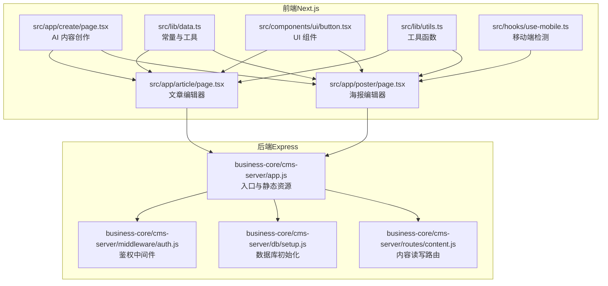
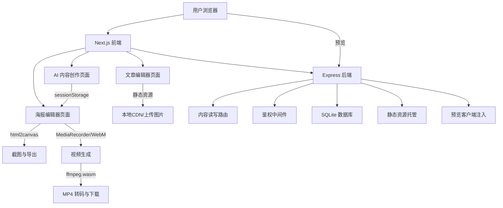
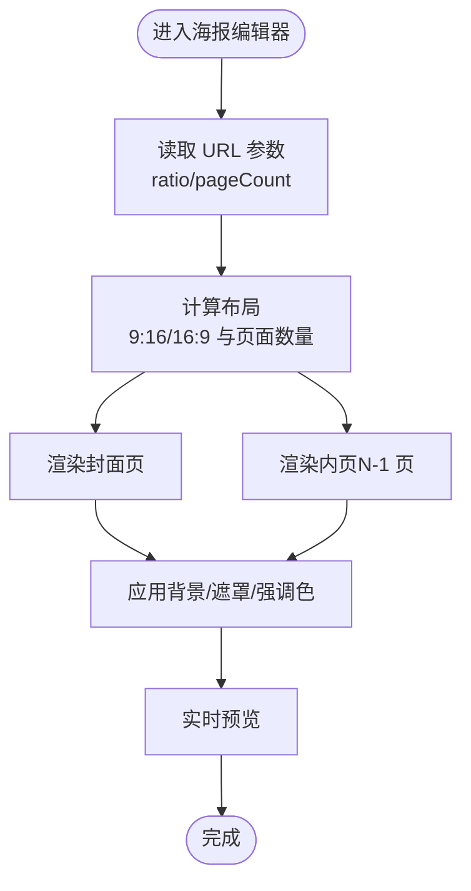
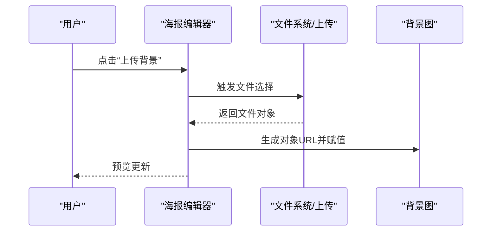
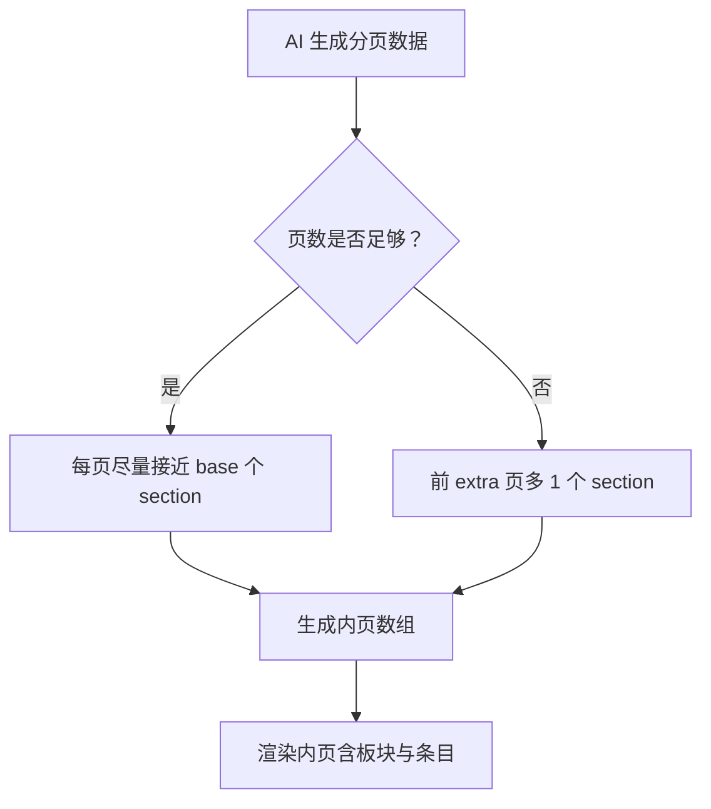
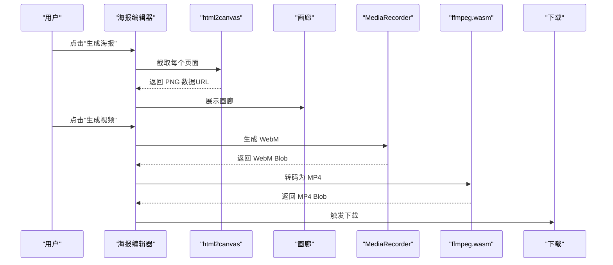
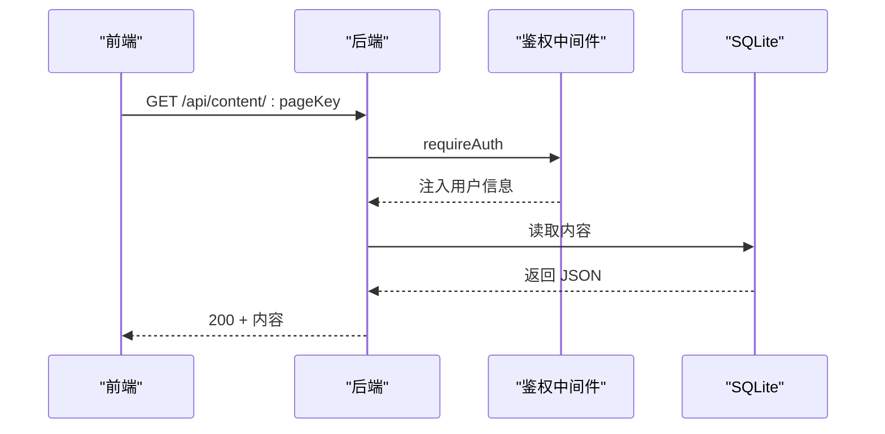
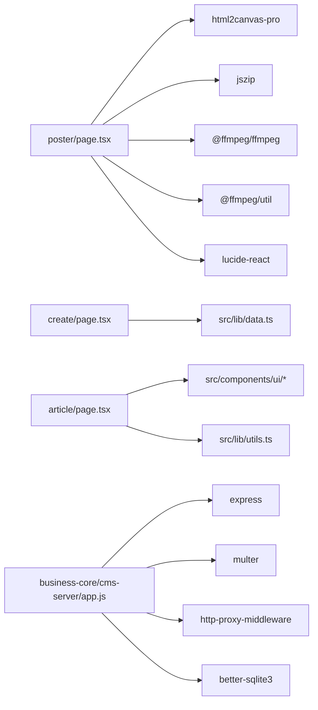

# 海报编辑器

<cite>
**本文引用的文件**
- [poster/page.tsx](file://ai-content-project/src/app/poster/page.tsx)
- [create/page.tsx](file://ai-content-project/src/app/create/page.tsx)
- [article/page.tsx](file://ai-content-project/src/app/article/page.tsx)
- [data.ts](file://ai-content-project/src/lib/data.ts)
- [button.tsx](file://ai-content-project/src/components/ui/button.tsx)
- [utils.ts](file://ai-content-project/src/lib/utils.ts)
- [use-mobile.ts](file://ai-content-project/src/hooks/use-mobile.ts)
- [layout.tsx](file://ai-content-project/src/app/layout.tsx)
- [package.json](file://ai-content-project/package.json)
- [README.md](file://ai-content-project/README.md)
- [app.js](file://business-core/cms-server/app.js)
- [routes/content.js](file://business-core/cms-server/routes/content.js)
- [db/setup.js](file://business-core/cms-server/db/setup.js)
- [middleware/auth.js](file://business-core/cms-server/middleware/auth.js)
</cite>

## 目录
1. [简介](#简介)
2. [项目结构](#项目结构)
3. [核心组件](#核心组件)
4. [架构总览](#架构总览)
5. [详细组件分析](#详细组件分析)
6. [依赖关系分析](#依赖关系分析)
7. [性能考量](#性能考量)
8. [故障排查指南](#故障排查指南)
9. [结论](#结论)
10. [附录](#附录)

## 简介
本项目是一个基于 Next.js 16 的全栈内容创作与分发平台，重点围绕“海报编辑器”能力展开。其核心目标是通过 AI 辅助生成内容，快速产出符合 9:16 竖版比例的海报模板，支持多页面布局、响应式设计、实时预览、批量导出与视频生成，并提供便捷的复制分享与版本管理思路。

## 项目结构
- 前端（Next.js App Router）位于 ai-content-project/src/app，包含海报编辑器、AI 内容创作、文章编辑等页面。
- UI 组件库采用 shadcn/ui，统一风格与交互。
- 工具与配置位于 src/lib、src/hooks、components/ui 等目录。
- 后端（Express + SQLite）位于 business-core/cms-server，提供内容读写、鉴权、静态资源托管与预览客户端注入等能力。

**图表来源**
- [create/page.tsx:1-761](file://ai-content-project/src/app/create/page.tsx#L1-761)
- [poster/page.tsx:1-1443](file://ai-content-project/src/app/poster/page.tsx#L1-1443)
- [article/page.tsx:1-1026](file://ai-content-project/src/app/article/page.tsx#L1-1026)
- [data.ts:1-218](file://ai-content-project/src/lib/data.ts#L1-218)
- [button.tsx:1-63](file://ai-content-project/src/components/ui/button.tsx#L1-63)
- [utils.ts:1-7](file://ai-content-project/src/lib/utils.ts#L1-7)
- [use-mobile.ts:1-20](file://ai-content-project/src/hooks/use-mobile.ts#L1-20)
- [app.js:1-315](file://business-core/cms-server/app.js#L1-315)
- [routes/content.js:1-104](file://business-core/cms-server/routes/content.js#L1-104)
- [db/setup.js:1-115](file://business-core/cms-server/db/setup.js#L1-115)
- [middleware/auth.js:1-86](file://business-core/cms-server/middleware/auth.js#L1-86)

**章节来源**
- [README.md:1-364](file://ai-content-project/README.md#L1-L364)
- [package.json:1-100](file://ai-content-project/package.json#L1-L100)

## 核心组件
- 海报编辑器（海报模板系统与导出）
  - 9:16 竖版适配与多页面布局：通过参数控制比例与页面数量，生成封面与内页，支持背景图与遮罩层叠加。
  - 实时预览与截图：使用 html2canvas 对每个页面进行高质量截图，支持批量导出 PNG。
  - 视频生成与转码：基于 Canvas + MediaRecorder 生成 WebM，再通过 ffmpeg.wasm 转码为 MP4；支持 BGM 音频叠加。
  - 背景与样式：内置预设背景与色彩体系，支持自定义上传背景图。
  - 导出与分发：支持 ZIP 包下载、单页 PNG 下载、视频在线预览与下载。
- AI 内容创作（内容来源与分页）
  - 支持链接读取、文件识别、AI 生成、人工粘贴四种来源，自动生成海报分页内容。
  - 将生成的分页数据存入 sessionStorage，供海报编辑器读取并回填。
- 文章编辑器（对比参考）
  - 提供富文本块编辑（标题、段落、图片、列表、表格、提示、引用），支持封面图与标签管理。
- 后端支撑
  - 静态资源托管与预览客户端注入，内容读写路由，鉴权中间件，SQLite 数据库初始化。

**章节来源**
- [poster/page.tsx:1-1443](file://ai-content-project/src/app/poster/page.tsx#L1-1443)
- [create/page.tsx:1-761](file://ai-content-project/src/app/create/page.tsx#L1-761)
- [article/page.tsx:1-1026](file://ai-content-project/src/app/article/page.tsx#L1-1026)
- [data.ts:137-174](file://ai-content-project/src/lib/data.ts#L137-174)
- [app.js:1-315](file://business-core/cms-server/app.js#L1-L315)
- [routes/content.js:1-104](file://business-core/cms-server/routes/content.js#L1-104)
- [db/setup.js:1-115](file://business-core/cms-server/db/setup.js#L1-115)
- [middleware/auth.js:1-86](file://business-core/cms-server/middleware/auth.js#L1-86)

## 架构总览
前端通过 Next.js App Router 提供页面与 API 路由，海报编辑器与文章编辑器共享 UI 组件与工具函数。后端提供静态资源托管、内容读写与鉴权能力，支持预览模式下注入预览客户端脚本，确保编辑态与预览态一致。

**图表来源**
- [poster/page.tsx:36-331](file://ai-content-project/src/app/poster/page.tsx#L36-L331)
- [create/page.tsx:411-422](file://ai-content-project/src/app/create/page.tsx#L411-L422)
- [app.js:55-153](file://business-core/cms-server/app.js#L55-L153)
- [routes/content.js:48-101](file://business-core/cms-server/routes/content.js#L48-L101)
- [middleware/auth.js:20-44](file://business-core/cms-server/middleware/auth.js#L20-L44)
- [db/setup.js:14-108](file://business-core/cms-server/db/setup.js#L14-L108)

## 详细组件分析

### 海报模板系统与多页面布局
- 比例与分辨率
  - 通过 URL 参数 ratio 控制 9:16 或 16:9，动态计算预览宽高与分辨率标签。
  - 封面页与内页分别渲染，内页数量由 pageCount 参数决定（默认 6 页，最多 15 页）。
- 布局与响应式
  - 使用 Aspect Ratio 组件与 Tailwind 类实现 9:16 或 16:9 的等比容器，保证在不同设备上保持一致比例。
  - 移动端检测钩子用于在小屏设备上优化交互体验。
- 背景与样式
  - 内置三套预设背景（沙漠金丘、利雅得天际线、麦加夜景），支持自定义上传背景图。
  - 通过遮罩层与强调色叠加，提升文字可读性与品牌一致性。

**图表来源**
- [poster/page.tsx:203-253](file://ai-content-project/src/app/poster/page.tsx#L203-L253)
- [use-mobile.ts:1-20](file://ai-content-project/src/hooks/use-mobile.ts#L1-20)

**章节来源**
- [poster/page.tsx:203-253](file://ai-content-project/src/app/poster/page.tsx#L203-L253)
- [use-mobile.ts:1-20](file://ai-content-project/src/hooks/use-mobile.ts#L1-20)

### 海报编辑工具实现（文本、图片、背景、样式）
- 文本编辑
  - 封面标题、副标题标签、价格方案、底部标语等字段均可实时编辑，状态存储于组件内部。
  - 内页支持板块标题与条目列表的增删改，便于结构化内容组织。
- 图片处理
  - 封面与内页背景图支持上传自定义图片，或选择预设背景。
  - 上传逻辑通过隐藏文件输入框与目标标记实现精准赋值。
- 样式定制
  - 通过预设背景的强调色与遮罩层，统一视觉风格。
  - 标签样式与价格徽标颜色与背景色联动，增强品牌识别。

**图表来源**
- [poster/page.tsx:596-617](file://ai-content-project/src/app/poster/page.tsx#L596-L617)

**章节来源**
- [poster/page.tsx:596-634](file://ai-content-project/src/app/poster/page.tsx#L596-L634)

### 海报页面管理（增删改查、内容分页、布局优化）
- 页面增删改查
  - 封面页固定为第 0 页，内页数量由 pageCount 决定。
  - 内页字段更新通过状态更新函数实现，支持标题、板块标题、条目内容的变更。
  - 新增板块与条目，删除板块与条目，保持数据结构稳定。
- 内容分页
  - AI 内容创作页面根据来源与页数，将长内容均匀分配到各内页，或拆分为多个板块。
  - 分页逻辑确保每页内容密度适中，避免信息过载。
- 布局优化
  - 使用等比容器与网格布局，结合强调色与遮罩层，提升可读性与品牌感。
  - 移动端检测与响应式类名，确保在小屏设备上的良好体验。

**图表来源**
- [create/page.tsx:88-152](file://ai-content-project/src/app/create/page.tsx#L88-L152)

**章节来源**
- [create/page.tsx:88-152](file://ai-content-project/src/app/create/page.tsx#L88-L152)
- [poster/page.tsx:636-680](file://ai-content-project/src/app/poster/page.tsx#L636-L680)

### 海报导出与下载机制（格式转换、质量控制、批量处理）
- 图片导出
  - 使用 html2canvas 对每个页面进行截图，scale 设置为 4，确保高分辨率 PNG 输出。
  - 支持批量导出为 ZIP 包，ZIP 文件名包含时间戳，避免覆盖。
- 视频导出
  - 通过 Canvas + MediaRecorder 生成 WebM 视频，帧率 30fps，精确控制每页展示时长。
  - 使用 ffmpeg.wasm 将 WebM 转码为 MP4，采用 H.264 + AAC 编码，开启 faststart 以支持渐进播放。
  - BGM 音频通过 Web Audio API 生成，与视频轨道合并后导出。
- 质量控制
  - html2canvas 的 scale 与 allowTaint/useCORS 配置提升图片质量与跨域兼容性。
  - ffmpeg.wasm 的 CRF 与像素格式控制画质与兼容性。
- 批量处理
  - 画廊模式下一次性生成所有页面截图，支持批量下载与预览。

**图表来源**
- [poster/page.tsx:356-460](file://ai-content-project/src/app/poster/page.tsx#L356-L460)
- [poster/page.tsx:462-535](file://ai-content-project/src/app/poster/page.tsx#L462-L535)

**章节来源**
- [poster/page.tsx:356-460](file://ai-content-project/src/app/poster/page.tsx#L356-L460)
- [poster/page.tsx:462-535](file://ai-content-project/src/app/poster/page.tsx#L462-L535)

### 预览、实时编辑与版本管理（技术实现）
- 实时预览
  - html2canvas 截图与 MediaRecorder 生成视频均在浏览器内完成，无需后端参与，降低延迟。
  - 通过状态驱动的渲染，编辑即预览，提升效率。
- 版本管理
  - 当前版本未实现云端版本历史，但可通过 sessionStorage 存储草稿（如海报分页数据）。
  - 建议后续引入本地 IndexedDB 或云端版本存储，配合标签与时间戳管理。

**章节来源**
- [poster/page.tsx:356-460](file://ai-content-project/src/app/poster/page.tsx#L356-L460)
- [create/page.tsx:411-422](file://ai-content-project/src/app/create/page.tsx#L411-L422)

### 后端集成与内容分发
- 静态资源与预览
  - 后端提供静态资源托管与预览客户端注入，确保编辑态与预览态一致。
- 内容读写
  - 提供页面内容的读取与更新接口，支持全局配置与页面级内容管理。
- 鉴权
  - 基于 JWT 的认证中间件，支持超级管理员与页面权限控制。

**图表来源**
- [routes/content.js:48-65](file://business-core/cms-server/routes/content.js#L48-L65)
- [middleware/auth.js:20-44](file://business-core/cms-server/middleware/auth.js#L20-L44)
- [db/setup.js:14-53](file://business-core/cms-server/db/setup.js#L14-L53)

**章节来源**
- [app.js:55-153](file://business-core/cms-server/app.js#L55-L153)
- [routes/content.js:1-104](file://business-core/cms-server/routes/content.js#L1-L104)
- [middleware/auth.js:1-86](file://business-core/cms-server/middleware/auth.js#L1-86)
- [db/setup.js:1-115](file://business-core/cms-server/db/setup.js#L1-115)

## 依赖关系分析
- 前端依赖
  - html2canvas-pro：高质量截图。
  - jszip：批量导出 ZIP。
  - @ffmpeg/ffmpeg + @ffmpeg/util：浏览器内视频转码。
  - lucide-react：图标。
- 后端依赖
  - Express + better-sqlite3：轻量级服务端与数据库。
  - multer：文件上传。
  - http-proxy-middleware：AI 内容生成代理。

**图表来源**
- [package.json:15-76](file://ai-content-project/package.json#L15-L76)
- [poster/page.tsx:36-39](file://ai-content-project/src/app/poster/page.tsx#L36-L39)
- [create/page.tsx:1-761](file://ai-content-project/src/app/create/page.tsx#L1-L761)
- [article/page.tsx:1-1026](file://ai-content-project/src/app/article/page.tsx#L1-L1026)
- [data.ts:137-174](file://ai-content-project/src/lib/data.ts#L137-174)
- [button.tsx:1-63](file://ai-content-project/src/components/ui/button.tsx#L1-63)
- [utils.ts:1-7](file://ai-content-project/src/lib/utils.ts#L1-7)
- [app.js:1-315](file://business-core/cms-server/app.js#L1-L315)

**章节来源**
- [package.json:1-100](file://ai-content-project/package.json#L1-L100)

## 性能考量
- 截图与导出
  - html2canvas 的 scale 与跨域配置影响质量与性能，建议在大图场景下限制缩放倍数或分批处理。
  - 批量导出时，先生成所有截图再打包，避免重复计算。
- 视频生成
  - MediaRecorder 生成 WebM，再转 MP4，注意浏览器兼容性与内存占用。
  - ffmpeg.wasm 的 CRF 与编码参数需在画质与体积间权衡。
- 响应式与交互
  - 使用移动端检测钩子与等比容器，减少重排与重绘。
  - UI 组件统一使用 shadcn/ui，减少自定义样式带来的性能问题。

[本节为通用指导，无需特定文件引用]

## 故障排查指南
- 截图失败
  - 检查跨域资源与 allowTaint/useCORS 配置，确认图片来源允许跨域。
  - 若页面元素尚未渲染完成，延后执行截图。
- 视频生成失败
  - 确认浏览器支持 MediaRecorder 与 WebM 编码。
  - ffmpeg.wasm 加载失败时，检查网络与日志回调中的进度信息。
- 导出下载异常
  - 确认 Blob 对象与下载触发逻辑，避免 URL 对象过早释放。
- 预览客户端注入
  - 后端预览模式需正确注入预览客户端脚本与修复资源相对路径。

**章节来源**
- [poster/page.tsx:356-460](file://ai-content-project/src/app/poster/page.tsx#L356-L460)
- [app.js:104-153](file://business-core/cms-server/app.js#L104-L153)

## 结论
本海报编辑器以 9:16 竖版为核心，结合 AI 内容创作与浏览器内截图/视频生成能力，实现了从内容到成品的一体化工作流。通过统一的 UI 组件库与响应式设计，提升了跨设备的可用性；借助后端的静态资源托管与内容读写接口，保障了内容管理的灵活性。未来可在版本管理、云端协作与性能优化方面持续演进。

## 附录
- 快速开始
  - 开发：coze dev
  - 构建：coze build
  - 启动：coze start
- 项目规范
  - 优先使用 shadcn/ui 组件，使用 pnpm 管理依赖，遵循 Next.js App Router 规范。

**章节来源**
- [README.md:5-364](file://ai-content-project/README.md#L5-L364)