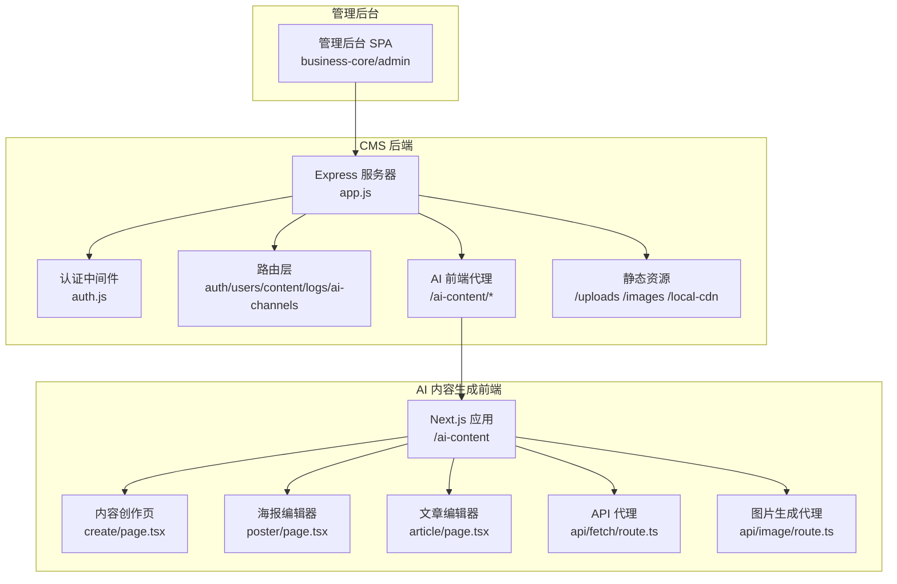
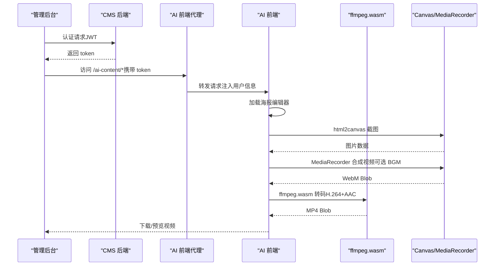
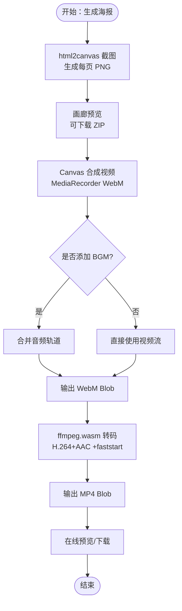
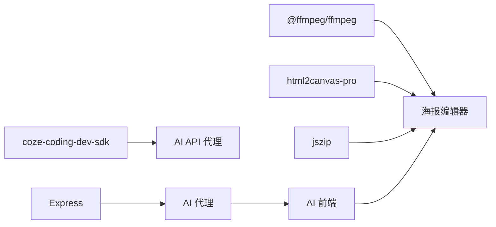

# 视频处理系统

<cite>
**本文档引用的文件**
- [ZSTS-CMS-后端移交说明书.md](file://ZSTS-CMS-后端移交说明书.md)
- [poster/page.tsx](file://ai-content-project/src/app/poster/page.tsx)
- [create/page.tsx](file://ai-content-project/src/app/create/page.tsx)
- [article/page.tsx](file://ai-content-project/src/app/article/page.tsx)
- [route.ts](file://ai-content-project/src/app/api/fetch/route.ts)
- [route.ts](file://ai-content-project/src/app/api/image/route.ts)
- [app.js](file://business-core/cms-server/app.js)
- [setup.js](file://business-core/cms-server/db/setup.js)
- [package.json](file://ai-content-project/package.json)
- [data.ts](file://ai-content-project/src/lib/data.ts)
- [utils.ts](file://ai-content-project/src/lib/utils.ts)
</cite>

## 目录
1. [简介](#简介)
2. [项目结构](#项目结构)
3. [核心组件](#核心组件)
4. [架构总览](#架构总览)
5. [详细组件分析](#详细组件分析)
6. [依赖关系分析](#依赖关系分析)
7. [性能考虑](#性能考虑)
8. [故障排查指南](#故障排查指南)
9. [结论](#结论)
10. [附录](#附录)

## 简介
本系统是一个集成了视频处理能力的内容创作与分发平台，重点围绕“海报视频生成”展开，提供从内容创作、海报排版、视频合成到多格式导出的一体化能力。系统采用前后端分离架构：前端使用 Next.js 16 + React 19 构建 AI 内容生成模块（包含海报编辑器与视频导出功能），后端使用 Express.js + SQLite 提供认证、内容管理与静态资源服务，并通过代理将 AI 前端暴露给管理后台。

视频处理的核心能力包括：
- 基于浏览器端 ffmpeg.wasm 的视频转码（WebM → MP4，H.264+AAC，移动设备友好）
- 基于 Canvas + MediaRecorder 的视频合成（带精确时间戳与可选背景音乐）
- 海报页面截图（html2canvas）与批量导出（JSZip）
- 多平台一键分发（小红书/视频号/抖音）

## 项目结构
系统分为三大模块：
- CMS 后端：提供认证、内容管理、静态资源与 AI 前端代理
- AI 内容生成前端：包含文章编辑器、海报编辑器与视频导出功能
- 内容存储：JSON 文件形式的页面内容与上传资源



图表来源
- [app.js:155-225](file://business-core/cms-server/app.js#L155-L225)
- [poster/page.tsx:1-1443](file://ai-content-project/src/app/poster/page.tsx#L1-L1443)
- [create/page.tsx:1-761](file://ai-content-project/src/app/create/page.tsx#L1-L761)
- [article/page.tsx:1-1026](file://ai-content-project/src/app/article/page.tsx#L1-L1026)
- [route.ts:1-25](file://ai-content-project/src/app/api/fetch/route.ts#L1-L25)
- [route.ts:1-36](file://ai-content-project/src/app/api/image/route.ts#L1-L36)

章节来源
- [ZSTS-CMS-后端移交说明书.md:26-91](file://ZSTS-CMS-后端移交说明书.md#L26-L91)
- [app.js:155-225](file://business-core/cms-server/app.js#L155-L225)

## 核心组件
- 认证与权限：JWT + 页面权限表，支持超级管理员与编辑角色
- 内容管理：页面内容读写（GET/PUT），支持多语言字段与图片 URL
- AI 渠道配置：统一管理第三方 AI 通道（Coze SDK）
- 海报编辑器：可视化海报设计，支持多页（封面+内页）、背景图、价格区、底部信息
- 视频导出：海报页面截图 → Canvas 合成 → WebM → ffmpeg.wasm 转 MP4
- 多平台分发：一键打开小红书/视频号/抖音，自动复制标题+标签

章节来源
- [ZSTS-CMS-后端移交说明书.md:118-172](file://ZSTS-CMS-后端移交说明书.md#L118-L172)
- [poster/page.tsx:203-535](file://ai-content-project/src/app/poster/page.tsx#L203-L535)
- [data.ts:137-173](file://ai-content-project/src/lib/data.ts#L137-L173)

## 架构总览
系统采用“后端 API + 前端应用”的双栈架构。后端负责认证、内容与资源管理；前端负责内容创作与视频处理。AI 前端通过代理与后端打通，实现统一认证与用户上下文传递。



图表来源
- [app.js:163-225](file://business-core/cms-server/app.js#L163-L225)
- [poster/page.tsx:271-331](file://ai-content-project/src/app/poster/page.tsx#L271-L331)
- [poster/page.tsx:462-535](file://ai-content-project/src/app/poster/page.tsx#L462-L535)

## 详细组件分析

### 海报编辑器与视频导出组件
- 海报编辑器支持封面与多内页，可配置背景图、价格区、底部信息与标签样式
- 截图与画廊：使用 html2canvas 将每个页面渲染为高分辨率 PNG，支持批量下载 ZIP
- 视频合成：Canvas 绘制每页图像，按设定时长精确推进，MediaRecorder 输出 WebM
- 转码：ffmpeg.wasm 将 WebM 转为 MP4（H.264 + AAC，movflags +faststart）
- 进度反馈：ffmpeg 日志回调解析时间戳，实时显示转码进度
- BGM：Web Audio API 生成阿拉伯风格背景音乐，与视频轨道合并



图表来源
- [poster/page.tsx:356-461](file://ai-content-project/src/app/poster/page.tsx#L356-L461)
- [poster/page.tsx:462-535](file://ai-content-project/src/app/poster/page.tsx#L462-L535)
- [poster/page.tsx:294-331](file://ai-content-project/src/app/poster/page.tsx#L294-L331)

章节来源
- [poster/page.tsx:203-535](file://ai-content-project/src/app/poster/page.tsx#L203-L535)
- [data.ts:137-144](file://ai-content-project/src/lib/data.ts#L137-L144)

### 内容创作与海报模板生成
- 内容创作页支持多种来源（链接读取、文件识别、AI 生成、人工粘贴）
- 自动生成海报模板：将内容拆分为多页，每页一个板块，自动排版
- 通过 sessionStorage 将模板数据传递至海报编辑器，减少网络请求

```mermaid
sequenceDiagram
participant User as "用户"
participant Create as "内容创作页"
participant Sim as "AI 模拟响应"
participant Poster as "海报编辑器"
User->>Create : 输入提示词来源类型
Create->>Sim : 生成内容与模板
Sim-->>Create : 返回结果标题/摘要/标签/分页数据
Create->>Poster : 跳转并传递模板数据
Poster-->>User : 进入海报编辑器
```

图表来源
- [create/page.tsx:59-374](file://ai-content-project/src/app/create/page.tsx#L59-L374)
- [create/page.tsx:408-422](file://ai-content-project/src/app/create/page.tsx#L408-L422)

章节来源
- [create/page.tsx:59-374](file://ai-content-project/src/app/create/page.tsx#L59-L374)

### 文章编辑器
- 支持多种内容块（标题、段落、图片、列表、表格、提示、引用）
- 编辑/预览双模式，支持封面图、摘要、标签等元信息
- 图片选择器支持 Pexels 搜索与本地上传

章节来源
- [article/page.tsx:198-622](file://ai-content-project/src/app/article/page.tsx#L198-L622)

### AI API 代理
- fetch 代理：转发外部 API 请求，保留自定义头部
- image 代理：调用图片生成客户端，返回首张图片 URL

章节来源
- [route.ts:1-25](file://ai-content-project/src/app/api/fetch/route.ts#L1-L25)
- [route.ts:1-36](file://ai-content-project/src/app/api/image/route.ts#L1-L36)

### CMS 后端与认证
- JWT 认证中间件：支持 Authorization 头、URL token、Cookie 三种方式
- AI 前端代理：将 CMS 用户上下文注入 Next.js，实现统一认证
- 静态资源：上传图片、CDN、图片资源直连
- 预览模式：动态注入预览客户端脚本与 pageKey

章节来源
- [app.js:163-225](file://business-core/cms-server/app.js#L163-L225)
- [app.js:103-153](file://business-core/cms-server/app.js#L103-L153)

### 数据模型与内容存储
- 页面内容 JSON 结构：模块.组件.属性，支持文本与图片 URL
- 全局配置：导航、页脚、咨询弹窗
- 上传文件：限制 5MB，支持 jpg/png/gif/webp/svg

章节来源
- [ZSTS-CMS-后端移交说明书.md:466-501](file://ZSTS-CMS-后端移交说明书.md#L466-L501)
- [app.js:24-53](file://business-core/cms-server/app.js#L24-L53)

## 依赖关系分析
- 前端依赖：@ffmpeg/ffmpeg、html2canvas-pro、jszip、react-markdown、coze-coding-dev-sdk 等
- 后端依赖：Express、better-sqlite3、jsonwebtoken、http-proxy-middleware、multer
- 关键耦合点：AI 前端通过代理与后端共享认证上下文；海报编辑器依赖浏览器端 ffmpeg.wasm 与 Canvas API



图表来源
- [package.json:15-76](file://ai-content-project/package.json#L15-L76)
- [app.js:163-225](file://business-core/cms-server/app.js#L163-L225)
- [poster/page.tsx:36-39](file://ai-content-project/src/app/poster/page.tsx#L36-L39)

章节来源
- [package.json:15-76](file://ai-content-project/package.json#L15-L76)

## 性能考虑
- 浏览器端转码：ffmpeg.wasm 体积较大，建议按需加载与缓存；使用 ultrafast 预设提升速度，但牺牲画质
- Canvas 渲染：截图 scale=4 提升清晰度，但内存占用较高；建议在移动端降低 scale 或分批处理
- 视频合成：MediaRecorder 输出 WebM，体积较小；转码为 MP4 时开启 +faststart 便于渐进播放
- 并发与资源：上传限制 5MB，避免大文件拖慢系统；图片压缩与懒加载可进一步优化
- 数据库：SQLite 适合原型与小规模场景；高并发建议迁移到 MySQL/PostgreSQL

[本节为通用指导，无需列出章节来源]

## 故障排查指南
- ffmpeg 加载失败：检查网络与缓存，确认 wasm 资源可访问；查看日志回调中的进度信息
- 视频合成异常：确认每页截图成功，检查 MediaRecorder 支持与 MIME 类型；确保 BGM 生成成功
- 代理认证失败：检查 Authorization 头、URL token、Cookie 三者之一是否有效；确认 JWT_SECRET 一致
- 上传失败：检查文件类型与大小限制，确认上传目录权限

章节来源
- [poster/page.tsx:271-292](file://ai-content-project/src/app/poster/page.tsx#L271-L292)
- [app.js:163-196](file://business-core/cms-server/app.js#L163-L196)
- [app.js:24-53](file://business-core/cms-server/app.js#L24-L53)

## 结论
本系统通过“浏览器端视频处理 + 统一认证代理”的架构，实现了从内容创作到视频导出的闭环。海报编辑器与视频导出功能结合紧密，能够满足短视频内容生产的快速迭代需求。建议后续在性能与扩展性方面进行针对性优化，如引入服务端转码、CDN 加速与数据库迁移。

[本节为总结性内容，无需列出章节来源]

## 附录

### API 使用指南（视频导出相关）
- 海报编辑器内置视频导出流程，无需额外调用后端 API
- 若需在外部集成，可通过以下步骤复用核心逻辑：
  - 使用 html2canvas 截取页面为图片
  - 使用 Canvas + MediaRecorder 合成 WebM
  - 使用 ffmpeg.wasm 将 WebM 转 MP4
  - 提供进度回调与错误处理

章节来源
- [poster/page.tsx:356-461](file://ai-content-project/src/app/poster/page.tsx#L356-L461)
- [poster/page.tsx:462-535](file://ai-content-project/src/app/poster/page.tsx#L462-L535)

### 最佳实践
- 参数配置：分辨率按 9:16（1080×1920）或 16:9（1920×1080）设定；每页展示时长 2–10 秒可调
- 质量控制：H.264 + AAC，CRF 23，AAC 128k；移动端优先 +faststart
- 性能优化：延迟加载 ffmpeg.wasm；移动端降低截图 scale；批量导出使用 JSZip
- 错误处理：捕获 html2canvas、MediaRecorder、ffmpeg.wasm 的异常并提示用户
- 进度监控：监听 ffmpeg 日志回调，解析 time= 字段更新进度

章节来源
- [poster/page.tsx:294-331](file://ai-content-project/src/app/poster/page.tsx#L294-L331)
- [poster/page.tsx:271-292](file://ai-content-project/src/app/poster/page.tsx#L271-L292)