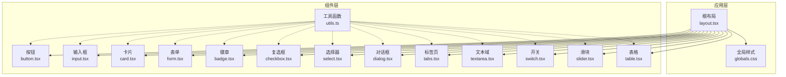
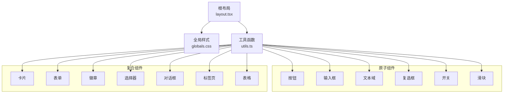
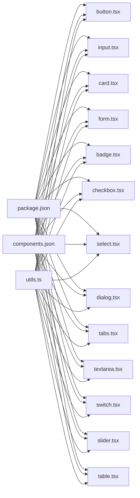

# UI组件库

<cite>
**本文引用的文件**
- [button.tsx](file://ai-content-project/src/components/ui/button.tsx)
- [input.tsx](file://ai-content-project/src/components/ui/input.tsx)
- [card.tsx](file://ai-content-project/src/components/ui/card.tsx)
- [form.tsx](file://ai-content-project/src/components/ui/form.tsx)
- [badge.tsx](file://ai-content-project/src/components/ui/badge.tsx)
- [checkbox.tsx](file://ai-content-project/src/components/ui/checkbox.tsx)
- [select.tsx](file://ai-content-project/src/components/ui/select.tsx)
- [dialog.tsx](file://ai-content-project/src/components/ui/dialog.tsx)
- [table.tsx](file://ai-content-project/src/components/ui/table.tsx)
- [tabs.tsx](file://ai-content-project/src/components/ui/tabs.tsx)
- [textarea.tsx](file://ai-content-project/src/components/ui/textarea.tsx)
- [switch.tsx](file://ai-content-project/src/components/ui/switch.tsx)
- [slider.tsx](file://ai-content-project/src/components/ui/slider.tsx)
- [utils.ts](file://ai-content-project/src/lib/utils.ts)
- [components.json](file://ai-content-project/components.json)
- [package.json](file://ai-content-project/package.json)
- [layout.tsx](file://ai-content-project/src/app/layout.tsx)
- [globals.css](file://ai-content-project/src/app/globals.css)
</cite>

## 目录
1. [简介](#简介)
2. [项目结构](#项目结构)
3. [核心组件](#核心组件)
4. [架构总览](#架构总览)
5. [详细组件分析](#详细组件分析)
6. [依赖关系分析](#依赖关系分析)
7. [性能考量](#性能考量)
8. [故障排查指南](#故障排查指南)
9. [结论](#结论)
10. [附录](#附录)

## 简介
本文件为该UI组件库的系统化组件文档，覆盖按钮、输入框、卡片、表单、徽章、复选框、选择器、对话框、表格、标签页、文本域、开关、滑块等基础与复合组件。文档从设计理念、属性配置、状态管理、事件处理、样式系统、组合模式、响应式与无障碍支持、可复用性与性能优化等方面进行深入说明，并提供使用示例与集成指南。

## 项目结构
UI组件集中于 src/components/ui 目录，采用按功能模块拆分的组织方式；样式系统基于 Tailwind CSS 与自定义 CSS 变量，通过全局样式文件统一主题色板与暗色模式；工具函数提供类名合并能力；组件配置文件定义了组件别名与主题风格。

图表来源
- [layout.tsx:15-33](file://ai-content-project/src/app/layout.tsx#L15-L33)
- [globals.css:1-138](file://ai-content-project/src/app/globals.css#L1-L138)
- [utils.ts:1-7](file://ai-content-project/src/lib/utils.ts#L1-L7)
- [button.tsx:1-63](file://ai-content-project/src/components/ui/button.tsx#L1-L63)
- [input.tsx:1-22](file://ai-content-project/src/components/ui/input.tsx#L1-L22)
- [card.tsx:1-93](file://ai-content-project/src/components/ui/card.tsx#L1-L93)
- [form.tsx:1-168](file://ai-content-project/src/components/ui/form.tsx#L1-L168)
- [badge.tsx:1-47](file://ai-content-project/src/components/ui/badge.tsx#L1-L47)
- [checkbox.tsx:1-33](file://ai-content-project/src/components/ui/checkbox.tsx#L1-L33)
- [select.tsx:1-191](file://ai-content-project/src/components/ui/select.tsx#L1-L191)
- [dialog.tsx:1-144](file://ai-content-project/src/components/ui/dialog.tsx#L1-L144)
- [tabs.tsx:1-67](file://ai-content-project/src/components/ui/tabs.tsx#L1-L67)
- [textarea.tsx:1-19](file://ai-content-project/src/components/ui/textarea.tsx#L1-L19)
- [switch.tsx:1-32](file://ai-content-project/src/components/ui/switch.tsx#L1-L32)
- [slider.tsx:1-64](file://ai-content-project/src/components/ui/slider.tsx#L1-L64)
- [table.tsx:1-117](file://ai-content-project/src/components/ui/table.tsx#L1-L117)

章节来源
- [layout.tsx:15-33](file://ai-content-project/src/app/layout.tsx#L15-L33)
- [globals.css:1-138](file://ai-content-project/src/app/globals.css#L1-L138)
- [components.json:1-22](file://ai-content-project/components.json#L1-L22)

## 核心组件
本节概述关键组件的设计理念与通用特性：变体与尺寸系统、状态与无障碍、事件处理与组合模式。

- 设计理念
  - 统一的视觉语言：通过 CSS 变量与 Tailwind 类实现一致的主题色板与圆角半径。
  - 可组合性：大量组件以“容器 + 子块”或“触发器 + 内容”的模式组合，便于扩展。
  - 无障碍优先：为交互元素设置正确的 ARIA 属性与键盘可达性。
  - 响应式与暗色模式：在全局样式中定义暗色变量与过渡效果，组件继承这些语义。

- 通用属性与行为
  - 数据槽与变体：组件普遍带有 data-slot 属性，配合变体系统（如 variant、size）控制外观。
  - 状态映射：聚焦态、禁用态、错误态通过 CSS 伪类与数据属性映射到视觉反馈。
  - 事件处理：受控/非受控模式由父组件决定，子组件仅负责渲染与回调触发。
  - 样式系统：使用 cn 合并类名，确保默认样式与用户传入类名的正确叠加。

章节来源
- [button.tsx:7-37](file://ai-content-project/src/components/ui/button.tsx#L7-L37)
- [input.tsx:5-19](file://ai-content-project/src/components/ui/input.tsx#L5-L19)
- [card.tsx:5-82](file://ai-content-project/src/components/ui/card.tsx#L5-L82)
- [form.tsx:19-167](file://ai-content-project/src/components/ui/form.tsx#L19-L167)
- [badge.tsx:7-26](file://ai-content-project/src/components/ui/badge.tsx#L7-L26)
- [checkbox.tsx:9-30](file://ai-content-project/src/components/ui/checkbox.tsx#L9-L30)
- [select.tsx:9-190](file://ai-content-project/src/components/ui/select.tsx#L9-L190)
- [dialog.tsx:9-143](file://ai-content-project/src/components/ui/dialog.tsx#L9-L143)
- [tabs.tsx:8-66](file://ai-content-project/src/components/ui/tabs.tsx#L8-L66)
- [textarea.tsx:5-18](file://ai-content-project/src/components/ui/textarea.tsx#L5-L18)
- [switch.tsx:8-31](file://ai-content-project/src/components/ui/switch.tsx#L8-L31)
- [slider.tsx:8-63](file://ai-content-project/src/components/ui/slider.tsx#L8-L63)
- [utils.ts:4-6](file://ai-content-project/src/lib/utils.ts#L4-L6)
- [globals.css:57-124](file://ai-content-project/src/app/globals.css#L57-L124)

## 架构总览
下图展示组件库的整体架构：应用根布局加载全局样式与工具函数，各 UI 组件通过 cn 合并类名并遵循变体系统；表单组件与 Radix UI 原子组件协作，提供可访问的交互体验。

图表来源
- [layout.tsx:15-33](file://ai-content-project/src/app/layout.tsx#L15-L33)
- [globals.css:1-138](file://ai-content-project/src/app/globals.css#L1-L138)
- [utils.ts:1-7](file://ai-content-project/src/lib/utils.ts#L1-L7)
- [button.tsx:1-63](file://ai-content-project/src/components/ui/button.tsx#L1-L63)
- [input.tsx:1-22](file://ai-content-project/src/components/ui/input.tsx#L1-L22)
- [textarea.tsx:1-19](file://ai-content-project/src/components/ui/textarea.tsx#L1-L19)
- [checkbox.tsx:1-33](file://ai-content-project/src/components/ui/checkbox.tsx#L1-L33)
- [switch.tsx:1-32](file://ai-content-project/src/components/ui/switch.tsx#L1-L32)
- [slider.tsx:1-64](file://ai-content-project/src/components/ui/slider.tsx#L1-L64)
- [card.tsx:1-93](file://ai-content-project/src/components/ui/card.tsx#L1-L93)
- [form.tsx:1-168](file://ai-content-project/src/components/ui/form.tsx#L1-L168)
- [badge.tsx:1-47](file://ai-content-project/src/components/ui/badge.tsx#L1-L47)
- [select.tsx:1-191](file://ai-content-project/src/components/ui/select.tsx#L1-L191)
- [dialog.tsx:1-144](file://ai-content-project/src/components/ui/dialog.tsx#L1-L144)
- [tabs.tsx:1-67](file://ai-content-project/src/components/ui/tabs.tsx#L1-L67)
- [table.tsx:1-117](file://ai-content-project/src/components/ui/table.tsx#L1-L117)

## 详细组件分析

### 按钮 Button
- 设计理念
  - 使用变体系统区分主次与危险等语义；尺寸系统适配图标、小号、默认、大号等场景。
  - 支持 asChild 模式，允许将按钮渲染为任意 HTML 元素，增强组合灵活性。
- 关键属性
  - variant: default、destructive、outline、secondary、ghost、link
  - size: default、sm、lg、icon、icon-sm、icon-lg
  - asChild: 是否以子节点作为渲染根
  - className: 自定义类名
- 状态与事件
  - 聚焦态与错误态通过 data-slot 与 CSS 变量映射；点击事件由父容器绑定。
- 样式系统
  - 默认类名包含对齐、圆角、阴影、过渡与可访问性环形边框；错误态与禁用态通过 aria-invalid 与 pointer-events 控制。
- 组合模式
  - 与图标组合时自动调整内边距；支持作为链接或表单提交按钮使用。
- 最佳实践
  - 优先使用变体表达语义，避免直接写死颜色；合理使用 asChild 提升可组合性。

章节来源
- [button.tsx:7-37](file://ai-content-project/src/components/ui/button.tsx#L7-L37)
- [button.tsx:39-60](file://ai-content-project/src/components/ui/button.tsx#L39-L60)
- [utils.ts:4-6](file://ai-content-project/src/lib/utils.ts#L4-L6)

### 输入框 Input
- 设计理念
  - 保持简洁的输入基线样式，强调聚焦态与错误态的即时反馈。
- 关键属性
  - type: 原生 input 类型
  - className: 自定义类名
- 状态与事件
  - 聚焦态与错误态通过 CSS 变量与 aria-invalid 映射；禁用态具备不可交互与透明度提示。
- 样式系统
  - 默认类名包含边框、背景、圆角、阴影与过渡；聚焦态带环形光晕。
- 组合模式
  - 可与按钮、图标、标签等组合形成输入组。
- 最佳实践
  - 在表单中结合 Label 与 FormMessage 使用，确保可访问性。

章节来源
- [input.tsx:5-19](file://ai-content-project/src/components/ui/input.tsx#L5-L19)
- [utils.ts:4-6](file://ai-content-project/src/lib/utils.ts#L4-L6)

### 卡片 Card
- 设计理念
  - 将卡片拆分为头部、标题、描述、内容、操作与底部，便于灵活布局与响应式排版。
- 关键子组件
  - CardHeader/CardTitle/CardDescription/CardAction/CardContent/CardFooter
- 状态与事件
  - 作为静态容器，不直接处理事件；事件由内部子元素承载。
- 样式系统
  - 头部网格布局支持右侧操作区；底部支持边框分隔与内边距。
- 组合模式
  - 与按钮、徽章、表格等组合，构建信息面板。
- 最佳实践
  - 使用 CardAction 放置次要操作，保持主内容清晰。

章节来源
- [card.tsx:5-82](file://ai-content-project/src/components/ui/card.tsx#L5-L82)
- [utils.ts:4-6](file://ai-content-project/src/lib/utils.ts#L4-L6)

### 表单 Form
- 设计理念
  - 基于 react-hook-form 的上下文提供表单项的 ID、描述与错误消息管理，提升可访问性与一致性。
- 关键子组件
  - Form、FormField、FormItem、FormLabel、FormControl、FormDescription、FormMessage
- 状态与事件
  - useFormField 提供字段状态、ID 生成与 ARIA 描述符；错误态通过 aria-invalid 传递。
- 样式系统
  - 错误态下的标签与消息具备破坏色；描述与消息使用语义化字号。
- 组合模式
  - 与 Input、Textarea、Select、Checkbox、Switch 等组合形成复杂表单。
- 最佳实践
  - 为每个表单项提供明确的标签与描述；使用 FormMessage 展示验证结果。

章节来源
- [form.tsx:19-167](file://ai-content-project/src/components/ui/form.tsx#L19-L167)
- [utils.ts:4-6](file://ai-content-project/src/lib/utils.ts#L4-L6)

### 徽章 Badge
- 设计理念
  - 用于标记状态、类型或优先级，强调语义化与可读性。
- 关键属性
  - variant: default、secondary、destructive、outline
  - asChild: 渲染为子元素
  - className: 自定义类名
- 状态与事件
  - 聚焦态与错误态通过 CSS 变量映射；点击事件由父容器绑定。
- 样式系统
  - 默认类名包含圆角、边框、内边距与过渡；支持图标与文本组合。
- 组合模式
  - 与按钮、卡片、列表项组合，标识状态或标签。
- 最佳实践
  - 使用 outline 变体突出强调；避免过度使用破坏色。

章节来源
- [badge.tsx:7-26](file://ai-content-project/src/components/ui/badge.tsx#L7-L26)
- [badge.tsx:28-44](file://ai-content-project/src/components/ui/badge.tsx#L28-L44)
- [utils.ts:4-6](file://ai-content-project/src/lib/utils.ts#L4-L6)

### 复选框 Checkbox
- 设计理念
  - 基于 Radix UI 的原生复选框，提供清晰的选中/未选中指示。
- 关键属性
  - className: 自定义类名
- 状态与事件
  - 选中态通过 data-state 映射；错误态与聚焦态通过 CSS 变量与环形边框控制。
- 样式系统
  - 默认类名包含圆角、阴影与过渡；指示器居中显示。
- 组合模式
  - 与 FormLabel 组合形成可访问的表单控件。
- 最佳实践
  - 与 Form 组件配合，确保 ARIA 描述与错误提示一致。

章节来源
- [checkbox.tsx:9-30](file://ai-content-project/src/components/ui/checkbox.tsx#L9-L30)
- [utils.ts:4-6](file://ai-content-project/src/lib/utils.ts#L4-L6)

### 选择器 Select
- 设计理念
  - 提供受控与非受控两种模式，支持分组、标签、分隔线与滚动按钮。
- 关键子组件
  - Select、SelectTrigger、SelectValue、SelectContent、SelectLabel、SelectItem、SelectSeparator、SelectScrollUpButton、SelectScrollDownButton
- 状态与事件
  - 打开/关闭通过 Portal 渲染；选中态通过 ItemIndicator 显示。
- 样式系统
  - 触发器支持尺寸变体；内容区提供动画进入/退出与滚动条。
- 组合模式
  - 与 Form 组件组合，形成可访问的下拉选择。
- 最佳实践
  - 为长列表提供滚动按钮；使用 SelectLabel 分组标题。

章节来源
- [select.tsx:9-190](file://ai-content-project/src/components/ui/select.tsx#L9-L190)
- [utils.ts:4-6](file://ai-content-project/src/lib/utils.ts#L4-L6)

### 对话框 Dialog
- 设计理念
  - 基于 Radix Dialog，提供遮罩、定位、关闭按钮与可访问性支持。
- 关键子组件
  - Dialog、DialogTrigger、DialogPortal、DialogOverlay、DialogContent、DialogHeader、DialogFooter、DialogTitle、DialogDescription、DialogClose
- 状态与事件
  - 打开/关闭通过 Portal 渲染；关闭按钮具备无障碍文本。
- 样式系统
  - 内容区固定在视口中心，支持响应式宽度与阴影。
- 组合模式
  - 与表单、卡片组合，构建确认、编辑或详情对话框。
- 最佳实践
  - 为关闭按钮提供 sr-only 文本；根据内容长度控制最大宽度。

章节来源
- [dialog.tsx:9-143](file://ai-content-project/src/components/ui/dialog.tsx#L9-L143)
- [utils.ts:4-6](file://ai-content-project/src/lib/utils.ts#L4-L6)

### 标签页 Tabs
- 设计理念
  - 提供受控与非受控两种模式，支持多页签切换与内容区域。
- 关键子组件
  - Tabs、TabsList、TabsTrigger、TabsContent
- 状态与事件
  - 选中态通过 data-state 映射；支持键盘导航。
- 样式系统
  - 触发器在选中态具备背景与阴影；整体采用过渡与环形边框。
- 组合模式
  - 与卡片、表格组合，构建分组信息展示。
- 最佳实践
  - 为触发器提供明确的标签文本；避免过多页签导致拥挤。

章节来源
- [tabs.tsx:8-66](file://ai-content-project/src/components/ui/tabs.tsx#L8-L66)
- [utils.ts:4-6](file://ai-content-project/src/lib/utils.ts#L4-L6)

### 文本域 Textarea
- 设计理念
  - 提供多行文本输入，强调聚焦态与错误态反馈。
- 关键属性
  - className: 自定义类名
- 状态与事件
  - 聚焦态与错误态通过 CSS 变量与 aria-invalid 映射；禁用态具备不可交互与透明度提示。
- 样式系统
  - 默认类名包含边框、背景、圆角、阴影与过渡；支持最小高度。
- 组合模式
  - 与表单、按钮组合，形成评论、描述等输入场景。
- 最佳实践
  - 配合 FormDescription 与 FormMessage 使用，提升可访问性。

章节来源
- [textarea.tsx:5-18](file://ai-content-project/src/components/ui/textarea.tsx#L5-L18)
- [utils.ts:4-6](file://ai-content-project/src/lib/utils.ts#L4-L6)

### 开关 Switch
- 设计理念
  - 基于 Radix Switch，提供直观的二元状态切换。
- 关键属性
  - className: 自定义类名
- 状态与事件
  - 选中态通过 data-state 映射；支持键盘切换。
- 样式系统
  - 轨道与拇指具备过渡与位移动画；禁用态降低不透明度。
- 组合模式
  - 与表单、设置面板组合，提供开关式配置。
- 最佳实践
  - 为开关提供明确的标签与说明文本。

章节来源
- [switch.tsx:8-31](file://ai-content-project/src/components/ui/switch.tsx#L8-L31)
- [utils.ts:4-6](file://ai-content-project/src/lib/utils.ts#L4-L6)

### 滑块 Slider
- 设计理念
  - 支持单值与范围滑块，提供精确的数值调节。
- 关键属性
  - defaultValue、value、min、max：控制初始值与取值范围
  - className: 自定义类名
- 状态与事件
  - 支持水平/垂直方向；禁用态降低不透明度。
- 样式系统
  - 轨道与范围具备渐变色；拇指具备环形边框与过渡。
- 组合模式
  - 与表单、设置面板组合，提供数值输入场景。
- 最佳实践
  - 为滑块提供刻度或数值显示；限制步进以提升精度。

章节来源
- [slider.tsx:8-63](file://ai-content-project/src/components/ui/slider.tsx#L8-L63)
- [utils.ts:4-6](file://ai-content-project/src/lib/utils.ts#L4-L6)

### 表格 Table
- 设计理念
  - 提供容器与子组件的完整表格体系，支持横向滚动与悬停态。
- 关键子组件
  - Table、TableHeader、TableBody、TableFooter、TableRow、TableHead、TableCell、TableCaption
- 状态与事件
  - 行悬停态通过 hover 与 data-selected 映射；支持选中态。
- 样式系统
  - 容器支持横向滚动；表头与单元格具备对齐与间距规范。
- 组合模式
  - 与卡片、按钮组合，构建数据列表与统计面板。
- 最佳实践
  - 为长表提供横向滚动容器；为表头提供排序指示。

章节来源
- [table.tsx:7-116](file://ai-content-project/src/components/ui/table.tsx#L7-L116)
- [utils.ts:4-6](file://ai-content-project/src/lib/utils.ts#L4-L6)

## 依赖关系分析
组件库依赖关系围绕工具函数与第三方库展开：工具函数提供类名合并；Radix UI 提供可访问性基础；Lucide 提供图标；Tailwind 与自定义 CSS 变量提供样式基础。

图表来源
- [package.json:15-76](file://ai-content-project/package.json#L15-L76)
- [components.json:1-22](file://ai-content-project/components.json#L1-L22)
- [utils.ts:1-7](file://ai-content-project/src/lib/utils.ts#L1-L7)
- [button.tsx:1-63](file://ai-content-project/src/components/ui/button.tsx#L1-L63)
- [input.tsx:1-22](file://ai-content-project/src/components/ui/input.tsx#L1-L22)
- [card.tsx:1-93](file://ai-content-project/src/components/ui/card.tsx#L1-L93)
- [form.tsx:1-168](file://ai-content-project/src/components/ui/form.tsx#L1-L168)
- [badge.tsx:1-47](file://ai-content-project/src/components/ui/badge.tsx#L1-L47)
- [checkbox.tsx:1-33](file://ai-content-project/src/components/ui/checkbox.tsx#L1-L33)
- [select.tsx:1-191](file://ai-content-project/src/components/ui/select.tsx#L1-L191)
- [dialog.tsx:1-144](file://ai-content-project/src/components/ui/dialog.tsx#L1-L144)
- [tabs.tsx:1-67](file://ai-content-project/src/components/ui/tabs.tsx#L1-L67)
- [textarea.tsx:1-19](file://ai-content-project/src/components/ui/textarea.tsx#L1-L19)
- [switch.tsx:1-32](file://ai-content-project/src/components/ui/switch.tsx#L1-L32)
- [slider.tsx:1-64](file://ai-content-project/src/components/ui/slider.tsx#L1-L64)
- [table.tsx:1-117](file://ai-content-project/src/components/ui/table.tsx#L1-L117)

章节来源
- [package.json:15-76](file://ai-content-project/package.json#L15-L76)
- [components.json:1-22](file://ai-content-project/components.json#L1-L22)

## 性能考量
- 类名合并
  - 使用 twMerge 与 clsx 合并类名，避免重复与冲突，减少样式覆盖层级。
- 受控/非受控
  - 表单组件建议在父组件中统一管理状态，减少子组件内部状态更新。
- 动画与过渡
  - 对话框与选择器的内容区使用 CSS 动画，注意在低端设备上的性能影响。
- 图标与体积
  - Lucide 图标按需引入，避免全量打包；必要时使用 SVG 组件裁剪。
- 暗色模式
  - CSS 变量切换成本低，建议在根节点切换 .dark 类，避免频繁重排。

## 故障排查指南
- 样式不生效
  - 检查是否正确引入全局样式与工具函数；确认 data-slot 与变体属性是否匹配。
- 表单不可访问
  - 确保 FormLabel 与 FormControl 正确关联；为错误态设置 aria-invalid。
- 对话框无法关闭
  - 检查 DialogPortal 与 Overlay 是否正确渲染；确认关闭按钮的 data-slot。
- 选择器内容错位
  - 检查 SelectTrigger 的尺寸属性与 SelectContent 的对齐参数；确认 Portal 渲染位置。
- 滑块无响应
  - 检查 defaultValue/value 与 min/max 的取值范围；确认禁用态未阻止交互。

章节来源
- [form.tsx:90-156](file://ai-content-project/src/components/ui/form.tsx#L90-L156)
- [dialog.tsx:56-80](file://ai-content-project/src/components/ui/dialog.tsx#L56-L80)
- [select.tsx:53-87](file://ai-content-project/src/components/ui/select.tsx#L53-L87)
- [slider.tsx:16-24](file://ai-content-project/src/components/ui/slider.tsx#L16-L24)

## 结论
该组件库以统一的变体系统与可访问性为核心，结合 Radix UI 原子组件与 Tailwind 样式体系，提供了高可组合性与强一致性的 UI 基础设施。通过合理的状态管理、事件处理与样式系统，组件在功能与体验上达到平衡。建议在实际项目中遵循组件的组合模式与最佳实践，持续优化性能与可维护性。

## 附录
- 组件别名与主题
  - 组件别名：components、ui、lib、hooks
  - 主题风格：new-york
  - Tailwind 配置：css 变量启用、基础颜色 neutral
- 全局样式要点
  - CSS 变量定义：背景、前景、卡片、弹出层、主色、次色、强调色、边框、输入、环形边框等
  - 暗色模式：.dark 类切换变量值
  - 基础层：全局边框与文字颜色应用

章节来源
- [components.json:1-22](file://ai-content-project/components.json#L1-L22)
- [globals.css:57-124](file://ai-content-project/src/app/globals.css#L57-L124)
- [globals.css:126-138](file://ai-content-project/src/app/globals.css#L126-L138)