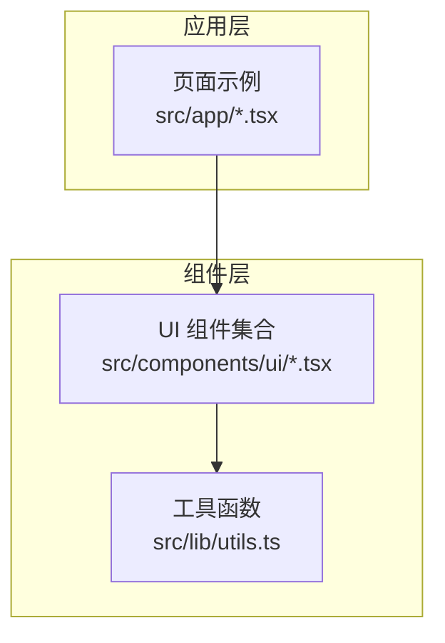
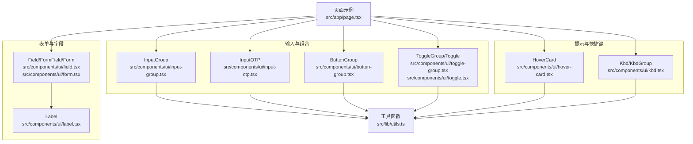
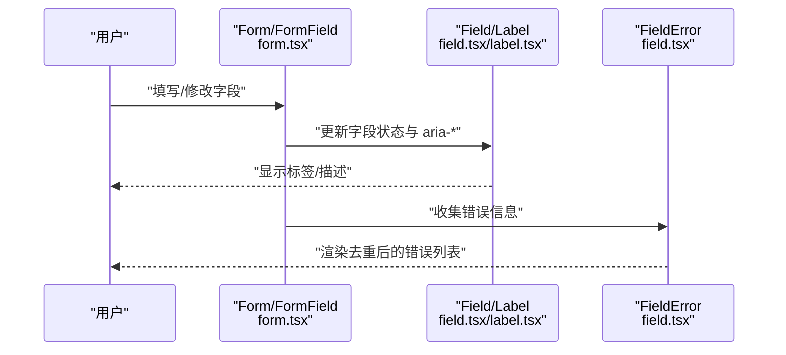
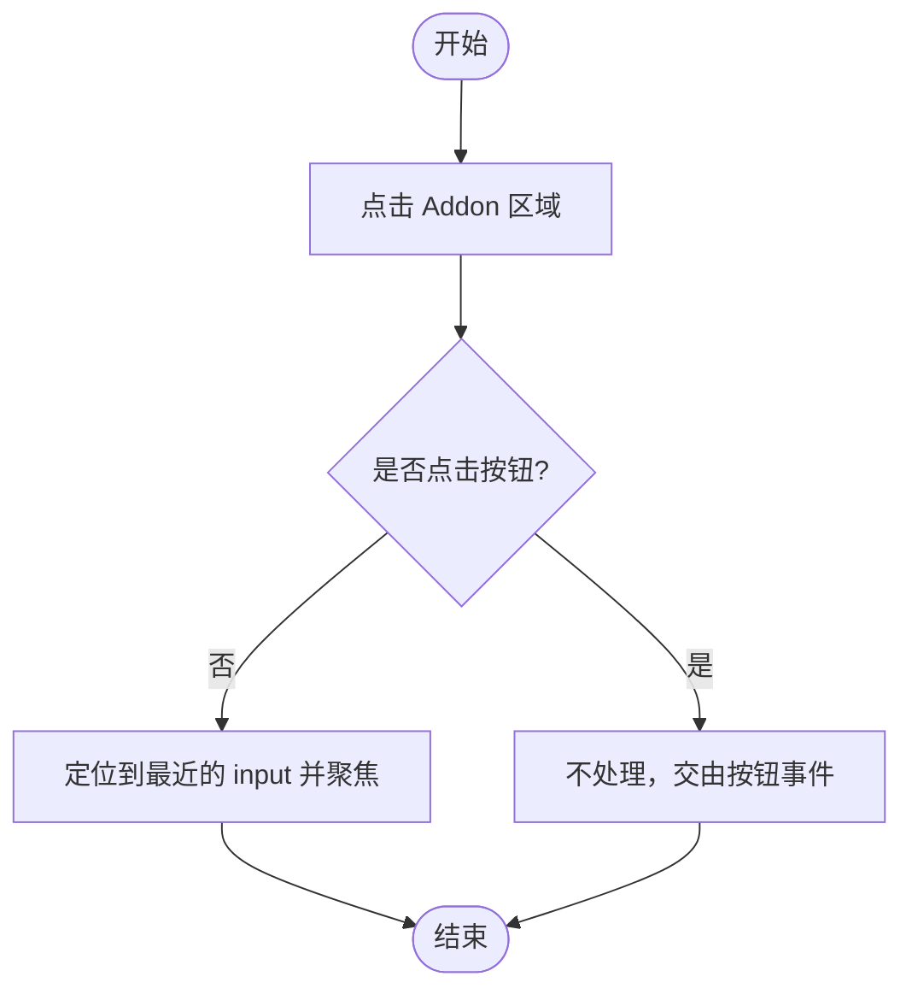
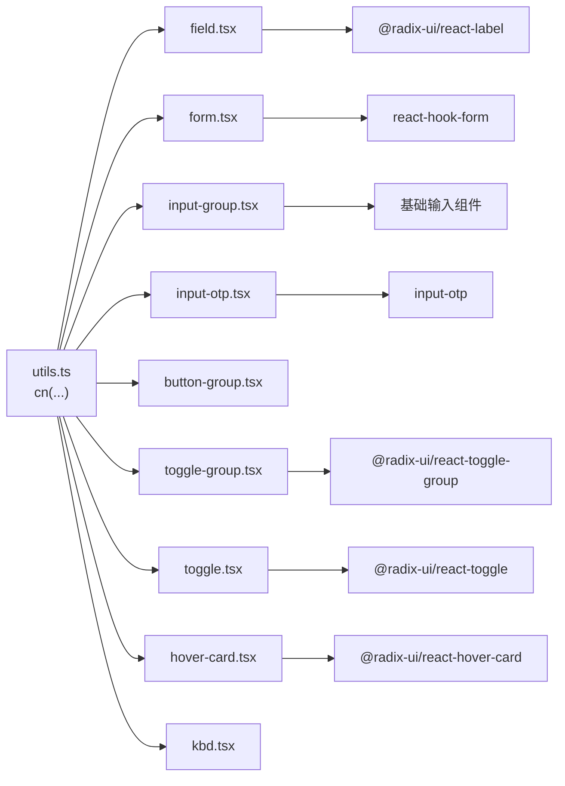

# 专用功能组件

<cite>
**本文引用的文件**
- [button-group.tsx](file://ai-content-project/src/components/ui/button-group.tsx)
- [input-group.tsx](file://ai-content-project/src/components/ui/input-group.tsx)
- [input-otp.tsx](file://ai-content-project/src/components/ui/input-otp.tsx)
- [toggle-group.tsx](file://ai-content-project/src/components/ui/toggle-group.tsx)
- [kbd.tsx](file://ai-content-project/src/components/ui/kbd.tsx)
- [hover-card.tsx](file://ai-content-project/src/components/ui/hover-card.tsx)
- [field.tsx](file://ai-content-project/src/components/ui/field.tsx)
- [form.tsx](file://ai-content-project/src/components/ui/form.tsx)
- [toggle.tsx](file://ai-content-project/src/components/ui/toggle.tsx)
- [label.tsx](file://ai-content-project/src/components/ui/label.tsx)
- [utils.ts](file://ai-content-project/src/lib/utils.ts)
- [page.tsx](file://ai-content-project/src/app/page.tsx)
</cite>

## 目录
1. [引言](#引言)
2. [项目结构](#项目结构)
3. [核心组件](#核心组件)
4. [架构总览](#架构总览)
5. [详细组件分析](#详细组件分析)
6. [依赖关系分析](#依赖关系分析)
7. [性能考量](#性能考量)
8. [故障排查指南](#故障排查指南)
9. [结论](#结论)
10. [附录：最佳实践与使用技巧](#附录最佳实践与使用技巧)

## 引言
本文件聚焦于本项目的“专用功能组件”，涵盖以下高阶 UI 组件的设计理念与实现方式：
- 字段与表单体系：Field/FormField/Form 等，用于构建可访问、可维护的表单布局与状态管理。
- 输入组合：InputGroup 及其子组件（Addon/Button/Text/Input/Textarea），统一输入控件的外观、对齐与交互。
- 键盘快捷键：Kbd/KbdGroup，用于展示键盘快捷键与组合键。
- 悬停卡片：HoverCard，提供轻量级悬浮提示与上下文信息展示。
- 输入一次性密码（OTP）：InputOTP 及其槽位与分隔符，支持占位输入与焦点管理。
- 按钮组合：ButtonGroup，用于将多个按钮在视觉上组合为一组，支持水平/垂直排列与分隔线。
- 切换组合：ToggleGroup/Toggle，用于多选/互斥的开关式选择器，支持尺寸与风格变体。

这些组件通过一致的语义化数据属性、可组合的子组件与变体系统，确保在复杂业务场景中保持一致性与可扩展性。

## 项目结构
本项目采用按“功能域”组织的前端工程结构，UI 组件集中在 src/components/ui 下，通用工具函数位于 src/lib/utils.ts。页面示例位于 src/app 下，便于演示组件的实际用法。

图表来源
- [page.tsx:1-285](file://ai-content-project/src/app/page.tsx#L1-L285)
- [utils.ts:1-7](file://ai-content-project/src/lib/utils.ts#L1-L7)

章节来源
- [page.tsx:1-285](file://ai-content-project/src/app/page.tsx#L1-L285)
- [utils.ts:1-7](file://ai-content-project/src/lib/utils.ts#L1-L7)

## 核心组件
本节概述各专用功能组件的核心职责、关键特性与适用场景，并给出集成要点与注意事项。

- 字段与表单体系（Field/Form）
  - 设计理念：以语义化数据属性与容器化结构，将标签、描述、错误、内容等元素进行逻辑分组，提升可访问性与可维护性。
  - 关键能力：支持垂直/水平/响应式三种布局方向；自动映射表单状态（如错误）到样式；与 react-hook-form 集成，提供 useFormField 等上下文钩子。
  - 使用场景：复杂表单、设置页、配置面板、审批流程等需要清晰字段层级与状态反馈的界面。
  - 集成方法：在 FormProvider 包裹下使用 FormField/FormControl，配合 Field、FieldLabel、FieldDescription、FieldError 构建字段单元。
  - 注意事项：确保 Field 的 orientation 与布局容器一致；错误渲染会去重并支持列表形式。

- 输入组合（InputGroup）
  - 设计理念：将输入控件与其前缀/后缀（Addon/Text/Button）、文本域（Textarea）统一为一个可聚焦的整体，支持多种对齐与状态（聚焦、错误）。
  - 关键能力：基于 align 属性控制内联/块级对齐；点击非按钮区域可聚焦内部输入；提供 InputGroupAddon/InputGroupButton/InputGroupText/InputGroupInput/InputGroupTextarea 子组件。
  - 使用场景：搜索框（带搜索图标/按钮）、价格输入（带货币符号）、密码输入（带显示/隐藏按钮）、复合查询条件等。
  - 集成方法：将 InputGroup 作为根容器，内部嵌套 Addon/Button/Text/Input/Textarea；根据 align 设置对齐策略。
  - 注意事项：Focus 与错误态通过伪类与 has- 前缀选择器实现，需保证子元素正确设置 data-slot。

- 键盘快捷键（Kbd/KbdGroup）
  - 设计理念：以语义化 kbd 元素与分组容器展示键盘快捷键，适配 Tooltip 等上下文组件。
  - 关键能力：KbdGroup 支持组合键分组；Kbd 提供统一的视觉与尺寸规范。
  - 使用场景：帮助提示、操作说明、快捷键提示等。
  - 集成方法：直接在 Tooltip 或其他浮层中使用 Kbd/KbdGroup 渲染组合键。
  - 注意事项：与 Tooltip 的数据槽协同时，Kbd 会自动调整背景与文字色以适配主题。

- 悬停卡片（HoverCard）
  - 设计理念：基于 Radix UI 的 HoverCard 原语，提供轻量级悬浮内容展示，支持触发器与内容区分离。
  - 关键能力：Portal 渲染，避免被父容器裁剪；支持对齐与偏移；动画入场/出场。
  - 使用场景：用户头像信息、资源预览、辅助说明等。
  - 集成方法：使用 HoverCard/HoverCardTrigger/HoverCardContent 包裹触发元素与内容。
  - 注意事项：内容区需设置合适的宽度与层级，避免遮挡主内容。

- 输入一次性密码（InputOTP）
  - 设计理念：基于 input-otp 库封装，提供 OTP 输入的槽位、分隔符与占位光标动画。
  - 关键能力：槽位激活态高亮与边框/阴影；fake caret 动画；支持禁用态与容器级样式透传。
  - 使用场景：验证码输入、登录令牌、安全验证等。
  - 集成方法：使用 InputOTP 作为根容器，内部使用 InputOTPGroup 与 InputOTPSlot；必要时添加 InputOTPSeparator。
  - 注意事项：槽位索引与上下文必须一一对应；注意禁用态与可访问性属性。

- 按钮组合（ButtonGroup）
  - 设计理念：将多个按钮在视觉上组合为一组，支持水平/垂直排列与分隔线，强调按钮间的关联性。
  - 关键能力：orientation 控制方向；ButtonGroupSeparator 提供分隔；ButtonGroupText 提供文本分组。
  - 使用场景：工具栏、批量操作、视图切换等。
  - 集成方法：将 ButtonGroup 作为容器，内部放置 Button、ButtonGroupSeparator、ButtonGroupText 等。
  - 注意事项：水平模式下首尾按钮圆角合并，垂直模式下上下边框合并。

- 切换组合（ToggleGroup/Toggle）
  - 设计理念：Radix UI Toggle 的变体封装，支持 outline/default 风格与多尺寸，ToggleGroup 提供间距与上下文传递。
  - 关键能力：上下文传递 size/variant/spacings；支持互斥/多选（由原语决定）；激活态样式与焦点环。
  - 使用场景：格式化工具（加粗/斜体/下划线）、筛选器（多选）、视图模式切换等。
  - 集成方法：ToggleGroup 作为根容器，ToggleGroupItem 作为子项；通过 spacing 控制间距。
  - 注意事项：spacing=0 时去除额外阴影与圆角合并，适合紧凑布局。

章节来源
- [field.tsx:1-249](file://ai-content-project/src/components/ui/field.tsx#L1-L249)
- [form.tsx:1-168](file://ai-content-project/src/components/ui/form.tsx#L1-L168)
- [input-group.tsx:1-171](file://ai-content-project/src/components/ui/input-group.tsx#L1-L171)
- [kbd.tsx:1-29](file://ai-content-project/src/components/ui/kbd.tsx#L1-L29)
- [hover-card.tsx:1-45](file://ai-content-project/src/components/ui/hover-card.tsx#L1-L45)
- [input-otp.tsx:1-78](file://ai-content-project/src/components/ui/input-otp.tsx#L1-L78)
- [button-group.tsx:1-84](file://ai-content-project/src/components/ui/button-group.tsx#L1-L84)
- [toggle-group.tsx:1-84](file://ai-content-project/src/components/ui/toggle-group.tsx#L1-L84)
- [toggle.tsx:1-48](file://ai-content-project/src/components/ui/toggle.tsx#L1-L48)
- [label.tsx:1-25](file://ai-content-project/src/components/ui/label.tsx#L1-L25)
- [utils.ts:1-7](file://ai-content-project/src/lib/utils.ts#L1-L7)

## 架构总览
下图展示了专用功能组件在页面中的典型协作关系：页面通过 Form/Field/Label 管理表单状态与语义；InputGroup 提供复合输入体验；Kbd/HoverCard 用于增强可访问性与提示；ButtonGroup/ToggleGroup/Toggle 提供操作与切换；InputOTP 用于安全输入场景。

图表来源
- [page.tsx:1-285](file://ai-content-project/src/app/page.tsx#L1-L285)
- [field.tsx:1-249](file://ai-content-project/src/components/ui/field.tsx#L1-L249)
- [form.tsx:1-168](file://ai-content-project/src/components/ui/form.tsx#L1-L168)
- [label.tsx:1-25](file://ai-content-project/src/components/ui/label.tsx#L1-L25)
- [input-group.tsx:1-171](file://ai-content-project/src/components/ui/input-group.tsx#L1-L171)
- [input-otp.tsx:1-78](file://ai-content-project/src/components/ui/input-otp.tsx#L1-L78)
- [button-group.tsx:1-84](file://ai-content-project/src/components/ui/button-group.tsx#L1-L84)
- [toggle-group.tsx:1-84](file://ai-content-project/src/components/ui/toggle-group.tsx#L1-L84)
- [toggle.tsx:1-48](file://ai-content-project/src/components/ui/toggle.tsx#L1-L48)
- [hover-card.tsx:1-45](file://ai-content-project/src/components/ui/hover-card.tsx#L1-L45)
- [kbd.tsx:1-29](file://ai-content-project/src/components/ui/kbd.tsx#L1-L29)
- [utils.ts:1-7](file://ai-content-project/src/lib/utils.ts#L1-L7)

## 详细组件分析

### 字段与表单体系（Field/Form）
- 设计要点
  - 语义化数据槽：通过 data-slot 与 data-orientation 等属性，使样式与行为与 DOM 结构解耦。
  - 响应式布局：orientation 支持 vertical/horizontal/responsive 三档，满足不同屏幕与布局需求。
  - 可访问性：结合 react-hook-form 的 useFormContext/useFormState/useFormField，自动同步 aria-* 属性与无障碍 ID。
- 数据流与处理
  - 表单状态变更 → Field/Error 渲染 → 用户反馈 → 表单提交。
  - 错误去重：FieldError 会对重复消息进行去重并支持列表渲染。
- 复杂度与性能
  - 样式计算通过变体系统与伪类选择器完成，无运行时开销；错误渲染在有错误时才执行。
- 集成步骤
  - 在 FormProvider 下使用 FormField 包裹受控输入；
  - 使用 Field/FieldLabel/FieldDescription/FieldError 组合字段；
  - 在提交时读取 formState 与 errors 进行校验与反馈。

图表来源
- [form.tsx:1-168](file://ai-content-project/src/components/ui/form.tsx#L1-L168)
- [field.tsx:1-249](file://ai-content-project/src/components/ui/field.tsx#L1-L249)
- [label.tsx:1-25](file://ai-content-project/src/components/ui/label.tsx#L1-L25)

章节来源
- [form.tsx:1-168](file://ai-content-project/src/components/ui/form.tsx#L1-L168)
- [field.tsx:1-249](file://ai-content-project/src/components/ui/field.tsx#L1-L249)
- [label.tsx:1-25](file://ai-content-project/src/components/ui/label.tsx#L1-L25)

### 输入组合（InputGroup）
- 设计要点
  - 对齐策略：通过 has-[data-align=...] 伪类实现 inline-start/end 与 block-start/end 的对齐与间距。
  - 聚焦与错误态：通过 has-[[data-slot=input-group-control]:focus-visible] 与 aria-invalid 实现视觉反馈。
  - 子组件职责：Addon 负责前缀/后缀与点击聚焦；Button 提供小尺寸按钮；Text 提供静态文本；Input/Textarea 提供输入控件。
- 数据流与处理
  - 点击 Addon 非按钮区域 → 定位到最近的 input 并聚焦。
  - 输入变化 → 由外部表单库或组件自身处理值与状态。
- 复杂度与性能
  - 样式切换基于伪类选择器，渲染成本低；点击聚焦逻辑仅在点击时执行。
- 集成步骤
  - 将 InputGroup 作为根容器；
  - 在内部嵌入 Addon/Button/Text/Input/Textarea；
  - 根据布局需求设置 align。

图表来源
- [input-group.tsx:60-80](file://ai-content-project/src/components/ui/input-group.tsx#L60-L80)

章节来源
- [input-group.tsx:1-171](file://ai-content-project/src/components/ui/input-group.tsx#L1-L171)

### 键盘快捷键（Kbd/KbdGroup）
- 设计要点
  - 语义化 kbd 元素，配合 KbdGroup 实现组合键分组；
  - 与 Tooltip 协同：当位于 Tooltip 内部时，Kbd 自动调整颜色以适配背景。
- 使用建议
  - 在帮助气泡、菜单项旁展示快捷键；
  - 组合键使用 KbdGroup 包裹，提升可读性。

章节来源
- [kbd.tsx:1-29](file://ai-content-project/src/components/ui/kbd.tsx#L1-L29)

### 悬停卡片（HoverCard）
- 设计要点
  - 基于 Radix UI 的 HoverCard 原语，Portal 渲染避免溢出；
  - 支持对齐与侧偏移，动画入场/出场。
- 使用建议
  - 用于用户头像信息、资源缩略图预览、辅助说明等；
  - 内容不宜过长，避免遮挡主内容。

章节来源
- [hover-card.tsx:1-45](file://ai-content-project/src/components/ui/hover-card.tsx#L1-L45)

### 输入一次性密码（InputOTP）
- 设计要点
  - 基于 input-otp 的槽位系统，支持 fake caret 动画；
  - 激活态高亮与边框/阴影，容器与槽位均支持自定义样式。
- 使用建议
  - 适用于验证码、登录令牌等安全输入场景；
  - 注意禁用态与可访问性属性，确保键盘可用性。

章节来源
- [input-otp.tsx:1-78](file://ai-content-project/src/components/ui/input-otp.tsx#L1-L78)

### 按钮组合（ButtonGroup）
- 设计要点
  - orientation 支持 horizontal/vertical，自动合并圆角与边框；
  - 提供 ButtonGroupSeparator 与 ButtonGroupText，增强分组与说明能力。
- 使用建议
  - 工具栏、批量操作、视图切换等场景；
  - 注意水平/垂直模式下的视觉连贯性。

章节来源
- [button-group.tsx:1-84](file://ai-content-project/src/components/ui/button-group.tsx#L1-L84)

### 切换组合（ToggleGroup/Toggle）
- 设计要点
  - ToggleGroup 通过 Context 向子项传递 size/variant/spacings；
  - spacing=0 时去除额外阴影与圆角合并，适合紧凑布局；
  - Toggle 提供 outline/default 风格与多尺寸。
- 使用建议
  - 格式化工具、筛选器、视图模式切换等；
  - 与表单结合时，确保 aria-pressed 与状态同步。

章节来源
- [toggle-group.tsx:1-84](file://ai-content-project/src/components/ui/toggle-group.tsx#L1-L84)
- [toggle.tsx:1-48](file://ai-content-project/src/components/ui/toggle.tsx#L1-L48)

## 依赖关系分析
- 组件间依赖
  - 所有组件均依赖工具函数 cn（clsx + tailwind-merge）进行类名合并与覆盖。
  - 表单体系依赖 react-hook-form 与 @radix-ui/react-label，提供上下文与可访问性支持。
  - 输入组合依赖 Button/Input/Textarea 等基础组件。
  - ToggleGroup 依赖 @radix-ui/react-toggle-group，Toggle 依赖 @radix-ui/react-toggle。
  - HoverCard 依赖 @radix-ui/react-hover-card。
  - InputOTP 依赖 input-otp 与 lucide-react 的图标。
- 外部依赖与集成点
  - Tailwind CSS 与 class-variance-authority 提供变体与样式系统；
  - Radix UI 提供可访问性与状态管理的基础原语；
  - Lucide React 提供图标支持。

图表来源
- [utils.ts:1-7](file://ai-content-project/src/lib/utils.ts#L1-L7)
- [field.tsx:1-249](file://ai-content-project/src/components/ui/field.tsx#L1-L249)
- [form.tsx:1-168](file://ai-content-project/src/components/ui/form.tsx#L1-L168)
- [input-group.tsx:1-171](file://ai-content-project/src/components/ui/input-group.tsx#L1-L171)
- [input-otp.tsx:1-78](file://ai-content-project/src/components/ui/input-otp.tsx#L1-L78)
- [button-group.tsx:1-84](file://ai-content-project/src/components/ui/button-group.tsx#L1-L84)
- [toggle-group.tsx:1-84](file://ai-content-project/src/components/ui/toggle-group.tsx#L1-L84)
- [toggle.tsx:1-48](file://ai-content-project/src/components/ui/toggle.tsx#L1-L48)
- [hover-card.tsx:1-45](file://ai-content-project/src/components/ui/hover-card.tsx#L1-L45)
- [kbd.tsx:1-29](file://ai-content-project/src/components/ui/kbd.tsx#L1-L29)

章节来源
- [utils.ts:1-7](file://ai-content-project/src/lib/utils.ts#L1-L7)
- [form.tsx:1-168](file://ai-content-project/src/components/ui/form.tsx#L1-L168)
- [field.tsx:1-249](file://ai-content-project/src/components/ui/field.tsx#L1-L249)
- [input-group.tsx:1-171](file://ai-content-project/src/components/ui/input-group.tsx#L1-L171)
- [input-otp.tsx:1-78](file://ai-content-project/src/components/ui/input-otp.tsx#L1-L78)
- [button-group.tsx:1-84](file://ai-content-project/src/components/ui/button-group.tsx#L1-L84)
- [toggle-group.tsx:1-84](file://ai-content-project/src/components/ui/toggle-group.tsx#L1-L84)
- [toggle.tsx:1-48](file://ai-content-project/src/components/ui/toggle.tsx#L1-L48)
- [hover-card.tsx:1-45](file://ai-content-project/src/components/ui/hover-card.tsx#L1-L45)
- [kbd.tsx:1-29](file://ai-content-project/src/components/ui/kbd.tsx#L1-L29)

## 性能考量
- 样式系统
  - 使用 class-variance-authority 与伪类选择器，避免运行时样式计算，渲染成本低。
- 事件处理
  - InputGroup 的点击聚焦仅在点击 Addon 非按钮区域触发，减少不必要的 DOM 查询。
- 可访问性
  - 表单体系通过 aria-invalid、aria-describedby 等属性与 react-hook-form 同步，降低二次计算成本。
- 图标与动画
  - InputOTP 的 fake caret 为轻量动画，仅在激活槽位时出现；HoverCard 的动画为 CSS 动画，性能稳定。

## 故障排查指南
- 表单错误未显示
  - 检查 Form/FormField 是否正确包裹；确认 useFormField 返回的 error 是否存在；检查 FieldError 的 children 与 errors 参数。
- 输入组合点击无效
  - 确认 Addon 内部未包含按钮；点击区域是否被按钮覆盖；确保 Input/Textarea 正确设置了 data-slot。
- OTP 槽位不聚焦
  - 检查 InputOTPGroup 与 InputOTPSlot 的索引是否一致；确认 input-otp 上下文是否正确传递。
- ToggleGroup 样式异常
  - 检查 spacing 与 variant 的组合；确认子项未手动覆盖 data-slot 导致上下文失效。
- HoverCard 内容被裁剪
  - 确认使用 Portal 渲染；检查层级与宽度设置；避免父容器 overflow。
- Kbd 在 Tooltip 中颜色不正确
  - 确保 Kbd 位于 Tooltip 内部且未被外部样式覆盖。

章节来源
- [form.tsx:1-168](file://ai-content-project/src/components/ui/form.tsx#L1-L168)
- [field.tsx:1-249](file://ai-content-project/src/components/ui/field.tsx#L1-L249)
- [input-group.tsx:1-171](file://ai-content-project/src/components/ui/input-group.tsx#L1-L171)
- [input-otp.tsx:1-78](file://ai-content-project/src/components/ui/input-otp.tsx#L1-L78)
- [toggle-group.tsx:1-84](file://ai-content-project/src/components/ui/toggle-group.tsx#L1-L84)
- [hover-card.tsx:1-45](file://ai-content-project/src/components/ui/hover-card.tsx#L1-L45)
- [kbd.tsx:1-29](file://ai-content-project/src/components/ui/kbd.tsx#L1-L29)

## 结论
本项目的专用功能组件围绕“语义化数据槽 + 变体系统 + 可访问性 + 可组合性”的设计原则构建，既保证了复杂业务场景下的表现力，也兼顾了开发效率与维护成本。通过统一的工具函数与基础组件，这些组件能够在不同页面与模块中复用，形成一致的用户体验。

## 附录：最佳实践与使用技巧
- 表单与字段
  - 使用 Field 的 orientation 与响应式布局，确保在移动端与桌面端的一致体验。
  - 错误信息尽量简洁明确，必要时使用 FieldError 的列表渲染。
- 输入组合
  - 优先使用 InputGroupAddon 作为前缀/后缀，避免直接在 Input 外层包裹按钮导致样式错位。
  - 对于需要聚焦的复合输入，确保 Addon 的点击聚焦逻辑生效。
- OTP 输入
  - 为每个槽位提供清晰的占位符与激活态提示；在禁用态时提供明确的视觉反馈。
- 按钮与切换
  - ButtonGroup 与 ToggleGroup 的 spacing 与 variant 选择要与整体设计风格一致；避免过度拥挤。
- 提示与快捷键
  - Kbd/KbdGroup 与 HoverCard/HoverCardContent 搭配使用，提供简洁明了的帮助信息。
- 可访问性
  - 为所有交互元素提供正确的 aria-* 属性；确保键盘可达性与焦点顺序合理。