# 反馈提示组件

<cite>
**本文引用的文件**
- [alert.tsx](file://ai-content-project/src/components/ui/alert.tsx)
- [alert-dialog.tsx](file://ai-content-project/src/components/ui/alert-dialog.tsx)
- [dialog.tsx](file://ai-content-project/src/components/ui/dialog.tsx)
- [empty.tsx](file://ai-content-project/src/components/ui/empty.tsx)
- [spinner.tsx](file://ai-content-project/src/components/ui/spinner.tsx)
- [tooltip.tsx](file://ai-content-project/src/components/ui/tooltip.tsx)
- [sonner.tsx](file://ai-content-project/src/components/ui/sonner.tsx)
- [skeleton.tsx](file://ai-content-project/src/components/ui/skeleton.tsx)
- [hover-card.tsx](file://ai-content-project/src/components/ui/hover-card.tsx)
- [popover.tsx](file://ai-content-project/src/components/ui/popover.tsx)
- [drawer.tsx](file://ai-content-project/src/components/ui/drawer.tsx)
- [utils.ts](file://ai-content-project/src/lib/utils.ts)
</cite>

## 目录
1. [简介](#简介)
2. [项目结构](#项目结构)
3. [核心组件](#核心组件)
4. [架构总览](#架构总览)
5. [详细组件分析](#详细组件分析)
6. [依赖关系分析](#依赖关系分析)
7. [性能考量](#性能考量)
8. [故障排查指南](#故障排查指南)
9. [结论](#结论)
10. [附录：使用示例与最佳实践](#附录使用示例与最佳实践)

## 简介
本文件系统性梳理并说明本仓库中的反馈提示类组件，包括警告（Alert）、确认对话框（Alert Dialog）、普通对话框（Dialog）、空状态（Empty）、加载指示器（Spinner）、骨架屏（Skeleton）、工具提示（Tooltip）、气泡卡片（Hover Card）、弹出层（Popover）与抽屉（Drawer），以及全局通知（Toaster）。文档从设计理念、消息传递机制、显示时机与用户交互响应出发，结合样式定制、动画效果与无障碍支持，给出可操作的用户体验最佳实践与通知策略，并提供具体场景下的应用指南。

## 项目结构
反馈提示相关组件集中于 ui 目录，采用“原子化 + 组合”的设计模式，通过 Radix UI 原子能力组合形成语义明确的复合组件；全局通知由 Toaster 提供统一入口，配合主题系统实现一致的视觉与交互体验。

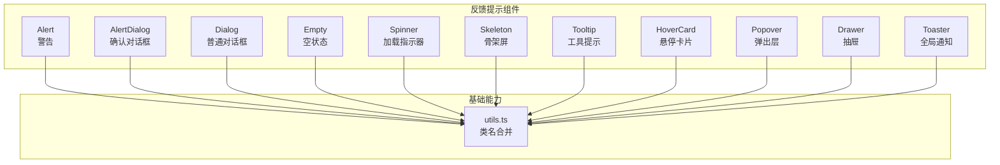

图表来源
- [alert.tsx:1-67](file://ai-content-project/src/components/ui/alert.tsx#L1-L67)
- [alert-dialog.tsx:1-158](file://ai-content-project/src/components/ui/alert-dialog.tsx#L1-L158)
- [dialog.tsx:1-144](file://ai-content-project/src/components/ui/dialog.tsx#L1-L144)
- [empty.tsx:1-105](file://ai-content-project/src/components/ui/empty.tsx#L1-L105)
- [spinner.tsx:1-17](file://ai-content-project/src/components/ui/spinner.tsx#L1-L17)
- [skeleton.tsx:1-14](file://ai-content-project/src/components/ui/skeleton.tsx#L1-L14)
- [tooltip.tsx:1-62](file://ai-content-project/src/components/ui/tooltip.tsx#L1-L62)
- [hover-card.tsx:1-45](file://ai-content-project/src/components/ui/hover-card.tsx#L1-L45)
- [popover.tsx:1-49](file://ai-content-project/src/components/ui/popover.tsx#L1-L49)
- [drawer.tsx:1-136](file://ai-content-project/src/components/ui/drawer.tsx#L1-L136)
- [sonner.tsx:1-41](file://ai-content-project/src/components/ui/sonner.tsx#L1-L41)
- [utils.ts:1-7](file://ai-content-project/src/lib/utils.ts#L1-L7)

章节来源
- [alert.tsx:1-67](file://ai-content-project/src/components/ui/alert.tsx#L1-L67)
- [alert-dialog.tsx:1-158](file://ai-content-project/src/components/ui/alert-dialog.tsx#L1-L158)
- [dialog.tsx:1-144](file://ai-content-project/src/components/ui/dialog.tsx#L1-L144)
- [empty.tsx:1-105](file://ai-content-project/src/components/ui/empty.tsx#L1-L105)
- [spinner.tsx:1-17](file://ai-content-project/src/components/ui/spinner.tsx#L1-L17)
- [skeleton.tsx:1-14](file://ai-content-project/src/components/ui/skeleton.tsx#L1-L14)
- [tooltip.tsx:1-62](file://ai-content-project/src/components/ui/tooltip.tsx#L1-L62)
- [hover-card.tsx:1-45](file://ai-content-project/src/components/ui/hover-card.tsx#L1-L45)
- [popover.tsx:1-49](file://ai-content-project/src/components/ui/popover.tsx#L1-L49)
- [drawer.tsx:1-136](file://ai-content-project/src/components/ui/drawer.tsx#L1-L136)
- [sonner.tsx:1-41](file://ai-content-project/src/components/ui/sonner.tsx#L1-L41)
- [utils.ts:1-7](file://ai-content-project/src/lib/utils.ts#L1-L7)

## 核心组件
- 警告（Alert）
  - 设计理念：用于向用户传达重要信息，支持默认与破坏性两种语义变体，强调标题与描述的层次化呈现。
  - 关键点：通过语义槽位标记（如标题、描述）提升可访问性；网格布局与图标间距控制确保信息密度合理。
- 确认对话框（Alert Dialog）
  - 设计理念：用于需要用户明确确认的操作（如删除、危险动作），强调遮罩层与居中动画，保证焦点安全与操作意图明确。
  - 关键点：Overlay 动画与 Content 动画组合，提供进入/退出的视觉反馈；Action/Cance l按钮风格区分主次。
- 普通对话框（Dialog）
  - 设计理念：通用型弹窗容器，支持可选关闭按钮与自定义内容区域，适合表单、详情展示等场景。
  - 关键点：Portal 渲染避免层级问题；Overlay 遮罩与 Content 居中定位；Header/Footer 区域化组织。
- 空状态（Empty）
  - 设计理念：在数据为空时提供友好提示，支持媒体区（图标/占位图）、标题、描述与补充内容的组合。
  - 关键点：媒体区变体（默认/图标）适配不同信息密度；描述文本支持链接与下划线样式。
- 加载指示器（Spinner）
  - 设计理念：轻量级旋转加载，常用于按钮点击、列表刷新、异步请求等待等短时阻塞场景。
  - 关键点：ARIA 角色与标签保障可访问；尺寸与动画可控。
- 骨架屏（Skeleton）
  - 设计理念：在内容加载前提供占位元素，降低感知延迟，改善加载体验。
  - 关键点：脉动动画与背景色一致，避免视觉跳变。
- 工具提示（Tooltip）
  - 设计理念：简短上下文帮助信息，基于 Provider 控制延迟与全局行为，支持多方位偏移。
  - 关键点：Portal 渲染与箭头方向，确保在复杂布局中稳定显示。
- 气泡卡片（Hover Card）
  - 设计理念：悬停触发的轻量信息卡片，适合富内容预览（如用户资料、图片缩略图）。
  - 关键点：Open/Close 动画与对齐控制，避免遮挡正文。
- 弹出层（Popover）
  - 设计理念：从触发元素弹出的面板，常用于菜单、筛选器、设置项等。
  - 关键点：对齐与侧偏参数，适配不同屏幕位置。
- 抽屉（Drawer）
  - 设计理念：移动端优先的滑动面板，支持多方向（上/下/左/右）展开，提供手柄与自适应高度。
  - 关键点：方向类名与最大高度约束，保证在小屏设备上的可用性。
- 全局通知（Toaster）
  - 设计理念：统一的通知入口，支持成功、信息、警告、错误、加载五种类型，自动适配主题变量。
  - 关键点：图标映射与 CSS 变量桥接，确保与设计系统一致。

章节来源
- [alert.tsx:1-67](file://ai-content-project/src/components/ui/alert.tsx#L1-L67)
- [alert-dialog.tsx:1-158](file://ai-content-project/src/components/ui/alert-dialog.tsx#L1-L158)
- [dialog.tsx:1-144](file://ai-content-project/src/components/ui/dialog.tsx#L1-L144)
- [empty.tsx:1-105](file://ai-content-project/src/components/ui/empty.tsx#L1-L105)
- [spinner.tsx:1-17](file://ai-content-project/src/components/ui/spinner.tsx#L1-L17)
- [skeleton.tsx:1-14](file://ai-content-project/src/components/ui/skeleton.tsx#L1-L14)
- [tooltip.tsx:1-62](file://ai-content-project/src/components/ui/tooltip.tsx#L1-L62)
- [hover-card.tsx:1-45](file://ai-content-project/src/components/ui/hover-card.tsx#L1-L45)
- [popover.tsx:1-49](file://ai-content-project/src/components/ui/popover.tsx#L1-L49)
- [drawer.tsx:1-136](file://ai-content-project/src/components/ui/drawer.tsx#L1-L136)
- [sonner.tsx:1-41](file://ai-content-project/src/components/ui/sonner.tsx#L1-L41)

## 架构总览
反馈组件整体遵循“基础原子能力 + 组合容器 + 主题桥接”的分层架构。Radix UI 提供可访问性与状态机，Tailwind 类名合并工具负责样式拼接，Toaster 作为全局通知中枢，统一承载各类反馈消息。

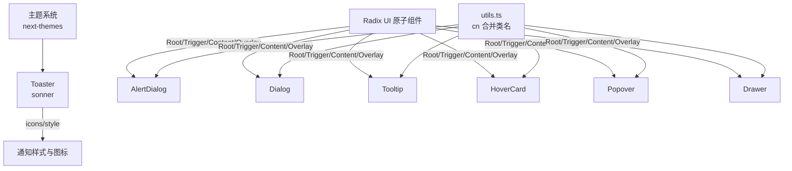

图表来源
- [alert-dialog.tsx:1-158](file://ai-content-project/src/components/ui/alert-dialog.tsx#L1-L158)
- [dialog.tsx:1-144](file://ai-content-project/src/components/ui/dialog.tsx#L1-L144)
- [tooltip.tsx:1-62](file://ai-content-project/src/components/ui/tooltip.tsx#L1-L62)
- [hover-card.tsx:1-45](file://ai-content-project/src/components/ui/hover-card.tsx#L1-L45)
- [popover.tsx:1-49](file://ai-content-project/src/components/ui/popover.tsx#L1-L49)
- [drawer.tsx:1-136](file://ai-content-project/src/components/ui/drawer.tsx#L1-L136)
- [sonner.tsx:1-41](file://ai-content-project/src/components/ui/sonner.tsx#L1-L41)
- [utils.ts:1-7](file://ai-content-project/src/lib/utils.ts#L1-L7)

## 详细组件分析

### 警告（Alert）
- 结构与职责
  - 容器：提供语义角色与槽位标记，支持默认与破坏性两类外观。
  - 子组件：标题与描述，分别承担层级与正文信息。
- 消息传递机制
  - 通过 props 传入标题与描述内容；破坏性变体强调危险语义，影响文本颜色与图标语义。
- 显示时机与交互
  - 页面初始化即可见或在特定业务流程中按需渲染；无交互按钮，仅作信息提示。
- 样式与动画
  - 使用网格布局与图标间距控制，保证信息对齐；破坏性变体通过子选择器限定描述文本颜色。
- 无障碍
  - 容器具备 alert 角色，利于读屏识别。

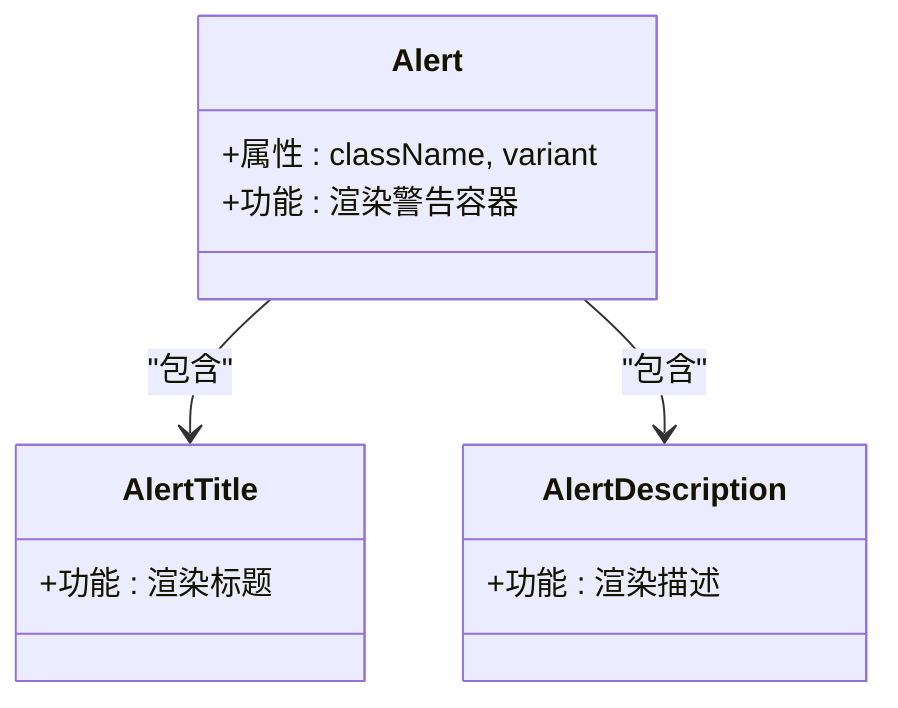

图表来源
- [alert.tsx:22-66](file://ai-content-project/src/components/ui/alert.tsx#L22-L66)

章节来源
- [alert.tsx:1-67](file://ai-content-project/src/components/ui/alert.tsx#L1-L67)

### 确认对话框（Alert Dialog）
- 结构与职责
  - Root/Trigger/Portal/Overlay/Content/Header/Footer/Title/Description/Action/Cancel 组成完整确认流。
- 消息传递机制
  - 通过 Overlay 与 Content 的开合状态驱动动画；Action 与 Cancel 分离主次操作。
- 显示时机与交互
  - 用户触发某动作后打开；用户必须显式选择 Action 或 Cancel 才能关闭。
- 样式与动画
  - 开/关均使用淡入/淡出与缩放组合，提升过渡自然度。
- 无障碍
  - 焦点管理与键盘交互由 Radix UI 提供；建议在打开时将焦点置于主要操作按钮。

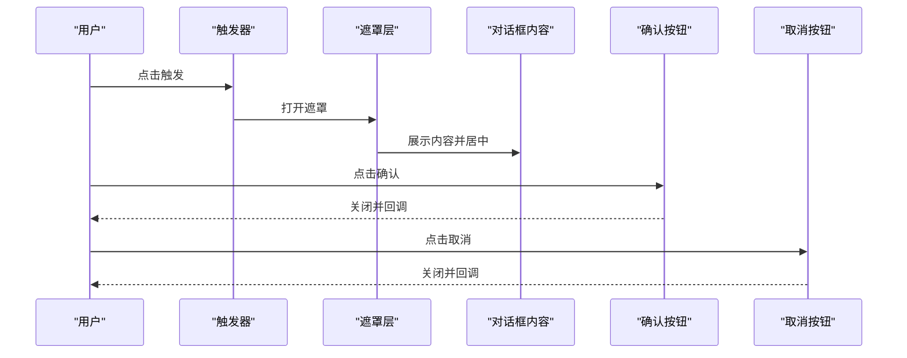

图表来源
- [alert-dialog.tsx:9-157](file://ai-content-project/src/components/ui/alert-dialog.tsx#L9-L157)

章节来源
- [alert-dialog.tsx:1-158](file://ai-content-project/src/components/ui/alert-dialog.tsx#L1-L158)

### 普通对话框（Dialog）
- 结构与职责
  - 与 Alert Dialog 类似，但更通用；支持可选关闭按钮与自定义内容。
- 消息传递机制
  - 通过 Portal 将内容挂载到 Portal 中，避免层级与溢出问题。
- 显示时机与交互
  - 适合表单提交、详情查看等场景；可配置是否显示关闭按钮。
- 样式与动画
  - 与确认对话框一致的开/关动画与居中定位。
- 无障碍
  - 焦点管理与键盘交互由 Radix UI 提供；建议在打开时将焦点置于首可交互元素。

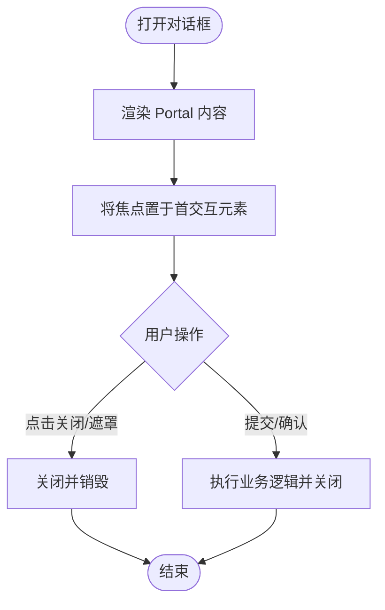

图表来源
- [dialog.tsx:56-81](file://ai-content-project/src/components/ui/dialog.tsx#L56-L81)

章节来源
- [dialog.tsx:1-144](file://ai-content-project/src/components/ui/dialog.tsx#L1-L144)

### 空状态（Empty）
- 结构与职责
  - Empty 为主容器，内部包含 Header/Title/Description/Content/Media 等子组件。
  - Media 支持默认与图标两种变体，便于在不同密度下展示。
- 消息传递机制
  - 通过子组件组合表达“当前无数据”这一状态；描述文本支持链接样式。
- 显示时机与交互
  - 列表/表格/筛选后无结果时展示；可搭配操作按钮引导用户采取下一步。
- 样式与动画
  - 垂直居中与水平留白，确保在不同容器尺寸下保持良好比例。
- 无障碍
  - 语义清晰，描述文本可被读屏朗读。

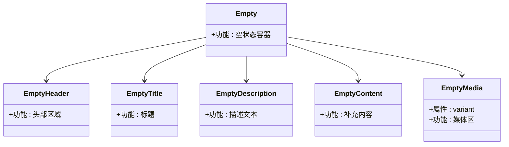

图表来源
- [empty.tsx:5-104](file://ai-content-project/src/components/ui/empty.tsx#L5-L104)

章节来源
- [empty.tsx:1-105](file://ai-content-project/src/components/ui/empty.tsx#L1-L105)

### 加载指示器（Spinner）
- 结构与职责
  - 基于旋转图标封装，提供 ARIA 角色与标签，适合作为按钮内嵌或独立显示。
- 消息传递机制
  - 通过 props 透传 SVG 属性，支持尺寸与类名定制。
- 显示时机与交互
  - 在异步请求、页面切换、按钮点击后短暂阻塞期间展示。
- 样式与动画
  - 单一旋转动画，简洁高效；建议与按钮禁用态配合。
- 无障碍
  - 提供状态角色与标签，避免读屏用户困惑。

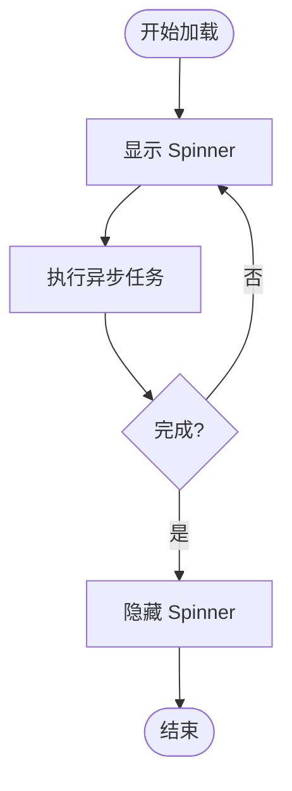

图表来源
- [spinner.tsx:5-14](file://ai-content-project/src/components/ui/spinner.tsx#L5-L14)

章节来源
- [spinner.tsx:1-17](file://ai-content-project/src/components/ui/spinner.tsx#L1-L17)

### 骨架屏（Skeleton）
- 结构与职责
  - 占位元素，模拟内容区域，减少感知延迟。
- 消息传递机制
  - 通过背景色与脉动动画营造“即将加载”的预期。
- 显示时机与交互
  - 数据请求前展示；完成后替换为真实内容。
- 样式与动画
  - 脉动动画与背景色一致，避免视觉跳变。
- 无障碍
  - 仅为占位，不承载交互。

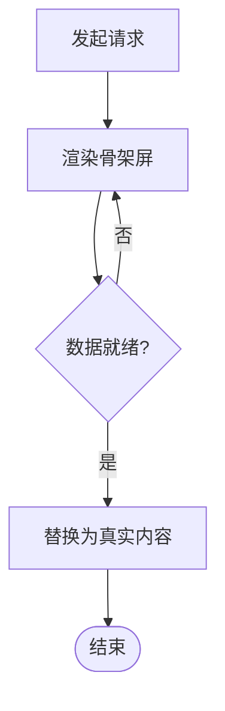

图表来源
- [skeleton.tsx:3-11](file://ai-content-project/src/components/ui/skeleton.tsx#L3-L11)

章节来源
- [skeleton.tsx:1-14](file://ai-content-project/src/components/ui/skeleton.tsx#L1-L14)

### 工具提示（Tooltip）
- 结构与职责
  - Provider 控制全局延迟；Root/Trigger/Content/Portal 组成完整提示链路。
- 消息传递机制
  - 鼠标悬停触发，支持多方位偏移；Portal 渲染避免层级问题。
- 显示时机与交互
  - 悬停即显，离开即隐；可通过 Provider 设置延迟时间。
- 样式与动画
  - 多方向滑入/缩放组合，箭头方向与背景前景对比度高。
- 无障碍
  - 建议在移动设备上提供长按或点击触发的替代方案。

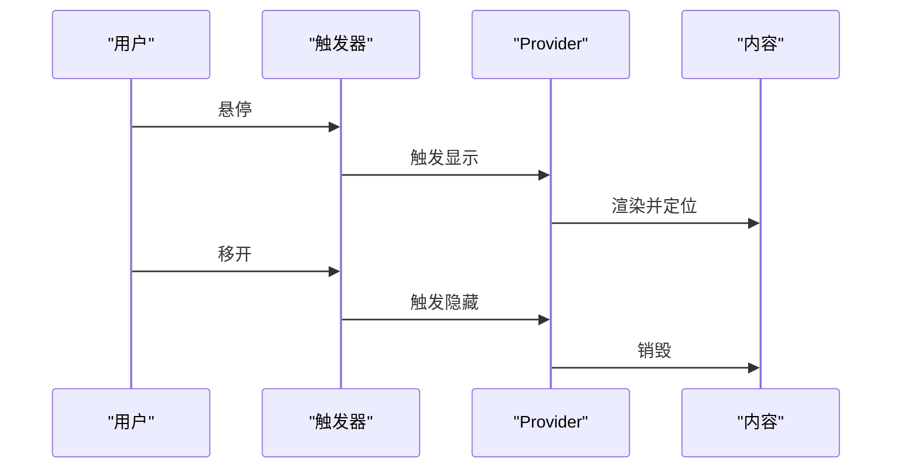

图表来源
- [tooltip.tsx:8-59](file://ai-content-project/src/components/ui/tooltip.tsx#L8-L59)

章节来源
- [tooltip.tsx:1-62](file://ai-content-project/src/components/ui/tooltip.tsx#L1-L62)

### 气泡卡片（Hover Card）
- 结构与职责
  - 与 Tooltip 类似，但内容更丰富，适合展示富信息。
- 消息传递机制
  - 悬停触发，Portal 渲染，支持对齐与侧偏。
- 显示时机与交互
  - 适合用户探索性信息，避免打断主流程。
- 样式与动画
  - Open/Close 动画与边框阴影，突出浮层。
- 无障碍
  - 建议提供键盘可达性与替代交互。

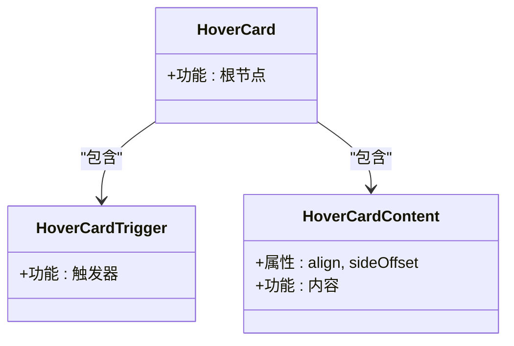

图表来源
- [hover-card.tsx:8-44](file://ai-content-project/src/components/ui/hover-card.tsx#L8-L44)

章节来源
- [hover-card.tsx:1-45](file://ai-content-project/src/components/ui/hover-card.tsx#L1-L45)

### 弹出层（Popover）
- 结构与职责
  - 从触发元素弹出的面板，常用于菜单、筛选器。
- 消息传递机制
  - 通过 Portal 渲染，支持对齐与侧偏参数。
- 显示时机与交互
  - 点击或聚焦触发；点击外部或再次点击可关闭。
- 样式与动画
  - 与 Hover Card 类似的动画与定位策略。
- 无障碍
  - 焦点管理与键盘导航由 Radix UI 提供。

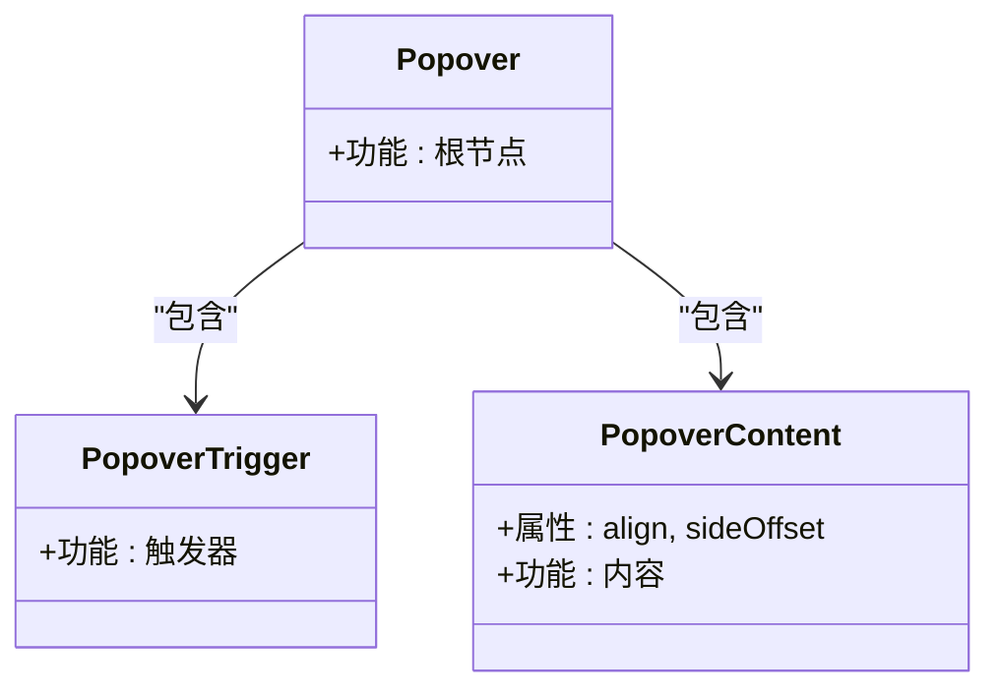

图表来源
- [popover.tsx:8-47](file://ai-content-project/src/components/ui/popover.tsx#L8-L47)

章节来源
- [popover.tsx:1-49](file://ai-content-project/src/components/ui/popover.tsx#L1-L49)

### 抽屉（Drawer）
- 结构与职责
  - 移动端优先的滑动面板，支持四向展开与手柄。
- 消息传递机制
  - 基于 vaul 库，通过方向类名与最大高度约束适配不同场景。
- 显示时机与交互
  - 适合移动端底部/侧边操作面板；支持手势关闭。
- 样式与动画
  - 方向类名与过渡动画，保证流畅体验。
- 无障碍
  - 注意在小屏设备上的可触达性与键盘导航。

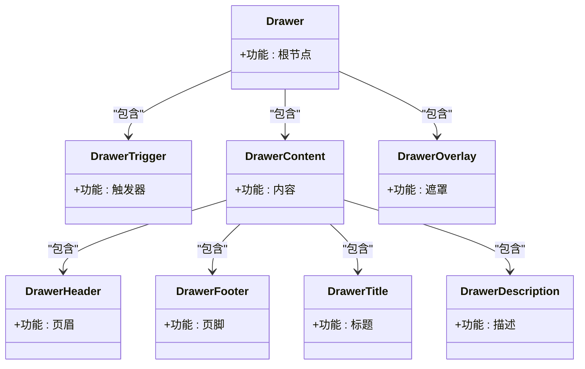

图表来源
- [drawer.tsx:8-135](file://ai-content-project/src/components/ui/drawer.tsx#L8-L135)

章节来源
- [drawer.tsx:1-136](file://ai-content-project/src/components/ui/drawer.tsx#L1-L136)

### 全局通知（Toaster）
- 结构与职责
  - 基于 sonner 的全局通知入口，支持多种类型图标与主题变量桥接。
- 消息传递机制
  - 通过主题系统动态选择主题；图标映射统一视觉语言。
- 显示时机与交互
  - 业务成功/失败/警告/信息/加载时调用；自动消失或手动关闭。
- 样式与动画
  - 与设计系统变量对齐，确保在浅/深色模式下一致。
- 无障碍
  - 建议提供静音选项与键盘关闭方式。

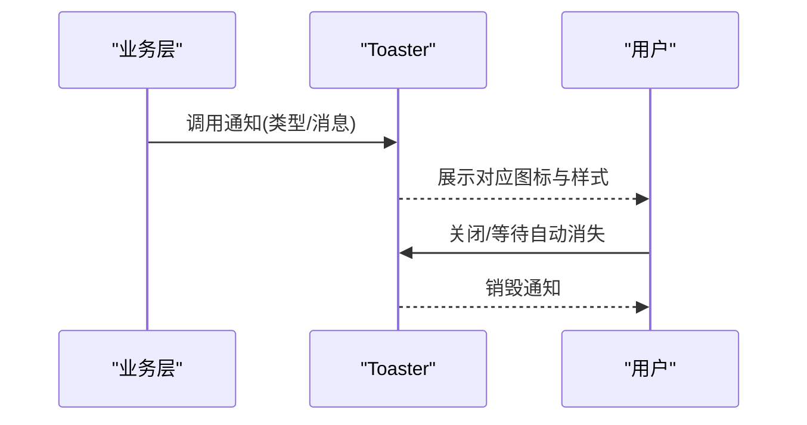

图表来源
- [sonner.tsx:13-38](file://ai-content-project/src/components/ui/sonner.tsx#L13-L38)

章节来源
- [sonner.tsx:1-41](file://ai-content-project/src/components/ui/sonner.tsx#L1-L41)

## 依赖关系分析
- 组件耦合
  - 所有反馈组件均依赖 utils.ts 的类名合并函数，确保样式拼接的一致性与可维护性。
  - 对话框系列（Dialog/Alert Dialog）共享相同的动画与定位策略。
  - Tooltip/Hover Card/Popover/Drawer 均基于 Radix UI，具备一致的可访问性与状态管理。
- 外部依赖
  - 主题系统（next-themes）与通知库（sonner）为全局通知提供主题与图标支持。
- 潜在循环依赖
  - 当前结构为单向依赖（组件 -> 工具），无循环风险。

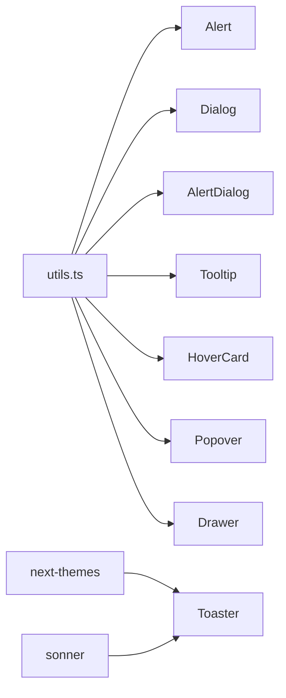

图表来源
- [utils.ts:1-7](file://ai-content-project/src/lib/utils.ts#L1-L7)
- [sonner.tsx:1-41](file://ai-content-project/src/components/ui/sonner.tsx#L1-L41)

章节来源
- [utils.ts:1-7](file://ai-content-project/src/lib/utils.ts#L1-L7)
- [sonner.tsx:1-41](file://ai-content-project/src/components/ui/sonner.tsx#L1-L41)

## 性能考量
- 动画与渲染
  - 对话框与浮层组件普遍使用 CSS 动画与 Portal 渲染，建议在大量实例场景下复用同一 Provider/Portal，减少重复挂载。
- 图标与主题
  - Toaster 的图标为轻量 SVG，建议避免在高频触发场景中频繁创建新实例。
- 无障碍与可访问性
  - 所有基于 Radix UI 的组件已内置焦点管理；在移动端应关注手势与键盘的兼容性。

## 故障排查指南
- 对话框无法关闭
  - 检查是否正确使用 Portal 与 Overlay；确认事件冒泡未被阻止。
- Tooltip 不显示
  - 检查 Provider 的延迟设置；确认触发器与内容在同一容器树中。
- 空状态样式错乱
  - 检查媒体区变体与容器类名拼接；确保描述文本的链接样式未被覆盖。
- 加载指示器不旋转
  - 检查 ARIA 角色与类名；确认动画未被全局样式覆盖。
- 通知图标不显示
  - 检查主题系统是否正确初始化；确认图标映射是否生效。

章节来源
- [alert-dialog.tsx:1-158](file://ai-content-project/src/components/ui/alert-dialog.tsx#L1-L158)
- [dialog.tsx:1-144](file://ai-content-project/src/components/ui/dialog.tsx#L1-L144)
- [tooltip.tsx:1-62](file://ai-content-project/src/components/ui/tooltip.tsx#L1-L62)
- [empty.tsx:1-105](file://ai-content-project/src/components/ui/empty.tsx#L1-L105)
- [spinner.tsx:1-17](file://ai-content-project/src/components/ui/spinner.tsx#L1-L17)
- [sonner.tsx:1-41](file://ai-content-project/src/components/ui/sonner.tsx#L1-L41)

## 结论
本仓库的反馈提示组件以 Radix UI 为基础，结合 Tailwind 与主题系统，构建了覆盖警告、确认、对话、空状态、加载、骨架、工具提示、浮层、抽屉与全局通知的完整体系。组件在可访问性、动画体验与样式一致性方面均有明确设计取舍，适用于桌面与移动端的多样化场景。建议在实际项目中根据业务语义选择合适组件，并遵循通知策略与消息设计原则，持续优化用户体验。

## 附录：使用示例与最佳实践
- 警告（Alert）
  - 使用时机：页面初始化提示、表单校验失败、操作结果提示。
  - 最佳实践：破坏性变体仅用于严重错误；标题简洁、描述具体。
- 确认对话框（Alert Dialog）
  - 使用时机：删除、撤销、危险操作。
  - 最佳实践：Action 明确为最终确认；Cancel 语义清晰；避免连续触发。
- 普通对话框（Dialog）
  - 使用时机：表单提交、详情查看、设置面板。
  - 最佳实践：合理设置宽度与高度；提供关闭按钮；焦点置于首交互元素。
- 空状态（Empty）
  - 使用时机：列表/表格无数据、筛选后无结果。
  - 最佳实践：提供引导性文案与操作按钮；媒体区与文字平衡。
- 加载指示器（Spinner）
  - 使用时机：按钮点击后、页面切换、异步请求。
  - 最佳实践：与按钮禁用态配合；避免长时间旋转。
- 骨架屏（Skeleton）
  - 使用时机：数据请求前占位。
  - 最佳实践：与真实内容尺寸一致；避免过度使用导致感知疲劳。
- 工具提示（Tooltip）
  - 使用时机：图标/按钮辅助说明。
  - 最佳实践：内容简短；设置合理延迟；移动端提供替代交互。
- 气泡卡片（Hover Card）
  - 使用时机：用户资料、富信息预览。
  - 最佳实践：内容不宜过长；注意定位与遮挡。
- 弹出层（Popover）
  - 使用时机：菜单、筛选器、设置项。
  - 最佳实践：对齐与侧偏适配布局；提供键盘导航。
- 抽屉（Drawer）
  - 使用时机：移动端底部/侧边面板。
  - 最佳实践：限制内容高度；提供手柄与手势关闭。
- 全局通知（Toaster）
  - 使用时机：成功/失败/警告/信息/加载。
  - 最佳实践：消息简洁明确；避免刷屏；支持静音与手动关闭。