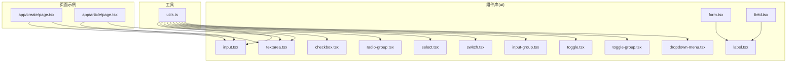
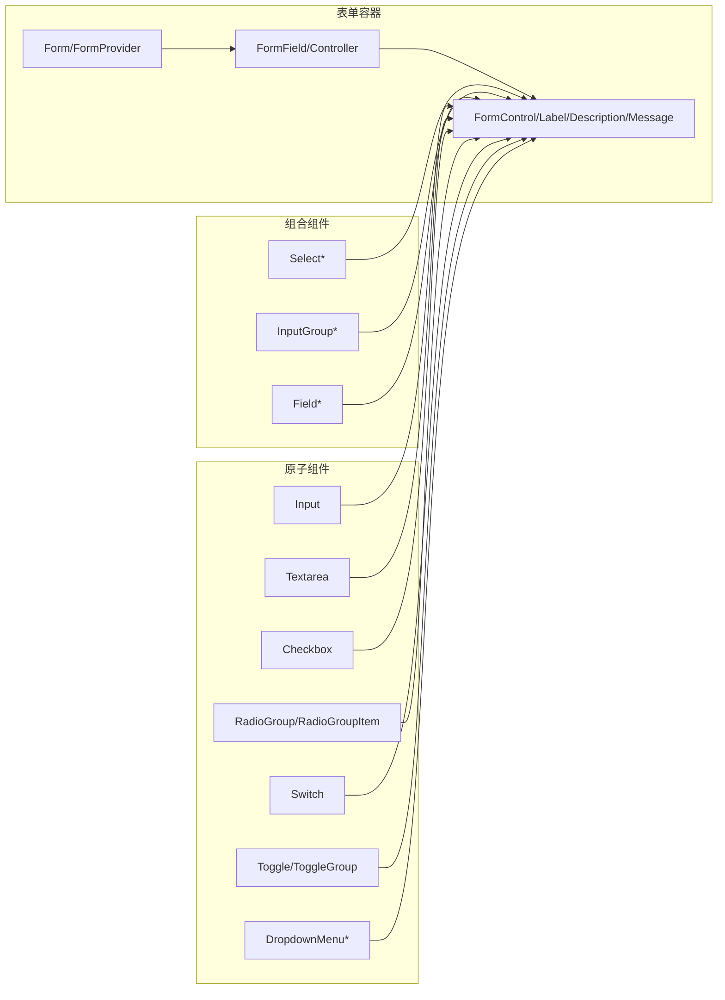
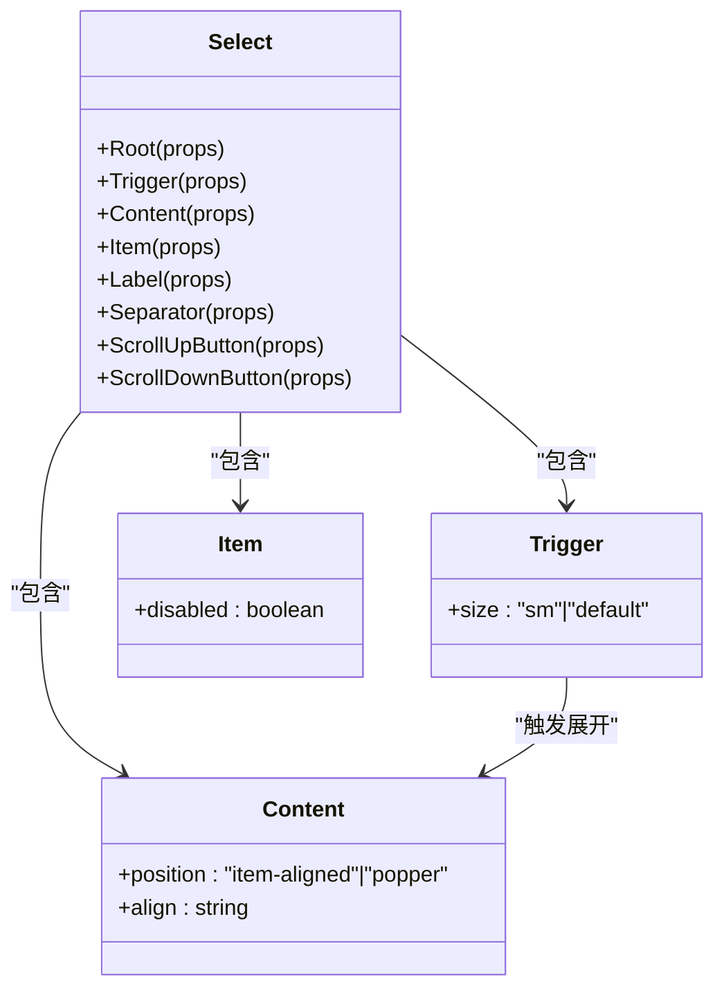
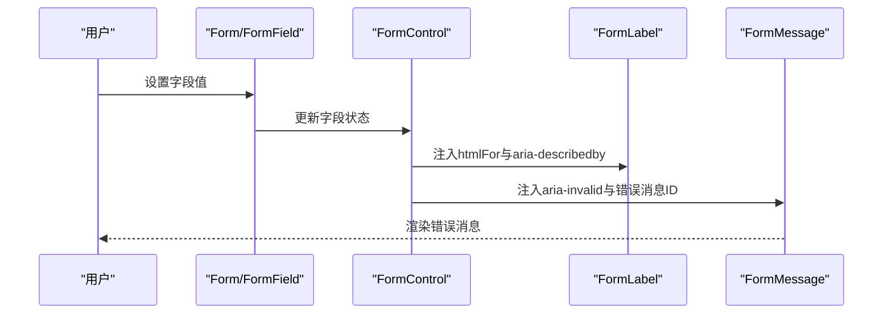
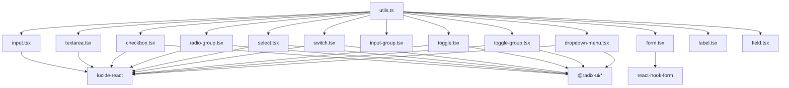

# 基础输入组件

<cite>
**本文档引用的文件**
- [input.tsx](file://ai-content-project/src/components/ui/input.tsx)
- [textarea.tsx](file://ai-content-project/src/components/ui/textarea.tsx)
- [checkbox.tsx](file://ai-content-project/src/components/ui/checkbox.tsx)
- [radio-group.tsx](file://ai-content-project/src/components/ui/radio-group.tsx)
- [select.tsx](file://ai-content-project/src/components/ui/select.tsx)
- [switch.tsx](file://ai-content-project/src/components/ui/switch.tsx)
- [form.tsx](file://ai-content-project/src/components/ui/form.tsx)
- [label.tsx](file://ai-content-project/src/components/ui/label.tsx)
- [field.tsx](file://ai-content-project/src/components/ui/field.tsx)
- [input-group.tsx](file://ai-content-project/src/components/ui/input-group.tsx)
- [toggle.tsx](file://ai-content-project/src/components/ui/toggle.tsx)
- [toggle-group.tsx](file://ai-content-project/src/components/ui/toggle-group.tsx)
- [dropdown-menu.tsx](file://ai-content-project/src/components/ui/dropdown-menu.tsx)
- [utils.ts](file://ai-content-project/src/lib/utils.ts)
- [page.tsx](file://ai-content-project/src/app/create/page.tsx)
- [page.tsx](file://ai-content-project/src/app/article/page.tsx)
</cite>

## 目录
1. [简介](#简介)
2. [项目结构](#项目结构)
3. [核心组件](#核心组件)
4. [架构总览](#架构总览)
5. [详细组件分析](#详细组件分析)
6. [依赖关系分析](#依赖关系分析)
7. [性能考量](#性能考量)
8. [故障排查指南](#故障排查指南)
9. [结论](#结论)
10. [附录](#附录)

## 简介
本文件系统性梳理并说明基础输入类组件的设计理念与实现细节，覆盖输入框、文本域、复选框、单选组、下拉选择、开关等常用表单控件，并扩展至输入组合、切换按钮、下拉菜单等辅助输入形态。文档从架构、数据流、状态管理、事件处理、样式定制、无障碍访问与响应式设计等方面展开，同时给出与表单验证框架集成、数据绑定与错误处理的最佳实践，以及典型使用场景与应用指南。

## 项目结构
基础输入组件主要位于组件库目录，采用“按功能模块拆分”的组织方式，便于复用与维护；与之配套的表单体系由独立的表单容器与字段布局组件构成，形成“控件层 + 表单层 + 布局层”的分层架构。

图表来源
- [input.tsx:1-22](file://ai-content-project/src/components/ui/input.tsx#L1-L22)
- [textarea.tsx:1-19](file://ai-content-project/src/components/ui/textarea.tsx#L1-L19)
- [checkbox.tsx:1-33](file://ai-content-project/src/components/ui/checkbox.tsx#L1-L33)
- [radio-group.tsx:1-46](file://ai-content-project/src/components/ui/radio-group.tsx#L1-L46)
- [select.tsx:1-191](file://ai-content-project/src/components/ui/select.tsx#L1-L191)
- [switch.tsx:1-32](file://ai-content-project/src/components/ui/switch.tsx#L1-L32)
- [form.tsx:1-168](file://ai-content-project/src/components/ui/form.tsx#L1-L168)
- [label.tsx:1-25](file://ai-content-project/src/components/ui/label.tsx#L1-L25)
- [field.tsx:1-249](file://ai-content-project/src/components/ui/field.tsx#L1-L249)
- [input-group.tsx:1-171](file://ai-content-project/src/components/ui/input-group.tsx#L1-L171)
- [toggle.tsx:1-48](file://ai-content-project/src/components/ui/toggle.tsx#L1-L48)
- [toggle-group.tsx:1-84](file://ai-content-project/src/components/ui/toggle-group.tsx#L1-L84)
- [dropdown-menu.tsx:1-258](file://ai-content-project/src/components/ui/dropdown-menu.tsx#L1-L258)
- [utils.ts:1-7](file://ai-content-project/src/lib/utils.ts#L1-L7)
- [page.tsx:1-761](file://ai-content-project/src/app/create/page.tsx#L1-L761)
- [page.tsx:1-1026](file://ai-content-project/src/app/article/page.tsx#L1-L1026)

章节来源
- [input.tsx:1-22](file://ai-content-project/src/components/ui/input.tsx#L1-L22)
- [textarea.tsx:1-19](file://ai-content-project/src/components/ui/textarea.tsx#L1-L19)
- [checkbox.tsx:1-33](file://ai-content-project/src/components/ui/checkbox.tsx#L1-L33)
- [radio-group.tsx:1-46](file://ai-content-project/src/components/ui/radio-group.tsx#L1-L46)
- [select.tsx:1-191](file://ai-content-project/src/components/ui/select.tsx#L1-L191)
- [switch.tsx:1-32](file://ai-content-project/src/components/ui/switch.tsx#L1-L32)
- [form.tsx:1-168](file://ai-content-project/src/components/ui/form.tsx#L1-L168)
- [label.tsx:1-25](file://ai-content-project/src/components/ui/label.tsx#L1-L25)
- [field.tsx:1-249](file://ai-content-project/src/components/ui/field.tsx#L1-L249)
- [input-group.tsx:1-171](file://ai-content-project/src/components/ui/input-group.tsx#L1-L171)
- [toggle.tsx:1-48](file://ai-content-project/src/components/ui/toggle.tsx#L1-L48)
- [toggle-group.tsx:1-84](file://ai-content-project/src/components/ui/toggle-group.tsx#L1-L84)
- [dropdown-menu.tsx:1-258](file://ai-content-project/src/components/ui/dropdown-menu.tsx#L1-L258)
- [utils.ts:1-7](file://ai-content-project/src/lib/utils.ts#L1-L7)
- [page.tsx:1-761](file://ai-content-project/src/app/create/page.tsx#L1-L761)
- [page.tsx:1-1026](file://ai-content-project/src/app/article/page.tsx#L1-L1026)

## 核心组件
- 输入框(Input)：通用文本输入，支持禁用、聚焦高亮、无效态视觉反馈。
- 文本域(Textarea)：多行文本输入，支持最小高度、禁用、聚焦高亮、无效态视觉反馈。
- 复选框(Checkbox)：双态选择，支持禁用、聚焦高亮、无效态视觉反馈。
- 单选组(RadioGroup)：互斥选择，支持禁用、聚焦高亮、无效态视觉反馈。
- 下拉选择(Select)：复杂交互的可组合下拉，含触发器、内容面板、选项、滚动控制等子组件。
- 开关(Switch)：二态切换，支持禁用、聚焦高亮、无效态视觉反馈。
- 表单(Form)：基于 react-hook-form 的表单容器与字段封装，提供字段上下文、标签、控制、描述、消息等。
- 标签(Label)：语义化标签，支持禁用态、错误态联动。
- 字段(Field)：字段级布局与语义包装，支持垂直/水平/响应式三种方向，错误展示、描述、分隔等。
- 输入组合(InputGroup)：输入与附加元素组合，支持内联/块级对齐、按钮、文本、输入/文本域等。
- 切换按钮(Toggle/ToggleGroup)：可多选或单选的按钮组，支持变体与尺寸。
- 下拉菜单(DropdownMenu)：上下文菜单，支持分组、复选/单选项、子菜单、快捷键等。

章节来源
- [input.tsx:1-22](file://ai-content-project/src/components/ui/input.tsx#L1-L22)
- [textarea.tsx:1-19](file://ai-content-project/src/components/ui/textarea.tsx#L1-L19)
- [checkbox.tsx:1-33](file://ai-content-project/src/components/ui/checkbox.tsx#L1-L33)
- [radio-group.tsx:1-46](file://ai-content-project/src/components/ui/radio-group.tsx#L1-L46)
- [select.tsx:1-191](file://ai-content-project/src/components/ui/select.tsx#L1-L191)
- [switch.tsx:1-32](file://ai-content-project/src/components/ui/switch.tsx#L1-L32)
- [form.tsx:1-168](file://ai-content-project/src/components/ui/form.tsx#L1-L168)
- [label.tsx:1-25](file://ai-content-project/src/components/ui/label.tsx#L1-L25)
- [field.tsx:1-249](file://ai-content-project/src/components/ui/field.tsx#L1-L249)
- [input-group.tsx:1-171](file://ai-content-project/src/components/ui/input-group.tsx#L1-L171)
- [toggle.tsx:1-48](file://ai-content-project/src/components/ui/toggle.tsx#L1-L48)
- [toggle-group.tsx:1-84](file://ai-content-project/src/components/ui/toggle-group.tsx#L1-L84)
- [dropdown-menu.tsx:1-258](file://ai-content-project/src/components/ui/dropdown-menu.tsx#L1-L258)

## 架构总览
基础输入组件遵循“原子组件 + 组合组件 + 表单容器”的分层设计：
- 原子组件：Input、Textarea、Checkbox、RadioGroup、Switch、Toggle、DropdownMenu 等，负责单一交互与视觉表现。
- 组合组件：Select、InputGroup、Field 等，负责复杂交互与布局。
- 表单容器：Form、FormField、FormControl、FormLabel、FormDescription、FormMessage 等，负责与验证框架集成、错误传播与无障碍关联。

图表来源
- [input.tsx:1-22](file://ai-content-project/src/components/ui/input.tsx#L1-L22)
- [textarea.tsx:1-19](file://ai-content-project/src/components/ui/textarea.tsx#L1-L19)
- [checkbox.tsx:1-33](file://ai-content-project/src/components/ui/checkbox.tsx#L1-L33)
- [radio-group.tsx:1-46](file://ai-content-project/src/components/ui/radio-group.tsx#L1-L46)
- [switch.tsx:1-32](file://ai-content-project/src/components/ui/switch.tsx#L1-L32)
- [toggle.tsx:1-48](file://ai-content-project/src/components/ui/toggle.tsx#L1-L48)
- [toggle-group.tsx:1-84](file://ai-content-project/src/components/ui/toggle-group.tsx#L1-L84)
- [dropdown-menu.tsx:1-258](file://ai-content-project/src/components/ui/dropdown-menu.tsx#L1-L258)
- [select.tsx:1-191](file://ai-content-project/src/components/ui/select.tsx#L1-L191)
- [input-group.tsx:1-171](file://ai-content-project/src/components/ui/input-group.tsx#L1-L171)
- [field.tsx:1-249](file://ai-content-project/src/components/ui/field.tsx#L1-L249)
- [form.tsx:1-168](file://ai-content-project/src/components/ui/form.tsx#L1-L168)

## 详细组件分析

### 输入框(Input)
- 设计理念：简洁一致的边框、圆角、阴影与过渡，聚焦时通过边框与环形光晕强调；无效态以破坏性色彩提示。
- 关键属性：type、className、透传原生 input 属性；支持 data-slot 标记与 aria-invalid 错误态。
- 状态管理：受控于父组件或表单库；通过禁用态禁用交互。
- 事件处理：onChange、onFocus、onBlur 等原生事件透传。
- 样式定制：通过 className 扩展；内部使用工具函数合并类名。
- 无障碍：保持原生 input 的语义与键盘行为；配合 Form/Label 提升可达性。
- 响应式：内置移动端与桌面端字体大小差异。

章节来源
- [input.tsx:1-22](file://ai-content-project/src/components/ui/input.tsx#L1-L22)
- [utils.ts:1-7](file://ai-content-project/src/lib/utils.ts#L1-L7)

### 文本域(Textarea)
- 设计理念：多行输入，支持最小高度、禁用态、聚焦高亮与无效态视觉反馈。
- 关键属性：className、透传原生 textarea 属性；支持 data-slot 标记与 aria-invalid 错误态。
- 状态管理：受控值；支持禁用态。
- 事件处理：onChange、onFocus、onBlur 等原生事件透传。
- 样式定制：通过 className 扩展；内部使用工具函数合并类名。
- 无障碍：保持原生 textarea 的语义与键盘行为；配合 Form/Label 提升可达性。

章节来源
- [textarea.tsx:1-19](file://ai-content-project/src/components/ui/textarea.tsx#L1-L19)
- [utils.ts:1-7](file://ai-content-project/src/lib/utils.ts#L1-L7)

### 复选框(Checkbox)
- 设计理念：基于 Radix 双态组件，提供指示器与选中态配色；支持禁用、聚焦高亮、无效态视觉反馈。
- 关键属性：className、透传原生 CheckboxPrimitive.Root 属性；支持 data-slot 标记。
- 状态管理：受控或非受控均可；通过 data-state 控制选中态样式。
- 事件处理：onChange、onFocus、onBlur 等原生事件透传。
- 样式定制：通过 className 扩展；内部使用工具函数合并类名。
- 无障碍：继承 Radix 语义，与 Label 绑定提升可达性。

章节来源
- [checkbox.tsx:1-33](file://ai-content-project/src/components/ui/checkbox.tsx#L1-L33)
- [utils.ts:1-7](file://ai-content-project/src/lib/utils.ts#L1-L7)

### 单选组(RadioGroup)
- 设计理念：基于 Radix 单选组，提供指示器与选中态配色；支持禁用、聚焦高亮、无效态视觉反馈。
- 关键属性：Root 支持 className 与透传属性；Item 支持 className 与透传属性；Indicator 支持指示器渲染。
- 状态管理：受控或非受控均可；通过 data-state 控制选中态样式。
- 事件处理：onChange、onFocus、onBlur 等原生事件透传。
- 样式定制：通过 className 扩展；内部使用工具函数合并类名。
- 无障碍：继承 Radix 语义，与 Label 绑定提升可达性。

章节来源
- [radio-group.tsx:1-46](file://ai-content-project/src/components/ui/radio-group.tsx#L1-L46)
- [utils.ts:1-7](file://ai-content-project/src/lib/utils.ts#L1-L7)

### 下拉选择(Select)
- 设计理念：复杂交互的可组合下拉，包含 Root、Trigger、Content、Viewport、Item、Label、Separator、ScrollUp/DownButton 等子组件；支持弹出位置、对齐方式、尺寸等变体。
- 关键属性：Trigger 支持 size 变体；Content 支持 position 与 align；Item 支持禁用态与指示器；ScrollUp/DownButton 支持滚动控制。
- 状态管理：受控或非受控均可；通过 Portal 渲染内容面板。
- 事件处理：onChange、onFocus、onBlur 等原生事件透传。
- 样式定制：通过 className 扩展；内部使用工具函数合并类名。
- 无障碍：继承 Radix 语义，与 Label 绑定提升可达性。

图表来源
- [select.tsx:1-191](file://ai-content-project/src/components/ui/select.tsx#L1-L191)

章节来源
- [select.tsx:1-191](file://ai-content-project/src/components/ui/select.tsx#L1-L191)
- [utils.ts:1-7](file://ai-content-project/src/lib/utils.ts#L1-L7)

### 开关(Switch)
- 设计理念：基于 Radix 二态切换，提供拇指动画与颜色过渡；支持禁用、聚焦高亮、无效态视觉反馈。
- 关键属性：className、Thumb 支持 className；Root 支持 data-state 控制选中态样式。
- 状态管理：受控或非受控均可；通过 data-state 控制样式。
- 事件处理：onChange、onFocus、onBlur 等原生事件透传。
- 样式定制：通过 className 扩展；内部使用工具函数合并类名。
- 无障碍：继承 Radix 语义，与 Label 绑定提升可达性。

章节来源
- [switch.tsx:1-32](file://ai-content-project/src/components/ui/switch.tsx#L1-L32)
- [utils.ts:1-7](file://ai-content-project/src/lib/utils.ts#L1-L7)

### 表单(Form)与字段(Field)
- 设计理念：FormProvider 提供上下文，FormField 封装 Controller，FormControl 与 Label/Description/Message 实现错误传播与无障碍关联；Field 提供字段级布局与语义包装。
- 关键属性：Form 提供 Provider；FormField 接收 ControllerProps；FormControl 注入 aria-* 属性；FormMessage 支持错误消息渲染；Field 支持 orientation(vertical/horizontal/responsive)。
- 状态管理：与 react-hook-form 紧密集成；useFormField 获取字段状态与 ID。
- 事件处理：通过 react-hook-form 的控制器与状态钩子管理。
- 样式定制：通过 className 扩展；内部使用工具函数合并类名。
- 无障碍：FormControl 自动注入 aria-describedby/aria-invalid；FormLabel 与 htmlFor 绑定。

图表来源
- [form.tsx:1-168](file://ai-content-project/src/components/ui/form.tsx#L1-L168)
- [label.tsx:1-25](file://ai-content-project/src/components/ui/label.tsx#L1-L25)
- [field.tsx:1-249](file://ai-content-project/src/components/ui/field.tsx#L1-L249)

章节来源
- [form.tsx:1-168](file://ai-content-project/src/components/ui/form.tsx#L1-L168)
- [label.tsx:1-25](file://ai-content-project/src/components/ui/label.tsx#L1-L25)
- [field.tsx:1-249](file://ai-content-project/src/components/ui/field.tsx#L1-L249)
- [utils.ts:1-7](file://ai-content-project/src/lib/utils.ts#L1-L7)

### 输入组合(InputGroup)
- 设计理念：将输入与附加元素（文本、按钮、图标等）组合为统一容器，支持内联/块级对齐、聚焦与错误态视觉反馈。
- 关键属性：InputGroup 支持对齐变体；InputGroupAddon 支持 align；InputGroupButton 支持 size/variant；InputGroupInput/Textarea 支持 data-slot 标记。
- 状态管理：受控于内部输入；通过 data-slot 与外部容器联动。
- 事件处理：透传原生事件；点击附加元素可聚焦输入。
- 样式定制：通过 className 扩展；内部使用工具函数合并类名。
- 无障碍：保持原生输入语义；点击附加元素可聚焦输入。

章节来源
- [input-group.tsx:1-171](file://ai-content-project/src/components/ui/input-group.tsx#L1-L171)
- [utils.ts:1-7](file://ai-content-project/src/lib/utils.ts#L1-L7)

### 切换按钮(Toggle/ToggleGroup)
- 设计理念：基于 Radix Toggle 与 ToggleGroup，提供默认/描边两种变体与多种尺寸；支持间距控制与聚焦高亮。
- 关键属性：Toggle 支持 variant/size；ToggleGroup 支持 variant/size/spacings；ToggleGroupItem 支持 data-slot 标记。
- 状态管理：受控或非受控均可；通过 data-state 控制选中态样式。
- 事件处理：onChange、onFocus、onBlur 等原生事件透传。
- 样式定制：通过 className 扩展；内部使用工具函数合并类名。
- 无障碍：继承 Radix 语义，与 Label 绑定提升可达性。

章节来源
- [toggle.tsx:1-48](file://ai-content-project/src/components/ui/toggle.tsx#L1-L48)
- [toggle-group.tsx:1-84](file://ai-content-project/src/components/ui/toggle-group.tsx#L1-L84)
- [utils.ts:1-7](file://ai-content-project/src/lib/utils.ts#L1-L7)

### 下拉菜单(DropdownMenu)
- 设计理念：基于 Radix DropdownMenu，提供菜单、分组、标签、复选/单选项、子菜单、快捷键等能力；支持 Portal 渲染与动画。
- 关键属性：Content 支持 sideOffset；Item 支持 inset/variant；CheckboxItem/RadioItem 支持选中态与指示器；SubTrigger/SubContent 支持子菜单。
- 状态管理：受控或非受控均可；通过 Portal 渲染内容面板。
- 事件处理：onChange、onFocus、onBlur 等原生事件透传。
- 样式定制：通过 className 扩展；内部使用工具函数合并类名。
- 无障碍：继承 Radix 语义，与 Label 绑定提升可达性。

章节来源
- [dropdown-menu.tsx:1-258](file://ai-content-project/src/components/ui/dropdown-menu.tsx#L1-L258)
- [utils.ts:1-7](file://ai-content-project/src/lib/utils.ts#L1-L7)

## 依赖关系分析
- 组件间依赖：各原子组件均依赖工具函数进行类名合并；表单容器依赖 react-hook-form；组合组件依赖原子组件；页面示例依赖组件库与表单容器。
- 外部依赖：Radix UI（用于可访问性与状态管理）、Lucide（图标）、Tailwind（样式工具）。

图表来源
- [utils.ts:1-7](file://ai-content-project/src/lib/utils.ts#L1-L7)
- [input.tsx:1-22](file://ai-content-project/src/components/ui/input.tsx#L1-L22)
- [textarea.tsx:1-19](file://ai-content-project/src/components/ui/textarea.tsx#L1-L19)
- [checkbox.tsx:1-33](file://ai-content-project/src/components/ui/checkbox.tsx#L1-L33)
- [radio-group.tsx:1-46](file://ai-content-project/src/components/ui/radio-group.tsx#L1-L46)
- [select.tsx:1-191](file://ai-content-project/src/components/ui/select.tsx#L1-L191)
- [switch.tsx:1-32](file://ai-content-project/src/components/ui/switch.tsx#L1-L32)
- [input-group.tsx:1-171](file://ai-content-project/src/components/ui/input-group.tsx#L1-L171)
- [toggle.tsx:1-48](file://ai-content-project/src/components/ui/toggle.tsx#L1-L48)
- [toggle-group.tsx:1-84](file://ai-content-project/src/components/ui/toggle-group.tsx#L1-L84)
- [dropdown-menu.tsx:1-258](file://ai-content-project/src/components/ui/dropdown-menu.tsx#L1-L258)
- [form.tsx:1-168](file://ai-content-project/src/components/ui/form.tsx#L1-L168)
- [label.tsx:1-25](file://ai-content-project/src/components/ui/label.tsx#L1-L25)
- [field.tsx:1-249](file://ai-content-project/src/components/ui/field.tsx#L1-L249)

章节来源
- [utils.ts:1-7](file://ai-content-project/src/lib/utils.ts#L1-L7)
- [form.tsx:1-168](file://ai-content-project/src/components/ui/form.tsx#L1-L168)

## 性能考量
- 样式合并：统一使用工具函数进行类名合并，避免重复计算与冲突。
- 组合组件：通过 data-slot 与 CSS 选择器联动，减少不必要的 DOM 层级与重绘。
- 表单容器：使用上下文与钩子传递字段状态，避免深层传递带来的性能损耗。
- 下拉与菜单：通过 Portal 渲染，减少层级嵌套对布局的影响。
- 原子组件：保持最小化渲染，仅在状态变化时更新样式与属性。

## 故障排查指南
- 无效态不生效：检查是否正确设置 aria-invalid；确保表单容器已注入 aria-describedby/aria-invalid。
- 焦点高亮异常：检查是否正确设置 data-slot；确保焦点样式未被覆盖。
- 交互无响应：检查是否透传原生事件；确认禁用态未阻止交互。
- 组合组件对齐问题：检查 InputGroup 的 align 参数与子元素的 data-align；确认未被外部样式覆盖。
- 下拉菜单定位错位：检查 Portal 渲染目标与触发元素位置；调整 sideOffset 与 align。

章节来源
- [form.tsx:107-123](file://ai-content-project/src/components/ui/form.tsx#L107-L123)
- [input-group.tsx:11-37](file://ai-content-project/src/components/ui/input-group.tsx#L11-L37)
- [select.tsx:53-88](file://ai-content-project/src/components/ui/select.tsx#L53-L88)
- [dropdown-menu.tsx:34-52](file://ai-content-project/src/components/ui/dropdown-menu.tsx#L34-L52)

## 结论
该基础输入组件体系以“原子组件 + 组合组件 + 表单容器”为核心，结合 Radix UI 的可访问性与 react-hook-form 的验证能力，提供了从简单输入到复杂交互的一致体验。通过 data-slot 标记、aria-* 属性注入与响应式样式的内置支持，组件在可用性、可维护性与可扩展性方面均具备良好表现。建议在实际项目中优先使用表单容器与字段布局组件，以获得最佳的验证集成与无障碍支持。

## 附录
- 使用示例与常见场景
  - 创建页面中的文本域与按钮组合：参见页面示例中输入区与按钮区的实现。
  - 文章编辑器中的输入与列表编辑：参见页面示例中标题、摘要、标签与内容块的输入实现。
  - 下拉选择与输入组合：参见页面示例中类型选择与页数调节的实现。
- 最佳实践
  - 表单验证集成：使用 Form/FormField/FormControl 与 react-hook-form 的 Controller/ControllerProps；在 FormMessage 中渲染错误。
  - 数据绑定：通过受控组件与受控状态管理；避免直接操作 DOM。
  - 错误处理：在 FormMessage 中统一渲染错误；在 FormControl 中注入 aria-invalid。
  - 样式定制：通过 className 扩展；避免覆盖 data-slot 与 aria-* 属性。
  - 无障碍访问：确保 Label 与输入元素绑定；提供清晰的错误消息与键盘导航支持。

章节来源
- [page.tsx:656-743](file://ai-content-project/src/app/create/page.tsx#L656-L743)
- [page.tsx:440-622](file://ai-content-project/src/app/article/page.tsx#L440-L622)
- [form.tsx:107-156](file://ai-content-project/src/components/ui/form.tsx#L107-L156)