# 导航交互组件

<cite>
**本文引用的文件**
- [button.tsx](file://ai-content-project/src/components/ui/button.tsx)
- [dialog.tsx](file://ai-content-project/src/components/ui/dialog.tsx)
- [dropdown-menu.tsx](file://ai-content-project/src/components/ui/dropdown-menu.tsx)
- [navigation-menu.tsx](file://ai-content-project/src/components/ui/navigation-menu.tsx)
- [pagination.tsx](file://ai-content-project/src/components/ui/pagination.tsx)
- [tabs.tsx](file://ai-content-project/src/components/ui/tabs.tsx)
- [breadcrumb.tsx](file://ai-content-project/src/components/ui/breadcrumb.tsx)
- [menubar.tsx](file://ai-content-project/src/components/ui/menubar.tsx)
- [use-mobile.ts](file://ai-content-project/src/hooks/use-mobile.ts)
- [utils.ts](file://ai-content-project/src/lib/utils.ts)
- [layout.tsx](file://ai-content-project/src/app/layout.tsx)
- [page.tsx](file://ai-content-project/src/app/page.tsx)
- [create/page.tsx](file://ai-content-project/src/app/create/page.tsx)
- [result/page.tsx](file://ai-content-project/src/app/result/page.tsx)
- [token-persister.tsx](file://ai-content-project/src/components/token-persister.tsx)
</cite>

## 目录
1. [简介](#简介)
2. [项目结构](#项目结构)
3. [核心组件](#核心组件)
4. [架构总览](#架构总览)
5. [组件详解](#组件详解)
6. [依赖关系分析](#依赖关系分析)
7. [性能考量](#性能考量)
8. [故障排查指南](#故障排查指南)
9. [结论](#结论)
10. [附录](#附录)

## 简介
本文件聚焦导航交互组件，系统梳理按钮、对话框、下拉菜单、导航菜单、分页、标签页、面包屑等组件的设计理念、交互模式与实现细节。文档覆盖事件处理、状态管理、键盘导航、视觉反馈与动画、无障碍访问，并结合实际页面示例给出最佳实践、用户体验优化与移动端适配策略。

## 项目结构
导航相关组件主要位于 UI 组件库目录，页面示例展示其在真实业务中的组合使用方式。移动端断点与工具函数辅助响应式设计与通用工具。

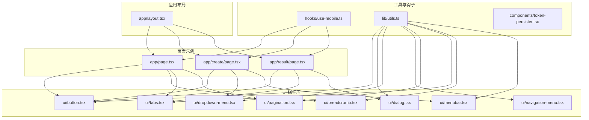

**图表来源**
- [layout.tsx:15-33](file://ai-content-project/src/app/layout.tsx#L15-L33)
- [page.tsx:45-197](file://ai-content-project/src/app/page.tsx#L45-L197)
- [create/page.tsx:59-761](file://ai-content-project/src/app/create/page.tsx#L59-L761)
- [result/page.tsx:227-800](file://ai-content-project/src/app/result/page.tsx#L227-L800)
- [button.tsx:1-63](file://ai-content-project/src/components/ui/button.tsx#L1-L63)
- [dialog.tsx:1-144](file://ai-content-project/src/components/ui/dialog.tsx#L1-L144)
- [dropdown-menu.tsx:1-258](file://ai-content-project/src/components/ui/dropdown-menu.tsx#L1-L258)
- [navigation-menu.tsx:1-169](file://ai-content-project/src/components/ui/navigation-menu.tsx#L1-L169)
- [pagination.tsx:1-128](file://ai-content-project/src/components/ui/pagination.tsx#L1-L128)
- [tabs.tsx:1-67](file://ai-content-project/src/components/ui/tabs.tsx#L1-L67)
- [breadcrumb.tsx:1-110](file://ai-content-project/src/components/ui/breadcrumb.tsx#L1-L110)
- [menubar.tsx:1-277](file://ai-content-project/src/components/ui/menubar.tsx#L1-L277)
- [use-mobile.ts:1-20](file://ai-content-project/src/hooks/use-mobile.ts#L1-L20)
- [utils.ts:1-7](file://ai-content-project/src/lib/utils.ts#L1-L7)
- [token-persister.tsx:1-38](file://ai-content-project/src/components/token-persister.tsx#L1-L38)

**章节来源**
- [layout.tsx:15-33](file://ai-content-project/src/app/layout.tsx#L15-L33)
- [page.tsx:45-197](file://ai-content-project/src/app/page.tsx#L45-L197)
- [create/page.tsx:59-761](file://ai-content-project/src/app/create/page.tsx#L59-L761)
- [result/page.tsx:227-800](file://ai-content-project/src/app/result/page.tsx#L227-L800)

## 核心组件
- 按钮 Button：统一的可复用触发器，支持多种语义与尺寸，内置焦点环与禁用态样式。
- 对话框 Dialog：基于 Radix 的可访问对话框，提供门户、覆盖层、内容区、标题与描述等子组件。
- 下拉菜单 DropdownMenu：支持项、复选/单选、子菜单、快捷键提示等，提供丰富的交互与无障碍能力。
- 导航菜单 NavigationMenu：横向导航，支持触发器、内容面板、视口动画与指示器。
- 分页 Pagination：以按钮为基础的分页控件，支持上一页/下一页与省略号。
- 标签页 Tabs：基于 Radix 的标签切换容器，支持列表与内容区。
- 面包屑 Breadcrumb：层级导航，支持链接、当前页、省略与分隔符。
- 菜单栏 Menubar：桌面级菜单条，支持嵌套子菜单与快捷键提示。
- 移动端检测 useIsMobile：基于媒体查询的断点检测，便于条件渲染与布局切换。
- 工具函数 cn：类名合并与 Tailwind 冲突修复。

**章节来源**
- [button.tsx:7-63](file://ai-content-project/src/components/ui/button.tsx#L7-L63)
- [dialog.tsx:9-144](file://ai-content-project/src/components/ui/dialog.tsx#L9-L144)
- [dropdown-menu.tsx:9-258](file://ai-content-project/src/components/ui/dropdown-menu.tsx#L9-L258)
- [navigation-menu.tsx:8-169](file://ai-content-project/src/components/ui/navigation-menu.tsx#L8-L169)
- [pagination.tsx:11-128](file://ai-content-project/src/components/ui/pagination.tsx#L11-L128)
- [tabs.tsx:8-67](file://ai-content-project/src/components/ui/tabs.tsx#L8-L67)
- [breadcrumb.tsx:7-110](file://ai-content-project/src/components/ui/breadcrumb.tsx#L7-L110)
- [menubar.tsx:9-277](file://ai-content-project/src/components/ui/menubar.tsx#L9-L277)
- [use-mobile.ts:5-19](file://ai-content-project/src/hooks/use-mobile.ts#L5-L19)
- [utils.ts:4-6](file://ai-content-project/src/lib/utils.ts#L4-L6)

## 架构总览
导航组件围绕 Radix 可访问原语构建，统一通过工具函数 cn 合并样式，确保一致的视觉与交互体验。页面通过 Link/路由与这些组件组合，形成完整的导航体系。

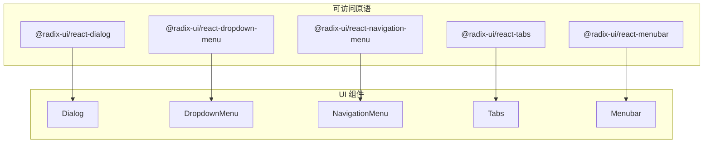

**图表来源**
- [dialog.tsx:3-13](file://ai-content-project/src/components/ui/dialog.tsx#L3-L13)
- [dropdown-menu.tsx:3-13](file://ai-content-project/src/components/ui/dropdown-menu.tsx#L3-L13)
- [navigation-menu.tsx:2-6](file://ai-content-project/src/components/ui/navigation-menu.tsx#L2-L6)
- [tabs.tsx:3-4](file://ai-content-project/src/components/ui/tabs.tsx#L3-L4)
- [menubar.tsx:3-5](file://ai-content-project/src/components/ui/menubar.tsx#L3-L5)

## 组件详解

### 按钮 Button
- 设计理念：语义化变体（默认/破坏/描边/次要/幽灵/链接）、尺寸（默认/小/大/图标系列）；统一的焦点环与禁用态。
- 交互模式：支持 asChild 透传到 Slot，便于与 Link/Router 集成；内置 pointer-events 与 SVG 尺寸处理。
- 键盘导航：原生 button 支持 Enter/Space；配合焦点环保证可访问性。
- 视觉反馈：过渡动画、悬停/激活态、禁用透明度；错误态通过 aria-invalid 提示。
- 无障碍：保持原生语义，focus-visible ring 辅助键盘用户定位。

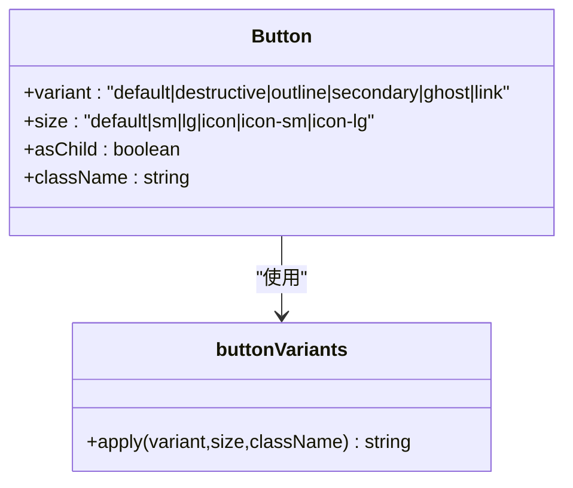

**图表来源**
- [button.tsx:7-37](file://ai-content-project/src/components/ui/button.tsx#L7-L37)

**章节来源**
- [button.tsx:39-63](file://ai-content-project/src/components/ui/button.tsx#L39-L63)

### 对话框 Dialog
- 设计理念：门户 Portal 将内容挂载到根节点，Overlay 提供遮罩与动画；Content 居中并支持关闭按钮。
- 交互模式：Root/Trigger/Portal/Overlay/Content/Close 组合；支持 showCloseButton 控制关闭按钮显隐。
- 键盘导航：Escape 关闭；Focus Trap 限制焦点在对话框内。
- 视觉反馈：开合动画（fade/zoom/slide-in），z-index 与 backdrop。
- 无障碍：Role 与 aria-* 标注，屏幕阅读器友好。

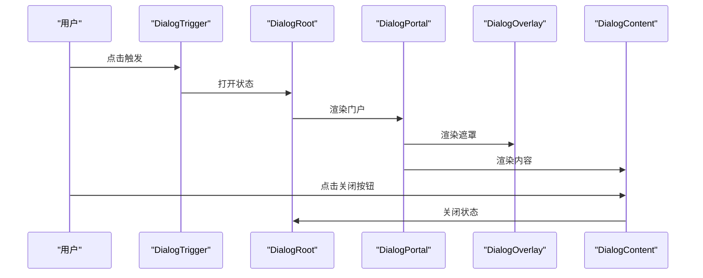

**图表来源**
- [dialog.tsx:9-81](file://ai-content-project/src/components/ui/dialog.tsx#L9-L81)

**章节来源**
- [dialog.tsx:9-144](file://ai-content-project/src/components/ui/dialog.tsx#L9-L144)

### 下拉菜单 DropdownMenu
- 设计理念：Trigger 触发，Portal 渲染，Content 定位与动画；支持组、标签、分割线、快捷键提示。
- 交互模式：Item/CheckboxItem/RadioItem/Label/Separator/Sub/SubTrigger/SubContent。
- 键盘导航：Tab/Shift+Tab 在菜单内循环；方向键上下移动；Enter/空格选择；Esc 返回上层。
- 视觉反馈：焦点态、选中态、禁用态；子菜单展开动画。
- 无障碍：ARIA roles 与属性，键盘可达。

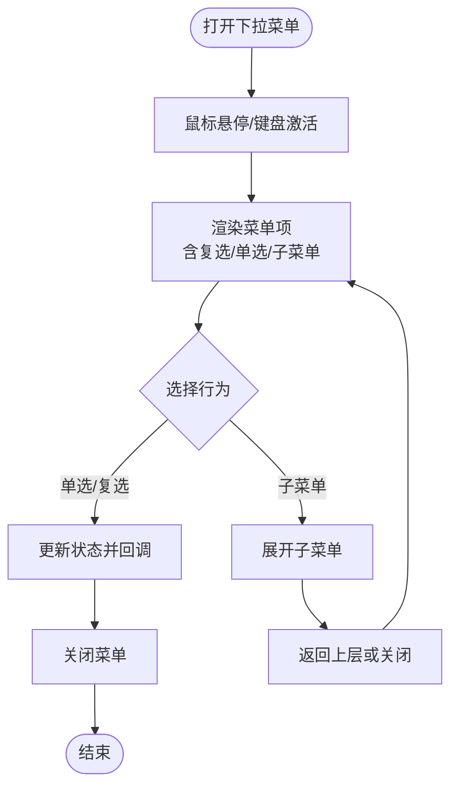

**图表来源**
- [dropdown-menu.tsx:9-258](file://ai-content-project/src/components/ui/dropdown-menu.tsx#L9-L258)

**章节来源**
- [dropdown-menu.tsx:9-258](file://ai-content-project/src/components/ui/dropdown-menu.tsx#L9-L258)

### 导航菜单 NavigationMenu
- 设计理念：横向导航，Trigger 展开内容，Viewport 动画；Indicator 显示当前激活位置。
- 交互模式：Root/List/Item/Trigger/Content/Link/Viewport/Indicator。
- 键盘导航：Tab 切换；方向键在 Trigger 间移动；Enter/空格激活。
- 视觉反馈：旋转箭头指示状态；开合动画与阴影。
- 无障碍：aria-expanded、aria-controls、aria-selected。

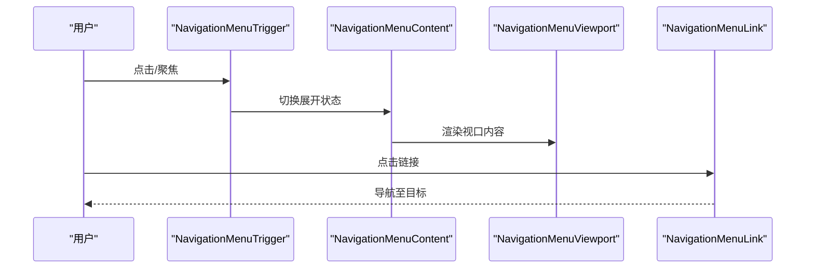

**图表来源**
- [navigation-menu.tsx:8-169](file://ai-content-project/src/components/ui/navigation-menu.tsx#L8-L169)

**章节来源**
- [navigation-menu.tsx:8-169](file://ai-content-project/src/components/ui/navigation-menu.tsx#L8-L169)

### 分页 Pagination
- 设计理念：以 Button 为基础，区分当前页与普通页；Previous/Next 带图标与文本。
- 交互模式：Pagination/PaginationContent/PaginationItem/PaginationLink/PaginationPrevious/PaginationNext/PaginationEllipsis。
- 键盘导航：Tab 切换；Enter/空格激活；支持屏幕阅读器 aria-current。
- 视觉反馈：当前页强调样式；图标与文本组合。
- 无障碍：aria-label 与 aria-current。

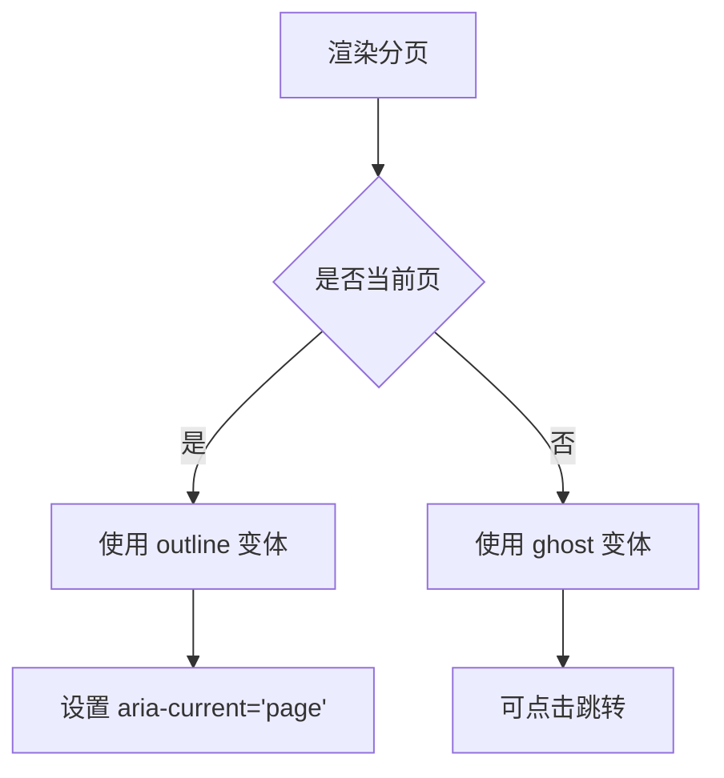

**图表来源**
- [pagination.tsx:40-66](file://ai-content-project/src/components/ui/pagination.tsx#L40-L66)

**章节来源**
- [pagination.tsx:11-128](file://ai-content-project/src/components/ui/pagination.tsx#L11-L128)

### 标签页 Tabs
- 设计理念：Tabs 根容器，TabsList 列表，TabsTrigger 触发器，TabsContent 内容区。
- 交互模式：点击/键盘激活对应内容；支持禁用与尺寸。
- 键盘导航：方向键在触发器间移动；Enter/空格激活。
- 视觉反馈：激活态强调、阴影与过渡。
- 无障碍：data-state 与 aria-* 属性。

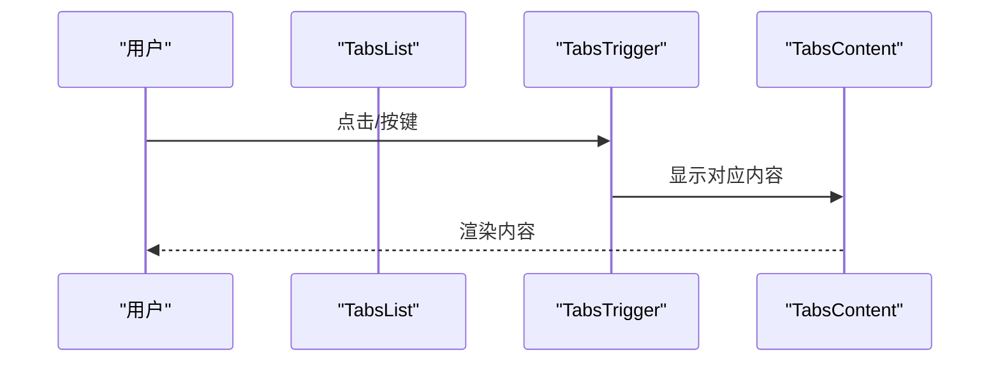

**图表来源**
- [tabs.tsx:8-67](file://ai-content-project/src/components/ui/tabs.tsx#L8-L67)

**章节来源**
- [tabs.tsx:8-67](file://ai-content-project/src/components/ui/tabs.tsx#L8-L67)

### 面包屑 Breadcrumb
- 设计理念：导航层级，支持链接、当前页、省略与分隔符。
- 交互模式：Breadcrumb/BreadcrumbList/BreadcrumbItem/BreadcrumbLink/BreadcrumbPage/BreadcrumbSeparator/BreadcrumbEllipsis。
- 键盘导航：链接可 Tab 到达；Enter/空格激活。
- 视觉反馈：hover 强调；省略号 sr-only。
- 无障碍：aria-label、aria-current、role="link"。

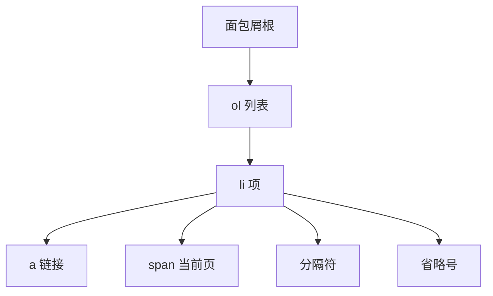

**图表来源**
- [breadcrumb.tsx:7-110](file://ai-content-project/src/components/ui/breadcrumb.tsx#L7-L110)

**章节来源**
- [breadcrumb.tsx:7-110](file://ai-content-project/src/components/ui/breadcrumb.tsx#L7-L110)

### 菜单栏 Menubar
- 设计理念：桌面级菜单条，支持子菜单、快捷键提示与复选/单选。
- 交互模式：Root/Menu/Trigger/Content/Item/CheckboxItem/RadioItem/Label/Separator/Sub/SubTrigger/SubContent。
- 键盘导航：Alt+F10 激活菜单栏；方向键在菜单间移动；Enter/空格激活。
- 视觉反馈：焦点态与子菜单动画。
- 无障碍：ARIA roles 与属性。

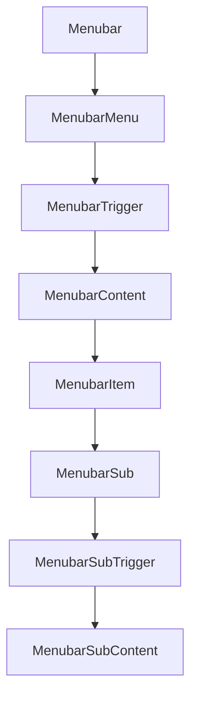

**图表来源**
- [menubar.tsx:9-277](file://ai-content-project/src/components/ui/menubar.tsx#L9-L277)

**章节来源**
- [menubar.tsx:9-277](file://ai-content-project/src/components/ui/menubar.tsx#L9-L277)

## 依赖关系分析
- 组件依赖 Radix 原语实现可访问性与状态管理。
- 统一使用 cn 合并样式，确保主题一致性。
- 页面通过 Link 与路由集成导航组件，形成端到端的导航链路。
- useIsMobile 提供断点判断，辅助移动端适配。

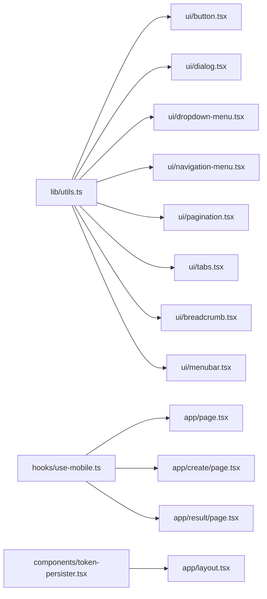

**图表来源**
- [utils.ts:4-6](file://ai-content-project/src/lib/utils.ts#L4-L6)
- [button.tsx:1-6](file://ai-content-project/src/components/ui/button.tsx#L1-L6)
- [dialog.tsx:1-8](file://ai-content-project/src/components/ui/dialog.tsx#L1-L8)
- [dropdown-menu.tsx:1-8](file://ai-content-project/src/components/ui/dropdown-menu.tsx#L1-L8)
- [navigation-menu.tsx:1-7](file://ai-content-project/src/components/ui/navigation-menu.tsx#L1-L7)
- [pagination.tsx:1-9](file://ai-content-project/src/components/ui/pagination.tsx#L1-L9)
- [tabs.tsx:1-7](file://ai-content-project/src/components/ui/tabs.tsx#L1-L7)
- [breadcrumb.tsx:1-6](file://ai-content-project/src/components/ui/breadcrumb.tsx#L1-L6)
- [menubar.tsx:1-8](file://ai-content-project/src/components/ui/menubar.tsx#L1-L8)
- [use-mobile.ts:1-20](file://ai-content-project/src/hooks/use-mobile.ts#L1-L20)
- [layout.tsx:1-34](file://ai-content-project/src/app/layout.tsx#L1-L34)
- [page.tsx:1-285](file://ai-content-project/src/app/page.tsx#L1-L285)
- [create/page.tsx:1-761](file://ai-content-project/src/app/create/page.tsx#L1-L761)
- [result/page.tsx:1-800](file://ai-content-project/src/app/result/page.tsx#L1-L800)
- [token-persister.tsx:1-38](file://ai-content-project/src/components/token-persister.tsx#L1-L38)

**章节来源**
- [utils.ts:4-6](file://ai-content-project/src/lib/utils.ts#L4-L6)
- [use-mobile.ts:5-19](file://ai-content-project/src/hooks/use-mobile.ts#L5-L19)
- [layout.tsx:15-33](file://ai-content-project/src/app/layout.tsx#L15-L33)
- [page.tsx:45-197](file://ai-content-project/src/app/page.tsx#L45-L197)
- [create/page.tsx:59-761](file://ai-content-project/src/app/create/page.tsx#L59-L761)
- [result/page.tsx:227-800](file://ai-content-project/src/app/result/page.tsx#L227-L800)
- [token-persister.tsx:15-37](file://ai-content-project/src/components/token-persister.tsx#L15-L37)

## 性能考量
- 动画与过渡：组件普遍使用 CSS 动画与过渡，注意在低端设备上的帧率影响；可按需减少复杂动画。
- 门户渲染：Dialog/Dropdown/Menubar 使用 Portal，避免层级遮挡同时减少重排。
- 事件委托：下拉菜单与导航菜单内部使用事件委托与最小化重渲染。
- 断点检测：useIsMobile 使用媒体查询监听，注意内存与事件清理；已在卸载时移除监听。
- 样式合并：cn 与 Tailwind Merge 避免类名冲突与多余样式。

[本节为通用指导，无需具体文件引用]

## 故障排查指南
- 对话框无法关闭：检查 Overlay/Content 的 data-state 与关闭按钮绑定；确认 Escape 事件未被阻止。
- 下拉菜单不显示：确认 Portal 是否正确挂载；检查 sideOffset 与定位计算。
- 导航菜单无动画：检查 viewport 配置与数据属性；确认 CSS 动画类存在。
- 分页无效：确认 PaginationLink 的 href 与路由配置；检查 aria-current 设置。
- 标签页不切换：确认 TabsTrigger 的 data-key 与 TabsContent 的对应关系。
- 面包屑链接失效：检查 BreadcrumbLink 的 asChild 与路由集成。
- 菜单栏键盘不可达：确认 MenubarTrigger 的焦点顺序与子菜单的展开逻辑。
- 移动端布局错乱：使用 useIsMobile 判断断点，必要时降级为抽屉式导航。
- 令牌丢失导致鉴权失败：TokenPersister 会在首次加载时写入 cookie，确保后续导航携带。

**章节来源**
- [dialog.tsx:33-81](file://ai-content-project/src/components/ui/dialog.tsx#L33-L81)
- [dropdown-menu.tsx:34-52](file://ai-content-project/src/components/ui/dropdown-menu.tsx#L34-L52)
- [navigation-menu.tsx:85-122](file://ai-content-project/src/components/ui/navigation-menu.tsx#L85-L122)
- [pagination.tsx:40-66](file://ai-content-project/src/components/ui/pagination.tsx#L40-L66)
- [tabs.tsx:37-64](file://ai-content-project/src/components/ui/tabs.tsx#L37-L64)
- [breadcrumb.tsx:34-63](file://ai-content-project/src/components/ui/breadcrumb.tsx#L34-L63)
- [menubar.tsx:51-89](file://ai-content-project/src/components/ui/menubar.tsx#L51-L89)
- [use-mobile.ts:5-19](file://ai-content-project/src/hooks/use-mobile.ts#L5-L19)
- [token-persister.tsx:15-37](file://ai-content-project/src/components/token-persister.tsx#L15-L37)

## 结论
本导航组件体系以 Radix 可访问原语为核心，结合 cn 样式工具，提供了高可访问性、一致性的交互体验。通过页面示例可以看到它们在仪表盘、创作与结果页中的组合使用。遵循本文的最佳实践与移动端适配策略，可在不同设备与场景下提供稳定、流畅且易用的导航体验。

[本节为总结，无需具体文件引用]

## 附录
- 最佳实践
  - 优先使用语义化变体与尺寸，保持视觉一致性。
  - 为所有可交互元素提供明确的键盘可达路径与焦点环。
  - 使用 Portal 与合适的 z-index，避免层级遮挡。
  - 为复杂菜单提供快捷键提示与分组标签。
  - 在移动端采用抽屉式或折叠式导航，减少水平滚动。
- 用户体验优化
  - 提供即时反馈（加载、成功、错误）与进度指示。
  - 保持导航层级清晰，避免超过三层。
  - 使用语义化标签与 aria-* 属性增强可访问性。
- 移动端适配
  - 使用 useIsMobile 判断断点，动态调整布局与交互。
  - 在窄屏下将多级菜单折叠为抽屉或单列列表。
  - 确保触摸目标足够大，间距充足。
- 复杂交互场景
  - 对话框内嵌表单：合理组织字段与按钮，提供清空与重置。
  - 下拉菜单与搜索：支持模糊匹配与键盘导航。
  - 导航菜单与面包屑：结合当前路由状态高亮与指示。
  - 分页与标签页：在大数据量场景下提供虚拟滚动或懒加载。

[本节为概念性内容，无需具体文件引用]