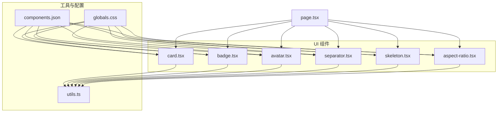
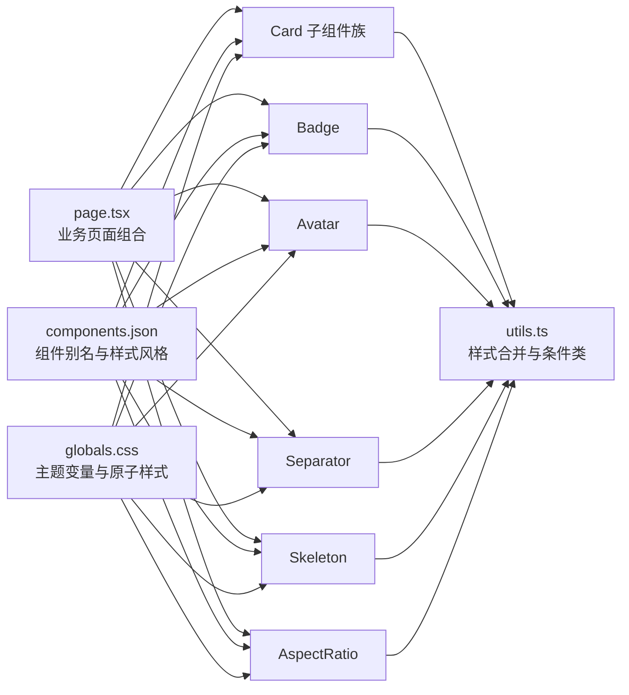
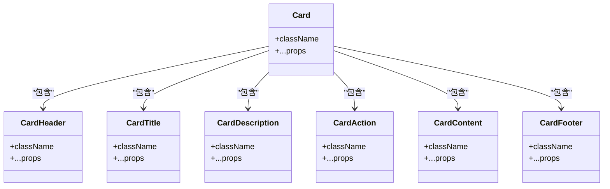
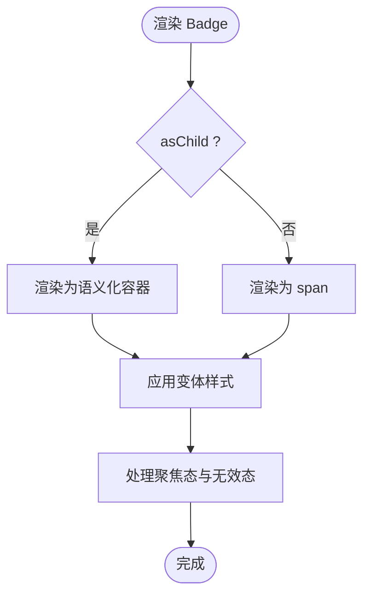
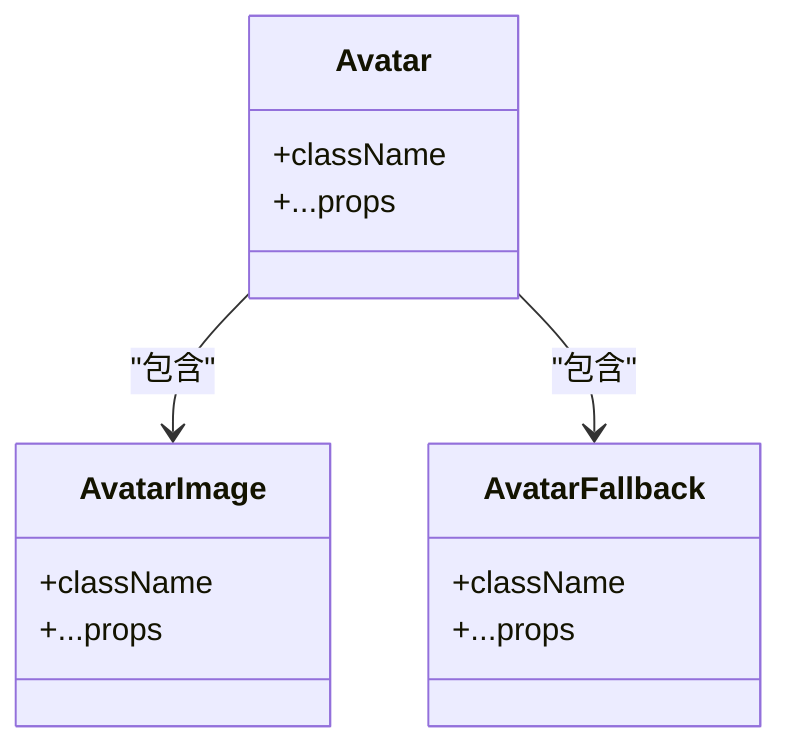
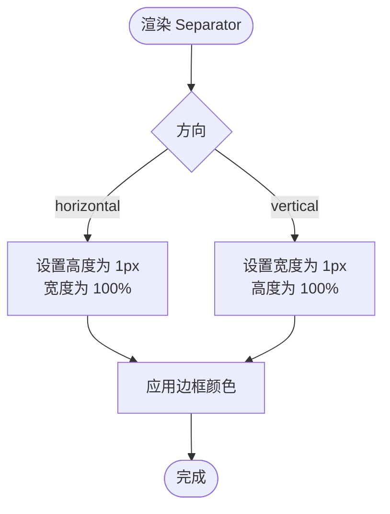
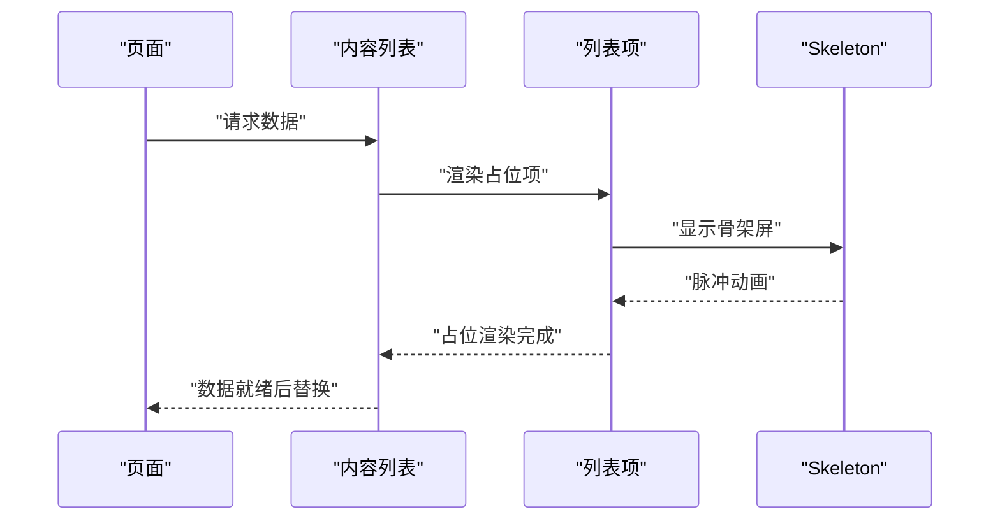
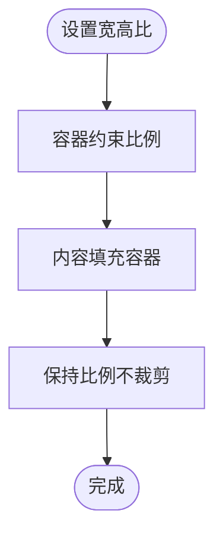
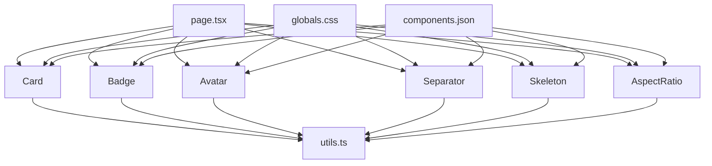

# 布局容器组件

<cite>
**本文引用的文件**
- [card.tsx](file://ai-content-project/src/components/ui/card.tsx)
- [badge.tsx](file://ai-content-project/src/components/ui/badge.tsx)
- [avatar.tsx](file://ai-content-project/src/components/ui/avatar.tsx)
- [separator.tsx](file://ai-content-project/src/components/ui/separator.tsx)
- [skeleton.tsx](file://ai-content-project/src/components/ui/skeleton.tsx)
- [aspect-ratio.tsx](file://ai-content-project/src/components/ui/aspect-ratio.tsx)
- [utils.ts](file://ai-content-project/src/lib/utils.ts)
- [components.json](file://ai-content-project/components.json)
- [globals.css](file://ai-content-project/src/app/globals.css)
- [page.tsx](file://ai-content-project/src/app/page.tsx)
- [button.tsx](file://ai-content-project/src/components/ui/button.tsx)
- [input.tsx](file://ai-content-project/src/components/ui/input.tsx)
</cite>

## 目录
1. [引言](#引言)
2. [项目结构](#项目结构)
3. [核心组件](#核心组件)
4. [架构总览](#架构总览)
5. [详细组件分析](#详细组件分析)
6. [依赖关系分析](#依赖关系分析)
7. [性能考虑](#性能考虑)
8. [故障排查指南](#故障排查指南)
9. [结论](#结论)
10. [附录](#附录)

## 引言
本文件聚焦于布局容器类辅助组件：卡片、徽章、头像、分隔符、骨架屏、宽高比容器。文档从设计理念、布局特性、样式配置、响应式行为、组合模式、间距管理与视觉层次出发，结合实际页面使用示例，给出可操作的最佳实践、性能优化建议与无障碍访问支持要点，并提供与设计系统的集成指南。

## 项目结构
本项目的 UI 组件采用按功能模块化的组织方式，布局容器组件位于统一的 UI 目录下，通过共享工具函数进行样式合并与变体控制；全局样式通过原子化主题变量与 Tailwind 配置实现一致的视觉语言。

图表来源
- [card.tsx:1-93](file://ai-content-project/src/components/ui/card.tsx#L1-L93)
- [badge.tsx:1-47](file://ai-content-project/src/components/ui/badge.tsx#L1-L47)
- [avatar.tsx:1-54](file://ai-content-project/src/components/ui/avatar.tsx#L1-L54)
- [separator.tsx:1-29](file://ai-content-project/src/components/ui/separator.tsx#L1-L29)
- [skeleton.tsx:1-14](file://ai-content-project/src/components/ui/skeleton.tsx#L1-L14)
- [aspect-ratio.tsx:1-12](file://ai-content-project/src/components/ui/aspect-ratio.tsx#L1-L12)
- [utils.ts:1-7](file://ai-content-project/src/lib/utils.ts#L1-L7)
- [components.json:1-22](file://ai-content-project/components.json#L1-L22)
- [globals.css:1-138](file://ai-content-project/src/app/globals.css#L1-L138)
- [page.tsx:1-285](file://ai-content-project/src/app/page.tsx#L1-L285)

章节来源
- [components.json:1-22](file://ai-content-project/components.json#L1-L22)
- [globals.css:1-138](file://ai-content-project/src/app/globals.css#L1-L138)

## 核心组件
本节对六个布局辅助组件进行概览性说明，涵盖职责边界、典型用法与在页面中的组合示例。

- 卡片（Card）：用于承载内容区块，提供头部、标题、描述、内容区、操作区与底部的语义化子组件，便于构建信息卡片、统计面板、入口卡片等。
- 徽章（Badge）：用于状态、标签、分类等轻量信息展示，支持多种语义化变体与作为语义化容器使用。
- 头像（Avatar）：用户头像或占位头像，包含根节点、图像与回退节点，确保图片加载失败时有可用占位。
- 分隔符（Separator）：水平或垂直分割线，常用于列表项之间、区域划分与视觉引导。
- 骨架屏（Skeleton）：在数据加载期间提供占位动画，提升感知性能与交互流畅度。
- 宽高比（AspectRatio）：保持容器内内容的固定宽高比，常用于图片、视频等媒体容器。

章节来源
- [card.tsx:1-93](file://ai-content-project/src/components/ui/card.tsx#L1-L93)
- [badge.tsx:1-47](file://ai-content-project/src/components/ui/badge.tsx#L1-L47)
- [avatar.tsx:1-54](file://ai-content-project/src/components/ui/avatar.tsx#L1-L54)
- [separator.tsx:1-29](file://ai-content-project/src/components/ui/separator.tsx#L1-L29)
- [skeleton.tsx:1-14](file://ai-content-project/src/components/ui/skeleton.tsx#L1-L14)
- [aspect-ratio.tsx:1-12](file://ai-content-project/src/components/ui/aspect-ratio.tsx#L1-L12)
- [page.tsx:95-196](file://ai-content-project/src/app/page.tsx#L95-L196)

## 架构总览
组件间协作遵循“单一职责 + 组合优先”的原则：基础布局组件通过共享工具函数进行样式合并与变体控制；页面通过组合多个组件形成复杂布局；全局样式提供一致的颜色、字体与圆角等主题变量。

图表来源
- [utils.ts:1-7](file://ai-content-project/src/lib/utils.ts#L1-L7)
- [globals.css:1-138](file://ai-content-project/src/app/globals.css#L1-L138)
- [components.json:1-22](file://ai-content-project/components.json#L1-L22)
- [page.tsx:1-285](file://ai-content-project/src/app/page.tsx#L1-L285)
- [card.tsx:1-93](file://ai-content-project/src/components/ui/card.tsx#L1-L93)
- [badge.tsx:1-47](file://ai-content-project/src/components/ui/badge.tsx#L1-L47)
- [avatar.tsx:1-54](file://ai-content-project/src/components/ui/avatar.tsx#L1-L54)
- [separator.tsx:1-29](file://ai-content-project/src/components/ui/separator.tsx#L1-L29)
- [skeleton.tsx:1-14](file://ai-content-project/src/components/ui/skeleton.tsx#L1-L14)
- [aspect-ratio.tsx:1-12](file://ai-content-project/src/components/ui/aspect-ratio.tsx#L1-L12)

## 详细组件分析

### 卡片（Card）
- 设计理念
  - 将卡片拆分为头部、标题、描述、内容、操作与底部等语义化子组件，便于在不同场景下灵活组合。
  - 使用容器查询与网格布局增强响应式表现，例如头部区域在存在操作时自动切换为两列布局。
- 布局特性
  - 支持纵向堆叠的默认卡片结构，以及带操作区的双列布局。
  - 底部与分隔线配合，形成清晰的视觉层级。
- 样式配置
  - 通过主题变量控制背景、前景色、边框与阴影，保证深浅色模式一致性。
  - 子组件使用 data-slot 属性，便于主题系统与测试选择器定位。
- 响应式行为
  - 头部区域在存在操作时启用网格布局，自动适配窄屏。
- 组合模式
  - 与按钮、输入、徽章等表单与交互组件组合，形成搜索、筛选、状态展示等复合面板。
- 间距管理与视觉层次
  - 通过统一的内边距与间距变量，确保卡片内部元素的呼吸感与对齐一致性。
- 使用示例
  - 页面中用于统计卡片与“创建内容”入口卡片的组合使用。

图表来源
- [card.tsx:1-93](file://ai-content-project/src/components/ui/card.tsx#L1-L93)

章节来源
- [card.tsx:1-93](file://ai-content-project/src/components/ui/card.tsx#L1-L93)
- [page.tsx:95-141](file://ai-content-project/src/app/page.tsx#L95-L141)

### 徽章（Badge）
- 设计理念
  - 轻量信息承载，强调可读性与语义化，支持作为语义化容器包裹图标与文本。
- 布局特性
  - 自动居中与紧凑内边距，适合与文本、图标并排显示。
  - 支持 asChild 模式，允许将 Badge 渲染为语义化元素（如 span、a）。
- 样式配置
  - 提供多种语义化变体（默认、次要、破坏性、描边），颜色与悬停效果由主题变量驱动。
  - 聚焦态与无效态具备明确的视觉反馈。
- 响应式行为
  - 在小尺寸设备上仍保持可读性，字号与内边距适配移动端。
- 组合模式
  - 与图标组合用于类型标识（如文章、海报、视频），与状态徽章组合用于状态提示。
- 间距管理与视觉层次
  - 通过紧凑的尺寸与合适的间距，避免遮挡主要内容，保持信息密度平衡。
- 使用示例
  - 页面中用于内容类型徽章与状态徽章的组合使用。

图表来源
- [badge.tsx:1-47](file://ai-content-project/src/components/ui/badge.tsx#L1-L47)

章节来源
- [badge.tsx:1-47](file://ai-content-project/src/components/ui/badge.tsx#L1-L47)
- [page.tsx:213-258](file://ai-content-project/src/app/page.tsx#L213-L258)

### 头像（Avatar）
- 设计理念
  - 用户头像或占位头像，强调可访问性与降级体验，确保图片加载失败时仍可见。
- 布局特性
  - 固定圆形尺寸与裁剪策略，保证在不同容器中的一致性。
  - 回退节点提供默认占位，提升可用性。
- 样式配置
  - 圆角与溢出隐藏确保头像始终为圆形，背景色来自主题的“muted”。
- 响应式行为
  - 尺寸固定，适合在列表、消息、卡片等多场景复用。
- 组合模式
  - 与文本、徽章、按钮等组合，用于用户信息展示与操作入口。
- 间距管理与视觉层次
  - 与文本基线对齐，通过外层容器控制间距，避免视觉拥挤。
- 使用示例
  - 页面中用于用户信息展示与占位头像的组合使用。

图表来源
- [avatar.tsx:1-54](file://ai-content-project/src/components/ui/avatar.tsx#L1-L54)

章节来源
- [avatar.tsx:1-54](file://ai-content-project/src/components/ui/avatar.tsx#L1-L54)
- [page.tsx:81-91](file://ai-content-project/src/app/page.tsx#L81-L91)

### 分隔符（Separator）
- 设计理念
  - 简洁的视觉分割线，强调空间分隔与信息层级，避免过度装饰。
- 布局特性
  - 支持水平与垂直两种方向，宽度与高度根据方向自适应。
  - 通过数据属性控制尺寸，保证在不同容器中的比例一致。
- 样式配置
  - 颜色来自主题边框变量，保证在深浅色模式下的对比度。
- 响应式行为
  - 在窄屏下自动调整方向与尺寸，保持视觉连贯。
- 组合模式
  - 与列表项、卡片、导航等组合，形成清晰的区域划分。
- 间距管理与视觉层次
  - 通过统一的高度/宽度与边距，确保分隔线在复杂布局中的稳定性。
- 使用示例
  - 页面中用于列表项之间的分隔与区域划分。

图表来源
- [separator.tsx:1-29](file://ai-content-project/src/components/ui/separator.tsx#L1-L29)

章节来源
- [separator.tsx:1-29](file://ai-content-project/src/components/ui/separator.tsx#L1-L29)
- [page.tsx:182-192](file://ai-content-project/src/app/page.tsx#L182-L192)

### 骨架屏（Skeleton）
- 设计理念
  - 在数据加载期间提供占位动画，减少感知等待时间，提升用户体验。
- 布局特性
  - 简洁的矩形占位，支持圆角与动画，覆盖常见内容区域。
- 样式配置
  - 动画通过脉冲效果实现，颜色来自主题的“accent”，保证与整体风格一致。
- 响应式行为
  - 尺寸与圆角自适应父容器，适合在卡片、列表、详情页等场景使用。
- 组合模式
  - 与卡片、列表、表格等组合，形成渐进式加载体验。
- 间距管理与视觉层次
  - 通过圆角与动画，避免生硬的占位，保持界面的柔和感。
- 使用示例
  - 页面中用于内容池为空时的占位提示与加载态。

图表来源
- [skeleton.tsx:1-14](file://ai-content-project/src/components/ui/skeleton.tsx#L1-L14)
- [page.tsx:186-191](file://ai-content-project/src/app/page.tsx#L186-L191)

章节来源
- [skeleton.tsx:1-14](file://ai-content-project/src/components/ui/skeleton.tsx#L1-L14)
- [page.tsx:186-191](file://ai-content-project/src/app/page.tsx#L186-L191)

### 宽高比（AspectRatio）
- 设计理念
  - 保持容器内内容的固定宽高比，避免媒体内容变形，提升视觉一致性。
- 布局特性
  - 通过原生容器约束实现，无需额外计算，兼容图片、视频、画廊等场景。
- 样式配置
  - 无额外样式配置，专注于比例控制。
- 响应式行为
  - 在不同视口下保持比例不变，适合响应式布局。
- 组合模式
  - 与图片、视频、卡片等组合，确保媒体内容的正确呈现。
- 间距管理与视觉层次
  - 通过容器尺寸控制，避免媒体内容溢出与布局塌陷。
- 使用示例
  - 页面中用于媒体内容的容器化展示。

图表来源
- [aspect-ratio.tsx:1-12](file://ai-content-project/src/components/ui/aspect-ratio.tsx#L1-L12)

章节来源
- [aspect-ratio.tsx:1-12](file://ai-content-project/src/components/ui/aspect-ratio.tsx#L1-L12)

## 依赖关系分析
- 组件依赖
  - 所有布局组件均依赖共享工具函数进行类名合并与条件样式拼接。
  - 主题系统通过全局 CSS 变量提供一致的颜色与尺寸规范。
  - 组件别名与样式风格由配置文件统一管理，确保跨项目一致性。
- 页面依赖
  - 页面通过组合多个组件形成复杂布局，体现“组合优于继承”的设计思想。
- 外部依赖
  - 使用 Radix UI 原子组件（Avatar、Separator、AspectRatio）保证可访问性与语义化。
  - 使用 class-variance-authority 与 Tailwind 进行变体与样式控制。

图表来源
- [utils.ts:1-7](file://ai-content-project/src/lib/utils.ts#L1-L7)
- [globals.css:1-138](file://ai-content-project/src/app/globals.css#L1-L138)
- [components.json:1-22](file://ai-content-project/components.json#L1-L22)
- [page.tsx:1-285](file://ai-content-project/src/app/page.tsx#L1-L285)
- [card.tsx:1-93](file://ai-content-project/src/components/ui/card.tsx#L1-L93)
- [badge.tsx:1-47](file://ai-content-project/src/components/ui/badge.tsx#L1-L47)
- [avatar.tsx:1-54](file://ai-content-project/src/components/ui/avatar.tsx#L1-L54)
- [separator.tsx:1-29](file://ai-content-project/src/components/ui/separator.tsx#L1-L29)
- [skeleton.tsx:1-14](file://ai-content-project/src/components/ui/skeleton.tsx#L1-L14)
- [aspect-ratio.tsx:1-12](file://ai-content-project/src/components/ui/aspect-ratio.tsx#L1-L12)

章节来源
- [utils.ts:1-7](file://ai-content-project/src/lib/utils.ts#L1-L7)
- [globals.css:1-138](file://ai-content-project/src/app/globals.css#L1-L138)
- [components.json:1-22](file://ai-content-project/components.json#L1-L22)
- [page.tsx:1-285](file://ai-content-project/src/app/page.tsx#L1-L285)

## 性能考虑
- 样式合并与变体
  - 使用工具函数进行类名合并，避免重复样式与不必要的 DOM 属性，降低渲染开销。
- 动画与过渡
  - 骨架屏采用轻量动画，避免复杂滤镜与重绘；徽章与按钮的过渡仅作用于必要属性，减少重排。
- 可访问性与可维护性
  - 组件提供 data-slot 属性与语义化标签，便于无障碍工具识别与测试自动化。
- 响应式与布局
  - 利用容器查询与原子样式，减少复杂布局计算，提高在小屏设备上的渲染效率。

## 故障排查指南
- 卡片布局异常
  - 检查是否存在操作区导致的网格布局切换；确认子组件的 data-slot 是否正确传递。
- 徽章样式错乱
  - 确认变体参数是否正确；检查是否误用 asChild 导致渲染为非期望元素。
- 头像显示问题
  - 确认图像加载失败时回退节点是否生效；检查容器尺寸与裁剪设置。
- 分隔符方向错误
  - 确认 orientation 参数是否设置为期望值；检查容器尺寸与方向约束。
- 骨架屏闪烁
  - 确认占位与真实内容的切换时机；避免在极短时间内频繁切换。
- 宽高比失效
  - 确认容器是否正确设置了宽高比；检查内容是否超出容器范围。

章节来源
- [card.tsx:1-93](file://ai-content-project/src/components/ui/card.tsx#L1-L93)
- [badge.tsx:1-47](file://ai-content-project/src/components/ui/badge.tsx#L1-L47)
- [avatar.tsx:1-54](file://ai-content-project/src/components/ui/avatar.tsx#L1-L54)
- [separator.tsx:1-29](file://ai-content-project/src/components/ui/separator.tsx#L1-L29)
- [skeleton.tsx:1-14](file://ai-content-project/src/components/ui/skeleton.tsx#L1-L14)
- [aspect-ratio.tsx:1-12](file://ai-content-project/src/components/ui/aspect-ratio.tsx#L1-L12)

## 结论
布局容器组件通过语义化子组件、统一的主题变量与工具函数，实现了高内聚、低耦合的布局能力。在实际页面中，它们与表单、按钮、输入等组件协同工作，形成清晰的视觉层次与良好的交互体验。遵循本文提供的最佳实践与注意事项，可在保证可访问性与性能的前提下，快速构建一致且可扩展的界面布局。

## 附录
- 设计系统集成指南
  - 使用配置文件定义的别名与样式风格，确保组件命名与主题变量一致。
  - 在新增组件时，遵循现有组件的 data-slot 与变体模式，保持一致性。
- 最佳实践清单
  - 使用卡片子组件进行语义化布局，避免直接拼装 div。
  - 徽章与图标组合时，保持字号与内边距一致。
  - 头像与文本基线对齐，避免视觉偏移。
  - 分隔符用于明确区域划分，避免过度使用。
  - 骨架屏仅在必要时出现，避免干扰主要信息。
  - 宽高比容器用于媒体内容，确保比例一致。
- 相关组件参考
  - 按钮与输入组件提供了与布局组件协同工作的交互模式，可参考其变体与尺寸策略。

章节来源
- [components.json:1-22](file://ai-content-project/components.json#L1-L22)
- [button.tsx:1-63](file://ai-content-project/src/components/ui/button.tsx#L1-L63)
- [input.tsx:1-22](file://ai-content-project/src/components/ui/input.tsx#L1-L22)
- [page.tsx:1-285](file://ai-content-project/src/app/page.tsx#L1-L285)