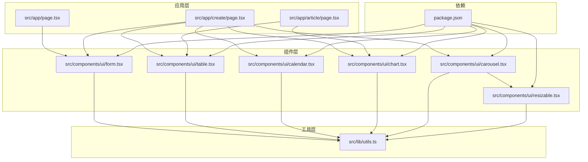
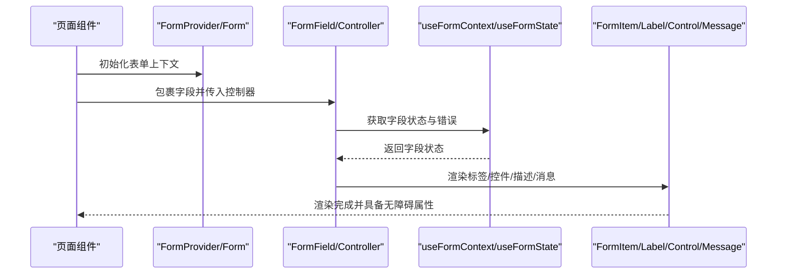
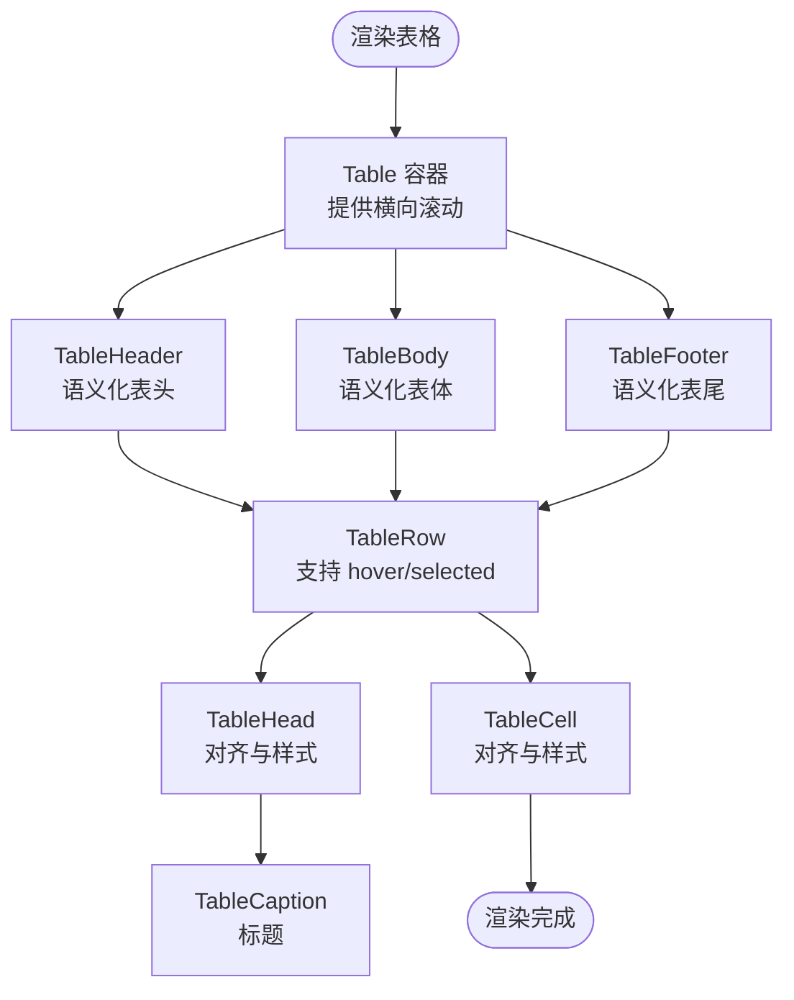
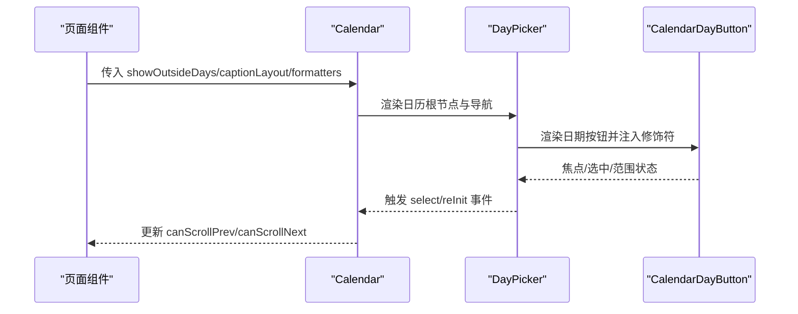
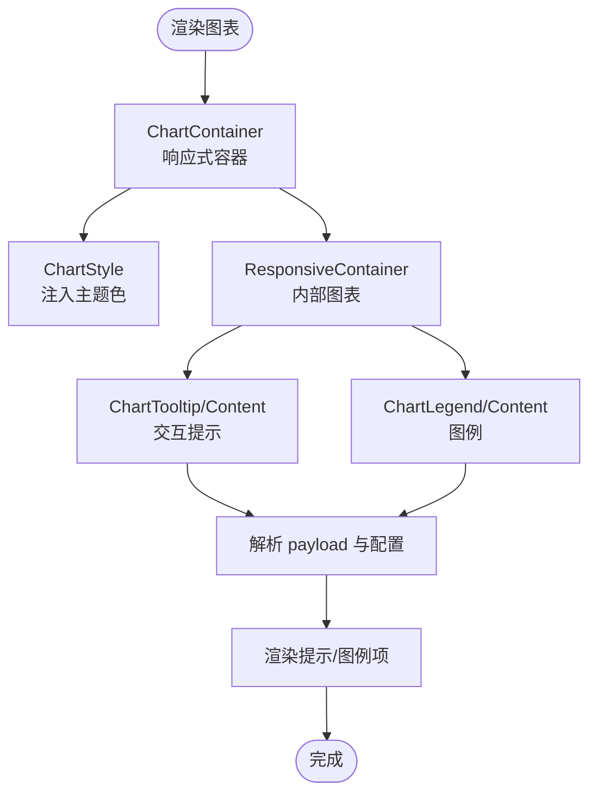
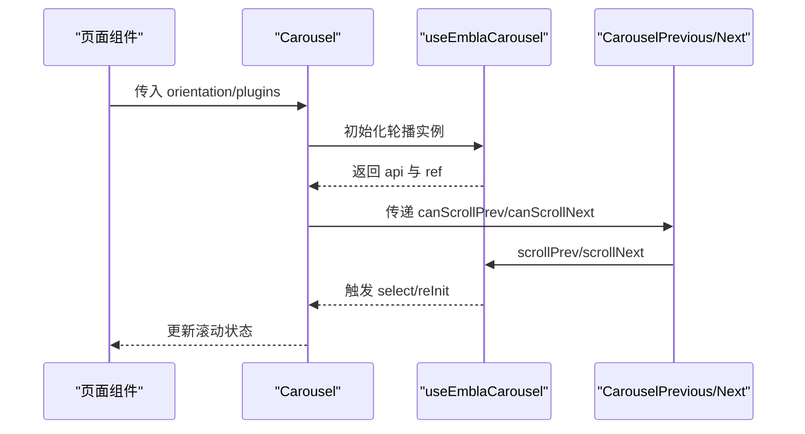
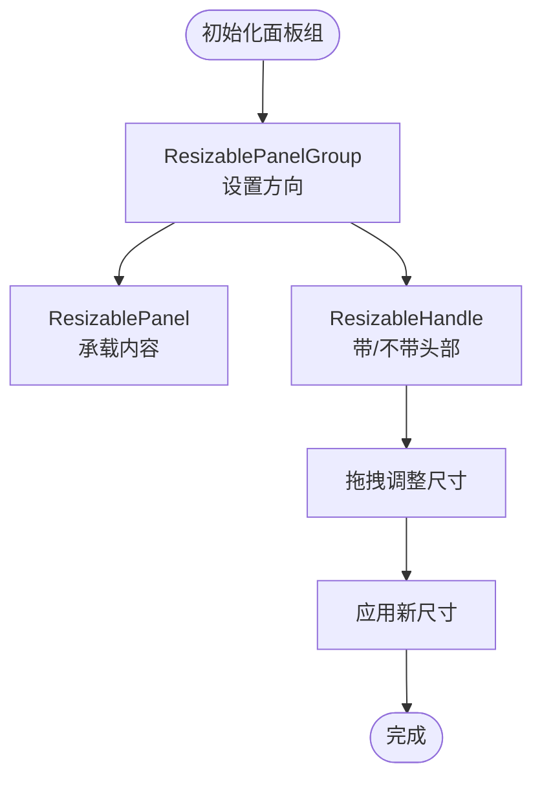
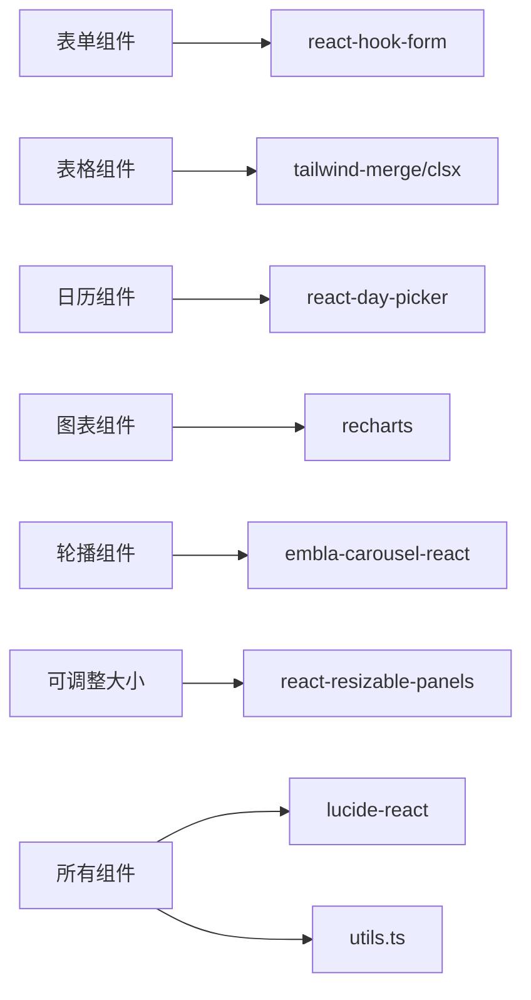

# 高级复合组件

<cite>
**本文档引用的文件**
- [form.tsx](file://ai-content-project/src/components/ui/form.tsx)
- [table.tsx](file://ai-content-project/src/components/ui/table.tsx)
- [calendar.tsx](file://ai-content-project/src/components/ui/calendar.tsx)
- [chart.tsx](file://ai-content-project/src/components/ui/chart.tsx)
- [carousel.tsx](file://ai-content-project/src/components/ui/carousel.tsx)
- [resizable.tsx](file://ai-content-project/src/components/ui/resizable.tsx)
- [utils.ts](file://ai-content-project/src/lib/utils.ts)
- [package.json](file://ai-content-project/package.json)
- [page.tsx](file://ai-content-project/src/app/page.tsx)
- [create/page.tsx](file://ai-content-project/src/app/create/page.tsx)
- [article/page.tsx](file://ai-content-project/src/app/article/page.tsx)
</cite>

## 目录
1. [引言](#引言)
2. [项目结构](#项目结构)
3. [核心组件](#核心组件)
4. [架构总览](#架构总览)
5. [详细组件分析](#详细组件分析)
6. [依赖分析](#依赖分析)
7. [性能考虑](#性能考虑)
8. [故障排查指南](#故障排查指南)
9. [结论](#结论)
10. [附录](#附录)

## 引言
本文件聚焦于高级复合组件的设计与实现，涵盖表单、表格、日历、图表、轮播、可调整大小区域等复杂 UI 组件。文档从架构、数据绑定、状态管理、交互逻辑、性能优化、内存管理与渲染策略、最佳实践与用户体验设计等多个维度进行系统化阐述，并结合实际业务页面展示组件在真实场景中的使用方式与集成路径。

## 项目结构
该仓库采用 Next.js 16 应用结构，UI 组件集中位于 src/components/ui 下，通用工具函数位于 src/lib，页面路由位于 src/app。核心依赖通过 package.json 管理，组件间通过上下文与受控/非受控模式协同工作，形成清晰的分层与职责边界。

**图表来源**
- [page.tsx:1-285](file://ai-content-project/src/app/page.tsx#L1-L285)
- [create/page.tsx:1-761](file://ai-content-project/src/app/create/page.tsx#L1-L761)
- [article/page.tsx:1-800](file://ai-content-project/src/app/article/page.tsx#L1-L800)
- [form.tsx:1-168](file://ai-content-project/src/components/ui/form.tsx#L1-L168)
- [table.tsx:1-117](file://ai-content-project/src/components/ui/table.tsx#L1-L117)
- [calendar.tsx:1-221](file://ai-content-project/src/components/ui/calendar.tsx#L1-L221)
- [chart.tsx:1-358](file://ai-content-project/src/components/ui/chart.tsx#L1-L358)
- [carousel.tsx:1-242](file://ai-content-project/src/components/ui/carousel.tsx#L1-L242)
- [resizable.tsx:1-64](file://ai-content-project/src/components/ui/resizable.tsx#L1-L64)
- [utils.ts:1-7](file://ai-content-project/src/lib/utils.ts#L1-L7)
- [package.json:1-100](file://ai-content-project/package.json#L1-L100)

**章节来源**
- [page.tsx:1-285](file://ai-content-project/src/app/page.tsx#L1-L285)
- [create/page.tsx:1-761](file://ai-content-project/src/app/create/page.tsx#L1-L761)
- [article/page.tsx:1-800](file://ai-content-project/src/app/article/page.tsx#L1-L800)
- [package.json:1-100](file://ai-content-project/package.json#L1-L100)

## 核心组件
本节概述六大高级复合组件的核心职责与能力边界：
- 表单组件：基于 react-hook-form 的受控封装，提供字段上下文、校验状态、无障碍属性与统一样式槽位。
- 表格组件：容器化表格，提供表头、表体、表尾、行、单元格、标题等语义化子组件，支持横向滚动与悬停态。
- 日历组件：基于 react-day-picker 的可定制日历，支持范围选择、周数显示、自定义按钮与主题类名映射。
- 图表组件：基于 recharts 的响应式图表容器，提供主题色注入、工具提示、图例、配置化颜色映射。
- 轮播组件：基于 embla-carousel-react 的触控轮播，提供键盘导航、方向控制、API 透传与无障碍角色描述。
- 可调整大小区域：基于 react-resizable-panels 的面板组，支持拖拽分割与带手柄的分割条。

**章节来源**
- [form.tsx:1-168](file://ai-content-project/src/components/ui/form.tsx#L1-L168)
- [table.tsx:1-117](file://ai-content-project/src/components/ui/table.tsx#L1-L117)
- [calendar.tsx:1-221](file://ai-content-project/src/components/ui/calendar.tsx#L1-L221)
- [chart.tsx:1-358](file://ai-content-project/src/components/ui/chart.tsx#L1-L358)
- [carousel.tsx:1-242](file://ai-content-project/src/components/ui/carousel.tsx#L1-L242)
- [resizable.tsx:1-64](file://ai-content-project/src/components/ui/resizable.tsx#L1-L64)

## 架构总览
六大组件均采用“容器 + 子组件”的组合模式，通过上下文传递状态与 API，配合工具函数进行样式合并与无障碍增强。页面通过 Suspense、状态钩子与事件回调实现复杂交互，例如聊天对话、内容块编辑、图片选择器与分发渠道开关等。

```mermaid
graph TB
subgraph "表单域"
F_CTX["Form/FormField 上下文"]
F_ITEM["FormItem/Label/Control/Description/Message"]
end
subgraph "表格域"
T_TABLE["Table 容器"]
T_HEAD["TableHead/Row/Body/Footer"]
T_CELL["TableCell/Caption"]
end
subgraph "日历域"
CAL_ROOT["Calendar 根组件"]
CAL_DAY["CalendarDayButton"]
end
subgraph "图表域"
CH_CONT["ChartContainer"]
CH_TOOLTIP["ChartTooltip/Content"]
CH_LEGEND["ChartLegend/Content"]
end
subgraph "轮播域"
CAR_CTXT["Carousel 上下文"]
CAR_CONTENT["CarouselContent/Item"]
CAR_NAV["CarouselPrevious/Next"]
end
subgraph "可调整大小"
R_GROUP["ResizablePanelGroup"]
R_PANEL["ResizablePanel"]
R_HANDLE["ResizableHandle"]
end
F_CTX --> F_ITEM
T_TABLE --> T_HEAD
T_TABLE --> T_CELL
CAL_ROOT --> CAL_DAY
CH_CONT --> CH_TOOLTIP
CH_CONT --> CH_LEGEND
CAR_CTXT --> CAR_CONTENT
CAR_CTXT --> CAR_NAV
R_GROUP --> R_PANEL
R_GROUP --> R_HANDLE
```

**图表来源**
- [form.tsx:19-167](file://ai-content-project/src/components/ui/form.tsx#L19-L167)
- [table.tsx:7-116](file://ai-content-project/src/components/ui/table.tsx#L7-L116)
- [calendar.tsx:18-220](file://ai-content-project/src/components/ui/calendar.tsx#L18-L220)
- [chart.tsx:37-357](file://ai-content-project/src/components/ui/chart.tsx#L37-L357)
- [carousel.tsx:45-241](file://ai-content-project/src/components/ui/carousel.tsx#L45-L241)
- [resizable.tsx:15-63](file://ai-content-project/src/components/ui/resizable.tsx#L15-L63)

## 详细组件分析

### 表单组件（Form）
- 设计要点
  - 通过 FormProvider 提供全局表单上下文；FormField 包装 Controller 并注入字段名上下文。
  - useFormField 读取字段状态、错误、aria 属性与槽位 ID，确保可访问性与样式一致性。
  - 子组件（FormItem/Label/Control/Description/Message）通过 data-slot 与样式工具函数统一外观。
- 数据绑定与状态管理
  - 依赖 react-hook-form 的 useFormContext/useFormState 获取字段状态与错误；通过 Controller 实现受控渲染。
  - 错误信息通过 FormMessage 渲染，结合 aria-invalid 与 aria-describedby 提升可访问性。
- 复杂交互
  - 支持动态描述与消息 ID 注入，便于与外部验证器联动。
- 性能与可维护性
  - 使用 React.useId 生成唯一槽位 ID，避免重复；样式合并通过 cn 工具减少类名冲突。
- 最佳实践
  - 将每个字段包裹在 FormField 中；在表单顶层使用 FormProvider；为每个字段提供简短描述与错误提示。

**图表来源**
- [form.tsx:19-167](file://ai-content-project/src/components/ui/form.tsx#L19-L167)

**章节来源**
- [form.tsx:1-168](file://ai-content-project/src/components/ui/form.tsx#L1-L168)

### 表格组件（Table）
- 设计要点
  - Table 容器提供横向滚动与语义化槽位；各子组件通过 data-slot 标记，便于主题与样式覆盖。
  - 支持 hover、selected 状态与过渡动画，提升交互反馈。
- 数据绑定与状态管理
  - 通过 props 接收数据，内部不维护状态；由上层页面负责数据更新与重渲染。
- 复杂交互
  - 通过 row 级 data-state 控制选中态；支持复选框与交互列。
- 性能与可维护性
  - 使用容器化结构避免过度嵌套；通过 cn 合并类名，降低样式冲突风险。
- 最佳实践
  - 将长列表置于 Table 容器内；为表头与单元格设置合适的对齐与间距；为可排序列提供视觉指示。

**图表来源**
- [table.tsx:7-116](file://ai-content-project/src/components/ui/table.tsx#L7-L116)

**章节来源**
- [table.tsx:1-117](file://ai-content-project/src/components/ui/table.tsx#L1-L117)

### 日历组件（Calendar）
- 设计要点
  - 基于 react-day-picker，默认类名映射与主题变量；支持月份/年份下拉、导航按钮、范围选择与周数显示。
  - 自定义组件 Root/Chevron/DayButton，统一尺寸与焦点行为。
- 数据绑定与状态管理
  - 通过 props 传入日期范围、格式化器与组件映射；内部维护焦点与选中状态。
- 复杂交互
  - 支持键盘导航（左右箭头）、焦点同步与无障碍角色描述；支持 RTL 方向旋转。
- 性能与可维护性
  - 通过 classNames 与 formatters 参数扩展样式与文本；避免重复计算，仅在变更时更新。
- 最佳实践
  - 为不同布局（label/dropdowns）提供差异化样式；为范围选择提供明确的起止标记。

**图表来源**
- [calendar.tsx:18-220](file://ai-content-project/src/components/ui/calendar.tsx#L18-L220)

**章节来源**
- [calendar.tsx:1-221](file://ai-content-project/src/components/ui/calendar.tsx#L1-L221)

### 图表组件（Chart）
- 设计要点
  - ChartContainer 提供响应式容器与主题色注入；ChartTooltip/Content 与 ChartLegend/Content 提供交互提示与图例。
  - 通过 ChartConfig 与 getPayloadConfigFromPayload 解析配置与颜色映射。
- 数据绑定与状态管理
  - 依赖 recharts 的原生数据结构；通过 useChart 获取配置；tooltip/legend 通过 payload 动态渲染。
- 复杂交互
  - 支持多种指示器（点/线/虚线）、标签格式化、隐藏标签/图标；支持垂直对齐与名称键映射。
- 性能与可维护性
  - 使用 useMemo 优化 tooltip 标签计算；通过 CSS 变量注入主题色，减少运行时样式计算。
- 最佳实践
  - 为每个系列提供稳定的颜色映射；在移动端保持紧凑布局；合理使用工具提示与图例。

**图表来源**
- [chart.tsx:37-357](file://ai-content-project/src/components/ui/chart.tsx#L37-L357)

**章节来源**
- [chart.tsx:1-358](file://ai-content-project/src/components/ui/chart.tsx#L1-L358)

### 轮播组件（Carousel）
- 设计要点
  - CarouselContext 提供 api、滚动控制与方向；CarouselContent/Item 管理滑动容器与子项布局。
  - 支持水平/垂直轴、键盘导航、无障碍角色与禁用态。
- 数据绑定与状态管理
  - 通过 useEmblaCarousel 获取 api；监听 select/reInit 事件更新 canScrollPrev/canScrollNext。
- 复杂交互
  - 键盘事件拦截（ArrowLeft/ArrowRight）触发滚动；支持插件扩展与外部 setApi 回调。
- 性能与可维护性
  - 仅在 api 变化时订阅事件；滚动方法通过 useCallback 避免多余重渲染。
- 最佳实践
  - 为导航按钮提供禁用态与屏幕阅读器提示；在移动端启用触摸惯性滚动。

**图表来源**
- [carousel.tsx:45-241](file://ai-content-project/src/components/ui/carousel.tsx#L45-L241)

**章节来源**
- [carousel.tsx:1-242](file://ai-content-project/src/components/ui/carousel.tsx#L1-L242)

### 可调整大小区域（Resizable）
- 设计要点
  - ResizablePanelGroup/Panel/Handle 提供面板分组、面板与分割手柄；支持水平/垂直方向与带手柄的分割条。
- 数据绑定与状态管理
  - 通过 react-resizable-panels 的原生 API 管理面板尺寸；支持拖拽与键盘微调。
- 复杂交互
  - 分割条居中显示，支持焦点态与旋转以适配垂直方向；提供最小/最大尺寸约束。
- 性能与可维护性
  - 通过 data-panel-group-direction 与 CSS 选择器简化样式分支；减少不必要的重绘。
- 最佳实践
  - 为不可调整区域设置固定尺寸；在移动端提供折叠/展开能力。

**图表来源**
- [resizable.tsx:15-63](file://ai-content-project/src/components/ui/resizable.tsx#L15-L63)

**章节来源**
- [resizable.tsx:1-64](file://ai-content-project/src/components/ui/resizable.tsx#L1-L64)

## 依赖分析
六大组件依赖第三方库与工具函数：
- react-hook-form：表单上下文与字段状态管理。
- react-day-picker：日历渲染与交互。
- recharts：图表容器与交互元素。
- embla-carousel-react：轮播容器与 API。
- react-resizable-panels：面板分组与分割。
- lucide-react：图标与按钮。
- tailwind-merge/clsx：样式类名合并。

**图表来源**
- [package.json:15-76](file://ai-content-project/package.json#L15-L76)
- [utils.ts:1-7](file://ai-content-project/src/lib/utils.ts#L1-L7)

**章节来源**
- [package.json:1-100](file://ai-content-project/package.json#L1-L100)
- [utils.ts:1-7](file://ai-content-project/src/lib/utils.ts#L1-L7)

## 性能考虑
- 渲染策略
  - 使用 React.useMemo 与 React.useCallback 优化昂贵计算与回调重用（如图表 tooltip 计算、轮播滚动方法）。
  - 通过容器化组件（Table/Calendar/Chart）隔离样式与布局计算，减少父级重渲染。
- 内存管理
  - 轮播组件在卸载时移除事件监听；表单组件通过上下文传递避免深层传递 props。
  - 图表组件通过 CSS 变量注入主题色，避免频繁创建样式对象。
- 交互优化
  - 日历组件在首次渲染时根据焦点修饰符自动聚焦；轮播组件在键盘事件中阻止默认行为以避免页面滚动。
- 可访问性
  - 所有交互组件提供 aria-* 属性与 role 描述，确保屏幕阅读器可用。

[本节为通用指导，无需特定文件引用]

## 故障排查指南
- 表单组件
  - 若 useFormField 抛出上下文错误，检查是否在 FormField/FormItem 内部使用。
  - 若错误信息不显示，检查 FormMessage 是否正确接收 error 与 formMessageId。
- 表格组件
  - 若横向滚动失效，检查 Table 容器是否包裹在 div 中且 overflow-x 设置为 auto。
  - 若 hover/selected 样式异常，检查 data-state 与子组件类名拼接。
- 日历组件
  - 若导航按钮不可用，检查 showOutsideDays 与 canScrollPrev/canScrollNext 的计算。
  - 若焦点不同步，检查 DayButton 的 ref 与 modifiers.focused。
- 图表组件
  - 若主题色不生效，检查 ChartContainer 的 data-chart 与 ChartStyle 的 CSS 注入。
  - 若 tooltip 不显示，检查 payload 是否存在以及 getPayloadConfigFromPayload 的键映射。
- 轮播组件
  - 若滚动无效，检查 api 是否初始化成功与 setApi 回调是否被调用。
  - 若键盘事件冲突，检查 onKeyDownCapture 的事件冒泡与 preventDefault。
- 可调整大小区域
  - 若拖拽无效，检查 handle 的位置与方向属性；确认最小/最大尺寸约束。

**章节来源**
- [form.tsx:45-66](file://ai-content-project/src/components/ui/form.tsx#L45-L66)
- [table.tsx:7-20](file://ai-content-project/src/components/ui/table.tsx#L7-L20)
- [calendar.tsx:182-218](file://ai-content-project/src/components/ui/calendar.tsx#L182-L218)
- [chart.tsx:107-251](file://ai-content-project/src/components/ui/chart.tsx#L107-L251)
- [carousel.tsx:78-105](file://ai-content-project/src/components/ui/carousel.tsx#L78-L105)
- [resizable.tsx:38-61](file://ai-content-project/src/components/ui/resizable.tsx#L38-L61)

## 结论
六大高级复合组件通过清晰的上下文与子组件结构，实现了高内聚、低耦合的 UI 能力模块。它们在数据绑定、状态管理、无障碍与性能方面均具备良好实践，能够支撑复杂的业务场景。结合页面中的聊天、编辑与内容分发等交互，组件体系展现出良好的扩展性与可维护性。

[本节为总结，无需特定文件引用]

## 附录
- 使用示例与集成指南
  - 表单：在页面中使用 FormProvider 包裹，FormField 包裹字段，结合 Label/Control/Message 提升可访问性。
  - 表格：将长列表放入 Table 容器，使用 TableHead/Cell 组织列；为可交互列提供操作按钮。
  - 日历：在表单中作为输入组件，配置 showOutsideDays 与 captionLayout；为范围选择提供起止标记。
  - 图表：在 ChartContainer 中传入配置与数据；使用 ChartTooltip/Content 与 ChartLegend/Content 提供交互。
  - 轮播：在 Carousel 中传入 orientation 与 plugins；为导航按钮提供禁用态与无障碍提示。
  - 可调整大小：在 ResizablePanelGroup 中放置多个 ResizablePanel，使用 ResizableHandle 提供分割手柄。
- 最佳实践
  - 优先使用受控组件与上下文；为每个交互提供明确的 aria-* 属性与 role 描述。
  - 对昂贵计算使用 useMemo/useCallback；对样式合并使用 cn 工具。
  - 在移动端提供触摸与手势优化；在桌面端提供键盘与鼠标双通道交互。

[本节为通用指导，无需特定文件引用]