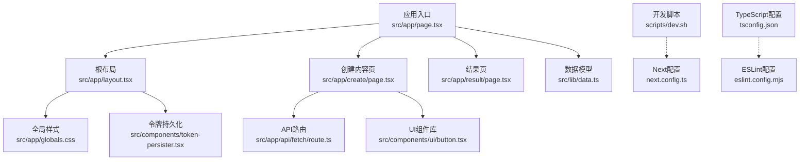
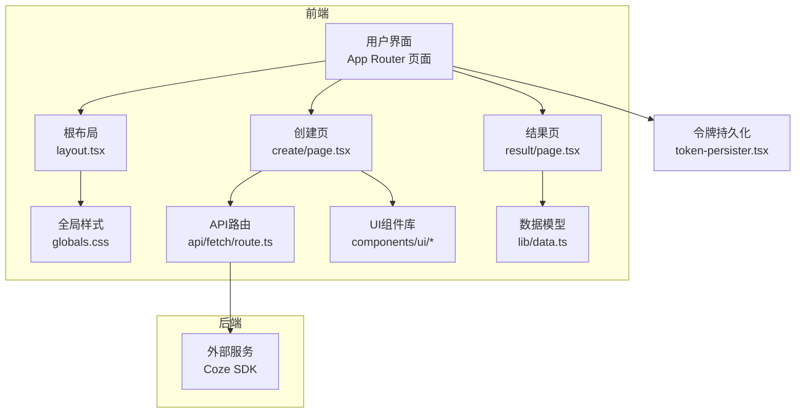
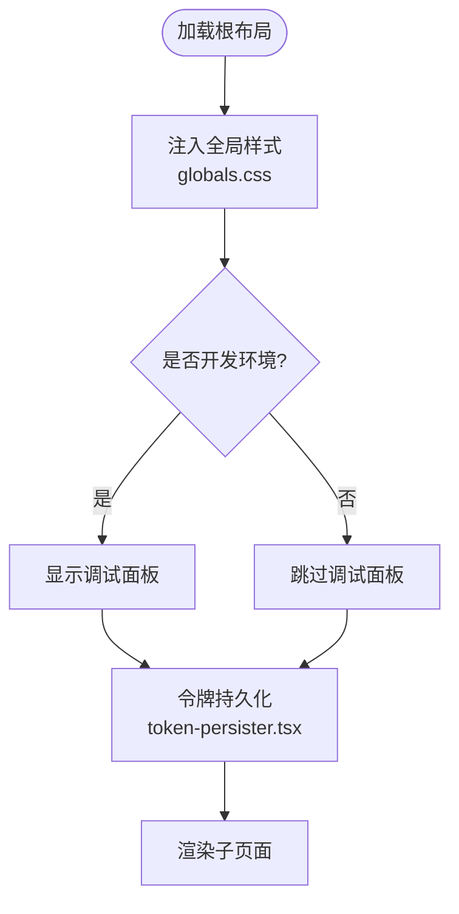
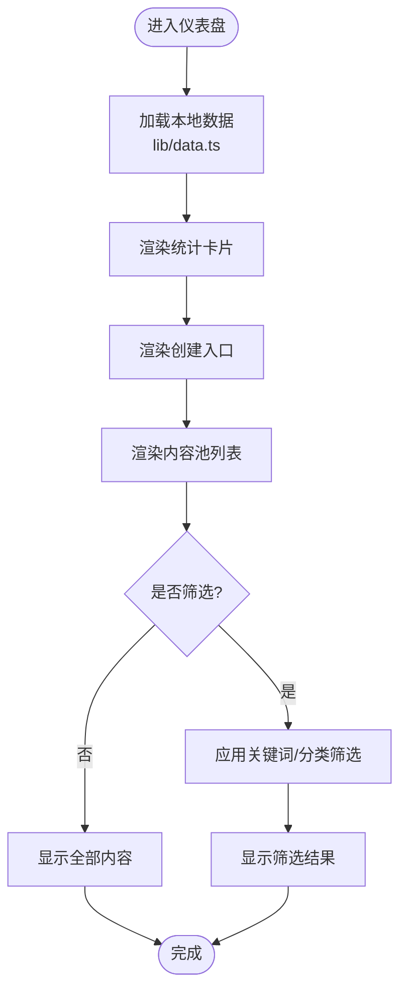
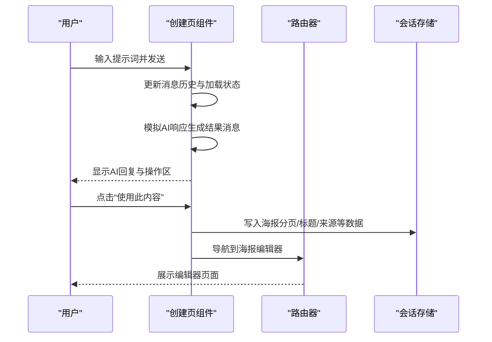
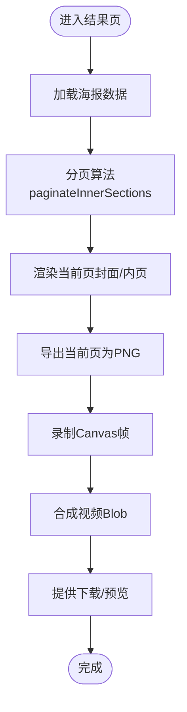
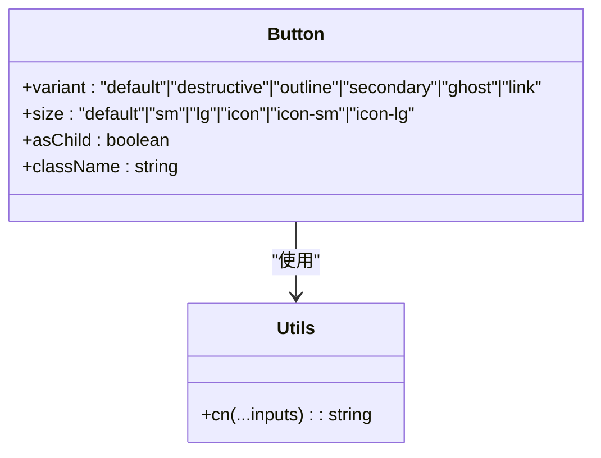
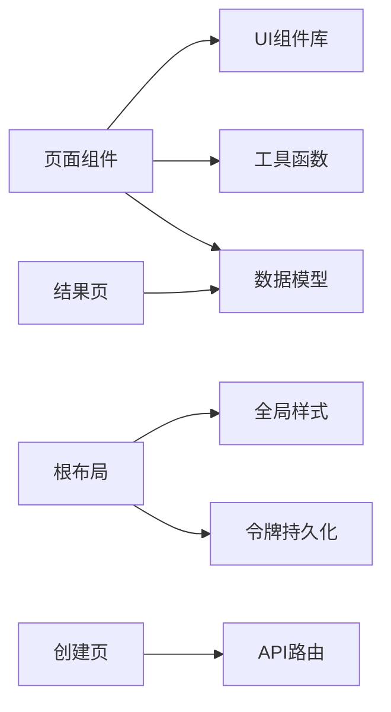

# 前端架构设计

<cite>
**本文引用的文件**
- [package.json](file://ai-content-project/package.json)
- [next.config.ts](file://ai-content-project/next.config.ts)
- [tsconfig.json](file://ai-content-project/tsconfig.json)
- [components.json](file://ai-content-project/components.json)
- [postcss.config.mjs](file://ai-content-project/postcss.config.mjs)
- [eslint.config.mjs](file://ai-content-project/eslint.config.mjs)
- [src/app/layout.tsx](file://ai-content-project/src/app/layout.tsx)
- [src/app/globals.css](file://ai-content-project/src/app/globals.css)
- [src/app/page.tsx](file://ai-content-project/src/app/page.tsx)
- [src/app/create/page.tsx](file://ai-content-project/src/app/create/page.tsx)
- [src/app/result/page.tsx](file://ai-content-project/src/app/result/page.tsx)
- [src/app/api/fetch/route.ts](file://ai-content-project/src/app/api/fetch/route.ts)
- [src/components/token-persister.tsx](file://ai-content-project/src/components/token-persister.tsx)
- [src/components/ui/button.tsx](file://ai-content-project/src/components/ui/button.tsx)
- [src/hooks/use-mobile.ts](file://ai-content-project/src/hooks/use-mobile.ts)
- [src/lib/utils.ts](file://ai-content-project/src/lib/utils.ts)
- [src/lib/data.ts](file://ai-content-project/src/lib/data.ts)
- [scripts/dev.sh](file://ai-content-project/scripts/dev.sh)
</cite>

## 目录
1. [引言](#引言)
2. [项目结构](#项目结构)
3. [核心组件](#核心组件)
4. [架构总览](#架构总览)
5. [详细组件分析](#详细组件分析)
6. [依赖关系分析](#依赖关系分析)
7. [性能考虑](#性能考虑)
8. [故障排查指南](#故障排查指南)
9. [结论](#结论)
10. [附录](#附录)

## 引言
本文件面向AI内容生成系统的前端架构，围绕Next.js应用结构、页面路由设计、组件层次架构展开，重点说明布局组件、全局样式与主题配置、shadcn/ui组件库集成与自定义、TypeScript配置、构建优化与开发环境设置，并总结组件设计模式、状态管理与数据流最佳实践，以及响应式设计与用户体验优化策略。

## 项目结构
- 应用采用App Router目录结构，页面位于src/app下，按功能模块划分（如create、result、logs、poster等），根布局与全局样式集中于layout与globals.css。
- 组件库采用shadcn/ui，组件位于src/components/ui，通过components.json统一配置，支持RSC与TSX。
- 构建与开发脚本集中在scripts目录，使用pnpm管理依赖，TypeScript与ESLint配置完善。

图表来源
- [src/app/page.tsx:1-285](file://ai-content-project/src/app/page.tsx#L1-L285)
- [src/app/layout.tsx:1-34](file://ai-content-project/src/app/layout.tsx#L1-L34)
- [src/app/globals.css:1-138](file://ai-content-project/src/app/globals.css#L1-L138)
- [src/components/token-persister.tsx:1-38](file://ai-content-project/src/components/token-persister.tsx#L1-L38)
- [src/app/create/page.tsx:1-761](file://ai-content-project/src/app/create/page.tsx#L1-L761)
- [src/app/result/page.tsx:1-800](file://ai-content-project/src/app/result/page.tsx#L1-L800)
- [src/app/api/fetch/route.ts:1-25](file://ai-content-project/src/app/api/fetch/route.ts#L1-L25)
- [src/components/ui/button.tsx:1-63](file://ai-content-project/src/components/ui/button.tsx#L1-L63)
- [src/lib/data.ts:1-218](file://ai-content-project/src/lib/data.ts#L1-L218)
- [scripts/dev.sh:1-35](file://ai-content-project/scripts/dev.sh#L1-L35)
- [next.config.ts:1-23](file://ai-content-project/next.config.ts#L1-L23)
- [tsconfig.json:1-45](file://ai-content-project/tsconfig.json#L1-L45)
- [eslint.config.mjs:1-54](file://ai-content-project/eslint.config.mjs#L1-L54)

章节来源
- [package.json:1-100](file://ai-content-project/package.json#L1-L100)
- [next.config.ts:1-23](file://ai-content-project/next.config.ts#L1-L23)
- [tsconfig.json:1-45](file://ai-content-project/tsconfig.json#L1-L45)
- [components.json:1-22](file://ai-content-project/components.json#L1-L22)
- [postcss.config.mjs:1-8](file://ai-content-project/postcss.config.mjs#L1-L8)
- [eslint.config.mjs:1-54](file://ai-content-project/eslint.config.mjs#L1-L54)

## 核心组件
- 根布局与全局样式
  - 根布局负责注入全局样式、开发者调试工具与令牌持久化逻辑，确保子页面共享主题与认证上下文。
  - 全局样式采用Tailwind V4语法与CSS变量主题系统，支持明暗主题切换与品牌色彩体系。
- 页面级组件
  - 仪表盘页：展示内容统计、筛选与操作入口，使用shadcn/ui卡片、输入与按钮组件。
  - 创建内容页：聊天式交互界面，支持文章/海报两种生成模式，内置快捷提示词与结果操作。
  - 结果页：海报预览与视频生成流程，包含分页渲染、截图合成视频与平台分发配置。
- 组件库与工具
  - shadcn/ui按钮组件：通过cva定义变体与尺寸，结合cn合并类名，实现一致的视觉与交互规范。
  - 工具函数：cn用于安全合并CSS类，use-mobile用于移动端断点检测，token-persister用于iframe内导航的令牌传递。

章节来源
- [src/app/layout.tsx:1-34](file://ai-content-project/src/app/layout.tsx#L1-L34)
- [src/app/globals.css:1-138](file://ai-content-project/src/app/globals.css#L1-L138)
- [src/app/page.tsx:1-285](file://ai-content-project/src/app/page.tsx#L1-L285)
- [src/app/create/page.tsx:1-761](file://ai-content-project/src/app/create/page.tsx#L1-L761)
- [src/app/result/page.tsx:1-800](file://ai-content-project/src/app/result/page.tsx#L1-L800)
- [src/components/ui/button.tsx:1-63](file://ai-content-project/src/components/ui/button.tsx#L1-L63)
- [src/lib/utils.ts:1-7](file://ai-content-project/src/lib/utils.ts#L1-L7)
- [src/hooks/use-mobile.ts:1-20](file://ai-content-project/src/hooks/use-mobile.ts#L1-L20)
- [src/components/token-persister.tsx:1-38](file://ai-content-project/src/components/token-persister.tsx#L1-L38)

## 架构总览
系统采用前后端分离的App Router架构：
- 前端：Next.js 16，RSC支持，Tailwind V4，shadcn/ui组件库，TypeScript严格模式。
- 后端：Next.js API路由（fetch接口），用于代理第三方内容抓取。
- 数据：本地静态数据模型与会话存储，支撑海报编辑器的数据流转。
- 样式：CSS变量主题系统，支持暗色模式与品牌色彩映射。

图表来源
- [src/app/layout.tsx:1-34](file://ai-content-project/src/app/layout.tsx#L1-L34)
- [src/app/globals.css:1-138](file://ai-content-project/src/app/globals.css#L1-L138)
- [src/app/create/page.tsx:1-761](file://ai-content-project/src/app/create/page.tsx#L1-L761)
- [src/app/result/page.tsx:1-800](file://ai-content-project/src/app/result/page.tsx#L1-L800)
- [src/app/api/fetch/route.ts:1-25](file://ai-content-project/src/app/api/fetch/route.ts#L1-L25)
- [src/components/ui/button.tsx:1-63](file://ai-content-project/src/components/ui/button.tsx#L1-L63)
- [src/lib/data.ts:1-218](file://ai-content-project/src/lib/data.ts#L1-L218)
- [src/components/token-persister.tsx:1-38](file://ai-content-project/src/components/token-persister.tsx#L1-L38)

## 详细组件分析

### 布局与全局样式
- 根布局职责
  - 注入全局样式与调试工具，挂载令牌持久化组件，确保iframe内导航场景下的认证一致性。
- 全局样式设计
  - 使用Tailwind V4原生语法与CSS变量主题，定义明/暗两套色彩体系，覆盖背景、前景、卡片、弹出层、输入、边框、环形光晕等。
  - 字体族配置包含中文字体栈，满足国际化站点的可读性与一致性。

图表来源
- [src/app/layout.tsx:1-34](file://ai-content-project/src/app/layout.tsx#L1-L34)
- [src/app/globals.css:1-138](file://ai-content-project/src/app/globals.css#L1-L138)
- [src/components/token-persister.tsx:1-38](file://ai-content-project/src/components/token-persister.tsx#L1-L38)

章节来源
- [src/app/layout.tsx:1-34](file://ai-content-project/src/app/layout.tsx#L1-L34)
- [src/app/globals.css:1-138](file://ai-content-project/src/app/globals.css#L1-L138)

### 仪表盘页面（Dashboard）
- 功能要点
  - 展示内容统计卡片、创建入口、内容池列表与筛选器。
  - 使用shadcn/ui卡片、输入、按钮、分隔线等组件，配合本地数据模型渲染。
- 设计模式
  - 简单的状态管理：查询关键词与分类过滤，计算统计数据，渲染内容行组件。
  - 列表项组件化：将内容行抽象为独立组件，便于复用与扩展。

图表来源
- [src/app/page.tsx:1-285](file://ai-content-project/src/app/page.tsx#L1-L285)
- [src/lib/data.ts:1-218](file://ai-content-project/src/lib/data.ts#L1-L218)

章节来源
- [src/app/page.tsx:1-285](file://ai-content-project/src/app/page.tsx#L1-L285)
- [src/lib/data.ts:1-218](file://ai-content-project/src/lib/data.ts#L1-L218)

### 创建内容页（Create）
- 功能要点
  - 聊天式交互：用户输入提示词，AI模拟响应，支持文章/海报两种生成类型。
  - 快捷提示词与结果操作：一键使用、复制、继续优化。
  - 海报生成：根据来源类型生成分页内容，支持页数调节。
- 状态管理
  - 使用useState与useEffect管理消息历史、输入值、加载状态、复制反馈与内容类型。
  - 使用useRouter与useSearchParams实现页面间参数传递与导航。
- 数据流
  - 用户输入 -> 模拟AI响应 -> 生成结果消息 -> 结果操作（使用/复制/继续优化）-> 导航至编辑或预览。

图表来源
- [src/app/create/page.tsx:1-761](file://ai-content-project/src/app/create/page.tsx#L1-L761)

章节来源
- [src/app/create/page.tsx:1-761](file://ai-content-project/src/app/create/page.tsx#L1-L761)

### 结果页（Result）
- 功能要点
  - 海报预览：封面与内页分页渲染，支持翻页控制。
  - 视频生成：将海报每页导出为PNG，再合成为视频，支持BGM选择与进度反馈。
  - 平台分发：针对不同平台（视频号、抖音、小红书）生成标题、话题与描述。
- 状态管理
  - 当前页码、平台展开状态、复制状态、下载状态、视频生成状态与进度。
- 数据流
  - 本地海报数据 -> 分页算法 -> 渲染对应页面 -> 导出PNG -> 录制Canvas -> 生成视频Blob -> 提供下载。

图表来源
- [src/app/result/page.tsx:1-800](file://ai-content-project/src/app/result/page.tsx#L1-L800)

章节来源
- [src/app/result/page.tsx:1-800](file://ai-content-project/src/app/result/page.tsx#L1-L800)

### shadcn/ui组件库集成与自定义
- 集成方式
  - 通过components.json统一配置样式风格、Tailwind路径、组件别名与图标库。
  - 组件位于src/components/ui，遵循RSC与TSX规范，使用cva定义变体与尺寸。
- 自定义配置
  - Tailwind配置由postcss.config.mjs加载，支持CSS变量主题与动画库。
  - 工具函数cn用于合并类名，确保样式组合的安全性与可维护性。

图表来源
- [src/components/ui/button.tsx:1-63](file://ai-content-project/src/components/ui/button.tsx#L1-L63)
- [src/lib/utils.ts:1-7](file://ai-content-project/src/lib/utils.ts#L1-L7)
- [components.json:1-22](file://ai-content-project/components.json#L1-L22)
- [postcss.config.mjs:1-8](file://ai-content-project/postcss.config.mjs#L1-L8)

章节来源
- [components.json:1-22](file://ai-content-project/components.json#L1-L22)
- [src/components/ui/button.tsx:1-63](file://ai-content-project/src/components/ui/button.tsx#L1-L63)
- [src/lib/utils.ts:1-7](file://ai-content-project/src/lib/utils.ts#L1-L7)
- [postcss.config.mjs:1-8](file://ai-content-project/postcss.config.mjs#L1-L8)

### TypeScript、构建与开发环境
- TypeScript
  - 严格模式、bundler解析、路径别名@/*指向src，包含next-env与类型检查插件。
- 构建与运行
  - Next配置启用basePath、允许开发源、限制图片远程域名、TurboPack根目录。
  - ESLint规则覆盖Next核心规则与Web Vitals，限制特定语法与路径写法。
- 开发脚本
  - dev.sh负责端口清理与启动tsx热更新服务，便于本地开发调试。

章节来源
- [tsconfig.json:1-45](file://ai-content-project/tsconfig.json#L1-L45)
- [next.config.ts:1-23](file://ai-content-project/next.config.ts#L1-L23)
- [eslint.config.mjs:1-54](file://ai-content-project/eslint.config.mjs#L1-L54)
- [scripts/dev.sh:1-35](file://ai-content-project/scripts/dev.sh#L1-L35)

## 依赖关系分析
- 组件耦合
  - 页面组件依赖UI组件库与工具函数，结果页依赖本地数据模型与会话存储。
  - 根布局与全局样式被所有页面共享，形成稳定的基础设施层。
- 外部依赖
  - Next.js 16、React 19、shadcn/ui Radix组件、Tailwind V4、Lucide图标、Coze SDK等。
- 潜在风险
  - iframe内导航导致的令牌丢失问题通过token-persister解决，避免后续请求401。

图表来源
- [src/app/page.tsx:1-285](file://ai-content-project/src/app/page.tsx#L1-L285)
- [src/app/create/page.tsx:1-761](file://ai-content-project/src/app/create/page.tsx#L1-L761)
- [src/app/result/page.tsx:1-800](file://ai-content-project/src/app/result/page.tsx#L1-L800)
- [src/app/layout.tsx:1-34](file://ai-content-project/src/app/layout.tsx#L1-L34)
- [src/app/globals.css:1-138](file://ai-content-project/src/app/globals.css#L1-L138)
- [src/components/token-persister.tsx:1-38](file://ai-content-project/src/components/token-persister.tsx#L1-L38)
- [src/lib/data.ts:1-218](file://ai-content-project/src/lib/data.ts#L1-L218)

章节来源
- [package.json:1-100](file://ai-content-project/package.json#L1-L100)

## 性能考虑
- 构建与打包
  - 使用Next 16与TurboPack提升开发体验与构建速度。
  - 严格类型检查与ESLint规则减少运行时错误，提高稳定性。
- 样式与主题
  - CSS变量主题减少重复样式定义，Tailwind V4原生语法降低运行时开销。
- 交互与渲染
  - 列表渲染采用虚拟滚动与懒加载策略（如需）；结果页视频生成采用Canvas录制与渐进进度反馈，避免长时间阻塞。
- 资源与网络
  - 限制图片远程域名，避免跨域与性能问题；API路由代理第三方请求，统一处理头部与错误。

## 故障排查指南
- 令牌丢失导致401
  - 现象：iframe内导航后出现认证失败。
  - 处理：通过token-persister从URL读取token并写入cookie，确保后续请求携带。
- 开发端口占用
  - 现象：启动失败或端口冲突。
  - 处理：使用dev.sh自动清理占用端口并启动服务。
- ESLint规则违规
  - 现象：配置中禁止使用特定语法或写死绝对路径。
  - 处理：遵循规则，使用动态路径拼接与受控语法。

章节来源
- [src/components/token-persister.tsx:1-38](file://ai-content-project/src/components/token-persister.tsx#L1-L38)
- [scripts/dev.sh:1-35](file://ai-content-project/scripts/dev.sh#L1-L35)
- [eslint.config.mjs:1-54](file://ai-content-project/eslint.config.mjs#L1-L54)

## 结论
该前端架构以Next.js App Router为核心，结合shadcn/ui组件库与Tailwind V4主题系统，实现了清晰的页面路由、可复用的UI组件与一致的样式规范。通过严格的TypeScript与ESLint配置保障代码质量，借助API路由与本地数据模型支撑内容生成与结果展示。整体设计在保证开发效率的同时，兼顾了性能与可维护性，并提供了完善的响应式与用户体验优化策略。

## 附录
- API路由示例：fetch接口用于代理第三方内容抓取，返回标题、内容与状态码。
- 数据模型：定义内容项结构、来源与状态映射、分类与平台配置等。

章节来源
- [src/app/api/fetch/route.ts:1-25](file://ai-content-project/src/app/api/fetch/route.ts#L1-L25)
- [src/lib/data.ts:1-218](file://ai-content-project/src/lib/data.ts#L1-L218)