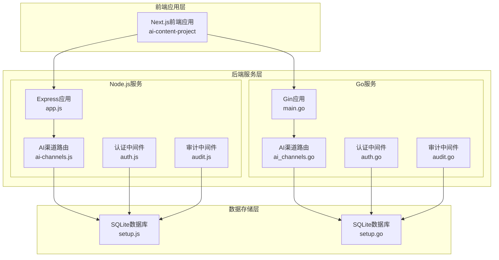
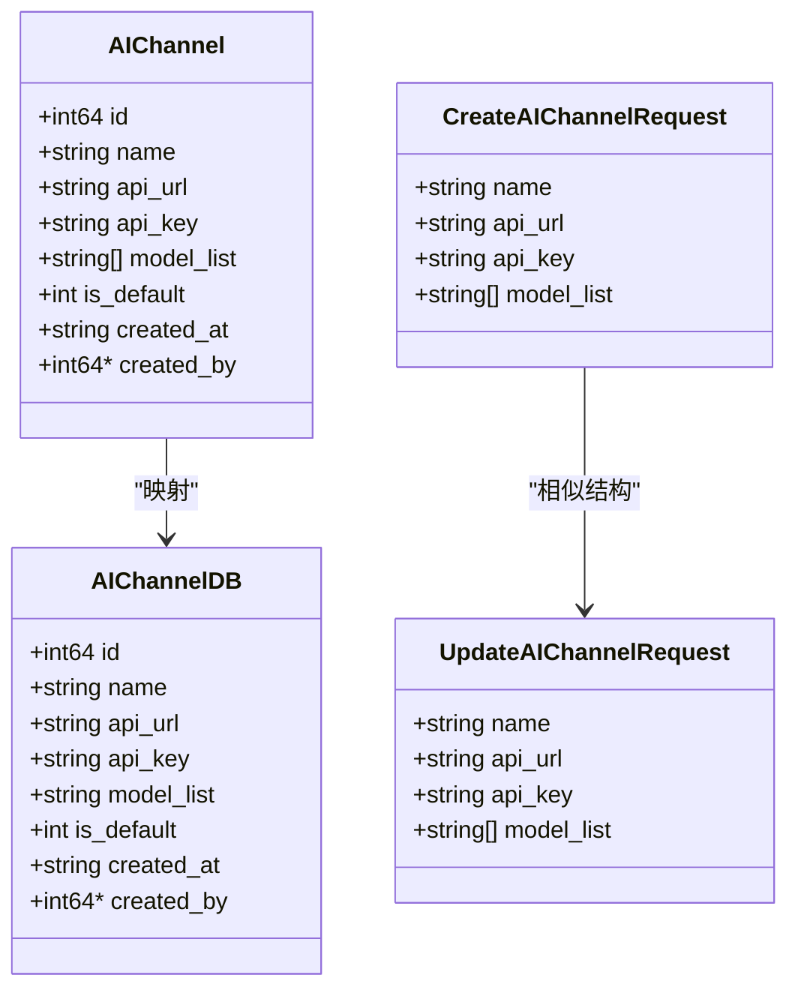
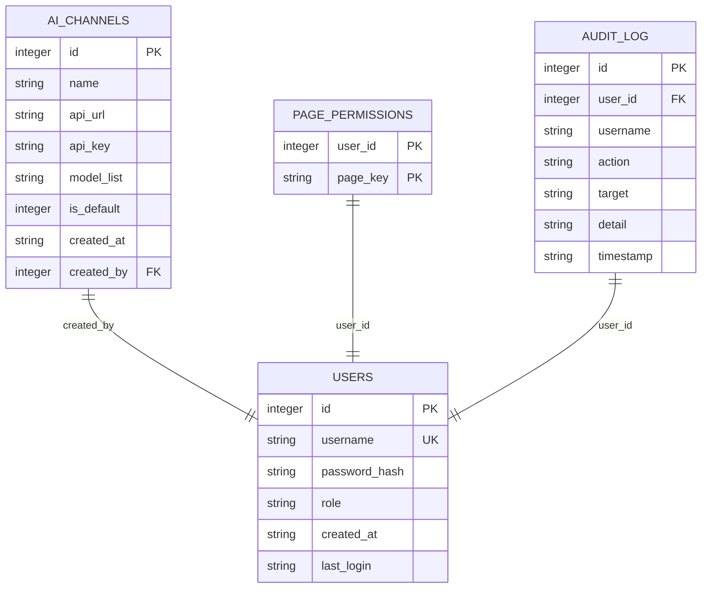
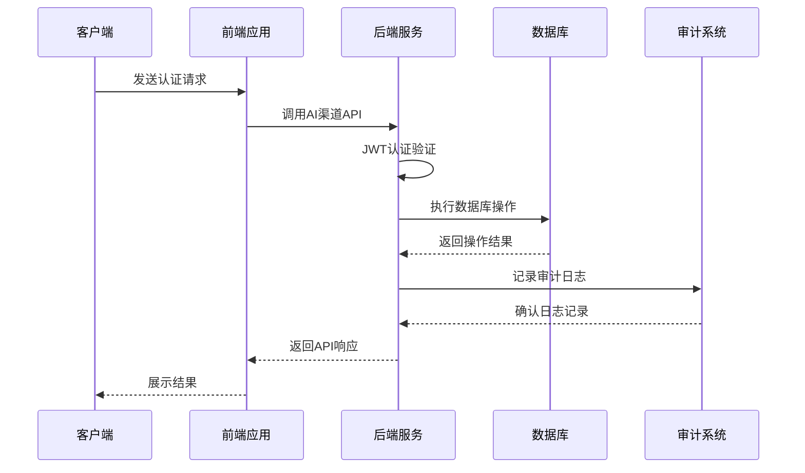
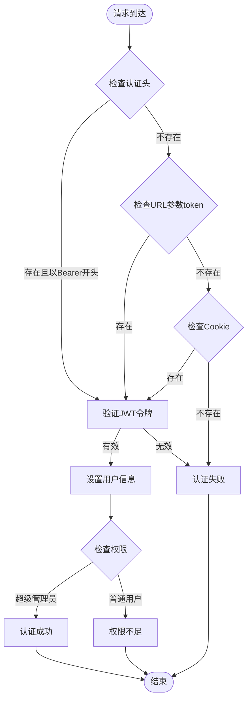
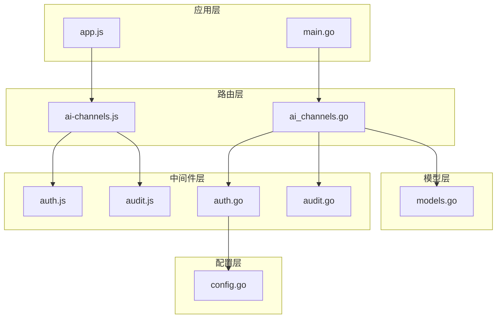

# AI渠道配置API

<cite>
**本文档引用的文件**
- [ai-channels.js](file://business-core/cms-server/routes/ai-channels.js)
- [ai_channels.go](file://business-core/cms-server-go/routes/ai_channels.go)
- [models.go](file://business-core/cms-server-go/models/models.go)
- [setup.js](file://business-core/cms-server/db/setup.js)
- [setup.go](file://business-core/cms-server-go/db/setup.go)
- [auth.js](file://business-core/cms-server/middleware/auth.js)
- [auth.go](file://business-core/cms-server-go/middleware/auth.go)
- [audit.js](file://business-core/cms-server/middleware/audit.js)
- [audit.go](file://business-core/cms-server-go/middleware/audit.go)
- [app.js](file://business-core/cms-server/app.js)
- [main.go](file://business-core/cms-server-go/main.go)
- [config.go](file://business-core/cms-server-go/config/config.go)
- [ZSTS-CMS-后端移交说明书.md](file://ZSTS-CMS-后端移交说明书.md)
</cite>

## 目录
1. [简介](#简介)
2. [项目结构](#项目结构)
3. [核心组件](#核心组件)
4. [架构概览](#架构概览)
5. [详细组件分析](#详细组件分析)
6. [依赖关系分析](#依赖关系分析)
7. [性能考虑](#性能考虑)
8. [故障排除指南](#故障排除指南)
9. [结论](#结论)

## 简介

AI渠道配置API是ZSTS-CMS系统中的核心功能模块，负责管理多个AI服务提供商的配置信息。该API支持多AI服务提供商的统一管理，包括渠道的创建、更新、删除和默认渠道设置等功能。

本API采用双栈架构设计，同时支持Node.js和Go两种实现方式，确保系统的高可用性和扩展性。通过标准化的RESTful接口，管理员可以轻松配置和管理各种AI服务提供商的接入信息。

## 项目结构

ZSTS-CMS项目采用分层架构设计，AI渠道配置API位于业务核心层，与前端应用和数据库层紧密集成。



**图表来源**
- [app.js:155-161](file://business-core/cms-server/app.js#L155-L161)
- [main.go:72-84](file://business-core/cms-server-go/main.go#L72-L84)
- [ai-channels.js:1-113](file://business-core/cms-server/routes/ai-channels.js#L1-L113)
- [ai_channels.go:17-28](file://business-core/cms-server-go/routes/ai_channels.go#L17-L28)

**章节来源**
- [app.js:1-315](file://business-core/cms-server/app.js#L1-L315)
- [main.go:1-317](file://business-core/cms-server-go/main.go#L1-L317)

## 核心组件

### 数据模型

AI渠道配置的核心数据结构定义如下：



**图表来源**
- [models.go:72-110](file://business-core/cms-server-go/models/models.go#L72-L110)

### 数据库表结构

AI渠道配置使用SQLite数据库进行持久化存储，表结构设计支持灵活的AI服务提供商管理。



**图表来源**
- [setup.js:55-68](file://business-core/cms-server/db/setup.js#L55-L68)
- [setup.go:92-108](file://business-core/cms-server-go/db/setup.go#L92-L108)

**章节来源**
- [models.go:72-110](file://business-core/cms-server-go/models/models.go#L72-L110)
- [setup.js:55-68](file://business-core/cms-server/db/setup.js#L55-L68)
- [setup.go:92-108](file://business-core/cms-server-go/db/setup.go#L92-L108)

## 架构概览

AI渠道配置API采用分层架构设计，实现了前后端分离和职责清晰的模块划分。



**图表来源**
- [auth.go:17-63](file://business-core/cms-server-go/middleware/auth.go#L17-L63)
- [audit.go:16-46](file://business-core/cms-server-go/middleware/audit.go#L16-L46)
- [ai_channels.go:30-75](file://business-core/cms-server-go/routes/ai_channels.go#L30-L75)

**章节来源**
- [auth.js:20-44](file://business-core/cms-server/middleware/auth.js#L20-L44)
- [auth.go:17-63](file://business-core/cms-server-go/middleware/auth.go#L17-L63)
- [audit.js:22-40](file://business-core/cms-server/middleware/audit.js#L22-L40)
- [audit.go:16-46](file://business-core/cms-server-go/middleware/audit.go#L16-L46)

## 详细组件分析

### API接口规范

#### 渠道列表查询

**HTTP方法**: GET  
**URL模式**: `/api/ai-channels`  
**认证要求**: 需要有效JWT令牌  
**请求参数**: 无  
**响应格式**: 
```json
[
  {
    "id": 1,
    "name": "OpenAI",
    "api_url": "https://api.openai.com/v1",
    "api_key": "",
    "model_list": ["gpt-4o", "gpt-3.5-turbo"],
    "is_default": 1,
    "created_at": "2024-01-01 12:00:00",
    "created_by": 1
  }
]
```

**章节来源**
- [ai-channels.js:25-36](file://business-core/cms-server/routes/ai-channels.js#L25-L36)
- [ai_channels.go:30-75](file://business-core/cms-server-go/routes/ai_channels.go#L30-L75)

#### 创建AI渠道

**HTTP方法**: POST  
**URL模式**: `/api/ai-channels`  
**认证要求**: 超级管理员权限  
**请求体格式**:
```json
{
  "name": "必应AI",
  "api_url": "https://api.bing.com/v1",
  "api_key": "sk-xxxxxxxx",
  "model_list": ["gpt-4o", "claude-3.5"]
}
```

**响应格式**:
```json
{
  "id": 2
}
```

**章节来源**
- [ai-channels.js:38-64](file://business-core/cms-server/routes/ai-channels.js#L38-L64)
- [ai_channels.go:77-117](file://business-core/cms-server-go/routes/ai_channels.go#L77-L117)

#### 更新AI渠道

**HTTP方法**: PUT  
**URL模式**: `/api/ai-channels/:id`  
**认证要求**: 超级管理员权限  
**路径参数**: `id` - 渠道ID  
**请求体格式**: 同创建请求体  
**响应格式**:
```json
{
  "message": "渠道已更新"
}
```

**章节来源**
- [ai-channels.js:66-89](file://business-core/cms-server/routes/ai-channels.js#L66-L89)
- [ai_channels.go:119-153](file://business-core/cms-server-go/routes/ai_channels.go#L119-L153)

#### 设为默认渠道

**HTTP方法**: PUT  
**URL模式**: `/api/ai-channels/:id/set-default`  
**认证要求**: 超级管理员权限  
**路径参数**: `id` - 渠道ID  
**请求参数**: 无  
**响应格式**:
```json
{
  "message": "默认渠道已设置"
}
```

**章节来源**
- [ai-channels.js:91-101](file://business-core/cms-server/routes/ai-channels.js#L91-L101)
- [ai_channels.go:155-173](file://business-core/cms-server-go/routes/ai_channels.go#L155-L173)

#### 删除AI渠道

**HTTP方法**: DELETE  
**URL模式**: `/api/ai-channels/:id`  
**认证要求**: 超级管理员权限  
**路径参数**: `id` - 渠道ID  
**请求参数**: 无  
**响应格式**:
```json
{
  "message": "渠道已删除"
}
```

**章节来源**
- [ai-channels.js:103-110](file://business-core/cms-server/routes/ai-channels.js#L103-L110)
- [ai_channels.go:175-190](file://business-core/cms-server-go/routes/ai_channels.go#L175-L190)

### 认证与授权机制

系统采用JWT（JSON Web Token）进行身份认证，支持多种认证方式：



**图表来源**
- [auth.js:20-44](file://business-core/cms-server/middleware/auth.js#L20-L44)
- [auth.go:134-176](file://business-core/cms-server-go/middleware/auth.go#L134-L176)

**章节来源**
- [auth.js:20-44](file://business-core/cms-server/middleware/auth.js#L20-L44)
- [auth.go:17-63](file://business-core/cms-server-go/middleware/auth.go#L17-L63)

### 审计日志系统

所有写操作都会自动记录到审计日志表中，确保操作的可追溯性：

| 操作类型 | 触发条件 | 记录内容 |
|---------|----------|----------|
| create_ai_channel | 创建AI渠道 | 渠道名称、创建者信息 |
| update_ai_channel | 更新AI渠道 | 渠道ID、更新详情 |
| set_default_ai_channel | 设置默认渠道 | 渠道ID |
| delete_ai_channel | 删除AI渠道 | 渠道ID |

**章节来源**
- [audit.js:22-40](file://business-core/cms-server/middleware/audit.js#L22-L40)
- [audit.go:16-46](file://business-core/cms-server-go/middleware/audit.go#L16-L46)

## 依赖关系分析

AI渠道配置API的依赖关系体现了清晰的分层架构：



**图表来源**
- [ai-channels.js:12-17](file://business-core/cms-server/routes/ai-channels.js#L12-L17)
- [ai_channels.go:3-14](file://business-core/cms-server-go/routes/ai_channels.go#L3-L14)
- [auth.go:17-14](file://business-core/cms-server-go/middleware/auth.go#L17-L14)
- [config.go:10-22](file://business-core/cms-server-go/config/config.go#L10-L22)

**章节来源**
- [ai-channels.js:12-17](file://business-core/cms-server/routes/ai-channels.js#L12-L17)
- [ai_channels.go:3-14](file://business-core/cms-server-go/routes/ai_channels.go#L3-L14)
- [auth.go:17-14](file://business-core/cms-server-go/middleware/auth.go#L17-L14)

## 性能考虑

### 数据库优化

1. **索引策略**: ai_channels表的id字段自动建立主键索引，支持高效的查询操作
2. **连接池**: 使用SQLite的连接复用机制，减少连接开销
3. **JSON处理**: model_list字段使用JSON字符串存储，便于灵活扩展

### 缓存机制

系统支持多级缓存策略：
- **内存缓存**: 频繁访问的渠道配置信息
- **数据库缓存**: SQLite的内置缓存机制
- **应用缓存**: 前端应用的本地存储

### 并发控制

1. **事务处理**: 所有数据库写操作使用事务保证数据一致性
2. **锁机制**: SQLite的行级锁防止并发冲突
3. **超时控制**: 合理的数据库操作超时设置

## 故障排除指南

### 常见错误及解决方案

| 错误类型 | 错误代码 | 可能原因 | 解决方案 |
|---------|----------|----------|----------|
| 认证失败 | 401 | 令牌无效或过期 | 检查JWT令牌格式和有效期 |
| 权限不足 | 403 | 非超级管理员尝试管理 | 确保用户具有超级管理员角色 |
| 参数错误 | 400 | 请求体格式不正确 | 验证name和api_url字段 |
| 数据库错误 | 500 | 数据库连接或操作失败 | 检查数据库状态和权限 |

### 调试建议

1. **启用调试模式**: 在开发环境中启用详细的日志输出
2. **检查网络连接**: 确保AI服务提供商API可达
3. **验证配置**: 检查JWT密钥和数据库配置
4. **监控性能**: 使用性能分析工具识别瓶颈

**章节来源**
- [auth.js:20-44](file://business-core/cms-server/middleware/auth.js#L20-L44)
- [auth.go:17-63](file://business-core/cms-server-go/middleware/auth.go#L17-L63)

## 结论

AI渠道配置API为ZSTS-CMS系统提供了完整的多AI服务提供商管理能力。通过标准化的RESTful接口和完善的认证授权机制，系统能够安全可靠地管理各种AI服务的接入配置。

该API的设计充分考虑了可扩展性和维护性，支持双栈架构部署，为未来的功能扩展和技术升级奠定了坚实基础。通过完善的审计日志和错误处理机制，确保了系统的可运维性和安全性。

建议在生产环境中：
1. 配置适当的JWT密钥轮换策略
2. 实施数据库备份和恢复计划
3. 部署监控和告警系统
4. 定期进行安全审计和性能优化