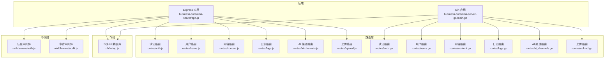
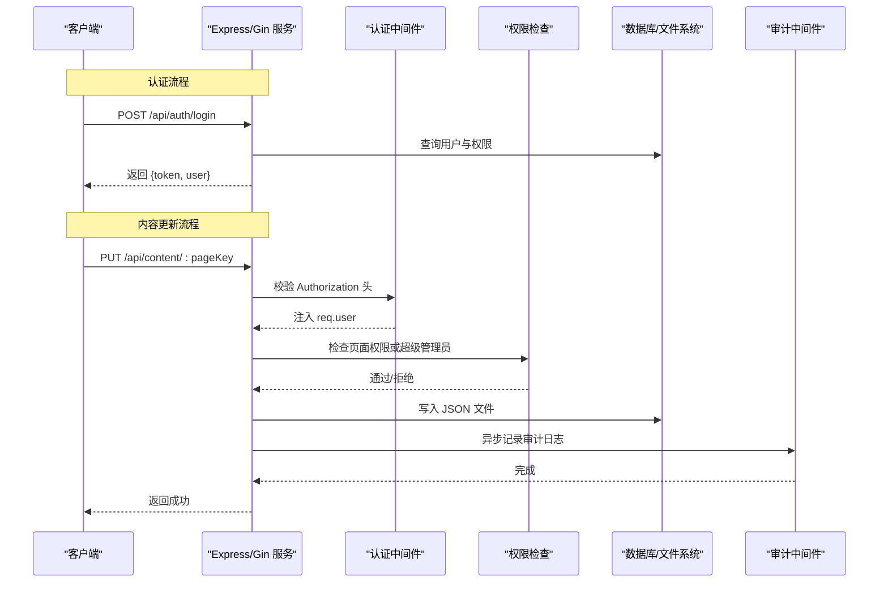
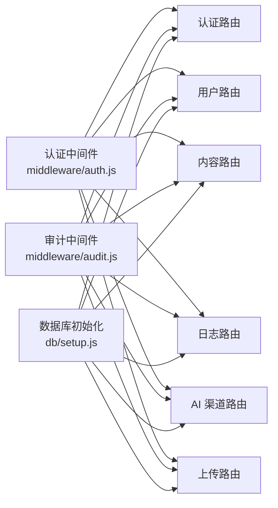

# API接口参考

<cite>
**本文引用的文件**
- [business-core/cms-server/app.js](file://business-core/cms-server/app.js)
- [business-core/cms-server/routes/auth.js](file://business-core/cms-server/routes/auth.js)
- [business-core/cms-server/routes/users.js](file://business-core/cms-server/routes/users.js)
- [business-core/cms-server/routes/content.js](file://business-core/cms-server/routes/content.js)
- [business-core/cms-server/routes/logs.js](file://business-core/cms-server/routes/logs.js)
- [business-core/cms-server/routes/ai-channels.js](file://business-core/cms-server/routes/ai-channels.js)
- [business-core/cms-server/middleware/auth.js](file://business-core/cms-server/middleware/auth.js)
- [business-core/cms-server/middleware/audit.js](file://business-core/cms-server/middleware/audit.js)
- [business-core/cms-server/db/setup.js](file://business-core/cms-server/db/setup.js)
- [business-core/cms-server-go/main.go](file://business-core/cms-server-go/main.go)
- [business-core/cms-server-go/routes/auth.go](file://business-core/cms-server-go/routes/auth.go)
- [business-core/cms-server-go/routes/users.go](file://business-core/cms-server-go/routes/users.go)
- [business-core/cms-server-go/routes/content.go](file://business-core/cms-server-go/routes/content.go)
- [business-core/cms-server-go/routes/logs.go](file://business-core/cms-server-go/routes/logs.go)
- [business-core/cms-server-go/routes/ai_channels.go](file://business-core/cms-server-go/routes/ai_channels.go)
- [business-core/cms-server-go/routes/upload.go](file://business-core/cms-server-go/routes/upload.go)
</cite>

## 目录
1. [简介](#简介)
2. [项目结构](#项目结构)
3. [核心组件](#核心组件)
4. [架构总览](#架构总览)
5. [详细组件分析](#详细组件分析)
6. [依赖分析](#依赖分析)
7. [性能考量](#性能考量)
8. [故障排查指南](#故障排查指南)
9. [结论](#结论)
10. [附录](#附录)

## 简介
本文件为 ZSTS-CMS 的 API 接口参考文档，覆盖认证、用户管理、内容管理、日志查询与 AI 渠道配置等模块。文档提供每个接口的 HTTP 方法、URL 模式、请求/响应结构、认证方式、错误处理策略、安全注意事项、版本信息与常见用例，并给出客户端实现建议与性能优化技巧。系统同时提供 Node.js 与 Go/Gin 两套后端实现，接口语义一致。

## 项目结构
- 后端实现分为两套：
  - Node.js 版本：位于 business-core/cms-server，基于 Express，提供认证、用户、内容、日志、AI 渠道、上传等路由与中间件。
  - Go/Gin 版本：位于 business-core/cms-server-go，提供与 Node.js 版本等价的路由与逻辑。
- 前端静态资源与预览模式由后端统一托管；AI 内容生成通过反向代理转发至本地服务（端口 3000）。

图表来源
- [business-core/cms-server/app.js:155-161](file://business-core/cms-server/app.js#L155-L161)
- [business-core/cms-server-go/main.go:73-84](file://business-core/cms-server-go/main.go#L73-L84)

章节来源
- [business-core/cms-server/app.js:155-161](file://business-core/cms-server/app.js#L155-L161)
- [business-core/cms-server-go/main.go:73-84](file://business-core/cms-server-go/main.go#L73-L84)

## 核心组件
- 认证与授权
  - JWT 令牌签发与校验，支持超级管理员与页面级权限。
  - 支持三种认证来源：Authorization 头、URL token、Cookie 回传。
- 审计日志
  - 对写操作进行异步审计记录，便于合规与追踪。
- 存储与持久化
  - SQLite 初始化表结构，包含用户、权限、审计日志与 AI 渠道配置。
- 静态资源与预览
  - 托管 /uploads、/local-cdn、/images 与预览页面；提供预览客户端 JS。
- AI 内容生成代理
  - 将 /ai-content* 请求转发至本地 3000 端口，注入用户身份信息与 Cookie。

章节来源
- [business-core/cms-server/middleware/auth.js:20-44](file://business-core/cms-server/middleware/auth.js#L20-L44)
- [business-core/cms-server/middleware/audit.js:22-40](file://business-core/cms-server/middleware/audit.js#L22-L40)
- [business-core/cms-server/db/setup.js:14-108](file://business-core/cms-server/db/setup.js#L14-L108)
- [business-core/cms-server/app.js:163-225](file://business-core/cms-server/app.js#L163-L225)

## 架构总览
以下序列图展示典型认证流程与内容更新流程，涵盖请求头、JWT 校验、权限检查与审计记录。

图表来源
- [business-core/cms-server/routes/auth.js:22-66](file://business-core/cms-server/routes/auth.js#L22-L66)
- [business-core/cms-server/routes/content.js:68-101](file://business-core/cms-server/routes/content.js#L68-L101)
- [business-core/cms-server/middleware/auth.js:20-44](file://business-core/cms-server/middleware/auth.js#L20-L44)
- [business-core/cms-server/middleware/audit.js:22-40](file://business-core/cms-server/middleware/audit.js#L22-L40)

## 详细组件分析

### 认证 API
- 基础信息
  - 基础路径：/api/auth
  - 认证方式：Bearer Token（Authorization 头）
  - 令牌有效期：7 天
- 接口定义
  - POST /api/auth/login
    - 请求体：{ username, password }
    - 成功响应：{ token, user: { id, username, role, permissions[], created_at, last_login } }
    - 失败响应：用户名或密码错误、参数缺失
  - GET /api/auth/me
    - 请求头：Authorization: Bearer <token>
    - 成功响应：用户信息（含权限列表）
    - 失败响应：未认证、令牌格式错误、令牌失效
- 安全与错误
  - 使用 JWT 校验；失败返回 401；必要字段缺失返回 400。
  - 审计日志记录登录行为。

章节来源
- [business-core/cms-server/routes/auth.js:22-96](file://business-core/cms-server/routes/auth.js#L22-L96)
- [business-core/cms-server-go/routes/auth.go:27-104](file://business-core/cms-server-go/routes/auth.go#L27-L104)

### 用户管理 API
- 基础信息
  - 基础路径：/api/users
  - 访问要求：仅超级管理员
- 接口定义
  - GET /api/users
    - 响应：用户列表，包含每个用户的权限数组
  - POST /api/users
    - 请求体：{ username, password, role(editor/super_admin), permissions[] }
    - 成功响应：{ id, username, role }
    - 失败响应：用户名冲突、角色非法、参数缺失
  - PUT /api/users/:id
    - 请求体：{ password }
    - 成功响应：{ message }
    - 失败响应：密码长度不足
  - PUT /api/users/:id/permissions
    - 请求体：{ permissions[] }
    - 成功响应：{ message }
  - DELETE /api/users/:id
    - 成功响应：{ message }
    - 失败响应：不能删除自己
- 审计与错误
  - 涉及写操作均记录审计日志；唯一约束冲突返回 409。

章节来源
- [business-core/cms-server/routes/users.js:26-151](file://business-core/cms-server/routes/users.js#L26-L151)
- [business-core/cms-server-go/routes/users.go:31-248](file://business-core/cms-server-go/routes/users.go#L31-L248)

### 内容管理 API
- 基础信息
  - 基础路径：/api/content
  - 访问要求：读取无需认证；写入需认证并通过页面权限或超级管理员
  - 支持页面键：home, about, visa, saudi-visa, enterprise, transport, insurance, inspection
  - 全局配置键：nav, footer, consultation
- 接口定义
  - GET /api/content/:pageKey
    - 成功响应：页面 JSON 或空对象
    - 失败响应：无效 pageKey
  - PUT /api/content/:pageKey
    - 请求体：任意 JSON
    - 成功响应：{ message }
    - 失败响应：权限不足、写入失败、无效 pageKey
- 审计与错误
  - 写入成功后记录审计日志；权限不足返回 403。

章节来源
- [business-core/cms-server/routes/content.js:48-101](file://business-core/cms-server/routes/content.js#L48-L101)
- [business-core/cms-server-go/routes/content.go:80-157](file://business-core/cms-server-go/routes/content.go#L80-L157)

### 日志查询 API
- 基础信息
  - 基础路径：/api/logs
  - 访问要求：需认证；清空日志需超级管理员
- 接口定义
  - GET /api/logs?page=1&limit=50&action=&username=&start_date=&end_date=
    - 成功响应：{ total, page, limit, rows[] }
  - DELETE /api/logs
    - 成功响应：{ message }
- 审计与错误
  - 查询使用模糊过滤；清空日志记录审计日志。

章节来源
- [business-core/cms-server/routes/logs.js:20-56](file://business-core/cms-server/routes/logs.js#L20-L56)
- [business-core/cms-server-go/routes/logs.go:26-114](file://business-core/cms-server-go/routes/logs.go#L26-L114)

### AI 渠道配置 API
- 基础信息
  - 基础路径：/api/ai-channels
  - 访问要求：列表与更新需认证；新建/设默认/删除需超级管理员
- 接口定义
  - GET /api/ai-channels
    - 成功响应：渠道列表（model_list 解析为数组）
  - POST /api/ai-channels
    - 请求体：{ name, api_url, api_key, model_list[] }
    - 成功响应：{ id }
  - PUT /api/ai-channels/:id
    - 请求体：{ name, api_url, api_key, model_list[] }
    - 成功响应：{ message }
  - PUT /api/ai-channels/:id/set-default
    - 成功响应：{ message }
  - DELETE /api/ai-channels/:id
    - 成功响应：{ message }
- 审计与错误
  - 涉及写操作记录审计日志。

章节来源
- [business-core/cms-server/routes/ai-channels.js:25-110](file://business-core/cms-server/routes/ai-channels.js#L25-L110)
- [business-core/cms-server-go/routes/ai_channels.go:30-190](file://business-core/cms-server-go/routes/ai_channels.go#L30-L190)

### 上传 API（图片）
- 基础信息
  - 基础路径：/api/upload
  - 访问要求：需认证
  - 文件大小限制：5MB
  - 支持格式：jpg, jpeg, png, gif, webp, svg
- 接口定义
  - POST /api/upload
    - 表单字段：file
    - 成功响应：{ url, filename, size }
    - 失败响应：未选择文件、格式不支持、大小超限、保存失败
- 静态资源
  - 上传文件可通过 /uploads/images/<filename> 访问。

章节来源
- [business-core/cms-server/app.js:46-53](file://business-core/cms-server/app.js#L46-L53)
- [business-core/cms-server-go/routes/upload.go:27-75](file://business-core/cms-server-go/routes/upload.go#L27-L75)

### 预览与页面快照
- 预览页面
  - GET /preview/*
  - 功能：托管前端 HTML，注入预览脚本与资源路径修复，禁用缓存。
- 页面快照
  - GET /api/page-snapshot/:pageKey
  - 功能：从 HTML 中抽取 data-i18n 的文本与图片资源，返回快照对象。

章节来源
- [business-core/cms-server/app.js:104-153](file://business-core/cms-server/app.js#L104-L153)
- [business-core/cms-server/app.js:233-299](file://business-core/cms-server/app.js#L233-L299)
- [business-core/cms-server-go/main.go:146-207](file://business-core/cms-server-go/main.go#L146-L207)
- [business-core/cms-server-go/routes/content.go:213-297](file://business-core/cms-server-go/routes/content.go#L213-L297)

### AI 内容生成代理
- 路径：/ai-content*
- 认证来源：Authorization 头、URL token、Cookie 回传
- 代理行为：将请求转发至 http://localhost:3000，注入 X-CMS-User、X-CMS-Role 与 Cookie。
- 用途：在 iframe 场景下为 AI 生成服务提供 CMS 身份上下文。

章节来源
- [business-core/cms-server/app.js:163-225](file://business-core/cms-server/app.js#L163-L225)
- [business-core/cms-server-go/main.go:209-289](file://business-core/cms-server-go/main.go#L209-L289)

## 依赖分析
- 认证中间件
  - Express：requireAuth、requireSuperAdmin、requirePagePerm
  - Gin：RequireAuth、RequireSuperAdmin、RequirePagePerm
- 审计中间件
  - Express：audit、auditMiddleware
  - Gin：Audit（在各路由中调用）
- 数据库初始化
  - users、page_permissions、audit_log、ai_channels 表
  - 默认超级管理员与权限初始化

图表来源
- [business-core/cms-server/middleware/auth.js:20-63](file://business-core/cms-server/middleware/auth.js#L20-L63)
- [business-core/cms-server/middleware/audit.js:22-40](file://business-core/cms-server/middleware/audit.js#L22-L40)
- [business-core/cms-server/db/setup.js:14-108](file://business-core/cms-server/db/setup.js#L14-L108)

章节来源
- [business-core/cms-server/middleware/auth.js:20-63](file://business-core/cms-server/middleware/auth.js#L20-L63)
- [business-core/cms-server/middleware/audit.js:22-40](file://business-core/cms-server/middleware/audit.js#L22-L40)
- [business-core/cms-server/db/setup.js:14-108](file://business-core/cms-server/db/setup.js#L14-L108)

## 性能考量
- 请求体大小限制
  - Express：JSON 与 URL 编码最大 10MB；文件上传 5MB。
  - Gin：MaxMultipartMemory 10MB。
- 静态资源
  - 上传文件与 CDN 资源通过静态中间件提供，建议配合反向代理启用缓存与压缩。
- 审计日志
  - Express 使用异步写入避免阻塞主请求路径。
- 并发与事务
  - 用户权限批量写入采用事务提交，减少锁竞争与一致性风险。
- 建议
  - 生产环境启用 HTTPS、CORS 白名单、速率限制与请求频率监控。
  - 对频繁读取的内容接口增加缓存层（如内存缓存或 CDN）。

章节来源
- [business-core/cms-server/app.js:20-22](file://business-core/cms-server/app.js#L20-L22)
- [business-core/cms-server-go/main.go:48-49](file://business-core/cms-server-go/main.go#L48-L49)
- [business-core/cms-server/middleware/audit.js:46-72](file://business-core/cms-server/middleware/audit.js#L46-L72)
- [business-core/cms-server/routes/users.js:69-73](file://business-core/cms-server/routes/users.js#L69-L73)
- [business-core/cms-server-go/routes/users.go:121-128](file://business-core/cms-server-go/routes/users.go#L121-L128)

## 故障排查指南
- 认证失败
  - 检查 Authorization 头格式与令牌有效性；确认 JWT_SECRET 配置一致。
- 权限不足
  - 确认用户角色与页面权限映射；超级管理员可绕过页面权限。
- 数据库问题
  - 确认 db/setup.js 初始化是否执行；检查表结构与索引。
- 审计日志异常
  - 检查审计中间件是否生效；关注异步写入错误。
- 上传失败
  - 检查文件大小与格式限制；确认上传目录权限与磁盘空间。
- AI 代理
  - 确认 /ai-content* 路由是否命中代理；核对 JWT 校验与 Cookie 注入。

章节来源
- [business-core/cms-server/middleware/auth.js:20-44](file://business-core/cms-server/middleware/auth.js#L20-L44)
- [business-core/cms-server/middleware/audit.js:22-40](file://business-core/cms-server/middleware/audit.js#L22-L40)
- [business-core/cms-server/db/setup.js:14-108](file://business-core/cms-server/db/setup.js#L14-L108)
- [business-core/cms-server/app.js:46-53](file://business-core/cms-server/app.js#L46-L53)
- [business-core/cms-server/app.js:163-225](file://business-core/cms-server/app.js#L163-L225)

## 结论
本参考文档梳理了 ZSTS-CMS 的全部 RESTful API，明确了认证、授权、数据流与审计机制。两套后端实现（Node.js 与 Go/Gin）在接口层面保持一致，便于按团队技术栈选择部署。建议在生产环境中强化安全与性能措施，并结合审计日志建立完善的运维与合规体系。

## 附录
- 版本信息
  - 令牌有效期：7 天
  - 默认超级管理员：admin / admin123（首次登录后请立即修改）
- 常见用例
  - 管理员登录后批量为编辑者分配页面权限
  - 编辑者通过 /api/content/:pageKey 更新页面 JSON
  - 查看操作日志并按时间段筛选
  - 配置 AI 渠道并设为默认
- 客户端实现建议
  - 统一在请求头添加 Authorization: Bearer <token>
  - 对写操作增加幂等键与重试退避
  - 对大文件上传采用分片与断点续传（如需）
- 调试与监控
  - 使用浏览器开发者工具与网络面板观察请求/响应
  - 后端日志输出与审计日志联动定位问题
  - 建议接入 APM 工具与告警策略