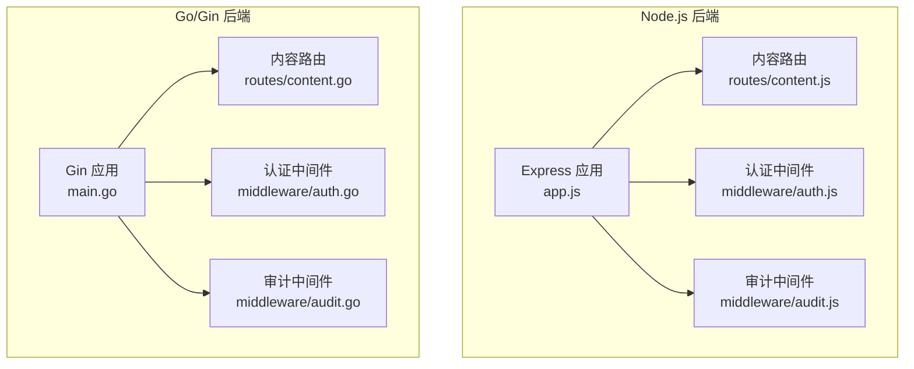
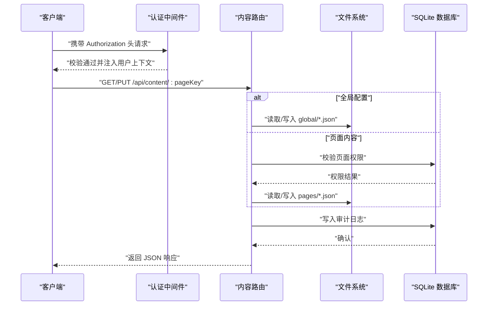
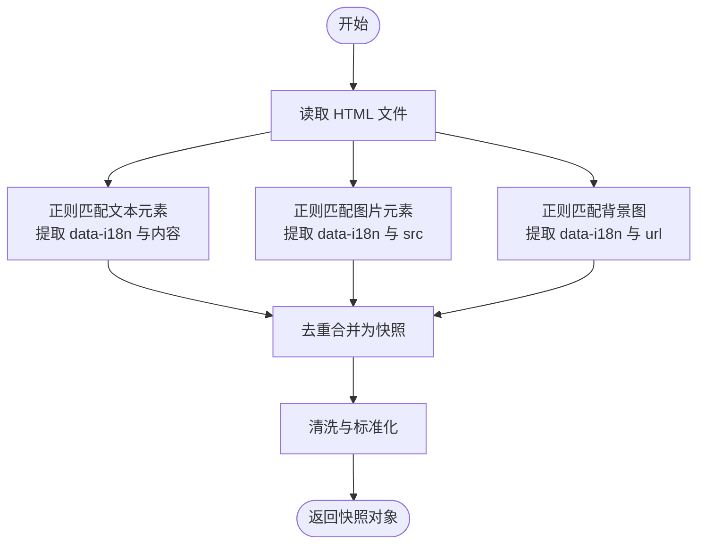
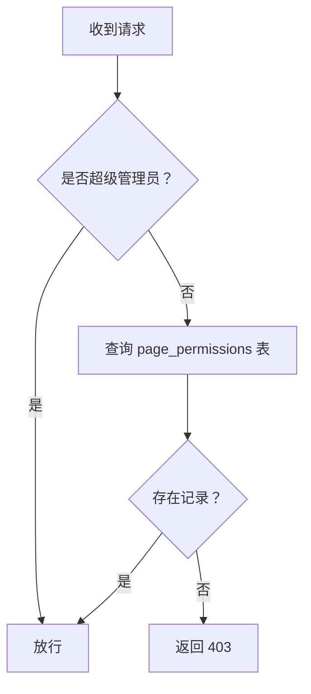
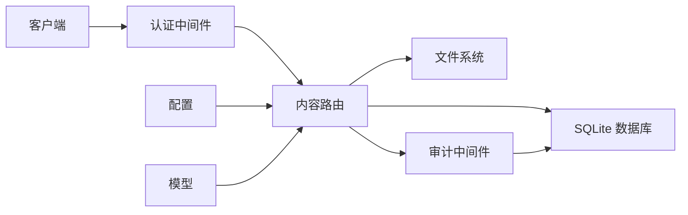

# 内容管理API

<cite>
**本文引用的文件**
- [business-core/cms-server/routes/content.js](file://business-core/cms-server/routes/content.js)
- [business-core/cms-server-go/routes/content.go](file://business-core/cms-server-go/routes/content.go)
- [business-core/cms-server/app.js](file://business-core/cms-server/app.js)
- [business-core/cms-server-go/main.go](file://business-core/cms-server-go/main.go)
- [business-core/cms-server/middleware/auth.js](file://business-core/cms-server/middleware/auth.js)
- [business-core/cms-server-go/middleware/auth.go](file://business-core/cms-server-go/middleware/auth.go)
- [business-core/cms-server/db/setup.js](file://business-core/cms-server/db/setup.js)
- [business-core/cms-server-go/db/setup.go](file://business-core/cms-server-go/db/setup.go)
- [business-core/cms-server/routes/users.js](file://business-core/cms-server/routes/users.js)
- [business-core/cms-server-go/routes/users.go](file://business-core/cms-server-go/routes/users.go)
- [business-core/cms-server/middleware/audit.js](file://business-core/cms-server/middleware/audit.js)
- [business-core/cms-server-go/middleware/audit.go](file://business-core/cms-server-go/middleware/audit.go)
- [business-core/cms-server-go/config/config.go](file://business-core/cms-server-go/config/config.go)
- [business-core/cms-server-go/models/models.go](file://business-core/cms-server-go/models/models.go)
</cite>

## 目录
1. [简介](#简介)
2. [项目结构](#项目结构)
3. [核心组件](#核心组件)
4. [架构总览](#架构总览)
5. [详细组件分析](#详细组件分析)
6. [依赖分析](#依赖分析)
7. [性能考虑](#性能考虑)
8. [故障排查指南](#故障排查指南)
9. [结论](#结论)
10. [附录](#附录)

## 简介
本文件为 ZSTS-CMS 内容管理API的权威技术文档，覆盖页面内容读取、更新与删除等核心能力，明确HTTP方法、URL模式、请求参数、响应格式与权限控制；同时涵盖多语言内容支持、内容版本管理、页面权限控制、批量内容操作、内容编辑流程示例、数据验证规则、内容同步机制、缓存策略、性能优化与数据备份恢复建议。文档面向前后端开发者与运维人员，既提供高层概览也包含代码级映射与可视化图示。

## 项目结构
ZSTS-CMS 后端采用双栈实现：
- Node.js 版本：基于 Express，提供内容管理、用户管理、日志审计、AI代理等功能。
- Go/Gin 版本：提供与 Node 版本一致的功能集，增强并发与稳定性。

内容管理API位于两个版本的路由层，分别处理页面内容的读取与更新，并通过中间件实现认证与审计。

**图表来源**
- [business-core/cms-server/app.js:155-161](file://business-core/cms-server/app.js#L155-L161)
- [business-core/cms-server/routes/content.js:12-104](file://business-core/cms-server/routes/content.js#L12-L104)
- [business-core/cms-server/middleware/auth.js:20-44](file://business-core/cms-server/middleware/auth.js#L20-L44)
- [business-core/cms-server/middleware/audit.js:22-40](file://business-core/cms-server/middleware/audit.js#L22-L40)
- [business-core/cms-server-go/main.go:72-84](file://business-core/cms-server-go/main.go#L72-L84)
- [business-core/cms-server-go/routes/content.go:29-36](file://business-core/cms-server-go/routes/content.go#L29-L36)
- [business-core/cms-server-go/middleware/auth.go:17-63](file://business-core/cms-server-go/middleware/auth.go#L17-L63)
- [business-core/cms-server-go/middleware/audit.go:16-46](file://business-core/cms-server-go/middleware/audit.go#L16-L46)

**章节来源**
- [business-core/cms-server/app.js:155-161](file://business-core/cms-server/app.js#L155-L161)
- [business-core/cms-server-go/main.go:72-84](file://business-core/cms-server-go/main.go#L72-L84)

## 核心组件
- 内容路由：负责页面内容的读取与更新，区分“全局配置”与“页面内容”，并按权限控制访问。
- 认证中间件：统一校验 JWT，注入用户上下文，支持超级管理员与页面权限校验。
- 审计中间件：记录写操作行为，便于合规与追踪。
- 数据库初始化：创建用户、页面权限、审计日志等表，内置默认超级管理员账号。
- 配置与模型：集中管理运行时配置与通用数据模型。

**章节来源**
- [business-core/cms-server/routes/content.js:48-101](file://business-core/cms-server/routes/content.js#L48-L101)
- [business-core/cms-server-go/routes/content.go:80-157](file://business-core/cms-server-go/routes/content.go#L80-L157)
- [business-core/cms-server/middleware/auth.js:20-63](file://business-core/cms-server/middleware/auth.js#L20-L63)
- [business-core/cms-server-go/middleware/auth.go:17-132](file://business-core/cms-server-go/middleware/auth.go#L17-L132)
- [business-core/cms-server/middleware/audit.js:22-40](file://business-core/cms-server/middleware/audit.js#L22-L40)
- [business-core/cms-server-go/middleware/audit.go:16-46](file://business-core/cms-server-go/middleware/audit.go#L16-L46)
- [business-core/cms-server/db/setup.js:14-108](file://business-core/cms-server/db/setup.js#L14-L108)
- [business-core/cms-server-go/db/setup.go:18-175](file://business-core/cms-server-go/db/setup.go#L18-L175)
- [business-core/cms-server-go/config/config.go:26-57](file://business-core/cms-server-go/config/config.go#L26-L57)
- [business-core/cms-server-go/models/models.go:103-145](file://business-core/cms-server-go/models/models.go#L103-L145)

## 架构总览
内容管理API在两个后端版本中保持一致的职责边界与交互流程：请求经由认证中间件校验后进入内容路由，根据pageKey判断是全局配置还是页面内容，执行读取或更新操作，并写入审计日志。

**图表来源**
- [business-core/cms-server/routes/content.js:48-101](file://business-core/cms-server/routes/content.js#L48-L101)
- [business-core/cms-server-go/routes/content.go:80-157](file://business-core/cms-server-go/routes/content.go#L80-L157)
- [business-core/cms-server/middleware/auth.js:20-44](file://business-core/cms-server/middleware/auth.js#L20-L44)
- [business-core/cms-server-go/middleware/auth.go:17-63](file://business-core/cms-server-go/middleware/auth.go#L17-L63)
- [business-core/cms-server/middleware/audit.js:22-40](file://business-core/cms-server/middleware/audit.js#L22-L40)
- [business-core/cms-server-go/middleware/audit.go:16-46](file://business-core/cms-server-go/middleware/audit.go#L16-L46)

## 详细组件分析

### 接口规范：内容读取与更新

- 基础地址
  - Node.js：http://localhost:3001/api
  - Go/Gin：http://localhost:3001/api

- 支持的 pageKey 列表
  - 页面类：home、about、visa、saudi-visa、enterprise、transport、insurance、inspection
  - 全局类：nav、footer、consultation（仅超级管理员可写）

- 读取接口
  - 方法：GET
  - 路径：/api/content/:pageKey
  - 权限：匿名可访问（预览模式需要）
  - 请求参数：路径参数 pageKey
  - 响应：JSON 对象（若文件不存在返回空对象）
  - 示例：GET /api/content/home

- 更新接口
  - 方法：PUT
  - 路径：/api/content/:pageKey
  - 权限：
    - 全局配置 nav/footer/consultation：仅超级管理员
    - 页面内容：普通编辑者需具备对应页面权限
  - 请求头：Authorization: Bearer <token>
  - 请求体：任意 JSON 结构（由业务决定字段）
  - 响应：成功返回消息，失败返回错误信息
  - 示例：PUT /api/content/about

- 错误码约定
  - 400：无效的 pageKey
  - 401：未提供/令牌无效
  - 403：无权限
  - 500：写入失败

**章节来源**
- [business-core/cms-server/routes/content.js:4-10](file://business-core/cms-server/routes/content.js#L4-L10)
- [business-core/cms-server/routes/content.js:48-65](file://business-core/cms-server/routes/content.js#L48-L65)
- [business-core/cms-server/routes/content.js:67-101](file://business-core/cms-server/routes/content.js#L67-L101)
- [business-core/cms-server-go/routes/content.go:22-27](file://business-core/cms-server-go/routes/content.go#L22-L27)
- [business-core/cms-server-go/routes/content.go:80-108](file://business-core/cms-server-go/routes/content.go#L80-L108)
- [business-core/cms-server-go/routes/content.go:110-157](file://business-core/cms-server-go/routes/content.go#L110-L157)

### 多语言内容支持
- 页面快照接口
  - 方法：GET
  - 路径：/api/page-snapshot/:pageKey
  - 功能：从 HTML 中抽取带 data-i18n 的文本与图片资源，生成初始快照（包含 zh/en 字段占位）
  - 响应：包含 htmlFile、count、snapshot 的结构化对象
  - 用途：编辑器首次回显默认值，支持后续多语言填充

- HTML 解析规则
  - 文本元素：<span/div/p/h1-h6 ... data-i18n="key">内容</tag>
  - 图片元素：
  - 背景图：支持 style="background-image:url(...)" 与内联样式
  - 清洗：去除HTML标签、替换实体字符、规范化换行

- 与内容存储的关系
  - 页面内容 JSON 通常包含多语言字段（如 zh/en），页面快照作为初始填充来源
  - 更新内容时，应保持 key 的一致性，避免破坏翻译映射

**图表来源**
- [business-core/cms-server/app.js:233-299](file://business-core/cms-server/app.js#L233-L299)
- [business-core/cms-server-go/routes/content.go:213-274](file://business-core/cms-server-go/routes/content.go#L213-L274)
- [business-core/cms-server-go/routes/content.go:276-297](file://business-core/cms-server-go/routes/content.go#L276-L297)

**章节来源**
- [business-core/cms-server/app.js:233-299](file://business-core/cms-server/app.js#L233-L299)
- [business-core/cms-server-go/routes/content.go:213-274](file://business-core/cms-server-go/routes/content.go#L213-L274)

### 内容版本管理
- 设计建议
  - 采用“内容快照 + 审计日志”的组合方案：每次更新写入新版本文件并在审计日志记录变更详情
  - 使用 JSON 文件作为版本载体，保留历史版本以便回滚
  - 为每个 pageKey 维护独立的版本目录，命名规则如：pages/<pageKey>/vYYYYMMDD_HHMMSS.json
- 实施要点
  - 更新接口在写入新内容前先读取现有内容，比较差异并记录到审计日志
  - 提供版本列表查询与指定版本回滚接口（建议新增）

[本节为概念性建议，不直接分析具体文件]

### 页面权限控制
- 角色与权限
  - 超级管理员：拥有所有页面权限与全局配置写入权
  - 普通编辑者：仅能编辑被授权的页面
- 权限判定流程
  - 若用户为超级管理员，直接放行
  - 否则查询 page_permissions 表，确认 user_id 与 page_key 的关联是否存在
- 审计与合规
  - 所有写操作均记录到 audit_log，便于追溯

**图表来源**
- [business-core/cms-server/middleware/auth.js:37-63](file://business-core/cms-server/middleware/auth.js#L37-L63)
- [business-core/cms-server-go/middleware/auth.go:65-132](file://business-core/cms-server-go/middleware/auth.go#L65-L132)
- [business-core/cms-server/db/setup.js:31-40](file://business-core/cms-server/db/setup.js#L31-L40)
- [business-core/cms-server-go/db/setup.go:62-70](file://business-core/cms-server-go/db/setup.go#L62-L70)

**章节来源**
- [business-core/cms-server/middleware/auth.js:37-63](file://business-core/cms-server/middleware/auth.js#L37-L63)
- [business-core/cms-server-go/middleware/auth.go:65-132](file://business-core/cms-server-go/middleware/auth.go#L65-L132)
- [business-core/cms-server/db/setup.js:31-40](file://business-core/cms-server/db/setup.js#L31-L40)
- [business-core/cms-server-go/db/setup.go:62-70](file://business-core/cms-server-go/db/setup.go#L62-L70)

### 批量内容操作
- 建议方案
  - 扩展内容路由：新增 /api/content/batch 接口，支持批量读取与批量更新
  - 批量读取：接收 pageKey 数组，返回各页面内容的聚合对象
  - 批量更新：接收 {pageKey: content} 映射，逐项校验权限与写入，事务提交或回滚
- 数据一致性
  - 使用数据库事务保证多页面更新的一致性
  - 审计日志按页面粒度记录，便于定位问题

[本节为概念性建议，不直接分析具体文件]

### 内容编辑流程示例
- 步骤
  1) 获取页面快照：GET /api/page-snapshot/:pageKey，得到初始多语言占位
  2) 编辑内容：PUT /api/content/:pageKey，携带 JSON 内容
  3) 审计与回滚：查看 /api/logs，必要时回滚到历史版本
- 注意事项
  - 保持 data-i18n key 的稳定性
  - 更新前先读取当前内容，避免覆盖未感知的改动

**章节来源**
- [business-core/cms-server/app.js:233-299](file://business-core/cms-server/app.js#L233-L299)
- [business-core/cms-server-go/routes/content.go:80-157](file://business-core/cms-server-go/routes/content.go#L80-L157)

### 数据验证规则
- 请求体绑定
  - Go 版本：使用 ShouldBindJSON 对请求体进行结构化绑定
  - Node 版本：使用 express.json 解析请求体
- 错误处理
  - 请求体格式错误返回 400
  - 写入失败返回 500
- 建议补充
  - 针对 pageKey 与权限进行显式校验
  - 对 JSON 结构进行白名单/必填字段校验

**章节来源**
- [business-core/cms-server-go/routes/content.go:116-120](file://business-core/cms-server-go/routes/content.go#L116-L120)
- [business-core/cms-server/routes/content.js:94-100](file://business-core/cms-server/routes/content.js#L94-L100)

### 内容同步机制
- 方案一：文件系统同步
  - 本地开发：直接写入 pages/global 目录
  - 生产部署：通过 CI/CD 将内容文件同步至目标服务器
- 方案二：数据库驱动同步
  - 将内容存储于数据库，结合审计日志实现跨节点同步
  - 适用于高可用与分布式场景

[本节为概念性建议，不直接分析具体文件]

### 缓存策略
- 预览模式
  - /preview/* 返回的 HTML 禁用缓存，确保预览实时性
  - 预览客户端 JS v4 禁用缓存，强制加载最新版本
- 内容读取
  - GET /api/content/:pageKey 未设置缓存头，适合频繁更新场景
- 建议
  - 对静态资源（/uploads、/images、/local-cdn）设置合理缓存策略
  - 对内容读取接口可引入 ETag/Last-Modified 以减少重复传输

**章节来源**
- [business-core/cms-server/app.js:64-101](file://business-core/cms-server/app.js#L64-L101)
- [business-core/cms-server-go/main.go:65-70](file://business-core/cms-server-go/main.go#L65-L70)
- [business-core/cms-server-go/main.go:131-144](file://business-core/cms-server-go/main.go#L131-L144)

### 性能优化
- 请求体大小限制
  - Express：默认 10MB
  - Gin：MaxMultipartMemory 10MB
- 并发与稳定性
  - Go/Gin 版本具备更好的并发性能与内存占用
- I/O 优化
  - JSON 文件读写采用同步方式，建议在高并发场景引入文件锁或队列
- 建议
  - 对热点页面内容引入内存缓存（LRU）
  - 对批量更新使用事务与批处理

**章节来源**
- [business-core/cms-server/app.js:20-22](file://business-core/cms-server/app.js#L20-L22)
- [business-core/cms-server-go/main.go:48-49](file://business-core/cms-server-go/main.go#L48-L49)

### 数据备份与恢复
- 备份范围
  - SQLite 数据库文件（cms.db）
  - JSON 内容文件（pages/*.json、global/*.json）
- 备份策略
  - 定期导出数据库（.dump/.backup）
  - 备份内容 JSON 文件与审计日志
- 恢复步骤
  - 恢复数据库与内容文件
  - 校验 page_permissions 与用户状态
  - 重新初始化默认管理员（如需）

**章节来源**
- [business-core/cms-server/db/setup.js:14-108](file://business-core/cms-server/db/setup.js#L14-L108)
- [business-core/cms-server-go/db/setup.go:18-175](file://business-core/cms-server-go/db/setup.go#L18-L175)

## 依赖分析
- 认证链路
  - 客户端 → 认证中间件 → 内容路由 → 数据库/文件系统
- 审计链路
  - 内容路由 → 审计中间件 → 数据库
- 配置与模型
  - 配置文件集中管理路径与密钥
  - 模型定义统一用户、权限、日志等数据结构

**图表来源**
- [business-core/cms-server/middleware/auth.js:20-44](file://business-core/cms-server/middleware/auth.js#L20-L44)
- [business-core/cms-server-go/middleware/auth.go:17-63](file://business-core/cms-server-go/middleware/auth.go#L17-L63)
- [business-core/cms-server-go/config/config.go:26-57](file://business-core/cms-server-go/config/config.go#L26-L57)
- [business-core/cms-server-go/models/models.go:103-145](file://business-core/cms-server-go/models/models.go#L103-L145)

**章节来源**
- [business-core/cms-server/middleware/audit.js:22-40](file://business-core/cms-server/middleware/audit.js#L22-L40)
- [business-core/cms-server-go/middleware/audit.go:16-46](file://business-core/cms-server-go/middleware/audit.go#L16-L46)

## 性能考虑
- 并发与吞吐
  - Go/Gin 版本在高并发场景表现更优
- I/O 与缓存
  - 预览模式禁用缓存确保实时性
  - 建议对热点内容引入内存缓存
- 存储与索引
  - page_permissions 表为主键联合索引，查询效率较高
- 建议
  - 对批量更新使用事务与批处理
  - 对静态资源设置合理的缓存策略

[本节提供一般性指导，不直接分析具体文件]

## 故障排查指南
- 常见问题
  - 401 未提供/令牌无效：检查 Authorization 头格式与签名
  - 403 无权限：确认用户角色与 page_permissions
  - 400 无效 pageKey：确认 pageKey 是否在允许列表
  - 500 写入失败：检查磁盘空间与文件权限
- 审计日志
  - 通过 /api/logs 查看最近写操作记录，定位异常
- 数据库初始化
  - 如缺失表或默认管理员，运行数据库初始化脚本

**章节来源**
- [business-core/cms-server/middleware/auth.js:20-44](file://business-core/cms-server/middleware/auth.js#L20-L44)
- [business-core/cms-server-go/middleware/auth.go:17-63](file://business-core/cms-server-go/middleware/auth.go#L17-L63)
- [business-core/cms-server/middleware/audit.js:22-40](file://business-core/cms-server/middleware/audit.js#L22-L40)
- [business-core/cms-server-go/middleware/audit.go:16-46](file://business-core/cms-server-go/middleware/audit.go#L16-L46)
- [business-core/cms-server/db/setup.js:14-108](file://business-core/cms-server/db/setup.js#L14-L108)
- [business-core/cms-server-go/db/setup.go:18-175](file://business-core/cms-server-go/db/setup.go#L18-L175)

## 结论
ZSTS-CMS 内容管理API在两个后端版本中实现了统一的职责边界与一致的权限控制。通过页面快照、多语言占位与审计日志，满足了内容编辑、版本追踪与合规需求。建议在生产环境中引入缓存、事务批处理与数据库驱动的同步方案，以进一步提升性能与可靠性。

## 附录
- 关键配置项
  - PORT、JWT_SECRET、DB_PATH、UPLOAD_DIR、CONTENT_DIR、GLOBAL_DIR、ADMIN_DIR、PROJECT_ROOT、AI_PROXY_URL
- 模型参考
  - 用户、登录、用户管理、审计日志、AI渠道、上传响应、页面快照、JWT 声明、通用响应

**章节来源**
- [business-core/cms-server-go/config/config.go:26-57](file://business-core/cms-server-go/config/config.go#L26-L57)
- [business-core/cms-server-go/models/models.go:103-145](file://business-core/cms-server-go/models/models.go#L103-L145)