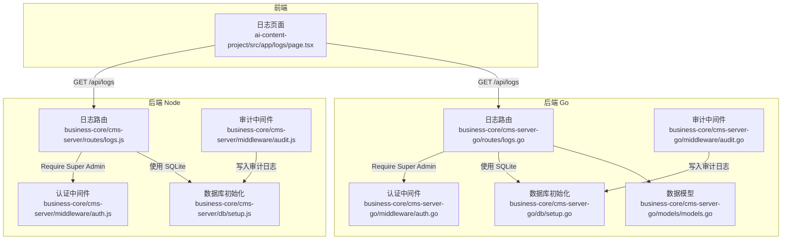
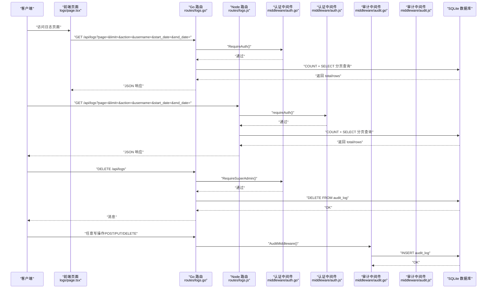
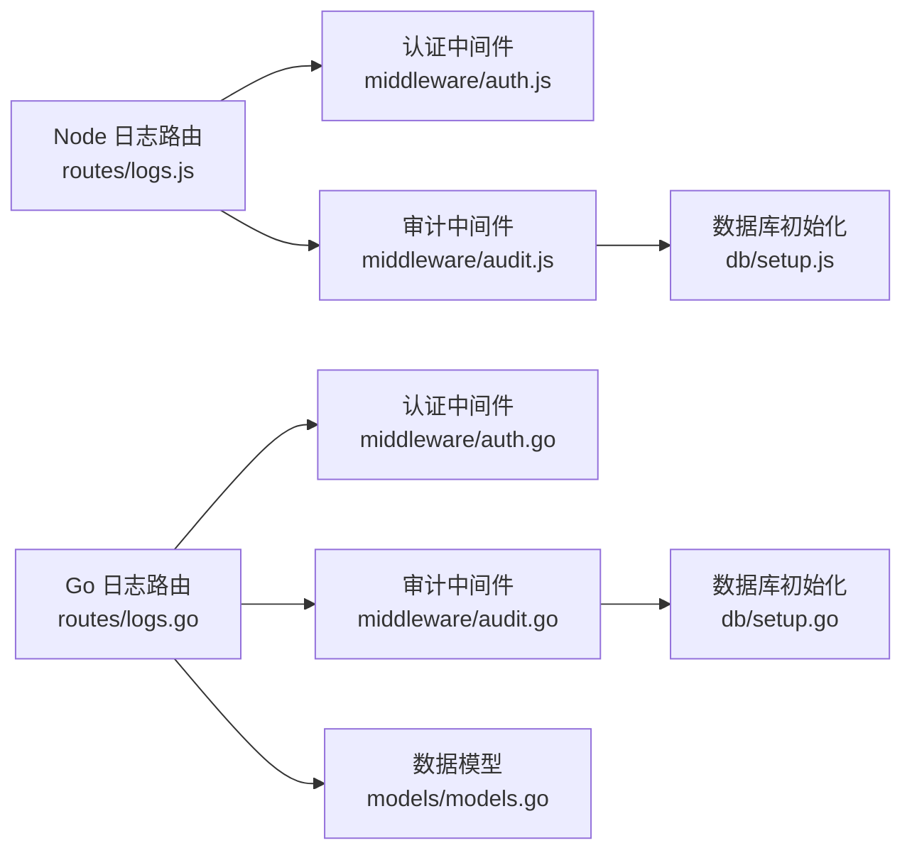

# 日志查询API

<cite>
**本文引用的文件**
- [business-core/cms-server/routes/logs.js](file://business-core/cms-server/routes/logs.js)
- [business-core/cms-server-go/routes/logs.go](file://business-core/cms-server-go/routes/logs.go)
- [business-core/cms-server-go/models/models.go](file://business-core/cms-server-go/models/models.go)
- [business-core/cms-server/middleware/audit.js](file://business-core/cms-server/middleware/audit.js)
- [business-core/cms-server-go/middleware/audit.go](file://business-core/cms-server-go/middleware/audit.go)
- [business-core/cms-server/db/setup.js](file://business-core/cms-server/db/setup.js)
- [business-core/cms-server-go/db/setup.go](file://business-core/cms-server-go/db/setup.go)
- [business-core/cms-server/middleware/auth.js](file://business-core/cms-server/middleware/auth.js)
- [business-core/cms-server-go/middleware/auth.go](file://business-core/cms-server-go/middleware/auth.go)
- [ai-content-project/src/app/logs/page.tsx](file://ai-content-project/src/app/logs/page.tsx)
</cite>

## 目录
1. [简介](#简介)
2. [项目结构](#项目结构)
3. [核心组件](#核心组件)
4. [架构总览](#架构总览)
5. [详细组件分析](#详细组件分析)
6. [依赖分析](#依赖分析)
7. [性能考虑](#性能考虑)
8. [故障排查指南](#故障排查指南)
9. [结论](#结论)
10. [附录](#附录)

## 简介
本文件为 ZSTS-CMS 的日志查询与管理接口的权威技术文档，覆盖以下能力：
- 操作日志查询：分页、多条件过滤（操作类型、用户名、时间范围）
- 日志清空：仅超级管理员可用
- 权限控制：基于 JWT 的认证与角色校验
- 前端展示：日志列表、统计卡片、搜索与筛选
- 数据模型：审计日志字段定义与响应结构
- 存储策略：SQLite 数据库表结构与初始化脚本
- 性能与安全：查询优化建议、隐私保护与保留策略

## 项目结构
日志相关能力横跨后端 Node 与 Go 两套实现，以及前端展示页面：
- 后端 Node 实现：路由、中间件、数据库初始化
- 后端 Go 实现：路由、中间件、数据库初始化、数据模型
- 前端页面：日志列表、搜索与筛选、统计与清空入口

图表来源
- [business-core/cms-server/routes/logs.js:1-59](file://business-core/cms-server/routes/logs.js#L1-L59)
- [business-core/cms-server-go/routes/logs.go:1-115](file://business-core/cms-server-go/routes/logs.go#L1-L115)
- [business-core/cms-server-go/models/models.go:53-70](file://business-core/cms-server-go/models/models.go#L53-L70)
- [business-core/cms-server/middleware/audit.js:1-75](file://business-core/cms-server/middleware/audit.js#L1-L75)
- [business-core/cms-server-go/middleware/audit.go:1-96](file://business-core/cms-server-go/middleware/audit.go#L1-L96)
- [business-core/cms-server/db/setup.js:41-53](file://business-core/cms-server/db/setup.js#L41-L53)
- [business-core/cms-server-go/db/setup.go:75-87](file://business-core/cms-server-go/db/setup.go#L75-L87)
- [ai-content-project/src/app/logs/page.tsx:34-193](file://ai-content-project/src/app/logs/page.tsx#L34-L193)

章节来源
- [business-core/cms-server/routes/logs.js:1-59](file://business-core/cms-server/routes/logs.js#L1-L59)
- [business-core/cms-server-go/routes/logs.go:1-115](file://business-core/cms-server-go/routes/logs.go#L1-L115)
- [ai-content-project/src/app/logs/page.tsx:34-193](file://ai-content-project/src/app/logs/page.tsx#L34-L193)

## 核心组件
- 日志查询接口（Node/Go 两套实现一致）
  - 方法与路径：GET /api/logs
  - 查询参数：page、limit、action、username、start_date、end_date
  - 响应结构：total、page、limit、rows（每条日志含 id、user_id、username、action、target、detail、timestamp）
  - 权限要求：需认证；查询功能无需特殊角色
- 日志清空接口（仅超级管理员）
  - 方法与路径：DELETE /api/logs
  - 权限要求：超级管理员
- 审计日志写入
  - 自动审计中间件：拦截非 GET 且状态码小于 400 的请求，异步写入 audit_log
  - 手动审计函数：可在业务路由中调用以记录特定操作
- 数据模型
  - 审计日志模型：包含上述字段
  - 日志查询响应模型：包含分页与行集合

章节来源
- [business-core/cms-server/routes/logs.js:20-48](file://business-core/cms-server/routes/logs.js#L20-L48)
- [business-core/cms-server-go/routes/logs.go:26-101](file://business-core/cms-server-go/routes/logs.go#L26-L101)
- [business-core/cms-server-go/models/models.go:53-70](file://business-core/cms-server-go/models/models.go#L53-L70)
- [business-core/cms-server/middleware/audit.js:22-40](file://business-core/cms-server/middleware/audit.js#L22-L40)
- [business-core/cms-server-go/middleware/audit.go:17-46](file://business-core/cms-server-go/middleware/audit.go#L17-L46)

## 架构总览
下图展示了日志查询与清空的端到端流程，包括认证、权限校验、查询与写入审计日志。

图表来源
- [business-core/cms-server-go/routes/logs.go:17-24](file://business-core/cms-server-go/routes/logs.go#L17-L24)
- [business-core/cms-server-go/middleware/auth.go:17-84](file://business-core/cms-server-go/middleware/auth.go#L17-L84)
- [business-core/cms-server-go/middleware/audit.go:48-96](file://business-core/cms-server-go/middleware/audit.go#L48-L96)
- [business-core/cms-server/routes/logs.js:12](file://business-core/cms-server/routes/logs.js#L12)
- [business-core/cms-server/middleware/auth.js:21-44](file://business-core/cms-server/middleware/auth.js#L21-L44)
- [business-core/cms-server/middleware/audit.js:46-72](file://business-core/cms-server/middleware/audit.js#L46-L72)

## 详细组件分析

### 接口定义与参数规范
- GET /api/logs
  - 功能：分页查询审计日志，支持多条件过滤
  - 查询参数
    - page：页码，默认 1，最小 1
    - limit：每页条数，默认 50，最小 1
    - action：操作类型模糊匹配
    - username：用户名模糊匹配
    - start_date：起始日期时间（包含当日 00:00:00）
    - end_date：结束日期时间（包含当日 23:59:59）
  - 响应字段
    - total：满足条件的总记录数
    - page：当前页码
    - limit：每页条数
    - rows：日志数组，每条包含 id、user_id、username、action、target、detail、timestamp
  - 权限要求：需认证（任意角色均可查询）
- DELETE /api/logs
  - 功能：清空审计日志表
  - 权限要求：超级管理员
  - 成功响应：返回消息

章节来源
- [business-core/cms-server/routes/logs.js:20-48](file://business-core/cms-server/routes/logs.js#L20-L48)
- [business-core/cms-server-go/routes/logs.go:26-101](file://business-core/cms-server-go/routes/logs.go#L26-L101)

### 数据模型与响应结构
- 审计日志模型（AuditLog）
  - 字段：id、user_id、username、action、target、detail、timestamp
- 日志查询响应模型（LogQueryResponse）
  - 字段：total、page、limit、rows（rows 为 AuditLog 数组）

章节来源
- [business-core/cms-server-go/models/models.go:53-70](file://business-core/cms-server-go/models/models.go#L53-L70)

### 审计日志写入机制
- 自动审计中间件
  - Node：拦截非 GET 且响应状态码 < 400 的请求，异步写入 audit_log，包含 user_id、username、action（形如 api_get）、target（路由路径）、detail（请求体前 200 字符）
  - Go：拦截非 GET 且状态码 < 400 的请求，异步写入 audit_log，行为与 Node 一致
- 手动审计
  - Node：audit(req, action, target, detail)
  - Go：Audit(c, action, target, detail)

章节来源
- [business-core/cms-server/middleware/audit.js:46-72](file://business-core/cms-server/middleware/audit.js#L46-L72)
- [business-core/cms-server-go/middleware/audit.go:48-96](file://business-core/cms-server-go/middleware/audit.go#L48-L96)

### 权限与认证
- 认证中间件
  - Node：requireAuth 解析 Authorization 头中的 Bearer Token，注入 req.user；requireSuperAdmin 校验角色
  - Go：RequireAuth/RequireSuperAdmin 校验 JWT 并注入用户信息
- 页面权限（与日志查询无直接关系）
  - Go：RequirePagePerm 校验页面编辑权限

章节来源
- [business-core/cms-server/middleware/auth.js:21-44](file://business-core/cms-server/middleware/auth.js#L21-L44)
- [business-core/cms-server-go/middleware/auth.go:17-84](file://business-core/cms-server-go/middleware/auth.go#L17-L84)

### 前端日志页面
- 功能概览
  - 展示审计日志列表、统计卡片（新增/修改/删除数量）、搜索与筛选（按操作类型、关键词）
  - 仅超级管理员可见“清空日志”按钮，并进行二次确认
- 关键交互
  - 使用 useLogs/useCurrentUser 钩子获取日志与当前用户信息
  - 通过前端过滤器实现本地搜索与筛选

章节来源
- [ai-content-project/src/app/logs/page.tsx:34-193](file://ai-content-project/src/app/logs/page.tsx#L34-L193)

### 数据库与表结构
- 表结构（audit_log）
  - 字段：id、user_id、username、action、target、detail、timestamp
  - 外键：user_id -> users(id)（删除时设为 NULL）
- 初始化脚本
  - Node：创建表、插入默认超级管理员、写入系统初始化审计日志
  - Go：创建表、插入默认超级管理员、写入系统初始化审计日志

章节来源
- [business-core/cms-server/db/setup.js:41-53](file://business-core/cms-server/db/setup.js#L41-L53)
- [business-core/cms-server-go/db/setup.go:75-87](file://business-core/cms-server-go/db/setup.go#L75-L87)

## 依赖分析
- 组件耦合
  - 日志路由依赖认证中间件与数据库
  - 审计中间件独立于日志路由，但共享同一张审计日志表
- 外部依赖
  - Node：better-sqlite3、jsonwebtoken
  - Go：gin、jwt（github.com/golang-jwt/jwt/v5）、sqlite3 驱动

图表来源
- [business-core/cms-server/routes/logs.js:12](file://business-core/cms-server/routes/logs.js#L12)
- [business-core/cms-server-go/routes/logs.go:17-24](file://business-core/cms-server-go/routes/logs.go#L17-L24)
- [business-core/cms-server-go/models/models.go:53-70](file://business-core/cms-server-go/models/models.go#L53-L70)
- [business-core/cms-server/middleware/audit.js:22-40](file://business-core/cms-server/middleware/audit.js#L22-L40)
- [business-core/cms-server-go/middleware/audit.go:17-46](file://business-core/cms-server-go/middleware/audit.go#L17-L46)
- [business-core/cms-server/db/setup.js:41-53](file://business-core/cms-server/db/setup.js#L41-L53)
- [business-core/cms-server-go/db/setup.go:75-87](file://business-core/cms-server-go/db/setup.go#L75-L87)

## 性能考虑
- 分页与索引
  - 已按 id 倒序分页，建议在 timestamp 上建立索引以加速时间范围查询
- 查询优化
  - 尽量使用精确字段过滤（如 action、username），避免全表扫描
  - 控制 limit，避免一次性拉取过多数据
- 异步审计
  - 自动审计采用异步写入，避免阻塞主请求响应
- 缓存与归档
  - 对高频查询结果可引入短期缓存（注意数据一致性）
  - 建议定期归档历史日志至离线存储，减少在线库压力

## 故障排查指南
- 401 未认证
  - 检查 Authorization 头是否为 Bearer Token，Token 是否有效
- 403 权限不足
  - 清空日志需超级管理员；普通查询无需特殊角色
- 数据库连接失败
  - 检查 DBPath 是否正确、数据库文件是否存在、权限是否足够
- 查询无结果或结果异常
  - 检查查询参数（page、limit、action、username、start_date、end_date）是否合理
  - 确认时间范围是否包含当日边界（起始 00:00:00，结束 23:59:59）

章节来源
- [business-core/cms-server-go/routes/logs.go:65-70](file://business-core/cms-server-go/routes/logs.go#L65-L70)
- [business-core/cms-server-go/middleware/auth.go:18-62](file://business-core/cms-server-go/middleware/auth.go#L18-L62)
- [business-core/cms-server/middleware/auth.js:21-34](file://business-core/cms-server/middleware/auth.js#L21-L34)

## 结论
ZSTS-CMS 的日志体系由 Node 与 Go 两端实现，保持了高度一致的接口语义与数据模型。通过认证与权限中间件保障访问安全，自动审计中间件确保关键操作可追溯。前端提供直观的日志浏览与筛选能力。建议后续在数据库层面增加时间字段索引、引入缓存与归档策略，以进一步提升查询性能与长期维护性。

## 附录

### 接口一览表
- GET /api/logs
  - 查询参数：page、limit、action、username、start_date、end_date
  - 响应：total、page、limit、rows
  - 权限：认证用户
- DELETE /api/logs
  - 权限：超级管理员
  - 响应：消息

章节来源
- [business-core/cms-server/routes/logs.js:20-48](file://business-core/cms-server/routes/logs.js#L20-L48)
- [business-core/cms-server-go/routes/logs.go:26-101](file://business-core/cms-server-go/routes/logs.go#L26-L101)

### 日志字段说明
- id：自增主键
- user_id：执行者用户 ID（可能为空）
- username：执行者用户名（匿名时为 anonymous）
- action：操作类型（如 api_post、api_put、api_delete、create、update、delete 等）
- target：操作目标（路由路径或资源标识）
- detail：请求体摘要（最多 200 字符）
- timestamp：记录时间

章节来源
- [business-core/cms-server/db/setup.js:41-53](file://business-core/cms-server/db/setup.js#L41-L53)
- [business-core/cms-server-go/db/setup.go:75-87](file://business-core/cms-server-go/db/setup.go#L75-L87)
- [business-core/cms-server-go/models/models.go:53-62](file://business-core/cms-server-go/models/models.go#L53-L62)

### 日志分类与搜索建议
- 操作类型分类：create、update、delete、reset、login、view 等
- 搜索维度：用户名、目标、描述（detail）
- 时间范围：建议以天为粒度，避免跨天边界问题

章节来源
- [ai-content-project/src/app/logs/page.tsx:25-32](file://ai-content-project/src/app/logs/page.tsx#L25-L32)
- [ai-content-project/src/app/logs/page.tsx:41-53](file://ai-content-project/src/app/logs/page.tsx#L41-L53)

### 日志存储策略与隐私保护
- 存储策略
  - 当前使用 SQLite 文件存储，适合中小规模场景
  - 建议定期备份数据库文件，制定恢复演练计划
- 保留期限
  - 建议根据合规要求设定保留周期（例如 90/180/365 天），到期后安全删除或归档
- 隐私保护
  - detail 字段仅保存摘要（最多 200 字符），避免敏感信息泄露
  - 删除或清空日志需超级管理员授权并留痕

章节来源
- [business-core/cms-server-go/middleware/audit.go:80-84](file://business-core/cms-server-go/middleware/audit.go#L80-L84)
- [business-core/cms-server/middleware/audit.js:24-34](file://business-core/cms-server/middleware/audit.js#L24-L34)