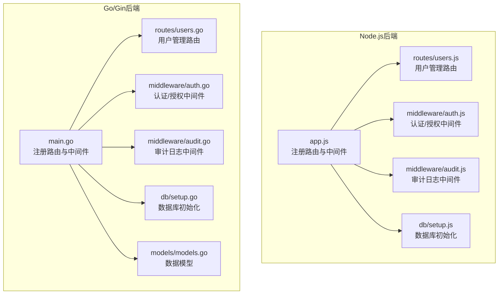
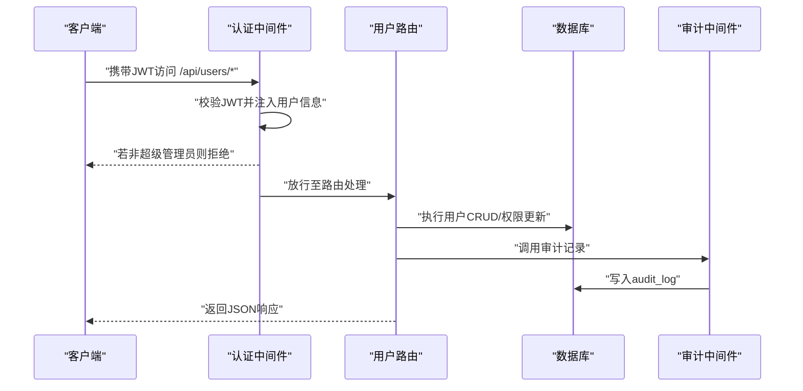
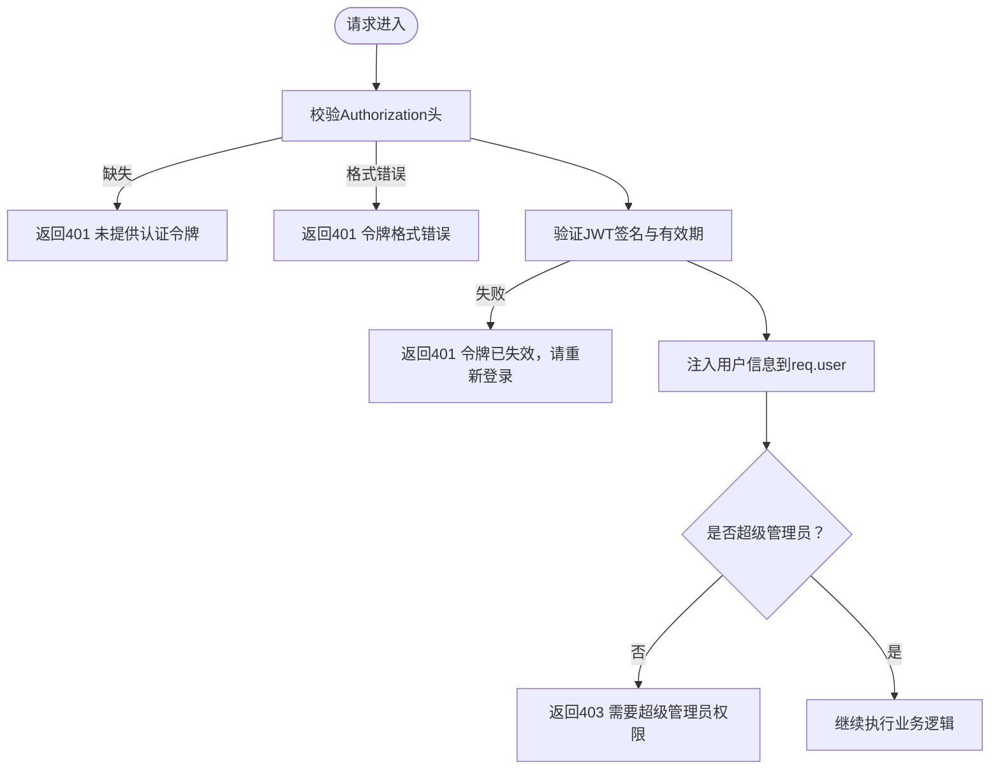
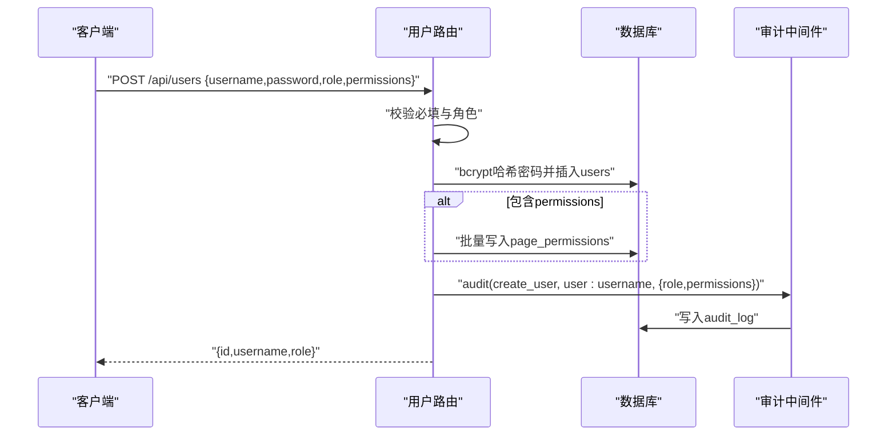
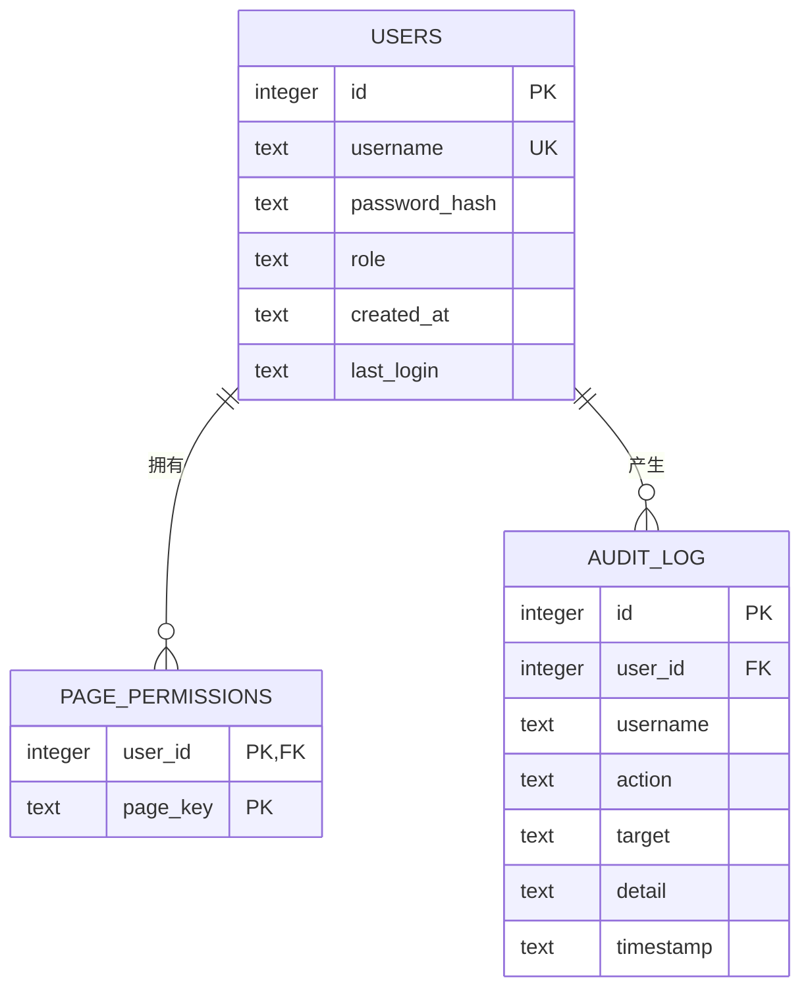
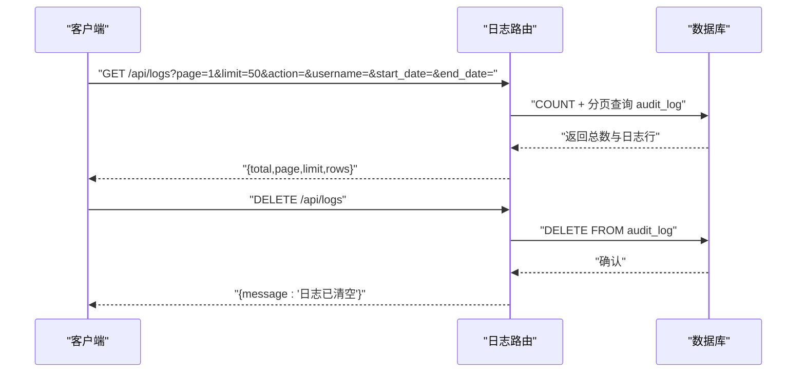
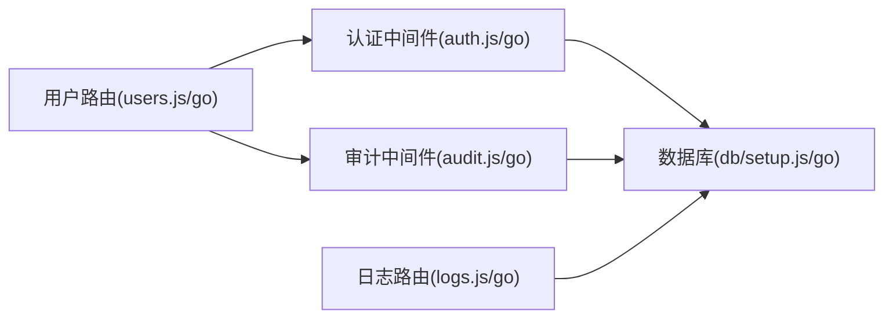

# 用户管理API

<cite>
**本文引用的文件**
- [users.js](file://business-core/cms-server/routes/users.js)
- [auth.js](file://business-core/cms-server/middleware/auth.js)
- [audit.js](file://business-core/cms-server/middleware/audit.js)
- [users.go](file://business-core/cms-server-go/routes/users.go)
- [auth.go](file://business-core/cms-server-go/middleware/auth.go)
- [audit.go](file://business-core/cms-server-go/middleware/audit.go)
- [setup.js](file://business-core/cms-server/db/setup.js)
- [setup.go](file://business-core/cms-server-go/db/setup.go)
- [models.go](file://business-core/cms-server-go/models/models.go)
- [logs.js](file://business-core/cms-server/routes/logs.js)
- [logs.go](file://business-core/cms-server-go/routes/logs.go)
- [app.js](file://business-core/cms-server/app.js)
- [main.go](file://business-core/cms-server-go/main.go)
- [config.go](file://business-core/cms-server-go/config/config.go)
</cite>

## 目录
1. [简介](#简介)
2. [项目结构](#项目结构)
3. [核心组件](#核心组件)
4. [架构总览](#架构总览)
5. [详细组件分析](#详细组件分析)
6. [依赖关系分析](#依赖关系分析)
7. [性能考量](#性能考量)
8. [故障排查指南](#故障排查指南)
9. [结论](#结论)
10. [附录](#附录)

## 简介
本文件为ZSTS-CMS用户管理API的权威接口文档，覆盖用户CRUD、权限分配、密码重置、批量操作与审计日志等能力。文档同时阐述权限验证机制、页面权限控制、用户状态管理、数据安全与一致性保障，并提供流程示例与最佳实践。

## 项目结构
ZSTS-CMS采用双后端实现：
- Node.js版本：基于Express，路由位于business-core/cms-server/routes，中间件位于business-core/cms-server/middleware，数据库初始化位于business-core/cms-server/db。
- Go/Gin版本：路由位于business-core/cms-server-go/routes，中间件位于business-core/cms-server-go/middleware，数据库初始化位于business-core/cms-server-go/db，模型定义位于business-core/cms-server-go/models。

图表来源
- [app.js:155-161](file://business-core/cms-server/app.js#L155-L161)
- [users.js:1-154](file://business-core/cms-server/routes/users.js#L1-L154)
- [auth.js:1-86](file://business-core/cms-server/middleware/auth.js#L1-L86)
- [audit.js:1-75](file://business-core/cms-server/middleware/audit.js#L1-L75)
- [setup.js:1-115](file://business-core/cms-server/db/setup.js#L1-L115)
- [main.go:72-84](file://business-core/cms-server-go/main.go#L72-L84)
- [users.go:18-29](file://business-core/cms-server-go/routes/users.go#L18-L29)
- [auth.go:17-84](file://business-core/cms-server-go/middleware/auth.go#L17-L84)
- [audit.go:16-96](file://business-core/cms-server-go/middleware/audit.go#L16-L96)
- [setup.go:18-187](file://business-core/cms-server-go/db/setup.go#L18-L187)
- [models.go:3-62](file://business-core/cms-server-go/models/models.go#L3-L62)

章节来源
- [app.js:155-161](file://business-core/cms-server/app.js#L155-L161)
- [main.go:72-84](file://business-core/cms-server-go/main.go#L72-L84)

## 核心组件
- 用户管理路由：提供用户列表、新建、密码重置、权限更新、删除等接口，均受超级管理员权限保护。
- 认证中间件：统一处理JWT校验、注入用户信息、页面权限校验。
- 审计日志：记录关键操作，支持查询与清理。
- 数据模型：定义用户、权限、审计日志等结构，确保前后端一致。
- 数据库初始化：创建users、page_permissions、audit_log表并初始化默认超级管理员。

章节来源
- [users.js:26-151](file://business-core/cms-server/routes/users.js#L26-L151)
- [users.go:31-248](file://business-core/cms-server-go/routes/users.go#L31-L248)
- [auth.js:20-63](file://business-core/cms-server/middleware/auth.js#L20-L63)
- [auth.go:17-132](file://business-core/cms-server-go/middleware/auth.go#L17-L132)
- [audit.js:22-40](file://business-core/cms-server/middleware/audit.js#L22-L40)
- [audit.go:16-46](file://business-core/cms-server-go/middleware/audit.go#L16-L46)
- [models.go:3-62](file://business-core/cms-server-go/models/models.go#L3-L62)
- [setup.js:18-104](file://business-core/cms-server/db/setup.js#L18-L104)
- [setup.go:46-172](file://business-core/cms-server-go/db/setup.go#L46-L172)

## 架构总览
用户管理API通过认证中间件进行统一鉴权，路由层执行业务逻辑，审计中间件记录关键操作，数据库层持久化用户、权限与审计数据。

图表来源
- [auth.js:20-44](file://business-core/cms-server/middleware/auth.js#L20-L44)
- [users.js:26-151](file://business-core/cms-server/routes/users.js#L26-L151)
- [audit.js:22-40](file://business-core/cms-server/middleware/audit.js#L22-L40)
- [auth.go:17-84](file://business-core/cms-server-go/middleware/auth.go#L17-L84)
- [users.go:31-248](file://business-core/cms-server-go/routes/users.go#L31-L248)
- [audit.go:16-46](file://business-core/cms-server-go/middleware/audit.go#L16-L46)

## 详细组件分析

### 接口清单与规范

- 基础路径
  - Node.js后端：/api
  - Go/Gin后端：/api

- 权限要求
  - 除GET /api/users外，其余用户管理接口均需超级管理员权限。
  - 页面权限校验用于内容编辑类接口，不在本文用户管理范围。

- 接口一览
  - GET /api/users —— 用户列表（含权限）
  - POST /api/users —— 新建账号（可选权限）
  - PUT /api/users/:id —— 重置密码
  - PUT /api/users/:id/permissions —— 更新页面权限
  - DELETE /api/users/:id —— 删除账号

- 请求头
  - Authorization: Bearer <JWT_TOKEN>

- 响应格式
  - 成功：标准JSON对象
  - 失败：包含error字段的JSON对象

- 参数与响应字段
  - 用户列表：包含id、username、role、created_at、last_login、permissions（page_key数组）
  - 新建用户：username、password、role（可选，editor/super_admin）、permissions（可选数组）
  - 重置密码：password（至少6位）
  - 更新权限：permissions（page_key数组）
  - 删除用户：无请求体

章节来源
- [users.js:4-151](file://business-core/cms-server/routes/users.js#L4-L151)
- [users.go:18-248](file://business-core/cms-server-go/routes/users.go#L18-L248)
- [models.go:13-51](file://business-core/cms-server-go/models/models.go#L13-L51)

### 认证与权限验证机制

- JWT校验
  - 从Authorization头解析Bearer Token，校验签名与有效期。
  - Node.js版本使用jsonwebtoken；Go版本使用github.com/golang-jwt/jwt/v5。
  - Node.js默认密钥可通过环境变量JWT_SECRET覆盖；Go版本通过config模块加载。

- 角色与页面权限
  - requireSuperAdmin：仅允许role为super_admin的用户访问。
  - requirePagePerm：校验用户是否拥有指定page_key的页面编辑权限；超级管理员拥有全部权限。
  - 页面权限存储于page_permissions表，主键(user_id, page_key)，外键关联users(id)并启用级联删除。

- 审计日志
  - 关键操作（创建用户、重置密码、更新权限、删除用户）均调用audit记录。
  - audit_log包含user_id、username、action、target、detail、timestamp。

图表来源
- [auth.js:20-44](file://business-core/cms-server/middleware/auth.js#L20-L44)
- [auth.go:17-84](file://business-core/cms-server-go/middleware/auth.go#L17-L84)

章节来源
- [auth.js:20-63](file://business-core/cms-server/middleware/auth.js#L20-L63)
- [auth.go:17-132](file://business-core/cms-server-go/middleware/auth.go#L17-L132)
- [audit.js:22-40](file://business-core/cms-server/middleware/audit.js#L22-L40)
- [audit.go:16-46](file://business-core/cms-server-go/middleware/audit.go#L16-L46)

### 用户CRUD与权限管理

- 列表查询
  - Node.js：查询users表并联查page_permissions，返回每个用户的page_key集合。
  - Go/Gin：同样查询users并联查page_permissions，返回UserResponse数组。

- 新建账号
  - 校验必填字段username、password；role必须为editor或super_admin。
  - 密码使用bcrypt哈希存储；可选写入初始权限。
  - 审计：记录create_user及附加详情。

- 重置密码
  - 校验password长度≥6；使用bcrypt哈希更新。
  - 审计：记录reset_password。

- 更新页面权限
  - 先删除旧权限，再批量写入新权限（INSERT OR IGNORE）。
  - 审计：记录update_permissions及权限数组。

- 删除账号
  - 不允许删除当前登录用户；删除后page_permissions自动级联删除。
  - 审计：记录delete_user。

图表来源
- [users.js:44-87](file://business-core/cms-server/routes/users.js#L44-L87)
- [users.go:74-135](file://business-core/cms-server-go/routes/users.go#L74-L135)
- [audit.js:22-40](file://business-core/cms-server/middleware/audit.js#L22-L40)
- [audit.go:16-46](file://business-core/cms-server-go/middleware/audit.go#L16-L46)

章节来源
- [users.js:26-151](file://business-core/cms-server/routes/users.js#L26-L151)
- [users.go:31-248](file://business-core/cms-server-go/routes/users.go#L31-L248)

### 数据模型与一致性

- 用户模型
  - Node.js：UserResponse包含id、username、role、created_at、last_login、permissions。
  - Go/Gin：UserResponse与之对应。

- 权限模型
  - PagePermission：user_id、page_key。
  - permissions为page_key字符串数组。

- 审计日志模型
  - AuditLog：id、user_id、username、action、target、detail、timestamp。

- 数据库约束
  - users.role枚举校验；page_permissions主键(user_id, page_key)；外键ON DELETE CASCADE。
  - audit_log.user_id外键ON DELETE SET NULL。

图表来源
- [setup.js:18-53](file://business-core/cms-server/db/setup.js#L18-L53)
- [setup.go:46-87](file://business-core/cms-server-go/db/setup.go#L46-L87)
- [models.go:3-62](file://business-core/cms-server-go/models/models.go#L3-L62)

章节来源
- [models.go:3-62](file://business-core/cms-server-go/models/models.go#L3-L62)
- [setup.js:18-53](file://business-core/cms-server/db/setup.js#L18-L53)
- [setup.go:46-87](file://business-core/cms-server-go/db/setup.go#L46-L87)

### 审计与异常处理

- 审计策略
  - 关键操作：create_user、reset_password、update_permissions、delete_user。
  - 自动审计中间件：拦截非GET且状态码<400的写操作，异步记录。

- 日志查询与清理
  - GET /api/logs：支持分页与按action、username、时间范围过滤。
  - DELETE /api/logs：仅超级管理员可清空审计日志。

- 异常处理
  - Node.js：捕获数据库唯一约束冲突返回409；其他错误返回500。
  - Go/Gin：数据库连接失败、哈希失败、权限不足等场景返回相应HTTP状态码。

图表来源
- [logs.js:20-56](file://business-core/cms-server/routes/logs.js#L20-L56)
- [logs.go:26-114](file://business-core/cms-server-go/routes/logs.go#L26-L114)

章节来源
- [audit.js:46-72](file://business-core/cms-server/middleware/audit.js#L46-L72)
- [audit.go:48-96](file://business-core/cms-server-go/middleware/audit.go#L48-L96)
- [logs.js:20-56](file://business-core/cms-server/routes/logs.js#L20-L56)
- [logs.go:26-114](file://business-core/cms-server-go/routes/logs.go#L26-L114)

## 依赖关系分析

图表来源
- [users.js:16-17](file://business-core/cms-server/routes/users.js#L16-L17)
- [users.go:9-15](file://business-core/cms-server-go/routes/users.go#L9-L15)
- [auth.js:12-14](file://business-core/cms-server/middleware/auth.js#L12-L14)
- [auth.go:9-14](file://business-core/cms-server-go/middleware/auth.go#L9-L14)
- [audit.js](file://business-core/cms-server/middleware/audit.js#L9)
- [audit.go:18-23](file://business-core/cms-server-go/middleware/audit.go#L18-L23)
- [setup.js](file://business-core/cms-server/db/setup.js#L11)
- [setup.go:33-37](file://business-core/cms-server-go/db/setup.go#L33-L37)
- [logs.js](file://business-core/cms-server/routes/logs.js#L12)
- [logs.go:18-19](file://business-core/cms-server-go/routes/logs.go#L18-L19)

章节来源
- [users.js:16-17](file://business-core/cms-server/routes/users.js#L16-L17)
- [users.go:9-15](file://business-core/cms-server-go/routes/users.go#L9-L15)
- [auth.js:12-14](file://business-core/cms-server/middleware/auth.js#L12-L14)
- [auth.go:9-14](file://business-core/cms-server-go/middleware/auth.go#L9-L14)
- [audit.js](file://business-core/cms-server/middleware/audit.js#L9)
- [audit.go:18-23](file://business-core/cms-server-go/middleware/audit.go#L18-L23)
- [setup.js](file://business-core/cms-server/db/setup.js#L11)
- [setup.go:33-37](file://business-core/cms-server-go/db/setup.go#L33-L37)
- [logs.js](file://business-core/cms-server/routes/logs.js#L12)
- [logs.go:18-19](file://business-core/cms-server-go/routes/logs.go#L18-L19)

## 性能考量
- 批量权限写入：使用事务或批量插入减少往返，降低锁竞争。
- 审计日志：异步写入避免阻塞请求响应。
- 分页查询：合理设置limit与offset，避免全表扫描。
- 密码哈希：使用固定成本算法，避免过高的计算开销。
- 外键约束：启用PRAGMA foreign_keys=ON，确保数据一致性。

## 故障排查指南
- 401 未提供认证令牌/令牌格式错误/令牌已失效
  - 检查Authorization头格式是否为Bearer Token。
  - 确认JWT_SECRET配置正确且未泄露。
- 403 需要超级管理员权限
  - 确认当前用户角色为super_admin。
- 409 用户名已存在
  - 检查username是否重复。
- 400 参数校验失败
  - 新建用户：username/password必填；role有效值。
  - 重置密码：password长度≥6。
  - 更新权限：permissions必须为数组。
- 审计日志为空
  - 确认写操作且状态码<400；检查审计中间件是否启用。
- 删除失败或权限未生效
  - 检查外键约束是否启用；确认级联删除是否触发。

章节来源
- [auth.js:20-44](file://business-core/cms-server/middleware/auth.js#L20-L44)
- [auth.go:17-84](file://business-core/cms-server-go/middleware/auth.go#L17-L84)
- [users.js:48-53](file://business-core/cms-server/routes/users.js#L48-L53)
- [users.go:76-85](file://business-core/cms-server-go/routes/users.go#L76-L85)
- [audit.js:46-72](file://business-core/cms-server/middleware/audit.js#L46-L72)
- [audit.go:48-96](file://business-core/cms-server-go/middleware/audit.go#L48-L96)

## 结论
ZSTS-CMS用户管理API通过严格的认证与授权机制、完善的审计体系与数据模型约束，提供了安全可靠的用户生命周期管理能力。建议在生产环境中：
- 强制使用HTTPS与安全的JWT密钥；
- 对敏感操作增加二次确认；
- 定期轮换密钥并监控异常登录行为；
- 使用数据库备份与审计日志定期归档。

## 附录

### 环境变量与配置
- Node.js后端
  - JWT_SECRET：JWT密钥，默认开发密钥，生产务必覆盖。
  - DB_PATH：SQLite数据库路径。
- Go/Gin后端
  - PORT：服务端口。
  - JWT_SECRET：JWT密钥。
  - DB_PATH：SQLite数据库路径。
  - UPLOAD_DIR/CONTENT_DIR/GLOBAL_DIR/ADMIN_DIR/PROJECT_ROOT/AI_PROXY_URL：静态资源与代理配置。

章节来源
- [config.go:26-57](file://business-core/cms-server-go/config/config.go#L26-L57)
- [app.js:13-14](file://business-core/cms-server/app.js#L13-L14)
- [main.go:22-28](file://business-core/cms-server-go/main.go#L22-L28)