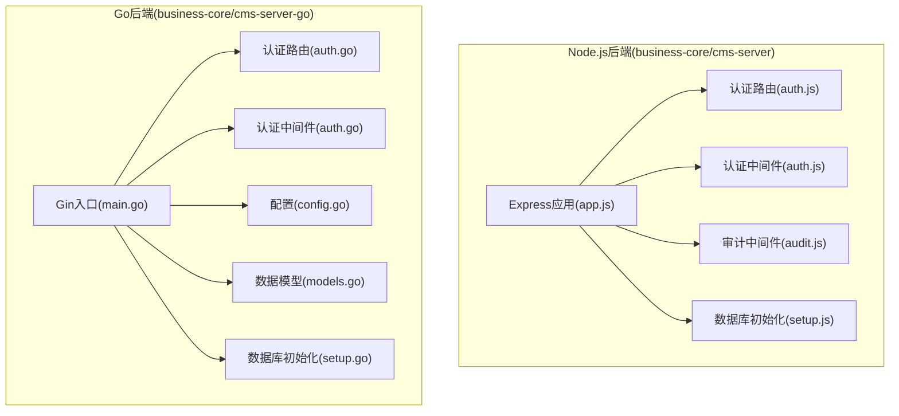
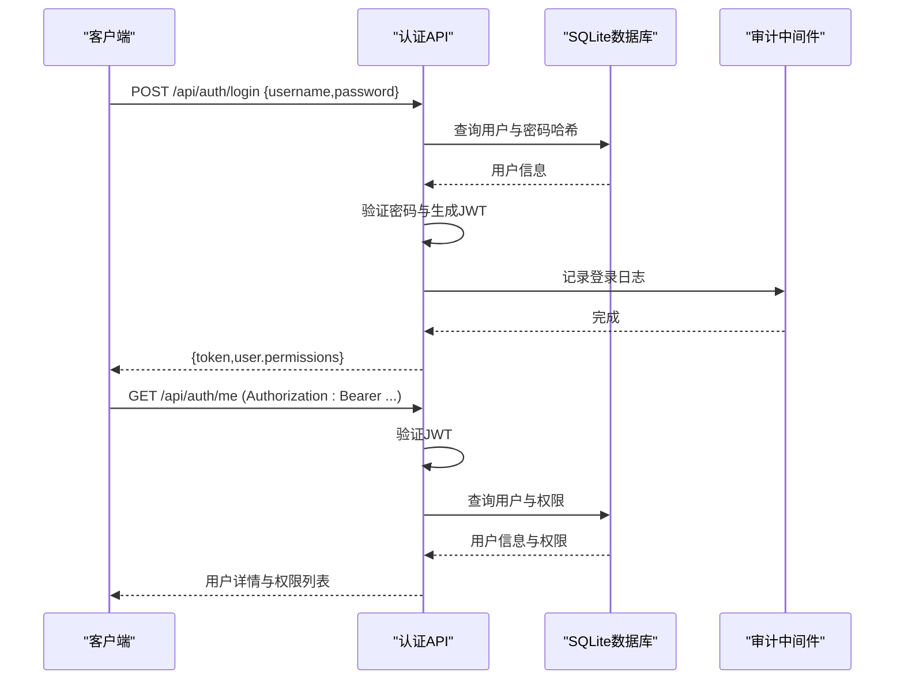
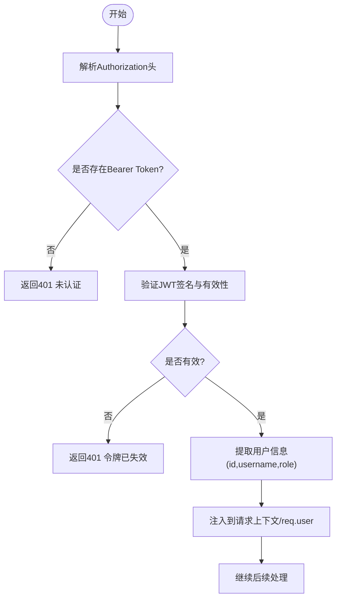
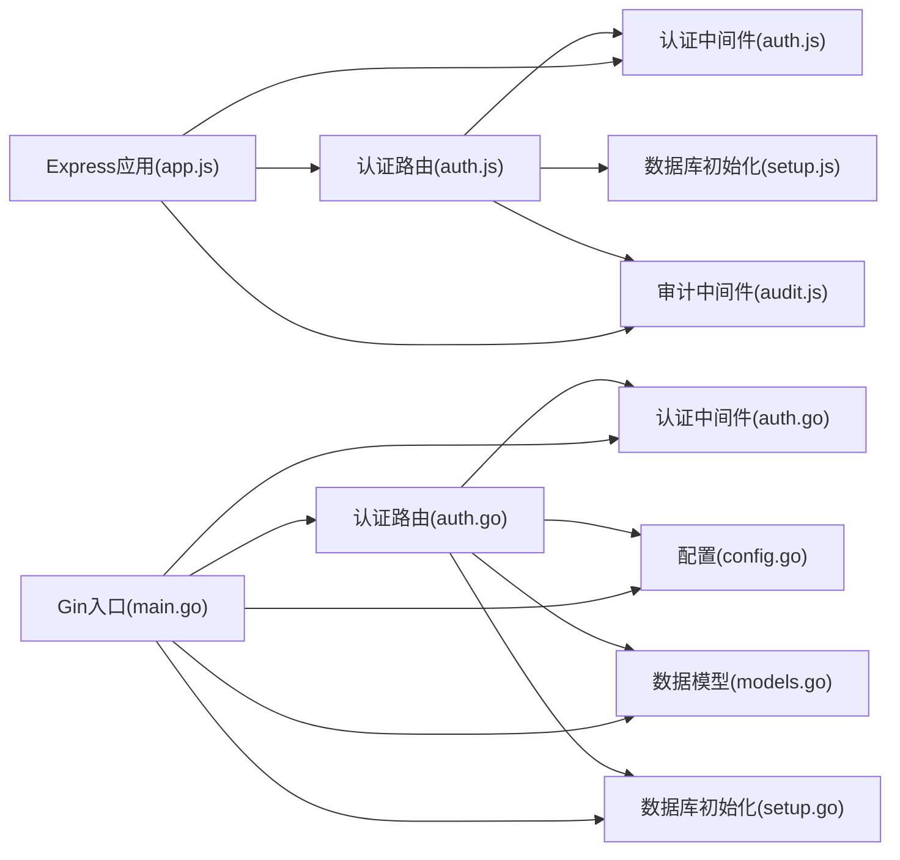

# 认证API

<cite>
**本文档引用的文件**
- [auth.js](file://business-core/cms-server/routes/auth.js)
- [auth.js](file://business-core/cms-server/middleware/auth.js)
- [audit.js](file://business-core/cms-server/middleware/audit.js)
- [setup.js](file://business-core/cms-server/db/setup.js)
- [auth.go](file://business-core/cms-server-go/routes/auth.go)
- [auth.go](file://business-core/cms-server-go/middleware/auth.go)
- [config.go](file://business-core/cms-server-go/config/config.go)
- [models.go](file://business-core/cms-server-go/models/models.go)
- [setup.go](file://business-core/cms-server-go/db/setup.go)
- [app.js](file://business-core/cms-server/app.js)
- [main.go](file://business-core/cms-server-go/main.go)
</cite>

## 目录
1. [简介](#简介)
2. [项目结构](#项目结构)
3. [核心组件](#核心组件)
4. [架构总览](#架构总览)
5. [详细组件分析](#详细组件分析)
6. [依赖关系分析](#依赖关系分析)
7. [性能考虑](#性能考虑)
8. [故障排除指南](#故障排除指南)
9. [结论](#结论)
10. [附录](#附录)

## 简介
本文件为ZSTS-CMS认证API的权威技术文档，覆盖登录、登出、获取用户信息等认证相关接口的HTTP方法、URL模式、请求参数、响应格式与错误处理。文档同时阐述JWT令牌生成与验证机制、认证中间件使用、会话管理与权限检查的完整规范，并提供认证流程示例、安全最佳实践以及常见问题的解决方案，包括令牌过期处理、多设备登录管理与审计日志记录。

## 项目结构
ZSTS-CMS采用前后端分离架构，认证能力在两个后端实现中均有体现：
- Node.js版本：基于Express，位于business-core/cms-server
- Go/Gin版本：位于business-core/cms-server-go

认证相关的核心模块包括：
- 路由层：定义认证接口（登录、登出、获取当前用户）
- 中间件层：JWT校验、权限校验、审计日志
- 数据层：SQLite数据库初始化与表结构
- 配置层：JWT密钥、数据库路径、上传目录等

**图表来源**
- [app.js:155-161](file://business-core/cms-server/app.js#L155-L161)
- [auth.js:1-99](file://business-core/cms-server/routes/auth.js#L1-L99)
- [auth.js:1-86](file://business-core/cms-server/middleware/auth.js#L1-L86)
- [audit.js:1-75](file://business-core/cms-server/middleware/audit.js#L1-L75)
- [setup.js:1-115](file://business-core/cms-server/db/setup.js#L1-L115)
- [main.go:72-84](file://business-core/cms-server-go/main.go#L72-L84)
- [auth.go:18-25](file://business-core/cms-server-go/routes/auth.go#L18-L25)
- [auth.go:17-63](file://business-core/cms-server-go/middleware/auth.go#L17-L63)
- [config.go:1-95](file://business-core/cms-server-go/config/config.go#L1-L95)
- [models.go:1-145](file://business-core/cms-server-go/models/models.go#L1-L145)
- [setup.go:1-187](file://business-core/cms-server-go/db/setup.go#L1-L187)

**章节来源**
- [app.js:155-161](file://business-core/cms-server/app.js#L155-L161)
- [main.go:72-84](file://business-core/cms-server-go/main.go#L72-L84)

## 核心组件
- 认证路由：提供登录、登出、获取当前用户信息接口
- 认证中间件：负责JWT验证、角色与页面权限校验
- 审计日志：记录登录等关键操作
- 数据库初始化：创建用户、权限、审计日志等表并初始化默认超级管理员
- 配置系统：集中管理JWT密钥、数据库路径、上传目录等

**章节来源**
- [auth.js:1-99](file://business-core/cms-server/routes/auth.js#L1-L99)
- [auth.js:1-86](file://business-core/cms-server/middleware/auth.js#L1-L86)
- [audit.js:1-75](file://business-core/cms-server/middleware/audit.js#L1-L75)
- [setup.js:1-115](file://business-core/cms-server/db/setup.js#L1-L115)
- [auth.go:18-25](file://business-core/cms-server-go/routes/auth.go#L18-L25)
- [auth.go:17-63](file://business-core/cms-server-go/middleware/auth.go#L17-L63)
- [config.go:1-95](file://business-core/cms-server-go/config/config.go#L1-L95)
- [models.go:1-145](file://business-core/cms-server-go/models/models.go#L1-L145)
- [setup.go:1-187](file://business-core/cms-server-go/db/setup.go#L1-L187)

## 架构总览
认证流程在Node.js与Go两个后端中保持一致的职责划分：
- 登录：校验凭据、更新最后登录时间、生成JWT并返回用户权限
- 获取当前用户：从Authorization头解析Bearer Token，验证后返回用户信息
- 权限控制：通过中间件校验角色与页面权限
- 审计日志：登录操作记录到审计日志表

**图表来源**
- [auth.js:22-66](file://business-core/cms-server/routes/auth.js#L22-L66)
- [auth.js:68-96](file://business-core/cms-server/routes/auth.js#L68-L96)
- [audit.js:22-40](file://business-core/cms-server/middleware/audit.js#L22-L40)
- [auth.go:27-104](file://business-core/cms-server-go/routes/auth.go#L27-L104)
- [auth.go:106-173](file://business-core/cms-server-go/routes/auth.go#L106-L173)

## 详细组件分析

### 接口定义与规范

#### 登录接口
- 方法与URL：POST /api/auth/login
- 请求头：Content-Type: application/json
- 请求体字段：
  - username: string，必填
  - password: string，必填
- 成功响应字段：
  - token: string，JWT令牌
  - user.permissions: string[]，用户页面权限列表
- 失败响应：
  - 400：用户名或密码为空
  - 401：用户名或密码错误
  - 500：数据库连接失败或内部错误
- 审计：记录登录事件

**章节来源**
- [auth.js:22-66](file://business-core/cms-server/routes/auth.js#L22-L66)
- [auth.go:27-104](file://business-core/cms-server-go/routes/auth.go#L27-L104)

#### 登出接口
- 方法与URL：POST /api/auth/logout
- 说明：前端清除本地存储的令牌即可；后端无需额外操作
- 响应：200 OK（无内容）

**章节来源**
- [auth.js:2-5](file://business-core/cms-server/routes/auth.js#L2-L5)

#### 获取当前用户信息接口
- 方法与URL：GET /api/auth/me
- 请求头：Authorization: Bearer <token>
- 成功响应字段：
  - id: number
  - username: string
  - role: string
  - created_at: string
  - last_login: string | null
  - permissions: string[]
- 失败响应：
  - 401：未认证、令牌格式错误、令牌已失效、用户不存在
  - 500：数据库连接失败或内部错误

**章节来源**
- [auth.js:68-96](file://business-core/cms-server/routes/auth.js#L68-L96)
- [auth.go:106-173](file://business-core/cms-server-go/routes/auth.go#L106-L173)

### JWT令牌生成与验证机制
- 生成：
  - Node.js：使用jsonwebtoken库，密钥来自环境变量或默认值，有效期7天
  - Go：使用golang-jwt/jwt/v5，密钥来自配置，有效期7天
- 验证：
  - Node.js：从Authorization头解析Bearer Token，验证失败返回401
  - Go：支持Authorization头、URL查询参数token、Cookie三种方式，统一验证并注入用户信息

**图表来源**
- [auth.js:20-35](file://business-core/cms-server/middleware/auth.js#L20-L35)
- [auth.go:17-63](file://business-core/cms-server-go/middleware/auth.go#L17-L63)
- [auth.go:134-176](file://business-core/cms-server-go/middleware/auth.go#L134-L176)

**章节来源**
- [auth.js:12-14](file://business-core/cms-server/middleware/auth.js#L12-L14)
- [auth.go:83-89](file://business-core/cms-server-go/config/config.go#L83-L89)

### 认证中间件使用
- requireAuth：验证JWT并注入req.user
- requireSuperAdmin：requireAuth基础上校验角色为super_admin
- requirePagePerm(pageKey)：校验用户是否拥有指定页面权限
- Go版本：RequireAuth、RequireSuperAdmin、RequirePagePerm均为gin.HandlerFunc
- AI内容生成认证：支持Authorization头、URL token、Cookie三种方式

**章节来源**
- [auth.js:20-63](file://business-core/cms-server/middleware/auth.js#L20-L63)
- [auth.go:17-132](file://business-core/cms-server-go/middleware/auth.go#L17-L132)
- [auth.go:134-176](file://business-core/cms-server-go/middleware/auth.go#L134-L176)

### 会话管理与权限检查
- 会话恢复：前端启动时携带Authorization头调用/me接口，后端验证后返回用户信息
- 角色权限：超级管理员拥有所有页面权限
- 页面权限：通过page_permissions表进行授权控制
- 多设备登录：当前实现未提供令牌撤销或强制登出机制，建议在生产环境引入黑名单或刷新令牌策略

**章节来源**
- [auth.js:68-96](file://business-core/cms-server/routes/auth.js#L68-L96)
- [auth.go:106-173](file://business-core/cms-server-go/routes/auth.go#L106-L173)
- [auth.js:46-63](file://business-core/cms-server/middleware/auth.js#L46-L63)
- [auth.go:86-132](file://business-core/cms-server-go/middleware/auth.go#L86-L132)

### 审计日志记录
- 登录事件：登录成功后记录到audit_log表，包含用户ID、用户名、动作、目标、详情
- 自动审计中间件：拦截非GET写操作并在成功时异步记录
- 字段说明：id、user_id、username、action、target、detail、timestamp

**章节来源**
- [audit.js:15-40](file://business-core/cms-server/middleware/audit.js#L15-L40)
- [audit.js:42-72](file://business-core/cms-server/middleware/audit.js#L42-L72)
- [setup.js:41-53](file://business-core/cms-server/db/setup.js#L41-L53)
- [setup.go:75-87](file://business-core/cms-server-go/db/setup.go#L75-L87)

### 数据模型与表结构
- 用户表(users)：id、username、password_hash、role、created_at、last_login
- 页面权限表(page_permissions)：user_id、page_key（联合主键）
- 审计日志表(audit_log)：id、user_id、username、action、target、detail、timestamp
- 默认超级管理员：admin/admin123，首次登录后应立即修改密码

**章节来源**
- [setup.js:18-53](file://business-core/cms-server/db/setup.js#L18-L53)
- [setup.go:46-87](file://business-core/cms-server-go/db/setup.go#L46-L87)

## 依赖关系分析
认证相关模块之间的依赖关系如下：

**图表来源**
- [auth.js:1-99](file://business-core/cms-server/routes/auth.js#L1-L99)
- [auth.js:1-86](file://business-core/cms-server/middleware/auth.js#L1-L86)
- [audit.js:1-75](file://business-core/cms-server/middleware/audit.js#L1-L75)
- [setup.js:1-115](file://business-core/cms-server/db/setup.js#L1-L115)
- [auth.go:18-25](file://business-core/cms-server-go/routes/auth.go#L18-L25)
- [auth.go:17-63](file://business-core/cms-server-go/middleware/auth.go#L17-L63)
- [config.go:1-95](file://business-core/cms-server-go/config/config.go#L1-L95)
- [models.go:1-145](file://business-core/cms-server-go/models/models.go#L1-L145)
- [setup.go:1-187](file://business-core/cms-server-go/db/setup.go#L1-L187)
- [app.js:155-161](file://business-core/cms-server/app.js#L155-L161)
- [main.go:72-84](file://business-core/cms-server-go/main.go#L72-L84)

**章节来源**
- [app.js:155-161](file://business-core/cms-server/app.js#L155-L161)
- [main.go:72-84](file://business-core/cms-server-go/main.go#L72-L84)

## 性能考虑
- JWT验证成本低：仅需解码与签名验证，适合高并发场景
- 数据库查询：登录与获取用户信息均涉及少量查询，建议在生产环境开启数据库连接池
- 审计日志：采用异步写入，避免阻塞主请求链路
- 令牌有效期：默认7天，建议根据业务风险调整，过短影响用户体验，过长增加泄露风险

## 故障排除指南
- 401 未提供认证令牌：检查Authorization头是否包含Bearer Token
- 401 令牌格式错误：确认Authorization头格式为“Bearer <token>”
- 401 令牌已失效：检查JWT是否过期或被篡改
- 401 用户不存在：用户已被删除或ID不匹配
- 401 无页面编辑权限：确认用户角色或页面权限是否正确配置
- 500 数据库连接失败：检查DB_PATH与数据库文件权限
- 审计日志未记录：确认audit中间件是否正确挂载

**章节来源**
- [auth.js:68-96](file://business-core/cms-server/routes/auth.js#L68-L96)
- [auth.go:106-173](file://business-core/cms-server-go/routes/auth.go#L106-L173)
- [auth.js:20-35](file://business-core/cms-server/middleware/auth.js#L20-L35)
- [auth.go:17-63](file://business-core/cms-server-go/middleware/auth.go#L17-L63)
- [audit.js:15-40](file://business-core/cms-server/middleware/audit.js#L15-L40)

## 结论
ZSTS-CMS认证API提供了完整的登录、登出与用户信息获取能力，结合JWT令牌与多级权限控制，满足内容管理系统的安全需求。建议在生产环境中：
- 使用强JWT密钥并定期轮换
- 引入令牌黑名单或刷新令牌机制以支持强制登出
- 对敏感操作增加二次确认与审计日志
- 定期清理过期令牌与审计日志

## 附录

### 安全最佳实践
- 传输加密：所有认证接口必须通过HTTPS
- 密钥管理：JWT_SECRET不得硬编码在源码中，使用环境变量或密钥管理服务
- 令牌存储：前端仅在内存或安全存储中保存令牌，避免localStorage长期持久化
- 权限最小化：仅授予必要的页面权限，定期审查权限配置
- 审计与监控：启用审计日志并设置告警规则

### 令牌过期处理
- 当前实现：JWT有效期7天，过期后需重新登录
- 建议方案：引入刷新令牌机制或短期访问令牌+刷新令牌组合

### 多设备登录管理
- 当前实现：未提供强制登出或设备管理功能
- 建议方案：引入设备指纹、令牌黑名单、单点登录(SSO)等机制

### 审计日志记录
- 登录事件：记录用户ID、用户名、IP、时间戳
- 写操作：自动记录API变更类操作，便于追踪