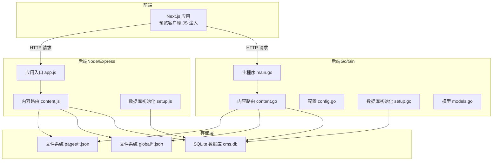
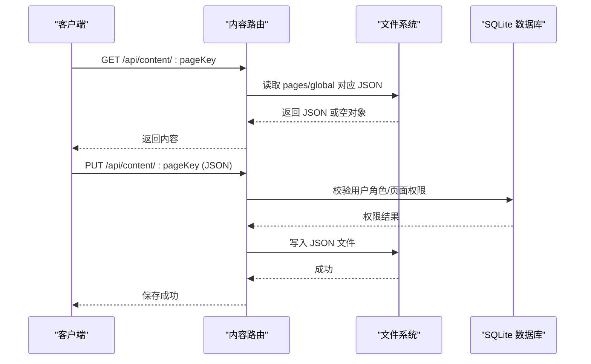
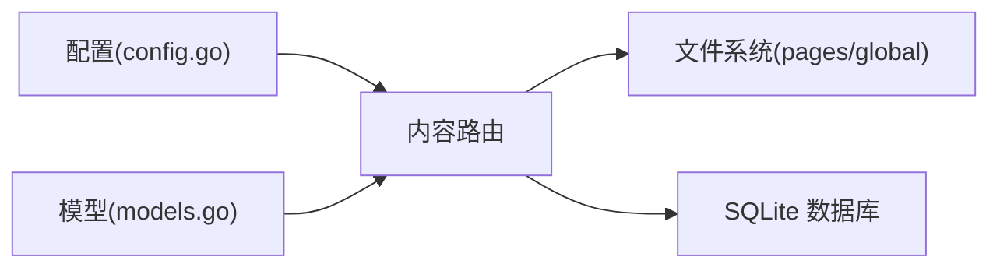

# 内容存储机制

<cite>
**本文引用的文件**   
- [business-core/cms-server/routes/content.js](file://business-core/cms-server/routes/content.js)
- [business-core/cms-server/app.js](file://business-core/cms-server/app.js)
- [business-core/cms-server/db/setup.js](file://business-core/cms-server/db/setup.js)
- [business-core/cms-server/add-image-datai18n.js](file://business-core/cms-server/add-image-datai18n.js)
- [business-core/cms-server/extract-fields.js](file://business-core/cms-server/extract-fields.js)
- [business-core/cms-server/generate-page-fields.js](file://business-core/cms-server/generate-page-fields.js)
- [business-core/cms-server/clean-en-fields.js](file://business-core/cms-server/clean-en-fields.js)
- [business-core/cms-server/prefill-from-html.js](file://business-core/cms-server/prefill-from-html.js)
- [business-core/cms-server-go/routes/content.go](file://business-core/cms-server-go/routes/content.go)
- [business-core/cms-server-go/main.go](file://business-core/cms-server-go/main.go)
- [business-core/cms-server-go/config/config.go](file://business-core/cms-server-go/config/config.go)
- [business-core/cms-server-go/db/setup.go](file://business-core/cms-server-go/db/setup.go)
- [business-core/cms-server-go/models/models.go](file://business-core/cms-server-go/models/models.go)
</cite>

## 目录
1. [引言](#引言)
2. [项目结构](#项目结构)
3. [核心组件](#核心组件)
4. [架构总览](#架构总览)
5. [详细组件分析](#详细组件分析)
6. [依赖关系分析](#依赖关系分析)
7. [性能考量](#性能考量)
8. [故障排查指南](#故障排查指南)
9. [结论](#结论)
10. [附录](#附录)

## 引言
本文件系统性阐述该内容存储机制的设计与实现，重点覆盖以下方面：
- JSON 文件结构设计：全局配置与页面内容的数据格式规范
- 内容组织方式：global 目录与 pages 目录的结构差异与用途
- 数据同步策略：默认值与数据库内容的合并算法思路
- 键命名约定、字段类型定义与多语言支持机制
- JSON 示例、数据验证规则与版本管理策略
- 内容变更追踪与回滚机制

## 项目结构
系统采用前后端分离的双栈实现（Node/Express 与 Go/Gin），统一通过 API 提供内容读写能力；内容持久化采用本地 JSON 文件与 SQLite 数据库存储相结合的方式。

图表来源
- [business-core/cms-server/app.js:155-315](file://business-core/cms-server/app.js#L155-L315)
- [business-core/cms-server/routes/content.js:1-104](file://business-core/cms-server/routes/content.js#L1-L104)
- [business-core/cms-server/db/setup.js:1-115](file://business-core/cms-server/db/setup.js#L1-L115)
- [business-core/cms-server-go/main.go:72-114](file://business-core/cms-server-go/main.go#L72-L114)
- [business-core/cms-server-go/routes/content.go:29-157](file://business-core/cms-server-go/routes/content.go#L29-L157)
- [business-core/cms-server-go/config/config.go:26-56](file://business-core/cms-server-go/config/config.go#L26-L56)
- [business-core/cms-server-go/db/setup.go:18-187](file://business-core/cms-server-go/db/setup.go#L18-L187)
- [business-core/cms-server-go/models/models.go:1-145](file://business-core/cms-server-go/models/models.go#L1-L145)

章节来源
- [business-core/cms-server/app.js:155-315](file://business-core/cms-server/app.js#L155-L315)
- [business-core/cms-server-go/main.go:72-114](file://business-core/cms-server-go/main.go#L72-L114)

## 核心组件
- 内容路由（Node/Go）：负责读取与写入 pages/*.json 与 global/*.json，同时进行权限校验与审计记录。
- 数据库层：维护用户、页面权限与审计日志表，提供权限与审计能力。
- 配置层（Go）：集中管理端口、JWT 密钥、文件路径等运行时配置。
- 前端集成：通过预览客户端 JS 注入与静态资源托管，实现编辑态与预览态的无缝衔接。

章节来源
- [business-core/cms-server/routes/content.js:1-104](file://business-core/cms-server/routes/content.js#L1-L104)
- [business-core/cms-server-go/routes/content.go:29-157](file://business-core/cms-server-go/routes/content.go#L29-L157)
- [business-core/cms-server/db/setup.js:14-108](file://business-core/cms-server/db/setup.js#L14-L108)
- [business-core/cms-server-go/db/setup.go:18-187](file://business-core/cms-server-go/db/setup.go#L18-L187)
- [business-core/cms-server-go/config/config.go:26-56](file://business-core/cms-server-go/config/config.go#L26-L56)

## 架构总览
内容读写流程在 Node 与 Go 两端保持一致：GET 读取 JSON，PUT 写入 JSON；全局配置仅超级管理员可写，普通页面写入需具备对应页面权限；权限与审计均来自数据库。

图表来源
- [business-core/cms-server/routes/content.js:48-101](file://business-core/cms-server/routes/content.js#L48-L101)
- [business-core/cms-server-go/routes/content.go:80-157](file://business-core/cms-server-go/routes/content.go#L80-L157)

## 详细组件分析

### JSON 文件结构与数据格式规范
- 结构形态
  - 全局配置：nav.json、footer.json、consultation.json，存放全局导航、页脚、咨询等跨页面配置。
  - 页面内容：home.json、about.json、visa.json、saudi-visa.json、enterprise.json、transport.json、insurance.json、inspection.json，存放各页面的可编辑字段集合。
- 字段类型与多语言
  - 文本类字段：支持纯文本或对象形式（含 zh/en 多语言键）。脚本清理工具会移除 en 字段，仅保留 zh。
  - 图片类字段：支持直接存储 URL 或对象形式（含 zh/en 多语言键）。
  - 列表/分组字段：通过点号分隔的层级键表示，例如 hero.title、section.process.tag。
- 示例参考
  - 页面 JSON 示例路径：[business-core/content/pages/home.json](file://business-core/content/pages/home.json)
  - 全局 JSON 示例路径：[business-core/content/global/nav.json](file://business-core/content/global/nav.json)
- 字段类型推断与生成
  - 通过扫描 HTML 的 data-i18n 属性，自动生成字段清单与类型推断（text/textarea/image）。
  - 字段中文标签通过规则映射生成，便于编辑器展示。

章节来源
- [business-core/cms-server/routes/content.js:53-64](file://business-core/cms-server/routes/content.js#L53-L64)
- [business-core/cms-server-go/routes/content.go:84-107](file://business-core/cms-server-go/routes/content.go#L84-L107)
- [business-core/cms-server/extract-fields.js:44-112](file://business-core/cms-server/extract-fields.js#L44-L112)
- [business-core/cms-server/generate-page-fields.js:8-419](file://business-core/cms-server/generate-page-fields.js#L8-L419)
- [business-core/cms-server/clean-en-fields.js:10-42](file://business-core/cms-server/clean-en-fields.js#L10-L42)

### 目录组织与用途
- global 目录
  - 存放全局配置 JSON，如 nav.json、footer.json、consultation.json。
  - 读取：GET /api/content/nav | footer | consultation。
  - 写入：PUT /api/content/nav | footer | consultation（仅超级管理员）。
- pages 目录
  - 存放页面内容 JSON，如 home.json、about.json 等。
  - 读取：GET /api/content/{pageKey}。
  - 写入：PUT /api/content/{pageKey}（需对应页面权限或超级管理员）。

章节来源
- [business-core/cms-server/routes/content.js:21-27](file://business-core/cms-server/routes/content.js#L21-L27)
- [business-core/cms-server-go/routes/content.go:22-27](file://business-core/cms-server-go/routes/content.go#L22-L27)
- [business-core/cms-server-go/routes/content.go:84-107](file://business-core/cms-server-go/routes/content.go#L84-L107)

### 数据同步策略与默认值合并
- 默认值来源
  - 首次进入编辑器时，通过 /api/page-snapshot/:pageKey 抓取 HTML 中 data-i18n 的当前值作为默认快照，避免字段空白。
  - Node 版本还提供 /api/page-snapshot/:pageKey（在 app.js 中），Go 版本提供 /api/page-snapshot/:pageKey（在 routes/content.go 中）。
- 合并算法思路
  - 读取顺序：先读取 pages/global 下的 JSON；若不存在则返回空对象。
  - 写入顺序：校验权限后写入对应 JSON；不涉及数据库内容的直接合并。
  - 若需“默认值与数据库内容合并”，可在业务层扩展：读取 JSON 后与数据库中历史版本或模板进行合并，再写回 JSON。当前仓库未提供该合并逻辑，建议在上层业务中实现。
- 快照与回填
  - 一键回填脚本会将 HTML 的 data-i18n 当前值写入对应 JSON，解决“编辑器打开时字段为空”的问题。

章节来源
- [business-core/cms-server/app.js:233-300](file://business-core/cms-server/app.js#L233-L300)
- [business-core/cms-server-go/routes/content.go:213-274](file://business-core/cms-server-go/routes/content.go#L213-L274)
- [business-core/cms-server/prefill-from-html.js:1-17](file://business-core/cms-server/prefill-from-html.js#L1-L17)

### 键命名约定与字段类型定义
- 键命名约定
  - 使用点号分隔的层级结构，如 hero.title、section.process.tag、faq.q1。
  - 全局字段前缀排除：以 nav.、footer.、modal. 开头的键视为全局字段，不在页面字段清单中。
- 字段类型推断
  - image：包含 image/img/qr/photo 等关键词。
  - textarea：包含 desc/content/text/intro 等关键词。
  - text：默认类型。
- 字段中文标签
  - 通过规则映射生成，如 title→标题、desc→描述、image→图片等。

章节来源
- [business-core/cms-server/extract-fields.js:19-81](file://business-core/cms-server/extract-fields.js#L19-L81)
- [business-core/cms-server/generate-page-fields.js:8-419](file://business-core/cms-server/generate-page-fields.js#L8-L419)

### 多语言支持机制
- 存储层
  - 字段可为字符串或对象；对象包含 zh/en 两个键，用于多语言。
  - 清理脚本会移除 en 字段，仅保留 zh，确保最终存储为简体中文。
- 生成与抓取
  - 通过正则从 HTML 抓取 data-i18n 的当前值，生成快照；编辑器据此回显默认值。
  - Go 版本的快照处理器支持文本与图片两类元素的抽取。

章节来源
- [business-core/cms-server/clean-en-fields.js:10-42](file://business-core/cms-server/clean-en-fields.js#L10-L42)
- [business-core/cms-server/app.js:233-300](file://business-core/cms-server/app.js#L233-L300)
- [business-core/cms-server-go/routes/content.go:237-274](file://business-core/cms-server-go/routes/content.go#L237-L274)

### 数据验证规则
- 路由参数校验
  - pageKey 仅允许白名单内的值：home/about/visa/saudi-visa/enterprise/transport/insurance/inspection。
  - 全局配置键：nav/footer/consultation。
- 权限校验
  - 全局配置写入：仅超级管理员可写。
  - 页面内容写入：非超级管理员需具备对应页面权限（通过数据库 page_permissions 表校验）。
- 请求体校验（Go）
  - PUT 请求体绑定为 map[string]interface{}，若 JSON 解析失败返回 400。

章节来源
- [business-core/cms-server/routes/content.js:28-31](file://business-core/cms-server/routes/content.js#L28-L31)
- [business-core/cms-server/routes/content.js:74-82](file://business-core/cms-server/routes/content.js#L74-L82)
- [business-core/cms-server/routes/content.js:88-91](file://business-core/cms-server/routes/content.js#L88-L91)
- [business-core/cms-server-go/routes/content.go:22-27](file://business-core/cms-server-go/routes/content.go#L22-L27)
- [business-core/cms-server-go/routes/content.go:122-136](file://business-core/cms-server-go/routes/content.go#L122-L136)
- [business-core/cms-server-go/routes/content.go:143-147](file://business-core/cms-server-go/routes/content.go#L143-L147)

### 版本管理策略
- 当前实现
  - 内容以 JSON 文件形式存储，未内置版本控制或分支管理。
- 建议策略
  - Git 管理：将 pages/global 目录纳入版本控制，结合分支与提交信息追踪变更。
  - 审计日志：利用 audit_log 表记录操作人、时间与动作，配合文件变更比对。
  - 回滚机制：基于 Git 提交 ID 回滚至历史版本；或在业务层引入“草稿/发布”流程，保留历史 JSON 版本。

章节来源
- [business-core/cms-server/db/setup.js:41-53](file://business-core/cms-server/db/setup.js#L41-L53)
- [business-core/cms-server-go/db/setup.go:75-90](file://business-core/cms-server-go/db/setup.go#L75-L90)

### 内容变更追踪与回滚
- 变更追踪
  - 审计日志：写入/更新操作会记录到 audit_log 表，包含用户、动作、目标与时间戳。
- 回滚机制
  - 文件层面：可通过 Git 回滚；或在业务层保留历史版本文件。
  - 数据层面：基于 audit_log 与数据库记录定位变更责任人与时间点，辅助人工核对与恢复。

章节来源
- [business-core/cms-server/routes/content.js:80-81](file://business-core/cms-server/routes/content.js#L80-L81)
- [business-core/cms-server-go/routes/content.go:133-135](file://business-core/cms-server-go/routes/content.go#L133-L135)
- [business-core/cms-server/db/setup.js:41-53](file://business-core/cms-server/db/setup.js#L41-L53)
- [business-core/cms-server-go/db/setup.go:75-90](file://business-core/cms-server-go/db/setup.go#L75-L90)

## 依赖关系分析
- 组件耦合
  - 路由层依赖文件系统与数据库；配置层提供路径与密钥；模型层定义通用响应结构。
- 外部依赖
  - Node：better-sqlite3、cors、multer、http-proxy-middleware 等。
  - Go：gin、sqlite3 驱动、bcrypt、jwt 等。

图表来源
- [business-core/cms-server-go/routes/content.go:29-157](file://business-core/cms-server-go/routes/content.go#L29-L157)
- [business-core/cms-server-go/config/config.go:26-56](file://business-core/cms-server-go/config/config.go#L26-L56)
- [business-core/cms-server-go/models/models.go:1-145](file://business-core/cms-server-go/models/models.go#L1-L145)

章节来源
- [business-core/cms-server-go/routes/content.go:29-157](file://business-core/cms-server-go/routes/content.go#L29-L157)
- [business-core/cms-server-go/config/config.go:26-56](file://business-core/cms-server-go/config/config.go#L26-L56)
- [business-core/cms-server-go/models/models.go:1-145](file://business-core/cms-server-go/models/models.go#L1-L145)

## 性能考量
- 文件 I/O
  - JSON 读写为同步操作，建议在高并发场景下引入异步与缓存策略（如内存缓存 pages/global），减少磁盘访问。
- 数据库
  - 权限查询为单条记录检索，索引与外键约束已开启，性能可控。
- 静态资源
  - 预览客户端 JS 与静态资源托管，禁用缓存以保证编辑态实时性，生产环境可按需优化缓存策略。

## 故障排查指南
- 400 错误：无效的 pageKey
  - 检查请求路径中的 pageKey 是否在白名单内。
- 403 错误：无编辑权限
  - 确认用户角色是否为超级管理员，或是否已在 page_permissions 表中授予对应页面权限。
- 500 错误：写入失败
  - 检查目标 JSON 文件所在目录权限与磁盘空间；确认请求体为合法 JSON。
- 多语言残留
  - 使用清理脚本移除 en 字段，确保最终存储为 zh。
- 快照不生效
  - 确认 HTML 中 data-i18n 属性是否正确；检查 /api/page-snapshot 接口返回的 snapshot 是否包含所需键。

章节来源
- [business-core/cms-server/routes/content.js:59-61](file://business-core/cms-server/routes/content.js#L59-L61)
- [business-core/cms-server/routes/content.js:88-91](file://business-core/cms-server/routes/content.js#L88-L91)
- [business-core/cms-server-go/routes/content.go:96-99](file://business-core/cms-server-go/routes/content.go#L96-L99)
- [business-core/cms-server-go/routes/content.go:143-147](file://business-core/cms-server-go/routes/content.go#L143-L147)
- [business-core/cms-server/clean-en-fields.js:10-42](file://business-core/cms-server/clean-en-fields.js#L10-L42)

## 结论
该内容存储机制以 JSON 文件为核心载体，结合 SQLite 数据库实现权限与审计，满足全局配置与页面内容的读写需求。通过 HTML 快照与一键回填脚本，有效解决了编辑器初始值问题；通过清理脚本与类型推断，提升了多语言与字段管理的规范性。建议在现有基础上引入版本控制与回滚流程，进一步完善内容治理。

## 附录
- 页面映射
  - index.html ↔ home
  - about.html ↔ about
  - visa.html ↔ visa
  - saudi-visa.html ↔ saudi-visa
  - enterprise.html ↔ enterprise
  - transport.html ↔ transport
  - insurance.html ↔ insurance
  - inspection.html ↔ inspection

章节来源
- [business-core/cms-server-go/routes/content.go:190-211](file://business-core/cms-server-go/routes/content.go#L190-L211)
- [business-core/cms-server/app.js:109-120](file://business-core/cms-server/app.js#L109-L120)