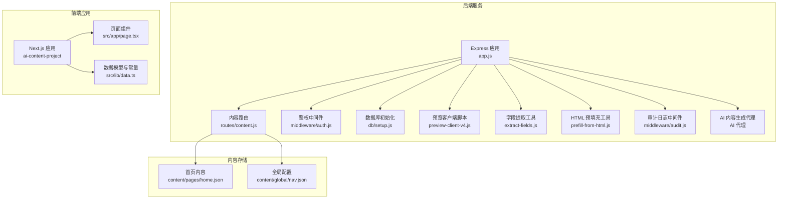
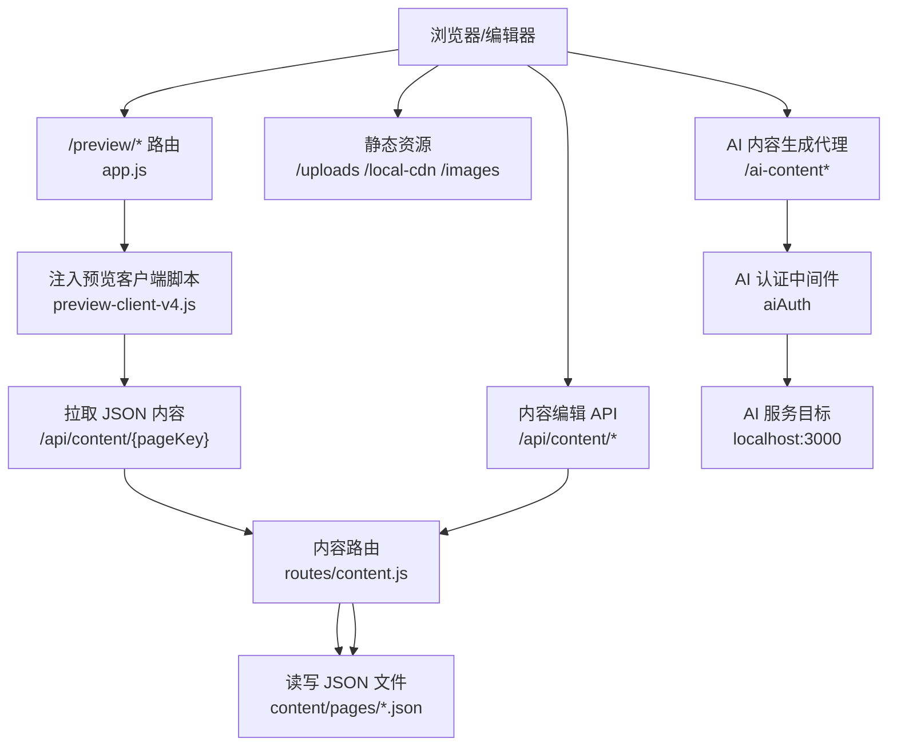
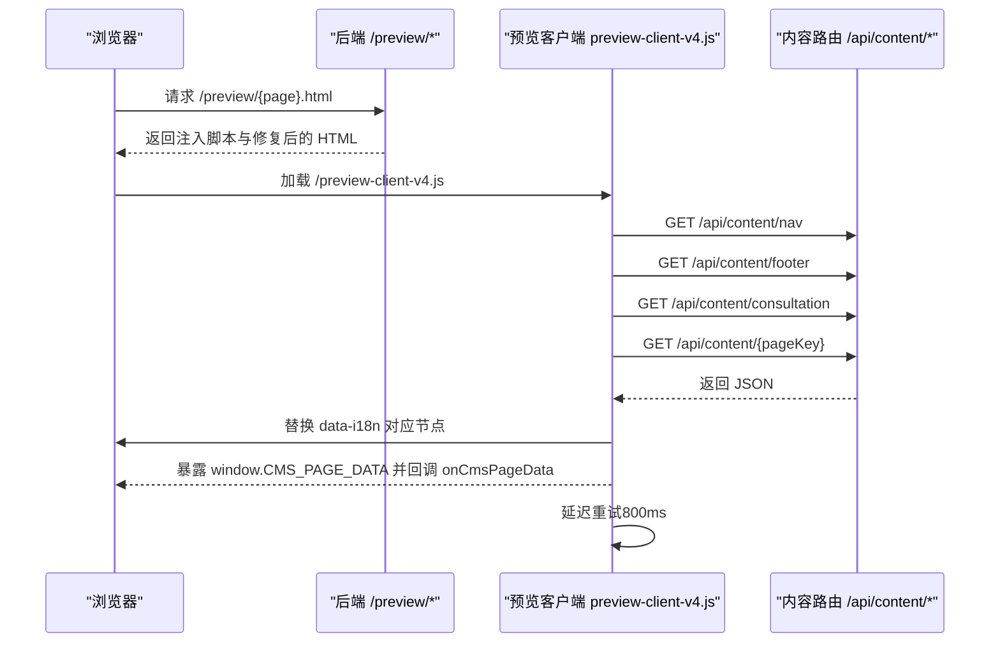
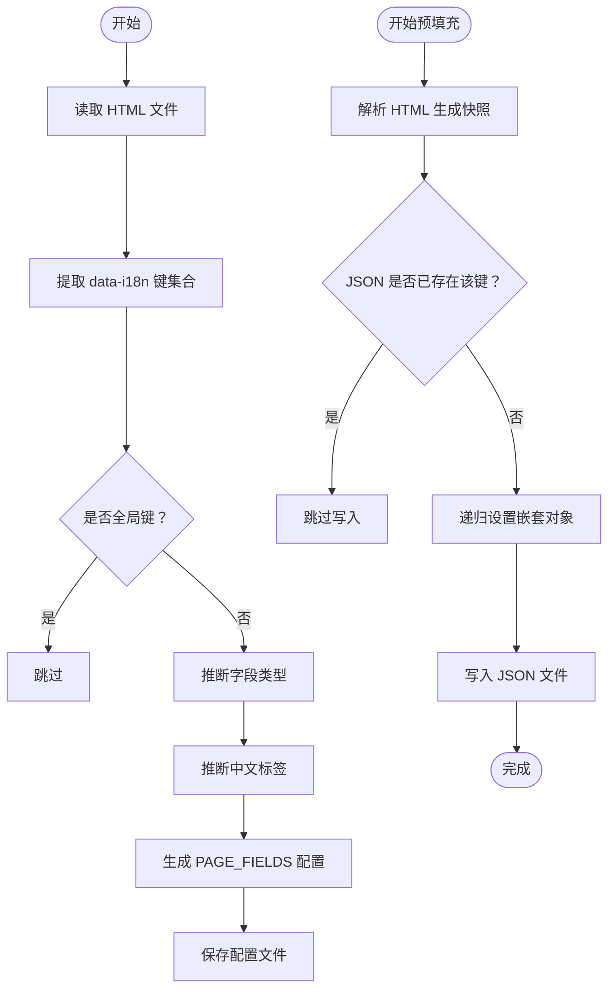
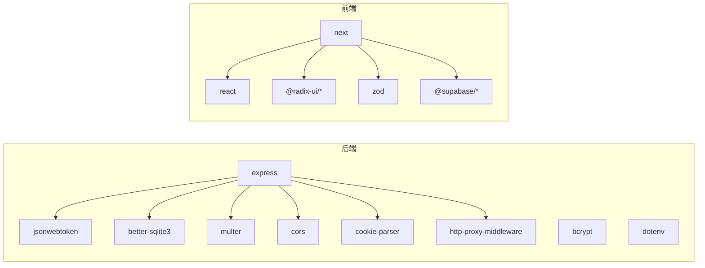

# 内容管理系统

<cite>
**本文引用的文件**
- [cms-server/app.js](file://cms-server/app.js)
- [cms-server/routes/content.js](file://cms-server/routes/content.js)
- [cms-server/preview-client-v4.js](file://cms-server/preview-client-v4.js)
- [cms-server/middleware/auth.js](file://cms-server/middleware/auth.js)
- [cms-server/db/setup.js](file://cms-server/db/setup.js)
- [cms-server/middleware/audit.js](file://cms-server/middleware/audit.js)
- [cms-server/extract-fields.js](file://cms-server/extract-fields.js)
- [cms-server/prefill-from-html.js](file://cms-server/prefill-from-html.js)
- [ai-content-project/src/app/page.tsx](file://ai-content-project/src/app/page.tsx)
- [ai-content-project/src/lib/data.ts](file://ai-content-project/src/lib/data.ts)
- [cms-server/package.json](file://cms-server/package.json)
- [ai-content-project/package.json](file://ai-content-project/package.json)
- [content/pages/home.json](file://content/pages/home.json)
- [content/global/nav.json](file://content/global/nav.json)
- [index.html](file://index.html)
</cite>

## 更新摘要
**变更内容**
- 新增完整的首页内容结构定义（home.json），包含162行JSON配置
- 新增核心服务卡片结构，支持5个服务卡片的标题、描述、CTA和URL
- 新增英雄区域配置，支持背景图片、标题、副标题和服务介绍
- 新增统计数据模块，包含客户数、国家数、经验和成功率统计
- 更新预览客户端以支持新的首页数据结构
- 新增首页HTML模板与JSON数据的完整绑定关系

## 目录
1. [简介](#简介)
2. [项目结构](#项目结构)
3. [核心组件](#核心组件)
4. [架构总览](#架构总览)
5. [详细组件分析](#详细组件分析)
6. [依赖关系分析](#依赖关系分析)
7. [性能考量](#性能考量)
8. [故障排查指南](#故障排查指南)
9. [结论](#结论)
10. [附录](#附录)

## 简介
本文件面向内容管理系统（CMS）的使用者与维护者，系统性阐述以下主题：
- 内容存储机制：JSON 文件结构、内容组织方式与数据同步策略
- 预览模式系统：预览客户端实现、实时更新机制与资源路径修复
- 数据提取与处理：HTML 字段提取、默认值处理与内容合并算法
- 内容 JSON 格式规范、键命名约定与多语言支持机制
- 使用示例、最佳实践与常见问题解决方案
- 与静态官网页面的集成方式与更新流程

## 项目结构
该仓库包含两大部分：
- 后端服务（cms-server）：基于 Node.js/Express 的 CMS 后端，提供内容读写、鉴权、上传、预览模式与静态资源托管等能力
- 前端应用（ai-content-project）：基于 Next.js 的内容管理界面，负责内容池展示、创建与编辑入口

**图表来源**
- [cms-server/app.js:1-315](file://cms-server/app.js#L1-L315)
- [cms-server/routes/content.js:1-104](file://cms-server/routes/content.js#L1-L104)
- [cms-server/preview-client-v4.js:1-340](file://cms-server/preview-client-v4.js#L1-L340)
- [cms-server/middleware/auth.js:1-86](file://cms-server/middleware/auth.js#L1-L86)
- [cms-server/db/setup.js:1-115](file://cms-server/db/setup.js#L1-L115)
- [cms-server/middleware/audit.js:1-75](file://cms-server/middleware/audit.js#L1-L75)
- [cms-server/extract-fields.js:1-112](file://cms-server/extract-fields.js#L1-L112)
- [cms-server/prefill-from-html.js:1-110](file://cms-server/prefill-from-html.js#L1-L110)
- [ai-content-project/src/app/page.tsx:1-285](file://ai-content-project/src/app/page.tsx#L1-L285)
- [ai-content-project/src/lib/data.ts:1-218](file://ai-content-project/src/lib/data.ts#L1-L218)
- [content/pages/home.json:1-162](file://content/pages/home.json#L1-L162)
- [content/global/nav.json:1-44](file://content/global/nav.json#L1-L44)

**章节来源**
- [cms-server/app.js:1-315](file://cms-server/app.js#L1-L315)
- [ai-content-project/src/app/page.tsx:1-285](file://ai-content-project/src/app/page.tsx#L1-L285)

## 核心组件
- 内容存储与读写
  - 后端通过路由读取/写入 JSON 文件，分别位于 content/global 与 content/pages 目录
  - 支持全局配置（导航、页脚、咨询弹窗）与页面内容（home/about/visa 等）
- 预览模式系统 v4
  - 将预览客户端脚本注入静态 HTML，按 data-i18n 键替换 DOM 文本与图片资源
  - 修复相对路径，使资源访问指向 /local-cdn 与 /images
  - 增强实时更新机制，支持延迟重试避免被业务脚本覆盖
- 鉴权与权限
  - JWT 鉴权，支持超级管理员与页面级编辑权限
  - 数据库管理用户权限和页面访问控制
- 数据提取与预填充
  - 从 HTML 提取 data-i18n 字段生成页面字段配置
  - 将 HTML 当前值预填充至 JSON，解决"编辑器打开时字段为空"的问题
- AI 内容生成代理
  - 支持多种认证方式（Authorization header、URL token、Cookie）
  - 代理 AI 内容生成服务，传递用户身份信息
- 操作审计日志
  - 记录所有写操作的审计日志，包括用户、操作类型、目标和详情

**章节来源**
- [cms-server/routes/content.js:1-104](file://cms-server/routes/content.js#L1-L104)
- [cms-server/app.js:103-153](file://cms-server/app.js#L103-L153)
- [cms-server/middleware/auth.js:1-86](file://cms-server/middleware/auth.js#L1-L86)
- [cms-server/extract-fields.js:1-112](file://cms-server/extract-fields.js#L1-L112)
- [cms-server/prefill-from-html.js:1-110](file://cms-server/prefill-from-html.js#L1-L110)
- [cms-server/app.js:163-225](file://cms-server/app.js#L163-L225)
- [cms-server/middleware/audit.js:1-75](file://cms-server/middleware/audit.js#L1-L75)

## 架构总览
后端以 Express 提供 API 与静态资源托管，前端 Next.js 应用负责内容池与创建入口。预览模式通过 /preview/* 路由将静态 HTML 注入预览客户端脚本并修复资源路径。

**图表来源**
- [cms-server/app.js:103-153](file://cms-server/app.js#L103-L153)
- [cms-server/routes/content.js:48-65](file://cms-server/routes/content.js#L48-L65)
- [cms-server/preview-client-v4.js:282-305](file://cms-server/preview-client-v4.js#L282-L305)
- [cms-server/app.js:163-225](file://cms-server/app.js#L163-L225)

## 详细组件分析

### 内容存储与同步机制
- 存储位置
  - 全局配置：content/global/nav.json、footer.json、consultation.json
  - 页面内容：content/pages/home.json、about.json、visa.json 等
- 读取逻辑
  - GET /api/content/:pageKey 返回对应 JSON；全局配置与页面键均受校验
- 写入逻辑
  - PUT /api/content/:pageKey 需鉴权；全局配置仅超级管理员可写；普通页面需具备页面权限
  - 写入成功后记录审计日志
- 同步策略
  - 预览模式下，前端直接从 /api/content/* 拉取最新 JSON，实现"所见即所得"
  - 预览客户端在 DOMContentLoaded 后执行一次应用，随后延迟重试，避免被业务脚本覆盖

**章节来源**
- [cms-server/routes/content.js:1-104](file://cms-server/routes/content.js#L1-L104)
- [cms-server/app.js:155-161](file://cms-server/app.js#L155-L161)

### 预览模式系统 v4
- 预览路由
  - /preview/* 将目标 HTML 注入 window.CMS_PREVIEW 与 window.CMS_PAGE_KEY，并注入 /preview-client-v4.js
  - 修复资源相对路径：href/src 中的 local-cdn 与 images 前缀改为绝对路径
- 预览客户端 v4
  - 解析 URL 获取 pageKey，拦截 applyTranslations/setLang 防止覆盖 CMS 注入内容
  - 依次应用导航、页脚、咨询弹窗与页面内容
  - 对 IMG 字段进行 URL 校验与绝对路径补全，对 INPUT/TEXTAREA 设置 value
  - 暴露 window.CMS_PAGE_DATA 并回调 onCmsPageData 通知业务脚本
  - 增强延迟重试机制，在 DOMContentLoaded 后延时再次应用页面内容

**图表来源**
- [cms-server/app.js:103-153](file://cms-server/app.js#L103-L153)
- [cms-server/preview-client-v4.js:282-305](file://cms-server/preview-client-v4.js#L282-L305)

**章节来源**
- [cms-server/app.js:103-153](file://cms-server/app.js#L103-L153)
- [cms-server/preview-client-v4.js:1-340](file://cms-server/preview-client-v4.js#L1-L340)

### 数据提取与处理
- 字段提取
  - 从 HTML 中提取所有 data-i18n 值，排除 nav./footer./modal. 前缀，输出 PAGE_FIELDS 配置模板
  - 支持多种字段类型的智能推断（text、textarea、image）
- 默认值处理
  - 一键将 HTML 当前值抓取到 JSON：文本去标签、实体转义还原、图片与背景图提取
  - 合并策略：仅在 JSON 中缺失时写入，不覆盖已有内容
- 内容合并算法
  - 递归构建嵌套对象：setNested 将扁平键（如 a.b.c）写入对象结构
  - 预填充完成后，编辑器打开即显示当前 HTML 的真实值
- 页面快照功能
  - /api/page-snapshot/:pageKey 提供 HTML 快照提取服务
  - 支持文本、图片、背景图等多种内容类型的提取

**图表来源**
- [cms-server/extract-fields.js:21-112](file://cms-server/extract-fields.js#L21-L112)
- [cms-server/prefill-from-html.js:19-110](file://cms-server/prefill-from-html.js#L19-L110)

**章节来源**
- [cms-server/extract-fields.js:1-112](file://cms-server/extract-fields.js#L1-L112)
- [cms-server/prefill-from-html.js:1-110](file://cms-server/prefill-from-html.js#L1-L110)
- [cms-server/app.js:232-299](file://cms-server/app.js#L232-L299)

### 首页内容结构定义
**更新** 新增完整的首页内容结构定义，包含核心服务卡片、英雄区域、统计数据等162行JSON配置

- 核心服务卡片结构（coreService）
  - 支持5个服务卡片：card1、card2、card3、card4、card5
  - 每个卡片包含：title（标题）、desc（描述）、cta（行动按钮文本）、url（跳转链接）
  - 支持全局标签和标题：tag、title、subtitle
- 英雄区域结构（hero）
  - bgImage：背景图片URL
  - title1/title2：主标题和副标题
  - subtitle：副标题描述
  - services：服务介绍文本
  - cta1/cta2：两个行动按钮文本
  - cta1_url/cta2_url：对应按钮的跳转链接
- 统计数据结构（stats）
  - clients：服务客户数量
  - countries：办理国家数量
  - experience：行业经验年数
  - rate：出签成功率
  - 每个统计项包含：value（数值）、unit（单位）、label（标签）

**章节来源**
- [content/pages/home.json:1-162](file://content/pages/home.json#L1-L162)
- [cms-server/preview-client-v4.js:221-280](file://cms-server/preview-client-v4.js#L221-L280)

### 内容 JSON 格式规范与键命名约定
- 键命名约定
  - 使用点分隔的扁平键表示嵌套结构，例如 hero.title1、faq.list[0].question
  - 全局字段以 nav./footer./modal. 前缀标识，不在页面 JSON 中重复定义
- 多语言支持
  - 字符串值支持 zh/en 双语对象；toString 优先取 zh，其次 en
  - 图片字段支持对象形式（含 src），或字符串 URL
- 示例键类型
  - 文本/描述：title、subtitle、desc、content、text
  - 图片/二维码：image/img/bg/background、qrWechat1、qrWechat2、qrWhatsapp
  - 列表/步骤：process.steps[n]、faq.list[n].question/answer
- 前端数据模型
  - ai-content-project/src/lib/data.ts 定义了内容项的数据结构与枚举类型，便于前端展示与筛选

**章节来源**
- [cms-server/preview-client-v4.js:57-67](file://cms-server/preview-client-v4.js#L57-L67)
- [ai-content-project/src/lib/data.ts:1-218](file://ai-content-project/src/lib/data.ts#L1-L218)

### AI 内容生成代理系统
- 多重认证支持
  - Authorization header：标准 JWT 令牌认证
  - URL query token：适用于 iframe 嵌入场景
  - Cookie fallback：Next.js 自身回传的 cms_token
- 代理配置
  - 目标服务：http://localhost:3000
  - 支持 WebSocket 通信
  - 自动传递用户身份信息（用户名、角色）
- Cookie 处理
  - 使用 cookie-parser 中间件处理 Cookie
  - 自动剥离路径前缀，确保 Express 正确路由

**章节来源**
- [cms-server/app.js:163-225](file://cms-server/app.js#L163-L225)

### 数据库与权限管理系统
- 数据库初始化
  - 创建 users、page_permissions、audit_log 表
  - 插入默认超级管理员账号（admin/admin123）
  - 自动分配所有页面权限给超级管理员
- 权限控制
  - 超级管理员：拥有所有页面的编辑权限
  - 普通编辑：仅能编辑分配给其的页面
  - 页面权限检查：通过数据库查询验证用户权限
- 审计日志
  - 记录所有写操作的详细信息
  - 包括用户 ID、用户名、操作类型、目标和请求体
  - 异步写入，不影响响应性能

**章节来源**
- [cms-server/db/setup.js:1-115](file://cms-server/db/setup.js#L1-L115)
- [cms-server/middleware/auth.js:1-86](file://cms-server/middleware/auth.js#L1-L86)
- [cms-server/middleware/audit.js:1-75](file://cms-server/middleware/audit.js#L1-L75)

### 与静态官网页面的集成与更新流程
- 集成方式
  - 后端托管静态 HTML，并在 /preview/* 路由注入预览客户端脚本
  - 修复资源相对路径，确保 /local-cdn 与 /images 正确访问
- 更新流程
  - 编辑器通过 /api/content/* 写入 JSON
  - 预览模式下，预览客户端从 /api/content/* 拉取最新内容并即时替换 DOM
  - 静态 HTML 与 JSON 解耦，更新无需改动 HTML 结构
- 快照提取
  - 支持从现有 HTML 快速提取当前值到 JSON
  - 解决编辑器首次打开字段为空的问题

**章节来源**
- [cms-server/app.js:103-153](file://cms-server/app.js#L103-L153)
- [cms-server/routes/content.js:48-65](file://cms-server/routes/content.js#L48-L65)
- [cms-server/app.js:232-299](file://cms-server/app.js#L232-L299)

## 依赖关系分析
- 后端依赖
  - Express、better-sqlite3、jsonwebtoken、multer、cors、cookie-parser、http-proxy-middleware
  - bcrypt、dotenv、http-proxy-middleware
- 前端依赖
  - Next.js、React、Tailwind UI 组件库、Zod、@supabase/* 等

**图表来源**
- [cms-server/package.json:10-20](file://cms-server/package.json#L10-L20)
- [ai-content-project/package.json:15-76](file://ai-content-project/package.json#L15-L76)

**章节来源**
- [cms-server/package.json:1-22](file://cms-server/package.json#L1-L22)
- [ai-content-project/package.json:1-100](file://ai-content-project/package.json#L1-L100)

## 性能考量
- 预览客户端延迟重试：在 DOMContentLoaded 后延时再次应用页面内容，降低被业务脚本覆盖的风险
- 静态资源路径修复：减少跨域与 404 报错，提升首屏渲染稳定性
- 预览模式禁用缓存：确保编辑器看到最新变更
- JSON 写入采用 UTF-8 与缩进格式，便于版本控制与人工审阅
- AI 代理异步处理：不阻塞主请求流程
- 审计日志异步写入：使用 setImmediate 确保不影响响应时间

## 故障排查指南
- 预览页面空白或资源 404
  - 检查 /preview/* 是否正确注入 /preview-client-v4.js 与资源路径修复逻辑
  - 确认 /local-cdn 与 /images 目录可访问
- 编辑器字段为空
  - 使用预填充工具将 HTML 当前值写入 JSON，避免覆盖已有内容
  - 检查 /api/page-snapshot/:pageKey 接口是否正常工作
- 权限不足
  - 普通编辑需具备页面权限；全局配置仅超级管理员可写
  - 检查数据库中的 page_permissions 表
- 写入失败
  - 检查 JSON 文件是否存在、权限是否正确以及磁盘空间
- AI 代理认证失败
  - 检查三种认证方式：Authorization header、URL token、Cookie
  - 确认 JWT_SECRET 配置正确
- 审计日志异常
  - 检查数据库连接和表结构
  - 确认 write permission 正常

**章节来源**
- [cms-server/app.js:103-153](file://cms-server/app.js#L103-L153)
- [cms-server/prefill-from-html.js:89-107](file://cms-server/prefill-from-html.js#L89-L107)
- [cms-server/middleware/auth.js:37-63](file://cms-server/middleware/auth.js#L37-L63)
- [cms-server/app.js:163-225](file://cms-server/app.js#L163-L225)
- [cms-server/middleware/audit.js:22-40](file://cms-server/middleware/audit.js#L22-L40)

## 结论
本系统通过"静态 HTML + JSON 内容 + 预览客户端"的组合，实现了低耦合、强扩展的内容管理与预览体验。后端提供安全可控的读写接口与权限体系，前端提供直观的内容池与创建入口。借助数据提取与预填充工具，编辑器开箱即用且与现有静态页面无缝衔接。新增的 AI 内容生成代理和审计日志系统进一步增强了系统的完整性和可维护性。最新的首页内容结构定义为整个网站提供了完整的数据支撑框架。

## 附录
- 使用示例
  - 预览某页面：访问 http://localhost:3001/preview/index.html
  - 编辑页面内容：PUT /api/content/home（需鉴权）
  - 抓取默认值：运行预填充脚本，将 HTML 当前值写入 JSON
  - 提取字段配置：运行 extract-fields.js 脚本生成 PAGE_FIELDS
  - AI 内容生成：通过 /ai-content* 路由访问 AI 服务
- 最佳实践
  - 为每个页面维护独立 JSON；避免在 HTML 中硬编码文案
  - 使用 data-i18n 键统一管理可编辑字段，配合 PAGE_FIELDS 配置
  - 全局配置（nav/footer/modal）集中管理，避免分散在各页面
  - 图片字段优先使用绝对路径或 CDN 地址，确保预览与生产一致
  - 定期检查审计日志，监控系统使用情况
  - 合理设置权限，遵循最小权限原则
- 常见问题
  - 预览客户端拦截业务脚本：确认预览模式下 applyTranslations/setLang 已被拦截
  - 跨域与缓存：预览模式禁用缓存；静态资源通过 /local-cdn 与 /images 访问
  - AI 代理无法认证：检查三种认证方式的配置和令牌有效性
  - 数据库初始化失败：确认文件权限和 SQLite 环境配置
  - 首页数据结构不匹配：确保 home.json 的键名与 HTML 中的 data-i18n 完全对应