# 数据提取与处理

<cite>
**本文引用的文件**
- [extract-fields.js](file://business-core/cms-server/extract-fields.js)
- [prefill-from-html.js](file://business-core/cms-server/prefill-from-html.js)
- [generate-page-fields.js](file://business-core/cms-server/generate-page-fields.js)
- [update-page-fields.js](file://business-core/cms-server/update-page-fields.js)
- [full-page-fields.js](file://business-core/cms-server/full-page-fields.js)
- [improve-labels.js](file://business-core/cms-server/improve-labels.js)
- [clean-en-fields.js](file://business-core/cms-server/clean-en-fields.js)
- [add-image-datai18n.js](file://business-core/cms-server/add-image-datai18n.js)
- [preview-client.js](file://business-core/cms-server/preview-client.js)
- [page-fields-config.js](file://business-core/cms-server/page-fields-config.js)
- [test-api.js](file://business-core/cms-server/test-api.js)
</cite>

## 目录
1. [引言](#引言)
2. [项目结构](#项目结构)
3. [核心组件](#核心组件)
4. [架构总览](#架构总览)
5. [详细组件分析](#详细组件分析)
6. [依赖关系分析](#依赖关系分析)
7. [性能考量](#性能考量)
8. [故障排查指南](#故障排查指南)
9. [结论](#结论)
10. [附录](#附录)

## 引言
本文件聚焦“数据提取与处理”模块，系统性阐述以下能力：
- HTML字段提取算法：data-i18n标记识别与内容解析机制
- 默认值处理策略：字段默认值设置与继承规则
- 内容合并算法：数据库内容与默认值的合并逻辑
- 字段配置生成机制：页面字段的自动生成与更新策略
- 字段验证规则与数据清理策略
- 错误处理机制与常见问题排查
- 提供提取示例、处理流程图与序列图

## 项目结构
该模块位于 business-core/cms-server 下，围绕“从HTML提取字段配置、预填充内容、生成/更新字段配置、清理多语言残留、预览客户端应用内容”等任务展开。

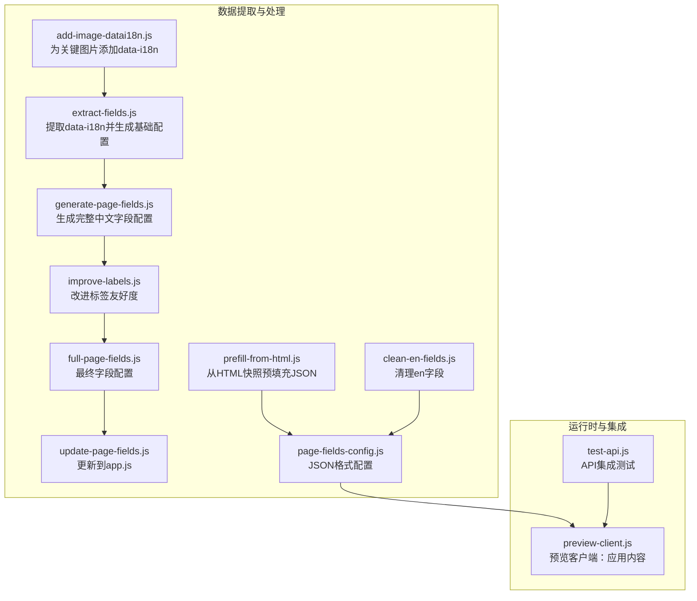

图表来源
- [extract-fields.js:1-112](file://business-core/cms-server/extract-fields.js#L1-L112)
- [prefill-from-html.js:1-110](file://business-core/cms-server/prefill-from-html.js#L1-L110)
- [generate-page-fields.js:1-419](file://business-core/cms-server/generate-page-fields.js#L1-L419)
- [improve-labels.js:1-327](file://business-core/cms-server/improve-labels.js#L1-L327)
- [update-page-fields.js:1-55](file://business-core/cms-server/update-page-fields.js#L1-L55)
- [full-page-fields.js:1-604](file://business-core/cms-server/full-page-fields.js#L1-L604)
- [page-fields-config.js:1-800](file://business-core/cms-server/page-fields-config.js#L1-L800)
- [preview-client.js:1-308](file://business-core/cms-server/preview-client.js#L1-L308)
- [test-api.js:1-104](file://business-core/cms-server/test-api.js#L1-L104)

章节来源
- [extract-fields.js:1-112](file://business-core/cms-server/extract-fields.js#L1-L112)
- [prefill-from-html.js:1-110](file://business-core/cms-server/prefill-from-html.js#L1-L110)
- [generate-page-fields.js:1-419](file://business-core/cms-server/generate-page-fields.js#L1-L419)
- [improve-labels.js:1-327](file://business-core/cms-server/improve-labels.js#L1-L327)
- [update-page-fields.js:1-55](file://business-core/cms-server/update-page-fields.js#L1-L55)
- [full-page-fields.js:1-604](file://business-core/cms-server/full-page-fields.js#L1-L604)
- [page-fields-config.js:1-800](file://business-core/cms-server/page-fields-config.js#L1-L800)
- [preview-client.js:1-308](file://business-core/cms-server/preview-client.js#L1-L308)
- [test-api.js:1-104](file://business-core/cms-server/test-api.js#L1-L104)

## 核心组件
- HTML字段提取器：从HTML中抽取data-i18n键，去重并排序，推断类型与标签，输出配置模板
- 快照预填充器：解析HTML中的文本、图片与背景图，生成初始JSON快照，并与现有JSON进行增量合并
- 字段配置生成器：维护页面字段清单，生成完整中文标签与类型定义
- 标签改进器：基于映射表与启发式规则优化标签可读性
- 配置更新器：将JSON配置转换为JS代码并注入到前端app.js
- 图片data-i18n补全器：为关键图片添加data-i18n属性，确保图片可编辑
- 内容清理器：移除JSON中的en字段，修复zh/en不一致问题
- 预览客户端：从后端API拉取内容，应用到DOM，支持预览模式下的拦截与延迟重试
- API测试器：集成测试鉴权、权限与操作日志

章节来源
- [extract-fields.js:21-48](file://business-core/cms-server/extract-fields.js#L21-L48)
- [prefill-from-html.js:19-69](file://business-core/cms-server/prefill-from-html.js#L19-L69)
- [generate-page-fields.js:8-408](file://business-core/cms-server/generate-page-fields.js#L8-L408)
- [improve-labels.js:8-238](file://business-core/cms-server/improve-labels.js#L8-L238)
- [update-page-fields.js:8-49](file://business-core/cms-server/update-page-fields.js#L8-L49)
- [add-image-datai18n.js:10-55](file://business-core/cms-server/add-image-datai18n.js#L10-L55)
- [clean-en-fields.js:10-27](file://business-core/cms-server/clean-en-fields.js#L10-L27)
- [preview-client.js:45-290](file://business-core/cms-server/preview-client.js#L45-L290)
- [test-api.js:13-101](file://business-core/cms-server/test-api.js#L13-L101)

## 架构总览
数据流从HTML页面出发，经由提取与预填充，生成字段配置，再由预览客户端消费后端内容，最终在浏览器中呈现。

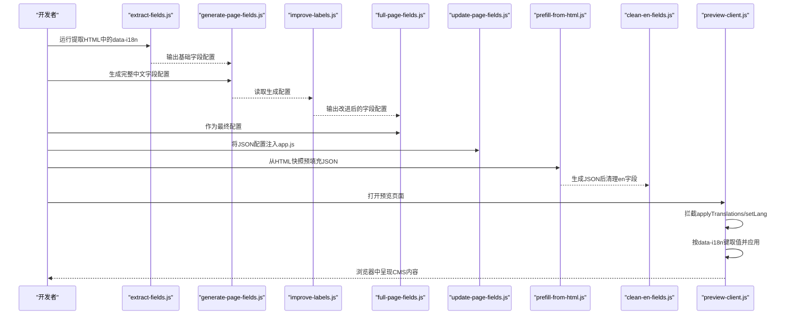

图表来源
- [extract-fields.js:83-112](file://business-core/cms-server/extract-fields.js#L83-L112)
- [generate-page-fields.js:410-419](file://business-core/cms-server/generate-page-fields.js#L410-L419)
- [improve-labels.js:240-327](file://business-core/cms-server/improve-labels.js#L240-L327)
- [full-page-fields.js:6-604](file://business-core/cms-server/full-page-fields.js#L6-L604)
- [update-page-fields.js:21-55](file://business-core/cms-server/update-page-fields.js#L21-L55)
- [prefill-from-html.js:74-110](file://business-core/cms-server/prefill-from-html.js#L74-L110)
- [clean-en-fields.js:29-43](file://business-core/cms-server/clean-en-fields.js#L29-L43)
- [preview-client.js:292-308](file://business-core/cms-server/preview-client.js#L292-L308)

## 详细组件分析

### 组件A：HTML字段提取与配置生成
- 功能概述
  - 从HTML中提取data-i18n键，排除全局命名空间（如nav./footer./modal.），去重并排序
  - 基于键名推断字段类型（text/textarea/image），并生成中文标签
  - 输出PAGE_FIELDS配置模板，供后续人工调整与合并
- 关键实现
  - 正则匹配data-i18n属性，过滤全局前缀
  - 类型推断：包含image/img/qr/photo归类为image；包含desc/content/text/intro归类为textarea；其余为text
  - 标签推断：基于最后一段键名映射中文标签，若无映射则回退为原键名
  - 输出JS配置并保存至目标目录
- 示例
  - 输入HTML包含若干data-i18n键，输出对应PAGE_FIELDS条目（key/label/type）

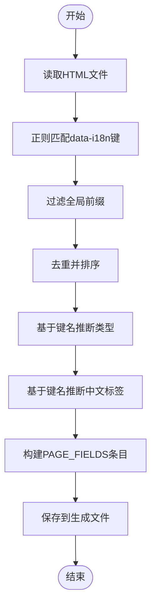

图表来源
- [extract-fields.js:21-48](file://business-core/cms-server/extract-fields.js#L21-L48)
- [extract-fields.js:83-112](file://business-core/cms-server/extract-fields.js#L83-L112)

章节来源
- [extract-fields.js:21-48](file://business-core/cms-server/extract-fields.js#L21-L48)
- [extract-fields.js:83-112](file://business-core/cms-server/extract-fields.js#L83-L112)

### 组件B：图片data-i18n补全
- 功能概述
  - 为关键图片（如Hero背景、侧边栏二维码等）添加data-i18n属性，确保图片可被CMS编辑
- 关键实现
  - 针对指定页面的图片替换规则，使用正则定位并注入data-i18n
  - 对其他页面统一扫描并添加二维码相关属性
- 示例
  - 将背景图或二维码图片的标签增加data-i18n属性，键名遵循约定规范

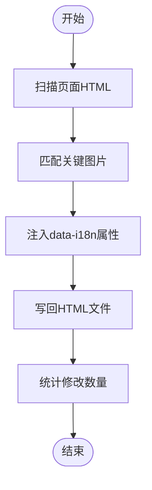

图表来源
- [add-image-datai18n.js:29-55](file://business-core/cms-server/add-image-datai18n.js#L29-L55)
- [add-image-datai18n.js:60-96](file://business-core/cms-server/add-image-datai18n.js#L60-L96)

章节来源
- [add-image-datai18n.js:10-55](file://business-core/cms-server/add-image-datai18n.js#L10-L55)
- [add-image-datai18n.js:60-96](file://business-core/cms-server/add-image-datai18n.js#L60-L96)

### 组件C：快照预填充与增量合并
- 功能概述
  - 从HTML中解析文本、图片与背景图，生成初始JSON快照
  - 与现有JSON进行增量合并：仅在目标路径不存在时写入，避免覆盖已有内容
- 关键实现
  - 文本解析：去除HTML标签、实体、换行符，保留中文
  - 图片解析：提取src或style中的url，生成字符串或对象
  - 嵌套写入：setNested递归构建嵌套对象，确保路径存在
  - 合并策略：仅当目标路径不存在时写入，统计新增字段数
- 示例
  - 遍历PAGE_MAP映射，逐页生成快照并合并到对应JSON

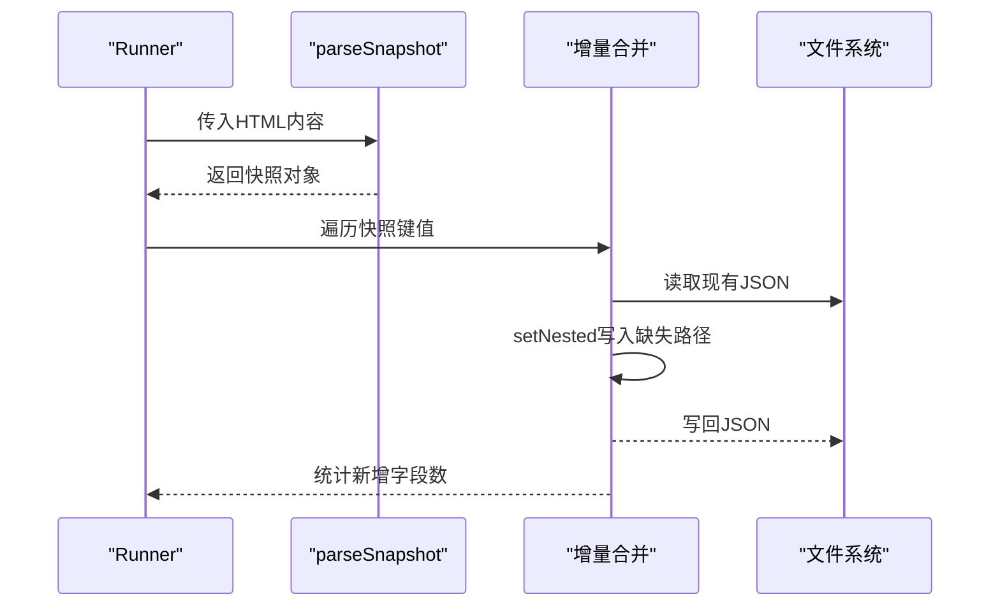

图表来源
- [prefill-from-html.js:19-54](file://business-core/cms-server/prefill-from-html.js#L19-L54)
- [prefill-from-html.js:56-69](file://business-core/cms-server/prefill-from-html.js#L56-L69)
- [prefill-from-html.js:74-107](file://business-core/cms-server/prefill-from-html.js#L74-L107)

章节来源
- [prefill-from-html.js:19-54](file://business-core/cms-server/prefill-from-html.js#L19-L54)
- [prefill-from-html.js:56-69](file://business-core/cms-server/prefill-from-html.js#L56-L69)
- [prefill-from-html.js:74-107](file://business-core/cms-server/prefill-from-html.js#L74-L107)

### 组件D：字段配置生成与更新
- 功能概述
  - 维护完整中文字段配置（PAGE_FIELDS），包含页面键、字段键、中文标签与类型
  - 将JSON配置转换为JS代码并注入到前端app.js
- 关键实现
  - 生成完整配置：遍历页面与字段，输出结构化数组
  - 更新到app.js：正则匹配PAGE_FIELDS区块并替换
- 示例
  - 生成page-fields-config.js，再由update-page-fields.js注入app.js

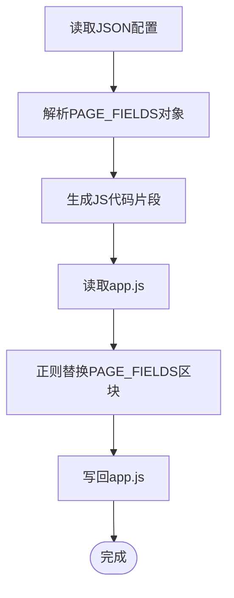

图表来源
- [generate-page-fields.js:8-408](file://business-core/cms-server/generate-page-fields.js#L8-L408)
- [generate-page-fields.js:410-419](file://business-core/cms-server/generate-page-fields.js#L410-L419)
- [update-page-fields.js:8-49](file://business-core/cms-server/update-page-fields.js#L8-L49)

章节来源
- [generate-page-fields.js:8-408](file://business-core/cms-server/generate-page-fields.js#L8-L408)
- [generate-page-fields.js:410-419](file://business-core/cms-server/generate-page-fields.js#L410-L419)
- [update-page-fields.js:8-49](file://business-core/cms-server/update-page-fields.js#L8-L49)

### 组件E：标签改进与最终配置
- 功能概述
  - 基于映射表与启发式规则改进标签，提升可读性
  - 生成最终字段配置（full-page-fields.js），用于预览与生产
- 关键实现
  - 映射表：针对常见键提供中文标签
  - 启发式：按最后一段键名映射常用语义
  - 输出最终配置文件，供预览客户端使用

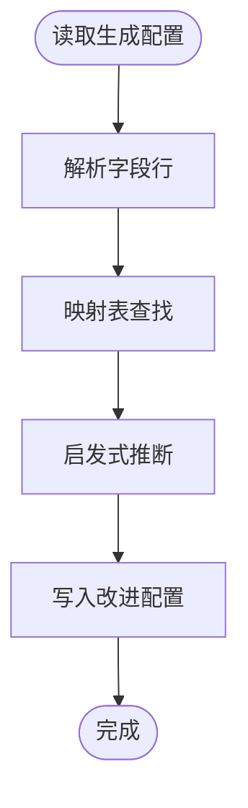

图表来源
- [improve-labels.js:240-327](file://business-core/cms-server/improve-labels.js#L240-L327)
- [full-page-fields.js:6-604](file://business-core/cms-server/full-page-fields.js#L6-L604)

章节来源
- [improve-labels.js:8-238](file://business-core/cms-server/improve-labels.js#L8-L238)
- [improve-labels.js:240-327](file://business-core/cms-server/improve-labels.js#L240-L327)
- [full-page-fields.js:6-604](file://business-core/cms-server/full-page-fields.js#L6-L604)

### 组件F：内容清理与一致性
- 功能概述
  - 清理JSON中的en字段，仅保留zh
  - 若zh为空而en有值，则将en值迁移至zh，保证一致性
- 关键实现
  - 递归遍历对象，过滤en字段
  - 修复空值迁移逻辑

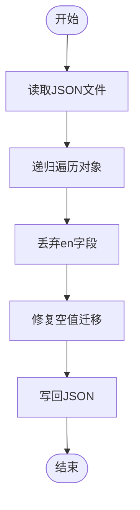

图表来源
- [clean-en-fields.js:10-27](file://business-core/cms-server/clean-en-fields.js#L10-L27)
- [clean-en-fields.js:29-43](file://business-core/cms-server/clean-en-fields.js#L29-L43)

章节来源
- [clean-en-fields.js:10-27](file://business-core/cms-server/clean-en-fields.js#L10-L27)
- [clean-en-fields.js:29-43](file://business-core/cms-server/clean-en-fields.js#L29-L43)

### 组件G：预览客户端内容应用
- 功能概述
  - 预览客户端注入到/preview/*.html，从后端API加载内容并替换DOM
  - 拦截applyTranslations/setLang，防止覆盖CMS注入内容
  - 支持导航、页脚、咨询弹窗与页面内容的多源应用
- 关键实现
  - URL解析pageKey，映射到页面键
  - getVal/toString安全取值与字符串化，优先zh
  - applyPageContent按data-i18n键取值并应用到DOM，图片字段仅接受URL
  - 延迟重试，确保覆盖顺序正确

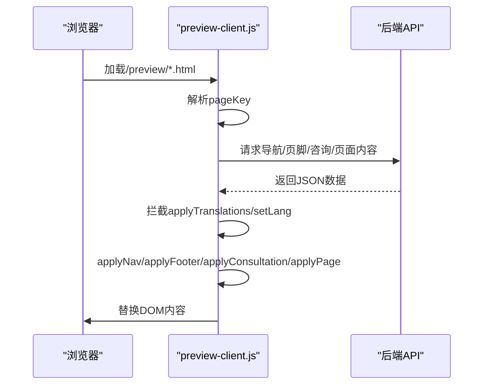

图表来源
- [preview-client.js:8-28](file://business-core/cms-server/preview-client.js#L8-L28)
- [preview-client.js:33-43](file://business-core/cms-server/preview-client.js#L33-L43)
- [preview-client.js:224-290](file://business-core/cms-server/preview-client.js#L224-L290)

章节来源
- [preview-client.js:8-28](file://business-core/cms-server/preview-client.js#L8-L28)
- [preview-client.js:33-43](file://business-core/cms-server/preview-client.js#L33-L43)
- [preview-client.js:224-290](file://business-core/cms-server/preview-client.js#L224-L290)

### 组件H：API集成测试
- 功能概述
  - 验证鉴权、权限控制、写入与日志接口
- 关键实现
  - 登录获取token，校验/me与/users接口
  - 创建编辑账号并测试读写权限
  - 超级管理员写全局配置并验证

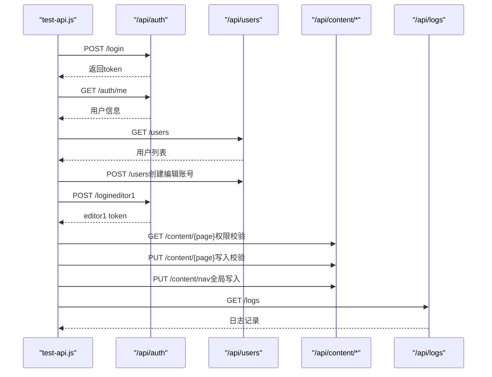

图表来源
- [test-api.js:13-101](file://business-core/cms-server/test-api.js#L13-L101)

章节来源
- [test-api.js:13-101](file://business-core/cms-server/test-api.js#L13-L101)

## 依赖关系分析
- 模块内依赖
  - extract-fields.js 与 add-image-datai18n.js 共同作用于HTML准备阶段
  - generate-page-fields.js 与 improve-labels.js 与 full-page-fields.js 形成配置生成链路
  - prefill-from-html.js 与 page-fields-config.js 与 clean-en-fields.js 形成内容预填充与清理链路
  - update-page-fields.js 依赖page-fields-config.js并写回app.js
  - preview-client.js 依赖后端API与data-i18n键约定
- 外部依赖
  - Node.js内置fs/path模块
  - 浏览器环境下的fetch与DOM API

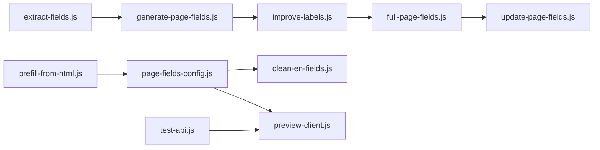

图表来源
- [extract-fields.js:83-112](file://business-core/cms-server/extract-fields.js#L83-L112)
- [generate-page-fields.js:410-419](file://business-core/cms-server/generate-page-fields.js#L410-L419)
- [improve-labels.js:240-327](file://business-core/cms-server/improve-labels.js#L240-L327)
- [full-page-fields.js:6-604](file://business-core/cms-server/full-page-fields.js#L6-L604)
- [prefill-from-html.js:74-107](file://business-core/cms-server/prefill-from-html.js#L74-L107)
- [page-fields-config.js:1-800](file://business-core/cms-server/page-fields-config.js#L1-L800)
- [clean-en-fields.js:29-43](file://business-core/cms-server/clean-en-fields.js#L29-L43)
- [update-page-fields.js:21-55](file://business-core/cms-server/update-page-fields.js#L21-L55)
- [preview-client.js:292-308](file://business-core/cms-server/preview-client.js#L292-L308)
- [test-api.js:13-101](file://business-core/cms-server/test-api.js#L13-L101)

章节来源
- [extract-fields.js:83-112](file://business-core/cms-server/extract-fields.js#L83-L112)
- [generate-page-fields.js:410-419](file://business-core/cms-server/generate-page-fields.js#L410-L419)
- [improve-labels.js:240-327](file://business-core/cms-server/improve-labels.js#L240-L327)
- [full-page-fields.js:6-604](file://business-core/cms-server/full-page-fields.js#L6-L604)
- [prefill-from-html.js:74-107](file://business-core/cms-server/prefill-from-html.js#L74-L107)
- [page-fields-config.js:1-800](file://business-core/cms-server/page-fields-config.js#L1-L800)
- [clean-en-fields.js:29-43](file://business-core/cms-server/clean-en-fields.js#L29-L43)
- [update-page-fields.js:21-55](file://business-core/cms-server/update-page-fields.js#L21-L55)
- [preview-client.js:292-308](file://business-core/cms-server/preview-client.js#L292-L308)
- [test-api.js:13-101](file://business-core/cms-server/test-api.js#L13-L101)

## 性能考量
- 正则匹配与字符串替换
  - data-i18n提取与图片属性注入使用正则，建议在HTML规模较大时避免重复编译正则，可考虑缓存或预编译
- 文件I/O
  - 多文件读写与JSON解析可能成为瓶颈，建议批量处理与并发优化（当前脚本为串行，可评估并行化）
- DOM应用
  - 预览客户端多次应用内容与延迟重试，注意避免重复渲染与闪烁，可通过防抖或节流优化

## 故障排查指南
- data-i18n未生效
  - 检查HTML是否正确添加data-i18n属性，确认键名与配置一致
  - 确认预览客户端未拦截applyTranslations/setLang导致内容被覆盖
- 字段类型错误
  - 检查extract-fields.js的类型推断规则，必要时手动修正生成配置
- 标签不可读
  - 使用improve-labels.js生成改进版配置，或在映射表中补充键名映射
- JSON中残留en字段
  - 运行clean-en-fields.js清理en字段，或修复空值迁移逻辑
- 权限与鉴权问题
  - 使用test-api.js验证登录、权限与写入行为，检查返回状态码与响应体

章节来源
- [preview-client.js:33-43](file://business-core/cms-server/preview-client.js#L33-L43)
- [extract-fields.js:44-48](file://business-core/cms-server/extract-fields.js#L44-L48)
- [improve-labels.js:240-327](file://business-core/cms-server/improve-labels.js#L240-L327)
- [clean-en-fields.js:10-27](file://business-core/cms-server/clean-en-fields.js#L10-L27)
- [test-api.js:13-101](file://business-core/cms-server/test-api.js#L13-L101)

## 结论
该模块通过“提取—预填充—生成—更新—清理—预览”的闭环，实现了从HTML到CMS字段配置与内容的自动化与半自动化流程。其设计强调：
- 易扩展：通过映射表与启发式规则提升标签质量
- 可维护：清晰的分层与职责划分，便于调试与演进
- 可验证：配套的预览客户端与API测试，保障集成质量

## 附录
- 字段验证规则
  - 文本字段：优先使用zh，若为空则回退en
  - 图片字段：仅接受URL，支持本地与绝对路径
  - 嵌套路径：setNested按点号分隔逐层构建
- 数据清理策略
  - 删除en字段，修复空值迁移
  - 保持JSON结构稳定，避免破坏既有数据