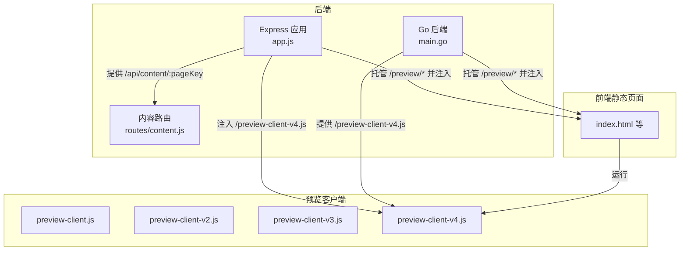
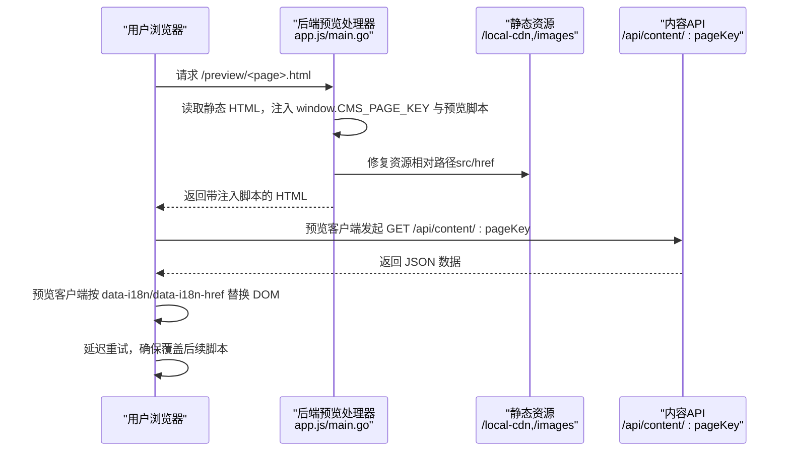
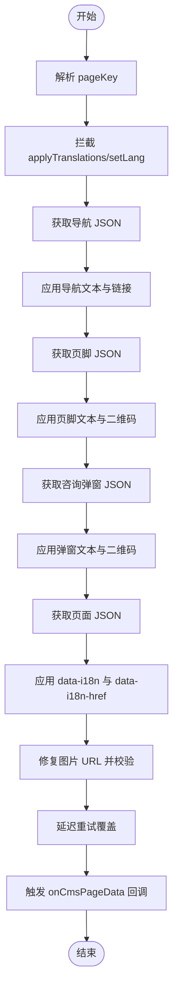
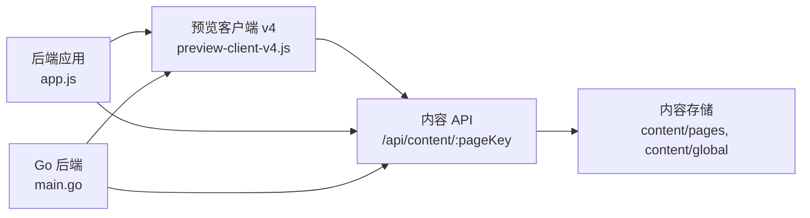

# 预览模式系统

<cite>
**本文档引用的文件**
- [business-core/cms-server/app.js](file://business-core/cms-server/app.js)
- [business-core/cms-server/routes/content.js](file://business-core/cms-server/routes/content.js)
- [business-core/cms-server/preview-client.js](file://business-core/cms-server/preview-client.js)
- [business-core/cms-server/preview-client-v2.js](file://business-core/cms-server/preview-client-v2.js)
- [business-core/cms-server/preview-client-v3.js](file://business-core/cms-server/preview-client-v3.js)
- [business-core/cms-server/preview-client-v4.js](file://business-core/cms-server/preview-client-v4.js)
- [business-core/cms-server-go/main.go](file://business-core/cms-server-go/main.go)
- [ai-content-project/src/app/page.tsx](file://ai-content-project/src/app/page.tsx)
- [ai-content-project/package.json](file://ai-content-project/package.json)
</cite>

## 目录
1. [简介](#简介)
2. [项目结构](#项目结构)
3. [核心组件](#核心组件)
4. [架构总览](#架构总览)
5. [详细组件分析](#详细组件分析)
6. [依赖关系分析](#依赖关系分析)
7. [性能考虑](#性能考虑)
8. [故障排除指南](#故障排除指南)
9. [结论](#结论)
10. [附录](#附录)

## 简介
本文件面向“预览模式系统”的使用者与维护者，系统性阐述预览客户端的实现原理、实时更新机制、事件监听与资源路径修复策略；详解从内容变更到页面刷新的完整工作流程；提供配置选项、性能优化建议与调试方法；并说明与静态页面生成的集成方式。

## 项目结构
该仓库包含两套后端实现（Node.js 与 Go）、一套前端 Next.js 应用以及若干预览客户端版本。预览模式通过后端将静态 HTML 注入预览客户端脚本并修复资源路径，使浏览器在本地即可看到 CMS 内容驱动的页面效果。

图表来源
- [business-core/cms-server/app.js:103-153](file://business-core/cms-server/app.js#L103-L153)
- [business-core/cms-server/routes/content.js:48-65](file://business-core/cms-server/routes/content.js#L48-L65)
- [business-core/cms-server/preview-client-v4.js:1-323](file://business-core/cms-server/preview-client-v4.js#L1-L323)
- [business-core/cms-server-go/main.go:146-207](file://business-core/cms-server-go/main.go#L146-L207)

章节来源
- [business-core/cms-server/app.js:103-153](file://business-core/cms-server/app.js#L103-L153)
- [business-core/cms-server/routes/content.js:1-104](file://business-core/cms-server/routes/content.js#L1-L104)
- [business-core/cms-server/preview-client-v4.js:1-323](file://business-core/cms-server/preview-client-v4.js#L1-L323)
- [business-core/cms-server-go/main.go:146-207](file://business-core/cms-server-go/main.go#L146-L207)

## 核心组件
- 预览客户端（多版本演进）
  - 负责从内容 API 获取 JSON，解析 pageKey，按 data-i18n 与 data-i18n-href 定位 DOM 并进行替换。
  - 支持导航、页脚、咨询弹窗与页面内容四类数据的批量应用。
  - 版本差异体现在对链接修复、图片 URL 校验、延迟重试与回调通知等方面。
- 后端预览处理器
  - Express 与 Go 双栈实现，统一逻辑：读取静态 HTML，修复资源相对路径，注入预览脚本与 pageKey，禁用缓存并返回。
- 内容 API
  - 提供 GET /api/content/:pageKey 读取页面 JSON；支持全局 nav/footer/consultation 与页面类键集合。

章节来源
- [business-core/cms-server/preview-client-v4.js:69-323](file://business-core/cms-server/preview-client-v4.js#L69-L323)
- [business-core/cms-server/app.js:103-153](file://business-core/cms-server/app.js#L103-L153)
- [business-core/cms-server/routes/content.js:48-65](file://business-core/cms-server/routes/content.js#L48-L65)
- [business-core/cms-server-go/main.go:146-207](file://business-core/cms-server-go/main.go#L146-L207)

## 架构总览
预览模式的关键流程如下：

图表来源
- [business-core/cms-server/app.js:103-153](file://business-core/cms-server/app.js#L103-L153)
- [business-core/cms-server/routes/content.js:48-65](file://business-core/cms-server/routes/content.js#L48-L65)
- [business-core/cms-server/preview-client-v4.js:221-323](file://business-core/cms-server/preview-client-v4.js#L221-L323)
- [business-core/cms-server-go/main.go:146-207](file://business-core/cms-server-go/main.go#L146-L207)

## 详细组件分析

### 预览客户端实现原理
- pageKey 解析
  - 从 URL 路径推断 pageKey，避免依赖服务端注入变量，提升稳定性。
- 全局拦截
  - 拦截 applyTranslations 与 setLang，防止业务脚本覆盖预览客户端注入的内容。
- 数据应用流程
  - 导航、页脚、咨询弹窗：按固定字段映射更新文本与图片 src。
  - 页面内容：遍历 [data-i18n] 与 [data-i18n-href]，按路径取值并替换。
- 图片资源路径修复
  - 对 IMG 标签进行 URL 校验，确保为绝对路径或可识别的图片扩展名；若非 URL 则跳过并记录警告。
  - 为避免 base 标签影响，强制补全绝对路径前缀。
- 延迟重试
  - 在 DOMContentLoaded 后延时再次应用，以对抗后续脚本覆盖。
- 回调通知
  - 将页面 JSON 暴露至 window.CMS_PAGE_DATA，并触发 window.onCmsPageData 回调，便于业务脚本二次渲染结构化字段。

图表来源
- [business-core/cms-server/preview-client-v4.js:69-323](file://business-core/cms-server/preview-client-v4.js#L69-L323)

章节来源
- [business-core/cms-server/preview-client-v4.js:1-323](file://business-core/cms-server/preview-client-v4.js#L1-L323)
- [business-core/cms-server/preview-client-v3.js:1-285](file://business-core/cms-server/preview-client-v3.js#L1-L285)
- [business-core/cms-server/preview-client-v2.js:1-247](file://business-core/cms-server/preview-client-v2.js#L1-L247)
- [business-core/cms-server/preview-client.js:1-308](file://business-core/cms-server/preview-client.js#L1-L308)

### 实时更新机制与事件监听
- 预览客户端在页面加载完成后立即拉取内容并应用；随后在固定时间点进行延迟重试，以应对页面其他脚本的 DOM 修改。
- 通过 window.onCmsPageData 回调暴露结构化数据，允许业务脚本在数据就绪后执行二次渲染。

章节来源
- [business-core/cms-server/preview-client-v4.js:282-323](file://business-core/cms-server/preview-client-v4.js#L282-L323)
- [business-core/cms-server/preview-client-v3.js:250-267](file://business-core/cms-server/preview-client-v3.js#L250-L267)
- [business-core/cms-server/preview-client-v2.js:212-229](file://business-core/cms-server/preview-client-v2.js#L212-L229)
- [business-core/cms-server/preview-client.js:267-290](file://business-core/cms-server/preview-client.js#L267-L290)

### 资源路径修复机制
- 后端在注入预览脚本之前，将 HTML 中的 local-cdn 与 images 相对路径替换为绝对路径，保证资源访问稳定。
- 预览客户端对 IMG src 进行 URL 校验与绝对路径补全，避免因 base 标签或相对路径导致的资源加载失败。
- 预览模式下的导航链接在客户端侧被转换为 /preview/xxx.html，以便在预览环境中正确跳转。

章节来源
- [business-core/cms-server/app.js:127-135](file://business-core/cms-server/app.js#L127-L135)
- [business-core/cms-server/preview-client-v4.js:91-98](file://business-core/cms-server/preview-client-v4.js#L91-L98)
- [business-core/cms-server/preview-client-v3.js:226-236](file://business-core/cms-server/preview-client-v3.js#L226-L236)
- [business-core/cms-server/preview-client-v2.js:58-62](file://business-core/cms-server/preview-client-v2.js#L58-L62)
- [business-core/cms-server/preview-client.js:91-98](file://business-core/cms-server/preview-client.js#L91-L98)

### 预览模式工作流程（从内容变更到页面刷新）
- 内容变更：通过内容 API PUT /api/content/:pageKey 更新 JSON 文件（受权限控制）。
- 预览刷新：访问 /preview/<page>.html，后端注入最新预览脚本与 pageKey，浏览器请求 /api/content/:pageKey 获取最新 JSON，预览客户端应用并延迟重试，最终呈现最新页面。

章节来源
- [business-core/cms-server/routes/content.js:67-101](file://business-core/cms-server/routes/content.js#L67-L101)
- [business-core/cms-server/app.js:103-153](file://business-core/cms-server/app.js#L103-L153)
- [business-core/cms-server/preview-client-v4.js:282-323](file://business-core/cms-server/preview-client-v4.js#L282-L323)

### 预览客户端配置选项
- pageKey 解析策略
  - 通过 URL 路径自动推断，避免依赖服务端注入变量。
- 预览标志
  - 注入 window.CMS_PREVIEW=1，用于区分预览环境。
- 回调通知
  - window.onCmsPageData(data)：页面 JSON 就绪后的回调，便于业务脚本二次渲染。
- 版本差异
  - v4 增强了链接修复与图片 URL 校验；v3 引入绝对路径补全与 onerror 调试；v2 去除链接修复与增强的图片处理；v1 为基础实现。

章节来源
- [business-core/cms-server/preview-client-v4.js:8-31](file://business-core/cms-server/preview-client-v4.js#L8-L31)
- [business-core/cms-server/preview-client-v3.js:30-43](file://business-core/cms-server/preview-client-v3.js#L30-L43)
- [business-core/cms-server/preview-client-v2.js:8-11](file://business-core/cms-server/preview-client-v2.js#L8-L11)
- [business-core/cms-server/preview-client.js:30-43](file://business-core/cms-server/preview-client.js#L30-L43)

### 性能优化技巧
- 缓存控制
  - 后端对 /preview-client-v4.js 与 /preview/* 禁用浏览器缓存，确保预览实时性。
- 延迟重试
  - 在 DOMContentLoaded 后延时再次应用，减少覆盖冲突带来的重复渲染。
- 资源路径修复
  - 在注入阶段统一修复为绝对路径，降低运行时解析成本与失败率。
- 图片校验
  - 预览客户端对图片 URL 进行简单校验，避免无效请求与错误日志。

章节来源
- [business-core/cms-server/app.js:85-101](file://business-core/cms-server/app.js#L85-L101)
- [business-core/cms-server/app.js:145-151](file://business-core/cms-server/app.js#L145-L151)
- [business-core/cms-server/preview-client-v4.js:242-256](file://business-core/cms-server/preview-client-v4.js#L242-L256)
- [business-core/cms-server/preview-client-v3.js:226-236](file://business-core/cms-server/preview-client-v3.js#L226-L236)

### 调试方法
- 控制台日志
  - 预览客户端以 [CMS] 开头输出关键步骤与警告信息，便于定位问题。
- 图片加载失败
  - 预览客户端为 IMG 绑定 onerror，记录失败的资源路径。
- 链接修复
  - 在导航应用阶段打印 href 更新日志，确认相对路径是否被正确转换为 /preview/xxx.html。
- 页面快照抓取
  - 后端提供 /api/page-snapshot/:pageKey 接口，可用于编辑器首次回显默认值。

章节来源
- [business-core/cms-server/preview-client-v4.js:200-213](file://business-core/cms-server/preview-client-v4.js#L200-L213)
- [business-core/cms-server/preview-client-v3.js:234-235](file://business-core/cms-server/preview-client-v3.js#L234-L235)
- [business-core/cms-server/preview-client.js:35-43](file://business-core/cms-server/preview-client.js#L35-L43)
- [business-core/cms-server/app.js:232-299](file://business-core/cms-server/app.js#L232-L299)

### 与静态页面生成的集成
- 后端托管静态 HTML
  - /preview/* 路由读取项目根目录下的静态 HTML，注入预览脚本与 pageKey，并修复资源路径。
- 内容 API 驱动
  - 预览客户端通过 /api/content/:pageKey 获取 JSON，实现“静态 HTML + 动态内容”的组合。
- 多语言与结构化字段
  - 通过 data-i18n 与 data-i18n-href 的约定，支持文本、图片与链接的结构化更新。
- 双栈实现
  - Node.js 与 Go 两端均提供相同功能，便于在不同环境下部署。

章节来源
- [business-core/cms-server/app.js:103-153](file://business-core/cms-server/app.js#L103-L153)
- [business-core/cms-server-go/main.go:146-207](file://business-core/cms-server-go/main.go#L146-L207)
- [business-core/cms-server/routes/content.js:48-65](file://business-core/cms-server/routes/content.js#L48-L65)

## 依赖关系分析

图表来源
- [business-core/cms-server/preview-client-v4.js:282-323](file://business-core/cms-server/preview-client-v4.js#L282-L323)
- [business-core/cms-server/app.js:103-153](file://business-core/cms-server/app.js#L103-L153)
- [business-core/cms-server-go/main.go:146-207](file://business-core/cms-server-go/main.go#L146-L207)
- [business-core/cms-server/routes/content.js:21-27](file://business-core/cms-server/routes/content.js#L21-L27)

章节来源
- [business-core/cms-server/routes/content.js:1-104](file://business-core/cms-server/routes/content.js#L1-L104)
- [business-core/cms-server/app.js:1-315](file://business-core/cms-server/app.js#L1-L315)
- [business-core/cms-server-go/main.go:1-217](file://business-core/cms-server-go/main.go#L1-L217)

## 性能考虑
- 预览客户端在 DOMContentLoaded 后进行延迟重试，避免与页面其他脚本竞争导致的多次渲染。
- 后端对 /preview/* 与 /preview-client-v4.js 禁用缓存，确保预览实时性，但可能增加网络开销；生产环境应谨慎使用。
- 图片 URL 校验与绝对路径补全减少无效请求与失败重试。
- 使用 data-i18n 与 data-i18n-href 的约定，减少复杂选择器带来的性能损耗。

## 故障排除指南
- 页面空白或内容未更新
  - 检查 /api/content/:pageKey 是否返回有效 JSON；确认浏览器控制台是否有 [CMS] 日志。
  - 确认 /preview/* 是否成功注入预览脚本与 pageKey。
- 图片不显示
  - 查看预览客户端 onerror 警告，确认图片 URL 是否为绝对路径或包含常见图片扩展名。
  - 检查后端是否已将相对路径修复为绝对路径。
- 导航链接跳转异常
  - 确认预览客户端是否将相对路径转换为 /preview/xxx.html；检查导航应用阶段的日志。
- 缓存导致内容未刷新
  - 确认后端对 /preview/* 与 /preview-client-v4.js 已禁用缓存；尝试强制刷新或清除浏览器缓存。
- 权限不足
  - PUT /api/content/:pageKey 需要相应权限；检查用户角色与页面权限。

章节来源
- [business-core/cms-server/routes/content.js:67-101](file://business-core/cms-server/routes/content.js#L67-L101)
- [business-core/cms-server/app.js:85-101](file://business-core/cms-server/app.js#L85-L101)
- [business-core/cms-server/preview-client-v4.js:200-213](file://business-core/cms-server/preview-client-v4.js#L200-L213)
- [business-core/cms-server/preview-client-v3.js:234-235](file://business-core/cms-server/preview-client-v3.js#L234-L235)

## 结论
预览模式系统通过后端注入与预览客户端协作，实现了“静态 HTML + 动态内容”的高效组合。其设计重点在于稳定的 pageKey 解析、可靠的资源路径修复、健壮的延迟重试与清晰的调试日志。配合内容 API 的权限控制与双栈后端实现，可在不同环境下灵活部署并满足预览与开发需求。

## 附录

### 使用示例
- 访问预览页面
  - 示例：/preview/index.html → 自动解析 pageKey 为 home，并注入预览脚本。
- 更新页面内容
  - PUT /api/content/home → 上传对应 JSON；刷新 /preview/home.html 即可见更新。
- 快照抓取
  - GET /api/page-snapshot/home → 获取当前 HTML 中 data-i18n 的默认值快照。

章节来源
- [business-core/cms-server/app.js:103-153](file://business-core/cms-server/app.js#L103-L153)
- [business-core/cms-server/routes/content.js:48-65](file://business-core/cms-server/routes/content.js#L48-L65)
- [business-core/cms-server/app.js:232-299](file://business-core/cms-server/app.js#L232-L299)

### 常见问题排查清单
- [ ] /api/content/:pageKey 返回 404 或空数据
- [ ] 预览页面未注入 /preview-client-v4.js
- [ ] 图片 src 为相对路径且未被修复
- [ ] 导航链接未转换为 /preview/xxx.html
- [ ] 缓存导致内容未刷新
- [ ] 权限不足导致 PUT 失败

章节来源
- [business-core/cms-server/routes/content.js:67-101](file://business-core/cms-server/routes/content.js#L67-L101)
- [business-core/cms-server/app.js:127-135](file://business-core/cms-server/app.js#L127-L135)
- [business-core/cms-server/preview-client-v4.js:91-98](file://business-core/cms-server/preview-client-v4.js#L91-L98)
- [business-core/cms-server/app.js:85-101](file://business-core/cms-server/app.js#L85-L101)