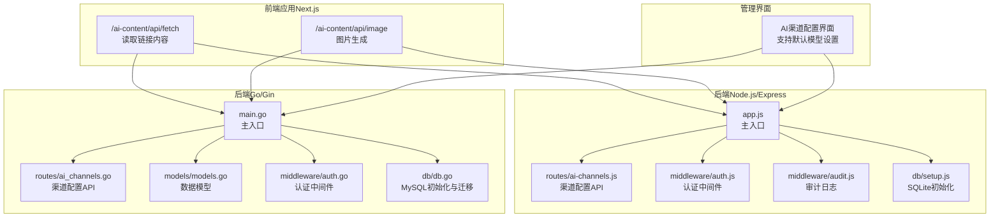
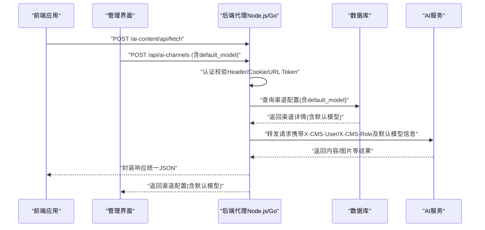
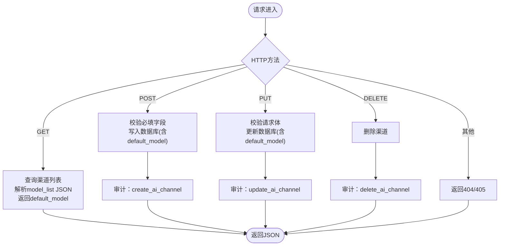
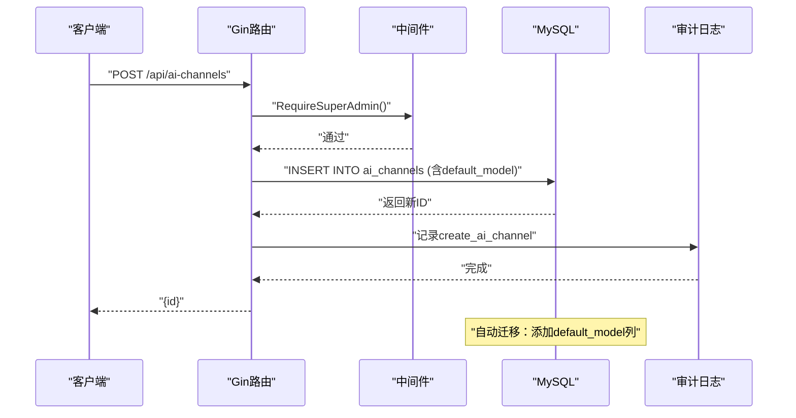
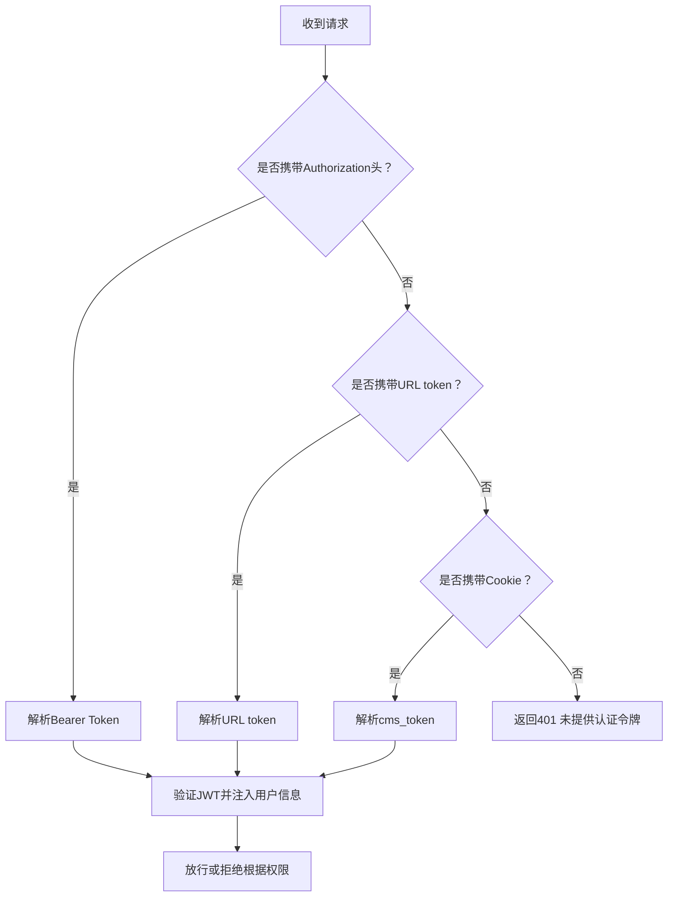
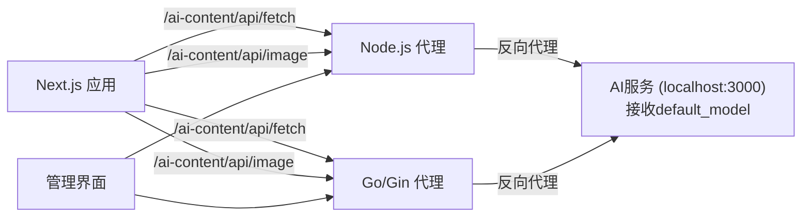
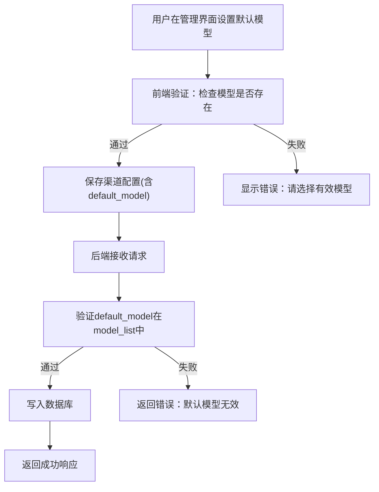
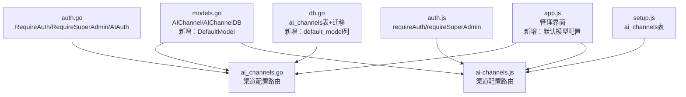

# AI渠道配置接口

<cite>
**本文档引用的文件**
- [ai-channels.js](file://business-core/cms-server/routes/ai-channels.js)
- [ai_channels.go](file://business-core/cms-server-go/routes/ai_channels.go)
- [models.go](file://business-core/cms-server-go/models/models.go)
- [db.go](file://business-core/cms-server-go/db/db.go)
- [setup.js](file://business-core/cms-server/db/setup.js)
- [auth.js](file://business-core/cms-server/middleware/auth.js)
- [auth.go](file://business-core/cms-server-go/middleware/auth.go)
- [audit.js](file://business-core/cms-server/middleware/audit.js)
- [route.ts（fetch）](file://ai-content-project/src/app/api/fetch/route.ts)
- [route.ts（image）](file://ai-content-project/src/app/api/image/route.ts)
- [app.js](file://admin/assets/js/app.js)
- [app.js（Node.js）](file://business-core/cms-server/app.js)
- [main.go（Go/Gin）](file://business-core/cms-server-go/main.go)
- [ZSTS-CMS-后端移交说明书.md](file://ZSTS-CMS-后端移交说明书.md)
</cite>

## 更新摘要
**所做更改**
- 新增默认模型支持功能的完整文档说明
- 更新渠道配置API以包含DefaultModel字段
- 添加数据库迁移支持说明
- 完善默认模型选择的验证机制描述
- 更新前端界面默认模型配置功能说明

## 目录
1. [简介](#简介)
2. [项目结构](#项目结构)
3. [核心组件](#核心组件)
4. [架构总览](#架构总览)
5. [详细组件分析](#详细组件分析)
6. [依赖分析](#依赖分析)
7. [性能考虑](#性能考虑)
8. [故障排查指南](#故障排查指南)
9. [结论](#结论)
10. [附录](#附录)

## 简介
本文件面向AI渠道配置相关API，覆盖以下能力范围：
- AI服务提供商管理接口：创建、查询、更新、删除、设为默认
- 渠道配置读写接口：支持模型列表与默认标记，新增默认模型字段
- AI模型列表查询接口：按渠道返回可用模型及默认模型标识
- 认证与授权：基于JWT的多通道认证（Header/Cookie/URL Token）
- 配额与安全：通过中间件与审计日志实现权限控制与操作追踪
- AI内容生成与代理：前端Next.js应用通过后端反向代理访问AI服务
- 健康检查、故障转移与负载均衡：通过统一代理层与多渠道配置实现
- 批量处理与结果查询：结合渠道配置与代理机制实现
- 错误重试与性能监控：建议性方案与最佳实践

## 项目结构
该仓库包含两套后端实现、一套前端AI内容生成应用和管理界面：
- Node.js/Express 后端：提供传统REST API与AI内容代理
- Go/Gin 后端：提供高性能REST API与AI内容代理
- 前端应用（Next.js）：提供AI内容生成界面与代理API
- 管理界面（admin）：提供AI渠道配置管理界面，支持默认模型设置

**图表来源**
- [app.js（Node.js）:155-225](file://business-core/cms-server/app.js#L155-L225)
- [ai-channels.js:1-113](file://business-core/cms-server/routes/ai-channels.js#L1-L113)
- [auth.js:1-86](file://business-core/cms-server/middleware/auth.js#L1-L86)
- [audit.js:1-75](file://business-core/cms-server/middleware/audit.js#L1-L75)
- [setup.js:55-68](file://business-core/cms-server/db/setup.js#L55-L68)
- [main.go（Go/Gin）:72-97](file://business-core/cms-server-go/main.go#L72-L97)
- [ai_channels.go:18-28](file://business-core/cms-server-go/routes/ai_channels.go#L18-L28)
- [models.go:72-110](file://business-core/cms-server-go/models/models.go#L72-L110)
- [auth.go:17-176](file://business-core/cms-server-go/middleware/auth.go#L17-L176)
- [db.go:93-128](file://business-core/cms-server-go/db/db.go#L93-L128)
- [app.js（管理界面）:1670-1869](file://admin/assets/js/app.js#L1670-L1869)

**章节来源**
- [app.js（Node.js）:155-225](file://business-core/cms-server/app.js#L155-L225)
- [main.go（Go/Gin）:72-97](file://business-core/cms-server-go/main.go#L72-L97)
- [ai-channels.js:1-113](file://business-core/cms-server/routes/ai-channels.js#L1-L113)
- [ai_channels.go:18-28](file://business-core/cms-server-go/routes/ai_channels.go#L18-L28)

## 核心组件
- 渠道配置模型与请求/响应结构
  - Go模型：AIChannel、AIChannelDB、CreateAIChannelRequest、UpdateAIChannelRequest
  - Node.js模型：与数据库字段映射一致，包含id、name、api_url、api_key、model_list、default_model、is_default、created_at、created_by
  - **新增**：default_model字段用于指定渠道的默认AI模型
- 认证与授权中间件
  - Node.js：requireAuth、requireSuperAdmin、requirePagePerm；支持AI内容生成的AIAuth变体
  - Go：RequireAuth、RequireSuperAdmin、RequirePagePerm、AIAuth（支持Header/Cookie/URL Token）
- 审计日志中间件
  - 记录写操作（POST/PUT/DELETE）与关键管理动作（创建/更新/删除/设为默认渠道）
- 数据库初始化与迁移
  - ai_channels表定义：id、name、api_url、api_key、model_list(JSON)、default_model、is_default、created_at、created_by
  - **新增**：自动迁移支持，为已有表添加default_model列
- 前端代理API
  - fetch：读取链接内容
  - image：图片生成
- **新增**：管理界面默认模型配置
  - 支持在模型列表中设置默认模型
  - 实时预览默认模型状态

**章节来源**
- [models.go:72-110](file://business-core/cms-server-go/models/models.go#L72-L110)
- [ai-channels.js:25-36](file://business-core/cms-server/routes/ai-channels.js#L25-L36)
- [ai_channels.go:30-75](file://business-core/cms-server-go/routes/ai_channels.go#L30-L75)
- [db.go:93-128](file://business-core/cms-server-go/db/db.go#L93-L128)
- [auth.js:20-44](file://business-core/cms-server/middleware/auth.js#L20-L44)
- [auth.go:17-176](file://business-core/cms-server-go/middleware/auth.go#L17-L176)
- [audit.js:22-40](file://business-core/cms-server/middleware/audit.js#L22-L40)
- [setup.js:55-68](file://business-core/cms-server/db/setup.js#L55-L68)
- [app.js:1670-1869](file://admin/assets/js/app.js#L1670-L1869)

## 架构总览
后端通过统一的AI内容代理将前端请求转发至AI服务（默认目标为localhost:3000）。代理层支持多种认证方式（Header/Cookie/URL Token），并在请求头中注入用户信息，便于下游服务识别来源。**新增**：默认模型功能通过渠道配置传递到AI服务，确保内容生成时使用正确的默认模型。

**图表来源**
- [app.js（Node.js）:163-225](file://business-core/cms-server/app.js#L163-L225)
- [main.go（Go/Gin）:209-289](file://business-core/cms-server-go/main.go#L209-L289)
- [ai_channels.go:27-68](file://business-core/cms-server-go/routes/ai_channels.go#L27-L68)
- [db.go:93-128](file://business-core/cms-server-go/db/db.go#L93-L128)
- [route.ts（fetch）:4-24](file://ai-content-project/src/app/api/fetch/route.ts#L4-L24)
- [route.ts（image）:4-35](file://ai-content-project/src/app/api/image/route.ts#L4-L35)

## 详细组件分析

### 渠道配置API（Node.js/Express）
- 接口概览
  - GET /api/ai-channels：获取渠道列表（解析model_list JSON）
  - POST /api/ai-channels：新建渠道（仅超级管理员）
  - PUT /api/ai-channels/:id：更新渠道（仅超级管理员）
  - PUT /api/ai-channels/:id/set-default：设为默认渠道（仅超级管理员）
  - DELETE /api/ai-channels/:id：删除渠道（仅超级管理员）
- 请求与响应
  - 请求体字段：name、api_url、api_key、model_list（数组）、**新增**：default_model
  - 响应体字段：id、message等
- 权限控制
  - requireSuperAdmin中间件保护写操作
  - 审计日志记录关键管理动作
- 数据库
  - ai_channels表：包含name、api_url、api_key、model_list(JSON)、**新增**：default_model、is_default、created_at、created_by

**图表来源**
- [ai-channels.js:25-110](file://business-core/cms-server/routes/ai-channels.js#L25-L110)
- [audit.js:22-40](file://business-core/cms-server/middleware/audit.js#L22-L40)

**章节来源**
- [ai-channels.js:1-113](file://business-core/cms-server/routes/ai-channels.js#L1-L113)
- [audit.js:22-40](file://business-core/cms-server/middleware/audit.js#L22-L40)
- [setup.js:55-68](file://business-core/cms-server/db/setup.js#L55-L68)

### 渠道配置API（Go/Gin）
- 接口概览
  - GET /api/ai-channels：获取渠道列表（解析model_list JSON）
  - POST /api/ai-channels：新建渠道（仅超级管理员）
  - PUT /api/ai-channels/:id：更新渠道（仅超级管理员）
  - PUT /api/ai-channels/:id/set-default：设为默认渠道（仅超级管理员）
  - DELETE /api/ai-channels/:id：删除渠道（仅超级管理员）
- 请求与响应
  - 使用Gin绑定模型：CreateAIChannelRequest、UpdateAIChannelRequest（**新增**：包含DefaultModel字段）
  - 返回标准JSON：id或message
- 权限控制
  - RequireSuperAdmin中间件保护写操作
  - 审计日志记录关键管理动作
- 数据库
  - ai_channels表：与Node.js版本一致，**新增**：default_model列支持
- **新增**：数据库迁移支持
  - 自动检测并添加default_model列
  - 支持历史数据兼容

**图表来源**
- [ai_channels.go:77-117](file://business-core/cms-server-go/routes/ai_channels.go#L77-L117)
- [auth.go:65-84](file://business-core/cms-server-go/middleware/auth.go#L65-L84)
- [models.go:96-110](file://business-core/cms-server-go/models/models.go#L96-L110)
- [db.go:107-112](file://business-core/cms-server-go/db/db.go#L107-L112)

**章节来源**
- [ai_channels.go:18-197](file://business-core/cms-server-go/routes/ai_channels.go#L18-L197)
- [models.go:72-110](file://business-core/cms-server-go/models/models.go#L72-L110)
- [auth.go:65-84](file://business-core/cms-server-go/middleware/auth.go#L65-L84)
- [db.go:93-128](file://business-core/cms-server-go/db/db.go#L93-L128)

### 认证与授权机制
- 多通道认证（Go/AIAuth）
  - 支持Authorization Header（Bearer）、URL查询参数token、Cookie回退
  - 验证JWT并注入用户信息（ID、用户名、角色）
- 权限控制
  - requireAuth：通用认证
  - requireSuperAdmin：超级管理员
  - requirePagePerm：页面编辑权限
- 审计日志
  - 记录写操作与关键管理动作，便于追踪

**图表来源**
- [auth.go:134-176](file://business-core/cms-server-go/middleware/auth.go#L134-L176)
- [auth.js:20-44](file://business-core/cms-server/middleware/auth.js#L20-L44)

**章节来源**
- [auth.go:17-203](file://business-core/cms-server-go/middleware/auth.go#L17-L203)
- [auth.js:1-86](file://business-core/cms-server/middleware/auth.js#L1-L86)
- [audit.js:22-74](file://business-core/cms-server/middleware/audit.js#L22-L74)

### AI内容生成与代理
- 前端Next.js应用
  - basePath为/ai-content，路由包括创建、文章、海报、结果、日志等
  - 通过/api/fetch与/api/image访问后端代理
- 后端代理（Node.js）
  - 将/ai-content/*代理到localhost:3000
  - 支持AIAuth认证（Header/Cookie/URL Token），注入X-CMS-User与X-CMS-Role
- 后端代理（Go/Gin）
  - 同样支持AIAuth认证与代理逻辑
- SDK集成
  - fetch：读取链接内容
  - image：图片生成
- **新增**：默认模型传递
  - 渠道配置中的default_model字段通过代理层传递给AI服务
  - 确保内容生成时使用正确的默认模型

**图表来源**
- [next.config.ts:3-10](file://ai-content-project/next.config.ts#L3-L10)
- [app.js（Node.js）:163-225](file://business-core/cms-server/app.js#L163-L225)
- [main.go（Go/Gin）:209-289](file://business-core/cms-server-go/main.go#L209-L289)
- [route.ts（fetch）:1-25](file://ai-content-project/src/app/api/fetch/route.ts#L1-L25)
- [route.ts（image）:1-36](file://ai-content-project/src/app/api/image/route.ts#L1-L36)
- [app.js:1670-1869](file://admin/assets/js/app.js#L1670-L1869)

**章节来源**
- [next.config.ts:1-22](file://ai-content-project/next.config.ts#L1-L22)
- [app.js（Node.js）:163-225](file://business-core/cms-server/app.js#L163-L225)
- [main.go（Go/Gin）:209-289](file://business-core/cms-server-go/main.go#L209-L289)
- [route.ts（fetch）:1-25](file://ai-content-project/src/app/api/fetch/route.ts#L1-L25)
- [route.ts（image）:1-36](file://ai-content-project/src/app/api/image/route.ts#L1-L36)

### 默认模型支持功能
- **新增**：AIChannel模型增强
  - DefaultModel字段：指定渠道的默认AI模型名称
  - 支持空字符串表示未设置默认模型
- **新增**：数据库迁移机制
  - 自动检测现有ai_channels表是否包含default_model列
  - 如不存在则自动添加VARCHAR(255) DEFAULT ''列
  - 保持向后兼容性，不影响历史数据
- **新增**：前端管理界面
  - 在模型列表中支持设置默认模型（⭐ 标记）
  - 实时显示默认模型状态
  - 保存时验证必须选择默认模型（当有模型时）
- **新增**：请求验证机制
  - 创建/更新渠道时验证default_model字段
  - 确保默认模型存在于model_list中
  - 提供清晰的错误提示

**图表来源**
- [models.go:33-44](file://business-core/cms-server-go/models/models.go#L33-L44)
- [ai_channels.go:70-131](file://business-core/cms-server-go/routes/ai_channels.go#L70-L131)
- [db.go:107-112](file://business-core/cms-server-go/db/db.go#L107-L112)
- [app.js:1772-1774](file://admin/assets/js/app.js#L1772-L1774)

**章节来源**
- [models.go:33-44](file://business-core/cms-server-go/models/models.go#L33-L44)
- [models.go:99-106](file://business-core/cms-server-go/models/models.go#L99-L106)
- [ai_channels.go:70-131](file://business-core/cms-server-go/routes/ai_channels.go#L70-L131)
- [db.go:93-128](file://business-core/cms-server-go/db/db.go#L93-L128)
- [app.js:1670-1869](file://admin/assets/js/app.js#L1670-L1869)

## 依赖分析
- 数据模型依赖
  - Go侧：models.AIChannel与models.AIChannelDB分别对应数据库字段与JSON序列化，**新增**：DefaultModel字段
  - Node.js侧：与数据库字段一一对应，**新增**：default_model字段支持
- 路由与中间件依赖
  - 渠道配置路由依赖认证中间件与审计日志
  - AI内容代理依赖认证中间件与配置（JWT Secret、AIProxyURL）
- 数据库依赖
  - ai_channels表作为渠道配置的核心存储，**新增**：default_model列支持
  - **新增**：数据库迁移机制确保向后兼容
- **新增**：前端界面依赖
  - 管理界面依赖后端API提供默认模型配置功能
  - 实时验证用户输入的有效性

**图表来源**
- [models.go:72-110](file://business-core/cms-server-go/models/models.go#L72-L110)
- [ai_channels.go:18-28](file://business-core/cms-server-go/routes/ai_channels.go#L18-L28)
- [ai-channels.js:1-18](file://business-core/cms-server/routes/ai-channels.js#L1-L18)
- [auth.go:17-84](file://business-core/cms-server-go/middleware/auth.go#L17-L84)
- [auth.js:20-44](file://business-core/cms-server/middleware/auth.js#L20-L44)
- [db.go:93-128](file://business-core/cms-server-go/db/db.go#L93-L128)
- [setup.js:55-68](file://business-core/cms-server/db/setup.js#L55-L68)
- [app.js:1670-1869](file://admin/assets/js/app.js#L1670-L1869)

**章节来源**
- [models.go:72-110](file://business-core/cms-server-go/models/models.go#L72-L110)
- [ai_channels.go:18-28](file://business-core/cms-server-go/routes/ai_channels.go#L18-L28)
- [ai-channels.js:1-18](file://business-core/cms-server/routes/ai-channels.js#L1-L18)
- [auth.go:17-84](file://business-core/cms-server-go/middleware/auth.go#L17-L84)
- [auth.js:20-44](file://business-core/cms-server/middleware/auth.js#L20-L44)
- [db.go:93-128](file://business-core/cms-server-go/db/db.go#L93-L128)
- [setup.js:55-68](file://business-core/cms-server/db/setup.js#L55-L68)
- [app.js:1670-1869](file://admin/assets/js/app.js#L1670-L1869)

## 性能考虑
- 代理层性能
  - Go/Gin版本具备更高并发与更低延迟优势，适合高吞吐场景
  - Node.js版本通过http-proxy-middleware实现，满足一般需求
- 认证与审计
  - 认证中间件在代理阶段执行，避免重复鉴权
  - 审计日志采用异步写入，减少对主流程影响
- 数据库
  - SQLite轻量易部署，适合中小规模数据；若需高并发，建议迁移到关系型数据库并引入连接池与索引优化
  - **新增**：MySQL版本支持自动迁移，减少维护成本
- **新增**：默认模型缓存
  - 建议在应用层缓存常用渠道的默认模型配置
  - 减少数据库查询频率，提高响应速度

## 故障排查指南
- 认证失败
  - 检查Authorization头格式（Bearer）、URL token有效性、Cookie是否存在
  - 确认JWT_SECRET配置正确
- 渠道配置异常
  - 确认请求体包含name与api_url
  - 检查数据库ai_channels表结构与数据
  - **新增**：确认default_model字段格式正确且存在于model_list中
- 代理不通
  - 确认AI服务运行于localhost:3000
  - 检查跨域与CORS配置
- 审计日志缺失
  - 确认写操作触发条件与数据库连接状态
- **新增**：默认模型相关问题
  - 检查管理界面是否正确显示默认模型状态
  - 确认保存时前端验证逻辑正常工作
  - 验证数据库迁移是否成功执行

**章节来源**
- [auth.go:134-176](file://business-core/cms-server-go/middleware/auth.go#L134-L176)
- [auth.js:20-44](file://business-core/cms-server/middleware/auth.js#L20-L44)
- [audit.js:22-74](file://business-core/cms-server/middleware/audit.js#L22-L74)
- [db.go:107-112](file://business-core/cms-server-go/db/db.go#L107-L112)
- [setup.js:55-68](file://business-core/cms-server/db/setup.js#L55-L68)
- [app.js:1772-1774](file://admin/assets/js/app.js#L1772-L1774)

## 结论
本项目提供了完整的AI渠道配置与内容生成基础设施，**新增**的默认模型支持功能进一步增强了系统的实用性和用户体验：
- 通过双后端实现（Node.js/Go）满足不同性能与运维需求
- 基于JWT的多通道认证与审计日志保障安全与可追溯
- 渠道配置API支持模型列表与默认渠道设置，**新增**：默认模型功能提升用户体验
- **新增**：自动数据库迁移机制确保系统升级的平滑过渡
- **新增**：完善的前端管理界面支持直观的默认模型配置
- 前后端分离的代理机制简化了AI服务接入与扩展

## 附录

### API定义与规范

- 渠道配置API（Node.js/Express）
  - GET /api/ai-channels
    - 权限：认证用户
    - 响应：渠道列表（解析model_list JSON，包含default_model）
  - POST /api/ai-channels
    - 权限：超级管理员
    - 请求体：name、api_url、api_key、model_list、**新增**：default_model
    - 响应：{id}
  - PUT /api/ai-channels/:id
    - 权限：超级管理员
    - 请求体：name、api_url、api_key、model_list、**新增**：default_model
    - 响应：{message}
  - PUT /api/ai-channels/:id/set-default
    - 权限：超级管理员
    - 响应：{message}
  - DELETE /api/ai-channels/:id
    - 权限：超级管理员
    - 响应：{message}

- 渠道配置API（Go/Gin）
  - GET /api/ai-channels
    - 权限：认证用户
    - 响应：渠道列表（解析model_list JSON，包含default_model）
  - POST /api/ai-channels
    - 权限：超级管理员
    - 请求体：CreateAIChannelRequest（**新增**：包含DefaultModel字段）
    - 响应：{id}
  - PUT /api/ai-channels/:id
    - 权限：超级管理员
    - 请求体：UpdateAIChannelRequest（**新增**：包含DefaultModel字段）
    - 响应：{message}
  - PUT /api/ai-channels/:id/set-default
    - 权限：超级管理员
    - 响应：{message}
  - DELETE /api/ai-channels/:id
    - 权限：超级管理员
    - 响应：{message}

- AI内容生成代理API（前端Next.js）
  - POST /ai-content/api/fetch
    - 请求体：{url}
    - 响应：标题、内容、原始URL、状态码
  - POST /ai-content/api/image
    - 请求体：{prompt}
    - 响应：imageUrl或错误信息

- **新增**：默认模型配置API（管理界面）
  - 界面交互：支持在模型列表中设置默认模型
  - 验证逻辑：确保默认模型存在于model_list中
  - 显示逻辑：实时显示默认模型状态（⭐ 标记）

**章节来源**
- [ai-channels.js:5-10](file://business-core/cms-server/routes/ai-channels.js#L5-L10)
- [ai_channels.go:18-28](file://business-core/cms-server-go/routes/ai_channels.go#L18-L28)
- [route.ts（fetch）:4-24](file://ai-content-project/src/app/api/fetch/route.ts#L4-L24)
- [route.ts（image）:4-35](file://ai-content-project/src/app/api/image/route.ts#L4-L35)
- [models.go:99-106](file://business-core/cms-server-go/models/models.go#L99-L106)
- [app.js:1670-1869](file://admin/assets/js/app.js#L1670-L1869)

### 认证与API密钥管理
- 认证方式
  - Header：Authorization: Bearer <token>
  - URL：/ai-content?token=<token>
  - Cookie：cms_token
- API密钥管理
  - 渠道配置支持api_key字段，可在渠道层面集中管理
  - 建议：敏感信息加密存储、定期轮换、最小权限原则

**章节来源**
- [auth.go:134-176](file://business-core/cms-server-go/middleware/auth.go#L134-L176)
- [auth.js:20-44](file://business-core/cms-server/middleware/auth.js#L20-L44)
- [ai-channels.js:40-43](file://business-core/cms-server/routes/ai-channels.js#L40-L43)
- [ai_channels.go:95-103](file://business-core/cms-server-go/routes/ai_channels.go#L95-L103)

### 配额控制机制
- 当前实现
  - 未发现内置配额控制逻辑
- 建议
  - 在渠道配置中增加配额字段（如max_requests、period）
  - 在代理层或SDK层实现速率限制与配额检查
  - 通过审计日志统计与告警

### 健康检查、故障转移与负载均衡
- 健康检查
  - 对AI服务暴露健康端点，定期探测
- 故障转移
  - 多渠道配置：当默认渠道不可用时切换到备用渠道
  - **新增**：默认模型配置支持确保故障转移时仍能使用正确的模型
- 负载均衡
  - 多实例AI服务：通过上游LB分发请求

### 批量处理与结果查询
- 批量处理
  - 建议：在前端提交任务队列，后端异步处理并持久化结果
- 结果查询
  - 通过任务ID查询状态与结果，支持分页与过滤

### 错误重试与性能监控
- 错误重试
  - 指数退避策略，最大重试次数与超时控制
- 性能监控
  - 指标：QPS、P95/P99延迟、错误率、渠道命中率
  - 建议：集成APM工具与日志聚合平台
- **新增**：默认模型监控
  - 监控默认模型使用情况
  - 统计不同默认模型的调用频率
  - 分析模型性能指标

### 数据库迁移与兼容性
- **新增**：自动迁移机制
  - MySQL版本：自动检测并添加default_model列
  - SQLite版本：保持原有结构，通过应用层逻辑处理
- **新增**：向后兼容性
  - 旧版本数据自动转换为新格式
  - 未设置默认模型的渠道保持兼容
- **新增**：迁移验证
  - 迁移完成后验证数据完整性
  - 提供迁移状态报告

**章节来源**
- [db.go:107-112](file://business-core/cms-server-go/db/db.go#L107-L112)
- [setup.js:55-68](file://business-core/cms-server/db/setup.js#L55-L68)
- [models.go:33-44](file://business-core/cms-server-go/models/models.go#L33-L44)