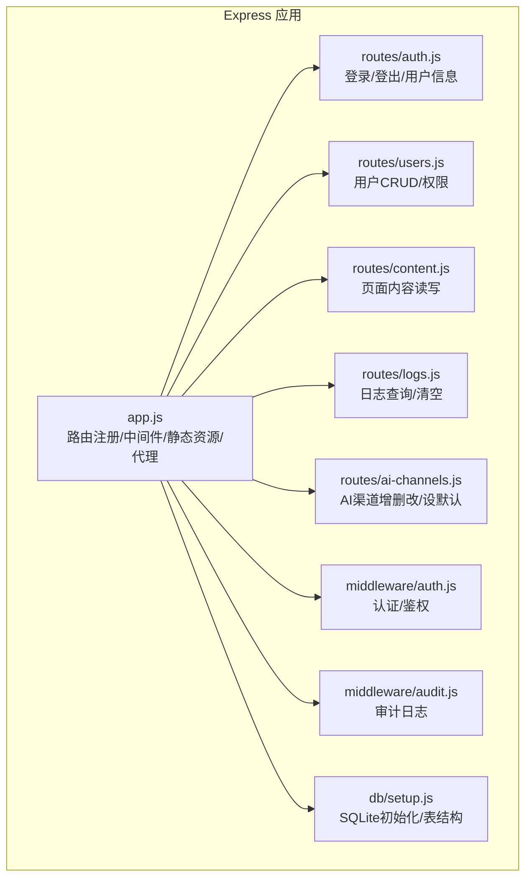
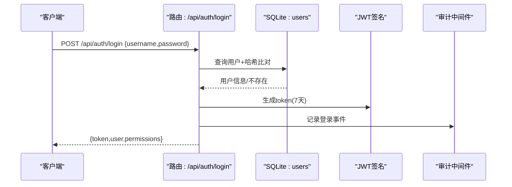
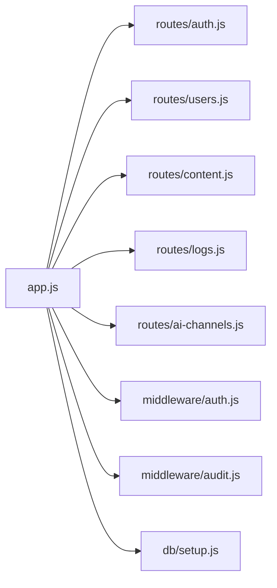
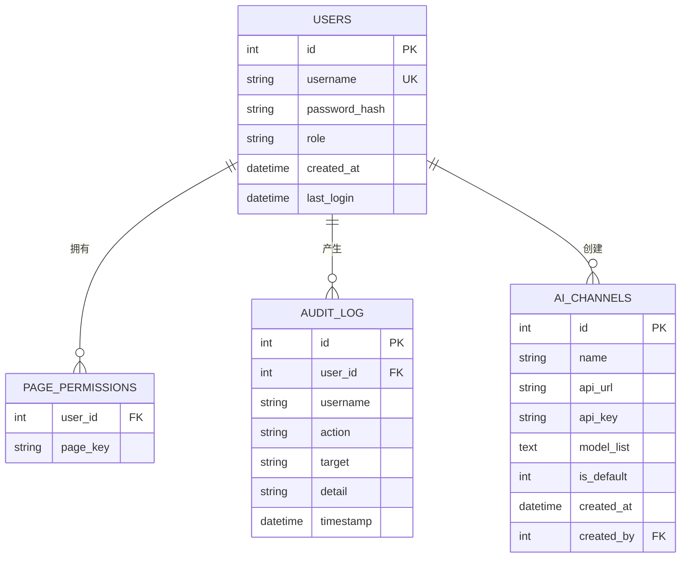

# API接口文档

<cite>
**本文档引用的文件**
- [app.js](file://cms-server/app.js)
- [auth.js](file://cms-server/routes/auth.js)
- [users.js](file://cms-server/routes/users.js)
- [content.js](file://cms-server/routes/content.js)
- [logs.js](file://cms-server/routes/logs.js)
- [ai-channels.js](file://cms-server/routes/ai-channels.js)
- [auth中间件.js](file://cms-server/middleware/auth.js)
- [audit中间件.js](file://cms-server/middleware/audit.js)
- [db初始化.js](file://cms-server/db/setup.js)
- [package.json](file://cms-server/package.json)
- [集成测试.js](file://cms-server/test-api.js)
- [README.md](file://Readme.md)
</cite>

## 更新摘要
**变更内容**
- 新增完整的API接口文档，覆盖认证、用户管理、内容管理、日志查询、AI渠道配置等全部RESTful接口
- 更新认证接口文档，包含登录、登出、用户信息获取
- 完善用户管理接口文档，包含CRUD操作和权限管理
- 新增内容管理接口文档，包含页面内容读写
- 新增日志查询接口文档
- 新增AI渠道配置接口文档
- 添加上传接口和AI内容生成代理接口
- 更新权限模型和错误码说明
- 添加请求/响应示例和curl命令

## 目录
1. [简介](#简介)
2. [项目结构](#项目结构)
3. [核心组件](#核心组件)
4. [架构总览](#架构总览)
5. [详细组件分析](#详细组件分析)
6. [依赖关系分析](#依赖关系分析)
7. [性能与安全](#性能与安全)
8. [故障排查指南](#故障排查指南)
9. [结论](#结论)
10. [附录](#附录)

## 简介
本文件为 ZSTS CMS 的完整 API 参考文档，覆盖认证、用户管理、内容管理、日志查询与 AI 渠道配置等全部 RESTful 接口。文档包含：
- 每个接口的 HTTP 方法、URL 模式、请求参数与响应格式
- 认证要求、权限模型与错误码说明
- 请求/响应示例、curl 命令与 JavaScript 调用示例
- API 版本控制、速率限制与安全建议
- 架构与数据流图示

## 项目结构
后端基于 Node.js + Express，采用模块化路由组织，配合 SQLite 存储用户、权限、审计日志与 AI 渠道配置；提供静态资源服务、预览模式与 AI 内容生成代理。

**图表来源**
- [app.js:155-161](file://cms-server/app.js#L155-L161)
- [auth.js:1-99](file://cms-server/routes/auth.js#L1-L99)
- [users.js:1-154](file://cms-server/routes/users.js#L1-L154)
- [content.js:1-104](file://cms-server/routes/content.js#L1-L104)
- [logs.js:1-59](file://cms-server/routes/logs.js#L1-L59)
- [ai-channels.js:1-113](file://cms-server/routes/ai-channels.js#L1-L113)
- [auth中间件.js:1-86](file://cms-server/middleware/auth.js#L1-L86)
- [audit中间件.js:1-75](file://cms-server/middleware/audit.js#L1-L75)
- [db初始化.js:1-115](file://cms-server/db/setup.js#L1-L115)

**章节来源**
- [app.js:155-161](file://cms-server/app.js#L155-L161)
- [package.json:1-22](file://cms-server/package.json#L1-L22)

## 核心组件
- 认证与鉴权
  - JWT 令牌签发与校验，支持 Bearer 头部与 Cookie 回退
  - 角色区分：编辑者(editor)与超级管理员(super_admin)
  - 页面级权限：page_permissions 表按用户与页面键关联
- 审计日志
  - 手动记录关键操作（登录、更新页面、创建用户等）
  - 自动中间件记录写操作（POST/PUT/DELETE）成功响应
- 数据存储
  - SQLite 表：users、page_permissions、audit_log、ai_channels
  - 默认超级管理员账户与初始权限分配
- 静态资源与预览
  - 图片上传、静态目录映射、预览模式注入脚本与资源路径修复

**章节来源**
- [auth中间件.js:20-44](file://cms-server/middleware/auth.js#L20-L44)
- [db初始化.js:18-104](file://cms-server/db/setup.js#L18-L104)
- [audit中间件.js:22-72](file://cms-server/middleware/audit.js#L22-L72)

## 架构总览
以下序列图展示典型"登录"流程，包括 JWT 签发与审计日志记录。

**图表来源**
- [auth.js:22-66](file://cms-server/routes/auth.js#L22-L66)
- [audit中间件.js:22-40](file://cms-server/middleware/audit.js#L22-L40)

## 详细组件分析

### 认证接口
- 登录
  - 方法与路径：POST /api/auth/login
  - 请求体字段：username(string, 必填), password(string, 必填)
  - 成功响应字段：token(string), user.id(number), user.username(string), user.role(string), user.permissions(string[])
  - 失败响应：400/401，错误信息
  - 审计：记录登录事件
- 登出
  - 方法与路径：POST /api/auth/logout
  - 说明：前端清理本地 token 即可，后端无需额外操作
- 获取当前用户信息
  - 方法与路径：GET /api/auth/me
  - 请求头：Authorization: Bearer <token>
  - 成功响应字段：id, username, role, created_at, last_login, permissions
  - 失败响应：401（未认证/令牌无效）

认证要求与权限
- 通用规则：除 GET /api/content/:pageKey 外，其他 API 均需携带有效 Authorization: Bearer <token>
- 超级管理员：可管理全局配置(nav/footer/consultation)与用户
- 页面权限：编辑者仅能访问被授权的页面键

**章节来源**
- [auth.js:22-96](file://cms-server/routes/auth.js#L22-L96)
- [auth中间件.js:20-44](file://cms-server/middleware/auth.js#L20-L44)

### 用户管理接口（仅超级管理员）
- 获取用户列表
  - 方法与路径：GET /api/users
  - 成功响应：数组，每项包含 id, username, role, created_at, last_login, permissions(string[])
- 新建账号
  - 方法与路径：POST /api/users
  - 请求体字段：username(string, 必填), password(string, 至少6位), role(string, editor/super_admin), permissions(string[])
  - 成功响应：{ id, username, role }
  - 失败响应：400/409/500
- 修改密码
  - 方法与路径：PUT /api/users/:id
  - 请求体字段：password(string, 至少6位)
  - 成功响应：{ message }
- 更新页面权限
  - 方法与路径：PUT /api/users/:id/permissions
  - 请求体字段：permissions(string[])
  - 成功响应：{ message }
- 删除账号
  - 方法与路径：DELETE /api/users/:id
  - 限制：不可删除自身
  - 成功响应：{ message }

**章节来源**
- [users.js:26-151](file://cms-server/routes/users.js#L26-L151)
- [auth中间件.js:37-44](file://cms-server/middleware/auth.js#L37-L44)

### 内容管理接口
- 读取页面内容
  - 方法与路径：GET /api/content/:pageKey
  - 参数：pageKey ∈ {home, about, visa, saudi-visa, enterprise, transport, insurance, inspection}
  - 成功响应：页面 JSON；若文件不存在返回空对象
  - 备注：无需认证（预览模式需要）
- 更新页面内容
  - 方法与路径：PUT /api/content/:pageKey
  - 请求头：Authorization: Bearer <token>
  - 权限规则：
    - nav/footer/consultation：仅超级管理员
    - 普通页面：编辑者需具备对应 page_key 权限
  - 成功响应：{ message }
  - 失败响应：400/403/500

页面键与权限映射
- 全局类：nav, footer, consultation（仅超级管理员可写）
- 页面类：home, about, visa, saudi-visa, enterprise, transport, insurance, inspection

**章节来源**
- [content.js:48-101](file://cms-server/routes/content.js#L48-L101)
- [auth中间件.js:46-63](file://cms-server/middleware/auth.js#L46-L63)

### 日志查询接口
- 查询日志
  - 方法与路径：GET /api/logs
  - 查询参数：page(number, 默认1), limit(number, 默认50), action(string), username(string), start_date(date), end_date(date)
  - 成功响应字段：total(number), page(number), limit(number), rows(array)
- 清空日志
  - 方法与路径：DELETE /api/logs
  - 仅超级管理员可用
  - 成功响应：{ message }

**章节来源**
- [logs.js:20-56](file://cms-server/routes/logs.js#L20-L56)
- [auth中间件.js:37-44](file://cms-server/middleware/auth.js#L37-L44)

### AI 渠道配置接口
- 获取渠道列表
  - 方法与路径：GET /api/ai-channels
  - 成功响应：数组，每项包含 id, name, api_url, api_key(string), model_list(string[]), is_default(number), created_at, created_by
- 新建渠道
  - 方法与路径：POST /api/ai-channels
  - 请求体字段：name(string, 必填), api_url(string, 必填), api_key(string), model_list(string[])
  - 成功响应：{ id }
- 更新渠道
  - 方法与路径：PUT /api/ai-channels/:id
  - 请求体字段：同上
  - 成功响应：{ message }
- 设为默认渠道
  - 方法与路径：PUT /api/ai-channels/:id/set-default
  - 成功响应：{ message }
- 删除渠道
  - 方法与路径：DELETE /api/ai-channels/:id
  - 成功响应：{ message }

**章节来源**
- [ai-channels.js:25-110](file://cms-server/routes/ai-channels.js#L25-L110)
- [auth中间件.js:37-44](file://cms-server/middleware/auth.js#L37-L44)

### 上传接口
- 上传图片
  - 方法与路径：POST /api/upload
  - 请求：multipart/form-data，字段 file
  - 成功响应字段：url(string), filename(string), size(number)
  - 限制：文件大小≤5MB，允许格式：.jpg, .jpeg, .png, .gif, .webp, .svg
- 静态资源
  - /uploads → 上传图片目录
  - /local-cdn, /images → CDN 与图片资源目录
  - /preview/* → 预览模式托管前端 HTML 并注入预览脚本

**章节来源**
- [app.js:46-53](file://cms-server/app.js#L46-L53)
- [app.js:55-62](file://cms-server/app.js#L55-L62)
- [app.js:103-153](file://cms-server/app.js#L103-L153)

### AI 内容生成代理
- 路径：/ai-content/*
- 认证方式：
  - Authorization: Bearer <token>
  - URL 参数 token
  - Cookie: cms_token
- 代理行为：转发至 http://localhost:3000，注入 X-CMS-User/X-CMS-Role 与 Cookie

**章节来源**
- [app.js:163-225](file://cms-server/app.js#L163-L225)

### 页面快照接口
- 获取页面快照
  - 方法与路径：GET /api/page-snapshot/:pageKey
  - 功能：从静态 HTML 抓取 data-i18n 当前值，用于编辑器首次回显默认值
  - 成功响应字段：htmlFile(string), count(number), snapshot(object)
  - 限制：仅用于编辑器初始化

**章节来源**
- [app.js:232-299](file://cms-server/app.js#L232-L299)

## 依赖关系分析

**图表来源**
- [app.js:155-161](file://cms-server/app.js#L155-L161)
- [auth.js:1-99](file://cms-server/routes/auth.js#L1-L99)
- [users.js:1-154](file://cms-server/routes/users.js#L1-L154)
- [content.js:1-104](file://cms-server/routes/content.js#L1-L104)
- [logs.js:1-59](file://cms-server/routes/logs.js#L1-L59)
- [ai-channels.js:1-113](file://cms-server/routes/ai-channels.js#L1-L113)
- [auth中间件.js:1-86](file://cms-server/middleware/auth.js#L1-L86)
- [audit中间件.js:1-75](file://cms-server/middleware/audit.js#L1-L75)
- [db初始化.js:1-115](file://cms-server/db/setup.js#L1-L115)

## 性能与安全
- 性能特性
  - 上传文件大小限制：5MB；JSON 请求体上限：10MB
  - 预览模式禁用缓存，确保资源与脚本即时生效
- 安全考虑
  - 认证：JWT 令牌有效期7天；建议生产环境配置强密钥
  - 权限：超级管理员与页面权限双层控制
  - 审计：关键操作均记录审计日志
  - 速率限制：当前未内置，建议在网关或反向代理层实施
- API 版本控制
  - 当前未见显式版本号（如 /api/v1/），建议后续引入版本前缀以兼容演进

## 故障排查指南
- 常见错误码
  - 400：请求参数缺失或格式错误
  - 401：未提供/令牌无效/令牌格式错误
  - 403：权限不足（非超级管理员访问全局配置/无页面权限）
  - 404：资源不存在（页面快照/预览 HTML）
  - 409：用户名冲突（新建用户）
  - 500：服务器内部错误
- 审计日志定位
  - 使用 GET /api/logs 查询操作记录，结合 action、username、时间范围过滤
- 集成测试参考
  - 可运行集成测试脚本验证登录、权限与写入流程

**章节来源**
- [logs.js:20-56](file://cms-server/routes/logs.js#L20-L56)
- [集成测试.js:35-101](file://cms-server/test-api.js#L35-L101)

## 结论
本 API 文档覆盖了 CMS 的核心能力：认证、用户与权限、页面内容、日志与 AI 渠道配置。通过明确的认证与权限模型、完善的审计日志与清晰的错误码，系统在易用性与安全性之间取得平衡。建议后续引入版本控制、速率限制与更细粒度的监控告警机制。

## 附录

### 请求/响应示例与调用方式
- curl 示例（登录）
  - curl -X POST http://localhost:3001/api/auth/login -H "Content-Type: application/json" -d '{"username":"admin","password":"admin123"}'
- curl 示例（获取用户列表）
  - curl -X GET http://localhost:3001/api/users -H "Authorization: Bearer <token>"
- curl 示例（更新页面内容）
  - curl -X PUT http://localhost:3001/api/content/home -H "Authorization: Bearer <token>" -H "Content-Type: application/json" -d '{}'
- JavaScript fetch 示例（获取当前用户）
  - fetch("http://localhost:3001/api/auth/me", { headers: { "Authorization": "Bearer <token>" } }).then(r => r.json()).then(console.log)

**章节来源**
- [auth.js:68-96](file://cms-server/routes/auth.js#L68-L96)
- [users.js:26-42](file://cms-server/routes/users.js#L26-L42)
- [content.js:67-101](file://cms-server/routes/content.js#L67-L101)
- [集成测试.js:13-33](file://cms-server/test-api.js#L13-L33)

### 数据模型概览

**图表来源**
- [db初始化.js:18-68](file://cms-server/db/setup.js#L18-L68)

### API 接口完整列表

#### 认证接口
- POST /api/auth/login - 用户登录
  - 请求体：{ username: string, password: string }
  - 响应：{ token: string, user: { id, username, role, permissions } }
  - 状态码：200/400/401

- GET /api/auth/me - 获取当前用户信息
  - 请求头：Authorization: Bearer <token>
  - 响应：{ id, username, role, created_at, last_login, permissions }
  - 状态码：200/401

#### 用户管理接口（仅超级管理员）
- GET /api/users - 获取用户列表
  - 响应：[{ id, username, role, created_at, last_login, permissions }]
  - 状态码：200/401/403

- POST /api/users - 新建用户
  - 请求体：{ username: string, password: string, role?: string, permissions?: string[] }
  - 响应：{ id, username, role }
  - 状态码：200/400/401/403/409

- PUT /api/users/:id - 修改密码
  - 请求体：{ password: string }
  - 响应：{ message: "密码已重置" }
  - 状态码：200/400/401/403

- PUT /api/users/:id/permissions - 更新页面权限
  - 请求体：{ permissions: string[] }
  - 响应：{ message: "权限已更新" }
  - 状态码：200/400/401/403

- DELETE /api/users/:id - 删除用户
  - 响应：{ message: "账号已删除" }
  - 状态码：200/400/401/403

#### 内容管理接口
- GET /api/content/:pageKey - 读取页面内容
  - 参数：pageKey ∈ {home, about, visa, saudi-visa, enterprise, transport, insurance, inspection, nav, footer, consultation}
  - 响应：页面 JSON 对象
  - 状态码：200/400

- PUT /api/content/:pageKey - 更新页面内容
  - 请求头：Authorization: Bearer <token>
  - 请求体：JSON 对象
  - 权限：超级管理员或对应页面权限
  - 响应：{ message: "页面内容已保存" } 或 { message: "全局配置已保存" }
  - 状态码：200/400/401/403/500

#### 日志查询接口
- GET /api/logs - 查询日志
  - 查询参数：page, limit, action, username, start_date, end_date
  - 响应：{ total, page, limit, rows }
  - 状态码：200/401

- DELETE /api/logs - 清空日志
  - 响应：{ message: "日志已清空" }
  - 状态码：200/401/403

#### AI 渠道配置接口
- GET /api/ai-channels - 获取渠道列表
  - 响应：[{ id, name, api_url, api_key, model_list, is_default, created_at, created_by }]
  - 状态码：200/401

- POST /api/ai-channels - 新建渠道
  - 请求体：{ name: string, api_url: string, api_key?: string, model_list?: string[] }
  - 响应：{ id }
  - 状态码：200/400/401/403

- PUT /api/ai-channels/:id - 更新渠道
  - 请求体：{ name: string, api_url: string, api_key?: string, model_list?: string[] }
  - 响应：{ message: "渠道已更新" }
  - 状态码：200/400/401/403

- PUT /api/ai-channels/:id/set-default - 设为默认渠道
  - 响应：{ message: "默认渠道已设置" }
  - 状态码：200/401/403

- DELETE /api/ai-channels/:id - 删除渠道
  - 响应：{ message: "渠道已删除" }
  - 状态码：200/401/403

#### 其他接口
- POST /api/upload - 上传图片
  - 请求：multipart/form-data，字段 file
  - 响应：{ url, filename, size }
  - 状态码：200/400/401

- GET /api/page-snapshot/:pageKey - 获取页面快照
  - 响应：{ htmlFile, count, snapshot }
  - 状态码：200/404

**章节来源**
- [auth.js:22-96](file://cms-server/routes/auth.js#L22-L96)
- [users.js:26-151](file://cms-server/routes/users.js#L26-L151)
- [content.js:48-101](file://cms-server/routes/content.js#L48-L101)
- [logs.js:20-56](file://cms-server/routes/logs.js#L20-L56)
- [ai-channels.js:25-110](file://cms-server/routes/ai-channels.js#L25-L110)
- [app.js:46-53](file://cms-server/app.js#L46-L53)
- [app.js:232-299](file://cms-server/app.js#L232-L299)