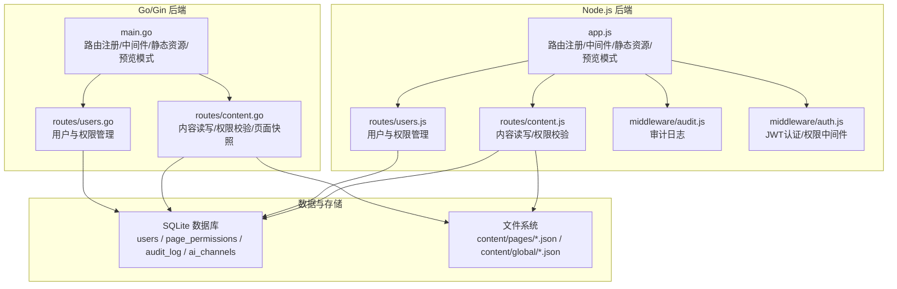
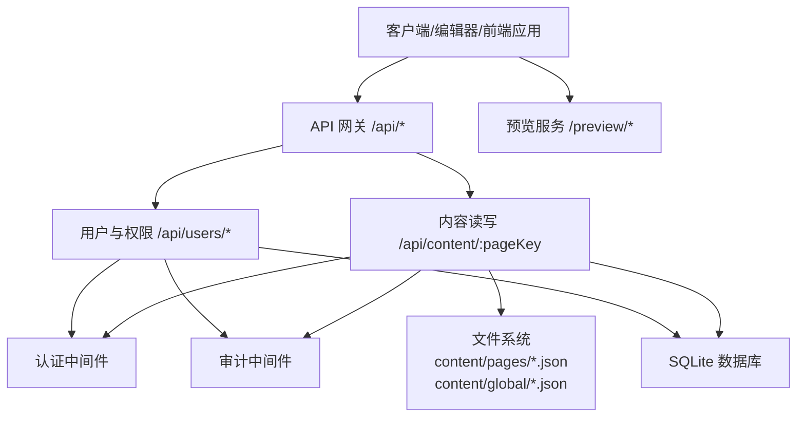
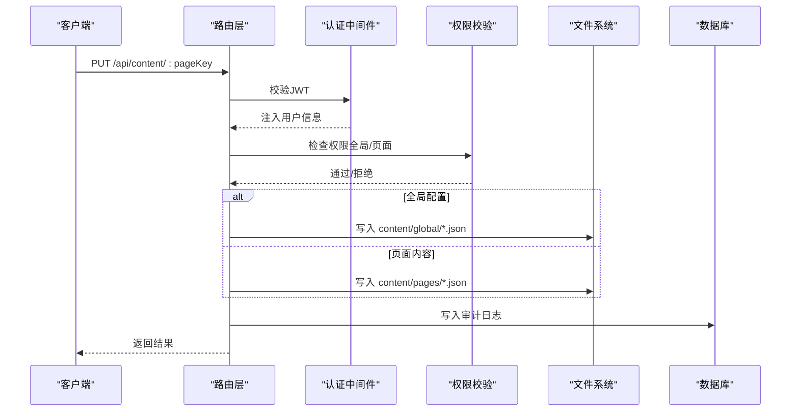
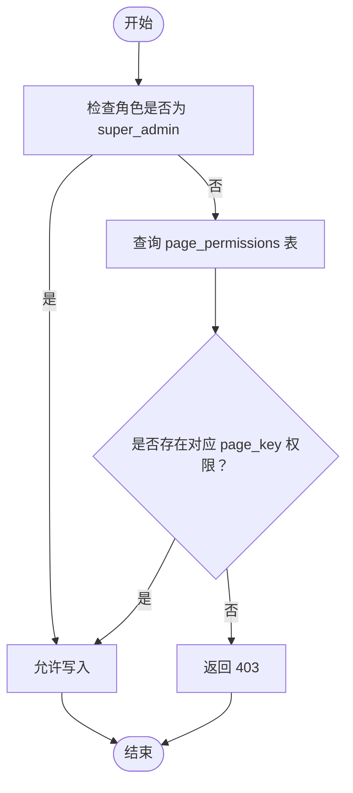
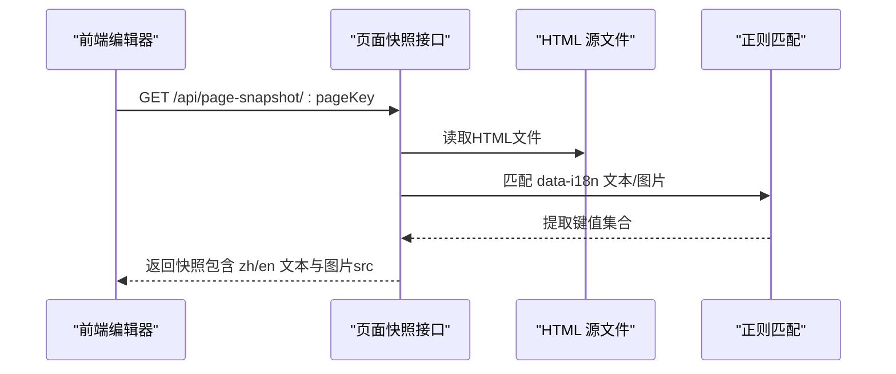
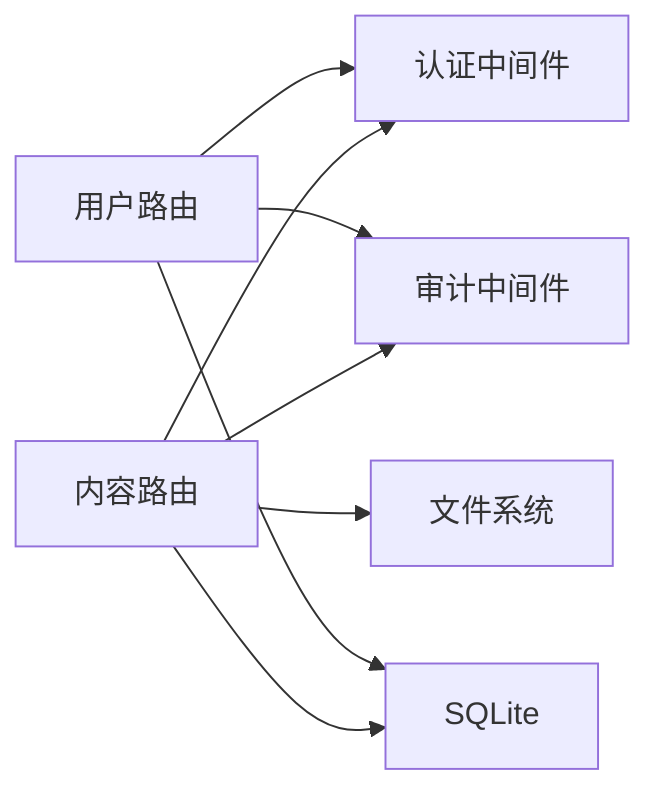

# 内容管理接口

<cite>
**本文引用的文件**
- [business-core/cms-server/routes/content.js](file://business-core/cms-server/routes/content.js)
- [business-core/cms-server-go/routes/content.go](file://business-core/cms-server-go/routes/content.go)
- [business-core/cms-server/app.js](file://business-core/cms-server/app.js)
- [business-core/cms-server-go/main.go](file://business-core/cms-server-go/main.go)
- [business-core/cms-server/middleware/auth.js](file://business-core/cms-server/middleware/auth.js)
- [business-core/cms-server/routes/users.js](file://business-core/cms-server/routes/users.js)
- [business-core/cms-server-go/routes/users.go](file://business-core/cms-server-go/routes/users.go)
- [business-core/cms-server/db/setup.js](file://business-core/cms-server/db/setup.js)
- [business-core/cms-server-go/db/setup.go](file://business-core/cms-server-go/db/setup.go)
- [business-core/cms-server/middleware/audit.js](file://business-core/cms-server/middleware/audit.js)
</cite>

## 目录
1. [简介](#简介)
2. [项目结构](#项目结构)
3. [核心组件](#核心组件)
4. [架构总览](#架构总览)
5. [详细组件分析](#详细组件分析)
6. [依赖分析](#依赖分析)
7. [性能考虑](#性能考虑)
8. [故障排查指南](#故障排查指南)
9. [结论](#结论)
10. [附录](#附录)

## 简介
本文件面向内容管理相关API，覆盖以下能力：
- 页面内容读写接口：按 pageKey 读取/更新页面JSON内容；全局配置（导航、页脚、咨询）读写。
- 全局配置管理接口：仅超级管理员可写，内容以JSON形式存储于独立目录。
- 内容权限控制接口：基于用户角色与页面权限表进行细粒度授权。
- 多语言支持机制：通过 data-i18n 属性在HTML中标识可本地化的键值，系统提供页面快照抓取能力，便于编辑器回显默认值。
- 内容版本管理：当前实现为文件直写，未内置版本控制；建议在业务侧结合外部版本系统或扩展审计日志。
- 页面字段提取、内容合并算法与默认值处理：系统提供从HTML提取字段快照的能力，编辑器可据此生成默认值；合并策略需在前端或上层业务逻辑中定义。
- 内容编辑器API、预览接口与发布接口：系统提供预览模式托管、页面快照抓取与静态资源服务，发布流程建议在前端构建或CDN部署环节完成。

## 项目结构
后端采用双栈实现（Node.js + Go/Gin）并行提供相同功能：
- Node.js 版本位于 business-core/cms-server，提供内容读写、用户管理、权限校验、审计日志、预览模式与页面快照抓取等能力。
- Go/Gin 版本位于 business-core/cms-server-go，提供内容读写、用户管理、权限校验、审计日志、预览模式与页面快照抓取等能力。
- 两者均通过统一的API前缀 /api 提供REST接口，静态资源与预览模式通过 /preview/* 提供。

图表来源
- [business-core/cms-server/app.js:155-315](file://business-core/cms-server/app.js#L155-L315)
- [business-core/cms-server/routes/content.js:12-104](file://business-core/cms-server/routes/content.js#L12-L104)
- [business-core/cms-server/routes/users.js:11-154](file://business-core/cms-server/routes/users.js#L11-L154)
- [business-core/cms-server/middleware/audit.js:15-75](file://business-core/cms-server/middleware/audit.js#L15-L75)
- [business-core/cms-server/middleware/auth.js:20-63](file://business-core/cms-server/middleware/auth.js#L20-L63)
- [business-core/cms-server-go/main.go:72-114](file://business-core/cms-server-go/main.go#L72-L114)
- [business-core/cms-server-go/routes/content.go:29-157](file://business-core/cms-server-go/routes/content.go#L29-L157)
- [business-core/cms-server-go/routes/users.go:18-249](file://business-core/cms-server-go/routes/users.go#L18-L249)

章节来源
- [business-core/cms-server/app.js:155-315](file://business-core/cms-server/app.js#L155-L315)
- [business-core/cms-server-go/main.go:72-114](file://business-core/cms-server-go/main.go#L72-L114)

## 核心组件
- 内容读写路由
  - Node.js：/api/content/:pageKey（GET/PUT）
  - Go/Gin：/api/content/:pageKey（GET/PUT）
  - 支持两类 pageKey：全局配置 nav/footer/consultation 与页面内容 home/about/visa/saudi-visa/enterprise/transport/insurance/inspection。
  - 全局配置仅超级管理员可写；页面内容需具备对应页面权限或为超级管理员。
- 用户与权限管理
  - 列表、新建、重置密码、删除账号、修改页面权限。
  - 仅超级管理员可访问。
- 审计日志
  - 记录用户行为，包括内容更新与用户管理操作。
- 预览模式与页面快照
  - /preview/* 托管前端HTML并注入预览客户端JS。
  - /api/page-snapshot/:pageKey 抓取HTML中的data-i18n字段，生成快照用于编辑器默认值回显。

章节来源
- [business-core/cms-server/routes/content.js:4-104](file://business-core/cms-server/routes/content.js#L4-L104)
- [business-core/cms-server-go/routes/content.go:29-157](file://business-core/cms-server-go/routes/content.go#L29-L157)
- [business-core/cms-server/routes/users.js:26-151](file://business-core/cms-server/routes/users.js#L26-L151)
- [business-core/cms-server-go/routes/users.go:31-248](file://business-core/cms-server-go/routes/users.go#L31-L248)
- [business-core/cms-server/middleware/audit.js:22-40](file://business-core/cms-server/middleware/audit.js#L22-L40)
- [business-core/cms-server/app.js:233-299](file://business-core/cms-server/app.js#L233-L299)
- [business-core/cms-server-go/routes/content.go:213-274](file://business-core/cms-server-go/routes/content.go#L213-L274)

## 架构总览
系统通过API网关（/api）与静态资源服务（/preview/*）对外提供能力，内容以JSON文件形式持久化，权限与审计通过SQLite数据库维护。

图表来源
- [business-core/cms-server/app.js:155-315](file://business-core/cms-server/app.js#L155-L315)
- [business-core/cms-server-go/main.go:72-114](file://business-core/cms-server-go/main.go#L72-L114)
- [business-core/cms-server/routes/content.js:48-101](file://business-core/cms-server/routes/content.js#L48-L101)
- [business-core/cms-server-go/routes/content.go:80-157](file://business-core/cms-server-go/routes/content.go#L80-L157)

## 详细组件分析

### 页面内容读写接口
- 接口定义
  - GET /api/content/:pageKey
    - 功能：读取指定页面或全局配置的JSON内容。
    - 参数：pageKey（全局配置：nav/footer/consultation；页面内容：home/about/visa/saudi-visa/enterprise/transport/insurance/inspection）。
    - 返回：JSON对象；若文件不存在返回空对象。
  - PUT /api/content/:pageKey
    - 功能：更新指定页面或全局配置的JSON内容。
    - 请求体：任意JSON对象。
    - 权限：全局配置仅超级管理员；页面内容需具备对应页面权限或为超级管理员。
    - 成功：返回“已保存”消息；失败：返回错误信息。
- 数据流与权限校验
  - 全局配置写入：仅超级管理员可写，写入 content/global 下的对应文件。
  - 页面内容写入：普通用户需在 page_permissions 表中拥有对应 page_key 的权限；超级管理员可绕过。
  - 审计：写入成功后记录审计日志。
- 错误处理
  - 无效 pageKey：返回400。
  - 无权限：返回403。
  - 写入失败：返回500。

图表来源
- [business-core/cms-server/routes/content.js:67-101](file://business-core/cms-server/routes/content.js#L67-L101)
- [business-core/cms-server-go/routes/content.go:110-157](file://business-core/cms-server-go/routes/content.go#L110-L157)
- [business-core/cms-server/middleware/auth.js:20-63](file://business-core/cms-server/middleware/auth.js#L20-L63)

章节来源
- [business-core/cms-server/routes/content.js:48-101](file://business-core/cms-server/routes/content.js#L48-L101)
- [business-core/cms-server-go/routes/content.go:80-157](file://business-core/cms-server-go/routes/content.go#L80-L157)
- [business-core/cms-server/middleware/auth.js:20-63](file://business-core/cms-server/middleware/auth.js#L20-L63)

### 全局配置管理接口
- 接口定义
  - GET /api/content/nav
  - GET /api/content/footer
  - GET /api/content/consultation
  - PUT /api/content/nav
  - PUT /api/content/footer
  - PUT /api/content/consultation
- 权限与行为
  - 仅超级管理员可写。
  - 写入 content/global 目录下的对应JSON文件。
- 错误处理
  - 非法 pageKey：400。
  - 非超级管理员写入：403。
  - 写入异常：500。

章节来源
- [business-core/cms-server/routes/content.js:54-82](file://business-core/cms-server/routes/content.js#L54-L82)
- [business-core/cms-server-go/routes/content.go:84-136](file://business-core/cms-server-go/routes/content.go#L84-L136)

### 内容权限控制接口
- 用户管理
  - GET /api/users：列出用户及权限列表。
  - POST /api/users：新建用户（可选初始权限）。
  - PUT /api/users/:id：重置密码。
  - PUT /api/users/:id/permissions：批量更新页面权限。
  - DELETE /api/users/:id：删除用户（不可删除自身）。
- 权限模型
  - 角色：super_admin（超级管理员）、editor（编辑者）。
  - 页面权限：page_permissions 表，主键(user_id, page_key)，外键约束。
  - 默认超级管理员：首次启动时创建admin账户并授予所有页面权限。
- 错误处理
  - 非法参数/权限不足：400/403。
  - 用户名冲突：409。
  - 数据库错误：500。

图表来源
- [business-core/cms-server/routes/content.js:37-46](file://business-core/cms-server/routes/content.js#L37-L46)
- [business-core/cms-server-go/routes/content.go:58-78](file://business-core/cms-server-go/routes/content.go#L58-L78)
- [business-core/cms-server/db/setup.js:72-104](file://business-core/cms-server/db/setup.js#L72-L104)
- [business-core/cms-server-go/db/setup.go:110-172](file://business-core/cms-server-go/db/setup.go#L110-L172)

章节来源
- [business-core/cms-server/routes/users.js:26-151](file://business-core/cms-server/routes/users.js#L26-L151)
- [business-core/cms-server-go/routes/users.go:31-248](file://business-core/cms-server-go/routes/users.go#L31-L248)
- [business-core/cms-server/db/setup.js:72-104](file://business-core/cms-server/db/setup.js#L72-L104)
- [business-core/cms-server-go/db/setup.go:110-172](file://business-core/cms-server-go/db/setup.go#L110-L172)

### 多语言支持机制与页面字段提取
- 多语言键值来源
  - HTML中通过 data-i18n="键名" 标注可本地化的片段。
  - 支持文本节点与图片src两种类型。
- 页面快照抓取
  - Node.js：/api/page-snapshot/:pageKey
  - Go/Gin：/api/page-snapshot/:pageKey
  - 行为：扫描HTML，提取所有 data-i18n 对应的键值，生成快照（文本键值包含zh/en字段，图片键值为src或背景图URL）。
- 编辑器默认值回显
  - 编辑器可使用快照作为首次回显的默认值，后续由用户编辑覆盖。
- 内容合并与默认值处理
  - 系统未内置合并算法；建议在前端或上层业务逻辑中定义“默认值优先/用户编辑优先/增量合并”等策略。

图表来源
- [business-core/cms-server/app.js:233-299](file://business-core/cms-server/app.js#L233-L299)
- [business-core/cms-server-go/routes/content.go:213-274](file://business-core/cms-server-go/routes/content.go#L213-L274)

章节来源
- [business-core/cms-server/app.js:233-299](file://business-core/cms-server/app.js#L233-L299)
- [business-core/cms-server-go/routes/content.go:213-274](file://business-core/cms-server-go/routes/content.go#L213-L274)

### 预览接口与发布接口
- 预览接口
  - /preview/*：托管前端HTML，注入预览客户端JS与页面标识，修复资源相对路径，禁用缓存。
- 发布接口
  - 系统未提供专门的“发布”API；发布通常由前端构建或CDN部署流程完成。编辑器在预览模式下编辑内容，最终通过常规构建/部署流程生效。

章节来源
- [business-core/cms-server/app.js:104-153](file://business-core/cms-server/app.js#L104-L153)
- [business-core/cms-server-go/main.go:146-207](file://business-core/cms-server-go/main.go#L146-L207)

## 依赖分析
- 组件耦合
  - 内容读写路由依赖认证中间件与审计中间件。
  - 用户管理路由依赖认证中间件与审计中间件。
  - 权限校验依赖 page_permissions 表。
- 外部依赖
  - Node.js：express、better-sqlite3、multer、cors、http-proxy-middleware、cookie-parser。
  - Go/Gin：gin、sqlite3驱动、bcrypt、jwt库、httputil。
- 循环依赖
  - 未发现明显循环依赖；路由与中间件职责清晰。

图表来源
- [business-core/cms-server/routes/content.js:16-17](file://business-core/cms-server/routes/content.js#L16-L17)
- [business-core/cms-server/routes/users.js:16-17](file://business-core/cms-server/routes/users.js#L16-L17)
- [business-core/cms-server-go/routes/content.go:14-20](file://business-core/cms-server-go/routes/content.go#L14-L20)
- [business-core/cms-server-go/routes/users.go:9-16](file://business-core/cms-server-go/routes/users.go#L9-L16)

章节来源
- [business-core/cms-server/middleware/auth.js:20-63](file://business-core/cms-server/middleware/auth.js#L20-L63)
- [business-core/cms-server/middleware/audit.js:22-40](file://business-core/cms-server/middleware/audit.js#L22-L40)

## 性能考虑
- 请求体大小限制：Node.js与Go/Gin均设置为10MB，适合大体积JSON内容。
- 静态资源与预览模式：预览页面禁用缓存，确保编辑器实时看到最新变更。
- 文件I/O：内容读写为同步写入，建议在高并发场景下引入队列或锁机制避免竞态。
- 数据库：SQLite适合中小规模并发；若并发较高，建议迁移至更强大的数据库并增加索引与连接池。

## 故障排查指南
- 400 无效的 pageKey
  - 检查 pageKey 是否属于允许范围。
- 401 未提供/令牌失效
  - 确认请求头 Authorization 是否携带有效JWT。
- 403 无权限
  - 检查用户角色与 page_permissions 表中是否存在对应权限。
- 500 写入失败
  - 检查 content/global 或 content/pages 目录权限与磁盘空间。
- 审计日志
  - 通过审计日志定位操作人与时间，辅助问题追踪。

章节来源
- [business-core/cms-server/routes/content.js:59-100](file://business-core/cms-server/routes/content.js#L59-L100)
- [business-core/cms-server-go/routes/content.go:96-156](file://business-core/cms-server-go/routes/content.go#L96-L156)
- [business-core/cms-server/middleware/audit.js:22-40](file://business-core/cms-server/middleware/audit.js#L22-L40)

## 结论
该内容管理系统提供了完整的页面内容读写、全局配置管理与权限控制能力，并通过页面快照抓取支持多语言键值的提取与编辑器默认值回显。当前实现以文件与SQLite为核心存储，未内置版本控制，建议在业务侧补充版本管理与合并策略。预览与发布流程通过静态资源与预览模式配合完成，满足编辑器实时预览需求。

## 附录

### API 规范概览
- 内容读写
  - GET /api/content/:pageKey
  - PUT /api/content/:pageKey
- 用户与权限
  - GET /api/users
  - POST /api/users
  - PUT /api/users/:id
  - PUT /api/users/:id/permissions
  - DELETE /api/users/:id
- 页面快照
  - GET /api/page-snapshot/:pageKey
- 预览模式
  - GET /preview/*

章节来源
- [business-core/cms-server/routes/content.js:4-104](file://business-core/cms-server/routes/content.js#L4-L104)
- [business-core/cms-server-go/routes/content.go:29-157](file://business-core/cms-server-go/routes/content.go#L29-L157)
- [business-core/cms-server/routes/users.js:26-151](file://business-core/cms-server/routes/users.js#L26-L151)
- [business-core/cms-server-go/routes/users.go:31-248](file://business-core/cms-server-go/routes/users.go#L31-L248)
- [business-core/cms-server/app.js:233-299](file://business-core/cms-server/app.js#L233-L299)
- [business-core/cms-server-go/routes/content.go:213-274](file://business-core/cms-server-go/routes/content.go#L213-L274)
- [business-core/cms-server/app.js:104-153](file://business-core/cms-server/app.js#L104-L153)
- [business-core/cms-server-go/main.go:146-207](file://business-core/cms-server-go/main.go#L146-L207)