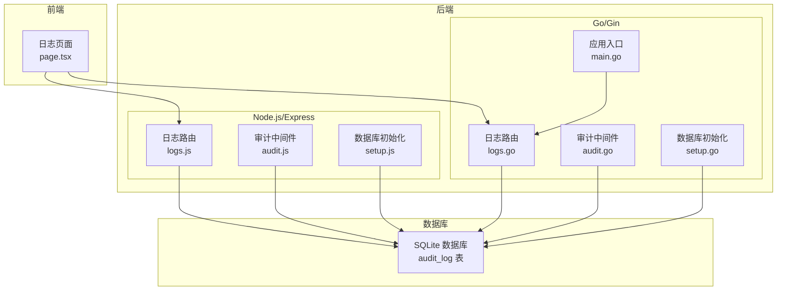
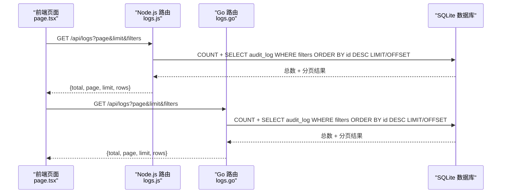
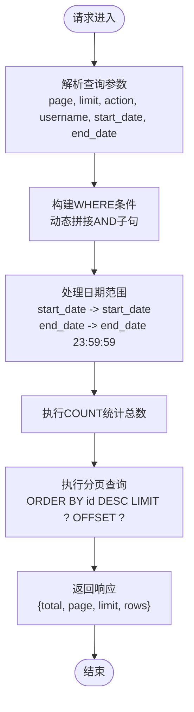
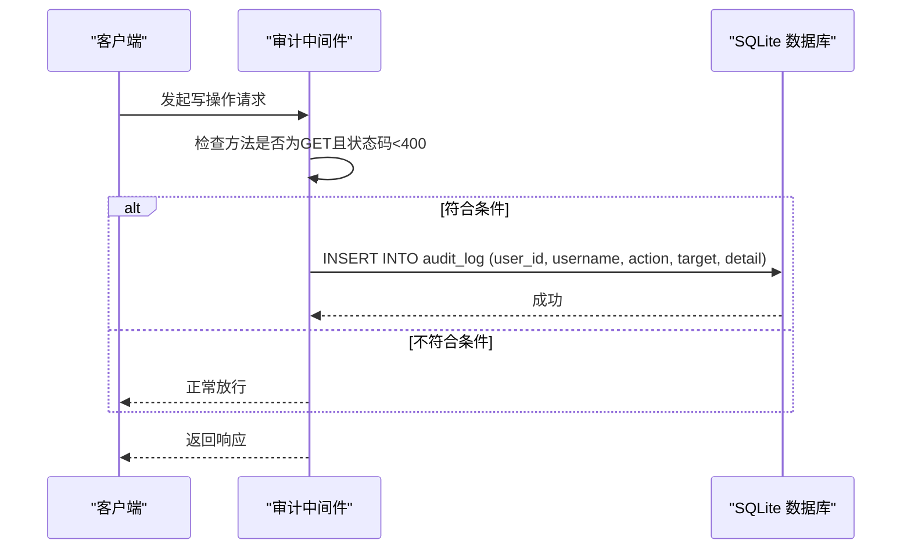
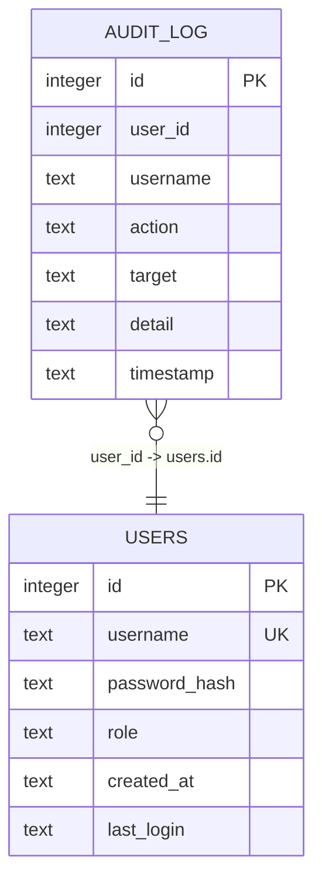
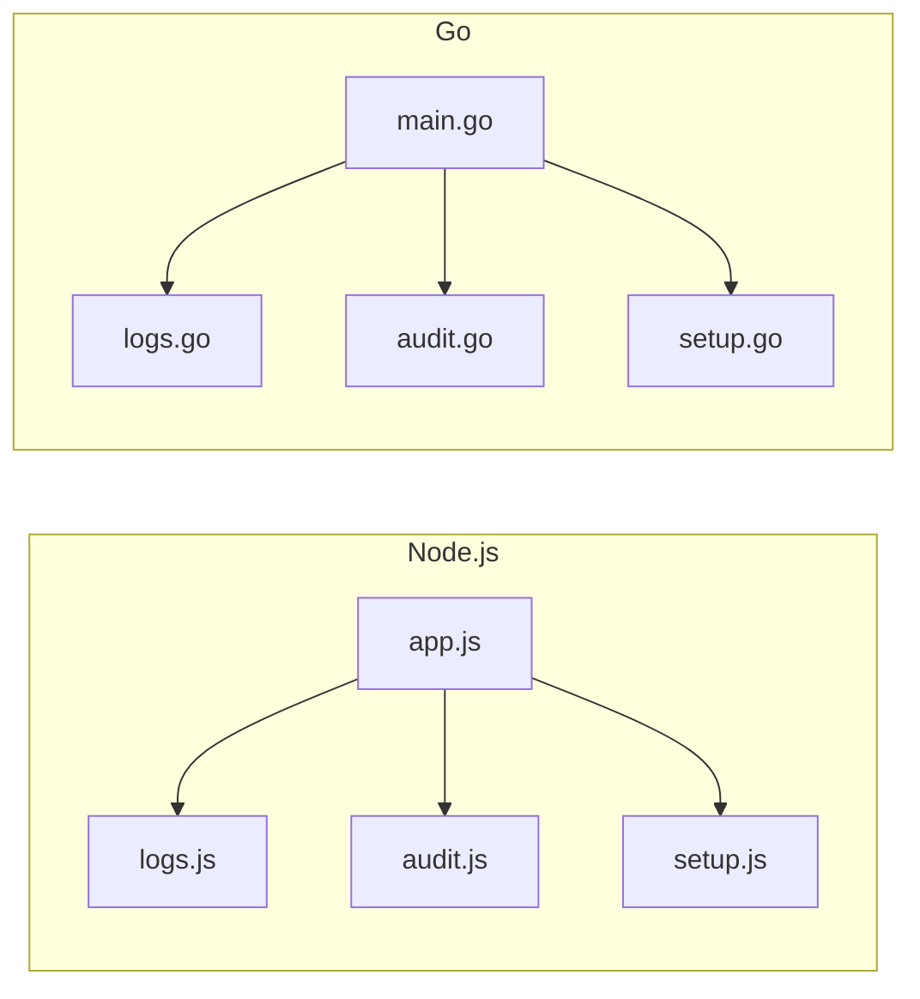

# 日志查询接口

<cite>
**本文档引用的文件**
- [logs.js](file://business-core/cms-server/routes/logs.js)
- [logs.go](file://business-core/cms-server-go/routes/logs.go)
- [audit.js](file://business-core/cms-server/middleware/audit.js)
- [audit.go](file://business-core/cms-server-go/middleware/audit.go)
- [models.go](file://business-core/cms-server-go/models/models.go)
- [setup.js](file://business-core/cms-server/db/setup.js)
- [setup.go](file://business-core/cms-server-go/db/setup.go)
- [page.tsx](file://ai-content-project/src/app/logs/page.tsx)
- [main.go](file://business-core/cms-server-go/main.go)
- [app.js](file://business-core/cms-server/app.js)
- [ZSTS-CMS-后端移交说明书.md](file://ZSTS-CMS-后端移交说明书.md)
</cite>

## 目录
1. [简介](#简介)
2. [项目结构](#项目结构)
3. [核心组件](#核心组件)
4. [架构概览](#架构概览)
5. [详细组件分析](#详细组件分析)
6. [依赖分析](#依赖分析)
7. [性能考虑](#性能考虑)
8. [故障排除指南](#故障排除指南)
9. [结论](#结论)
10. [附录](#附录)

## 简介
本文件为日志查询相关API的完整接口文档，覆盖操作日志查询接口、审计日志管理接口以及系统日志检索接口。文档详细说明了日志过滤条件、分页查询和排序规则的API规范；解释了日志级别分类、敏感信息脱敏处理和日志保留策略；提供了日志导出接口、实时日志订阅和告警通知的API说明，并给出性能优化建议与大数据量处理方案。

## 项目结构
日志系统由两套后端实现（Node.js/Express 与 Go/Gin）共同支撑，前端通过React组件展示日志列表并提供基础过滤功能。数据库采用SQLite，包含用户表、页面权限表和审计日志表。

**图表来源**
- [logs.js:1-59](file://business-core/cms-server/routes/logs.js#L1-L59)
- [logs.go:1-115](file://business-core/cms-server-go/routes/logs.go#L1-L115)
- [audit.js:1-75](file://business-core/cms-server/middleware/audit.js#L1-L75)
- [audit.go:1-96](file://business-core/cms-server-go/middleware/audit.go#L1-L96)
- [setup.js:1-115](file://business-core/cms-server/db/setup.js#L1-L115)
- [setup.go:1-187](file://business-core/cms-server-go/db/setup.go#L1-L187)
- [main.go:1-317](file://business-core/cms-server-go/main.go#L1-L317)
- [app.js:1-315](file://business-core/cms-server/app.js#L1-L315)

**章节来源**
- [logs.js:1-59](file://business-core/cms-server/routes/logs.js#L1-L59)
- [logs.go:1-115](file://business-core/cms-server-go/routes/logs.go#L1-L115)
- [audit.js:1-75](file://business-core/cms-server/middleware/audit.js#L1-L75)
- [audit.go:1-96](file://business-core/cms-server-go/middleware/audit.go#L1-L96)
- [setup.js:1-115](file://business-core/cms-server/db/setup.js#L1-L115)
- [setup.go:1-187](file://business-core/cms-server-go/db/setup.go#L1-L187)
- [main.go:1-317](file://business-core/cms-server-go/main.go#L1-L317)
- [app.js:1-315](file://business-core/cms-server/app.js#L1-L315)

## 核心组件
- 操作日志查询接口：支持按页码、每页条数、操作类型、用户名、起止日期进行过滤查询，返回总数、当前页、每页数量与日志行集合。
- 审计日志管理接口：提供清空日志能力（仅超级管理员），并具备自动审计中间件记录写操作的能力。
- 系统日志检索接口：基于SQLite的审计日志表进行全文模糊匹配与时间范围筛选。
- 日志模型与响应：统一的审计日志结构与查询响应结构，便于前后端交互。
- 前端展示：React组件负责日志列表渲染、统计卡片与基础过滤（用户名、目标、描述等）。

**章节来源**
- [logs.js:20-48](file://business-core/cms-server/routes/logs.js#L20-L48)
- [logs.go:26-101](file://business-core/cms-server-go/routes/logs.go#L26-L101)
- [models.go:53-70](file://business-core/cms-server-go/models/models.go#L53-L70)
- [page.tsx:34-193](file://ai-content-project/src/app/logs/page.tsx#L34-L193)

## 架构概览
日志查询与管理涉及以下关键流程：
- 前端发起查询请求，携带分页与过滤参数。
- 后端路由接收请求，构建SQL查询条件，执行COUNT与LIMIT/OFFSET查询。
- 审计中间件在非GET且状态码小于400的成功请求上异步记录写操作。
- 数据库层存储审计日志，支持按时间范围与关键字模糊匹配。

**图表来源**
- [logs.js:20-48](file://business-core/cms-server/routes/logs.js#L20-L48)
- [logs.go:26-101](file://business-core/cms-server-go/routes/logs.go#L26-L101)

**章节来源**
- [logs.js:20-48](file://business-core/cms-server/routes/logs.js#L20-L48)
- [logs.go:26-101](file://business-core/cms-server-go/routes/logs.go#L26-L101)

## 详细组件分析

### 操作日志查询接口
- 接口路径：GET /api/logs
- 请求参数：
  - page：页码，默认1
  - limit：每页条数，默认50
  - action：按操作类型模糊筛选
  - username：按用户名模糊筛选
  - start_date：起始日期（YYYY-MM-DD）
  - end_date：结束日期（YYYY-MM-DD）
- 响应结构：{ total, page, limit, rows }
- 过滤逻辑：
  - 动态拼接WHERE子句，支持多条件组合。
  - 日期范围自动扩展至当日23:59:59。
- 排序规则：按主键降序排列，保证最新日志优先显示。
- 分页实现：OFFSET = (page - 1) × limit，LIMIT为每页条数。

**图表来源**
- [logs.js:20-48](file://business-core/cms-server/routes/logs.js#L20-L48)
- [logs.go:26-101](file://business-core/cms-server-go/routes/logs.go#L26-L101)

**章节来源**
- [logs.js:20-48](file://business-core/cms-server/routes/logs.js#L20-L48)
- [logs.go:26-101](file://business-core/cms-server-go/routes/logs.go#L26-L101)
- [ZSTS-CMS-后端移交说明书.md:298-312](file://ZSTS-CMS-后端移交说明书.md#L298-L312)

### 审计日志管理接口
- 清空日志：DELETE /api/logs（仅超级管理员）
- 自动审计中间件：
  - Node.js：拦截响应，非GET且状态码<400时异步写入审计日志。
  - Go：中间件在请求完成后检查状态码，异步写入审计日志。
- 审计字段：user_id、username、action、target、detail、timestamp。

**图表来源**
- [audit.js:46-72](file://business-core/cms-server/middleware/audit.js#L46-L72)
- [audit.go:48-95](file://business-core/cms-server-go/middleware/audit.go#L48-L95)

**章节来源**
- [logs.js:50-56](file://business-core/cms-server/routes/logs.js#L50-L56)
- [logs.go:103-114](file://business-core/cms-server-go/routes/logs.go#L103-L114)
- [audit.js:15-40](file://business-core/cms-server/middleware/audit.js#L15-L40)
- [audit.go:16-46](file://business-core/cms-server-go/middleware/audit.go#L16-L46)

### 系统日志检索接口
- 数据模型：审计日志表包含id、user_id、username、action、target、detail、timestamp。
- 常见action枚举：login、create_user、delete_user、reset_password、update_permissions、update_page、update_global、create_ai_channel、update_ai_channel、delete_ai_channel、set_default_ai_channel、system_init。
- 前端过滤：React组件支持按action类型与关键字（用户名、目标、描述）进行本地过滤。

**图表来源**
- [setup.js:41-53](file://business-core/cms-server/db/setup.js#L41-L53)
- [setup.go:75-87](file://business-core/cms-server-go/db/setup.go#L75-L87)
- [models.go:53-62](file://business-core/cms-server-go/models/models.go#L53-L62)

**章节来源**
- [setup.js:41-53](file://business-core/cms-server/db/setup.js#L41-L53)
- [setup.go:75-87](file://business-core/cms-server-go/db/setup.go#L75-L87)
- [models.go:53-62](file://business-core/cms-server-go/models/models.go#L53-L62)
- [ZSTS-CMS-后端移交说明书.md:145-158](file://ZSTS-CMS-后端移交说明书.md#L145-L158)
- [page.tsx:41-53](file://ai-content-project/src/app/logs/page.tsx#L41-L53)

### 前端日志展示与过滤
- 统计卡片：展示总记录数及各类操作的数量分布。
- 过滤控件：支持按操作类型与关键字搜索（用户名、目标、描述）。
- 列表渲染：按时间倒序展示，包含操作图标、标签与简要详情。

**章节来源**
- [page.tsx:34-193](file://ai-content-project/src/app/logs/page.tsx#L34-L193)

## 依赖分析
- Node.js后端依赖better-sqlite3进行数据库操作，路由位于business-core/cms-server/routes/logs.js。
- Go后端依赖gin与sqlite3驱动，路由位于business-core/cms-server-go/routes/logs.go。
- 审计中间件分别位于business-core/cms-server/middleware/audit.js与business-core/cms-server-go/middleware/audit.go。
- 数据库初始化脚本分别位于business-core/cms-server/db/setup.js与business-core/cms-server-go/db/setup.go。
- 应用入口分别位于business-core/cms-server-go/main.go与business-core/cms-server/app.js。

**图表来源**
- [app.js:155-161](file://business-core/cms-server/app.js#L155-L161)
- [main.go:72-84](file://business-core/cms-server-go/main.go#L72-L84)
- [logs.js:1-59](file://business-core/cms-server/routes/logs.js#L1-L59)
- [logs.go:1-24](file://business-core/cms-server-go/routes/logs.go#L1-L24)
- [audit.js:1-75](file://business-core/cms-server/middleware/audit.js#L1-L75)
- [audit.go:1-96](file://business-core/cms-server-go/middleware/audit.go#L1-L96)
- [setup.js:1-115](file://business-core/cms-server/db/setup.js#L1-L115)
- [setup.go:1-187](file://business-core/cms-server-go/db/setup.go#L1-L187)

**章节来源**
- [app.js:155-161](file://business-core/cms-server/app.js#L155-L161)
- [main.go:72-84](file://business-core/cms-server-go/main.go#L72-L84)

## 性能考虑
- 分页与索引：当前查询按id降序分页，建议在timestamp与action字段建立索引以提升日期范围与类型过滤性能。
- 异步审计：Node.js与Go中间件均采用异步写入，避免阻塞主请求响应。
- SQL参数化：查询与统计均使用参数绑定，防止SQL注入并提高执行计划复用率。
- 前端过滤：React组件对已加载数据进行本地过滤，适合中小规模数据集；对于大规模数据，建议将过滤逻辑下沉至后端。
- 缓存策略：短期内可利用浏览器缓存与CDN加速静态资源，但日志查询应避免缓存敏感数据。

[本节为通用性能建议，不直接分析具体文件]

## 故障排除指南
- 数据库连接失败：Go实现中若打开数据库失败，会返回错误信息；检查数据库路径配置与文件权限。
- 超级管理员权限：清空日志接口要求超级管理员身份，确认JWT令牌与角色校验。
- 审计写入异常：中间件捕获异常并记录日志，检查数据库连接与表结构完整性。
- 前端无数据：确认前端已正确加载日志数据并检查网络请求状态码。

**章节来源**
- [logs.go:65-69](file://business-core/cms-server-go/routes/logs.go#L65-L69)
- [audit.go:18-23](file://business-core/cms-server-go/middleware/audit.go#L18-L23)
- [audit.js:24-40](file://business-core/cms-server/middleware/audit.js#L24-L40)

## 结论
本日志系统提供了完善的操作日志查询与管理能力，支持灵活的过滤、分页与排序，并通过审计中间件保障关键写操作的可追溯性。前端组件提供直观的展示与基础过滤功能。建议在生产环境中结合索引优化、异步处理与合理的日志保留策略，以满足高性能与合规性需求。

[本节为总结性内容，不直接分析具体文件]

## 附录

### API规范汇总
- 查询日志
  - 方法：GET
  - 路径：/api/logs
  - 查询参数：page、limit、action、username、start_date、end_date
  - 响应：{ total, page, limit, rows }
- 清空日志
  - 方法：DELETE
  - 路径：/api/logs
  - 权限：超级管理员
  - 响应：{ message }

**章节来源**
- [ZSTS-CMS-后端移交说明书.md:298-316](file://ZSTS-CMS-后端移交说明书.md#L298-L316)

### 日志级别分类与保留策略
- 日志级别：系统根据action字段区分不同操作类型，便于分级查看与审计。
- 保留策略：当前实现未设置自动清理机制，建议结合业务需求制定定期归档与清理策略（例如按月/季度归档、保留1年等）。

[本节为通用指导，不直接分析具体文件]

### 敏感信息脱敏处理
- 建议对请求体中的敏感字段（如密码、密钥）在审计detail中进行脱敏处理，仅记录必要摘要信息。
- 前端展示时避免泄露完整敏感信息，使用占位符或部分掩码显示。

[本节为通用指导，不直接分析具体文件]

### 日志导出、实时订阅与告警通知
- 日志导出：可在前端或后端实现CSV/JSON导出功能，建议支持批量下载与时间范围选择。
- 实时订阅：可通过WebSocket或Server-Sent Events推送新日志，前端轮询或长连接监听。
- 告警通知：基于action类型与阈值触发告警（如高频删除、异常登录），集成邮件/IM通知。

[本节为概念性说明，不直接分析具体文件]