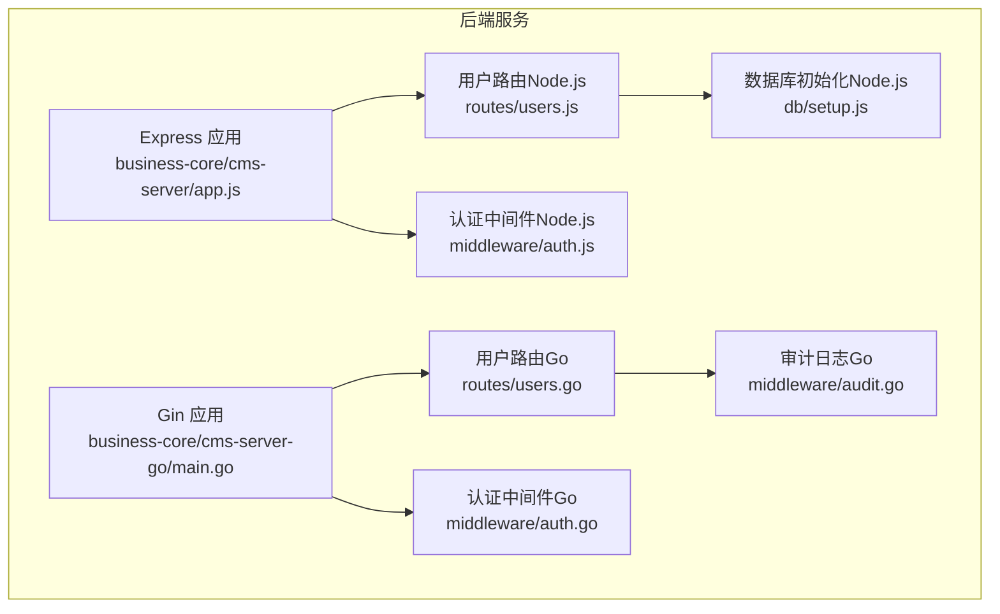
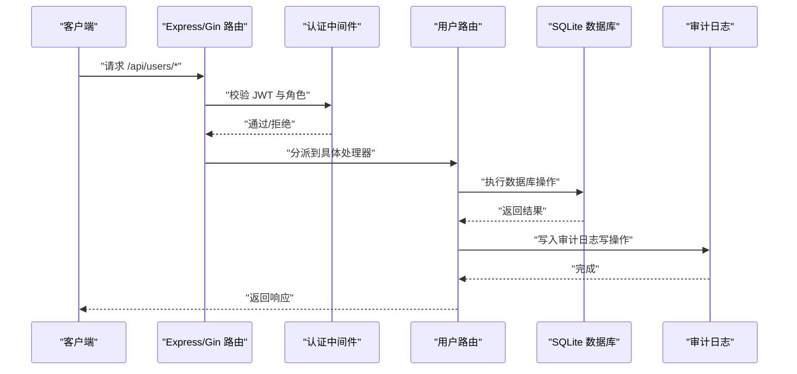
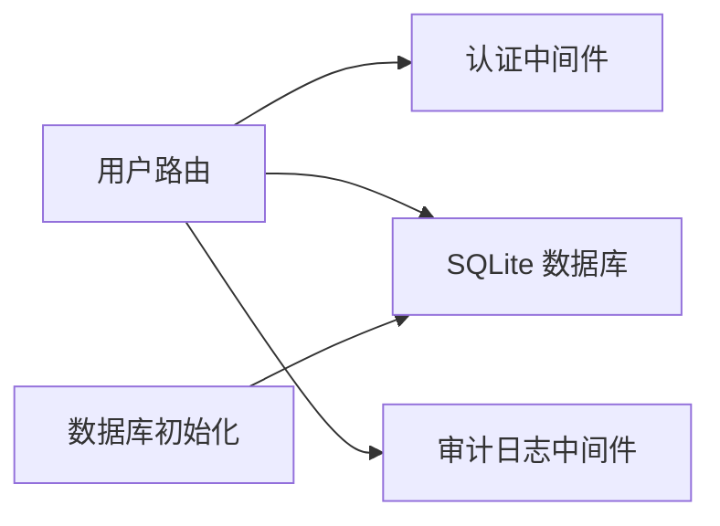

# 用户管理接口

<cite>
**本文引用的文件**
- [business-core/cms-server/routes/users.js](file://business-core/cms-server/routes/users.js)
- [business-core/cms-server-go/routes/users.go](file://business-core/cms-server-go/routes/users.go)
- [business-core/cms-server/middleware/auth.js](file://business-core/cms-server/middleware/auth.js)
- [business-core/cms-server-go/middleware/auth.go](file://business-core/cms-server-go/middleware/auth.go)
- [business-core/cms-server/db/setup.js](file://business-core/cms-server/db/setup.js)
- [business-core/cms-server/app.js](file://business-core/cms-server/app.js)
- [business-core/cms-server-go/main.go](file://business-core/cms-server-go/main.go)
- [business-core/cms-server-go/models/models.go](file://business-core/cms-server-go/models/models.go)
- [business-core/cms-server-go/middleware/audit.go](file://business-core/cms-server-go/middleware/audit.go)
- [ZSTS-CMS-后端移交说明书.md](file://ZSTS-CMS-后端移交说明书.md)
</cite>

## 目录
1. [简介](#简介)
2. [项目结构](#项目结构)
3. [核心组件](#核心组件)
4. [架构总览](#架构总览)
5. [详细组件分析](#详细组件分析)
6. [依赖关系分析](#依赖关系分析)
7. [性能考量](#性能考量)
8. [故障排查指南](#故障排查指南)
9. [结论](#结论)
10. [附录](#附录)

## 简介
本文件为用户管理相关API的完整接口文档，覆盖用户CRUD操作、权限管理、密码重置以及用户列表查询。文档同时说明不同用户角色（超级管理员、编辑员）的权限差异与操作限制，并提供请求/响应示例、错误码说明与安全注意事项。系统采用JWT进行认证，用户权限分为两类：
- 超级管理员：具备所有页面编辑权限与用户管理权限
- 编辑员：仅能编辑其被授权的页面内容

## 项目结构
用户管理功能位于后端服务的两条实现线：
- Node.js + Express 实现：位于 business-core/cms-server/routes/users.js
- Go + Gin 实现：位于 business-core/cms-server-go/routes/users.go

两者均受认证中间件保护，要求携带有效JWT令牌；其中用户管理接口进一步要求超级管理员角色。

图表来源
- [business-core/cms-server/app.js:155-161](file://business-core/cms-server/app.js#L155-L161)
- [business-core/cms-server-go/main.go:72-84](file://business-core/cms-server-go/main.go#L72-L84)
- [business-core/cms-server/routes/users.js:16](file://business-core/cms-server/routes/users.js#L16)
- [business-core/cms-server-go/routes/users.go:18-29](file://business-core/cms-server-go/routes/users.go#L18-L29)
- [business-core/cms-server/middleware/auth.js:20-44](file://business-core/cms-server/middleware/auth.js#L20-L44)
- [business-core/cms-server-go/middleware/auth.go:17-84](file://business-core/cms-server-go/middleware/auth.go#L17-L84)
- [business-core/cms-server-go/middleware/audit.go:16-46](file://business-core/cms-server-go/middleware/audit.go#L16-L46)
- [business-core/cms-server/db/setup.js:14-108](file://business-core/cms-server/db/setup.js#L14-L108)

章节来源
- [business-core/cms-server/app.js:155-161](file://business-core/cms-server/app.js#L155-L161)
- [business-core/cms-server-go/main.go:72-84](file://business-core/cms-server-go/main.go#L72-L84)

## 核心组件
- 用户路由（Node.js）：提供用户列表、创建、重置密码、更新权限、删除账号的REST接口，均由超级管理员中间件保护
- 用户路由（Go）：提供相同的用户管理接口，使用Gin框架与JWT中间件
- 认证中间件：负责JWT校验与角色校验（超级管理员）
- 审计日志（Go）：对写操作进行异步审计记录
- 数据库初始化：创建用户表、页面权限表、审计日志表，并初始化默认超级管理员

章节来源
- [business-core/cms-server/routes/users.js:26-151](file://business-core/cms-server/routes/users.js#L26-L151)
- [business-core/cms-server-go/routes/users.go:31-248](file://business-core/cms-server-go/routes/users.go#L31-L248)
- [business-core/cms-server/middleware/auth.js:20-44](file://business-core/cms-server/middleware/auth.js#L20-L44)
- [business-core/cms-server-go/middleware/auth.go:17-84](file://business-core/cms-server-go/middleware/auth.go#L17-L84)
- [business-core/cms-server-go/middleware/audit.go:16-95](file://business-core/cms-server-go/middleware/audit.go#L16-L95)
- [business-core/cms-server/db/setup.js:14-108](file://business-core/cms-server/db/setup.js#L14-L108)

## 架构总览
用户管理接口的调用链如下：
- 客户端发送带Authorization头的请求至/api/users
- Express/Gin中间件执行JWT校验与超级管理员校验
- 路由根据HTTP方法分派到具体处理器
- 处理器执行数据库操作（插入、更新、删除、查询）
- 写操作触发审计日志记录

图表来源
- [business-core/cms-server/app.js:155-161](file://business-core/cms-server/app.js#L155-L161)
- [business-core/cms-server-go/main.go:72-84](file://business-core/cms-server-go/main.go#L72-L84)
- [business-core/cms-server/middleware/auth.js:20-44](file://business-core/cms-server/middleware/auth.js#L20-L44)
- [business-core/cms-server-go/middleware/auth.go:17-84](file://business-core/cms-server-go/middleware/auth.go#L17-L84)
- [business-core/cms-server-go/middleware/audit.go:16-95](file://business-core/cms-server-go/middleware/audit.go#L16-L95)

## 详细组件分析

### 用户列表查询接口
- 方法与路径：GET /api/users
- 权限要求：超级管理员
- 功能描述：返回所有用户的基本信息及页面权限列表
- 响应字段：
  - id: 用户ID
  - username: 用户名
  - role: 角色（super_admin/editor）
  - created_at: 创建时间
  - last_login: 最后登录时间
  - permissions: 页面权限数组（page_key）

请求示例
- 请求头：Authorization: Bearer <token>
- 请求路径：GET /api/users

响应示例
- 成功响应：[{ id, username, role, created_at, last_login, permissions }]

错误码
- 401 未认证
- 403 需要超级管理员权限

章节来源
- [business-core/cms-server/routes/users.js:26-42](file://business-core/cms-server/routes/users.js#L26-L42)
- [business-core/cms-server-go/routes/users.go:31-72](file://business-core/cms-server-go/routes/users.go#L31-L72)

### 用户创建接口
- 方法与路径：POST /api/users
- 权限要求：超级管理员
- 请求体字段：
  - username: 必填，唯一
  - password: 必填，至少6位
  - role: 可选，取值 editor 或 super_admin
  - permissions: 可选，页面权限数组
- 功能描述：创建新用户并写入页面权限
- 响应字段：id, username, role

请求示例
- 请求头：Authorization: Bearer <token>
- 请求体：{ username, password, role?, permissions? }

响应示例
- 成功响应：{ id, username, role }

错误码
- 400 参数无效
- 409 用户名已存在
- 500 数据库错误

章节来源
- [business-core/cms-server/routes/users.js:44-87](file://business-core/cms-server/routes/users.js#L44-L87)
- [business-core/cms-server-go/routes/users.go:74-135](file://business-core/cms-server-go/routes/users.go#L74-L135)

### 密码重置接口
- 方法与路径：PUT /api/users/:id
- 权限要求：超级管理员
- 请求体字段：
  - password: 必填，至少6位
- 功能描述：重置指定用户密码（仅超级管理员可操作）
- 响应字段：message

请求示例
- 请求头：Authorization: Bearer <token>
- 请求体：{ password }

响应示例
- 成功响应：{ message: "密码已重置" }

错误码
- 400 参数无效
- 500 数据库错误

章节来源
- [business-core/cms-server/routes/users.js:89-105](file://business-core/cms-server/routes/users.js#L89-L105)
- [business-core/cms-server-go/routes/users.go:137-173](file://business-core/cms-server-go/routes/users.go#L137-L173)

### 页面权限更新接口
- 方法与路径：PUT /api/users/:id/permissions
- 权限要求：超级管理员
- 请求体字段：
  - permissions: 必填，页面权限数组
- 功能描述：更新指定用户的页面权限（先清空旧权限，再批量写入新权限）
- 响应字段：message

请求示例
- 请求头：Authorization: Bearer <token>
- 请求体：{ permissions: [page_key...] }

响应示例
- 成功响应：{ message: "权限已更新" }

错误码
- 400 参数无效
- 500 数据库错误

章节来源
- [business-core/cms-server/routes/users.js:107-133](file://business-core/cms-server/routes/users.js#L107-L133)
- [business-core/cms-server-go/routes/users.go:175-213](file://business-core/cms-server-go/routes/users.go#L175-L213)

### 用户删除接口
- 方法与路径：DELETE /api/users/:id
- 权限要求：超级管理员
- 功能描述：删除指定用户（不允许删除自身）
- 响应字段：message

请求示例
- 请求头：Authorization: Bearer <token>

响应示例
- 成功响应：{ message: "账号已删除" }

错误码
- 400 不能删除自己的账号
- 500 数据库错误

章节来源
- [business-core/cms-server/routes/users.js:135-151](file://business-core/cms-server/routes/users.js#L135-L151)
- [business-core/cms-server-go/routes/users.go:215-248](file://business-core/cms-server-go/routes/users.go#L215-L248)

### 权限模型与角色差异
- 超级管理员（super_admin）
  - 拥有所有页面编辑权限
  - 可访问所有用户管理接口
- 编辑员（editor）
  - 仅能编辑被授权的页面内容
  - 无用户管理权限

章节来源
- [business-core/cms-server/db/setup.js:18-39](file://business-core/cms-server/db/setup.js#L18-L39)
- [business-core/cms-server-go/middleware/auth.go:86-132](file://business-core/cms-server-go/middleware/auth.go#L86-L132)

### 审计日志
- 写操作（POST/PUT/DELETE）会记录审计日志，包含操作类型、目标、详情等
- Go实现提供异步审计中间件，避免阻塞响应

章节来源
- [business-core/cms-server/routes/users.js:75-76](file://business-core/cms-server/routes/users.js#L75-L76)
- [business-core/cms-server-go/middleware/audit.go:16-95](file://business-core/cms-server-go/middleware/audit.go#L16-L95)

## 依赖关系分析
用户管理接口的依赖关系如下：
- 路由层依赖认证中间件
- 处理器依赖数据库（SQLite）
- 写操作依赖审计中间件
- 数据库初始化脚本创建用户表、权限表、审计日志表

图表来源
- [business-core/cms-server/routes/users.js:16](file://business-core/cms-server/routes/users.js#L16)
- [business-core/cms-server-go/routes/users.go:18-29](file://business-core/cms-server-go/routes/users.go#L18-L29)
- [business-core/cms-server/db/setup.js:14-108](file://business-core/cms-server/db/setup.js#L14-L108)

章节来源
- [business-core/cms-server/routes/users.js:16](file://business-core/cms-server/routes/users.js#L16)
- [business-core/cms-server-go/routes/users.go:18-29](file://business-core/cms-server-go/routes/users.go#L18-L29)
- [business-core/cms-server/db/setup.js:14-108](file://business-core/cms-server/db/setup.js#L14-L108)

## 性能考量
- 数据库事务批处理：创建用户时批量写入权限，减少多次往返
- 事务封装：权限更新采用事务，保证原子性
- 审计日志异步化：写操作异步记录，避免阻塞主流程
- JWT校验：中间件在进入路由前完成校验，减少重复校验成本

章节来源
- [business-core/cms-server/routes/users.js:69-73](file://business-core/cms-server/routes/users.js#L69-L73)
- [business-core/cms-server-go/routes/users.go:121-128](file://business-core/cms-server-go/routes/users.go#L121-L128)
- [business-core/cms-server-go/middleware/audit.go:58-94](file://business-core/cms-server-go/middleware/audit.go#L58-L94)

## 故障排查指南
- 401 未认证
  - 检查Authorization头格式是否为Bearer Token
  - 确认JWT未过期
- 403 需要超级管理员权限
  - 确认当前用户角色为super_admin
- 409 用户名已存在
  - 更换用户名或使用其他账户
- 400 参数无效
  - 检查请求体字段是否符合要求（如密码长度、权限数组格式）
- 500 数据库错误
  - 查看服务器日志，确认数据库连接与SQL语句

章节来源
- [business-core/cms-server/middleware/auth.js:20-44](file://business-core/cms-server/middleware/auth.js#L20-L44)
- [business-core/cms-server-go/middleware/auth.go:17-84](file://business-core/cms-server-go/middleware/auth.go#L17-L84)
- [business-core/cms-server/routes/users.js:48-53](file://business-core/cms-server/routes/users.js#L48-L53)
- [business-core/cms-server-go/routes/users.go:77-85](file://business-core/cms-server-go/routes/users.go#L77-L85)

## 结论
用户管理接口提供了完善的用户CRUD能力与细粒度的权限控制，结合JWT认证与审计日志，满足了内容管理系统的安全与合规需求。建议在生产环境中：
- 更换默认密码与JWT密钥
- 考虑将SQLite迁移到关系型数据库
- 引入刷新令牌机制提升安全性

## 附录

### 数据模型与表结构
- users表：id, username, password_hash, role, created_at, last_login
- page_permissions表：user_id, page_key（联合主键）
- audit_log表：id, user_id, username, action, target, detail, timestamp

章节来源
- [business-core/cms-server/db/setup.js:18-53](file://business-core/cms-server/db/setup.js#L18-L53)
- [ZSTS-CMS-后端移交说明书.md:118-178](file://ZSTS-CMS-后端移交说明书.md#L118-L178)

### 请求/响应示例与错误码汇总
- GET /api/users：返回用户列表（含permissions）
- POST /api/users：创建用户（role可选，permissions可选）
- PUT /api/users/:id：重置密码（至少6位）
- PUT /api/users/:id/permissions：更新页面权限（数组）
- DELETE /api/users/:id：删除用户（不可删除自己）

错误码
- 400 参数无效/禁止删除自己
- 401 未认证
- 403 需要超级管理员权限
- 409 用户名已存在
- 500 数据库错误

章节来源
- [business-core/cms-server/routes/users.js:26-151](file://business-core/cms-server/routes/users.js#L26-L151)
- [business-core/cms-server-go/routes/users.go:31-248](file://business-core/cms-server-go/routes/users.go#L31-L248)
- [ZSTS-CMS-后端移交说明书.md:239-275](file://ZSTS-CMS-后端移交说明书.md#L239-L275)