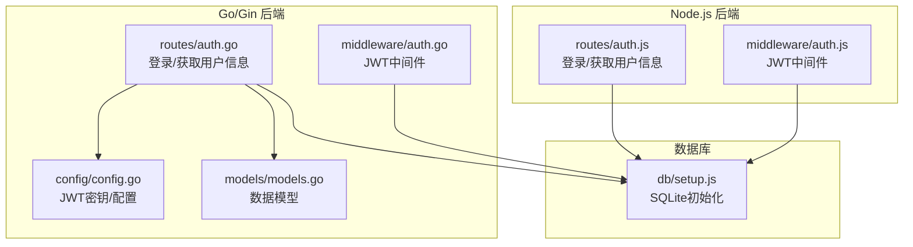
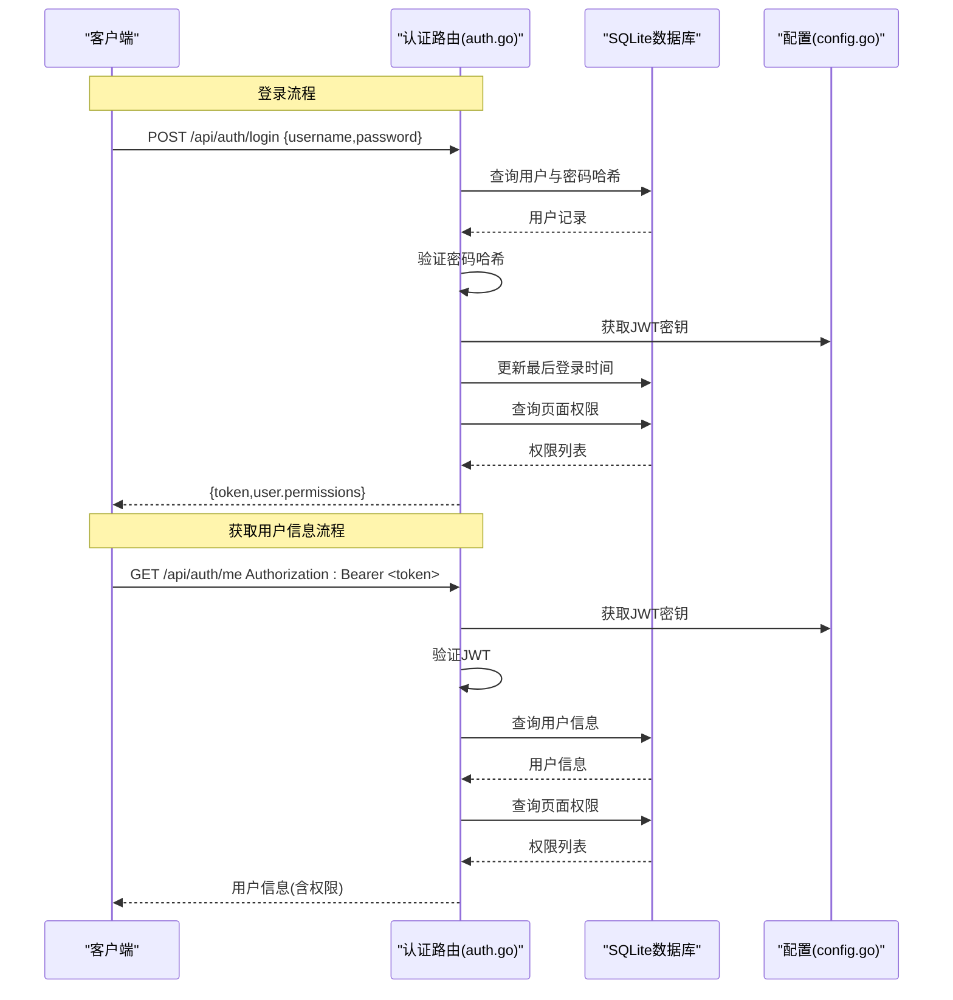
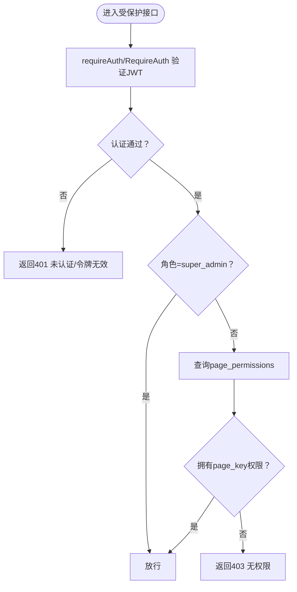
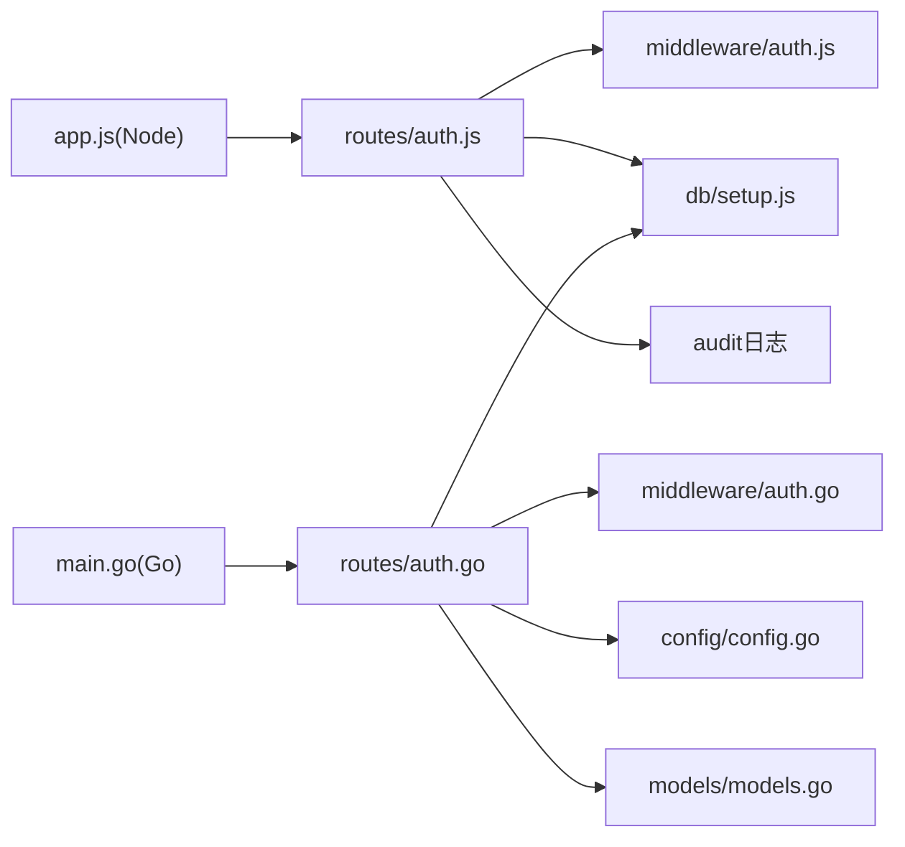
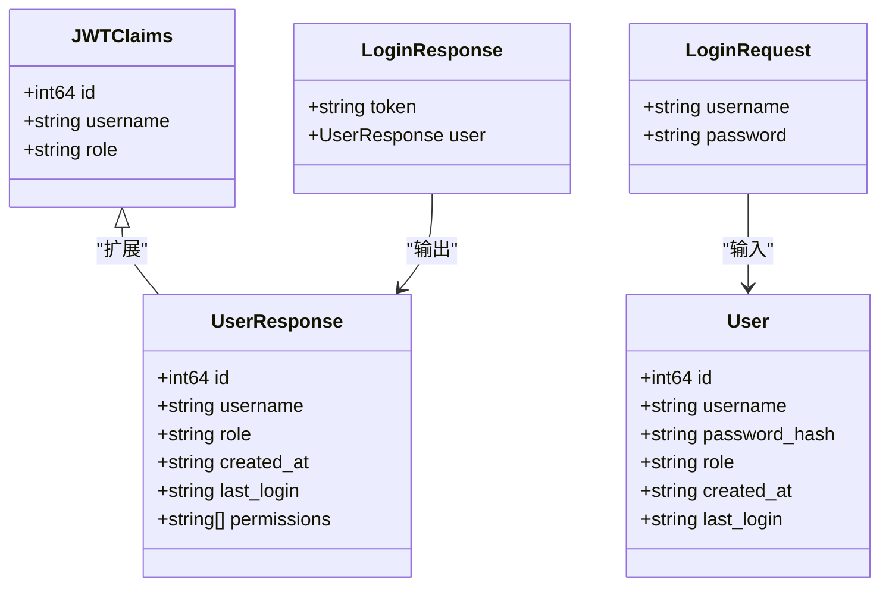

# 认证接口

<cite>
**本文引用的文件**
- [auth.js](file://business-core/cms-server/routes/auth.js)
- [auth.js](file://business-core/cms-server/middleware/auth.js)
- [auth.go](file://business-core/cms-server-go/routes/auth.go)
- [auth.go](file://business-core/cms-server-go/middleware/auth.go)
- [config.go](file://business-core/cms-server-go/config/config.go)
- [models.go](file://business-core/cms-server-go/models/models.go)
- [setup.js](file://business-core/cms-server/db/setup.js)
- [app.js](file://business-core/cms-server/app.js)
- [main.go](file://business-core/cms-server-go/main.go)
</cite>

## 目录
1. [简介](#简介)
2. [项目结构](#项目结构)
3. [核心组件](#核心组件)
4. [架构总览](#架构总览)
5. [详细组件分析](#详细组件分析)
6. [依赖关系分析](#依赖关系分析)
7. [性能考虑](#性能考虑)
8. [故障排除指南](#故障排除指南)
9. [结论](#结论)
10. [附录](#附录)

## 简介
本文件为认证相关API的详细接口文档，覆盖以下三个核心接口：
- 登录接口：POST /api/auth/login
- 登出接口：POST /api/auth/logout
- 获取用户信息接口：GET /api/auth/me

文档内容包括：
- 请求参数与响应格式
- HTTP状态码与错误处理
- JWT令牌生成与验证机制
- 用户权限验证流程
- 认证头部格式与令牌有效期管理
- 实际的curl命令与JavaScript调用示例

## 项目结构
认证能力在两个后端实现中均有覆盖：
- Node.js版本：位于 business-core/cms-server/routes/auth.js 与 business-core/cms-server/middleware/auth.js
- Go/Gin版本：位于 business-core/cms-server-go/routes/auth.go 与 business-core/cms-server-go/middleware/auth.go

图表来源
- [auth.js:1-99](file://business-core/cms-server/routes/auth.js#L1-L99)
- [auth.js:1-86](file://business-core/cms-server/middleware/auth.js#L1-L86)
- [auth.go:1-174](file://business-core/cms-server-go/routes/auth.go#L1-L174)
- [auth.go:1-203](file://business-core/cms-server-go/middleware/auth.go#L1-L203)
- [config.go:1-95](file://business-core/cms-server-go/config/config.go#L1-L95)
- [models.go:1-145](file://business-core/cms-server-go/models/models.go#L1-L145)
- [setup.js:1-115](file://business-core/cms-server/db/setup.js#L1-L115)

章节来源
- [auth.js:1-99](file://business-core/cms-server/routes/auth.js#L1-L99)
- [auth.go:1-174](file://business-core/cms-server-go/routes/auth.go#L1-L174)

## 核心组件
- 认证中间件（Node.js）：requireAuth、requireSuperAdmin、requirePagePerm
- 认证中间件（Go/Gin）：RequireAuth、RequireSuperAdmin、RequirePagePerm、AIAuth
- JWT配置（Go/Gin）：GetJWTSecret
- 数据模型（Go/Gin）：JWTClaims、User、UserResponse、LoginRequest、LoginResponse
- 数据库初始化（Node.js）：SQLite表结构与默认超级管理员

章节来源
- [auth.js:1-86](file://business-core/cms-server/middleware/auth.js#L1-L86)
- [auth.go:1-203](file://business-core/cms-server-go/middleware/auth.go#L1-L203)
- [config.go:83-89](file://business-core/cms-server-go/config/config.go#L83-L89)
- [models.go:132-144](file://business-core/cms-server-go/models/models.go#L132-L144)
- [setup.js:14-108](file://business-core/cms-server/db/setup.js#L14-L108)

## 架构总览
认证流程概览（以Go/Gin为例）：
- 登录：接收用户名/密码，校验后签发JWT，返回token与用户信息（含权限列表）
- 获取用户信息：从Authorization头解析Bearer token，验证后查询用户与权限
- 权限验证：中间件根据角色与页面权限进行授权控制

图表来源
- [auth.go:27-104](file://business-core/cms-server-go/routes/auth.go#L27-L104)
- [auth.go:106-173](file://business-core/cms-server-go/routes/auth.go#L106-L173)
- [config.go:83-89](file://business-core/cms-server-go/config/config.go#L83-L89)
- [setup.js:18-53](file://business-core/cms-server/db/setup.js#L18-L53)

## 详细组件分析

### 接口定义与规范

#### 登录接口
- 方法与路径：POST /api/auth/login
- 功能：用户凭据校验通过后签发JWT令牌，并返回用户信息与权限列表
- 请求体字段
  - username: string，必填
  - password: string，必填
- 成功响应字段
  - token: string，JWT字符串
  - user: object
    - id: integer
    - username: string
    - role: string
    - permissions: string[]，页面权限键列表
- 失败响应字段
  - error: string，错误描述
- HTTP状态码
  - 200：成功
  - 400：缺少用户名或密码
  - 401：用户名或密码错误
  - 500：数据库连接失败/查询权限失败/令牌生成失败
- 错误处理
  - 缺少必填字段时返回400
  - 用户不存在或密码错误返回401
  - 数据库异常返回500
- 令牌有效期
  - Node.js：7天
  - Go/Gin：7天（硬编码exp）
- 审计日志
  - 登录成功后记录审计日志

章节来源
- [auth.js:22-66](file://business-core/cms-server/routes/auth.js#L22-L66)
- [auth.go:27-104](file://business-core/cms-server-go/routes/auth.go#L27-L104)
- [models.go:23-33](file://business-core/cms-server-go/models/models.go#L23-L33)

#### 登出接口
- 方法与路径：POST /api/auth/logout
- 功能：前端清空本地token即可；后端无需额外操作
- 请求体：无
- 成功响应：无内容（204/200视前端实现）
- 失败响应：无
- HTTP状态码：200/204
- 说明：该接口仅作为语义约定存在，后端不执行撤销令牌等操作

章节来源
- [auth.js:2-4](file://business-core/cms-server/routes/auth.js#L2-L4)

#### 获取用户信息接口
- 方法与路径：GET /api/auth/me
- 功能：根据Authorization头中的Bearer token返回当前用户信息与权限
- 请求头
  - Authorization: Bearer <token>
- 成功响应字段
  - id: integer
  - username: string
  - role: string
  - created_at: string
  - last_login: string|null
  - permissions: string[]，页面权限键列表
- 失败响应字段
  - error: string，错误描述
- HTTP状态码
  - 200：成功
  - 401：未提供认证令牌/令牌格式错误/令牌已失效/用户不存在
  - 500：数据库连接失败/查询权限失败
- 错误处理
  - 缺少Authorization头或格式不正确返回401
  - JWT验证失败返回401
  - 用户不存在返回401
  - 数据库异常返回500

章节来源
- [auth.js:68-96](file://business-core/cms-server/routes/auth.js#L68-L96)
- [auth.go:106-173](file://business-core/cms-server-go/routes/auth.go#L106-L173)

### JWT令牌生成与验证机制

#### 生成机制
- Node.js
  - 使用jsonwebtoken库，密钥来自process.env.JWT_SECRET或默认值
  - 令牌包含：id、username、role
  - 有效期：7天
- Go/Gin
  - 使用github.com/golang-jwt/jwt/v5，密钥来自config.GetJWTSecret()
  - 令牌包含：id、username、role
  - 有效期：7天（exp字段）

#### 验证机制
- Node.js
  - 中间件requireAuth从Authorization头解析Bearer token并验证
  - 验证失败返回401
- Go/Gin
  - 中间件RequireAuth从Authorization头解析Bearer token并验证
  - 支持AIAuth多通道认证（Authorization、URL token、Cookie）
  - 验证失败返回401

章节来源
- [auth.js:12-14](file://business-core/cms-server/middleware/auth.js#L12-L14)
- [auth.go:17-63](file://business-core/cms-server-go/middleware/auth.go#L17-L63)
- [config.go:83-89](file://business-core/cms-server-go/config/config.go#L83-L89)

### 用户权限验证流程

#### 角色与权限
- 角色
  - super_admin：超级管理员，拥有所有页面权限
  - editor：编辑者，按页面权限控制
- 页面权限
  - 存储于page_permissions表，每条记录包含user_id与page_key
  - 默认超级管理员拥有多个页面权限键

#### 授权中间件
- Node.js
  - requireSuperAdmin：要求角色为super_admin
  - requirePagePerm(pageKey)：检查用户是否具有指定page_key权限
- Go/Gin
  - RequireSuperAdmin：要求角色为super_admin
  - RequirePagePerm(pageKey)：检查用户是否具有指定page_key权限
  - AIAuth：支持多种认证来源（Authorization、URL token、Cookie）

图表来源
- [auth.js:37-63](file://business-core/cms-server/middleware/auth.js#L37-L63)
- [auth.go:65-132](file://business-core/cms-server-go/middleware/auth.go#L65-L132)
- [setup.js:31-53](file://business-core/cms-server/db/setup.js#L31-L53)

章节来源
- [auth.js:37-63](file://business-core/cms-server/middleware/auth.js#L37-L63)
- [auth.go:65-132](file://business-core/cms-server-go/middleware/auth.go#L65-L132)
- [setup.js:72-104](file://business-core/cms-server/db/setup.js#L72-L104)

### 认证头部格式与令牌有效期管理

#### 认证头部格式
- 必须包含Authorization头，格式为Bearer <token>
- Node.js实现支持空格分隔的"Bearer <token>"形式
- Go/Gin实现支持"Bearer "前缀去除后的token

#### 令牌有效期
- 默认7天
- Node.js：JWT_SECRET配置项控制密钥
- Go/Gin：config.GetJWTSecret()控制密钥

#### 令牌撤销与刷新
- 当前实现未提供令牌撤销（黑名单）机制
- 建议生产环境启用JWT黑名单或短周期令牌配合刷新策略

章节来源
- [auth.js:44-53](file://business-core/cms-server/routes/auth.js#L44-L53)
- [auth.go:76-88](file://business-core/cms-server-go/routes/auth.go#L76-L88)
- [config.go:83-89](file://business-core/cms-server-go/config/config.go#L83-L89)

### 实际调用示例

#### curl命令
- 登录
  - curl -X POST http://localhost:3001/api/auth/login -H "Content-Type: application/json" -d '{"username":"admin","password":"admin123"}'
- 获取用户信息
  - curl -H "Authorization: Bearer <your_token>" http://localhost:3001/api/auth/me
- 登出（前端清空token即可）
  - 无后端请求

#### JavaScript调用示例
- 登录
  - fetch('/api/auth/login', { method: 'POST', headers: {'Content-Type': 'application/json'}, body: JSON.stringify({username:'admin', password:'admin123'}) })
- 获取用户信息
  - fetch('/api/auth/me', { headers: {'Authorization': 'Bearer ' + localStorage.getItem('token')} })
- 登出
  - localStorage.removeItem('token')

注意：以上示例基于当前实现，具体路径与头部格式以实际部署为准。

章节来源
- [auth.js:22-66](file://business-core/cms-server/routes/auth.js#L22-L66)
- [auth.go:27-104](file://business-core/cms-server-go/routes/auth.go#L27-L104)

## 依赖关系分析

图表来源
- [auth.js:13-14](file://business-core/cms-server/routes/auth.js#L13-L14)
- [auth.go:8-16](file://business-core/cms-server-go/routes/auth.go#L8-L16)
- [config.go:27-56](file://business-core/cms-server-go/config/config.go#L27-L56)
- [models.go:1-145](file://business-core/cms-server-go/models/models.go#L1-L145)
- [setup.js:14-108](file://business-core/cms-server/db/setup.js#L14-L108)
- [app.js:156-161](file://business-core/cms-server/app.js#L156-L161)
- [main.go:72-84](file://business-core/cms-server-go/main.go#L72-L84)

章节来源
- [app.js:156-161](file://business-core/cms-server/app.js#L156-L161)
- [main.go:72-84](file://business-core/cms-server-go/main.go#L72-L84)

## 性能考虑
- JWT验证为内存计算，开销极低
- 数据库查询涉及用户信息与权限查询，建议：
  - 在用户表与权限表建立合适索引
  - 对频繁访问的用户信息进行缓存
  - 控制权限列表长度，避免过大响应体
- 令牌有效期7天，建议结合业务场景评估是否需要更短有效期

## 故障排除指南
- 401 未认证/令牌格式错误
  - 检查Authorization头是否包含"Bearer "前缀
  - 确认token未被截断或篡改
- 401 令牌已失效
  - 检查JWT_SECRET是否一致
  - 确认系统时间同步
  - 令牌是否超过7天有效期
- 401 用户不存在
  - 确认用户ID在数据库中存在
- 403 无页面编辑权限
  - 检查用户角色是否为super_admin
  - 确认page_key是否正确
- 500 数据库连接失败/查询权限失败
  - 检查DB_PATH配置
  - 确认数据库文件存在且可读写

章节来源
- [auth.js:25-35](file://business-core/cms-server/routes/auth.js#L25-L35)
- [auth.go:46-55](file://business-core/cms-server-go/routes/auth.go#L46-L55)
- [auth.go:38-49](file://business-core/cms-server-go/middleware/auth.go#L38-L49)

## 结论
本认证体系提供了完整的登录、登出与用户信息查询能力，采用JWT进行无状态认证，并通过中间件实现角色与页面权限控制。建议在生产环境中：
- 更换默认JWT_SECRET
- 考虑启用令牌黑名单或短周期令牌
- 对高并发场景优化数据库查询与缓存策略
- 明确登出流程与令牌撤销机制

## 附录

### 数据模型定义（Go/Gin）

图表来源
- [models.go:3-21](file://business-core/cms-server-go/models/models.go#L3-L21)
- [models.go:132-144](file://business-core/cms-server-go/models/models.go#L132-L144)

### 数据库表结构（Node.js）
- users表：id、username、password_hash、role、created_at、last_login
- page_permissions表：user_id、page_key（联合主键）
- audit_log表：审计日志

章节来源
- [setup.js:18-53](file://business-core/cms-server/db/setup.js#L18-L53)