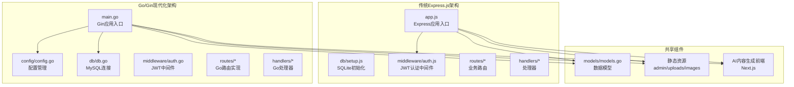
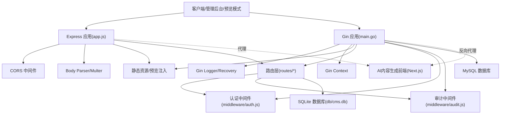
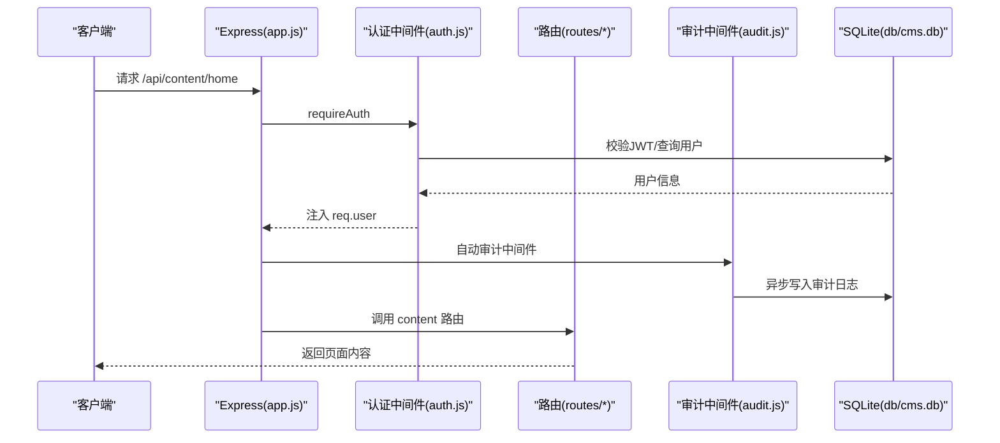
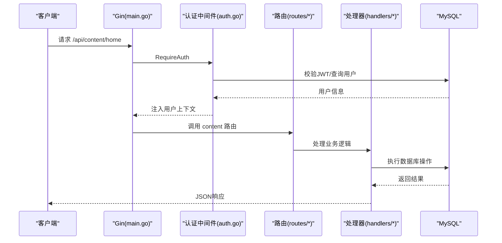
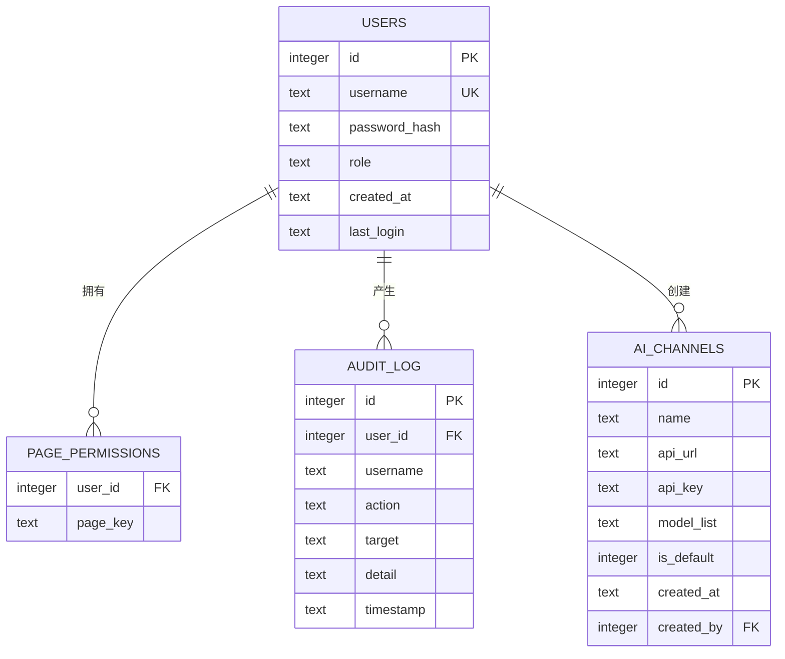
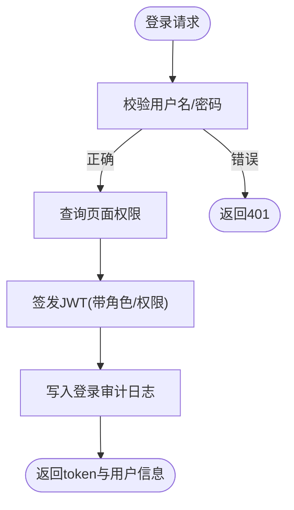
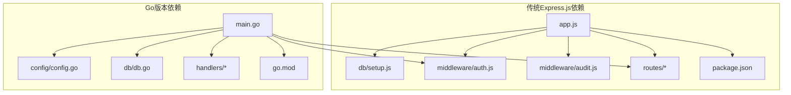

# 后端服务架构

<cite>
**本文档引用的文件**
- [main.go](file://cms-server-go/main.go)
- [config.go](file://cms-server-go/config/config.go)
- [db.go](file://cms-server-go/db/db.go)
- [models.go](file://cms-server-go/models/models.go)
- [auth.go](file://cms-server-go/middleware/auth.go)
- [auth.go](file://cms-server-go/routes/auth.go)
- [users.go](file://cms-server-go/routes/users.go)
- [content.go](file://cms-server-go/routes/content.go)
- [logs.go](file://cms-server-go/routes/logs.go)
- [ai_channels.go](file://cms-server-go/routes/ai_channels.go)
- [upload.go](file://cms-server-go/handlers/upload.go)
- [preview.go](file://cms-server-go/handlers/preview.go)
- [snapshot.go](file://cms-server-go/handlers/snapshot.go)
- [app.js](file://cms-server/app.js)
- [package.json](file://cms-server/package.json)
</cite>

## 更新摘要
**所做更改**
- 新增Go/Gin后端服务完整实现文档
- 更新数据库设计：从SQLite迁移到MySQL
- 新增Go版本中间件、路由、处理器实现
- 更新API接口文档以反映两个版本的差异
- 新增Go版本的配置管理、模型定义和错误处理
- 更新架构图以展示双后端架构

## 目录
1. [简介](#简介)
2. [项目结构](#项目结构)
3. [核心组件](#核心组件)
4. [架构总览](#架构总览)
5. [详细组件分析](#详细组件分析)
6. [Go后端服务实现](#go后端服务实现)
7. [数据库设计与初始化](#数据库设计与初始化)
8. [认证与授权机制](#认证与授权机制)
9. [API接口文档](#api接口文档)
10. [依赖关系分析](#依赖关系分析)
11. [性能考量](#性能考量)
12. [故障排查指南](#故障排查指南)
13. [结论](#结论)
14. [附录](#附录)

## 简介
本文档面向CMS后端服务，详细介绍基于Express.js和Go/Gin的双后端架构。围绕应用初始化、中间件体系、路由架构、数据库设计、认证与授权、审计日志、API接口与实践建议进行系统化技术文档整理。文档同时结合移交说明文档中的架构与接口定义，帮助读者快速理解系统设计与实现细节。

## 项目结构
后端采用双架构设计：Express.js + SQLite + JWT的传统实现，以及Go/Gin + MySQL的现代化实现。核心目录与职责如下：

**传统Express.js版本 (business-core/cms-server)**
- app.js：应用入口，初始化数据库、挂载中间件、静态资源、路由与AI代理
- db/setup.js：SQLite初始化、建表与默认数据插入
- middleware/auth.js：JWT认证、超级管理员校验、页面权限校验中间件
- middleware/audit.js：审计日志写入与自动审计中间件
- routes/auth.js：登录、登出、当前用户信息
- routes/users.js：用户管理（CRUD + 权限）
- routes/content.js：页面内容读写（全局配置/页面内容）
- routes/logs.js：操作日志查询与清空
- routes/ai-channels.js：AI渠道配置（CRUD + 设默认）

**Go/Gin版本 (business-core/cms-server-go)**
- main.go：应用入口，配置加载、数据库初始化、路由注册
- config/config.go：配置管理，支持.env文件加载
- db/db.go：MySQL连接、表创建、数据初始化
- models/models.go：数据模型定义
- middleware/auth.go：JWT认证中间件
- routes/*：业务路由实现
- handlers/*：文件上传、预览、快照等处理器

**图表来源**
- [main.go:21-116](file://cms-server-go/main.go#L21-L116)
- [app.js:13-315](file://cms-server/app.js#L13-L315)

**章节来源**
- [main.go:1-189](file://cms-server-go/main.go#L1-L189)
- [app.js:1-315](file://cms-server/app.js#L1-L315)

## 核心组件
**传统Express.js版本核心组件**
- 应用入口与初始化：读取环境变量、初始化SQLite数据库、配置CORS、JSON解析、Multer上传中间件
- 中间件体系：认证中间件requireAuth、requireSuperAdmin、requirePagePerm(pageKey)
- 路由层：认证、用户、内容、日志、AI渠道等完整API
- 数据库设计：users、page_permissions、audit_log、ai_channels四张表

**Go/Gin版本核心组件**
- 应用入口与初始化：配置加载(.env)、MySQL连接池、目录初始化
- 中间件体系：RequireAuth、RequireSuperAdmin、RequirePagePerm中间件
- 路由层：RESTful API设计，统一的错误处理和响应格式
- 数据库设计：MySQL表结构，支持连接池和事务处理

**章节来源**
- [main.go:21-116](file://cms-server-go/main.go#L21-L116)
- [app.js:13-315](file://cms-server/app.js#L13-L315)

## 架构总览
下图展示了从客户端到后端路由、中间件与数据库的整体交互：

**图表来源**
- [main.go:118-188](file://cms-server-go/main.go#L118-L188)
- [app.js:19-226](file://cms-server/app.js#L19-L226)

## 详细组件分析

### Express应用初始化与中间件体系
- 初始化流程：读取环境变量、初始化SQLite数据库、配置CORS、JSON解析、URL编码解析、文件上传
- 中间件职责：requireAuth校验JWT；requireSuperAdmin校验超级管理员；requirePagePerm校验页面权限
- 审计中间件：拦截响应，异步写入audit_log（GET除外、错误状态码除外）

**图表来源**
- [app.js:155-161](file://cms-server/app.js#L155-L161)

**章节来源**
- [app.js:13-315](file://cms-server/app.js#L13-L315)

### Go应用初始化与中间件体系
- 初始化流程：配置加载(.env)、MySQL连接池配置、目录初始化、CORS中间件
- 中间件职责：RequireAuth验证JWT；RequireSuperAdmin验证超级管理员；RequirePagePerm验证页面权限
- 错误处理：统一的JSON响应格式，详细的错误信息

**图表来源**
- [main.go:135-188](file://cms-server-go/main.go#L135-L188)

**章节来源**
- [main.go:21-116](file://cms-server-go/main.go#L21-L116)

## Go后端服务实现

### 配置管理系统
Go版本采用集中式配置管理，支持.env文件加载和环境变量覆盖：

- 配置结构：包含端口、JWT密钥、数据库连接信息、AI内容服务URL
- 环境变量优先：支持PORT、JWT_SECRET、DB_HOST、DB_PORT、DB_USER、DB_PASSWORD、DB_NAME、AI_CONTENT_URL
- DSN生成：自动生成MySQL连接字符串
- 类型转换：端口号转换为整数类型

**章节来源**
- [config.go:10-62](file://cms-server-go/config/config.go#L10-L62)

### 数据库连接与初始化
- 连接池配置：最大连接数25，空闲连接10
- 自动建库：数据库不存在时自动创建
- 表结构：users、page_permissions、audit_log、ai_channels
- 数据初始化：默认超级管理员admin/admin123，分配所有页面权限

**章节来源**
- [db.go:15-155](file://cms-server-go/db/db.go#L15-L155)

### 中间件体系
- JWT生成：7天有效期，HS256签名算法
- 权限验证：超级管理员、页面权限双重校验
- AI代理认证：支持Authorization头、URL参数、Cookie三种方式

**章节来源**
- [auth.go:15-151](file://cms-server-go/middleware/auth.go#L15-L151)

### 路由架构
- RESTful设计：统一的HTTP方法语义
- 中间件组合：认证、权限、超级管理员权限链
- 错误处理：详细的错误信息和状态码

**章节来源**
- [auth.go:13-131](file://cms-server-go/routes/auth.go#L13-L131)
- [users.go:18-223](file://cms-server-go/routes/users.go#L18-223)
- [content.go:39-145](file://cms-server-go/routes/content.go#L39-L145)
- [logs.go:13-109](file://cms-server-go/routes/logs.go#L13-109)
- [ai_channels.go:14-152](file://cms-server-go/routes/ai_channels.go#L14-152)

### 处理器实现
- 文件上传：5MB限制，支持多种图片格式
- 预览模式：HTML资源修复、预览客户端注入
- 页面快照：从HTML提取data-i18n内容

**章节来源**
- [upload.go:30-84](file://cms-server-go/handlers/upload.go#L30-84)
- [preview.go:50-109](file://cms-server-go/handlers/preview.go#L50-109)
- [snapshot.go:34-138](file://cms-server-go/handlers/snapshot.go#L34-138)

## 数据库设计与初始化

### 传统Express.js版本
- SQLite数据库：本地文件存储，适合开发和小规模部署
- 表结构设计：users、page_permissions、audit_log、ai_channels
- 初始化流程：建表、插入默认管理员、分配权限、写入审计日志

**图表来源**
- [db.go:64-104](file://cms-server-go/db/db.go#L64-L104)

**章节来源**
- [db.go:15-155](file://cms-server-go/db/db.go#L15-L155)

### Go版本数据库设计
- MySQL数据库：企业级数据库，支持连接池和事务
- 表结构优化：使用ENUM类型、JSON字段、外键约束
- 数据初始化：默认超级管理员，分配所有页面权限

**章节来源**
- [db.go:62-105](file://cms-server-go/db/db.go#L62-L105)

## 认证与授权机制

### 传统Express.js版本
- JWT认证：7天有效期，HS256签名
- 权限控制：超级管理员(role=super_admin)豁免所有权限
- 页面权限：按page_key校验，支持动态权限分配

**图表来源**
- [auth.go:22-66](file://cms-server/routes/auth.go#L22-L66)

**章节来源**
- [auth.go:1-86](file://cms-server/middleware/auth.js#L1-L86)
- [auth.go:1-99](file://cms-server/routes/auth.js#L1-L99)

### Go版本认证机制
- JWT生成：7天有效期，支持自定义过期时间
- 权限验证：RequireSuperAdmin和RequirePagePerm中间件
- AI代理认证：支持多种认证方式，统一的令牌验证

**章节来源**
- [auth.go:23-151](file://cms-server-go/middleware/auth.go#L23-L151)

## API接口文档

### 传统Express.js版本API
- 认证接口：POST /api/auth/login、GET /api/auth/me
- 用户管理：GET /api/users、POST /api/users、PUT /api/users/:id、PUT /api/users/:id/permissions、DELETE /api/users/:id
- 内容管理：GET /api/content/:pageKey、PUT /api/content/:pageKey
- 日志查询：GET /api/logs、DELETE /api/logs
- AI渠道：GET /api/ai-channels、POST /api/ai-channels、PUT /api/ai-channels/:id、PUT /api/ai-channels/:id/set-default、DELETE /api/ai-channels/:id
- 文件上传：POST /api/upload
- 页面快照：GET /api/page-snapshot/:pageKey

**章节来源**
- [auth.js:22-96](file://cms-server/routes/auth.js#L22-L96)
- [users.js:26-151](file://cms-server/routes/users.js#L26-L151)
- [content.js:48-101](file://cms-server/routes/content.js#L48-L101)
- [logs.js:20-56](file://cms-server/routes/logs.js#L20-L56)
- [ai_channels.go:26-152](file://cms-server/routes/ai-channels.js#L26-L152)

### Go版本API接口
- 认证接口：POST /api/auth/login、GET /api/auth/me
- 用户管理：GET /api/users、POST /api/users、PUT /api/users/:id、PUT /api/users/:id/permissions、DELETE /api/users/:id
- 内容管理：GET /api/content/:pageKey、PUT /api/content/:pageKey
- 日志查询：GET /api/logs、DELETE /api/logs
- AI渠道：GET /api/ai-channels、POST /api/ai-channels、PUT /api/ai-channels/:id、PUT /api/ai-channels/:id/set-default、DELETE /api/ai-channels/:id
- 文件上传：POST /api/upload
- 页面快照：GET /api/page-snapshot/:pageKey

**章节来源**
- [auth.go:13-131](file://cms-server-go/routes/auth.go#L13-L131)
- [users.go:18-223](file://cms-server-go/routes/users.go#L18-223)
- [content.go:39-145](file://cms-server-go/routes/content.go#L39-L145)
- [logs.go:13-109](file://cms-server-go/routes/logs.go#L13-109)
- [ai_channels.go:14-152](file://cms-server-go/routes/ai_channels.go#L14-152)

## 依赖关系分析

### 传统Express.js版本依赖
- 应用入口依赖：db/setup.js、middleware/auth.js、middleware/audit.js、routes/*
- 第三方依赖：express、cors、bcrypt、jsonwebtoken、multer、cookie-parser、better-sqlite3

### Go版本依赖关系
- 应用入口依赖：config/config.go、db/db.go、middleware/auth.go、routes/*、handlers/*
- 第三方依赖：gin-gonic/gin、joho/godotenv、go-sql-driver/mysql、golang-jwt/jwt

**图表来源**
- [package.json:10-20](file://cms-server/package.json#L10-L20)
- [main.go:3-19](file://cms-server-go/main.go#L3-L19)

**章节来源**
- [package.json:1-22](file://cms-server/package.json#L1-L22)
- [main.go:1-189](file://cms-server-go/main.go#L1-L189)

## 性能考量

### 传统Express.js版本
- SQLite适合小规模场景；高并发建议迁移到MySQL/PostgreSQL
- 审计日志写入采用异步(setImmediate)，避免阻塞响应
- 文件上传5MB限制与格式白名单控制资源滥用

### Go版本性能优化
- MySQL连接池：最大连接数25，空闲连接10，提升并发处理能力
- Gin框架：高性能HTTP框架，内置logger和recovery中间件
- 统一错误处理：减少重复代码，提升维护性
- 预编译SQL：提升数据库操作性能

**章节来源**
- [db.go:27-34](file://cms-server-go/db/db.go#L27-L34)
- [main.go:46-51](file://cms-server-go/main.go#L46-L51)

## 故障排查指南

### 传统Express.js版本
- 认证失败：检查Authorization头格式、令牌有效性、用户权限
- 数据库问题：确认db/setup.js执行、DB_PATH路径、SQLite文件权限
- 审计日志：检查DB连接、表结构完整性

### Go版本故障排查
- 数据库连接：检查DB_HOST、DB_PORT、DB_USER、DB_PASSWORD配置
- JWT认证：验证JWT_SECRET配置、令牌格式和有效期
- 文件上传：确认上传目录权限、文件大小限制、格式验证

**章节来源**
- [auth.go:37-117](file://cms-server-go/middleware/auth.go#L37-L117)
- [db.go:16-42](file://cms-server-go/db/db.go#L16-L42)

## 结论
本CMS后端采用双架构设计，传统Express.js版本适合开发和小规模部署，Go/Gin版本提供更好的性能和可维护性。两个版本都实现了完整的认证授权、内容管理和审计日志功能。建议在生产环境中使用Go版本，并根据业务需求选择合适的数据库和部署方案。

## 附录

### Go版本特性对比
- 性能优势：Gin框架比Express.js更快的HTTP处理能力
- 类型安全：Go的强类型系统减少运行时错误
- 并发支持：原生goroutine支持高并发场景
- 部署简化：单个二进制文件部署，无需Node.js运行时

### 配置文件示例
Go版本支持.env文件配置，关键配置项：
- PORT：服务端口，默认3001
- JWT_SECRET：JWT签名密钥
- DB_HOST/DB_PORT/DB_USER/DB_PASSWORD/DB_NAME：MySQL连接信息
- AI_CONTENT_URL：AI内容服务地址

**章节来源**
- [config.go:25-40](file://cms-server-go/config/config.go#L25-L40)
- [main.go:108-115](file://cms-server-go/main.go#L108-L115)