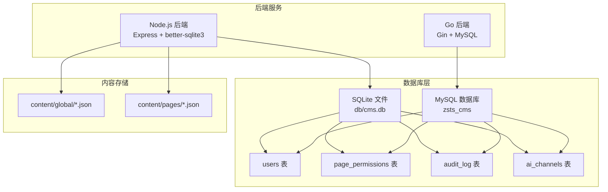
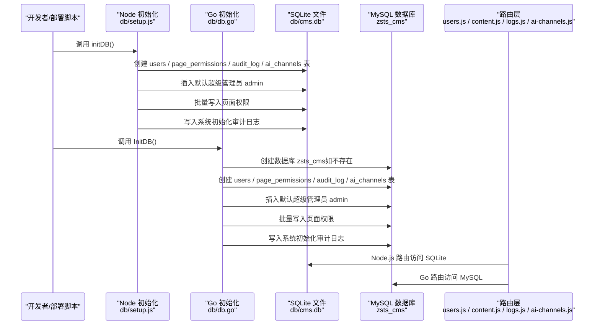
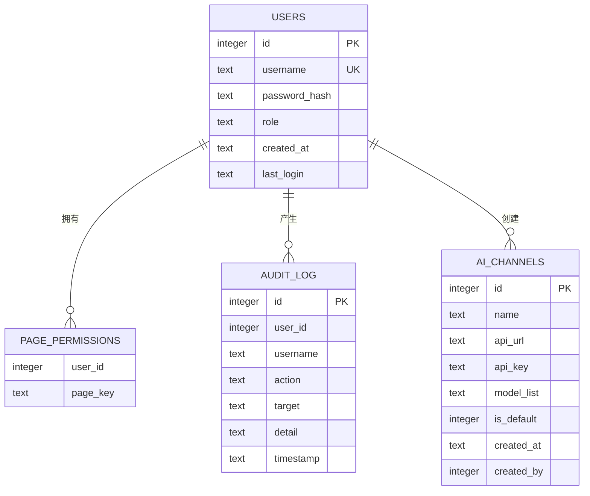
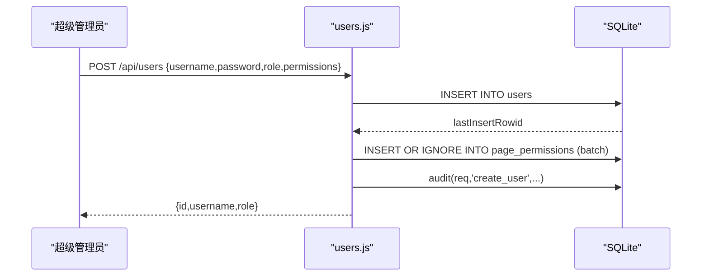
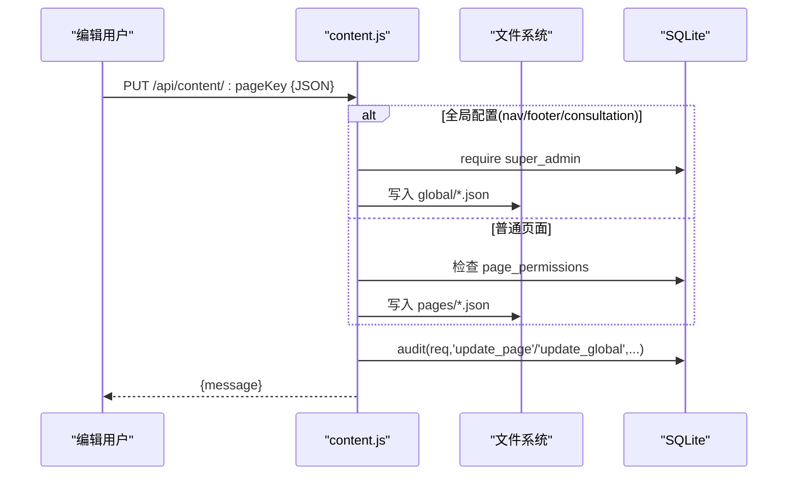
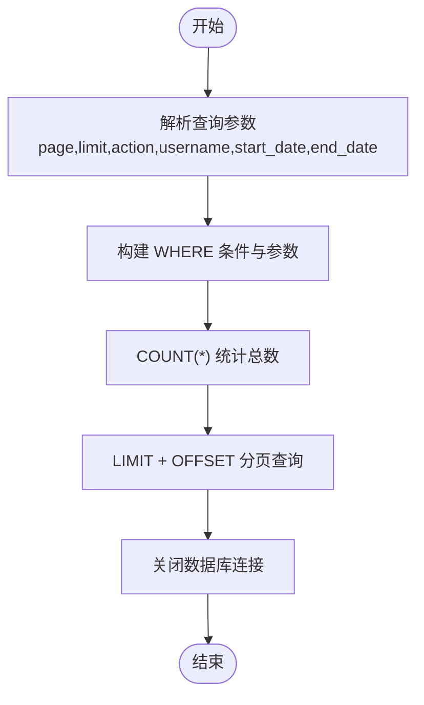
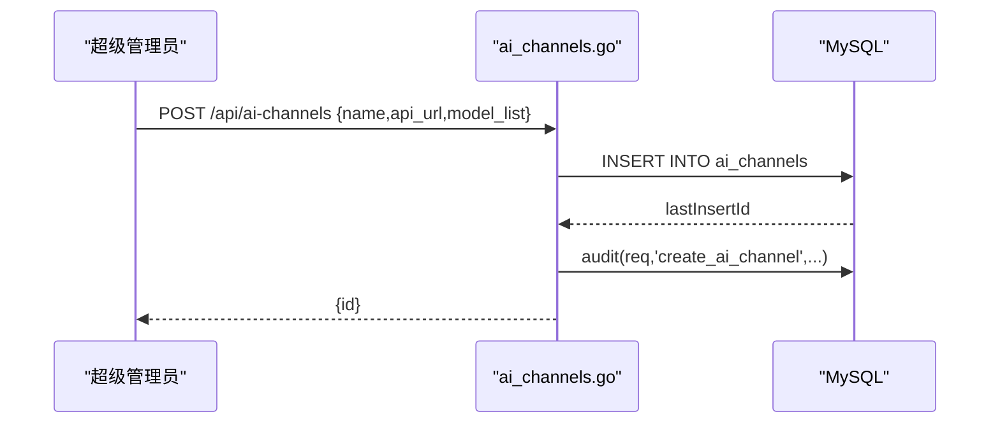
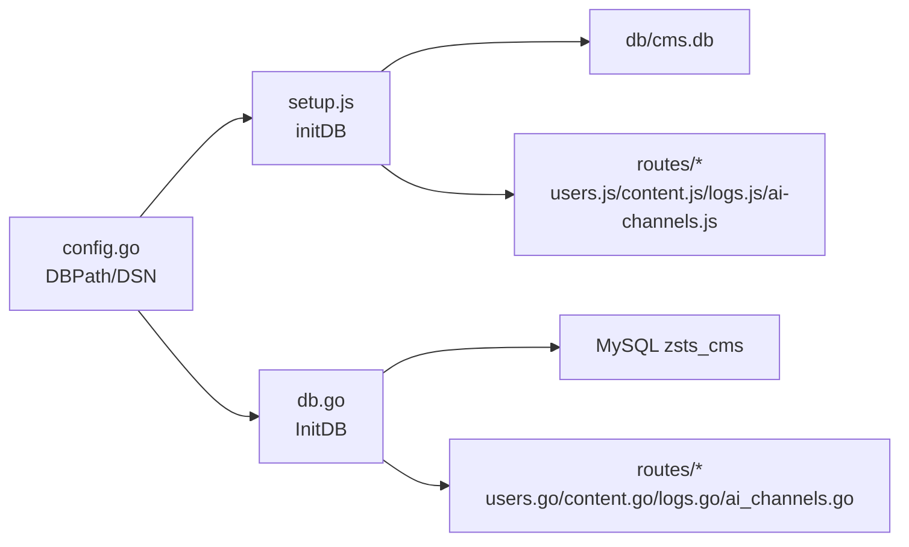

# 数据库设计

<cite>
**本文引用的文件**
- [setup.js](file://cms-server/db/setup.js)
- [db.go](file://cms-server-go/db/db.go)
- [models.go](file://cms-server-go/models/models.go)
- [users.js](file://cms-server/routes/users.js)
- [logs.js](file://cms-server/routes/logs.js)
- [content.js](file://cms-server/routes/content.js)
- [ai-channels.js](file://cms-server/routes/ai-channels.js)
- [config.go](file://cms-server-go/config/config.go)
- [users.go](file://cms-server-go/routes/users.go)
- [logs.go](file://cms-server-go/routes/logs.go)
- [content.go](file://cms-server-go/routes/content.go)
- [ai_channels.go](file://cms-server-go/routes/ai_channels.go)
- [app.js](file://cms-server/app.js)
- [main.go](file://cms-server-go/main.go)
</cite>

## 更新摘要
**变更内容**
- 新增完整的双数据库架构设计（SQLite vs MySQL）
- 更新AI渠道表结构和相关路由实现
- 完善用户权限管理和审计日志系统
- 增强数据库初始化和连接管理机制
- 补充Go语言版本的数据库模型定义

## 目录
1. [简介](#简介)
2. [项目结构](#项目结构)
3. [核心组件](#核心组件)
4. [架构总览](#架构总览)
5. [详细组件分析](#详细组件分析)
6. [依赖关系分析](#依赖关系分析)
7. [性能考虑](#性能考虑)
8. [故障排查指南](#故障排查指南)
9. [结论](#结论)
10. [附录](#附录)

## 简介
本文件围绕 CMS 的数据库设计进行系统性技术说明，重点覆盖：
- 双数据库架构设计（SQLite 文件型数据库 vs MySQL 关系型数据库）
- SQLite 数据库初始化流程（连接配置、表结构定义、约束设置）
- 核心数据表设计（用户表、页面权限表、审计日志表、AI 渠道表）
- 数据模型关系（用户与权限关联、页面内容的数据结构、审计日志存储格式）
- 数据库迁移策略、数据备份方案与性能优化建议
- 实际 SQL 脚本示例与最佳实践指导

## 项目结构
本项目采用"前后端分离 + 配置式内容"的双数据库架构，数据库层位于后端服务中，支持两种数据库实现：
- **Node.js 后端（Express + better-sqlite3）**：负责 API、权限与审计日志，使用 SQLite 文件型数据库
- **Go 后端（Gin/MySQL）**：负责数据库初始化与连接管理，使用 MySQL 关系型数据库
- 内容以 JSON 文件形式存储在文件系统中，与数据库协同工作

**图表来源**
- [setup.js:14-108](file://cms-server/db/setup.js#L14-L108)
- [db.go:15-105](file://cms-server-go/db/db.go#L15-L105)
- [content.js:21-26](file://cms-server/routes/content.js#L21-L26)

**章节来源**
- [app.js:11-14](file://cms-server/app.js#L11-L14)
- [main.go:25-26](file://cms-server-go/main.go#L25-L26)

## 核心组件
- **数据库初始化脚本**：负责创建核心表、设置外键约束、插入默认超级管理员及初始权限，并写入系统初始化审计日志
- **数据模型（Go）**：定义用户、审计日志、AI 渠道等结构体，便于 API 层与数据库交互
- **路由层（Node.js/Go）**：提供用户管理、内容读写、日志查询、AI 渠道管理等接口，内部通过相应驱动访问数据库
- **配置管理**：集中管理数据库路径、JWT 密钥、上传目录等运行时参数

**章节来源**
- [setup.js:14-108](file://cms-server/db/setup.js#L14-L108)
- [db.go:15-155](file://cms-server-go/db/db.go#L15-L155)
- [models.go:3-129](file://cms-server-go/models/models.go#L3-L129)
- [users.js:26-151](file://cms-server/routes/users.js#L26-L151)
- [logs.js:20-59](file://cms-server/routes/logs.js#L20-L59)
- [content.js:48-104](file://cms-server/routes/content.js#L48-L104)
- [ai-channels.js:25-113](file://cms-server/routes/ai-channels.js#L25-L113)
- [config.go:26-62](file://cms-server-go/config/config.go#L26-L62)

## 架构总览
数据库初始化与使用的关键流程如下：

**图表来源**
- [setup.js:14-108](file://cms-server/db/setup.js#L14-L108)
- [db.go:15-155](file://cms-server-go/db/db.go#L15-L155)
- [users.js:44-87](file://cms-server/routes/users.js#L44-L87)
- [content.js:67-101](file://cms-server/routes/content.js#L67-L101)
- [logs.js:20-59](file://cms-server/routes/logs.js#L20-L59)
- [ai-channels.js:38-113](file://cms-server/routes/ai-channels.js#L38-L113)

## 详细组件分析

### 数据库初始化与连接配置

#### Node.js SQLite 初始化
- **连接配置**：使用 better-sqlite3 连接 db/cms.db 文件
- **表结构创建**：创建 users、page_permissions、audit_log、ai_channels 表
- **约束设置**：设置外键约束（page_permissions、audit_log、ai_channels 的外键）
- **默认数据**：若不存在默认超级管理员，则创建 admin 账户并授予所有页面权限，同时写入系统初始化审计日志

#### Go MySQL 初始化
- **连接配置**：通过配置加载 DSN，连接 MySQL 服务器
- **数据库创建**：先创建数据库（如不存在），设置字符集为 utf8mb4
- **表结构创建**：创建相同表结构，使用 InnoDB 引擎
- **默认数据**：插入默认超级管理员，批量写入页面权限，记录审计日志

#### 连接管理
- **Node.js**：每次数据库操作时重新打开连接，适合轻量级服务
- **Go**：使用连接池管理（最大连接数25，空闲连接10），适合高并发场景

**章节来源**
- [setup.js:14-108](file://cms-server/db/setup.js#L14-L108)
- [db.go:15-155](file://cms-server-go/db/db.go#L15-L155)
- [config.go:42-56](file://cms-server-go/config/config.go#L42-L56)

### 核心数据表设计

#### 用户表 users
- **SQLite 版本**：
  - 字段：id（INTEGER PRIMARY KEY AUTOINCREMENT）、username（TEXT UNIQUE NOT NULL）、password_hash（TEXT NOT NULL）、role（TEXT NOT NULL DEFAULT 'editor' CHECK(role IN ('super_admin','editor'))）、created_at（TEXT NOT NULL DEFAULT (datetime('now','localtime'))）、last_login（TEXT）
  - 约束：UNIQUE(username)，CHECK(role IN ('super_admin','editor')），建议在 username 上建立唯一索引
- **MySQL 版本**：
  - 字段：id（BIGINT UNSIGNED AUTO_INCREMENT PRIMARY KEY）、username（VARCHAR(100) UNIQUE NOT NULL）、password_hash（VARCHAR(255) NOT NULL）、role（ENUM('super_admin','editor') NOT NULL DEFAULT 'editor'）、created_at（DATETIME NOT NULL DEFAULT CURRENT_TIMESTAMP）、last_login（DATETIME DEFAULT NULL）
  - 约束：UNIQUE(username)，ENGINE=InnoDB DEFAULT CHARSET=utf8mb4 COLLATE=utf8mb4_unicode_ci

#### 页面权限表 page_permissions
- **SQLite 版本**：user_id（INTEGER NOT NULL）、page_key（TEXT NOT NULL）、主键(user_id, page_key)、外键(user_id) REFERENCES users(id) ON DELETE CASCADE
- **MySQL 版本**：user_id（BIGINT UNSIGNED NOT NULL）、page_key（VARCHAR(100) NOT NULL）、主键(user_id, page_key)、外键(user_id) REFERENCES users(id) ON DELETE CASCADE

#### 审计日志表 audit_log
- **SQLite 版本**：id（INTEGER PRIMARY KEY AUTOINCREMENT）、user_id（INTEGER）、username（TEXT NOT NULL DEFAULT 'system'）、action（TEXT NOT NULL）、target（TEXT）、detail（TEXT）、timestamp（TEXT NOT NULL DEFAULT (datetime('now','localtime'))）、外键(user_id) REFERENCES users(id) ON DELETE SET NULL
- **MySQL 版本**：id（BIGINT UNSIGNED AUTO_INCREMENT PRIMARY KEY）、user_id（BIGINT UNSIGNED DEFAULT NULL）、username（VARCHAR(100) NOT NULL DEFAULT 'system'）、action（VARCHAR(100) NOT NULL）、target（VARCHAR(255) DEFAULT ''）、detail（TEXT）、timestamp（DATETIME NOT NULL DEFAULT CURRENT_TIMESTAMP）、外键(user_id) REFERENCES users(id) ON DELETE SET NULL

#### AI 渠道表 ai_channels
- **SQLite 版本**：id（INTEGER PRIMARY KEY AUTOINCREMENT）、name（TEXT NOT NULL）、api_url（TEXT NOT NULL）、api_key（TEXT）、model_list（TEXT，JSON 数组字符串）、is_default（INTEGER NOT NULL DEFAULT 0）、created_at（TEXT NOT NULL DEFAULT (datetime('now','localtime')))、created_by（INTEGER）、外键(created_by) REFERENCES users(id) ON DELETE SET NULL
- **MySQL 版本**：id（BIGINT UNSIGNED AUTO_INCREMENT PRIMARY KEY）、name（VARCHAR(255) NOT NULL）、api_url（VARCHAR(500) NOT NULL）、api_key（TEXT）、model_list（JSON）、is_default（TINYINT NOT NULL DEFAULT 0）、created_at（DATETIME NOT NULL DEFAULT CURRENT_TIMESTAMP）、created_by（BIGINT UNSIGNED DEFAULT NULL）、外键(created_by) REFERENCES users(id) ON DELETE SET NULL

**章节来源**
- [setup.js:18-68](file://cms-server/db/setup.js#L18-L68)
- [db.go:63-105](file://cms-server-go/db/db.go#L63-L105)
- [models.go:3-43](file://cms-server-go/models/models.go#L3-L43)

### 数据模型关系
- **用户与权限**：users.id 与 page_permissions.user_id 建立一对多关系；超级管理员不受 page_permissions 限制
- **页面内容**：content 目录下的 JSON 文件与 page_key 对应，权限校验通过 page_permissions.user_id + page_key
- **审计日志**：audit_log.user_id 与 users.id 建立一对一关系；当用户被删除时，外键行为为 SET NULL，保留日志可追溯
- **AI 渠道**：ai_channels.created_by 与 users.id 建立一对多关系；支持 JSON 格式的模型列表存储

**图表来源**
- [setup.js:18-68](file://cms-server/db/setup.js#L18-L68)
- [db.go:63-105](file://cms-server-go/db/db.go#L63-L105)
- [models.go:3-43](file://cms-server-go/models/models.go#L3-L43)

**章节来源**
- [users.js:26-42](file://cms-server/routes/users.js#L26-L42)
- [content.js:37-46](file://cms-server/routes/content.js#L37-L46)
- [logs.js:20-47](file://cms-server/routes/logs.js#L20-L47)
- [ai-channels.js:25-36](file://cms-server/routes/ai-channels.js#L25-L36)

### 数据处理流程与最佳实践

#### 用户管理流程（Node.js）

**图表来源**
- [users.js:44-87](file://cms-server/routes/users.js#L44-L87)

**章节来源**
- [users.js:44-87](file://cms-server/routes/users.js#L44-L87)

#### 页面内容写入流程（Node.js）

**图表来源**
- [content.js:67-101](file://cms-server/routes/content.js#L67-L101)

**章节来源**
- [content.js:67-101](file://cms-server/routes/content.js#L67-L101)

#### 日志查询流程（Node.js）

**图表来源**
- [logs.js:20-47](file://cms-server/routes/logs.js#L20-L47)

**章节来源**
- [logs.js:20-47](file://cms-server/routes/logs.js#L20-L47)

#### AI 渠道管理流程（Go）

**图表来源**
- [ai_channels.go:69-103](file://cms-server-go/routes/ai_channels.go#L69-L103)

**章节来源**
- [ai_channels.go:69-103](file://cms-server-go/routes/ai_channels.go#L69-L103)

## 依赖关系分析
- **Node.js 路由依赖**：SQLite 表结构与外键约束，确保权限与审计日志一致性
- **Go 初始化与 Node.js 初始化**：共同保证表结构一致，避免双栈差异导致的运行时错误
- **配置模块**：集中管理 DBPath 和 DSN，确保 Go 初始化与 Node 路由访问同一数据库文件
- **双数据库架构**：Node.js 使用 better-sqlite3，Go 使用 MySQL 驱动，提供不同适用场景的选择

**图表来源**
- [config.go:42-56](file://cms-server-go/config/config.go#L42-L56)
- [setup.js:14-108](file://cms-server/db/setup.js#L14-L108)
- [db.go:15-155](file://cms-server-go/db/db.go#L15-L155)
- [users.js:26-151](file://cms-server/routes/users.js#L26-L151)
- [content.js:48-104](file://cms-server/routes/content.js#L48-L104)
- [logs.js:20-59](file://cms-server/routes/logs.js#L20-L59)
- [ai-channels.js:25-113](file://cms-server/routes/ai-channels.js#L25-L113)

**章节来源**
- [config.go:26-62](file://cms-server-go/config/config.go#L26-L62)
- [setup.js:14-108](file://cms-server/db/setup.js#L14-L108)
- [db.go:15-155](file://cms-server-go/db/db.go#L15-L155)
- [users.js:26-151](file://cms-server/routes/users.js#L26-L151)
- [content.js:48-104](file://cms-server/routes/content.js#L48-L104)
- [logs.js:20-59](file://cms-server/routes/logs.js#L20-L59)
- [ai-channels.js:25-113](file://cms-server/routes/ai-channels.js#L25-L113)

## 性能考虑
- **SQLite 适用场景**：适用于中小规模、低并发场景。文件型数据库简单可靠，适合开发和测试环境
- **MySQL 适用场景**：适用于生产环境和高并发场景。支持连接池、事务处理和复杂查询
- **外键约束**：Go 初始化明确启用外键约束，有助于数据一致性，但会带来一定开销
- **连接池优化**：Go 版本使用连接池（最大25，空闲10），可根据实际负载调整
- **审计日志增长**：审计日志表可能随时间增长，建议定期归档与清理策略
- **页面内容存储**：JSON 文件存储读写频繁时建议使用 SSD 与合适的文件系统参数

## 故障排查指南
- **初始化失败**
  - 检查 DBPath 是否可写，目录是否存在；Go 初始化会在打开数据库前创建目录
  - 确认 SQLite 驱动可用（Node.js 使用 better-sqlite3，Go 使用 MySQL 驱动）
- **外键约束问题**
  - Go 初始化明确启用外键约束；若出现约束错误，检查外键引用是否有效
- **权限不足**
  - 页面内容写入需满足角色或 page_permissions；全局配置仅 super_admin 可写
- **审计日志异常**
  - 确认 audit_log 表结构完整；若用户被删除，user_id 会被 SET NULL，不影响日志完整性
- **数据库切换问题**
  - 确保 Node.js 和 Go 版本使用相同的表结构和约束定义
  - 检查环境变量配置（DB_PATH vs DSN）

**章节来源**
- [setup.js:72-104](file://cms-server/db/setup.js#L72-L104)
- [db.go:107-155](file://cms-server-go/db/db.go#L107-L155)
- [users.js:74-91](file://cms-server/routes/users.js#L74-L91)
- [content.js:73-91](file://cms-server/routes/content.js#L73-L91)
- [logs.js:50-59](file://cms-server/routes/logs.js#L50-L59)

## 结论
本数据库设计方案采用双数据库架构，结合 Node.js 与 Go 双栈实现，提供了清晰的用户权限控制、审计日志与内容管理能力。通过统一的初始化脚本与严格的外键约束，确保了数据一致性与可维护性。SQLite 适合开发测试环境，MySQL 适合生产环境。建议在生产环境中加强安全配置（如更换默认密码与 JWT 密钥）、制定数据库迁移与备份策略，并根据业务规模评估数据库升级路径。

## 附录

### 数据库迁移策略
- **SQLite 到 MySQL 迁移**
  - 使用 MySQL 的导入功能或编写迁移脚本，转换表结构与数据类型
  - 保持字段类型与约束一致（如 UNIQUE、CHECK、外键），确保业务逻辑不变
  - 分批迁移数据，先迁移历史审计日志，再迁移用户与权限，最后迁移内容 JSON 文件
- **双数据库架构维护**
  - 保持 Node.js 和 Go 版本的表结构同步
  - 统一数据模型定义，确保两个版本的 API 接口兼容
  - 建立版本控制，跟踪数据库结构变更

### 数据备份方案
- **SQLite 文件备份**
  - 停机备份：停止服务后复制 db/cms.db
  - 在线备份：使用 SQLite 的在线备份 API
- **MySQL 数据备份**
  - 使用 mysqldump 或 Percona XtraBackup 进行全量和增量备份
  - 定期导出 audit_log 到 CSV/Parquet，压缩后归档至对象存储
- **内容备份**
  - 备份 content/global 与 content/pages 下的 JSON 文件
  - 结合版本控制或增量备份策略

### 性能优化建议
- **索引优化**
  - 在 username 上确保唯一索引（SQLite 默认唯一约束即带索引）
  - 为 audit_log.timestamp 建立索引，提升按时间范围查询效率
- **连接与事务**
  - Go 初始化每次 GetDB 重新打开连接并启用外键约束；在高并发场景建议引入连接池
  - 批量写入权限时使用事务，减少锁竞争与磁盘写入次数
- **存储与 I/O**
  - 将 db/cms.db 放置于高性能磁盘（SSD）
  - 控制日志表增长，定期清理或归档

### 实际 SQL 脚本示例与最佳实践
- **建表与约束**
  - users 表：唯一用户名、角色 CHECK、默认时间戳
  - page_permissions 表：联合主键、外键级联删除
  - audit_log 表：外键 SET NULL，username 默认值
  - ai_channels 表：JSON 字段存储模型列表，created_by 外键
- **初始化数据**
  - 插入默认超级管理员 admin，授予所有页面权限
  - 写入系统初始化审计日志，便于追踪
- **最佳实践**
  - 使用事务批量写入权限，避免部分失败
  - 严格区分全局配置与页面内容的权限边界
  - 审计日志记录关键操作（登录、用户变更、内容更新、AI 渠道变更）
  - 统一 Node.js 和 Go 版本的数据库操作接口

**章节来源**
- [setup.js:18-108](file://cms-server/db/setup.js#L18-L108)
- [db.go:63-155](file://cms-server-go/db/db.go#L63-L155)
- [models.go:3-129](file://cms-server-go/models/models.go#L3-L129)