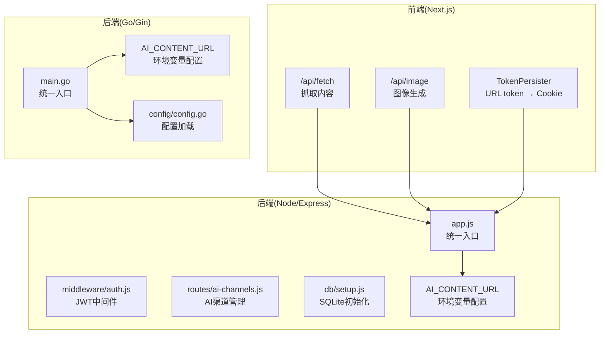
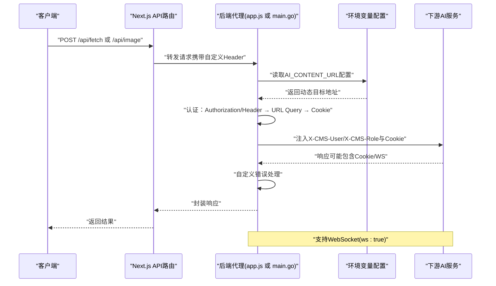
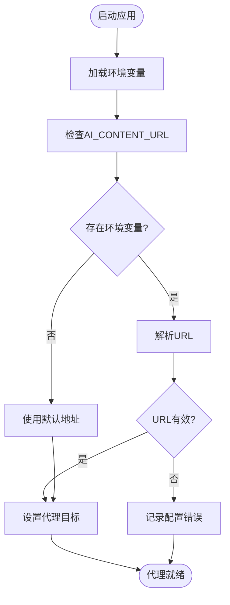
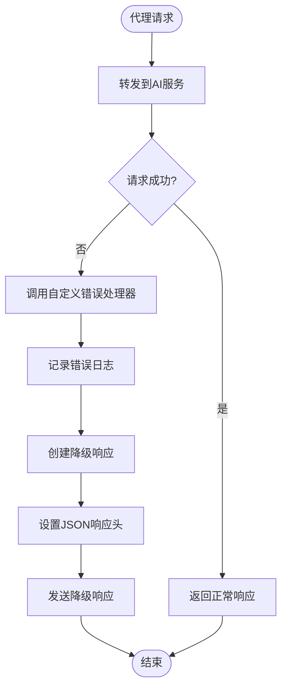
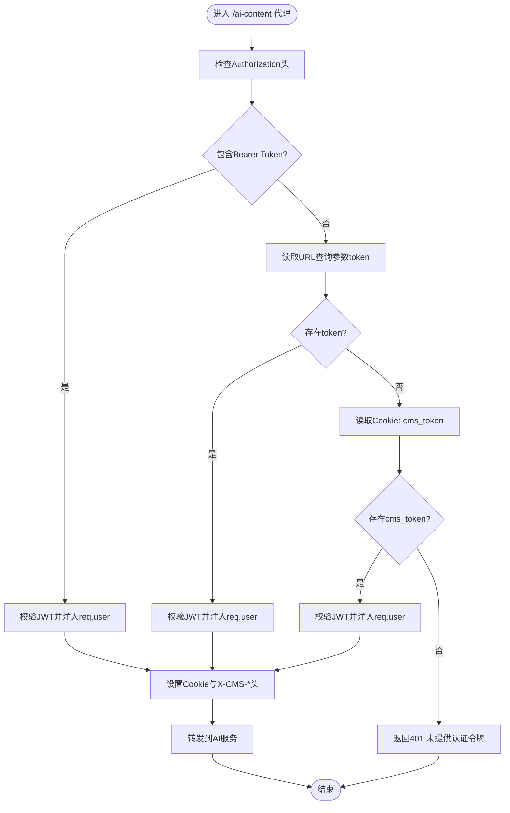
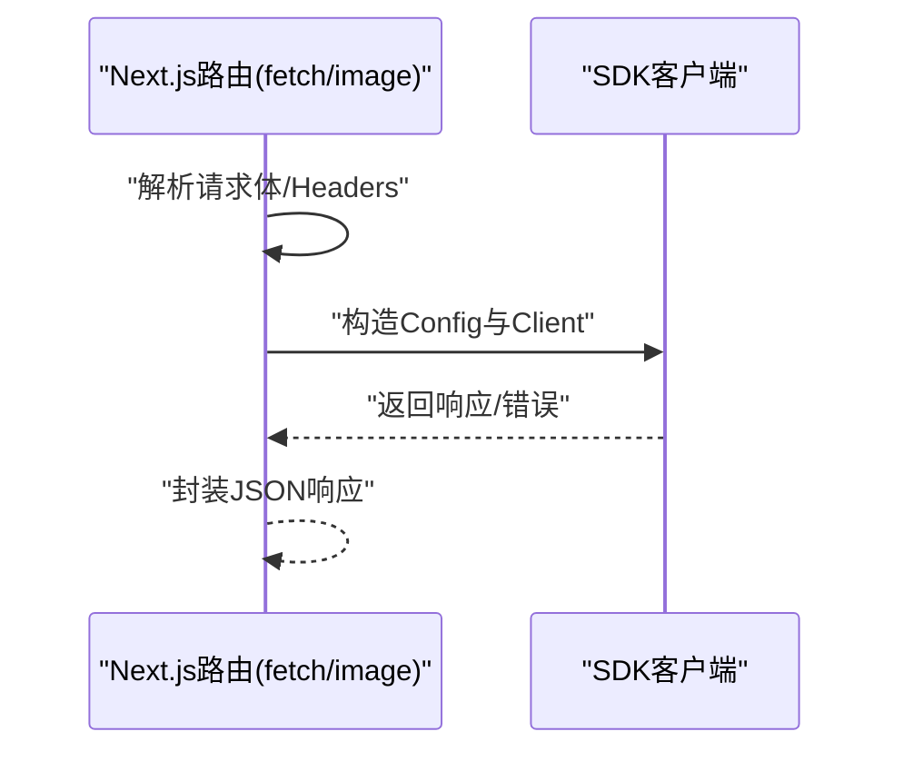
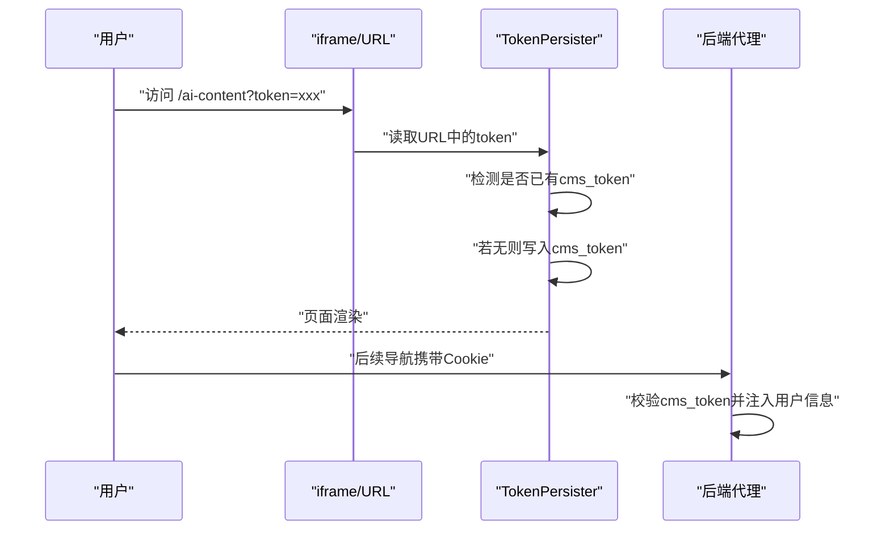
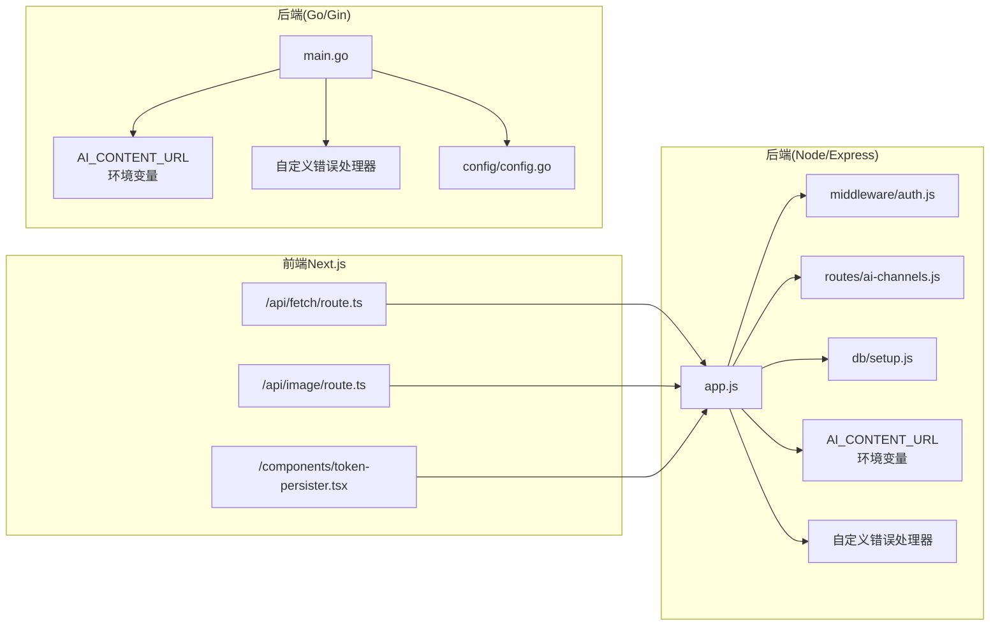

# AI代理服务

<cite>
**本文档引用的文件**
- [cms-server-go/config/config.go](file://cms-server-go/config/config.go)
- [cms-server-go/main.go](file://cms-server-go/main.go)
- [cms-server/app.js](file://cms-server/app.js)
- [ai-content-project/src/app/api/fetch/route.ts](file://ai-content-project/src/app/api/fetch/route.ts)
- [ai-content-project/src/app/api/image/route.ts](file://ai-content-project/src/app/api/image/route.ts)
- [business-core/cms-server/middleware/auth.js](file://business-core/cms-server/middleware/auth.js)
- [business-core/cms-server/routes/ai-channels.js](file://business-core/cms-server/routes/ai-channels.js)
- [business-core/cms-server/db/setup.js](file://business-core/cms-server/db/setup.js)
- [ai-content-project/src/components/token-persister.tsx](file://ai-content-project/src/components/token-persister.tsx)
- [ai-content-project/package.json](file://ai-content-project/package.json)
- [business-core/cms-server/package.json](file://business-core/cms-server/package.json)
</cite>

## 更新摘要
**所做更改**
- 新增了基于环境变量的动态代理配置机制
- 增强了代理错误处理和优雅降级功能
- 完善了Go/Gin版本的AI内容服务URL配置支持
- 更新了代理配置示例和故障排查指南

## 目录
1. [简介](#简介)
2. [项目结构](#项目结构)
3. [核心组件](#核心组件)
4. [架构总览](#架构总览)
5. [详细组件分析](#详细组件分析)
6. [依赖关系分析](#依赖关系分析)
7. [性能考虑](#性能考虑)
8. [故障排查指南](#故障排查指南)
9. [结论](#结论)
10. [附录](#附录)

## 简介
本文件为"AI代理服务"的技术文档，聚焦于AI内容生成代理的工作原理与集成实践，涵盖以下重点：
- 三种认证方式：Authorization Header、URL Query Token、Cookie Fallback 的实现机制与优先级
- 代理请求处理流程：用户信息透传、Cookie头部设置、自定义请求头添加
- **新增**：基于环境变量的动态代理配置和优雅降级机制
- WebSocket支持与实时通信机制
- 代理配置示例与常见问题解决方案
- 面向开发者的集成与扩展建议

## 项目结构
该仓库包含两个后端实现（Node/Express 与 Go/Gin）以及一个 Next.js 前端应用，共同构成AI内容生成与代理体系。

**图表来源**
- [cms-server-go/config/config.go:38](file://cms-server-go/config/config.go#L38)
- [cms-server-go/main.go:137-141](file://cms-server-go/main.go#L137-L141)
- [cms-server/app.js:199](file://cms-server/app.js#L199)

**章节来源**
- [ai-content-project/package.json:15-76](file://ai-content-project/package.json#L15-L76)
- [business-core/cms-server/package.json:10-21](file://business-core/cms-server/package.json#L10-L21)

## 核心组件
- 前端Next.js API路由
  - 抓取内容路由：接收URL，转发至SDK客户端，返回标题、内容、状态等
  - 图像生成路由：接收提示词，调用SDK生成图像，返回首张图片URL或错误
- 后端代理（Node/Express）
  - AI代理中间件：按优先级校验Authorization Header、URL Query Token、Cookie Fallback
  - 代理请求头注入：将用户信息与Cookie透传给下游AI服务
  - **增强**：支持通过AI_CONTENT_URL环境变量动态配置目标服务
  - **新增**：自定义错误处理器，提供友好的降级响应
  - WebSocket支持：开启ws: true以支持实时通信
- 后端代理（Go/Gin）
  - 与Node版本相同的认证与透传逻辑，使用httputil反向代理
  - **增强**：完整的环境变量配置支持和错误处理机制
- 认证中间件
  - JWT校验、角色权限、页面权限检查
- AI渠道管理
  - 渠道增删改查、设默认渠道
- 数据库初始化
  - users、page_permissions、audit_log、ai_channels表初始化

**章节来源**
- [ai-content-project/src/app/api/fetch/route.ts:4-24](file://ai-content-project/src/app/api/fetch/route.ts#L4-L24)
- [ai-content-project/src/app/api/image/route.ts:4-35](file://ai-content-project/src/app/api/image/route.ts#L4-L35)
- [cms-server/app.js:168-196](file://cms-server/app.js#L168-L196)
- [cms-server/app.js:198-213](file://cms-server/app.js#L198-L213)
- [cms-server-go/main.go:136-151](file://cms-server-go/main.go#L136-L151)
- [cms-server-go/main.go:233-285](file://cms-server-go/main.go#L233-L285)
- [business-core/cms-server/middleware/auth.js:20-44](file://business-core/cms-server/middleware/auth.js#L20-L44)
- [business-core/cms-server/routes/ai-channels.js:25-110](file://business-core/cms-server/routes/ai-channels.js#L25-L110)
- [business-core/cms-server/db/setup.js:14-108](file://business-core/cms-server/db/setup.js#L14-L108)

## 架构总览
AI代理服务采用"前端Next.js → 后端代理（Node/Express 或 Go/Gin）→ 下游AI服务"的三层架构。认证与请求透传在代理层完成，前端通过标准API路由与代理交互。**新增**的环境变量配置机制使得AI服务地址可以动态调整，增强了系统的灵活性和可维护性。

**图表来源**
- [cms-server-go/config/config.go:38](file://cms-server-go/config/config.go#L38)
- [cms-server-go/main.go:136-151](file://cms-server-go/main.go#L136-L151)
- [cms-server/app.js:168-213](file://cms-server/app.js#L168-L213)
- [ai-content-project/src/app/api/fetch/route.ts:7-12](file://ai-content-project/src/app/api/fetch/route.ts#L7-L12)
- [ai-content-project/src/app/api/image/route.ts:12-14](file://ai-content-project/src/app/api/image/route.ts#L12-L14)

## 详细组件分析

### 动态代理配置与环境变量支持
**新增功能**：系统现在支持通过环境变量AI_CONTENT_URL动态配置AI内容服务的URL，提供了更好的灵活性和部署适应性。

- **配置加载机制**
  - Go/Gin版本：在config.Load()函数中通过getEnv("AI_CONTENT_URL", "http://localhost:5000")加载配置
  - Node/Express版本：通过process.env.AI_CONTENT_URL获取环境变量
- **默认值处理**：当环境变量未设置时，使用默认的本地开发地址
- **运行时验证**：启动时对URL进行解析验证，错误时记录警告日志

**图表来源**
- [cms-server-go/config/config.go:26-40](file://cms-server-go/config/config.go#L26-L40)
- [cms-server-go/main.go:136-141](file://cms-server-go/main.go#L136-L141)

**章节来源**
- [cms-server-go/config/config.go:26-40](file://cms-server-go/config/config.go#L26-L40)
- [cms-server-go/main.go:136-141](file://cms-server-go/main.go#L136-L141)
- [cms-server/app.js:199](file://cms-server/app.js#L199)

### 增强的错误处理与优雅降级
**新增功能**：代理层现在具备完善的错误处理机制，在目标服务不可达时提供友好的降级响应。

- **自定义错误处理器**
  - Go/Gin版本：在setupAIProxy函数中设置proxy.ErrorHandler
  - Node版本：使用http-proxy-middleware的on配置项
- **降级响应格式**：返回JSON格式的错误信息，包含目标服务地址
- **日志记录**：详细的错误日志便于问题诊断
- **HTTP状态码**：使用400 Bad Gateway状态码表示上游服务问题

**图表来源**
- [cms-server-go/main.go:145-151](file://cms-server-go/main.go#L145-L151)
- [cms-server/app.js:198-213](file://cms-server/app.js#L198-L213)

**章节来源**
- [cms-server-go/main.go:145-151](file://cms-server-go/main.go#L145-L151)
- [cms-server/app.js:198-213](file://cms-server/app.js#L198-L213)

### 认证与透传机制（三路认证）
- 优先级与流程
  1) Authorization Header（Bearer Token）
  2) URL Query Token（iframe场景）
  3) Cookie Fallback（Next.js客户端导航场景）
- 透传字段
  - 请求头：X-CMS-User、X-CMS-Role
  - Cookie：cms_user=username
- WebSocket支持
  - Node版本：proxy配置启用ws: true
  - Go版本：通过httputil反向代理，天然支持升级

**图表来源**
- [cms-server/app.js:168-196](file://cms-server/app.js#L168-L196)
- [cms-server-go/main.go:160-187](file://cms-server-go/main.go#L160-L187)

**章节来源**
- [cms-server/app.js:168-196](file://cms-server/app.js#L168-L196)
- [cms-server/app.js:203-212](file://cms-server/app.js#L203-L212)
- [cms-server-go/main.go:160-187](file://cms-server-go/main.go#L160-L187)

### 前端Next.js API路由（Fetch/Image）
- 抓取内容
  - 从请求体读取URL
  - 通过HeaderUtils提取自定义Header
  - 使用SDK客户端发起请求并返回标题、内容、状态码
- 图像生成
  - 校验提示词
  - 调用SDK生成图像，返回首张图片URL或错误信息

**图表来源**
- [ai-content-project/src/app/api/fetch/route.ts:4-24](file://ai-content-project/src/app/api/fetch/route.ts#L4-L24)
- [ai-content-project/src/app/api/image/route.ts:4-35](file://ai-content-project/src/app/api/image/route.ts#L4-L35)

**章节来源**
- [ai-content-project/src/app/api/fetch/route.ts:4-24](file://ai-content-project/src/app/api/fetch/route.ts#L4-L24)
- [ai-content-project/src/app/api/image/route.ts:4-35](file://ai-content-project/src/app/api/image/route.ts#L4-L35)

### Cookie处理与URL Token回退（iframe导航）
- TokenPersister组件
  - 首次进入带token的URL时，写入非HttpOnly的cms_token Cookie
  - 避免重复写入相同token
  - 使后续客户端导航仍能携带Cookie，从而走Cookie Fallback认证
- 代理侧
  - 读取cms_token并进行JWT校验
  - 将cms_user写入Cookie并注入X-CMS-*头

**图表来源**
- [ai-content-project/src/components/token-persister.tsx:15-34](file://ai-content-project/src/components/token-persister.tsx#L15-L34)
- [cms-server/app.js:187-194](file://cms-server/app.js#L187-L194)
- [cms-server-go/main.go:177-183](file://cms-server-go/main.go#L177-L183)

**章节来源**
- [ai-content-project/src/components/token-persister.tsx:15-34](file://ai-content-project/src/components/token-persister.tsx#L15-L34)
- [cms-server/app.js:187-194](file://cms-server/app.js#L187-L194)
- [cms-server-go/main.go:177-183](file://cms-server-go/main.go#L177-L183)

### WebSocket支持与实时通信
- Node版本
  - 在代理配置中启用ws: true，支持WebSocket升级
- Go版本
  - 使用httputil反向代理，天然支持协议升级
- 实时通信建议
  - 在代理层保留Cookie与自定义头，确保下游AI服务可识别用户身份
  - 前端建立WS连接时确保携带Cookie（浏览器自动）

**章节来源**
- [cms-server/app.js:198-201](file://cms-server/app.js#L198-L201)
- [cms-server-go/main.go:217-224](file://cms-server-go/main.go#L217-L224)

### AI渠道管理（后端）
- 路由
  - GET/POST/PUT/DELETE：渠道列表、新建、更新、删除
  - PUT /:id/set-default：设为默认渠道
- 数据库
  - ai_channels表存储渠道名称、API地址、密钥、模型列表、默认标记等
- 权限
  - 仅超级管理员可管理；其他路由使用requireAuth中间件

**章节来源**
- [business-core/cms-server/routes/ai-channels.js:25-110](file://business-core/cms-server/routes/ai-channels.js#L25-L110)
- [business-core/cms-server/db/setup.js:55-68](file://business-core/cms-server/db/setup.js#L55-L68)
- [business-core/cms-server/middleware/auth.js:37-44](file://business-core/cms-server/middleware/auth.js#L37-L44)

## 依赖关系分析

**图表来源**
- [ai-content-project/src/app/api/fetch/route.ts:1-2](file://ai-content-project/src/app/api/fetch/route.ts#L1-L2)
- [ai-content-project/src/app/api/image/route.ts:1-2](file://ai-content-project/src/app/api/image/route.ts#L1-L2)
- [ai-content-project/src/components/token-persister.tsx:1-1](file://ai-content-project/src/components/token-persister.tsx#L1-L1)
- [cms-server/app.js:199](file://cms-server/app.js#L199)
- [cms-server-go/config/config.go:38](file://cms-server-go/config/config.go#L38)
- [cms-server-go/main.go:145-151](file://cms-server-go/main.go#L145-L151)

**章节来源**
- [ai-content-project/package.json:51](file://ai-content-project/package.json#L51)
- [business-core/cms-server/package.json:17](file://business-core/cms-server/package.json#L17)

## 性能考虑
- 代理层
  - 合理设置请求体大小限制，避免过大负载
  - 对静态资源与预览客户端JS禁用缓存以保证一致性
  - **新增**：环境变量配置的URL解析开销极小，影响可忽略
- 认证
  - JWT校验为O(1)，成本低；注意密钥安全与过期策略
- WebSocket
  - 保持长连接时关注内存占用与并发数，必要时增加限流与心跳
- 前端
  - SDK调用应避免频繁触发，合理合并请求与缓存响应
- **新增**：错误处理机制对性能影响微乎其微，但显著提升了用户体验

## 故障排查指南
- 401 未提供认证令牌
  - 检查Authorization头是否为Bearer Token
  - iframe场景确认URL是否包含token参数
  - 确认浏览器是否正确写入cms_token Cookie
- 令牌已失效
  - 重新登录获取新JWT
  - 检查JWT_SECRET是否一致且未被篡改
- Cookie未生效
  - 确认SameSite/Lax设置与跨域策略
  - 确认代理层是否正确注入Cookie与X-CMS-*头
- WebSocket连接失败
  - 确认代理配置启用ws: true（Node）或使用httputil（Go）
  - 检查浏览器是否携带Cookie，服务端是否接受升级
- **新增**：AI服务不可达
  - 检查AI_CONTENT_URL环境变量配置是否正确
  - 确认目标AI服务是否正在运行
  - 查看降级响应中的具体错误信息
- **新增**：环境变量配置错误
  - 检查AI_CONTENT_URL格式是否为有效的URL
  - 确认网络连通性和端口开放情况
  - 查看应用启动日志中的配置警告信息

**章节来源**
- [cms-server/app.js:168-196](file://cms-server/app.js#L168-L196)
- [cms-server-go/main.go:136-141](file://cms-server-go/main.go#L136-L141)
- [ai-content-project/src/components/token-persister.tsx:15-34](file://ai-content-project/src/components/token-persister.tsx#L15-L34)

## 结论
本AI代理服务通过"三路认证 + 请求透传 + WebSocket支持 + 动态配置 + 优雅降级"实现了安全、灵活、可扩展的AI内容生成集成方案。**新增的功能**包括基于环境变量的动态代理配置和完善的错误处理机制，显著提升了系统的可用性和维护性。前端Next.js路由负责调用与封装，后端代理负责认证与转发，Go/Node两种实现满足不同部署需求。通过合理的配置与最佳实践，可稳定支撑文章与图像生成、实时通信等场景。

## 附录

### 代理配置示例
- Node/Express
  - 代理目标：通过AI_CONTENT_URL环境变量配置，默认http://localhost:3000
  - 启用ws: true
  - 认证顺序：Authorization → URL token → Cookie
  - **新增**：自定义错误处理器，提供友好的降级响应
- Go/Gin
  - 代理目标：通过AI_CONTENT_URL环境变量配置，默认http://localhost:5000
  - 认证顺序与透传逻辑同Node版本
  - **新增**：完整的环境变量配置支持和错误处理机制

**章节来源**
- [cms-server/app.js:198-213](file://cms-server/app.js#L198-L213)
- [cms-server-go/main.go:136-151](file://cms-server-go/main.go#L136-L151)
- [cms-server-go/config/config.go:38](file://cms-server-go/config/config.go#L38)

### 环境变量配置
- AI_CONTENT_URL：AI内容服务的完整URL地址
- 默认值：http://localhost:5000（适用于本地开发）
- 生产环境建议：设置为实际的AI服务地址

**章节来源**
- [cms-server-go/config/config.go:38](file://cms-server-go/config/config.go#L38)
- [cms-server/app.js:199](file://cms-server/app.js#L199)