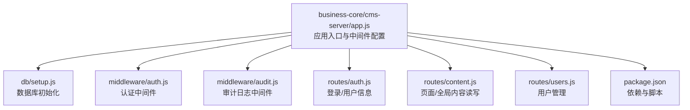
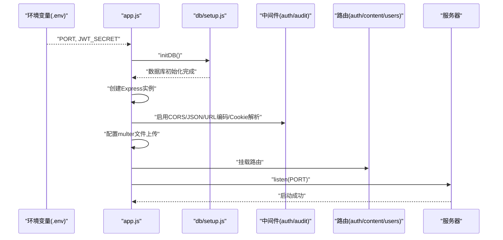
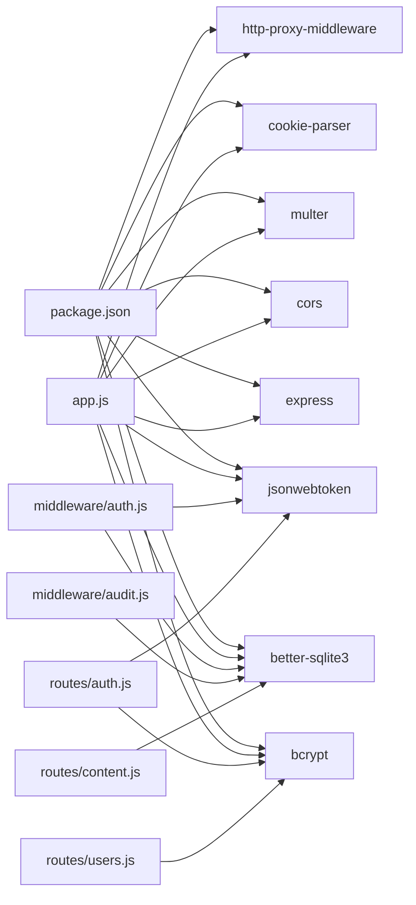
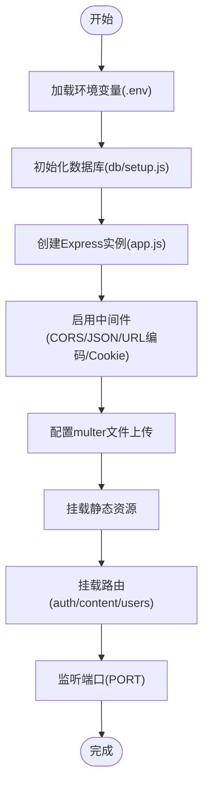

# 应用初始化

<cite>
**本文引用的文件**
- [app.js](file://business-core/cms-server/app.js)
- [setup.js](file://business-core/cms-server/db/setup.js)
- [auth.js](file://business-core/cms-server/middleware/auth.js)
- [audit.js](file://business-core/cms-server/middleware/audit.js)
- [auth.js](file://business-core/cms-server/routes/auth.js)
- [content.js](file://business-core/cms-server/routes/content.js)
- [users.js](file://business-core/cms-server/routes/users.js)
- [package.json](file://business-core/cms-server/package.json)
- [ZSTS-CMS-后端移交说明书.md](file://ZSTS-CMS-后端移交说明书.md)
</cite>

## 目录
1. [简介](#简介)
2. [项目结构](#项目结构)
3. [核心组件](#核心组件)
4. [架构总览](#架构总览)
5. [详细组件分析](#详细组件分析)
6. [依赖关系分析](#依赖关系分析)
7. [性能考量](#性能考量)
8. [故障排查指南](#故障排查指南)
9. [结论](#结论)
10. [附录](#附录)

## 简介
本章节面向需要理解并定制CMS应用初始化流程的开发者，重点覆盖以下方面：
- Express应用实例的创建与启动
- 环境变量配置（端口、JWT密钥等）
- 数据库初始化与SQLite表结构
- 服务器端口设置与静态资源托管
- 中间件配置流程（CORS、JSON/URL编码解析、Cookie解析、文件上传）
- multer文件上传中间件的配置细节（存储策略、大小限制、类型过滤）
- 完整初始化流程与自定义配置方法

## 项目结构
CMS后端采用Express + better-sqlite3 + JWT的轻量架构，核心入口位于business-core/cms-server/app.js，数据库初始化脚本位于db/setup.js，认证与审计中间件分别位于middleware/auth.js与middleware/audit.js，API路由集中在routes目录。

图表来源
- [app.js:1-315](file://business-core/cms-server/app.js#L1-L315)
- [setup.js:1-115](file://business-core/cms-server/db/setup.js#L1-L115)
- [auth.js:1-86](file://business-core/cms-server/middleware/auth.js#L1-L86)
- [audit.js:1-75](file://business-core/cms-server/middleware/audit.js#L1-L75)
- [auth.js:1-99](file://business-core/cms-server/routes/auth.js#L1-L99)
- [content.js:1-104](file://business-core/cms-server/routes/content.js#L1-L104)
- [users.js:1-154](file://business-core/cms-server/routes/users.js#L1-L154)
- [package.json:1-22](file://business-core/cms-server/package.json#L1-L22)

章节来源
- [app.js:1-315](file://business-core/cms-server/app.js#L1-L315)
- [setup.js:1-115](file://business-core/cms-server/db/setup.js#L1-L115)
- [package.json:1-22](file://business-core/cms-server/package.json#L1-L22)

## 核心组件
- Express应用实例与端口：应用在入口文件中创建Express实例，并从环境变量读取端口；若未设置，则默认3001。
- 环境变量：通过dotenv加载，包含PORT与JWT_SECRET等关键配置。
- 数据库初始化：在应用启动前执行数据库初始化脚本，创建用户、权限、审计日志及AI通道表，并插入默认超级管理员账号。
- 中间件链：依次启用CORS、JSON解析、URL编码解析、Cookie解析、multer文件上传、静态资源托管、路由挂载与错误处理。
- 文件上传：基于multer的磁盘存储策略，限制文件大小与允许的扩展名，生成唯一文件名并返回上传结果。
- 路由与鉴权：认证中间件负责JWT校验与权限检查；审计中间件自动记录写操作日志。

章节来源
- [app.js:6-17](file://business-core/cms-server/app.js#L6-L17)
- [app.js:13-14](file://business-core/cms-server/app.js#L13-L14)
- [auth.js:12-14](file://business-core/cms-server/middleware/auth.js#L12-L14)
- [setup.js:14-108](file://business-core/cms-server/db/setup.js#L14-L108)

## 架构总览
应用初始化的关键流程如下：
- 加载环境变量
- 初始化数据库
- 创建Express实例并配置中间件
- 配置文件上传中间件
- 挂载静态资源与路由
- 启动HTTP服务监听端口

图表来源
- [app.js:6-17](file://business-core/cms-server/app.js#L6-L17)
- [setup.js:14-108](file://business-core/cms-server/db/setup.js#L14-L108)
- [auth.js:1-86](file://business-core/cms-server/middleware/auth.js#L1-L86)
- [audit.js:1-75](file://business-core/cms-server/middleware/audit.js#L1-L75)
- [auth.js:1-99](file://business-core/cms-server/routes/auth.js#L1-L99)
- [content.js:1-104](file://business-core/cms-server/routes/content.js#L1-L104)
- [users.js:1-154](file://business-core/cms-server/routes/users.js#L1-L154)

## 详细组件分析

### Express应用实例创建与启动
- 环境变量加载：通过dotenv加载环境变量，供后续端口与JWT密钥使用。
- 数据库初始化：在创建Express实例前调用数据库初始化脚本，确保表结构与默认数据就绪。
- 实例创建与端口：创建Express实例后从环境变量读取端口，未设置时默认3001。
- 启动监听：在指定端口启动HTTP服务，并输出管理后台与API基础地址。

章节来源
- [app.js:6-17](file://business-core/cms-server/app.js#L6-L17)
- [app.js:310-314](file://business-core/cms-server/app.js#L310-L314)

### 环境变量配置
- PORT：应用监听端口，默认3001。
- JWT_SECRET：JWT签名密钥，用于登录签发与校验。
- NODE_ENV：在Go版本配置中体现，用于区分开发/生产环境（Node版本中未直接使用）。

章节来源
- [app.js:16-17](file://business-core/cms-server/app.js#L16-L17)
- [auth.js:12-14](file://business-core/cms-server/middleware/auth.js#L12-L14)
- [ZSTS-CMS-后端移交说明书.md:106-108](file://ZSTS-CMS-后端移交说明书.md#L106-L108)

### 数据库初始化
- 表结构：users、page_permissions、audit_log、ai_channels。
- 默认数据：若不存在admin用户，创建超级管理员admin/admin123，并授予全部页面权限，同时写入系统初始化审计日志。
- 初始化时机：在应用启动前执行，确保后续路由与中间件可用。

章节来源
- [setup.js:18-68](file://business-core/cms-server/db/setup.js#L18-L68)
- [setup.js:72-104](file://business-core/cms-server/db/setup.js#L72-L104)

### 服务器端口设置
- 优先使用环境变量PORT，否则默认3001。
- 启动时打印管理后台与API访问地址，便于本地调试。

章节来源
- [app.js:16-17](file://business-core/cms-server/app.js#L16-L17)
- [app.js:310-314](file://business-core/cms-server/app.js#L310-L314)

### 中间件配置流程
- CORS：允许跨域请求。
- JSON解析：限制大小为10MB。
- URL编码解析：扩展参数与大小限制均为10MB。
- Cookie解析：用于AI代理场景读取cookie。
- 静态资源：托管管理后台、上传文件、本地CDN与图片资源。
- 错误处理：统一捕获异常并返回500与错误消息。

章节来源
- [app.js:19-22](file://business-core/cms-server/app.js#L19-L22)
- [app.js:55-65](file://business-core/cms-server/app.js#L55-L65)
- [app.js:304-308](file://business-core/cms-server/app.js#L304-L308)

### 文件上传中间件（multer）配置
- 存储策略：磁盘存储，目标目录为../uploads/images，不存在则自动创建。
- 文件名生成：img_{时间戳}{随机串}.{扩展名}，扩展名为小写，若无扩展名默认png。
- 大小限制：5MB。
- 类型过滤：允许.jpg/.jpeg/.png/.gif/.webp/.svg。
- 使用方式：在上传路由上使用requireAuth进行认证，再使用upload.single('file')处理单文件上传。

章节来源
- [app.js:24-44](file://business-core/cms-server/app.js#L24-L44)

### 认证中间件（JWT）
- requireAuth：从Authorization头解析Bearer Token，校验JWT并注入req.user。
- requireSuperAdmin：在requireAuth基础上校验角色为super_admin。
- requirePagePerm：校验用户是否具备指定页面的编辑权限。
- JWT_SECRET：来自环境变量，未设置时使用默认值（生产环境务必替换）。

章节来源
- [auth.js:20-35](file://business-core/cms-server/middleware/auth.js#L20-L35)
- [auth.js:37-44](file://business-core/cms-server/middleware/auth.js#L37-L44)
- [auth.js:46-63](file://business-core/cms-server/middleware/auth.js#L46-L63)
- [auth.js:12-14](file://business-core/cms-server/middleware/auth.js#L12-L14)

### 审计日志中间件
- audit：手动写入审计日志，包含用户、操作类型、目标与详情。
- auditMiddleware：拦截响应，在成功写操作（POST/PUT/DELETE）时异步记录日志，不阻断响应。

章节来源
- [audit.js:22-40](file://business-core/cms-server/middleware/audit.js#L22-L40)
- [audit.js:46-72](file://business-core/cms-server/middleware/audit.js#L46-L72)

### 路由与权限控制
- 认证路由：登录与获取当前用户信息。
- 用户管理路由：仅超级管理员可访问，支持CRUD与权限分配。
- 内容路由：读取无需认证，保存需要认证且按页面权限控制。
- AI代理：对/AI内容生成前端进行认证与代理，支持多种令牌来源（Authorization、URL token、Cookie）。

章节来源
- [auth.js:1-99](file://business-core/cms-server/routes/auth.js#L1-L99)
- [users.js:1-154](file://business-core/cms-server/routes/users.js#L1-L154)
- [content.js:1-104](file://business-core/cms-server/routes/content.js#L1-L104)
- [app.js:163-225](file://business-core/cms-server/app.js#L163-L225)

## 依赖关系分析
- app.js依赖dotenv、express、cors、multer、cookie-parser、http-proxy-middleware、better-sqlite3、bcrypt、jsonwebtoken等。
- 中间件auth.js与audit.js依赖better-sqlite3与jwt。
- 路由层依赖中间件与数据库。

图表来源
- [package.json:10-20](file://business-core/cms-server/package.json#L10-L20)
- [app.js:6-11](file://business-core/cms-server/app.js#L6-L11)
- [auth.js:8-11](file://business-core/cms-server/middleware/auth.js#L8-L11)
- [audit.js:6-7](file://business-core/cms-server/middleware/audit.js#L6-L7)
- [auth.js:9-11](file://business-core/cms-server/routes/auth.js#L9-L11)
- [users.js:13-14](file://business-core/cms-server/routes/users.js#L13-L14)
- [content.js:15-16](file://business-core/cms-server/routes/content.js#L15-L16)

章节来源
- [package.json:10-20](file://business-core/cms-server/package.json#L10-L20)
- [app.js:6-11](file://business-core/cms-server/app.js#L6-L11)

## 性能考量
- 解析限制：JSON与URL编码解析均限制为10MB，避免过大请求导致内存压力。
- 文件上传限制：5MB大小限制与白名单扩展名，降低存储与处理开销。
- 审计日志异步写入：在响应发送后再异步记录，避免阻塞主线程。
- 静态资源托管：通过Express静态中间件提供，适合开发与小型部署场景。

章节来源
- [app.js:21-22](file://business-core/cms-server/app.js#L21-L22)
- [app.js:38-43](file://business-core/cms-server/app.js#L38-L43)
- [audit.js:52-67](file://business-core/cms-server/middleware/audit.js#L52-L67)

## 故障排查指南
- 端口占用：若端口3001被占用，可通过环境变量PORT切换端口。
- JWT密钥问题：若登录或鉴权失败，检查JWT_SECRET是否正确配置且与前端一致。
- 数据库初始化失败：确认db/cms.db路径可写，better-sqlite3安装正常。
- 文件上传失败：检查上传目录是否存在且可写，确认文件类型与大小符合限制。
- 跨域问题：确认CORS中间件已启用，必要时调整CORS策略。
- AI代理认证：若AI内容生成无法访问，检查Authorization头、URL token或Cookie是否有效。

章节来源
- [app.js:16-17](file://business-core/cms-server/app.js#L16-L17)
- [auth.js:12-14](file://business-core/cms-server/middleware/auth.js#L12-L14)
- [setup.js:14-108](file://business-core/cms-server/db/setup.js#L14-L108)
- [app.js:24-44](file://business-core/cms-server/app.js#L24-L44)
- [app.js:163-225](file://business-core/cms-server/app.js#L163-L225)

## 结论
本应用初始化流程清晰地串联了环境变量加载、数据库初始化、中间件配置与路由挂载，形成一个可运行的Express服务。multer文件上传中间件提供了明确的存储策略、大小限制与类型过滤，配合JWT认证与审计日志，满足中小型CMS的日常运维需求。开发者可根据自身环境调整端口、密钥与存储路径，并在生产环境中强化安全与监控。

## 附录

### 初始化流程图（代码级）

图表来源
- [app.js:6-17](file://business-core/cms-server/app.js#L6-L17)
- [setup.js:14-108](file://business-core/cms-server/db/setup.js#L14-L108)
- [app.js:19-65](file://business-core/cms-server/app.js#L19-L65)
- [app.js:155-161](file://business-core/cms-server/app.js#L155-L161)
- [app.js:310-314](file://business-core/cms-server/app.js#L310-L314)

### 配置项与默认值对照
- 端口：PORT（默认3001）
- JWT密钥：JWT_SECRET（默认值仅用于开发，生产必须替换）
- 文件上传大小：5MB
- 允许的图片扩展名：.jpg/.jpeg/.png/.gif/.webp/.svg
- 数据库存储路径：db/cms.db

章节来源
- [app.js:16-17](file://business-core/cms-server/app.js#L16-L17)
- [auth.js:12-14](file://business-core/cms-server/middleware/auth.js#L12-L14)
- [app.js:38-43](file://business-core/cms-server/app.js#L38-L43)
- [setup.js:11-12](file://business-core/cms-server/db/setup.js#L11-L12)