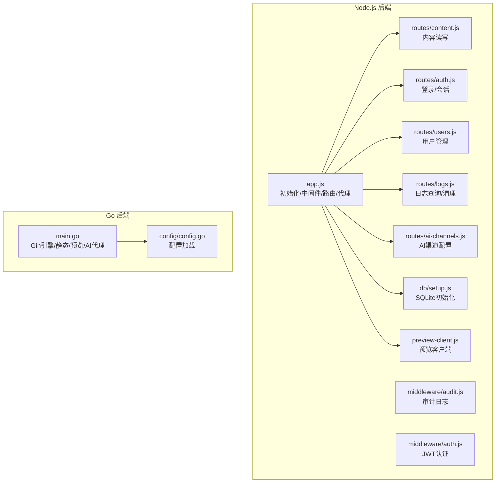
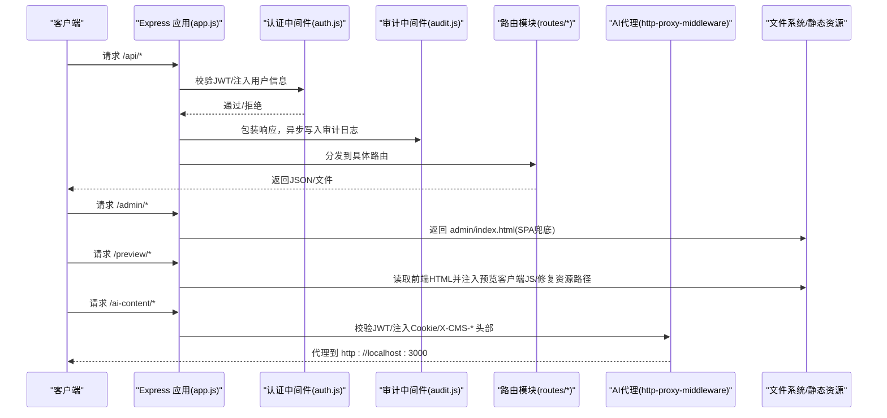
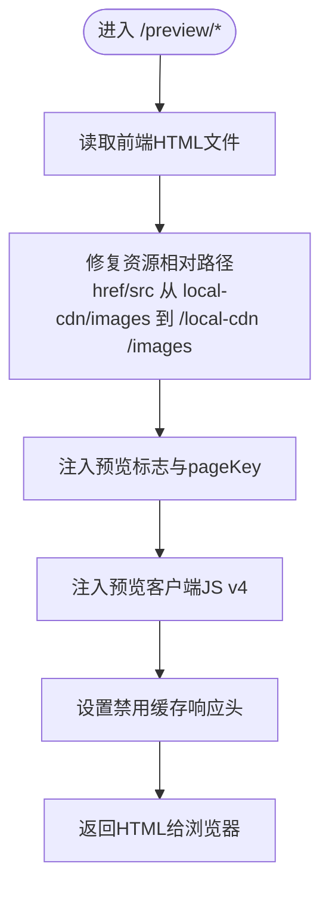
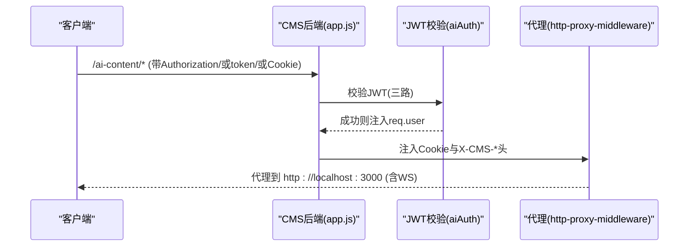
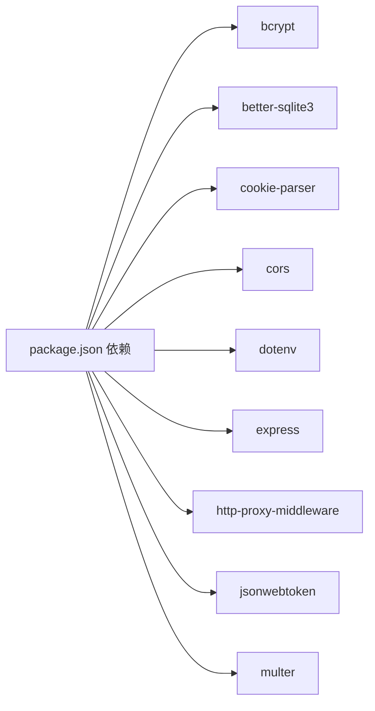

# 核心服务

<cite>
**本文引用的文件**   
- [business-core/cms-server/app.js](file://business-core/cms-server/app.js)
- [business-core/cms-server/routes/content.js](file://business-core/cms-server/routes/content.js)
- [business-core/cms-server/middleware/auth.js](file://business-core/cms-server/middleware/auth.js)
- [business-core/cms-server/middleware/audit.js](file://business-core/cms-server/middleware/audit.js)
- [business-core/cms-server/routes/auth.js](file://business-core/cms-server/routes/auth.js)
- [business-core/cms-server/routes/users.js](file://business-core/cms-server/routes/users.js)
- [business-core/cms-server/routes/logs.js](file://business-core/cms-server/routes/logs.js)
- [business-core/cms-server/routes/ai-channels.js](file://business-core/cms-server/routes/ai-channels.js)
- [business-core/cms-server/preview-client.js](file://business-core/cms-server/preview-client.js)
- [business-core/cms-server/db/setup.js](file://business-core/cms-server/db/setup.js)
- [business-core/cms-server/package.json](file://business-core/cms-server/package.json)
- [business-core/cms-server-go/main.go](file://business-core/cms-server-go/main.go)
- [business-core/cms-server-go/config/config.go](file://business-core/cms-server-go/config/config.go)
</cite>

## 目录
1. [简介](#简介)
2. [项目结构](#项目结构)
3. [核心组件](#核心组件)
4. [架构总览](#架构总览)
5. [详细组件分析](#详细组件分析)
6. [依赖分析](#依赖分析)
7. [性能考虑](#性能考虑)
8. [故障排查指南](#故障排查指南)
9. [结论](#结论)
10. [附录](#附录)

## 简介
本技术文档面向CMS核心服务，围绕Express.js后端与Go/Gin后端两条主线，系统性阐述以下主题：
- Express.js应用初始化流程：中间件配置、路由挂载与服务器启动
- 静态文件服务：管理后台SPA托管、上传文件服务、本地CDN资源管理
- 预览模式实现：HTML文件托管、预览客户端JS注入、资源路径修复策略
- AI内容生成代理服务：JWT认证传递、Cookie处理、WebSocket支持
- 实际代码示例与配置说明，帮助开发者理解服务架构与扩展点

## 项目结构
本仓库包含两套后端实现：
- Node.js + Express（business-core/cms-server）
- Go + Gin（business-core/cms-server-go）

两者均提供相同的静态资源托管、预览模式、内容API、用户与日志管理、AI代理等能力。

图表来源
- [business-core/cms-server/app.js:1-315](file://business-core/cms-server/app.js#L1-L315)
- [business-core/cms-server/routes/content.js:1-104](file://business-core/cms-server/routes/content.js#L1-L104)
- [business-core/cms-server/middleware/audit.js:1-75](file://business-core/cms-server/middleware/audit.js#L1-L75)
- [business-core/cms-server/middleware/auth.js:1-86](file://business-core/cms-server/middleware/auth.js#L1-L86)
- [business-core/cms-server/routes/auth.js:1-99](file://business-core/cms-server/routes/auth.js#L1-L99)
- [business-core/cms-server/routes/users.js:1-154](file://business-core/cms-server/routes/users.js#L1-L154)
- [business-core/cms-server/routes/logs.js:1-59](file://business-core/cms-server/routes/logs.js#L1-L59)
- [business-core/cms-server/routes/ai-channels.js:1-113](file://business-core/cms-server/routes/ai-channels.js#L1-L113)
- [business-core/cms-server/db/setup.js:1-115](file://business-core/cms-server/db/setup.js#L1-L115)
- [business-core/cms-server/preview-client.js:1-308](file://business-core/cms-server/preview-client.js#L1-L308)
- [business-core/cms-server-go/main.go:1-317](file://business-core/cms-server-go/main.go#L1-L317)
- [business-core/cms-server-go/config/config.go:1-95](file://business-core/cms-server-go/config/config.go#L1-L95)

章节来源
- [business-core/cms-server/app.js:1-315](file://business-core/cms-server/app.js#L1-L315)
- [business-core/cms-server-go/main.go:1-317](file://business-core/cms-server-go/main.go#L1-L317)

## 核心组件
- Express应用初始化与中间件
  - CORS、JSON/URL编码体解析、Multer上传、静态文件、预览模式、AI代理、错误处理、监听端口
- 路由模块
  - 认证与会话、用户管理、内容读写、日志、AI渠道、上传
- 中间件
  - JWT认证、审计日志、页面权限校验
- 数据库初始化
  - SQLite表结构与默认超级管理员
- 预览客户端
  - 从API拉取内容并注入DOM，拦截业务脚本覆盖行为
- Go后端
  - Gin引擎、静态资源、预览模式、AI代理、配置加载

章节来源
- [business-core/cms-server/app.js:16-315](file://business-core/cms-server/app.js#L16-L315)
- [business-core/cms-server/routes/content.js:12-104](file://business-core/cms-server/routes/content.js#L12-L104)
- [business-core/cms-server/middleware/auth.js:21-85](file://business-core/cms-server/middleware/auth.js#L21-L85)
- [business-core/cms-server/middleware/audit.js:22-75](file://business-core/cms-server/middleware/audit.js#L22-L75)
- [business-core/cms-server/db/setup.js:14-115](file://business-core/cms-server/db/setup.js#L14-L115)
- [business-core/cms-server/preview-client.js:7-308](file://business-core/cms-server/preview-client.js#L7-L308)
- [business-core/cms-server-go/main.go:22-114](file://business-core/cms-server-go/main.go#L22-L114)
- [business-core/cms-server-go/config/config.go:26-95](file://business-core/cms-server-go/config/config.go#L26-L95)

## 架构总览
下图展示了Express后端的启动、中间件、静态资源、预览模式与AI代理的关键交互：

图表来源
- [business-core/cms-server/app.js:16-315](file://business-core/cms-server/app.js#L16-L315)
- [business-core/cms-server/middleware/auth.js:21-85](file://business-core/cms-server/middleware/auth.js#L21-L85)
- [business-core/cms-server/middleware/audit.js:46-75](file://business-core/cms-server/middleware/audit.js#L46-L75)
- [business-core/cms-server/routes/content.js:48-101](file://business-core/cms-server/routes/content.js#L48-L101)

## 详细组件分析

### Express应用初始化与中间件
- 初始化步骤
  - 加载环境变量、初始化数据库、创建Express实例、设置端口
- 中间件链
  - CORS、JSON/URL编码体解析、Multer上传、静态文件、预览模式、AI代理、错误处理
- 服务器启动
  - 监听端口并输出管理后台与API基础地址

章节来源
- [business-core/cms-server/app.js:6-17](file://business-core/cms-server/app.js#L6-L17)
- [business-core/cms-server/app.js:19-315](file://business-core/cms-server/app.js#L19-L315)

### 静态文件服务
- 管理后台SPA托管
  - /admin/* 路由兜底返回 admin/index.html
- 上传文件服务
  - /uploads/images/* 提供上传后的图片访问
- 本地CDN与图片资源
  - /local-cdn 与 /images 提供静态资源访问；预览模式下 /preview/images 与 /preview/local-cdn 也开放
- favicon
  - /favicon.ico 返回204避免控制台404

章节来源
- [business-core/cms-server/app.js:55-65](file://business-core/cms-server/app.js#L55-L65)
- [business-core/cms-server/app.js:227-230](file://business-core/cms-server/app.js#L227-L230)

### 预览模式实现
- HTML托管与注入
  - /preview/* 读取项目根HTML，注入预览标志与pageKey，注入预览客户端JS v4
- 资源路径修复
  - 将 local-cdn 与 images 的相对路径修复为绝对路径，保证资源正确加载
- 预览客户端逻辑
  - 从URL解析pageKey，拦截业务脚本applyTranslations/setLang，按data-i18n键从API拉取内容并注入DOM
  - 对页面内容、导航、页脚、咨询弹窗分别应用不同字段映射规则

图表来源
- [business-core/cms-server/app.js:103-153](file://business-core/cms-server/app.js#L103-L153)
- [business-core/cms-server/preview-client.js:8-28](file://business-core/cms-server/preview-client.js#L8-L28)

章节来源
- [business-core/cms-server/app.js:103-153](file://business-core/cms-server/app.js#L103-L153)
- [business-core/cms-server/preview-client.js:69-290](file://business-core/cms-server/preview-client.js#L69-L290)

### AI内容生成代理服务
- 认证传递
  - 支持三种方式：Authorization Bearer、URL参数token、Cookie cms_token
  - 通过JWT解码获取用户信息，注入X-CMS-User与X-CMS-Role头部
- Cookie处理
  - 将cms_user=username附加到代理请求Cookie中
- WebSocket支持
  - 使用http-proxy-middleware启用ws:true，转发WebSocket连接
- 目标服务
  - http://localhost:3000（AI内容生成服务）

图表来源
- [business-core/cms-server/app.js:163-225](file://business-core/cms-server/app.js#L163-L225)

章节来源
- [business-core/cms-server/app.js:163-225](file://business-core/cms-server/app.js#L163-L225)

### 内容API（GET/PUT）
- GET /api/content/:pageKey
  - 无需认证，读取全局配置或页面内容JSON
- PUT /api/content/:pageKey
  - 需认证；全局配置仅超级管理员可写；页面内容需具备对应页面权限
- 权限检查
  - 普通编辑者需在page_permissions表中拥有page_key权限

章节来源
- [business-core/cms-server/routes/content.js:48-101](file://business-core/cms-server/routes/content.js#L48-L101)
- [business-core/cms-server/middleware/auth.js:37-63](file://business-core/cms-server/middleware/auth.js#L37-L63)

### 认证与会话
- 登录
  - 校验用户名/密码，返回JWT与用户权限列表
- 会话恢复
  - /api/auth/me 验证JWT并返回用户信息
- 中间件
  - requireAuth：验证JWT并注入req.user
  - requireSuperAdmin：要求超级管理员
  - requirePagePerm：按pageKey校验页面权限

章节来源
- [business-core/cms-server/routes/auth.js:22-96](file://business-core/cms-server/routes/auth.js#L22-L96)
- [business-core/cms-server/middleware/auth.js:21-63](file://business-core/cms-server/middleware/auth.js#L21-L63)

### 用户管理与日志
- 用户管理
  - 仅超级管理员可进行增删改、重置密码、批量设置页面权限
- 日志
  - GET /api/logs 支持分页与多条件过滤；DELETE /api/logs 清空日志（仅超级管理员）

章节来源
- [business-core/cms-server/routes/users.js:26-151](file://business-core/cms-server/routes/users.js#L26-L151)
- [business-core/cms-server/routes/logs.js:20-56](file://business-core/cms-server/routes/logs.js#L20-L56)

### 审计日志中间件
- 自动记录写操作（POST/PUT/DELETE）：拦截响应，在成功时异步写入audit_log
- 手动记录：在路由中调用audit(req, action, target, detail)

章节来源
- [business-core/cms-server/middleware/audit.js:46-75](file://business-core/cms-server/middleware/audit.js#L46-L75)

### 数据库初始化
- 表结构
  - users、page_permissions、audit_log、ai_channels
- 默认超级管理员
  - 若不存在admin用户，创建admin/admin123并授予所有页面权限

章节来源
- [business-core/cms-server/db/setup.js:18-104](file://business-core/cms-server/db/setup.js#L18-L104)

### 预览客户端（浏览器端）
- 功能要点
  - 解析URL获取pageKey，拦截applyTranslations/setLang
  - 从/api/content/{pageKey}与全局API拉取数据，按data-i18n键注入DOM
  - 对图片字段进行URL合法性校验与绝对路径修正
  - 延迟重试以对抗其他脚本覆盖

章节来源
- [business-core/cms-server/preview-client.js:7-308](file://business-core/cms-server/preview-client.js#L7-L308)

### Go后端（对比参考）
- 配置加载
  - 从环境变量加载端口、JWT密钥、目录路径、AI代理目标
- 静态资源与预览模式
  - 与Express版本一致的静态目录与预览处理
- AI代理
  - 使用Gin中间件实现JWT校验与Cookie/X-CMS-*注入，代理到AI服务
- 启动
  - 初始化数据库、注册路由、启动HTTP服务

章节来源
- [business-core/cms-server-go/main.go:22-114](file://business-core/cms-server-go/main.go#L22-L114)
- [business-core/cms-server-go/config/config.go:26-95](file://business-core/cms-server-go/config/config.go#L26-L95)

## 依赖分析
- Express后端依赖
  - bcrypt、better-sqlite3、cookie-parser、cors、dotenv、express、http-proxy-middleware、jsonwebtoken、multer
- Go后端依赖
  - Gin、JWT、CORS、配置加载等（详见Go工程）

图表来源
- [business-core/cms-server/package.json:10-20](file://business-core/cms-server/package.json#L10-L20)

章节来源
- [business-core/cms-server/package.json:10-20](file://business-core/cms-server/package.json#L10-L20)

## 性能考虑
- 静态资源
  - 预览模式下禁用缓存，确保实时性；生产环境建议由反向代理统一缓存策略
- 上传文件
  - 限制单文件大小与允许格式，避免过大资源占用磁盘与带宽
- 数据库
  - SQLite适合小中型场景；高并发写入建议评估迁移方案
- 代理
  - AI代理开启WebSocket支持，注意目标服务可用性与超时配置

## 故障排查指南
- 认证失败
  - 检查Authorization头、URL token或Cookie cms_token是否正确传递与签名有效
- 预览页面空白或资源404
  - 确认HTML中local-cdn与images路径已被修复为绝对路径
  - 确认/preview-client-v4.js可正常访问且未被缓存
- 上传失败
  - 检查文件类型与大小限制，确认/uploads/images目录存在且可写
- AI代理返回401
  - 确认JWT有效且未过期；检查Cookie cms_token或URL token传递
- 审计日志未记录
  - 确认写操作且状态码小于400；检查数据库连接与表结构

章节来源
- [business-core/cms-server/app.js:163-225](file://business-core/cms-server/app.js#L163-L225)
- [business-core/cms-server/app.js:103-153](file://business-core/cms-server/app.js#L103-L153)
- [business-core/cms-server/routes/content.js:48-101](file://business-core/cms-server/routes/content.js#L48-L101)

## 结论
本CMS核心服务提供了完整的静态资源托管、内容API、用户与日志管理、预览模式以及AI内容生成代理能力。Express与Go双栈实现确保了灵活性与可扩展性。开发者可基于现有中间件、路由与代理机制进行二次开发与功能增强。

## 附录
- 环境变量与配置
  - Express：JWT_SECRET、PORT（默认3001）、上传目录、内容目录、管理后台目录等
  - Go：PORT、JWT_SECRET、PROJECT_ROOT、UPLOAD_DIR、CONTENT_DIR、GLOBAL_DIR、ADMIN_DIR、AI_PROXY_URL
- 关键端点概览
  - /api/auth/login、/api/auth/me、/api/users、/api/content/:pageKey、/api/logs、/api/ai-channels
  - /admin/*（SPA兜底）、/preview/*（预览模式）、/ai-content/*（AI代理）

章节来源
- [business-core/cms-server/db/setup.js:72-104](file://business-core/cms-server/db/setup.js#L72-L104)
- [business-core/cms-server-go/config/config.go:42-53](file://business-core/cms-server-go/config/config.go#L42-L53)
- [business-core/cms-server/app.js:155-161](file://business-core/cms-server/app.js#L155-L161)
- [business-core/cms-server/routes/auth.js:22-96](file://business-core/cms-server/routes/auth.js#L22-L96)
- [business-core/cms-server/routes/users.js:26-151](file://business-core/cms-server/routes/users.js#L26-L151)
- [business-core/cms-server/routes/content.js:48-101](file://business-core/cms-server/routes/content.js#L48-L101)
- [business-core/cms-server/routes/logs.js:20-56](file://business-core/cms-server/routes/logs.js#L20-L56)
- [business-core/cms-server/routes/ai-channels.js:25-110](file://business-core/cms-server/routes/ai-channels.js#L25-L110)