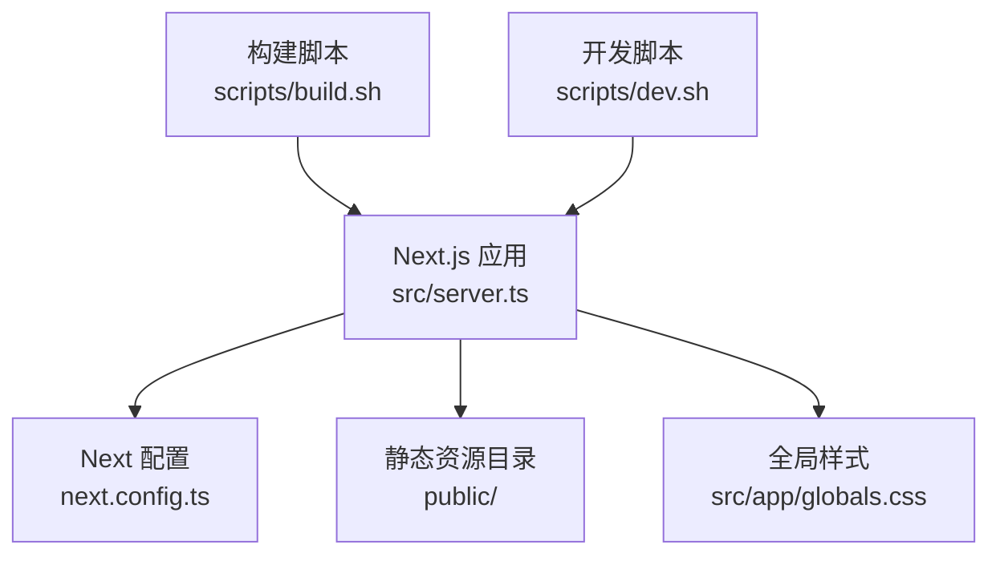
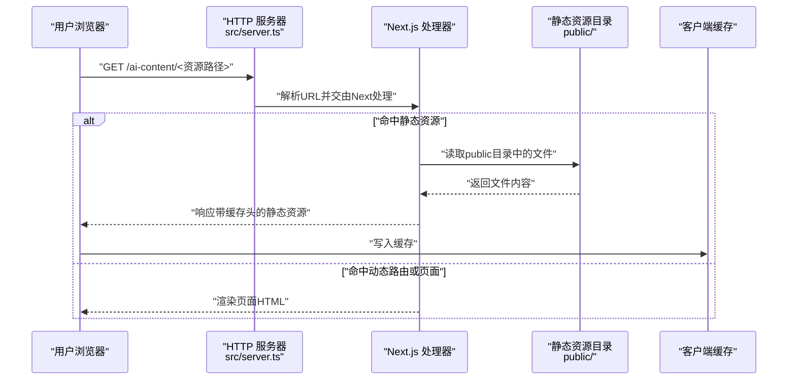
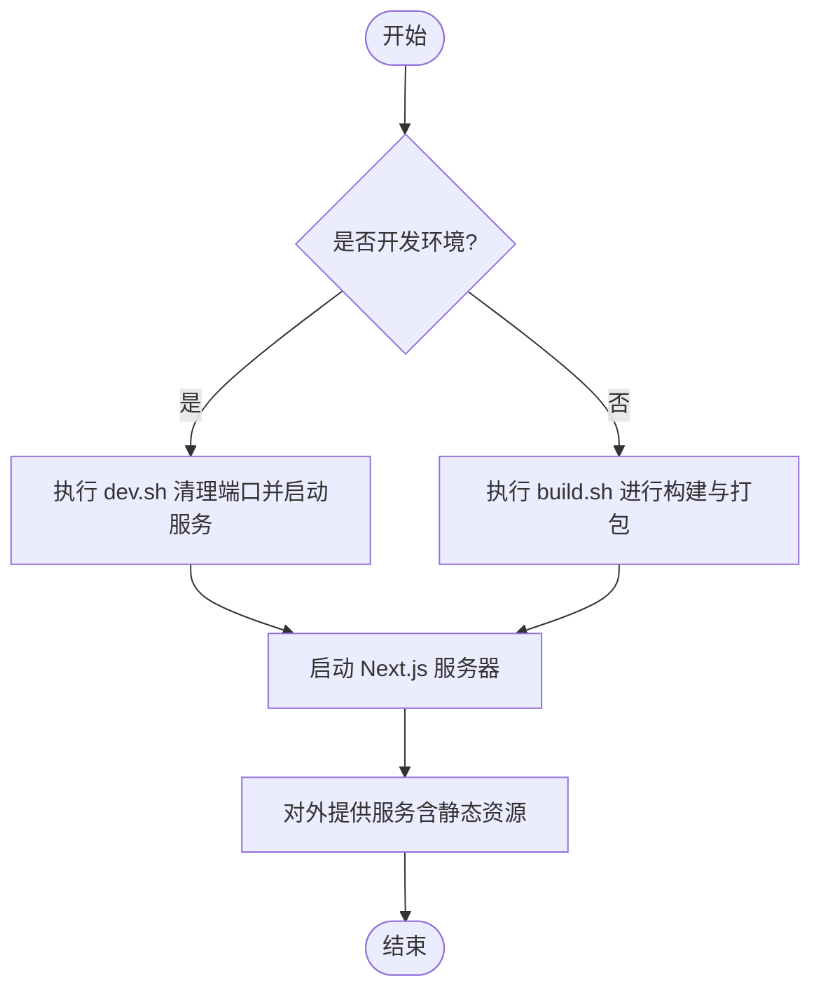
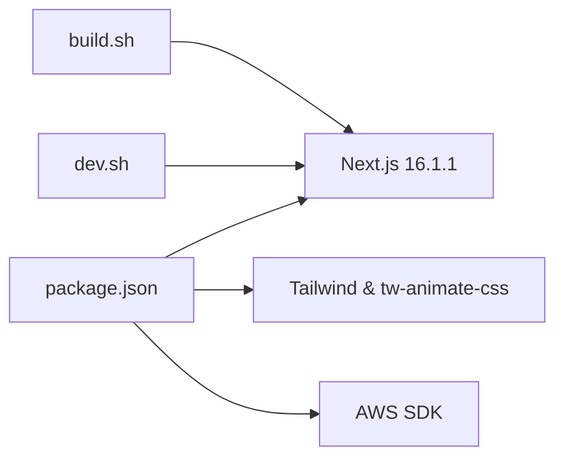

# CDN资源管理

<cite>
**本文档引用的文件**
- [next.config.ts](file://ai-content-project/next.config.ts)
- [package.json](file://ai-content-project/package.json)
- [globals.css](file://ai-content-project/src/app/globals.css)
- [build.sh](file://ai-content-project/scripts/build.sh)
- [dev.sh](file://ai-content-project/scripts/dev.sh)
- [server.ts](file://ai-content-project/src/server.ts)
- [public 目录](file://ai-content-project/public)
</cite>

## 目录
1. [简介](#简介)
2. [项目结构](#项目结构)
3. [核心组件](#核心组件)
4. [架构总览](#架构总览)
5. [详细组件分析](#详细组件分析)
6. [依赖分析](#依赖分析)
7. [性能考虑](#性能考虑)
8. [故障排查指南](#故障排查指南)
9. [结论](#结论)
10. [附录](#附录)

## 简介
本文件面向CDN资源管理服务，聚焦于本地CDN资源的静态文件托管配置与使用方式，涵盖以下主题：
- 本地CDN资源的组织结构与访问路径
- 资源分类管理（CSS样式、JavaScript脚本、字体文件等）
- 资源与页面的关联关系（引用路径与版本策略）
- 缓存机制与性能优化方案
- 最佳实践与维护建议

在当前代码库中，Next.js应用通过基础路径配置实现子路径部署，静态资源托管位于public目录；同时，全局样式通过Tailwind与自定义CSS变量进行统一管理。

## 项目结构
该工程采用Next.js框架，核心与CDN资源相关的关键位置如下：
- 静态资源根目录：public（用于存放无需构建处理的静态资源）
- 全局样式：src/app/globals.css（包含Tailwind与自定义CSS变量）
- 构建与开发脚本：scripts/build.sh、scripts/dev.sh
- 应用服务器入口：src/server.ts（基于Next.js HTTP服务）
- Next.js配置：next.config.ts（含basePath、图片远程模式等）

图表来源
- [server.ts:1-36](file://ai-content-project/src/server.ts#L1-L36)
- [next.config.ts:1-23](file://ai-content-project/next.config.ts#L1-L23)
- [globals.css:1-138](file://ai-content-project/src/app/globals.css#L1-L138)
- [build.sh:1-18](file://ai-content-project/scripts/build.sh#L1-L18)
- [dev.sh:1-35](file://ai-content-project/scripts/dev.sh#L1-L35)

章节来源
- [next.config.ts:1-23](file://ai-content-project/next.config.ts#L1-L23)
- [globals.css:1-138](file://ai-content-project/src/app/globals.css#L1-L138)
- [build.sh:1-18](file://ai-content-project/scripts/build.sh#L1-L18)
- [dev.sh:1-35](file://ai-content-project/scripts/dev.sh#L1-L35)
- [server.ts:1-36](file://ai-content-project/src/server.ts#L1-L36)

## 核心组件
- 基础路径与子路径部署
  - 通过basePath配置，应用以“/ai-content”作为前缀路径对外提供服务，所有静态资源与路由均需基于此前缀访问。
- 静态资源托管
  - public目录用于存放无需构建处理的静态资源，如图标、媒体文件等；这些资源可通过相对路径直接访问。
- 全局样式与主题变量
  - globals.css引入Tailwind并定义深浅色主题下的CSS变量，统一页面视觉与交互风格。
- 构建与运行
  - build.sh负责安装依赖、执行Next构建与打包服务端代码；dev.sh负责清理端口并启动开发服务器。

章节来源
- [next.config.ts:3-10](file://ai-content-project/next.config.ts#L3-L10)
- [globals.css:1-138](file://ai-content-project/src/app/globals.css#L1-L138)
- [build.sh:8-15](file://ai-content-project/scripts/build.sh#L8-L15)
- [dev.sh:12-35](file://ai-content-project/scripts/dev.sh#L12-L35)

## 架构总览
下图展示了从请求到静态资源返回的整体流程，以及与Next.js配置的关系：

图表来源
- [server.ts:13-35](file://ai-content-project/src/server.ts#L13-L35)
- [next.config.ts:4](file://ai-content-project/next.config.ts#L4)
- [public 目录](file://ai-content-project/public)

## 详细组件分析

### 静态资源托管与访问路径
- 组织结构
  - public目录用于存放无需构建处理的静态资源，例如图标、媒体文件等。
- 访问方式
  - 在开发与生产环境中，静态资源需通过“/ai-content”前缀访问，确保与basePath一致。
- 资源类型建议
  - 图标与媒体：放置于public根目录或按功能分组（如icons、media）。
  - 字体文件：可置于public/fonts或public/static/fonts，便于版本化与缓存控制。
  - JavaScript脚本：若为第三方CDN资源，建议通过CDN直连；若为内部脚本，优先使用Next.js构建产物或public目录配合版本号。

章节来源
- [next.config.ts:4](file://ai-content-project/next.config.ts#L4)
- [public 目录](file://ai-content-project/public)

### 资源分类管理
- CSS样式文件
  - 全局样式集中于globals.css，包含Tailwind导入与自定义CSS变量，支持深浅色主题切换。
  - 建议将业务样式拆分为模块化组件样式，避免全局污染。
- JavaScript脚本
  - 优先使用Next.js构建链路生成的客户端包；仅在特殊场景使用public目录内的脚本。
- 字体文件
  - 将字体文件放入public/fonts目录，结合CSS @font-face声明使用；建议启用版本号与缓存头。
- 第三方CDN资源
  - 对于外部CDN资源，建议在页面中直接引用CDN链接，避免占用本地带宽与存储。

章节来源
- [globals.css:1-138](file://ai-content-project/src/app/globals.css#L1-L138)

### 资源与页面的关联关系
- 引用路径配置
  - 由于设置了basePath为“/ai-content”，页面中对静态资源的引用必须包含该前缀。
  - 对于public中的资源，推荐使用绝对路径（以“/ai-content”开头）。
- 版本管理策略
  - 字体与媒体资源建议采用文件名版本化（如名称包含哈希），以提升缓存命中率与更新可控性。
  - CSS与JS建议通过Next.js构建产物的哈希命名实现版本控制。
- 页面内资源加载
  - 全局样式通过globals.css注入；其他样式与脚本遵循Next.js的样式与脚本加载机制。

章节来源
- [next.config.ts:4](file://ai-content-project/next.config.ts#L4)
- [globals.css:1-138](file://ai-content-project/src/app/globals.css#L1-L138)

### 缓存机制与性能优化
- 缓存策略
  - 静态资源应设置合理的Cache-Control与ETag，以提升浏览器缓存效率。
  - 版本化资源（含哈希）可长期缓存，未版本化资源应短缓存或协商缓存。
- 性能优化
  - 使用CDN分发静态资源，降低源站压力。
  - 启用Gzip/Brotli压缩，减少传输体积。
  - 按需加载与懒加载，避免首屏阻塞。
  - 图片资源使用现代格式（WebP/AVIF）并设置合适的尺寸与质量。
- Next.js内置优化
  - 利用Next.js自动的代码分割与资源哈希命名，减少重复下载。

章节来源
- [next.config.ts:11-19](file://ai-content-project/next.config.ts#L11-L19)
- [build.sh:12](file://ai-content-project/scripts/build.sh#L12)

### 构建与运行流程
- 开发环境
  - dev.sh会清理指定端口并启动tsx监控模式的服务端，便于热更新与调试。
- 生产构建
  - build.sh执行Next构建与服务端打包，随后可部署至生产环境。
- 服务器启动
  - server.ts基于Next.js创建HTTP服务器，统一处理请求与错误。

图表来源
- [dev.sh:12-35](file://ai-content-project/scripts/dev.sh#L12-L35)
- [build.sh:8-15](file://ai-content-project/scripts/build.sh#L8-L15)
- [server.ts:13-35](file://ai-content-project/src/server.ts#L13-L35)

章节来源
- [dev.sh:12-35](file://ai-content-project/scripts/dev.sh#L12-L35)
- [build.sh:8-15](file://ai-content-project/scripts/build.sh#L8-L15)
- [server.ts:13-35](file://ai-content-project/src/server.ts#L13-L35)

## 依赖分析
- Next.js版本与特性
  - 项目使用Next.js 16.1.1，具备现代化的构建与运行能力。
- 关键依赖
  - Tailwind与tw-animate-css用于样式体系与动画增强。
  - AWS SDK用于对象存储集成（可用于CDN资源上传与管理）。
- 脚本依赖
  - pnpm作为包管理器，构建脚本依赖pnpm命令链。

图表来源
- [package.json:15-76](file://ai-content-project/package.json#L15-L76)
- [build.sh:9,12,15](file://ai-content-project/scripts/build.sh#L9,L12,L15)
- [dev.sh:34](file://ai-content-project/scripts/dev.sh#L34)

章节来源
- [package.json:15-76](file://ai-content-project/package.json#L15-L76)
- [build.sh:8-15](file://ai-content-project/scripts/build.sh#L8-L15)
- [dev.sh:34](file://ai-content-project/scripts/dev.sh#L34)

## 性能考虑
- 资源分发
  - 将静态资源迁移至CDN，缩短边缘节点距离，提升全球访问速度。
- 缓存策略
  - 对版本化资源设置长缓存（如一年），对非版本化资源设置短缓存或协商缓存。
- 压缩与格式
  - 启用Gzip/Brotli压缩；优先使用WebP/AVIF等现代图片格式。
- 构建优化
  - 使用Next.js的自动代码分割与按需加载，减少初始包体积。
- 图片与字体
  - 图片使用响应式尺寸与合适质量；字体文件采用WOFF2并结合预连接与预加载策略。

## 故障排查指南
- 404或资源无法加载
  - 检查资源路径是否包含“/ai-content”前缀；确认资源确实在public目录中。
- 端口占用导致启动失败
  - 使用dev.sh提供的端口清理逻辑，确保目标端口可用后再启动。
- 构建失败
  - 查看build.sh输出日志，确认依赖安装与Next构建步骤成功完成。
- 服务器异常
  - server.ts捕获异常并返回500状态，检查控制台日志定位问题。

章节来源
- [dev.sh:12-28](file://ai-content-project/scripts/dev.sh#L12-L28)
- [build.sh:8-15](file://ai-content-project/scripts/build.sh#L8-L15)
- [server.ts:18-22](file://ai-content-project/src/server.ts#L18-L22)

## 结论
本项目通过Next.js的basePath配置实现了子路径部署，结合public目录进行静态资源托管。建议在实际生产中进一步完善CDN资源的版本化与缓存策略，利用AWS SDK实现资源上传与管理，并持续优化构建与运行流程，以获得更优的性能与可维护性。

## 附录
- 最佳实践清单
  - 所有静态资源引用必须包含“/ai-content”前缀
  - 字体与媒体资源采用文件名版本化
  - CSS与JS通过构建产物哈希命名实现版本控制
  - 使用CDN分发静态资源并合理设置缓存头
  - 定期审查与清理public目录中的过期资源
  - 在CI/CD中集成构建与上传流程，确保一致性