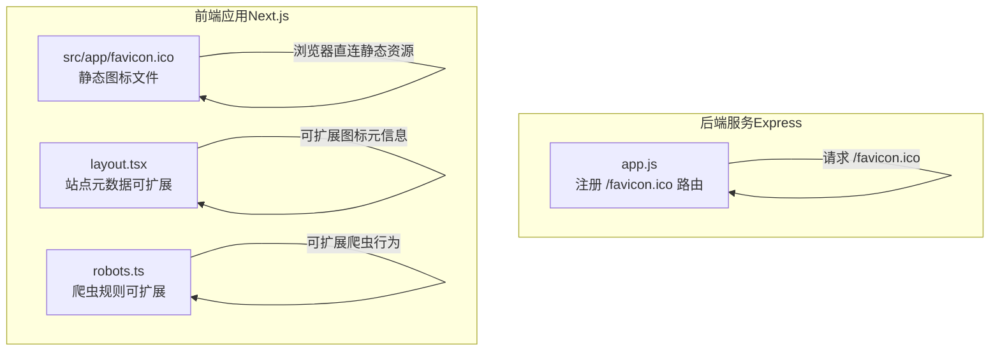
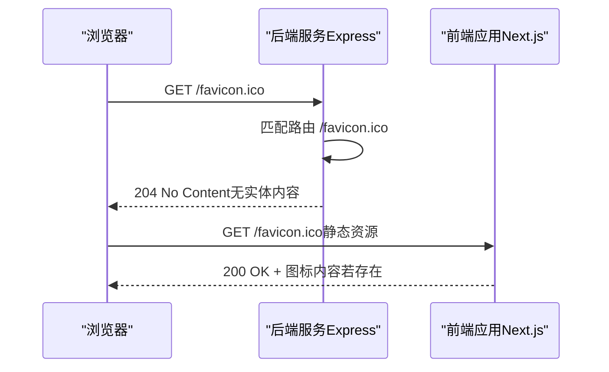
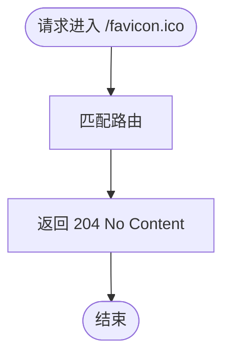
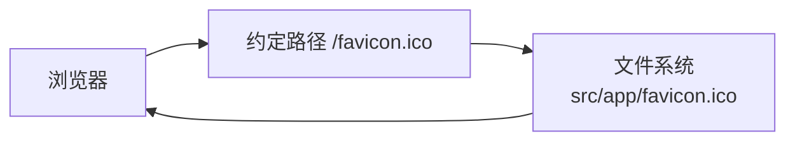
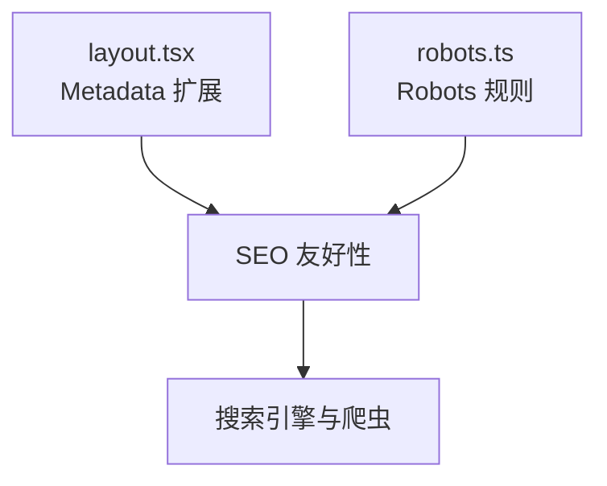
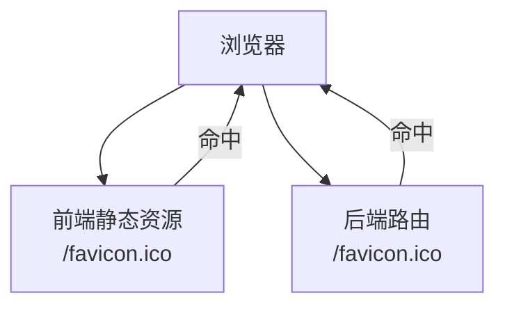

# Favicon处理

<cite>
**本文引用的文件**
- [app.js](file://business-core/cms-server/app.js)
- [favicon.ico](file://ai-content-project/src/app/favicon.ico)
- [layout.tsx](file://ai-content-project/src/app/layout.tsx)
- [robots.ts](file://ai-content-project/src/app/robots.ts)
</cite>

## 目录
1. [简介](#简介)
2. [项目结构](#项目结构)
3. [核心组件](#核心组件)
4. [架构总览](#架构总览)
5. [详细组件分析](#详细组件分析)
6. [依赖关系分析](#依赖关系分析)
7. [性能考量](#性能考量)
8. [故障排查指南](#故障排查指南)
9. [结论](#结论)
10. [附录](#附录)

## 简介
本技术文档聚焦于Favicon处理服务的设计与实现，围绕以下目标展开：
- 解释/favicon.ico的静默处理机制，采用204状态码避免浏览器控制台出现404错误
- 说明favicon.ico缺失时的处理策略（空响应与浏览器兼容性）
- 阐述favicon在不同浏览器中的显示机制与缓存行为
- 分析favicon处理对用户体验与SEO的影响
- 提供配置最佳实践与常见问题解决方案

## 项目结构
本仓库包含两处与Favicon相关的关键位置：
- 后端服务（Express）：在根路由下对/favicon.ico进行静默处理，返回204状态码
- 前端应用（Next.js）：在public目录提供favicon.ico作为静态资源，便于浏览器直接获取

图表来源
- [app.js](file://business-core/cms-server/app.js)
- [favicon.ico](file://ai-content-project/src/app/favicon.ico)
- [layout.tsx](file://ai-content-project/src/app/layout.tsx)
- [robots.ts](file://ai-content-project/src/app/robots.ts)

章节来源
- [app.js](file://business-core/cms-server/app.js)
- [favicon.ico](file://ai-content-project/src/app/favicon.ico)
- [layout.tsx](file://ai-content-project/src/app/layout.tsx)
- [robots.ts](file://ai-content-project/src/app/robots.ts)

## 核心组件
- 后端静默处理：在Express中为/favicon.ico注册GET路由，统一返回204 No Content，避免浏览器因找不到资源而产生控制台404日志
- 前端静态图标：在Next.js应用中提供favicon.ico，便于浏览器按约定路径直接获取
- SEO与元数据：通过Next.js的metadata与robots配置，为搜索引擎与爬虫提供友好指引（可扩展）

章节来源
- [app.js](file://business-core/cms-server/app.js)
- [favicon.ico](file://ai-content-project/src/app/favicon.ico)
- [layout.tsx](file://ai-content-project/src/app/layout.tsx)
- [robots.ts](file://ai-content-project/src/app/robots.ts)

## 架构总览
下图展示了浏览器请求favicon时的两条路径及交互：

图表来源
- [app.js](file://business-core/cms-server/app.js)
- [favicon.ico](file://ai-content-project/src/app/favicon.ico)

## 详细组件分析

### 后端静默处理（/favicon.ico）
- 设计动机：避免浏览器在地址栏或控制台出现404错误提示，提升开发体验与日志整洁度
- 实现要点：
  - 使用app.get('/favicon.ico', ...)注册路由
  - 返回204 No Content，不携带响应体
  - 不设置Cache-Control，避免缓存干扰
- 适用场景：当前端未提供静态favicon或希望统一由后端屏蔽缺失请求时

图表来源
- [app.js](file://business-core/cms-server/app.js)

章节来源
- [app.js](file://business-core/cms-server/app.js)

### 前端静态图标（Next.js）
- 资源位置：src/app/favicon.ico
- 获取方式：浏览器按约定路径直接请求该静态文件
- 优点：减少后端路由压力，提高首屏与缓存命中率
- 注意事项：确保文件存在且可被静态服务访问

图表来源
- [favicon.ico](file://ai-content-project/src/app/favicon.ico)

章节来源
- [favicon.ico](file://ai-content-project/src/app/favicon.ico)

### SEO与元数据扩展（可选）
- 元数据：可在layout.tsx中扩展图标相关元信息（如apple-touch-icon、manifest等）
- 爬虫规则：可通过robots.ts控制爬虫对favicon的抓取行为

图表来源
- [layout.tsx](file://ai-content-project/src/app/layout.tsx)
- [robots.ts](file://ai-content-project/src/app/robots.ts)

章节来源
- [layout.tsx](file://ai-content-project/src/app/layout.tsx)
- [robots.ts](file://ai-content-project/src/app/robots.ts)

## 依赖关系分析
- 浏览器对favicon的请求通常遵循约定路径（/favicon.ico），前后端均可响应
- 若前端提供静态图标，优先由前端返回；否则由后端返回204，避免404
- 两者并行存在时，浏览器可能优先命中静态资源，具体取决于部署与访问路径

图表来源
- [app.js](file://business-core/cms-server/app.js)
- [favicon.ico](file://ai-content-project/src/app/favicon.ico)

章节来源
- [app.js](file://business-core/cms-server/app.js)
- [favicon.ico](file://ai-content-project/src/app/favicon.ico)

## 性能考量
- 204响应零负载：后端返回204不携带实体，网络开销极低
- 缓存策略：后端未设置Cache-Control，避免与静态资源缓存冲突；前端静态资源可利用浏览器缓存
- 资源体积：建议使用压缩后的图标文件，降低带宽占用
- 多尺寸支持：为不同设备与场景准备多尺寸图标，提升显示质量与加载速度

## 故障排查指南
- 症状：浏览器控制台出现404
  - 检查后端是否正确注册/favicon.ico路由并返回204
  - 确认前端静态favicon是否存在且可访问
- 症状：标签页未显示图标
  - 确认浏览器缓存是否仍保留旧结果，尝试清理缓存或强制刷新
  - 检查是否存在多个图标定义导致冲突
- 症状：SEO抓取异常
  - 检查robots规则是否限制了对/favicon.ico的抓取
  - 在layout中补充必要的图标元信息，帮助搜索引擎识别

章节来源
- [app.js](file://business-core/cms-server/app.js)
- [robots.ts](file://ai-content-project/src/app/robots.ts)

## 结论
通过后端静默处理与前端静态资源的协同，可有效避免favicon缺失引发的404日志与显示问题。结合合理的缓存策略与SEO元信息，可在保证开发体验的同时提升用户感知与搜索引擎友好性。

## 附录

### 最佳实践
- 前端提供静态favicon.ico，确保浏览器可直接获取
- 后端保留/favicon.ico路由，统一返回204，避免404日志
- 为多设备准备多尺寸图标，优化显示效果
- 在layout中补充图标相关元信息，增强SEO友好性
- 控制robots对favicon的抓取行为，避免不必要的爬取

### 常见问题与解答
- Q：为什么后端要返回204而不是404？
  - A：避免浏览器控制台出现404错误，保持日志整洁，提升开发体验
- Q：前端静态图标与后端路由冲突怎么办？
  - A：优先使用前端静态资源；若需统一屏蔽，后端返回204即可
- Q：如何验证favicon生效？
  - A：查看浏览器标签页图标、开发者工具Network面板与Console日志