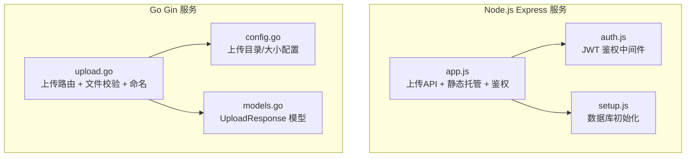
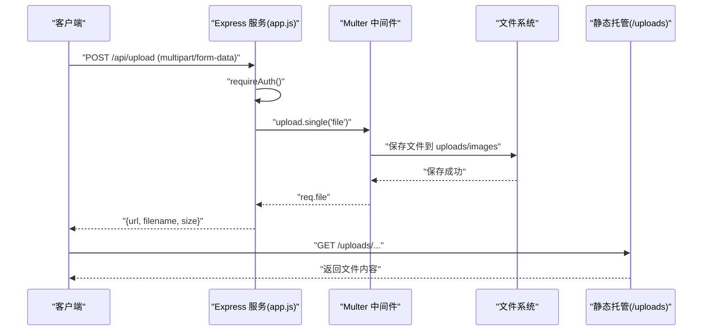
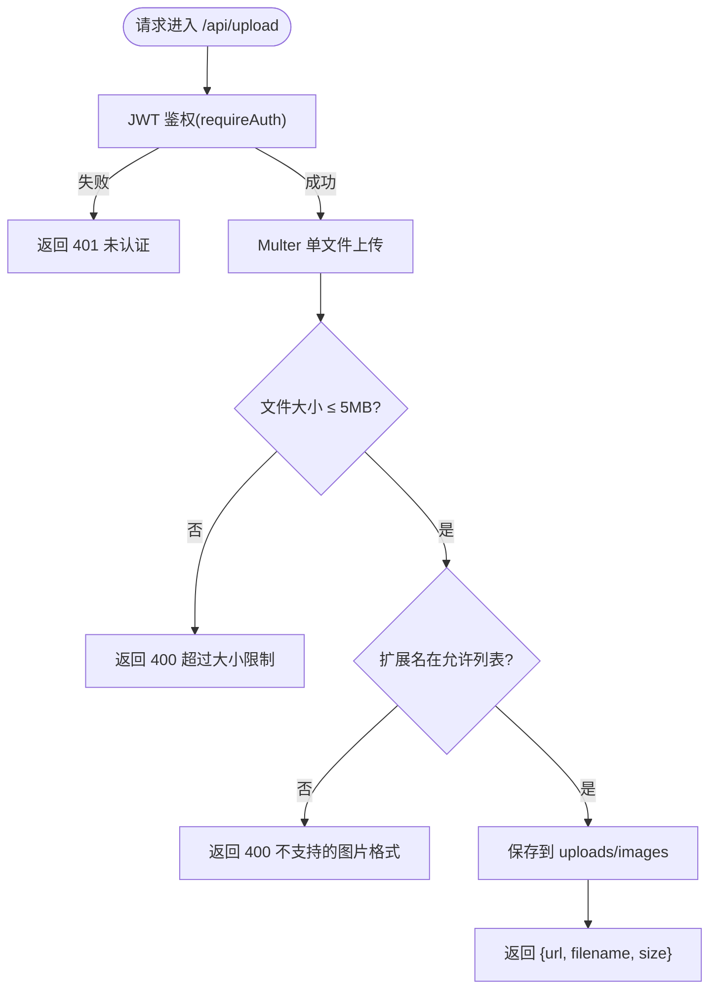
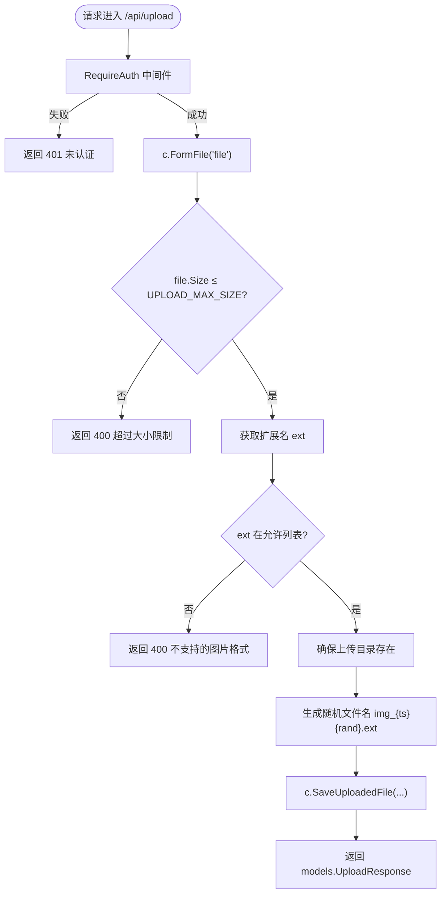
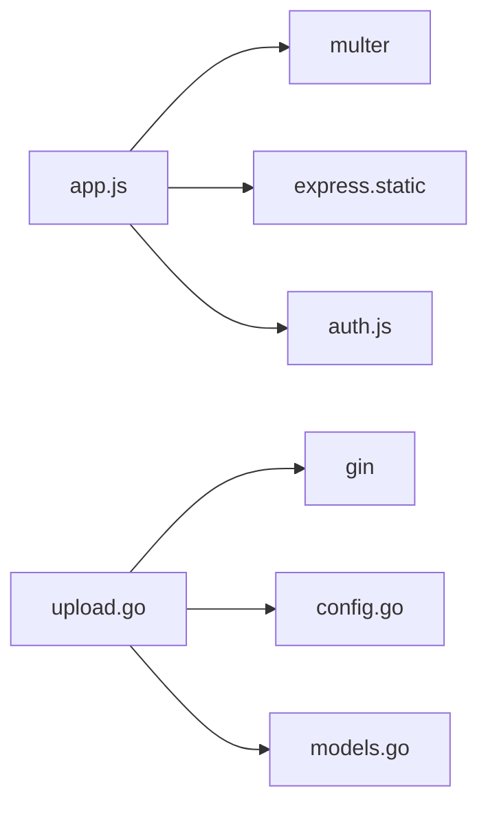

# 上传文件服务

<cite>
**本文引用的文件**
- [app.js](file://business-core/cms-server/app.js)
- [upload.go](file://business-core/cms-server-go/routes/upload.go)
- [config.go](file://business-core/cms-server-go/config/config.go)
- [models.go](file://business-core/cms-server-go/models/models.go)
- [auth.js](file://business-core/cms-server/middleware/auth.js)
- [setup.js](file://business-core/cms-server/db/setup.js)
- [ZSTS-CMS-后端移交说明书.md](file://ZSTS-CMS-后端移交说明书.md)
</cite>

## 目录
1. [简介](#简介)
2. [项目结构](#项目结构)
3. [核心组件](#核心组件)
4. [架构总览](#架构总览)
5. [详细组件分析](#详细组件分析)
6. [依赖关系分析](#依赖关系分析)
7. [性能考虑](#性能考虑)
8. [故障排查指南](#故障排查指南)
9. [结论](#结论)
10. [附录](#附录)

## 简介
本文件面向“上传文件服务”的技术文档，聚焦于两个实现版本：
- Node.js Express 版本：基于 Multer 的文件上传 API，以及静态文件托管配置。
- Go Gin 版本：独立的上传路由与响应模型。

文档将深入解释：
- /uploads 路径的静态文件托管配置
- 文件上传 API 的实现细节（请求/响应格式、鉴权、错误处理）
- Multer 中间件的配置（存储策略、大小限制、类型过滤）
- 命名规则与安全机制（随机文件名生成、恶意文件防护）
- 最佳实践与安全建议

## 项目结构
围绕上传功能的关键文件分布如下：
- Node.js Express 服务：负责上传 API、静态资源托管、JWT 鉴权
- Go Gin 服务：提供独立的上传路由与响应模型
- 配置与模型：Go 版本的上传目录、最大尺寸、响应模型
- 数据库初始化：用户、权限、审计日志等基础能力支撑

图表来源
- [app.js:46-65](file://business-core/cms-server/app.js#L46-L65)
- [auth.js:20-44](file://business-core/cms-server/middleware/auth.js#L20-L44)
- [upload.go:22-75](file://business-core/cms-server-go/routes/upload.go#L22-L75)
- [config.go:42-94](file://business-core/cms-server-go/config/config.go#L42-L94)
- [models.go:112-117](file://business-core/cms-server-go/models/models.go#L112-L117)

章节来源
- [app.js:46-65](file://business-core/cms-server/app.js#L46-L65)
- [ZSTS-CMS-后端移交说明书.md:26-91](file://ZSTS-CMS-后端移交说明书.md#L26-L91)

## 核心组件
- Node.js Express 上传 API
  - 路由：POST /api/upload
  - 中间件：JWT 鉴权 + Multer 单文件上传
  - 响应：包含 URL、文件名、大小
- Go Gin 上传路由
  - 路由：POST /api/upload
  - 中间件：JWT 鉴权（Go 版）
  - 响应：UploadResponse 模型
- 静态文件托管
  - /uploads 路径映射到 uploads/images 目录
  - /images、/local-cdn 等静态资源路径
- 配置与模型
  - 上传目录、最大文件大小（Go）
  - UploadResponse 模型（Go）

章节来源
- [app.js:46-65](file://business-core/cms-server/app.js#L46-L65)
- [upload.go:22-75](file://business-core/cms-server-go/routes/upload.go#L22-L75)
- [config.go:42-94](file://business-core/cms-server-go/config/config.go#L42-L94)
- [models.go:112-117](file://business-core/cms-server-go/models/models.go#L112-L117)

## 架构总览
Node.js Express 与 Go Gin 分别提供上传能力，二者共享同一静态资源目录，便于前后端统一访问上传文件。

图表来源
- [app.js:24-44](file://business-core/cms-server/app.js#L24-L44)
- [app.js:46-65](file://business-core/cms-server/app.js#L46-L65)

章节来源
- [app.js:24-65](file://business-core/cms-server/app.js#L24-L65)

## 详细组件分析

### Node.js Express 上传 API
- 路由与鉴权
  - POST /api/upload，使用 requireAuth 中间件进行 JWT 鉴权
- Multer 配置
  - 存储策略：diskStorage，destination 指向 uploads/images，filename 使用随机命名
  - 文件大小限制：5MB
  - 文件类型过滤：允许 .jpg/.jpeg/.png/.gif/.webp/.svg
- 响应格式
  - 返回 { url, filename, size }
  - url 为 /uploads/images/{filename}

图表来源
- [app.js:24-44](file://business-core/cms-server/app.js#L24-L44)
- [app.js:46-65](file://business-core/cms-server/app.js#L46-L65)

章节来源
- [app.js:24-65](file://business-core/cms-server/app.js#L24-L65)
- [auth.js:20-44](file://business-core/cms-server/middleware/auth.js#L20-L44)

### Go Gin 上传路由
- 路由注册
  - 在 Gin RouterGroup 下注册 POST /api/upload，绑定中间件 RequireAuth
- 校验与处理
  - 读取表单文件，校验大小（通过配置项 UPLOAD_MAX_SIZE_MB），校验扩展名（.jpg/.jpeg/.png/.gif/.webp/.svg）
  - 若扩展名缺失，回退为 .png
  - 确保上传目录存在，生成随机文件名（img_{timestamp}{random}.ext），保存至 uploads/images
- 响应模型
  - 使用 models.UploadResponse，包含 URL、Filename、Size

图表来源
- [upload.go:22-75](file://business-core/cms-server-go/routes/upload.go#L22-L75)
- [config.go:91-94](file://business-core/cms-server-go/config/config.go#L91-L94)
- [models.go:112-117](file://business-core/cms-server-go/models/models.go#L112-L117)

章节来源
- [upload.go:22-95](file://business-core/cms-server-go/routes/upload.go#L22-L95)
- [config.go:42-94](file://business-core/cms-server-go/config/config.go#L42-L94)
- [models.go:112-117](file://business-core/cms-server-go/models/models.go#L112-L117)

### 静态文件托管配置
- Express 服务通过 express.static 暴露多个静态路径：
  - /admin → 管理后台 SPA
  - /uploads → 上传文件根目录
  - /local-cdn、/images → 本地 CDN 与静态图片资源
  - /preview/images、/preview/local-cdn → 预览模式下的资源路径
- 上传文件可通过 /uploads/images/{filename} 直接访问

章节来源
- [app.js:55-62](file://business-core/cms-server/app.js#L55-L62)

### 命名规则与安全机制
- 命名规则（Node.js）
  - 文件名采用 img_{timestamp}{random}.{ext}，避免冲突与暴露原始文件名
  - 扩展名来自 originalname，若缺失回退为 .png
- 命名规则（Go）
  - 文件名采用 img_{timestamp}{random}{ext}，确保唯一性
  - 扩展名转换为小写并校验
- 安全机制
  - 文件大小限制（5MB，Go 可通过环境变量调整）
  - 文件类型白名单过滤（.jpg/.jpeg/.png/.gif/.webp/.svg）
  - 上传目录存在性检查与权限设置
  - 静态托管仅暴露 uploads/images，避免直接访问服务器文件系统

章节来源
- [app.js:28-44](file://business-core/cms-server/app.js#L28-L44)
- [upload.go:60-68](file://business-core/cms-server-go/routes/upload.go#L60-L68)
- [upload.go:42-51](file://business-core/cms-server-go/routes/upload.go#L42-L51)

### 请求与响应格式
- Node.js Express
  - 请求：multipart/form-data，字段名为 file
  - 成功响应：{ url, filename, size }
  - 错误响应：{ error }，HTTP 状态码 400/401/500
- Go Gin
  - 请求：multipart/form-data，字段名为 file
  - 成功响应：models.UploadResponse { url, filename, size }
  - 错误响应：{ error }，HTTP 状态码 400/401/500

章节来源
- [app.js:46-65](file://business-core/cms-server/app.js#L46-L65)
- [upload.go:70-74](file://business-core/cms-server-go/routes/upload.go#L70-L74)
- [models.go:112-117](file://business-core/cms-server-go/models/models.go#L112-L117)

## 依赖关系分析
- Node.js Express
  - app.js 依赖 multer、express.static、JWT 鉴权中间件
  - 静态托管依赖 uploads/images 目录存在
- Go Gin
  - upload.go 依赖 gin、config、models
  - config 提供上传目录与最大大小配置
  - models 定义 UploadResponse

图表来源
- [app.js:24-65](file://business-core/cms-server/app.js#L24-L65)
- [upload.go:13-18](file://business-core/cms-server-go/routes/upload.go#L13-L18)
- [config.go:42-53](file://business-core/cms-server-go/config/config.go#L42-L53)
- [models.go:112-117](file://business-core/cms-server-go/models/models.go#L112-L117)

章节来源
- [app.js:24-65](file://business-core/cms-server/app.js#L24-L65)
- [upload.go:13-18](file://business-core/cms-server-go/routes/upload.go#L13-L18)

## 性能考虑
- 文件大小限制
  - Node.js：固定 5MB；Go：通过环境变量 UPLOAD_MAX_SIZE_MB 控制
- 并发上传
  - 建议结合队列或限流策略，避免磁盘写入抖动
- 静态托管
  - /uploads 目录建议配合 CDN 或反向代理缓存策略
- 日志与监控
  - 记录上传失败原因（类型不符、超限、IO 错误）以便优化阈值

## 故障排查指南
- 400 未选择文件
  - 检查前端是否正确设置 multipart/form-data 且字段名为 file
- 400 文件大小超过限制
  - Node.js：确认未超过 5MB；Go：检查 UPLOAD_MAX_SIZE_MB 环境变量
- 400 不支持的图片格式
  - 确认扩展名在允许列表（.jpg/.jpeg/.png/.gif/.webp/.svg）
- 401 未提供认证令牌/令牌已失效
  - 确认请求头 Authorization: Bearer <token> 正确
- 500 文件保存失败
  - 检查 uploads/images 目录权限与磁盘空间
- 404 无法访问 /uploads/...
  - 确认静态托管路径与实际目录一致

章节来源
- [app.js:46-65](file://business-core/cms-server/app.js#L46-L65)
- [upload.go:28-74](file://business-core/cms-server-go/routes/upload.go#L28-L74)
- [auth.js:20-44](file://business-core/cms-server/middleware/auth.js#L20-L44)

## 结论
本项目提供了两套上传方案：
- Node.js Express：基于 Multer 的单文件上传，简单易用，适合中小型项目
- Go Gin：更严格的类型约束与可配置的上传策略，适合对性能与稳定性要求更高的场景

两者均通过静态托管统一对外提供上传文件访问，配合 JWT 鉴权与白名单过滤，形成较为完整的上传链路。

## 附录
- 环境变量（Go）
  - UPLOAD_DIR：上传目录（默认 ../uploads/images）
  - UPLOAD_MAX_SIZE_MB：最大文件大小（默认 5MB）
- 数据库与权限
  - 数据库初始化脚本负责创建用户、权限与审计日志表，支撑上传 API 的鉴权与审计需求

章节来源
- [config.go:42-94](file://business-core/cms-server-go/config/config.go#L42-L94)
- [setup.js:14-108](file://business-core/cms-server/db/setup.js#L14-L108)