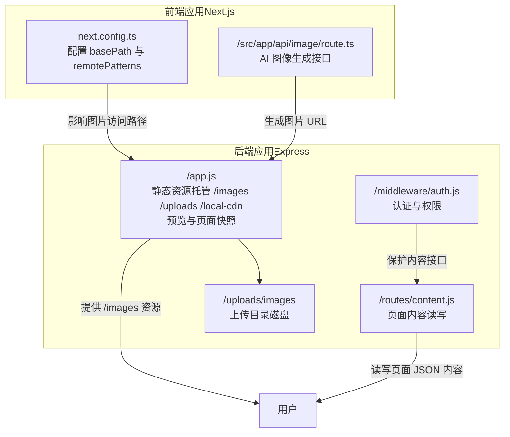
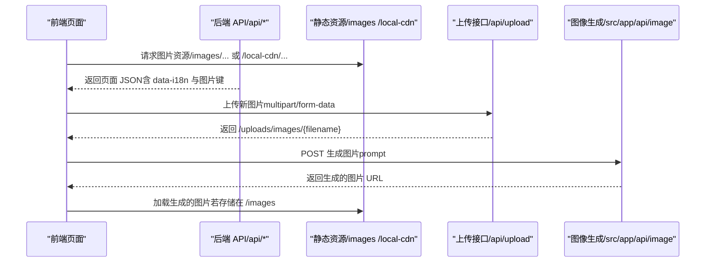
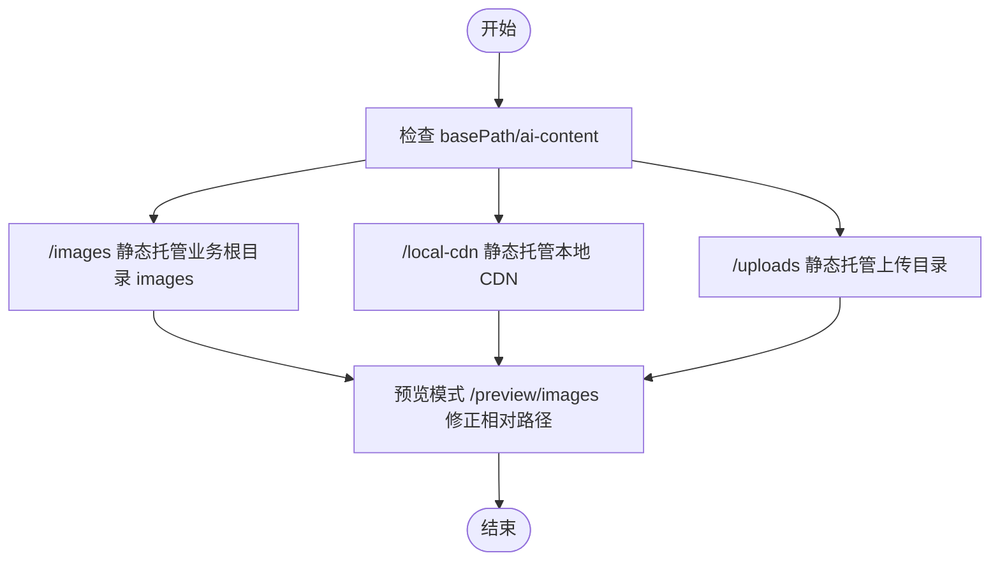
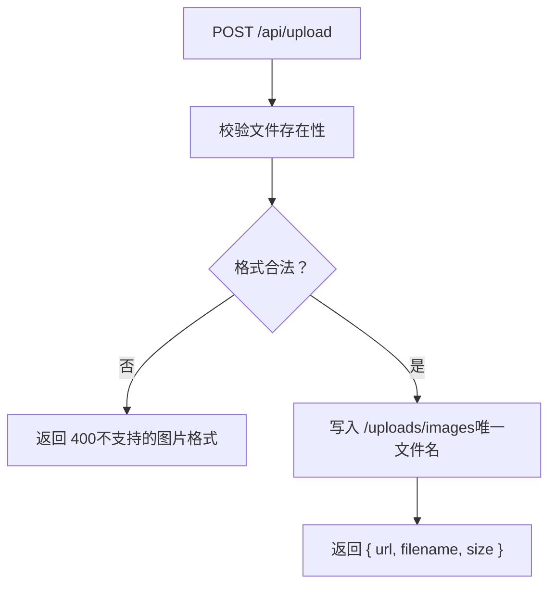
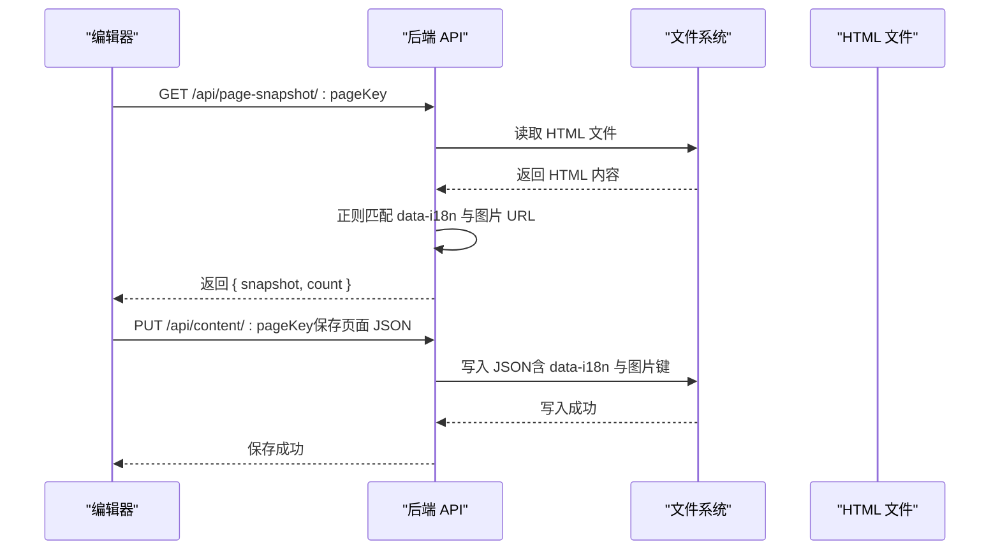
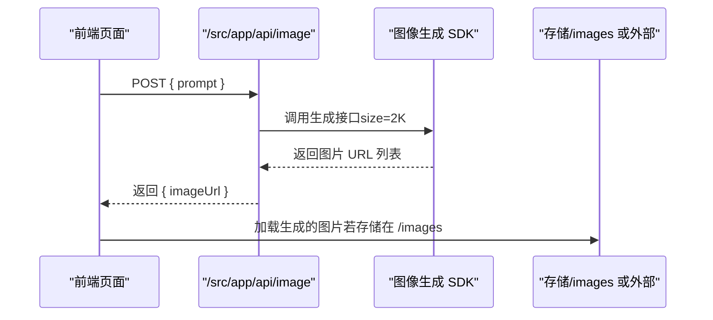
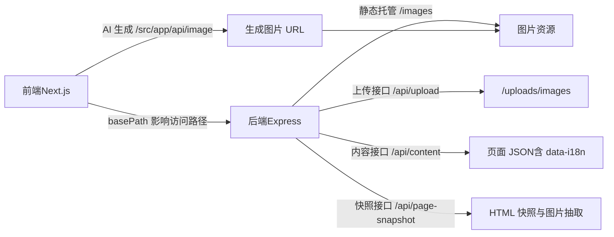

# 图片资源服务

<cite>
**本文引用的文件**
- [next.config.ts](file://ai-content-project/next.config.ts)
- [route.ts](file://ai-content-project/src/app/api/image/route.ts)
- [app.js](file://business-core/cms-server/app.js)
- [content.js](file://business-core/cms-server/routes/content.js)
- [auth.js](file://business-core/cms-server/middleware/auth.js)
- [add-image-i18n-safe.js](file://business-core/cms-server/add-image-i18n-safe.js)
- [prefill-from-html.js](file://business-core/cms-server/prefill-from-html.js)
</cite>

## 目录
1. [简介](#简介)
2. [项目结构](#项目结构)
3. [核心组件](#核心组件)
4. [架构总览](#架构总览)
5. [详细组件分析](#详细组件分析)
6. [依赖关系分析](#依赖关系分析)
7. [性能考量](#性能考量)
8. [故障排查指南](#故障排查指南)
9. [结论](#结论)
10. [附录](#附录)

## 简介
本文件面向“图片资源服务”的技术文档，聚焦于以下目标：
- 解释 /images 路径的静态文件托管配置与统一管理方式
- 说明图片资源的存储结构与访问路径（产品图、背景图、图标等）
- 阐述页面中图片资源的引用方式及与 data-i18n 标记系统的配合
- 介绍图片资源的缓存策略与压缩优化方案
- 提供图片资源管理的最佳实践与性能优化建议

## 项目结构
本仓库包含两部分与图片资源密切相关：
- 前端 Next.js 应用（ai-content-project）：负责图片资源的访问与基础配置
- 后端 Express 应用（business-core/cms-server）：负责图片上传、静态资源托管、数据模型与编辑流程

图表来源
- [next.config.ts:1-23](file://ai-content-project/next.config.ts#L1-L23)
- [route.ts:1-36](file://ai-content-project/src/app/api/image/route.ts#L1-L36)
- [app.js:55-62](file://business-core/cms-server/app.js#L55-L62)
- [content.js:48-65](file://business-core/cms-server/routes/content.js#L48-L65)
- [auth.js:20-35](file://business-core/cms-server/middleware/auth.js#L20-L35)

章节来源
- [next.config.ts:1-23](file://ai-content-project/next.config.ts#L1-L23)
- [app.js:55-62](file://business-core/cms-server/app.js#L55-L62)

## 核心组件
- 前端静态图片托管与访问
  - 通过 Express 静态托管 /images 与 /local-cdn，实现统一的图片访问路径
  - Next.js 的 basePath 影响前端构建产物的公共路径，间接影响图片引用
- 图片上传与存储
  - 使用 multer 将图片上传至 /uploads/images，并限制文件类型与大小
  - 返回 /uploads/images/{filename} 作为可访问的图片 URL
- 页面内容与图片引用
  - 页面 JSON 内容中保存 data-i18n 对应的图片 URL 或键值
  - 后端提供 /api/page-snapshot/:pageKey 用于抓取 HTML 中的 data-i18n 与图片资源
- 图片生成能力
  - 提供 /src/app/api/image/route.ts，对接图像生成服务，返回生成后的图片 URL

章节来源
- [app.js:24-53](file://business-core/cms-server/app.js#L24-L53)
- [app.js:55-62](file://business-core/cms-server/app.js#L55-L62)
- [route.ts:4-35](file://ai-content-project/src/app/api/image/route.ts#L4-L35)
- [content.js:48-65](file://business-core/cms-server/routes/content.js#L48-L65)

## 架构总览
图片资源服务的整体流程如下：
- 前端通过 /images 或 /local-cdn 访问静态图片
- 管理员上传图片至 /uploads/images，系统返回可访问 URL
- 页面 JSON 中记录 data-i18n 与图片键值；后端可从 HTML 快照中抽取图片 URL
- AI 图像生成接口返回新的图片 URL，供页面动态使用

图表来源
- [app.js:55-62](file://business-core/cms-server/app.js#L55-L62)
- [app.js:46-53](file://business-core/cms-server/app.js#L46-L53)
- [route.ts:4-35](file://ai-content-project/src/app/api/image/route.ts#L4-L35)

## 详细组件分析

### 组件一：静态图片托管与访问路径
- /images 静态托管
  - 后端通过 express.static 将 /images 映射到业务根目录下的 images 目录，使页面可通过 /images/xxx 引用
  - 预览模式下也提供 /preview/images 以保证相对路径资源可用
- /local-cdn 静态托管
  - 用于本地 CDN 资源的快速访问，避免跨域与路径问题
- /uploads 静态托管
  - 上传的图片位于 /uploads/images，通过 /uploads/images/{filename} 访问
- basePath 与路径影响
  - 前端 next.config.ts 设置 basePath 为 /ai-content，影响构建产物的公共路径前缀，需在页面中统一使用绝对路径或基于 basePath 的相对路径

图表来源
- [next.config.ts:4](file://ai-content-project/next.config.ts#L4)
- [app.js:55-62](file://business-core/cms-server/app.js#L55-L62)

章节来源
- [app.js:55-62](file://business-core/cms-server/app.js#L55-L62)
- [next.config.ts:4](file://ai-content-project/next.config.ts#L4)

### 组件二：图片上传与存储结构
- 上传接口
  - /api/upload 接收 multipart/form-data，使用 multer 存储到 /uploads/images
  - 文件名采用唯一规则（时间戳 + 随机串 + 扩展名），扩展名强制小写
  - 限制最大 5MB，允许格式：.jpg/.jpeg/.png/.gif/.webp/.svg
- 返回值
  - 成功时返回 { url, filename, size }，其中 url 为 /uploads/images/{filename}

图表来源
- [app.js:24-53](file://business-core/cms-server/app.js#L24-L53)

章节来源
- [app.js:24-53](file://business-core/cms-server/app.js#L24-L53)

### 组件三：页面内容与 data-i18n 标记系统
- 页面 JSON 结构
  - 页面内容通过 /api/content/:pageKey 读取与写入，JSON 中包含 data-i18n 对应的键值
- HTML 快照与图片抽取
  - /api/page-snapshot/:pageKey 从 HTML 中抽取：
    - 文本元素的 data-i18n 值
    -  的 data-i18n 与 src
    - 背景图（background-image:url(...)) 的 data-i18n 与 URL
  - 该机制用于编辑器首次回显默认值与统一管理图片资源
- data-i18n 属性的自动添加
  - 提供脚本安全地为  添加 data-i18n 属性，不修改文本内容，仅在缺失时追加

图表来源
- [app.js:233-299](file://business-core/cms-server/app.js#L233-L299)
- [content.js:48-65](file://business-core/cms-server/routes/content.js#L48-L65)

章节来源
- [app.js:233-299](file://business-core/cms-server/app.js#L233-L299)
- [content.js:48-65](file://business-core/cms-server/routes/content.js#L48-L65)
- [add-image-i18n-safe.js:20-67](file://business-core/cms-server/add-image-i18n-safe.js#L20-L67)
- [prefill-from-html.js:19-54](file://business-core/cms-server/prefill-from-html.js#L19-L54)

### 组件四：AI 图像生成与图片引用
- 接口定义
  - POST /src/app/api/image（在前端 Next.js 应用中）接收 { prompt }，返回生成的图片 URL
- 使用场景
  - 页面动态生成图片（如根据文案生成宣传图），并将 URL 写入页面 JSON 或直接渲染

图表来源
- [route.ts:4-35](file://ai-content-project/src/app/api/image/route.ts#L4-L35)

章节来源
- [route.ts:4-35](file://ai-content-project/src/app/api/image/route.ts#L4-L35)

## 依赖关系分析
- 前端与后端的耦合点
  - 前端 basePath 与后端静态托管路径共同决定图片访问 URL
  - 页面 JSON 与 data-i18n 键值决定图片资源的统一管理
- 关键依赖
  - Express 静态托管：/images、/local-cdn、/uploads
  - multer：上传与命名
  - JWT 认证：保护内容接口
  - 正则抽取：从 HTML 中提取 data-i18n 与图片 URL

图表来源
- [next.config.ts:4](file://ai-content-project/next.config.ts#L4)
- [app.js:55-62](file://business-core/cms-server/app.js#L55-L62)
- [app.js:46-53](file://business-core/cms-server/app.js#L46-L53)
- [content.js:48-65](file://business-core/cms-server/routes/content.js#L48-L65)
- [app.js:233-299](file://business-core/cms-server/app.js#L233-L299)
- [route.ts:4-35](file://ai-content-project/src/app/api/image/route.ts#L4-L35)

章节来源
- [next.config.ts:4](file://ai-content-project/next.config.ts#L4)
- [app.js:55-62](file://business-core/cms-server/app.js#L55-L62)
- [app.js:46-53](file://business-core/cms-server/app.js#L46-L53)
- [content.js:48-65](file://business-core/cms-server/routes/content.js#L48-L65)
- [app.js:233-299](file://business-core/cms-server/app.js#L233-L299)
- [route.ts:4-35](file://ai-content-project/src/app/api/image/route.ts#L4-L35)

## 性能考量
- 缓存策略
  - 预览客户端 JS（/preview-client-v2.js、/preview-client-v4.js）明确设置 no-cache、no-store、must-revalidate，确保预览环境的资源即时生效
  - 对于生产环境的图片资源，建议结合 CDN 与合理的 Cache-Control 头部进行缓存
- 压缩与优化
  - 上传限制为 5MB，建议在上传前进行格式与尺寸的预检，减少无效传输
  - 对于背景图与图标，优先使用现代格式（如 WebP）并在多分辨率下提供合适尺寸
- 路径与体积
  - 使用 basePath 与静态托管统一路径，避免重复下载与路径冲突
  - 对大图采用懒加载与占位符策略，提升首屏性能

## 故障排查指南
- 无法访问 /images 或 /local-cdn
  - 检查后端静态托管是否启用（/images、/local-cdn、/preview/images）
  - 确认 basePath 与前端构建产物路径一致
- 上传失败或返回 400
  - 检查文件类型是否在允许列表（.jpg/.jpeg/.png/.gif/.webp/.svg）
  - 检查文件大小是否超过 5MB
- 页面图片未显示或 data-i18n 未生效
  - 确认 HTML 中是否已添加 data-i18n 属性
  - 使用 /api/page-snapshot/:pageKey 校验抽取结果
- 预览页面资源路径异常
  - 检查预览模式下对 local-cdn 与 images 的相对路径修复逻辑

章节来源
- [app.js:55-62](file://business-core/cms-server/app.js#L55-L62)
- [app.js:24-53](file://business-core/cms-server/app.js#L24-L53)
- [app.js:233-299](file://business-core/cms-server/app.js#L233-L299)

## 结论
本图片资源服务通过“统一静态托管 + 数据驱动的 data-i18n + 上传与生成接口”实现了网站图片资源的规范化管理。结合 basePath 与静态托管路径，可确保不同环境下的一致访问；借助页面 JSON 与快照抽取，能够将图片资源纳入统一的数据流；AI 生成能力进一步增强了动态图片的生产能力。建议在生产环境中引入 CDN 与缓存策略，并持续优化图片格式与尺寸，以获得最佳的用户体验与性能表现。

## 附录
- 最佳实践清单
  - 统一使用 /images 与 /local-cdn 作为图片访问前缀
  - 为所有  添加 data-i18n 属性，避免硬编码图片 URL
  - 上传前进行格式与尺寸校验，减少无效资源
  - 对大图采用懒加载与多分辨率适配
  - 生产环境启用 CDN 并设置合理的缓存头
  - 使用 AI 生成接口时，将生成的 URL 写入页面 JSON，便于统一管理与回显