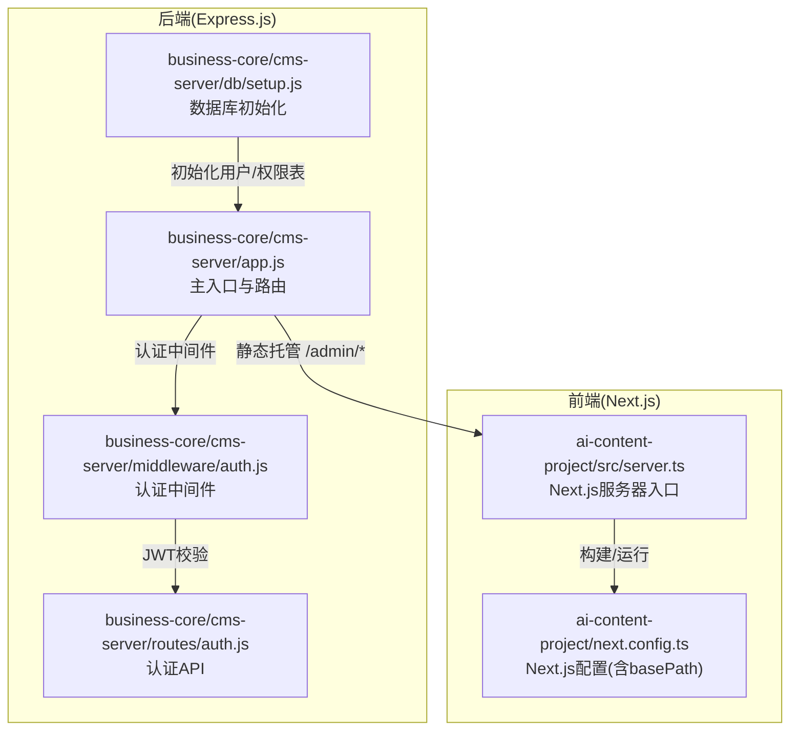
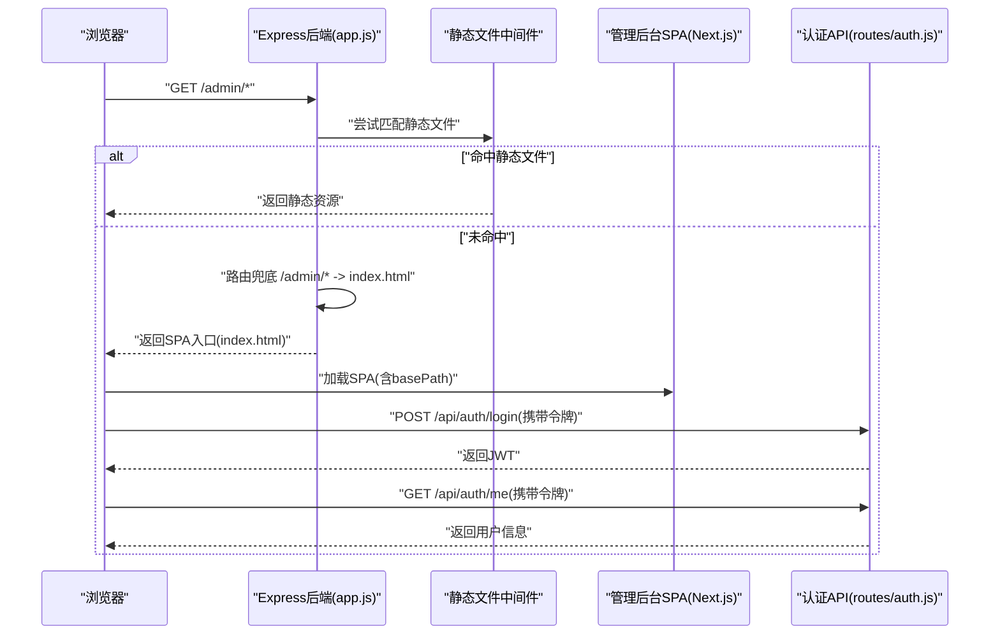
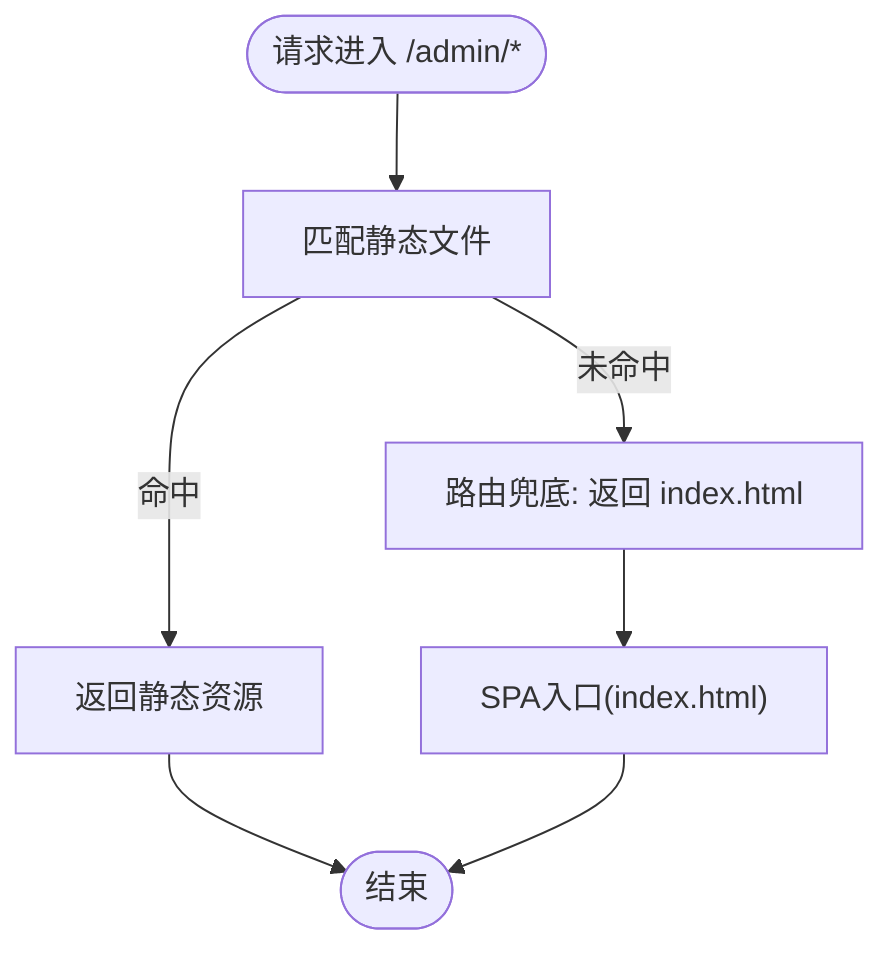
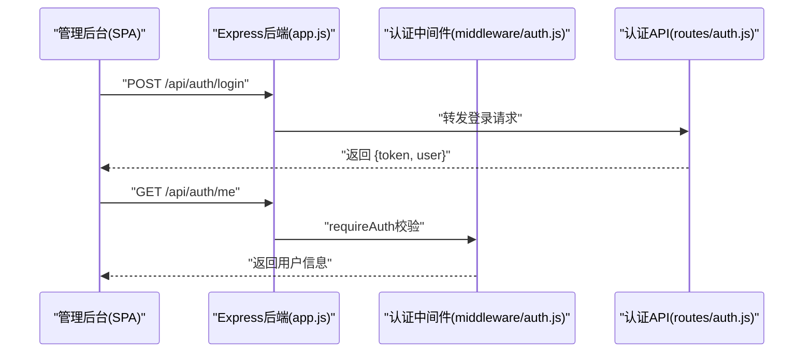
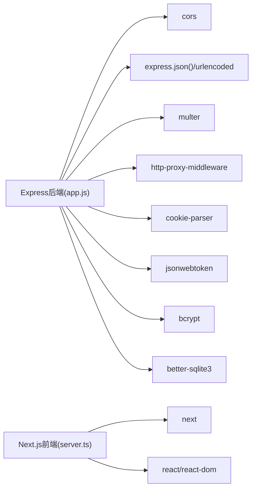

# 管理后台SPA托管

<cite>
**本文档引用的文件**
- [ai-content-project/src/server.ts](file://ai-content-project/src/server.ts)
- [business-core/cms-server/app.js](file://business-core/cms-server/app.js)
- [business-core/cms-server/middleware/auth.js](file://business-core/cms-server/middleware/auth.js)
- [business-core/cms-server/routes/auth.js](file://business-core/cms-server/routes/auth.js)
- [business-core/cms-server/db/setup.js](file://business-core/cms-server/db/setup.js)
- [ai-content-project/next.config.ts](file://ai-content-project/next.config.ts)
- [business-core/cms-server/package.json](file://business-core/cms-server/package.json)
</cite>

## 目录
1. [简介](#简介)
2. [项目结构](#项目结构)
3. [核心组件](#核心组件)
4. [架构总览](#架构总览)
5. [详细组件分析](#详细组件分析)
6. [依赖关系分析](#依赖关系分析)
7. [性能考虑](#性能考虑)
8. [故障排除指南](#故障排除指南)
9. [结论](#结论)
10. [附录](#附录)

## 简介
本文件面向管理后台SPA托管服务的技术文档，重点围绕/admin路径的静态文件托管配置、Express.js静态文件中间件的使用方式、管理后台SPA的文件结构组织（以index.html作为入口）、路由兜底机制（当访问/admin/*路径时自动返回index.html）、以及管理后台与后端API的交互方式（认证令牌传递与跨域处理）。同时提供实际配置示例与部署注意事项，帮助开发者快速理解与维护该系统。

## 项目结构
本仓库包含两个主要部分：
- ai-content-project：基于Next.js的前端应用，负责管理后台SPA的构建与运行。
- business-core/cms-server：基于Express.js的后端服务，提供API、静态资源托管、认证与路由兜底等能力。

图表来源
- [ai-content-project/src/server.ts:1-36](file://ai-content-project/src/server.ts#L1-L36)
- [ai-content-project/next.config.ts:1-23](file://ai-content-project/next.config.ts#L1-L23)
- [business-core/cms-server/app.js:1-315](file://business-core/cms-server/app.js#L1-L315)
- [business-core/cms-server/middleware/auth.js:1-86](file://business-core/cms-server/middleware/auth.js#L1-L86)
- [business-core/cms-server/routes/auth.js:1-99](file://business-core/cms-server/routes/auth.js#L1-L99)
- [business-core/cms-server/db/setup.js:1-115](file://business-core/cms-server/db/setup.js#L1-L115)

章节来源
- [ai-content-project/src/server.ts:1-36](file://ai-content-project/src/server.ts#L1-L36)
- [business-core/cms-server/app.js:1-315](file://business-core/cms-server/app.js#L1-L315)

## 核心组件
- Express.js后端服务：负责静态文件托管、API路由、认证中间件、路由兜底与跨域处理。
- Next.js前端服务：负责管理后台SPA的构建与运行，通过basePath进行路径前缀隔离。
- 认证体系：基于JWT的认证中间件与API，支持多种令牌来源（Authorization头、URL参数、Cookie）。
- 数据库初始化：SQLite数据库初始化脚本，创建用户、权限与审计日志表，并插入默认超级管理员。

章节来源
- [business-core/cms-server/app.js:1-315](file://business-core/cms-server/app.js#L1-L315)
- [business-core/cms-server/middleware/auth.js:1-86](file://business-core/cms-server/middleware/auth.js#L1-L86)
- [business-core/cms-server/routes/auth.js:1-99](file://business-core/cms-server/routes/auth.js#L1-L99)
- [business-core/cms-server/db/setup.js:1-115](file://business-core/cms-server/db/setup.js#L1-L115)
- [ai-content-project/next.config.ts:1-23](file://ai-content-project/next.config.ts#L1-L23)

## 架构总览
管理后台SPA托管的整体流程如下：
- 浏览器访问/admin/*路径，Express.js后端优先匹配静态文件；若未命中，则执行/admin/*的路由兜底规则，返回SPA的入口文件index.html。
- SPA在浏览器端通过Next.js运行，其basePath设置为/admin，确保资源与API请求均带/admin前缀。
- SPA与后端API交互时，携带认证令牌（支持Authorization头、URL参数、Cookie），后端通过认证中间件进行校验。
- CORS中间件允许跨域请求，满足前后端分离场景。

图表来源
- [business-core/cms-server/app.js:55-62](file://business-core/cms-server/app.js#L55-L62)
- [business-core/cms-server/app.js:227-230](file://business-core/cms-server/app.js#L227-L230)
- [business-core/cms-server/routes/auth.js:22-66](file://business-core/cms-server/routes/auth.js#L22-L66)
- [business-core/cms-server/middleware/auth.js:20-35](file://business-core/cms-server/middleware/auth.js#L20-L35)

## 详细组件分析

### Express.js静态文件托管与/admin路径配置
- 静态文件托管：使用Express的静态文件中间件将/admin映射到本地admin目录，使前端构建产物可被直接访问。
- 路由兜底：当/admin/*未匹配到具体静态文件时，Express后端通过通配符路由兜底，返回SPA入口文件index.html，从而支持前端路由（如history模式）。
- 根路径重定向：根路径/重定向至/admin/，便于用户直接访问管理后台。

图表来源
- [business-core/cms-server/app.js:55-62](file://business-core/cms-server/app.js#L55-L62)
- [business-core/cms-server/app.js:227-230](file://business-core/cms-server/app.js#L227-L230)
- [business-core/cms-server/app.js:300-303](file://business-core/cms-server/app.js#L300-L303)

章节来源
- [business-core/cms-server/app.js:55-62](file://business-core/cms-server/app.js#L55-L62)
- [business-core/cms-server/app.js:227-230](file://business-core/cms-server/app.js#L227-L230)
- [business-core/cms-server/app.js:300-303](file://business-core/cms-server/app.js#L300-L303)

### 管理后台SPA文件结构与入口文件index.html
- SPA入口：/admin/index.html作为管理后台的入口文件，由路由兜底机制统一返回，确保前端路由正常工作。
- 资源组织：静态资源（JS/CSS/媒体文件）位于admin目录下，Express静态中间件按路径分发。
- 路由支持：前端路由采用history模式，需要后端兜底返回index.html以避免刷新后404。

章节来源
- [business-core/cms-server/app.js:227-230](file://business-core/cms-server/app.js#L227-L230)

### 路由兜底机制实现原理
- 通配符匹配：/admin/*路由兜底，确保任何/admin/*路径最终返回index.html。
- 入口文件定位：通过res.sendFile指向/admin/index.html，保证SPA正确加载。
- 与静态中间件协作：静态中间件优先匹配，未命中才进入兜底逻辑，避免覆盖静态资源。

章节来源
- [business-core/cms-server/app.js:227-230](file://business-core/cms-server/app.js#L227-L230)

### 管理后台与后端API交互方式
- 认证令牌传递：
  - Authorization头：Bearer <token>，最常用方式。
  - URL参数：/api/xxx?token=<jwt>，适用于iframe嵌入等场景。
  - Cookie：cms_token，用于Next.js自身回传。
- 认证中间件：requireAuth对JWT进行校验，并将用户信息注入req.user。
- 跨域处理：启用CORS中间件，允许前端与后端跨域通信。
- API示例：
  - 登录：POST /api/auth/login，返回JWT与用户信息。
  - 用户信息：GET /api/auth/me，验证令牌并返回用户详情。

图表来源
- [business-core/cms-server/routes/auth.js:22-66](file://business-core/cms-server/routes/auth.js#L22-L66)
- [business-core/cms-server/middleware/auth.js:20-35](file://business-core/cms-server/middleware/auth.js#L20-L35)
- [business-core/cms-server/app.js:155-161](file://business-core/cms-server/app.js#L155-L161)

章节来源
- [business-core/cms-server/routes/auth.js:1-99](file://business-core/cms-server/routes/auth.js#L1-L99)
- [business-core/cms-server/middleware/auth.js:1-86](file://business-core/cms-server/middleware/auth.js#L1-L86)
- [business-core/cms-server/app.js:155-161](file://business-core/cms-server/app.js#L155-L161)

### Next.js服务器与basePath配置
- 服务器入口：Next.js通过自定义HTTP服务器启动，结合解析URL的逻辑处理请求。
- basePath配置：Next.js配置中设置basePath为/admin，确保所有路由与静态资源请求带有/admin前缀，与后端路由保持一致。

章节来源
- [ai-content-project/src/server.ts:1-36](file://ai-content-project/src/server.ts#L1-L36)
- [ai-content-project/next.config.ts:3-10](file://ai-content-project/next.config.ts#L3-L10)

### 数据库初始化与默认账户
- 初始化脚本：创建users、page_permissions、audit_log等表，并插入默认超级管理员账户admin/admin123。
- 权限分配：超级管理员拥有所有页面编辑权限，便于首次部署后的快速配置。

章节来源
- [business-core/cms-server/db/setup.js:14-108](file://business-core/cms-server/db/setup.js#L14-L108)

## 依赖关系分析
- Express后端依赖：
  - cors：跨域支持。
  - express/json/urlencoded：解析JSON与表单数据。
  - multer：文件上传处理。
  - http-proxy-middleware：AI内容生成代理。
  - cookie-parser：解析Cookie。
  - jsonwebtoken：JWT签名与校验。
  - bcrypt：密码哈希。
  - better-sqlite3：SQLite数据库访问。
- Next.js前端依赖：
  - next：框架核心。
  - react/react-dom：UI基础。
  - 多个UI组件库与工具库（详见package.json）。

图表来源
- [business-core/cms-server/package.json:10-20](file://business-core/cms-server/package.json#L10-L20)
- [ai-content-project/package.json:15-76](file://ai-content-project/package.json#L15-L76)

章节来源
- [business-core/cms-server/package.json:1-22](file://business-core/cms-server/package.json#L1-L22)
- [ai-content-project/package.json:1-100](file://ai-content-project/package.json#L1-L100)

## 性能考虑
- 静态资源缓存：生产环境建议为/admin/*静态资源设置合适的Cache-Control策略，减少带宽消耗。
- 路由兜底优化：确保/admin/*未命中静态文件时才进入兜底，避免不必要的文件系统读取。
- API响应优化：合理限制请求体大小（已设置为10MB），并为大文件上传设置合理的超时与并发限制。
- 数据库连接：使用连接池或按需打开/关闭数据库连接，避免长连接导致资源泄漏。

## 故障排除指南
- 访问/admin/*返回404：
  - 检查/admin目录是否存在构建产物（index.html与静态资源）。
  - 确认Express静态中间件路径映射是否正确。
- 刷新页面后路由异常：
  - 确认/admin/*路由兜底已生效，返回index.html。
- 认证失败：
  - 检查Authorization头、URL参数或Cookie中的令牌格式与有效期。
  - 确认JWT_SECRET一致且未泄露。
- CORS问题：
  - 确认CORS中间件已启用，且前端请求域名在允许范围内。
- 数据库初始化失败：
  - 检查SQLite文件权限与路径，确认数据库初始化脚本执行成功。

章节来源
- [business-core/cms-server/app.js:55-62](file://business-core/cms-server/app.js#L55-L62)
- [business-core/cms-server/app.js:227-230](file://business-core/cms-server/app.js#L227-L230)
- [business-core/cms-server/middleware/auth.js:20-35](file://business-core/cms-server/middleware/auth.js#L20-L35)
- [business-core/cms-server/db/setup.js:14-108](file://business-core/cms-server/db/setup.js#L14-L108)

## 结论
本方案通过Express.js的静态文件托管与路由兜底机制，配合Next.js的basePath配置，实现了管理后台SPA的稳定托管。认证体系支持多种令牌传递方式，结合CORS与中间件校验，保障了前后端交互的安全与可靠。建议在生产环境中进一步完善缓存策略、安全加固与监控告警，以提升整体稳定性与用户体验。

## 附录

### 实际配置示例（路径参考）
- Express静态托管与路由兜底
  - 参考路径：[business-core/cms-server/app.js:55-62](file://business-core/cms-server/app.js#L55-L62)
  - 参考路径：[business-core/cms-server/app.js:227-230](file://business-core/cms-server/app.js#L227-L230)
- Next.js basePath配置
  - 参考路径：[ai-content-project/next.config.ts:3-10](file://ai-content-project/next.config.ts#L3-L10)
- 认证中间件与API
  - 参考路径：[business-core/cms-server/middleware/auth.js:20-35](file://business-core/cms-server/middleware/auth.js#L20-L35)
  - 参考路径：[business-core/cms-server/routes/auth.js:22-66](file://business-core/cms-server/routes/auth.js#L22-L66)
- 数据库初始化
  - 参考路径：[business-core/cms-server/db/setup.js:72-108](file://business-core/cms-server/db/setup.js#L72-L108)

### 部署注意事项
- 确保/admin目录包含完整的构建产物（index.html与静态资源）。
- 设置JWT_SECRET环境变量，避免使用默认值。
- 在生产环境启用HTTPS与严格的CORS策略。
- 对上传接口设置合理的文件类型与大小限制。
- 定期备份数据库，确保数据安全。