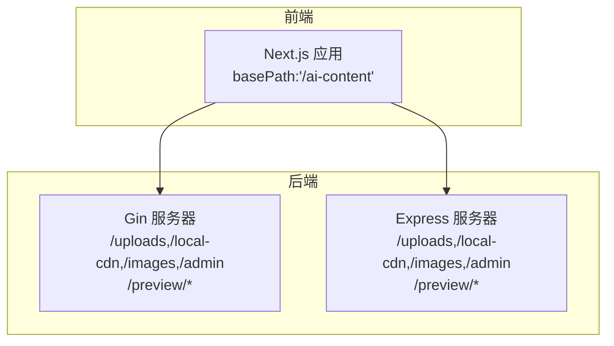
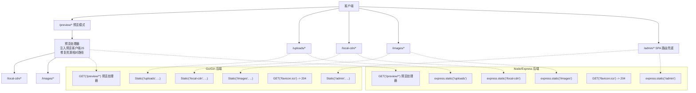
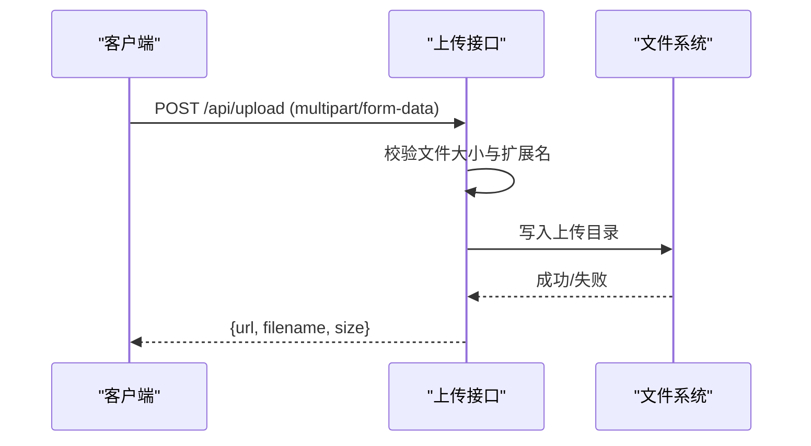
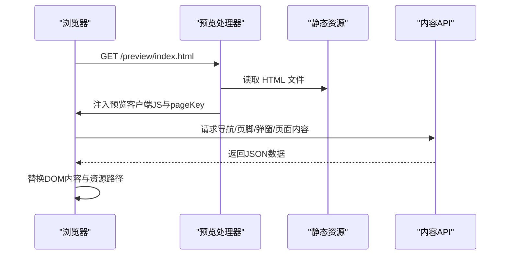
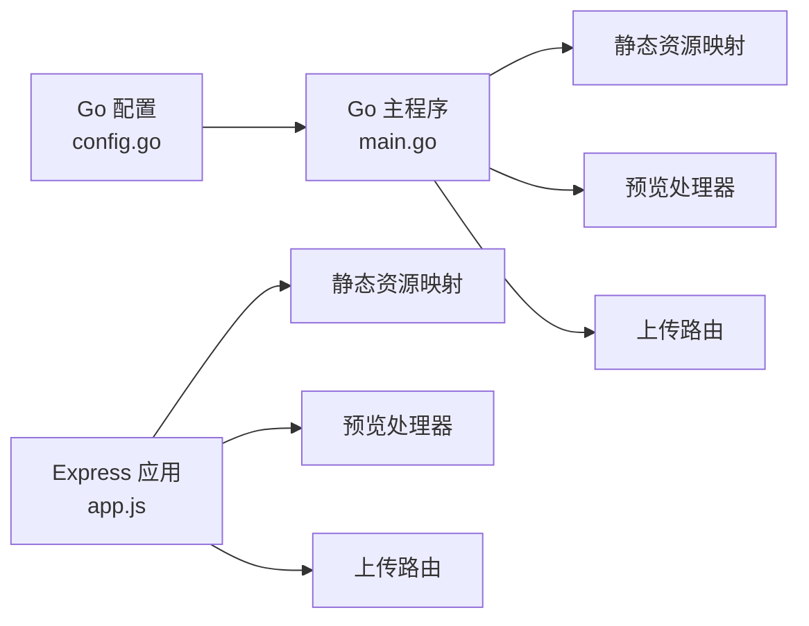

# 静态资源服务

<cite>
**本文引用的文件**
- [next.config.ts](file://ai-content-project/next.config.ts)
- [server.ts](file://ai-content-project/src/server.ts)
- [app.js](file://business-core/cms-server/app.js)
- [main.go](file://business-core/cms-server-go/main.go)
- [config.go](file://business-core/cms-server-go/config/config.go)
- [upload.go](file://business-core/cms-server-go/routes/upload.go)
- [preview-client.js](file://business-core/cms-server/preview-client.js)
</cite>

## 目录
1. [简介](#简介)
2. [项目结构](#项目结构)
3. [核心组件](#核心组件)
4. [架构总览](#架构总览)
5. [详细组件分析](#详细组件分析)
6. [依赖分析](#依赖分析)
7. [性能考虑](#性能考虑)
8. [故障排查指南](#故障排查指南)
9. [结论](#结论)
10. [附录](#附录)

## 简介
本技术文档围绕静态资源服务展开，系统性说明静态文件托管配置与路径映射规则，涵盖管理后台 SPA 托管、上传文件服务、本地 CDN 资源管理、图片资源服务，以及预览模式下的特殊静态资源处理（含 /preview/images 与 /preview/local-cdn）。同时解释 favicon.ico 的静默处理机制与缓存控制策略，并提供可操作的配置示例与最佳实践建议。

## 项目结构
本仓库包含两套后端实现与一套前端 Next.js 应用：
- Go/Gin 后端：负责静态资源托管、上传接口、预览模式、CORS、JWT 认证与反向代理。
- Node/Express 后端：负责静态资源托管、上传接口、预览模式、SPA 路由兜底与缓存策略。
- Next.js 应用：通过 basePath 限定路由前缀，配合后端统一暴露静态资源与 API。

图表来源
- [next.config.ts:1-23](file://ai-content-project/next.config.ts#L1-L23)
- [main.go:51-71](file://business-core/cms-server-go/main.go#L51-L71)
- [app.js:55-62](file://business-core/cms-server/app.js#L55-L62)

章节来源
- [next.config.ts:1-23](file://ai-content-project/next.config.ts#L1-L23)
- [server.ts:1-36](file://ai-content-project/src/server.ts#L1-L36)
- [main.go:51-71](file://business-core/cms-server-go/main.go#L51-L71)
- [app.js:55-62](file://business-core/cms-server/app.js#L55-L62)

## 核心组件
- 静态资源托管层：分别由 Go/Gin 与 Node/Express 提供 /uploads、/local-cdn、/images、/admin 与 /preview/* 的静态资源服务。
- 上传服务：接收前端上传的图片文件，进行格式校验与命名，返回可访问的静态资源 URL。
- 预览模式：将官网前端 HTML 注入预览客户端 JS 并修复资源相对路径，确保预览时资源与页面正确关联。
- 缓存控制：针对预览客户端 JS 与预览页面采用禁用缓存策略；favicon.ico 返回 204 静默处理避免 404 控制台告警。
- 路由兜底：管理后台 SPA 路由兜底至 index.html，保证前端路由刷新可用。

章节来源
- [main.go:51-71](file://business-core/cms-server-go/main.go#L51-L71)
- [app.js:55-62](file://business-core/cms-server/app.js#L55-L62)
- [upload.go:27-75](file://business-core/cms-server-go/routes/upload.go#L27-L75)
- [preview-client.js:1-308](file://business-core/cms-server/preview-client.js#L1-L308)

## 架构总览
下图展示了静态资源服务在不同后端中的路径映射与处理流程：

图表来源
- [main.go:51-71](file://business-core/cms-server-go/main.go#L51-L71)
- [main.go:146-207](file://business-core/cms-server-go/main.go#L146-L207)
- [app.js:55-62](file://business-core/cms-server/app.js#L55-L62)
- [app.js:104-153](file://business-core/cms-server/app.js#L104-L153)

## 详细组件分析

### 路径映射与静态资源托管
- Go/Gin 后端
  - /uploads 对应上传目录，用于访问已上传图片。
  - /local-cdn 对应本地 CDN 资源目录，提供静态资源分发。
  - /images 对应图片资源目录，用于托管站点图片。
  - /admin 对应管理后台构建产物目录，提供 SPA 路由兜底。
  - /preview/images 与 /preview/local-cdn 用于预览模式下直接访问资源。
- Node/Express 后端
  - /uploads、/local-cdn、/images、/admin 与 Go/Gin 后端一致。
  - /preview/images 与 /preview/local-cdn 用于预览模式资源访问。

章节来源
- [main.go:51-58](file://business-core/cms-server-go/main.go#L51-L58)
- [app.js:55-62](file://business-core/cms-server/app.js#L55-L62)

### 上传文件服务
- Go/Gin 实现
  - 路由注册：POST /api/upload。
  - 校验：文件大小上限、扩展名白名单（.jpg/.jpeg/.png/.gif/.webp/.svg）。
  - 存储：生成唯一文件名并写入配置的上传目录。
  - 返回：JSON 包含 URL、文件名与大小。
- Node/Express 实现
  - 使用 multer 存储到 ../uploads/images。
  - 校验：同上。
  - 返回：JSON 包含 /uploads/images/{filename}。

图表来源
- [upload.go:27-75](file://business-core/cms-server-go/routes/upload.go#L27-L75)
- [app.js:46-53](file://business-core/cms-server/app.js#L46-L53)

章节来源
- [upload.go:27-75](file://business-core/cms-server-go/routes/upload.go#L27-L75)
- [app.js:46-53](file://business-core/cms-server/app.js#L46-L53)

### 预览模式下的静态资源处理
- Go/Gin 实现
  - /preview/*：读取项目根目录下的 HTML 文件，注入预览客户端 JS（/preview-client-v4.js），修复资源相对路径（local-cdn/images）为绝对路径。
  - 预览客户端 JS：禁用缓存，注入 window.CMS_PREVIEW 与 pageKey，拦截业务侧国际化函数，按 data-i18n 键替换页面内容。
- Node/Express 实现
  - 类似逻辑：读取 HTML、注入预览客户端 JS、修复资源路径、禁用缓存。
  - /preview-client-v2.js 与 /preview-client-v4.js：均禁用缓存，确保每次加载最新版本。

图表来源
- [main.go:146-207](file://business-core/cms-server-go/main.go#L146-L207)
- [preview-client.js:1-308](file://business-core/cms-server/preview-client.js#L1-L308)

章节来源
- [main.go:146-207](file://business-core/cms-server-go/main.go#L146-L207)
- [app.js:104-153](file://business-core/cms-server/app.js#L104-L153)
- [preview-client.js:1-308](file://business-core/cms-server/preview-client.js#L1-L308)

### favicon.ico 的静默处理与缓存控制
- Go/Gin：GET /favicon.ico 返回 204 No Content，避免浏览器控制台 404。
- Node/Express：GET /favicon.ico 返回 204 No Content。
- 预览客户端 JS：明确设置 no-cache、no-store、must-revalidate，禁止缓存。
- 预览页面：设置 Content-Type 与禁用缓存头部，确保每次加载最新 HTML。

章节来源
- [main.go:60-63](file://business-core/cms-server-go/main.go#L60-L63)
- [app.js:64-65](file://business-core/cms-server/app.js#L64-L65)
- [main.go:131-144](file://business-core/cms-server-go/main.go#L131-L144)
- [app.js:72-82](file://business-core/cms-server/app.js#L72-L82)
- [app.js:145-151](file://business-core/cms-server/app.js#L145-L151)

### 管理后台 SPA 路由兜底
- Go/Gin：NoRoute 对 /admin/* 返回 index.html，实现前端路由刷新可用。
- Node/Express：GET /admin/* 返回 index.html。

章节来源
- [main.go:89-97](file://business-core/cms-server-go/main.go#L89-L97)
- [app.js:227-230](file://business-core/cms-server/app.js#L227-L230)

### 路由前缀与 Next.js 集成
- Next.js 通过 basePath:'/ai-content' 统一前缀，确保前端路由与后端静态资源前缀一致，避免跨域与路径不匹配问题。

章节来源
- [next.config.ts:4](file://ai-content-project/next.config.ts#L4)

## 依赖分析
- Go/Gin 后端依赖 Gin、JWT、CORS、反向代理等模块，静态资源托管通过 r.Static 与 r.NoRoute 实现。
- Node/Express 后端依赖 cors、multer、fs、path 等模块，静态资源托管通过 express.static 与自定义中间件实现。
- 两者均提供 /uploads、/local-cdn、/images、/admin 与 /preview/* 的静态资源服务，满足管理后台与预览模式需求。

图表来源
- [config.go:26-57](file://business-core/cms-server-go/config/config.go#L26-L57)
- [main.go:51-114](file://business-core/cms-server-go/main.go#L51-L114)
- [app.js:55-162](file://business-core/cms-server/app.js#L55-L162)

章节来源
- [config.go:26-57](file://business-core/cms-server-go/config/config.go#L26-L57)
- [main.go:51-114](file://business-core/cms-server-go/main.go#L51-L114)
- [app.js:55-162](file://business-core/cms-server/app.js#L55-L162)

## 性能考虑
- 静态资源缓存：生产环境建议对 /uploads、/local-cdn、/images 下的静态资源启用强缓存（如 ETag/Last-Modified），结合文件指纹命名提升缓存命中率。
- 预览模式缓存：预览页面与预览客户端 JS 已禁用缓存，确保编辑体验，但会增加带宽与延迟，适合开发阶段使用。
- 上传文件命名：采用时间戳+随机串命名，避免冲突且便于清理。
- CORS 与安全：生产环境建议限制 Access-Control-Allow-Origin 与允许的方法/头，减少跨域风险。

## 故障排查指南
- 预览页面 404：确认 /preview/* 对应的 HTML 文件是否存在，检查预览处理器是否正确读取项目根目录。
- 静态资源 404：确认 /uploads、/local-cdn、/images、/admin 的物理路径与权限，检查后端静态资源映射是否正确。
- favicon 控制台告警：确认 /favicon.ico 是否返回 204，若仍报错，检查浏览器缓存或代理层拦截。
- 上传失败：检查文件大小与扩展名限制，确认上传目录可写，查看后端日志输出。
- SPA 刷新 404：确认 /admin/* 是否命中 NoRoute 或路由兜底逻辑，确保 index.html 可访问。

章节来源
- [main.go:146-207](file://business-core/cms-server-go/main.go#L146-L207)
- [app.js:104-153](file://business-core/cms-server/app.js#L104-L153)
- [upload.go:27-75](file://business-core/cms-server-go/routes/upload.go#L27-L75)

## 结论
本静态资源服务通过 Go/Gin 与 Node/Express 双栈实现，统一了管理后台 SPA、上传文件、本地 CDN 与图片资源的托管，并在预览模式下提供稳定的资源访问与内容注入能力。结合禁用缓存的预览策略与 204 处理 favicon 的细节，整体方案兼顾开发效率与用户体验。生产部署时建议优化静态资源缓存策略与 CORS 安全配置。

## 附录

### 路径映射清单
- /admin：管理后台 SPA 路由兜底（Go/Gin 与 Node/Express 均支持）
- /uploads：上传文件访问（Go/Gin 与 Node/Express 均支持）
- /local-cdn：本地 CDN 资源访问（Go/Gin 与 Node/Express 均支持）
- /images：图片资源访问（Go/Gin 与 Node/Express 均支持）
- /preview/images：预览模式图片资源访问（Go/Gin 与 Node/Express 均支持）
- /preview/local-cdn：预览模式本地 CDN 资源访问（Go/Gin 与 Node/Express 均支持）

章节来源
- [main.go:51-58](file://business-core/cms-server-go/main.go#L51-L58)
- [app.js:55-62](file://business-core/cms-server/app.js#L55-L62)

### 预览客户端 JS 缓存策略
- /preview-client-v2.js 与 /preview-client-v4.js：设置 no-cache、no-store、must-revalidate，确保每次加载最新版本。
- 预览页面：设置 Content-Type 与禁用缓存头部，避免浏览器缓存导致内容陈旧。

章节来源
- [main.go:131-144](file://business-core/cms-server-go/main.go#L131-L144)
- [app.js:72-82](file://business-core/cms-server/app.js#L72-L82)
- [app.js:145-151](file://business-core/cms-server/app.js#L145-L151)

### 最佳实践建议
- 生产环境：对 /uploads、/local-cdn、/images 启用强缓存与 ETag，结合文件指纹命名。
- 预览模式：保留禁用缓存策略，确保编辑体验；发布后关闭预览模式或限制访问范围。
- CORS：生产环境限制允许来源与方法，避免跨域风险。
- 日志与监控：记录静态资源访问异常与上传失败原因，便于快速定位问题。
- 路由一致性：前端 basePath 与后端静态资源前缀保持一致，避免路径不匹配。