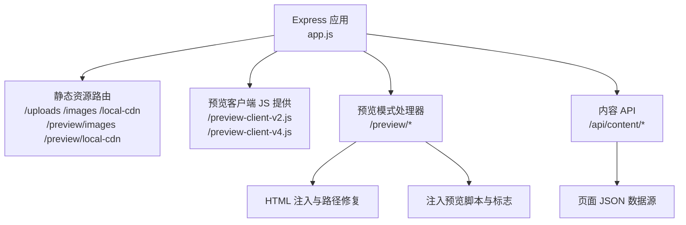
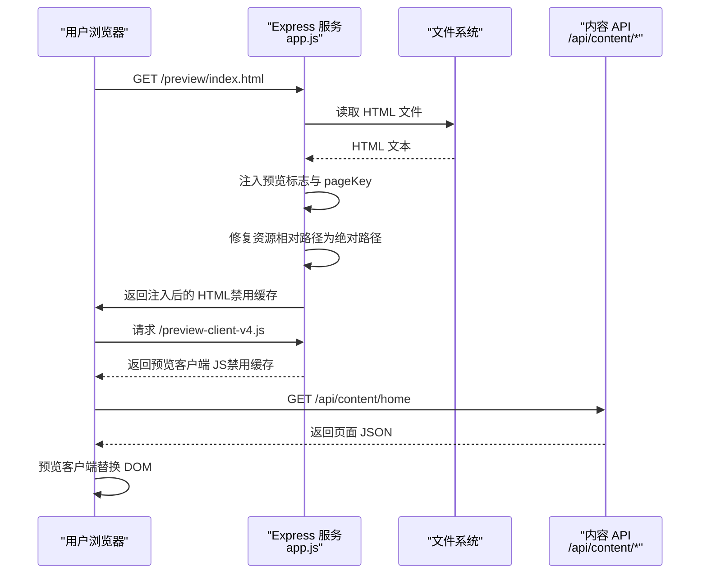
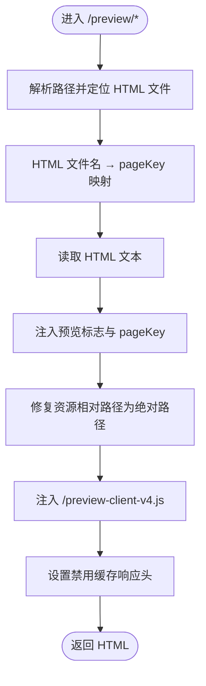
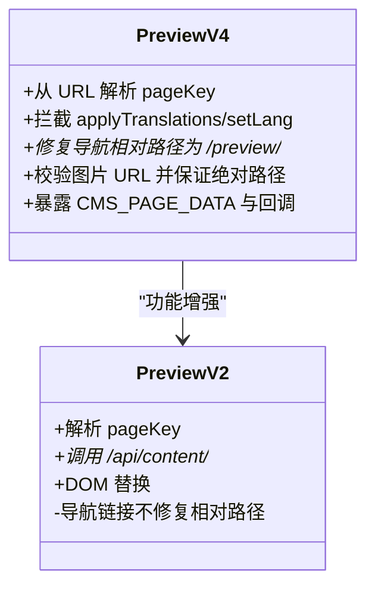
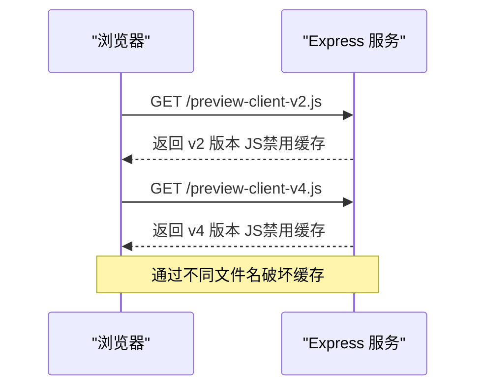
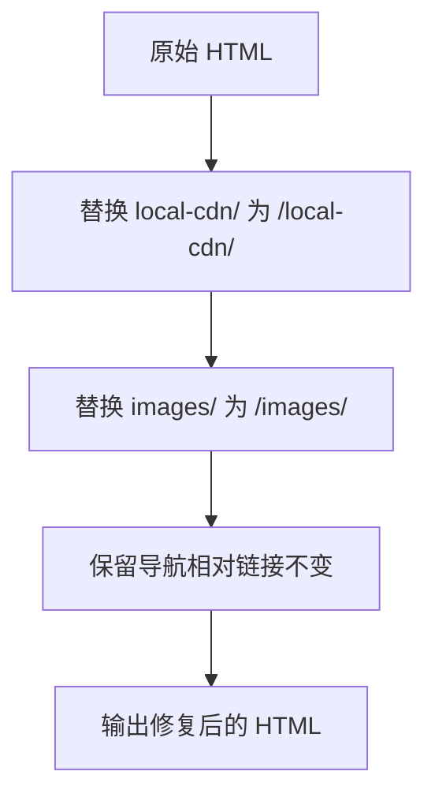
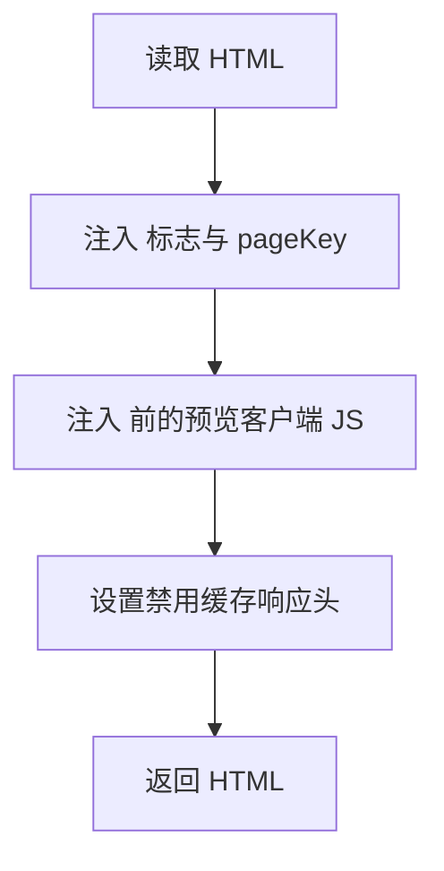
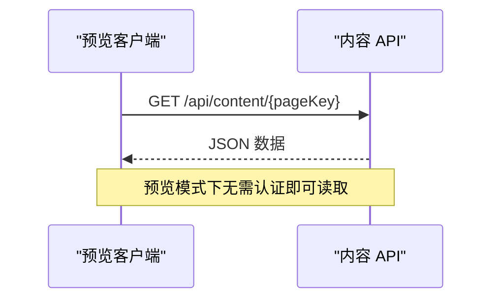
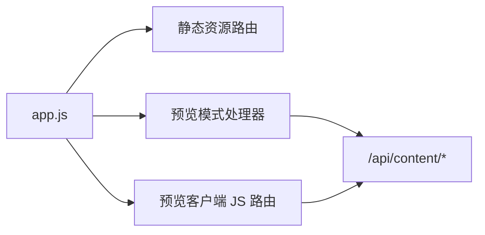

# 预览模式资源

<cite>
**本文引用的文件**
- [app.js](file://business-core/cms-server/app.js)
- [preview-client-v2.js](file://business-core/cms-server/preview-client-v2.js)
- [preview-client-v4.js](file://business-core/cms-server/preview-client-v4.js)
- [preview-client.js](file://business-core/cms-server/preview-client.js)
- [routes/content.js](file://business-core/cms-server/routes/content.js)
- [package.json](file://business-core/cms-server/package.json)
</cite>

## 目录
1. [简介](#简介)
2. [项目结构](#项目结构)
3. [核心组件](#核心组件)
4. [架构总览](#架构总览)
5. [详细组件分析](#详细组件分析)
6. [依赖关系分析](#依赖关系分析)
7. [性能考量](#性能考量)
8. [故障排查指南](#故障排查指南)
9. [结论](#结论)
10. [附录](#附录)

## 简介
本文档面向“预览模式资源服务”，系统性阐述 /preview 路径的动态资源处理机制，包括：
- 预览客户端 JS 的注入与缓存控制
- 预览模式下资源路径的自动修复（相对路径转绝对路径）
- 预览客户端 JS 的版本管理（v2 与 v4 的差异及缓存策略）
- 预览模式的 HTML 注入流程（预览标志、页面键值映射）
- 最佳实践与调试技巧

## 项目结构
与预览模式相关的后端实现集中在 Node.js 服务中，核心文件如下：
- 后端入口与路由：business-core/cms-server/app.js
- 预览客户端 JS（v2/v4/通用）：business-core/cms-server/preview-client*.js
- 内容 API 路由：business-core/cms-server/routes/content.js
- 依赖声明：business-core/cms-server/package.json

图表来源
- [app.js:55-153](file://business-core/cms-server/app.js#L55-L153)
- [routes/content.js:48-65](file://business-core/cms-server/routes/content.js#L48-L65)

章节来源
- [app.js:55-153](file://business-core/cms-server/app.js#L55-L153)
- [package.json:1-22](file://business-core/cms-server/package.json#L1-L22)

## 核心组件
- 预览模式处理器：负责读取前端 HTML、注入预览标志与页面键值、修复资源相对路径、注入预览客户端 JS，并禁用预览页面缓存。
- 预览客户端 JS（v2/v4/通用）：负责从内容 API 获取 JSON 并替换 DOM；v4 版本增强了对导航链接的相对路径修复与对业务脚本的交互。
- 内容 API：提供 /api/content/:pageKey 的读取接口，供预览客户端拉取页面内容。

章节来源
- [app.js:103-153](file://business-core/cms-server/app.js#L103-L153)
- [preview-client-v2.js:1-247](file://business-core/cms-server/preview-client-v2.js#L1-L247)
- [preview-client-v4.js:1-323](file://business-core/cms-server/preview-client-v4.js#L1-L323)
- [preview-client.js:1-308](file://business-core/cms-server/preview-client.js#L1-L308)
- [routes/content.js:48-65](file://business-core/cms-server/routes/content.js#L48-L65)

## 架构总览
预览模式的关键流程：
- 浏览器请求 /preview/*，后端读取对应 HTML 文件
- 注入 window.CMS_PREVIEW 与页面键值（pageKey）
- 修复资源相对路径（local-cdn/images）为绝对路径
- 注入 /preview-client-v4.js（禁用缓存）
- 返回 HTML，同时设置响应头禁用缓存

图表来源
- [app.js:103-153](file://business-core/cms-server/app.js#L103-L153)
- [routes/content.js:48-65](file://business-core/cms-server/routes/content.js#L48-L65)

## 详细组件分析

### 预览模式处理器（/preview/*）
职责与行为：
- 解析请求路径，定位对应 HTML 文件
- 建立 HTML 文件名到 pageKey 的映射
- 读取 HTML，执行以下注入与修复：
  - 注入预览标志与 pageKey 到 <head>
  - 修复资源相对路径（local-cdn/images）为绝对路径
  - 注入 /preview-client-v4.js
- 设置响应头禁用缓存，确保预览页面与 JS 始终加载最新

图表来源
- [app.js:103-153](file://business-core/cms-server/app.js#L103-L153)

章节来源
- [app.js:103-153](file://business-core/cms-server/app.js#L103-L153)

### 预览客户端 JS（v2 与 v4 的差异）
共同点：
- 通过 /api/content/:pageKey 获取页面 JSON
- 使用 data-i18n/data-i18n-href 等属性进行 DOM 替换
- 在 DOMContentLoaded 后执行主流程

差异点：
- v2：依赖 window.CMS_PAGE_KEY 或 URL 查询参数 page 作为 pageKey；导航链接更新时不做相对路径修复
- v4：从 URL 路径解析 pageKey；导航链接更新时将相对路径修复为 /preview/xxx.html；拦截 applyTranslations/setLang，避免覆盖预览注入内容；增强图片 URL 校验与绝对路径保证；暴露 window.CMS_PAGE_DATA 并回调 onCmsPageData 通知业务脚本

图表来源
- [preview-client-v2.js:1-247](file://business-core/cms-server/preview-client-v2.js#L1-L247)
- [preview-client-v4.js:1-323](file://business-core/cms-server/preview-client-v4.js#L1-L323)
- [preview-client.js:1-308](file://business-core/cms-server/preview-client.js#L1-L308)

章节来源
- [preview-client-v2.js:1-247](file://business-core/cms-server/preview-client-v2.js#L1-L247)
- [preview-client-v4.js:1-323](file://business-core/cms-server/preview-client-v4.js#L1-L323)
- [preview-client.js:1-308](file://business-core/cms-server/preview-client.js#L1-L308)

### 预览客户端 JS 的版本管理与缓存策略
- /preview-client-v2.js：读取同一份通用 JS 文件，禁用缓存头，兼容旧版 HTML
- /preview-client-v4.js：读取同一份通用 JS 文件，禁用缓存头，确保每次加载最新
- 通过变更文件名破坏缓存的策略：v4 版本建议改名以强制刷新

图表来源
- [app.js:67-101](file://business-core/cms-server/app.js#L67-L101)

章节来源
- [app.js:67-101](file://business-core/cms-server/app.js#L67-L101)

### 预览模式下的资源路径自动修复机制
- 作用范围：仅修复资源链接（href/src）中的 local-cdn/images 相对路径，不改动页面导航链接（如 href="visa.html"），使其保持相对路径以便导航至 /preview/xxx.html
- 实现方式：通过字符串替换将 "href/local-cdn/"、"src/local-cdn/"、"href/images/"、"src/images/" 替换为 "/local-cdn/"、"/images/"

图表来源
- [app.js:127-134](file://business-core/cms-server/app.js#L127-L134)

章节来源
- [app.js:127-134](file://business-core/cms-server/app.js#L127-L134)

### 预览模式的 HTML 注入过程
- 注入预览标志：在 <head> 中注入 window.CMS_PREVIEW=1
- 注入页面键值：若存在 pageKey，则注入 window.CMS_PAGE_KEY='xxx'
- 注入预览客户端 JS：在 </body> 前注入 
- 禁用缓存：设置 Content-Type 以及 Cache-Control/Pragma/Expires

图表来源
- [app.js:136-151](file://business-core/cms-server/app.js#L136-L151)

章节来源
- [app.js:136-151](file://business-core/cms-server/app.js#L136-L151)

### 内容 API（/api/content/*）
- GET /api/content/:pageKey：无需认证，返回页面 JSON；全局类（nav/footer/consultation）与页面类（home/about/visa/saudi-visa/enterprise/transport/insurance/inspection）均有支持
- PUT /api/content/:pageKey：需认证，按角色与权限写入 JSON

图表来源
- [routes/content.js:48-65](file://business-core/cms-server/routes/content.js#L48-L65)
- [routes/content.js:67-101](file://business-core/cms-server/routes/content.js#L67-L101)

章节来源
- [routes/content.js:48-65](file://business-core/cms-server/routes/content.js#L48-L65)
- [routes/content.js:67-101](file://business-core/cms-server/routes/content.js#L67-L101)

## 依赖关系分析
- app.js 依赖：
  - 静态资源中间件：提供 /uploads、/images、/local-cdn、/preview/images、/preview/local-cdn 的访问
  - 预览客户端 JS 路由：/preview-client-v2.js、/preview-client-v4.js
  - 预览模式处理器：/preview/*
  - 内容 API：/api/content/*
- 预览客户端 JS 依赖：
  - /api/content/* 获取页面 JSON
  - DOM 属性 data-i18n/data-i18n-href 作为注入锚点

图表来源
- [app.js:55-161](file://business-core/cms-server/app.js#L55-L161)
- [routes/content.js:48-65](file://business-core/cms-server/routes/content.js#L48-L65)

章节来源
- [app.js:55-161](file://business-core/cms-server/app.js#L55-L161)
- [routes/content.js:48-65](file://business-core/cms-server/routes/content.js#L48-L65)

## 性能考量
- 预览页面禁用缓存：确保每次预览都能看到最新内容与 JS，但会增加带宽与延迟。生产环境应避免使用预览模式。
- 预览客户端 JS 禁用缓存：v2/v4 均禁用缓存，确保预览一致性。
- 路径修复为字符串替换：复杂度 O(n)，对一般 HTML 规模影响较小。
- 预览客户端 DOM 遍历：按 data-i18n 属性数量线性扫描，注意避免在 DOMContentLoaded 后被其他脚本覆盖，预览客户端已内置延迟重试。

## 故障排查指南
常见问题与定位要点：
- 预览页面空白或资源 404
  - 检查 /preview/* 是否正确映射到 HTML 文件
  - 确认 /images、/local-cdn、/preview/images、/preview/local-cdn 的静态目录是否存在
- 资源路径不生效
  - 确认 HTML 中资源链接是否为 local-cdn/images 相对路径
  - 检查预览处理器是否执行了路径修复
- 导航链接异常
  - v2 不修复相对路径；v4 会将相对链接修复为 /preview/xxx.html
- 预览客户端未生效
  - 确认 /preview-client-v2.js 或 /preview-client-v4.js 是否返回成功
  - 检查浏览器控制台日志（以 [CMS] 开头）
- 内容未更新
  - 确认 /api/content/:pageKey 返回预期 JSON
  - 检查 data-i18n/data-i18n-href 属性是否存在于目标元素上

章节来源
- [app.js:67-101](file://business-core/cms-server/app.js#L67-L101)
- [app.js:103-153](file://business-core/cms-server/app.js#L103-L153)
- [preview-client-v2.js:232-246](file://business-core/cms-server/preview-client-v2.js#L232-L246)
- [preview-client-v4.js:308-322](file://business-core/cms-server/preview-client-v4.js#L308-L322)
- [routes/content.js:48-65](file://business-core/cms-server/routes/content.js#L48-L65)

## 结论
预览模式通过“HTML 注入 + 资源路径修复 + 预览客户端 JS + 内容 API”形成闭环，既保证了预览的一致性与实时性，又提供了稳定的扩展点（v4 对导航链接修复与图片 URL 校验的增强）。结合禁用缓存策略与清晰的版本管理，能够满足编辑与演示场景的需求。

## 附录
- 最佳实践
  - 使用 /preview-client-v4.js 以获得更稳健的预览体验
  - 在 HTML 中统一使用 local-cdn/images 作为资源前缀，便于路径修复
  - 为图片与链接元素添加 data-i18n 与 data-i18n-href，确保预览客户端可替换
  - 预览结束后关闭浏览器缓存或切换到正式发布流程
- 调试技巧
  - 打开浏览器开发者工具 → Console，查看以 [CMS] 开头的日志
  - 检查网络面板中 /api/content/* 与 /preview-client-*.js 的响应状态
  - 若发现图片加载失败，关注预览客户端对 URL 的校验与警告信息