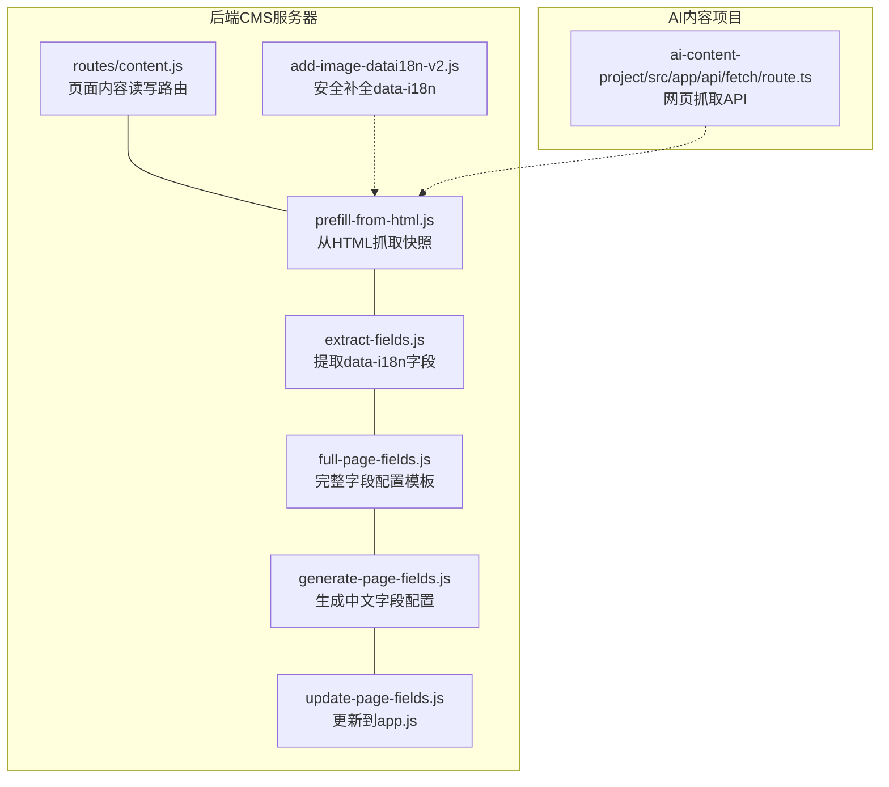
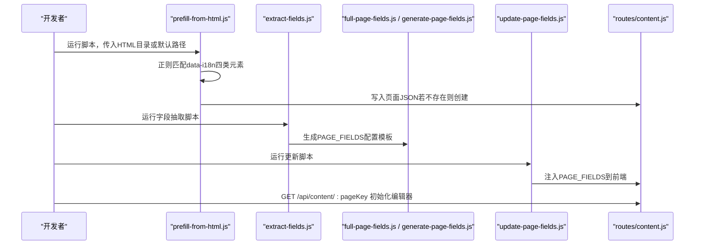
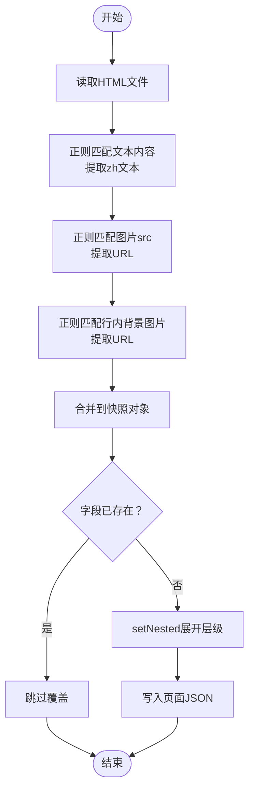
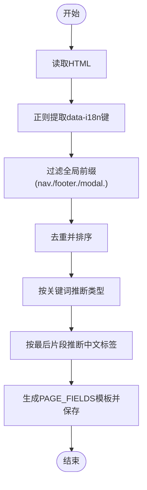
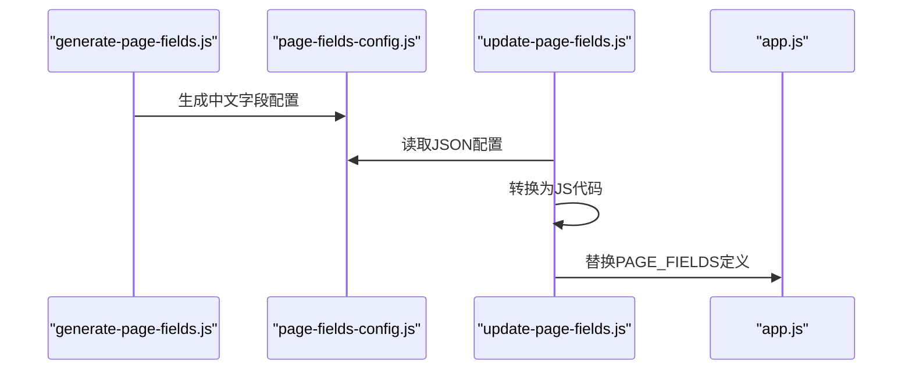
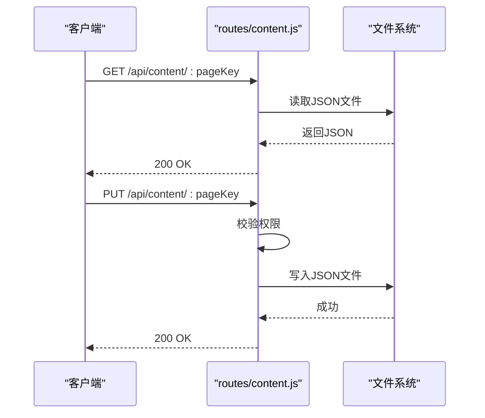
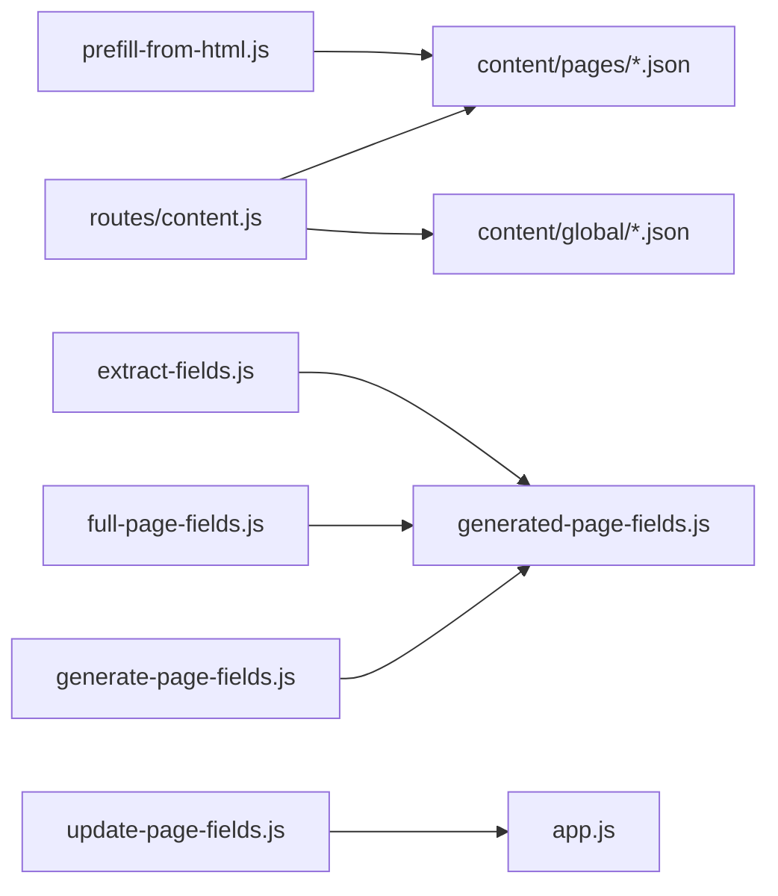

# 页面快照API

<cite>
**本文引用的文件**
- [business-core/cms-server/routes/content.js](file://business-core/cms-server/routes/content.js)
- [business-core/cms-server/prefill-from-html.js](file://business-core/cms-server/prefill-from-html.js)
- [business-core/cms-server/extract-fields.js](file://business-core/cms-server/extract-fields.js)
- [business-core/cms-server/full-page-fields.js](file://business-core/cms-server/full-page-fields.js)
- [business-core/cms-server/generate-page-fields.js](file://business-core/cms-server/generate-page-fields.js)
- [business-core/cms-server/update-page-fields.js](file://business-core/cms-server/update-page-fields.js)
- [business-core/cms-server/add-image-datai18n-v2.js](file://business-core/cms-server/add-image-datai18n-v2.js)
- [ai-content-project/src/app/api/fetch/route.ts](file://ai-content-project/src/app/api/fetch/route.ts)
</cite>

## 目录
1. [引言](#引言)
2. [项目结构](#项目结构)
3. [核心组件](#核心组件)
4. [架构总览](#架构总览)
5. [详细组件分析](#详细组件分析)
6. [依赖关系分析](#依赖关系分析)
7. [性能考量](#性能考量)
8. [故障排查指南](#故障排查指南)
9. [结论](#结论)
10. [附录](#附录)

## 引言
本技术文档围绕“页面快照API”展开，系统性阐述如何从前端HTML中抓取data-i18n元素并生成CMS可编辑的页面快照数据。文档重点覆盖以下方面：
- 四种data-i18n元素的匹配规则与提取算法：文本内容、图片src、背景图片url、行内样式背景图片
- HTML解析流程与正则表达式策略
- 快照数据结构设计：中文内容提取与英文字段预留
- API使用示例与数据格式说明，帮助开发者理解内容提取与编辑器初始化机制

## 项目结构
该仓库包含两大部分：
- 后端CMS服务器脚本：负责页面内容的读取、写入、字段抽取、快照生成与字段配置更新
- AI内容项目（Next.js应用）：提供通用的网页抓取API，供AI内容模块使用

**图表来源**
- [business-core/cms-server/routes/content.js:1-104](file://business-core/cms-server/routes/content.js#L1-L104)
- [business-core/cms-server/prefill-from-html.js:1-110](file://business-core/cms-server/prefill-from-html.js#L1-L110)
- [business-core/cms-server/extract-fields.js:1-112](file://business-core/cms-server/extract-fields.js#L1-L112)
- [business-core/cms-server/full-page-fields.js:1-604](file://business-core/cms-server/full-page-fields.js#L1-L604)
- [business-core/cms-server/generate-page-fields.js:1-419](file://business-core/cms-server/generate-page-fields.js#L1-L419)
- [business-core/cms-server/update-page-fields.js:1-55](file://business-core/cms-server/update-page-fields.js#L1-L55)
- [business-core/cms-server/add-image-datai18n-v2.js:1-85](file://business-core/cms-server/add-image-datai18n-v2.js#L1-L85)
- [ai-content-project/src/app/api/fetch/route.ts:1-25](file://ai-content-project/src/app/api/fetch/route.ts#L1-L25)

**章节来源**
- [business-core/cms-server/routes/content.js:1-104](file://business-core/cms-server/routes/content.js#L1-L104)
- [ai-content-project/src/app/api/fetch/route.ts:1-25](file://ai-content-project/src/app/api/fetch/route.ts#L1-L25)

## 核心组件
- 页面内容读写路由：提供GET/PUT接口，支持全局配置与页面内容的读取与更新，并进行权限校验
- HTML快照抓取器：基于正则从HTML中提取data-i18n字段，生成快照JSON，用于编辑器初始化
- 字段抽取与配置：从HTML抽取data-i18n键，推断类型与中文标签，生成PAGE_FIELDS配置
- 字段配置生成与注入：将JSON配置转为JS格式并注入到前端app.js
- 安全补全工具：为缺少data-i18n的图片元素安全地添加属性，不改动文本内容

**章节来源**
- [business-core/cms-server/routes/content.js:48-101](file://business-core/cms-server/routes/content.js#L48-L101)
- [business-core/cms-server/prefill-from-html.js:19-54](file://business-core/cms-server/prefill-from-html.js#L19-L54)
- [business-core/cms-server/extract-fields.js:21-48](file://business-core/cms-server/extract-fields.js#L21-L48)
- [business-core/cms-server/generate-page-fields.js:8-408](file://business-core/cms-server/generate-page-fields.js#L8-L408)
- [business-core/cms-server/update-page-fields.js:8-50](file://business-core/cms-server/update-page-fields.js#L8-L50)
- [business-core/cms-server/add-image-datai18n-v2.js:38-67](file://business-core/cms-server/add-image-datai18n-v2.js#L38-L67)

## 架构总览
页面快照API的工作流分为两条主线：
- 快照生成链路：HTML文件 → 正则解析 → 快照对象 → JSON持久化 → 编辑器初始化
- 字段配置链路：HTML字段抽取 → 类型与标签推断 → PAGE_FIELDS生成 → 注入前端

**图表来源**
- [business-core/cms-server/prefill-from-html.js:74-107](file://business-core/cms-server/prefill-from-html.js#L74-L107)
- [business-core/cms-server/extract-fields.js:85-112](file://business-core/cms-server/extract-fields.js#L85-L112)
- [business-core/cms-server/full-page-fields.js:6-604](file://business-core/cms-server/full-page-fields.js#L6-L604)
- [business-core/cms-server/generate-page-fields.js:410-419](file://business-core/cms-server/generate-page-fields.js#L410-L419)
- [business-core/cms-server/update-page-fields.js:34-50](file://business-core/cms-server/update-page-fields.js#L34-L50)
- [business-core/cms-server/routes/content.js:48-65](file://business-core/cms-server/routes/content.js#L48-L65)

## 详细组件分析

### 组件A：HTML快照抓取器（prefill-from-html.js）
- 功能概述
  - 从HTML中抓取data-i18n字段，生成快照对象，写入对应页面JSON
  - 支持四种匹配规则：文本内容、图片src、背景图片url、行内样式背景图片
  - 对已有字段进行去重与保留策略，避免覆盖现有内容
- 匹配规则与算法
  - 文本内容：匹配形如<... data-i18n="key">...文本...</...>，去除HTML标签与实体，保留中文文本
  - 图片src：匹配形如，直接记录图片URL
  - 行内样式背景图片：匹配形如
，提取URL
- 数据结构
  - 快照对象：键为data-i18n值；文本字段为对象{ zh, en }；图片字段为字符串URL
  - 层级展开：通过setNested按点分隔键递归构建嵌套对象
- 错误处理
  - 若HTML文件不存在，跳过并输出提示
  - JSON解析异常时忽略错误，继续处理其他页面

**图表来源**
- [business-core/cms-server/prefill-from-html.js:19-69](file://business-core/cms-server/prefill-from-html.js#L19-L69)

**章节来源**
- [business-core/cms-server/prefill-from-html.js:19-107](file://business-core/cms-server/prefill-from-html.js#L19-L107)

### 组件B：字段抽取与类型/标签推断（extract-fields.js）
- 功能概述
  - 从HTML文件中提取所有data-i18n键，排除全局前缀，去重排序
  - 基于键名推断字段类型（text/textarea/image），生成中文标签
- 类型推断规则
  - 包含image/img/qr/photo等关键词 → image
  - 包含desc/content/text/intro等关键词 → textarea
  - 默认 → text
- 标签推断规则
  - 取最后一个片段作为基础，映射常用词为中文标签
- 输出
  - 生成PAGE_FIELDS配置模板，保存至generated-page-fields.js

**图表来源**
- [business-core/cms-server/extract-fields.js:21-112](file://business-core/cms-server/extract-fields.js#L21-L112)

**章节来源**
- [business-core/cms-server/extract-fields.js:21-112](file://business-core/cms-server/extract-fields.js#L21-L112)

### 组件C：字段配置生成与注入（full-page-fields.js / generate-page-fields.js / update-page-fields.js）
- full-page-fields.js
  - 自动生成的完整字段配置模板，包含所有页面与字段，带中文标签
- generate-page-fields.js
  - 手工维护的中文字段配置，导出为page-fields-config.js
- update-page-fields.js
  - 将page-fields-config.js中的JSON配置转换为JS代码，替换前端app.js中的PAGE_FIELDS定义

**图表来源**
- [business-core/cms-server/generate-page-fields.js:410-419](file://business-core/cms-server/generate-page-fields.js#L410-L419)
- [business-core/cms-server/update-page-fields.js:34-50](file://business-core/cms-server/update-page-fields.js#L34-L50)

**章节来源**
- [business-core/cms-server/full-page-fields.js:1-604](file://business-core/cms-server/full-page-fields.js#L1-L604)
- [business-core/cms-server/generate-page-fields.js:1-419](file://business-core/cms-server/generate-page-fields.js#L1-L419)
- [business-core/cms-server/update-page-fields.js:1-55](file://business-core/cms-server/update-page-fields.js#L1-L55)

### 组件D：安全补全data-i18n（add-image-datai18n-v2.js）
- 功能概述
  - 识别常见图片场景（如hero背景、侧边栏二维码），为缺失data-i18n的安全添加属性
  - 严格遵循“只加属性，不改文本”的原则
- 匹配模式
  - Hero背景图、个人/企业微信二维码、WhatsApp二维码等
- 输出
  - 修改后的HTML文件与变更记录

**章节来源**
- [business-core/cms-server/add-image-datai18n-v2.js:1-85](file://business-core/cms-server/add-image-datai18n-v2.js#L1-L85)

### 组件E：页面内容读写路由（routes/content.js）
- 功能概述
  - GET /api/content/:pageKey：读取页面或全局配置JSON
  - PUT /api/content/:pageKey：更新页面JSON，进行权限校验
- 权限控制
  - 全局配置仅超级管理员可写
  - 普通页面编辑需具备对应页面权限
- 存储位置
  - 页面内容：content/pages/*.json
  - 全局配置：content/global/*.json

**图表来源**
- [business-core/cms-server/routes/content.js:48-101](file://business-core/cms-server/routes/content.js#L48-L101)

**章节来源**
- [business-core/cms-server/routes/content.js:1-104](file://business-core/cms-server/routes/content.js#L1-L104)

### 组件F：网页抓取API（ai-content-project/src/app/api/fetch/route.ts）
- 功能概述
  - 接收URL参数，通过SDK抓取网页标题、内容与状态码
  - 适配转发请求头，便于跨域与鉴权
- 使用场景
  - 为AI内容模块提供统一的网页抓取能力，间接支撑快照数据的来源丰富化

**章节来源**
- [ai-content-project/src/app/api/fetch/route.ts:1-25](file://ai-content-project/src/app/api/fetch/route.ts#L1-L25)

## 依赖关系分析
- 组件耦合
  - prefill-from-html.js依赖HTML文件与content/pages目录
  - extract-fields.js依赖HTML目录与生成的配置模板
  - update-page-fields.js依赖page-fields-config.js与前端app.js
  - routes/content.js依赖content/pages与content/global目录
- 外部依赖
  - Node.js内置fs/path模块
  - better-sqlite3用于权限校验（content.js）

**图表来源**
- [business-core/cms-server/prefill-from-html.js:71-107](file://business-core/cms-server/prefill-from-html.js#L71-L107)
- [business-core/cms-server/extract-fields.js:85-112](file://business-core/cms-server/extract-fields.js#L85-L112)
- [business-core/cms-server/full-page-fields.js:1-604](file://business-core/cms-server/full-page-fields.js#L1-L604)
- [business-core/cms-server/generate-page-fields.js:410-419](file://business-core/cms-server/generate-page-fields.js#L410-L419)
- [business-core/cms-server/update-page-fields.js:34-50](file://business-core/cms-server/update-page-fields.js#L34-L50)
- [business-core/cms-server/routes/content.js:21-27](file://business-core/cms-server/routes/content.js#L21-L27)

**章节来源**
- [business-core/cms-server/prefill-from-html.js:71-107](file://business-core/cms-server/prefill-from-html.js#L71-L107)
- [business-core/cms-server/extract-fields.js:85-112](file://business-core/cms-server/extract-fields.js#L85-L112)
- [business-core/cms-server/full-page-fields.js:1-604](file://business-core/cms-server/full-page-fields.js#L1-L604)
- [business-core/cms-server/generate-page-fields.js:410-419](file://business-core/cms-server/generate-page-fields.js#L410-L419)
- [business-core/cms-server/update-page-fields.js:34-50](file://business-core/cms-server/update-page-fields.js#L34-L50)
- [business-core/cms-server/routes/content.js:21-27](file://business-core/cms-server/routes/content.js#L21-L27)

## 性能考量
- 正则匹配复杂度
  - 文本内容与图片src匹配为线性扫描，复杂度O(n)，其中n为HTML长度
  - 行内样式背景图片匹配涉及额外的字符串清理，整体仍为线性
- 文件I/O
  - 读取/写入JSON与HTML文件为顺序I/O，建议批量处理时减少重复打开关闭
- 内存占用
  - 快照对象与PAGE_FIELDS配置在内存中以对象形式存储，注意大页面的键数量控制
- 并发建议
  - 多页面处理时可采用串行或小批量并发，避免磁盘争用

## 故障排查指南
- 快照抓取结果为空
  - 检查HTML中是否存在data-i18n属性，必要时使用add-image-datai18n-v2.js补全
  - 确认正则匹配是否覆盖目标元素类型
- 字段未出现在编辑器
  - 确认extract-fields.js已正确抽取并生成PAGE_FIELDS
  - 确认update-page-fields.js已成功替换前端app.js中的PAGE_FIELDS
- 权限错误
  - PUT /api/content/:pageKey返回403，确认用户角色与页面权限
- JSON写入失败
  - 检查content/pages目录权限与磁盘空间

**章节来源**
- [business-core/cms-server/prefill-from-html.js:74-107](file://business-core/cms-server/prefill-from-html.js#L74-L107)
- [business-core/cms-server/extract-fields.js:85-112](file://business-core/cms-server/extract-fields.js#L85-L112)
- [business-core/cms-server/update-page-fields.js:34-50](file://business-core/cms-server/update-page-fields.js#L34-L50)
- [business-core/cms-server/routes/content.js:68-101](file://business-core/cms-server/routes/content.js#L68-L101)

## 结论
页面快照API通过“正则解析+字段抽取+配置注入”的闭环，实现了从HTML到CMS编辑器的高效衔接。开发者只需确保HTML中data-i18n的完整性与规范性，即可自动获得可编辑的快照数据与字段配置，显著降低内容管理成本。

## 附录

### API使用示例与数据格式说明
- 初始化编辑器
  - 请求：GET /api/content/:pageKey
  - 响应：页面JSON（若不存在则为空对象）
  - 用途：编辑器启动时加载当前页面内容
- 更新页面内容
  - 请求：PUT /api/content/:pageKey（需登录与相应权限）
  - 请求体：页面JSON
  - 响应：操作结果消息
- 快照数据格式
  - 文本字段：{ zh: "...", en: "" }
  - 图片字段：字符串URL
  - 层级键：以点号分隔，如 hero.title、section.process.tag
- 字段配置格式
  - PAGE_FIELDS：每个页面包含若干字段项，每项含key、label、type

**章节来源**
- [business-core/cms-server/routes/content.js:48-101](file://business-core/cms-server/routes/content.js#L48-L101)
- [business-core/cms-server/prefill-from-html.js:56-69](file://business-core/cms-server/prefill-from-html.js#L56-L69)
- [business-core/cms-server/full-page-fields.js:6-604](file://business-core/cms-server/full-page-fields.js#L6-L604)