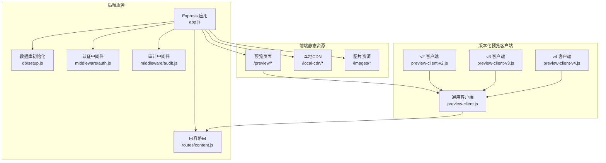
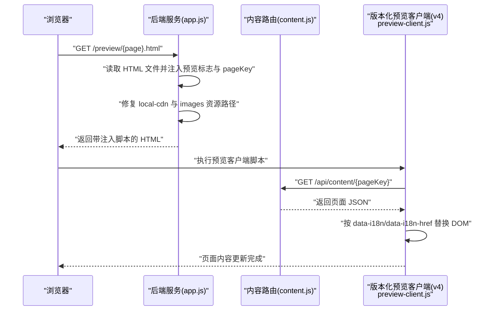
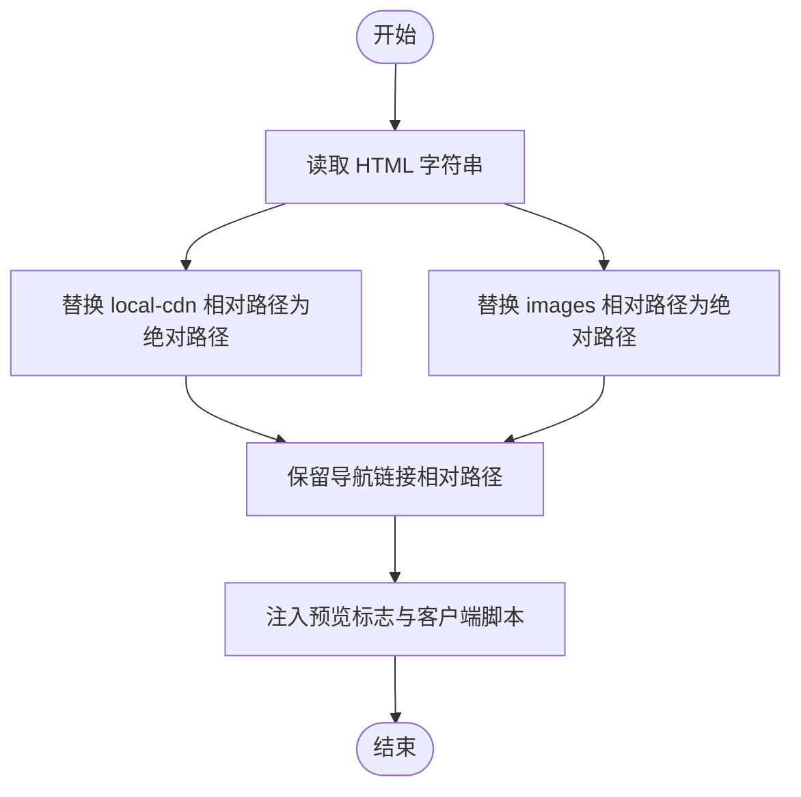
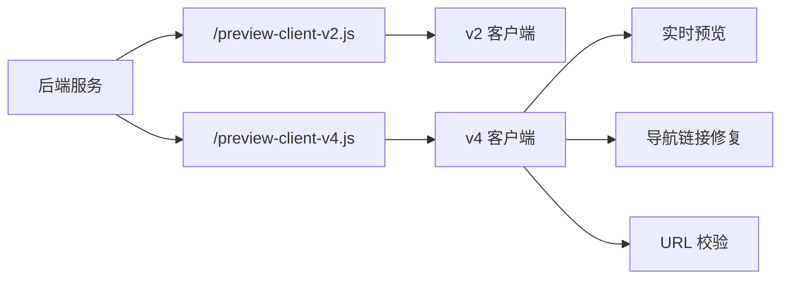
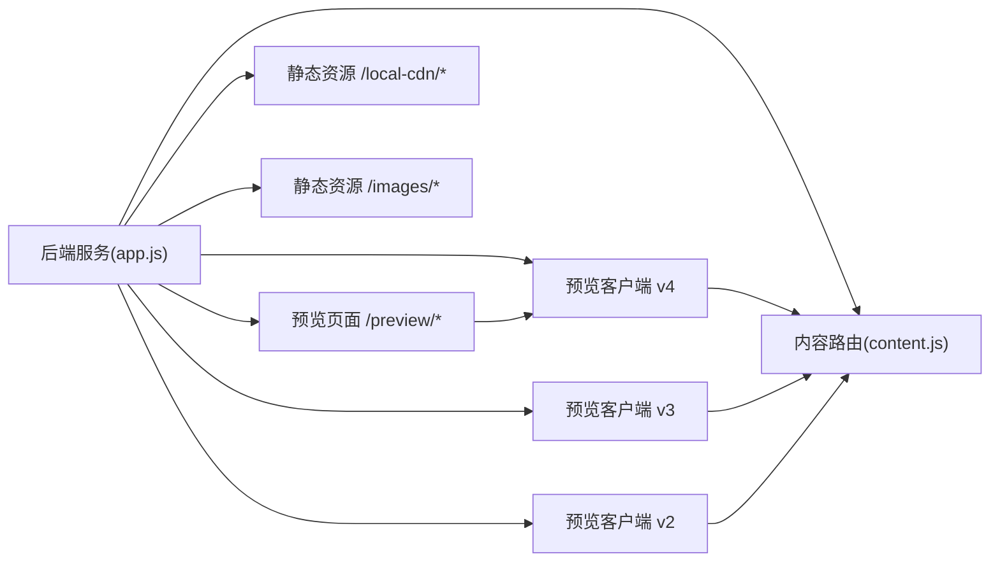

# 预览模式系统

<cite>
**本文引用的文件**
- [app.js](file://cms-server/app.js)
- [content.js](file://cms-server/routes/content.js)
- [preview-client-v2.js](file://cms-server/preview-client-v2.js)
- [preview-client-v3.js](file://cms-server/preview-client-v3.js)
- [preview-client-v4.js](file://cms-server/preview-client-v4.js)
- [preview-client.js](file://cms-server/preview-client.js)
- [setup.js](file://cms-server/db/setup.js)
- [auth.js](file://cms-server/middleware/auth.js)
- [audit.js](file://cms-server/middleware/audit.js)
- [index.html](file://index.html)
- [visa.html](file://visa.html)
- [about.html](file://about.html)
</cite>

## 更新摘要
**变更内容**
- 更新预览客户端版本化系统架构，从单一v4版本扩展到v2/v3/v4多版本支持
- 新增版本兼容性机制和动态版本选择策略
- 完善预览客户端演进历程和功能对比
- 更新资源路径修复算法和导航链接处理策略
- 增强实时预览和消息通信机制

## 目录
1. [简介](#简介)
2. [项目结构](#项目结构)
3. [核心组件](#核心组件)
4. [架构总览](#架构总览)
5. [组件详解](#组件详解)
6. [版本化预览客户端系统](#版本化预览客户端系统)
7. [依赖关系分析](#依赖关系分析)
8. [性能考量](#性能考量)
9. [故障排查指南](#故障排查指南)
10. [结论](#结论)
11. [附录](#附录)

## 简介
本文件面向"预览模式系统"的技术文档，围绕以下目标展开：
- 解释预览模式的实现机制：HTML 文件托管、预览客户端 JS 注入、资源路径修复策略
- 说明版本化预览客户端系统：v2、v3、v4 的演进历程与兼容性设计
- 对比预览客户端版本差异：功能增强、性能优化与向后兼容
- 说明 HTML 文件到 pageKey 的映射规则：页面名称与文件名的对应关系
- 解释资源路径修复算法：local-cdn 与 images 资源的绝对路径转换
- 说明预览标志注入与缓存禁用策略
- 提供预览模式工作流程与调试方法

## 项目结构
预览模式系统主要由后端服务、内容路由与版本化预览客户端三部分组成：
- 后端服务负责静态文件托管、预览页面注入、缓存控制与内容 API
- 内容路由提供页面 JSON 的读取与写入能力
- 版本化预览客户端在浏览器侧拉取 JSON 并替换 DOM，支持多版本向后兼容

**图表来源**
- [app.js:103-153](file://cms-server/app.js#L103-L153)
- [content.js:48-65](file://cms-server/routes/content.js#L48-L65)
- [preview-client.js:1-308](file://cms-server/preview-client.js#L1-L308)
- [preview-client-v2.js:1-247](file://cms-server/preview-client-v2.js#L1-L247)
- [preview-client-v3.js:1-285](file://cms-server/preview-client-v3.js#L1-L285)
- [preview-client-v4.js:1-340](file://cms-server/preview-client-v4.js#L1-L340)

**章节来源**
- [app.js:103-153](file://cms-server/app.js#L103-L153)
- [content.js:48-65](file://cms-server/routes/content.js#L48-L65)

## 核心组件
- 预览页面托管与注入：后端接收 /preview/* 请求，读取对应 HTML，注入预览标志与 pageKey，并修复资源路径，最后注入版本化预览客户端 JS
- 版本化预览客户端：支持 v2、v3、v4 多版本客户端，负责从内容 API 拉取 JSON，按 data-i18n/data-i18n-href 规则替换 DOM；v4 版本增强导航链接修复与图片 URL 校验
- 内容 API：提供 GET /api/content/:pageKey 读取页面 JSON；支持全局配置 nav/footer/consultation 与页面类内容
- 缓存控制：预览客户端与预览页面均采用 no-cache 策略，确保开发调试时获取最新内容

**章节来源**
- [app.js:103-153](file://cms-server/app.js#L103-L153)
- [preview-client.js:1-308](file://cms-server/preview-client.js#L1-L308)
- [preview-client-v4.js:1-340](file://cms-server/preview-client-v4.js#L1-L340)
- [content.js:48-65](file://cms-server/routes/content.js#L48-L65)

## 架构总览
预览模式的关键交互流程如下：

**图表来源**
- [app.js:103-153](file://cms-server/app.js#L103-L153)
- [content.js:48-65](file://cms-server/routes/content.js#L48-L65)
- [preview-client.js:282-300](file://cms-server/preview-client.js#L282-L300)

## 组件详解

### 预览页面托管与注入
- 路由规则：/preview/* 由后端读取对应 HTML 文件，注入 window.CMS_PREVIEW 与 window.CMS_PAGE_KEY，并修复资源路径，最后注入 /preview-client-v4.js
- 资源路径修复：将 href 与 src 中的 local-cdn/ 与 images/ 相对路径改为绝对路径，保证资源访问正确
- 缓存禁用：预览页面返回 no-cache/no-store/must-revalidate，避免浏览器缓存导致内容陈旧

**章节来源**
- [app.js:103-153](file://cms-server/app.js#L103-L153)

### HTML 到 pageKey 的映射
- 映射表：index.html → home；visa.html → visa；saudi-visa.html → saudi-visa；enterprise.html → enterprise；transport.html → transport；insurance.html → insurance；inspection.html → inspection；about.html → about
- pageKey 使用场景：作为内容 API 的路径参数，决定拉取哪个页面 JSON

**章节来源**
- [app.js:109-120](file://cms-server/app.js#L109-L120)
- [content.js:28-31](file://cms-server/routes/content.js#L28-L31)

### 预览客户端版本演进（v2 与 v4）
- 共同点
  - 通过 URL 解析 pageKey；从 /api/content/{pageKey} 拉取 JSON；按 data-i18n/data-i18n-href 替换 DOM；延迟重试以对抗其他脚本覆盖
- v4 新增与改进
  - 明确拦截 applyTranslations 与 setLang，防止业务国际化函数覆盖 CMS 注入内容
  - 导航链接修复：当启用预览模式且链接为相对路径时，自动转换为 /preview/{相对路径}.html
  - 图片 URL 校验：仅对看起来像 URL 的值进行设置，提升健壮性
  - 绝对路径转换：确保 IMG src 为绝对路径，避免相对路径在 /preview/* 下解析异常
  - 暴露 window.CMS_PAGE_DATA 并触发 window.onCmsPageData 回调，便于业务脚本二次渲染结构化字段
  - 实时预览：监听来自后台编辑器的消息，支持实时内容更新
- v3 特点
  - 在 v2 基础上增强了图片路径绝对化处理，添加了 onerror 调试信息
- v2 特点
  - 早期版本，功能较基础；通过 /preview-client-v2.js 接口返回通用客户端代码，但未包含 v4 的拦截与修复逻辑

**章节来源**
- [preview-client.js:8-28](file://cms-server/preview-client.js#L8-L28)
- [preview-client.js:91-98](file://cms-server/preview-client.js#L91-L98)
- [preview-client.js:238-253](file://cms-server/preview-client.js#L238-L253)
- [preview-client.js:274-277](file://cms-server/preview-client.js#L274-L277)
- [preview-client.js:290-292](file://cms-server/preview-client.js#L290-L292)
- [preview-client-v2.js:1-247](file://cms-server/preview-client-v2.js#L1-L247)
- [preview-client-v3.js:225-237](file://cms-server/preview-client-v3.js#L225-L237)
- [preview-client-v4.js:33-43](file://cms-server/preview-client-v4.js#L33-L43)
- [preview-client-v4.js:91-98](file://cms-server/preview-client-v4.js#L91-L98)
- [preview-client-v4.js:200-208](file://cms-server/preview-client-v4.js#L200-L208)
- [preview-client-v4.js:248-256](file://cms-server/preview-client-v4.js#L248-L256)
- [preview-client-v4.js:290-292](file://cms-server/preview-client-v4.js#L290-L292)
- [preview-client-v4.js:323-338](file://cms-server/preview-client-v4.js#L323-L338)

### 资源路径修复算法
- 修复范围：仅针对 HTML 中的 href 与 src 属性，且限定于 local-cdn 与 images 两类资源
- 修复策略：将 href="local-cdn/xxx" 与 src="local-cdn/xxx" 改为绝对路径 /local-cdn/xxx；同理 images
- 导航链接例外：页面内的导航链接（如 href="visa.html"）保持相对路径，以便在 /preview/* 下正确跳转至 /preview/visa.html

**图表来源**
- [app.js:127-134](file://cms-server/app.js#L127-L134)

**章节来源**
- [app.js:127-134](file://cms-server/app.js#L127-L134)

### 预览标志注入与缓存禁用策略
- 预览标志：在 <head> 中注入 window.CMS_PREVIEW=1；若存在 pageKey，则同时注入 window.CMS_PAGE_KEY='...'

- 缓存禁用：
  - 预览页面：返回 no-cache, no-store, must-revalidate，Pragme: no-cache，Expires: 0
  - 预览客户端：/preview-client-v4.js 返回 no-cache, no-store, must-revalidate，Pragme: no-cache，Expires: 0

**章节来源**
- [app.js:136-140](file://cms-server/app.js#L136-L140)
- [app.js:145-151](file://cms-server/app.js#L145-L151)
- [app.js:86-101](file://cms-server/app.js#L86-L101)

### 内容 API 与权限控制
- GET /api/content/:pageKey：无需认证，返回指定页面 JSON；支持全局配置 nav/footer/consultation 与页面类内容
- PUT /api/content/:pageKey：需认证；全局配置仅超级管理员可写；页面类内容需对应页面权限或超级管理员

**章节来源**
- [content.js:48-65](file://cms-server/routes/content.js#L48-L65)
- [content.js:67-101](file://cms-server/routes/content.js#L67-L101)
- [auth.js:20-44](file://cms-server/middleware/auth.js#L20-L44)

### 数据库与权限模型
- 用户表 users：用户名唯一，角色为 super_admin 或 editor
- 页面权限表 page_permissions：用户对页面的编辑权限
- 审计日志表 audit_log：记录写操作行为

**章节来源**
- [setup.js:18-53](file://cms-server/db/setup.js#L18-L53)
- [audit.js:22-40](file://cms-server/middleware/audit.js#L22-L40)

## 版本化预览客户端系统

### 版本演进历程
预览客户端经历了从 v2 到 v4 的持续演进，每个版本都针对特定需求进行了功能增强：

- **v2 版本**：基础版本，提供基本的页面内容替换功能，支持 data-i18n 属性
- **v3 版本**：在 v2 基础上增强了图片路径处理，添加了绝对路径转换和错误处理
- **v4 版本**：完整版本，集成了所有高级功能，包括导航链接修复、URL 校验、实时预览等

### 版本兼容性机制
后端通过不同的路由接口支持多版本客户端：

- `/preview-client-v2.js`：返回通用客户端代码，兼容旧版 HTML
- `/preview-client-v4.js`：返回最新客户端代码，包含所有新功能

**图表来源**
- [app.js:67-101](file://cms-server/app.js#L67-L101)

### 功能对比矩阵

| 功能特性 | v2 | v3 | v4 |
|---------|----|----|----|
| 基础内容替换 | ✓ | ✓ | ✓ |
| 导航链接修复 | ✗ | ✗ | ✓ |
| 图片 URL 校验 | ✗ | ✓ | ✓ |
| 实时预览 | ✗ | ✗ | ✓ |
| 绝对路径转换 | ✗ | ✓ | ✓ |
| 拦截国际化函数 | ✗ | ✗ | ✓ |

**章节来源**
- [app.js:67-101](file://cms-server/app.js#L67-L101)
- [preview-client-v2.js:1-247](file://cms-server/preview-client-v2.js#L1-L247)
- [preview-client-v3.js:1-285](file://cms-server/preview-client-v3.js#L1-L285)
- [preview-client-v4.js:1-340](file://cms-server/preview-client-v4.js#L1-L340)

## 依赖关系分析
- 后端服务依赖
  - 静态文件托管：/local-cdn 与 /images 两个目录
  - 内容路由：读取 content/pages 与 content/global 下的 JSON 文件
  - 版本化预览客户端：支持 /preview-client-v2.js、/preview-client-v3.js、/preview-client-v4.js 多版本接口
- 预览客户端依赖
  - 内容 API：/api/content/{pageKey}
  - 浏览器 DOM：按 data-i18n 与 data-i18n-href 属性替换内容

**图表来源**
- [app.js:55-62](file://cms-server/app.js#L55-L62)
- [app.js:103-153](file://cms-server/app.js#L103-L153)
- [preview-client.js:282-300](file://cms-server/preview-client.js#L282-L300)

**章节来源**
- [app.js:55-62](file://cms-server/app.js#L55-L62)
- [app.js:103-153](file://cms-server/app.js#L103-L153)
- [preview-client.js:282-300](file://cms-server/preview-client.js#L282-L300)

## 性能考量
- 预览模式以"开发调试"为主，缓存禁用确保实时性，但可能增加网络与 CPU 开销
- 预览客户端对 IMG src 的 URL 校验可减少无效请求，提高稳定性
- 延迟重试机制可降低被后续脚本覆盖的风险，但会带来一次额外的渲染开销
- 版本化客户端系统通过文件名变更破坏缓存，确保用户始终使用最新版本

## 故障排查指南
- 预览页面空白或资源 404
  - 检查 /local-cdn 与 /images 是否正确挂载
  - 确认 HTML 中的 local-cdn 与 images 路径是否被正确替换为绝对路径
- 内容未更新
  - 确认 /api/content/{pageKey} 返回正常 JSON
  - 检查浏览器控制台是否存在 [CMS] 日志与警告
- 导航链接跳转异常
  - v4 版本会在预览模式下将相对链接转换为 /preview/{相对路径}.html，确认链接是否符合预期
- 缓存导致内容陈旧
  - 确认预览页面与预览客户端均返回 no-cache 策略
- 权限问题
  - 写入页面内容需认证，且需具备对应页面权限或超级管理员身份
- 版本兼容性问题
  - 检查使用的预览客户端版本是否与 HTML 文件兼容
  - 确认 /preview-client-v4.js 是否正确返回最新客户端代码

**章节来源**
- [app.js:145-151](file://cms-server/app.js#L145-L151)
- [app.js:86-101](file://cms-server/app.js#L86-L101)
- [content.js:67-101](file://cms-server/routes/content.js#L67-L101)

## 结论
预览模式通过后端托管与注入、版本化预览客户端拉取与替换、以及严格的资源路径修复与缓存禁用策略，实现了对静态 HTML 的即时预览与调试。版本化客户端系统确保了向后兼容性，v4 版本在兼容性与健壮性上进一步优化，适合在复杂页面与多语言场景下稳定运行。通过多版本支持，系统能够在不影响现有功能的前提下逐步引入新特性。

## 附录

### 预览模式工作流程（步骤化）
- 访问 /preview/{page}.html
- 后端读取 HTML，注入 window.CMS_PREVIEW 与 window.CMS_PAGE_KEY
- 修复 local-cdn 与 images 资源路径，保留导航链接相对路径
- 注入 /preview-client-v4.js
- 预览客户端根据 pageKey 拉取 /api/content/{pageKey}
- 按 data-i18n/data-i18n-href 替换 DOM，并进行延迟重试
- 若存在结构化字段，暴露 window.CMS_PAGE_DATA 并触发回调

**章节来源**
- [app.js:103-153](file://cms-server/app.js#L103-L153)
- [preview-client.js:282-300](file://cms-server/preview-client.js#L282-L300)

### 版本化客户端使用指南
- **新项目**：使用 /preview-client-v4.js，获得完整功能支持
- **旧项目**：如果 HTML 文件仍使用旧版结构，可考虑使用 /preview-client-v2.js 或 /preview-client-v3.js
- **渐进升级**：逐步迁移到 v4 版本，利用实时预览等新特性

**章节来源**
- [app.js:67-101](file://cms-server/app.js#L67-L101)
- [preview-client-v4.js:323-338](file://cms-server/preview-client-v4.js#L323-L338)