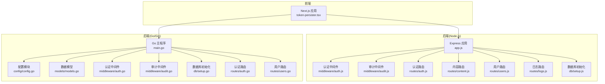
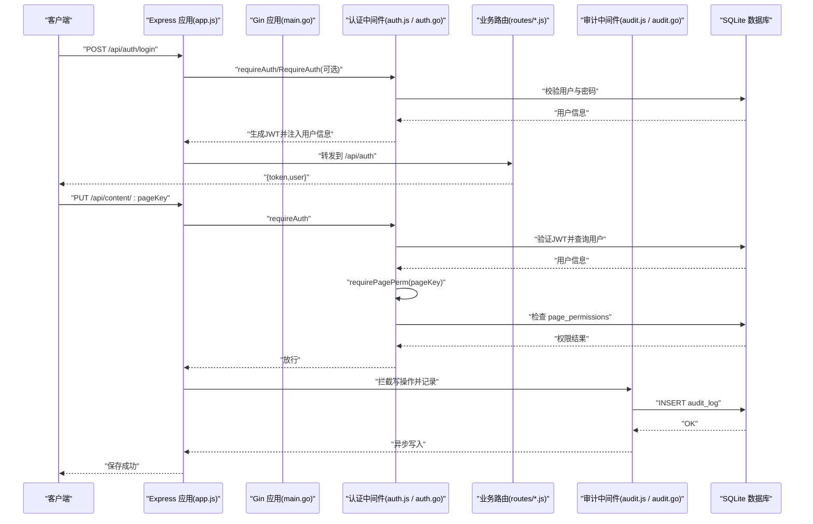
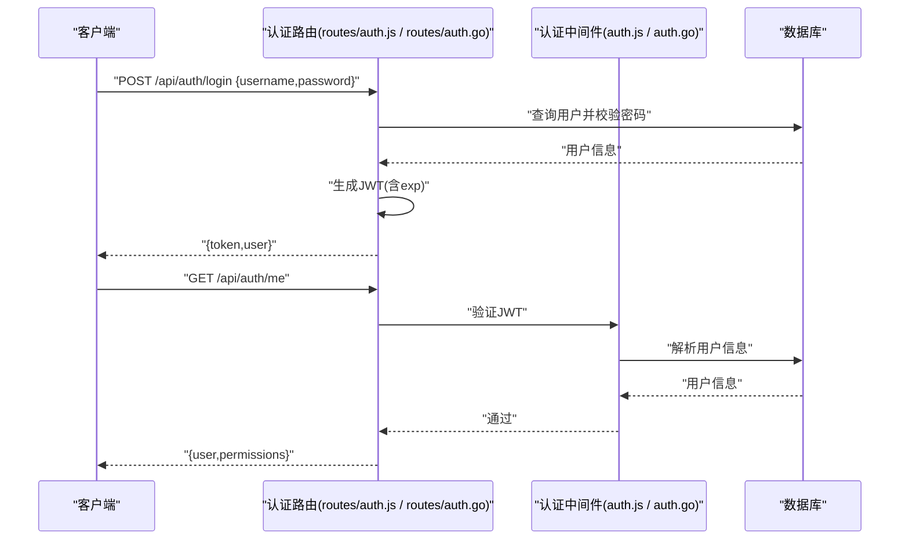
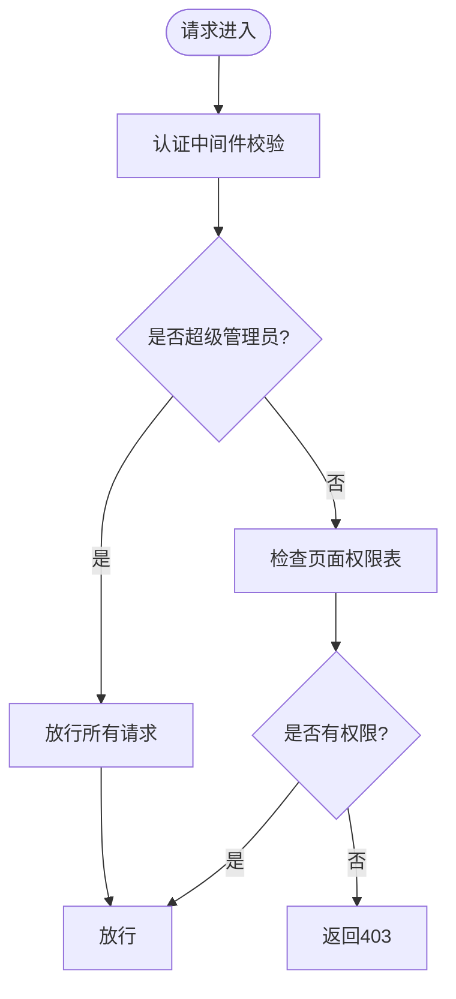
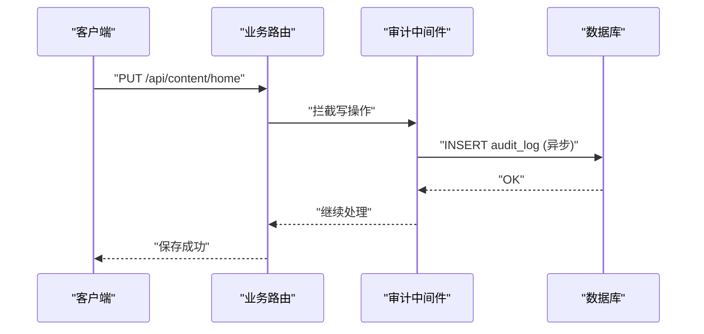
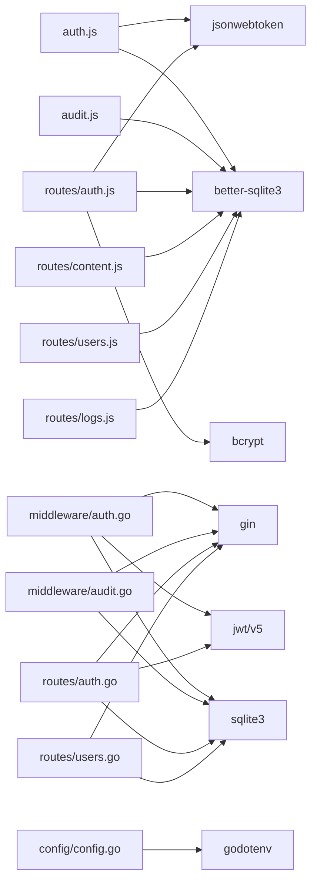

# 认证与授权

<cite>
**本文引用的文件**
- [business-core/cms-server/middleware/auth.js](file://business-core/cms-server/middleware/auth.js)
- [business-core/cms-server/routes/auth.js](file://business-core/cms-server/routes/auth.js)
- [business-core/cms-server/middleware/audit.js](file://business-core/cms-server/middleware/audit.js)
- [business-core/cms-server/routes/content.js](file://business-core/cms-server/routes/content.js)
- [business-core/cms-server/routes/users.js](file://business-core/cms-server/routes/users.js)
- [business-core/cms-server/routes/logs.js](file://business-core/cms-server/routes/logs.js)
- [business-core/cms-server/db/setup.js](file://business-core/cms-server/db/setup.js)
- [business-core/cms-server/app.js](file://business-core/cms-server/app.js)
- [ai-content-project/src/components/token-persister.tsx](file://ai-content-project/src/components/token-persister.tsx)
- [business-core/cms-server-go/middleware/auth.go](file://business-core/cms-server-go/middleware/auth.go)
- [business-core/cms-server-go/middleware/audit.go](file://business-core/cms-server-go/middleware/audit.go)
- [business-core/cms-server-go/config/config.go](file://business-core/cms-server-go/config/config.go)
- [business-core/cms-server-go/models/models.go](file://business-core/cms-server-go/models/models.go)
- [business-core/cms-server-go/db/setup.go](file://business-core/cms-server-go/db/setup.go)
- [business-core/cms-server-go/main.go](file://business-core/cms-server-go/main.go)
- [business-core/cms-server-go/routes/auth.go](file://business-core/cms-server-go/routes/auth.go)
- [business-core/cms-server-go/routes/users.go](file://business-core/cms-server-go/routes/users.go)
</cite>

## 目录
1. [简介](#简介)
2. [项目结构](#项目结构)
3. [核心组件](#核心组件)
4. [架构总览](#架构总览)
5. [详细组件分析](#详细组件分析)
6. [依赖分析](#依赖分析)
7. [性能考虑](#性能考虑)
8. [故障排查指南](#故障排查指南)
9. [结论](#结论)
10. [附录](#附录)

## 简介
本技术文档面向CMS认证与授权系统，围绕以下主题展开：
- JWT认证机制：令牌生成、验证流程与过期处理
- 权限控制策略：角色定义（超级管理员、编辑员）、页面级权限检查与API访问控制
- 审计日志系统：操作记录、日志格式与安全审计
- 认证中间件使用：Express与Gin双栈实现、自定义权限验证与安全最佳实践
- 常见问题与解决方案：跨域、令牌传递、权限不足、日志查询等

## 项目结构
系统采用前后端分离架构，后端提供两套实现：
- Node.js + Express（业务核心）：负责认证、权限、内容与日志等核心能力
- Go/Gin（服务扩展）：提供更完善的中间件与路由组织，增强安全性与可观测性

图表来源
- [business-core/cms-server/app.js:1-315](file://business-core/cms-server/app.js#L1-L315)
- [business-core/cms-server-go/main.go:1-317](file://business-core/cms-server-go/main.go#L1-L317)

章节来源
- [business-core/cms-server/app.js:1-315](file://business-core/cms-server/app.js#L1-L315)
- [business-core/cms-server-go/main.go:1-317](file://business-core/cms-server-go/main.go#L1-L317)

## 核心组件
- 认证中间件（Node.js）：requireAuth、requireSuperAdmin、requirePagePerm
- 认证中间件（Go/Gin）：RequireAuth、RequireSuperAdmin、RequirePagePerm、AIAuth
- 审计中间件（Node.js）：audit、auditMiddleware
- 审计中间件（Go/Gin）：Audit、AuditMiddleware
- 数据模型（Go）：JWTClaims、User、UserResponse、AuditLog 等
- 配置模块（Go）：JWT密钥、数据库路径、上传目录等
- 数据库初始化：users、page_permissions、audit_log、ai_channels 表及默认超级管理员

章节来源
- [business-core/cms-server/middleware/auth.js:1-86](file://business-core/cms-server/middleware/auth.js#L1-L86)
- [business-core/cms-server-go/middleware/auth.go:1-203](file://business-core/cms-server-go/middleware/auth.go#L1-L203)
- [business-core/cms-server/middleware/audit.js:1-75](file://business-core/cms-server/middleware/audit.js#L1-L75)
- [business-core/cms-server-go/middleware/audit.go:1-96](file://business-core/cms-server-go/middleware/audit.go#L1-L96)
- [business-core/cms-server-go/models/models.go:1-145](file://business-core/cms-server-go/models/models.go#L1-L145)
- [business-core/cms-server-go/config/config.go:1-95](file://business-core/cms-server-go/config/config.go#L1-L95)
- [business-core/cms-server/db/setup.js:1-115](file://business-core/cms-server/db/setup.js#L1-L115)
- [business-core/cms-server-go/db/setup.go:1-187](file://business-core/cms-server-go/db/setup.go#L1-L187)

## 架构总览
系统通过JWT实现无状态认证，结合角色与页面级权限进行细粒度授权；审计中间件统一记录写操作，便于安全审计。

图表来源
- [business-core/cms-server/app.js:155-161](file://business-core/cms-server/app.js#L155-L161)
- [business-core/cms-server/routes/auth.js:22-66](file://business-core/cms-server/routes/auth.js#L22-L66)
- [business-core/cms-server/routes/content.js:67-101](file://business-core/cms-server/routes/content.js#L67-L101)
- [business-core/cms-server/middleware/auth.js:20-63](file://business-core/cms-server/middleware/auth.js#L20-L63)
- [business-core/cms-server/middleware/audit.js:46-72](file://business-core/cms-server/middleware/audit.js#L46-L72)

## 详细组件分析

### JWT认证机制（生成、验证与过期处理）
- 生成令牌
  - Node.js：登录成功后使用对称签名生成JWT，包含用户标识、用户名、角色与过期时间，默认7天
  - Go/Gin：登录成功后使用对称签名生成JWT，包含相同声明，过期时间同样为7天
- 验证令牌
  - Node.js：从Authorization头解析Bearer令牌，验证签名与有效性，失败返回401
  - Go/Gin：从Authorization头解析Bearer令牌，验证签名与有效性，失败返回401
- 过期处理
  - 令牌过期时，前端需重新登录获取新令牌；审计日志记录登录行为，便于追踪异常

图表来源
- [business-core/cms-server/routes/auth.js:22-66](file://business-core/cms-server/routes/auth.js#L22-L66)
- [business-core/cms-server/middleware/auth.js:20-35](file://business-core/cms-server/middleware/auth.js#L20-L35)
- [business-core/cms-server-go/routes/auth.go:27-104](file://business-core/cms-server-go/routes/auth.go#L27-L104)
- [business-core/cms-server-go/middleware/auth.go:17-63](file://business-core/cms-server-go/middleware/auth.go#L17-L63)

章节来源
- [business-core/cms-server/routes/auth.js:22-66](file://business-core/cms-server/routes/auth.js#L22-L66)
- [business-core/cms-server/middleware/auth.js:12-14](file://business-core/cms-server/middleware/auth.js#L12-L14)
- [business-core/cms-server-go/routes/auth.go:76-88](file://business-core/cms-server-go/routes/auth.go#L76-L88)
- [business-core/cms-server-go/middleware/auth.go:34-42](file://business-core/cms-server-go/middleware/auth.go#L34-L42)

### 权限控制策略（角色与页面级权限）
- 角色定义
  - 编辑员：默认角色，拥有指定页面的编辑权限
  - 超级管理员：拥有所有权限，可管理用户与全局配置
- 页面级权限
  - Node.js：requirePagePerm(pageKey) 查询 page_permissions 表判断是否允许编辑
  - Go/Gin：RequirePagePerm(pageKey) 同理，超级管理员直接放行
- API访问控制
  - 内容路由：普通页面PUT需页面权限；全局配置仅超级管理员可写
  - 用户管理：仅超级管理员可访问
  - 日志查询：支持分页过滤，清空日志仅超级管理员

图表来源
- [business-core/cms-server/middleware/auth.js:46-63](file://business-core/cms-server/middleware/auth.js#L46-L63)
- [business-core/cms-server-go/middleware/auth.go:86-132](file://business-core/cms-server-go/middleware/auth.go#L86-L132)
- [business-core/cms-server/routes/content.js:67-91](file://business-core/cms-server/routes/content.js#L67-L91)
- [business-core/cms-server/routes/users.js:26-42](file://business-core/cms-server/routes/users.js#L26-L42)

章节来源
- [business-core/cms-server/routes/content.js:28-46](file://business-core/cms-server/routes/content.js#L28-L46)
- [business-core/cms-server/routes/users.js:16-17](file://business-core/cms-server/routes/users.js#L16-L17)
- [business-core/cms-server-go/middleware/auth.go:65-84](file://business-core/cms-server-go/middleware/auth.go#L65-L84)

### 审计日志系统（操作记录、格式与安全审计）
- 记录范围
  - Node.js：手动调用 audit 或通过 auditMiddleware 自动记录非GET且成功响应的写操作
  - Go/Gin：手动调用 Audit 或通过 AuditMiddleware 自动记录写操作
- 日志字段
  - user_id、username、action、target、detail、timestamp
- 安全审计
  - 登录、创建/重置/删除用户、更新页面/全局配置、清空日志等关键动作均被记录
  - 日志查询支持按时间段、用户名、动作类型过滤

图表来源
- [business-core/cms-server/middleware/audit.js:46-72](file://business-core/cms-server/middleware/audit.js#L46-L72)
- [business-core/cms-server-go/middleware/audit.go:48-95](file://business-core/cms-server-go/middleware/audit.go#L48-L95)
- [business-core/cms-server/routes/logs.js:20-48](file://business-core/cms-server/routes/logs.js#L20-L48)

章节来源
- [business-core/cms-server/middleware/audit.js:22-40](file://business-core/cms-server/middleware/audit.js#L22-L40)
- [business-core/cms-server-go/middleware/audit.go:16-46](file://business-core/cms-server-go/middleware/audit.go#L16-L46)
- [business-core/cms-server/routes/logs.js:20-56](file://business-core/cms-server/routes/logs.js#L20-L56)

### 认证中间件使用方法与自定义权限验证
- Express（Node.js）
  - requireAuth：在需要认证的路由前使用
  - requireSuperAdmin：在需要超级管理员的路由前使用
  - requirePagePerm(pageKey)：在页面编辑接口使用
  - 自定义权限：基于 req.user 扩展业务逻辑
- Gin（Go/Gin）
  - middleware.RequireAuth()、RequireSuperAdmin()、RequirePagePerm(pageKey)
  - AIAuth：支持Authorization、URL token、Cookie三种令牌传递方式
  - 自定义权限：从 c.Get("user") 获取 JWTClaims 后扩展

章节来源
- [business-core/cms-server/middleware/auth.js:20-63](file://business-core/cms-server/middleware/auth.js#L20-L63)
- [business-core/cms-server-go/middleware/auth.go:17-176](file://business-core/cms-server-go/middleware/auth.go#L17-L176)
- [ai-content-project/src/components/token-persister.tsx:15-37](file://ai-content-project/src/components/token-persister.tsx#L15-L37)

### 安全最佳实践
- 令牌传递
  - 使用Authorization: Bearer <token> 头部传递
  - iframe场景可通过URL参数或Cookie传递，前端使用TokenPersister同步cookie
- 令牌存储
  - 前端仅保存在内存或安全存储中，避免localStorage长期持久化
- 令牌刷新
  - 建议引入短期访问令牌+刷新令牌机制（当前实现为固定7天）
- 审计与监控
  - 对所有写操作进行审计，定期审查登录与敏感操作
- 数据库安全
  - 外键约束启用，防止脏数据；默认超级管理员账户需立即修改密码

章节来源
- [ai-content-project/src/components/token-persister.tsx:15-37](file://ai-content-project/src/components/token-persister.tsx#L15-L37)
- [business-core/cms-server/app.js:168-225](file://business-core/cms-server/app.js#L168-L225)
- [business-core/cms-server-go/main.go:209-289](file://business-core/cms-server-go/main.go#L209-L289)

## 依赖分析
- Node.js Express
  - 认证中间件依赖better-sqlite3与jsonwebtoken
  - 审计中间件依赖better-sqlite3
  - 路由依赖bcrypt进行密码校验
- Go/Gin
  - 认证中间件依赖gin、jwt、sqlite3
  - 审计中间件依赖gin、sqlite3
  - 配置模块依赖godotenv加载环境变量

图表来源
- [business-core/cms-server/middleware/auth.js:8-10](file://business-core/cms-server/middleware/auth.js#L8-L10)
- [business-core/cms-server/routes/auth.js:9-11](file://business-core/cms-server/routes/auth.js#L9-L11)
- [business-core/cms-server/middleware/audit.js:6-7](file://business-core/cms-server/middleware/audit.js#L6-L7)
- [business-core/cms-server-go/middleware/auth.go:3-15](file://business-core/cms-server-go/middleware/auth.go#L3-L15)
- [business-core/cms-server-go/middleware/audit.go:3-14](file://business-core/cms-server-go/middleware/audit.go#L3-L14)
- [business-core/cms-server-go/config/config.go:7](file://business-core/cms-server-go/config/config.go#L7)

章节来源
- [business-core/cms-server/middleware/auth.js:8-10](file://business-core/cms-server/middleware/auth.js#L8-L10)
- [business-core/cms-server/routes/auth.js:9-11](file://business-core/cms-server/routes/auth.js#L9-L11)
- [business-core/cms-server-go/middleware/auth.go:3-15](file://business-core/cms-server-go/middleware/auth.go#L3-L15)
- [business-core/cms-server-go/middleware/audit.go:3-14](file://business-core/cms-server-go/middleware/audit.go#L3-L14)
- [business-core/cms-server-go/config/config.go:7](file://business-core/cms-server-go/config/config.go#L7)

## 性能考虑
- 数据库连接
  - Node.js：每个请求新建连接，适合小规模并发；建议引入连接池优化
  - Go/Gin：InitDB开启外键约束，GetDB返回连接，适合高并发场景
- 审计日志
  - Node.js：res.send拦截后异步写入，避免阻塞响应
  - Go/Gin：AuditMiddleware使用goroutine异步写入，降低延迟
- 令牌验证
  - 使用对称签名，验证快速；建议在网关层缓存近期有效的令牌头信息

## 故障排查指南
- 401 未认证
  - 检查Authorization头是否为Bearer格式；确认JWT_SECRET一致
  - Go/Gin：确认中间件已正确解析并注入用户信息
- 403 权限不足
  - 检查用户角色与页面权限表；超级管理员可绕过页面权限
  - Node.js：requirePagePerm；Go/Gin：RequirePagePerm
- 令牌过期
  - 前端重新登录获取新令牌；检查系统时间与时区
- 审计日志为空
  - 确认写操作且状态码<400；检查auditMiddleware/AuditMiddleware是否生效
- 数据库初始化失败
  - 检查DB_PATH与目录权限；确认外键约束启用

章节来源
- [business-core/cms-server/middleware/auth.js:20-35](file://business-core/cms-server/middleware/auth.js#L20-L35)
- [business-core/cms-server-go/middleware/auth.go:17-63](file://business-core/cms-server-go/middleware/auth.go#L17-L63)
- [business-core/cms-server/routes/content.js:67-91](file://business-core/cms-server/routes/content.js#L67-L91)
- [business-core/cms-server-go/middleware/audit.go:48-95](file://business-core/cms-server-go/middleware/audit.go#L48-L95)

## 结论
本系统通过JWT实现了统一的认证与授权机制，配合角色与页面级权限控制，满足编辑员与超级管理员的差异化需求；审计中间件覆盖关键写操作，形成完整安全审计闭环。建议后续引入刷新令牌、连接池与更细粒度的权限模型，持续提升安全性与可维护性。

## 附录
- 数据库初始化脚本创建的核心表
  - users：用户信息与角色
  - page_permissions：用户-页面权限映射
  - audit_log：操作审计日志
  - ai_channels：AI渠道配置（Go/Gin侧）

章节来源
- [business-core/cms-server/db/setup.js:18-53](file://business-core/cms-server/db/setup.js#L18-L53)
- [business-core/cms-server-go/db/setup.go:46-90](file://business-core/cms-server-go/db/setup.go#L46-L90)