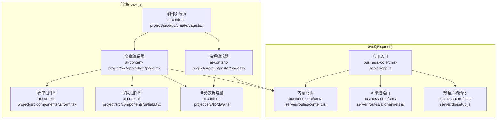
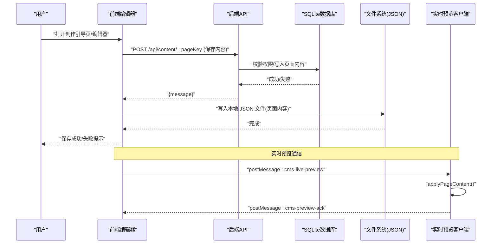
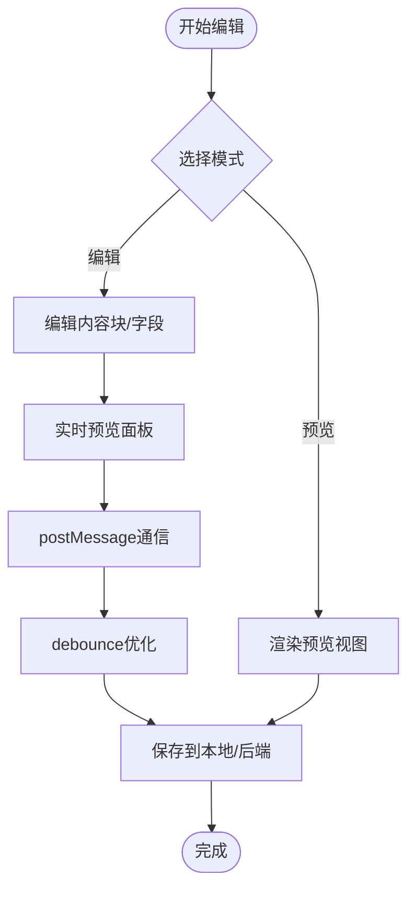
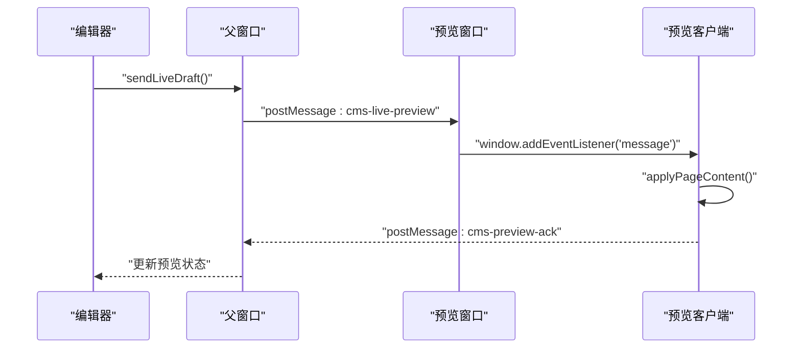
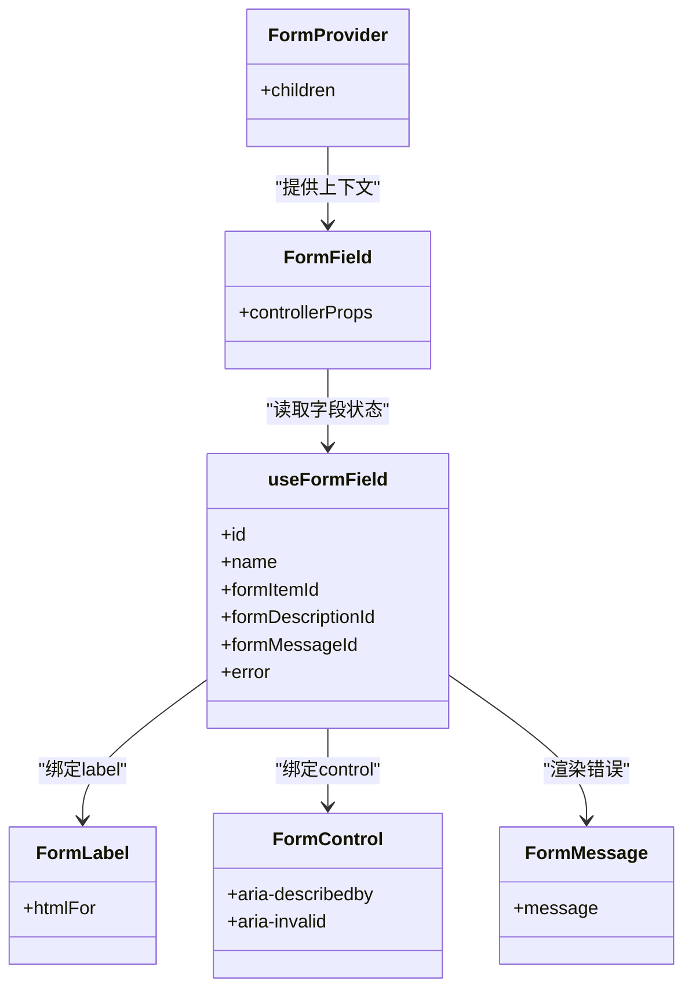
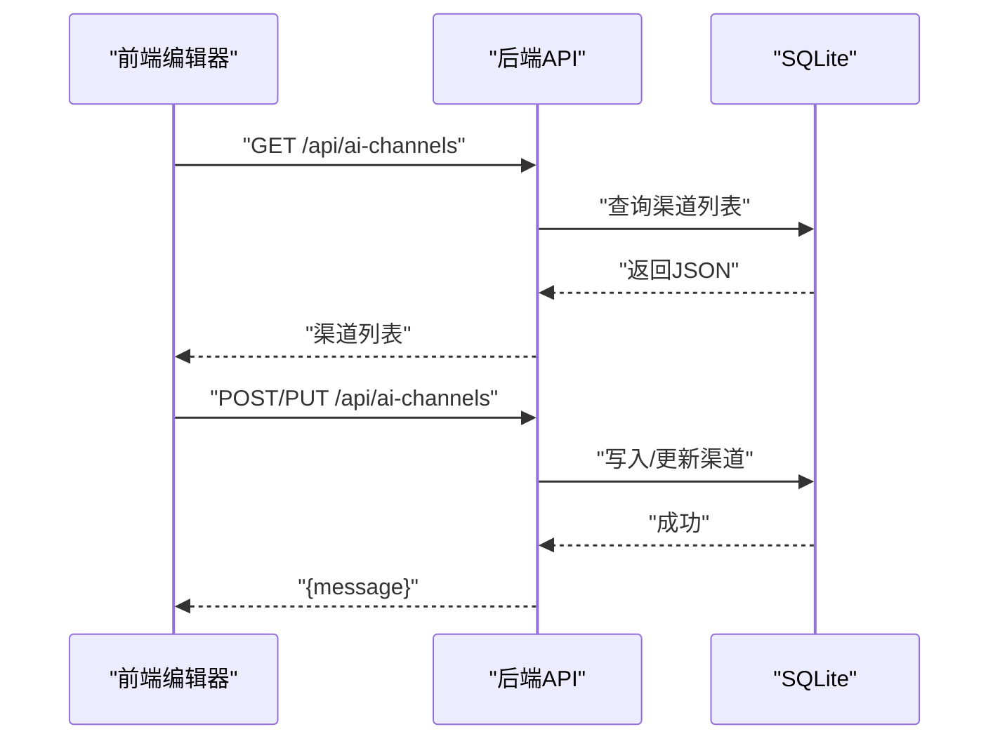
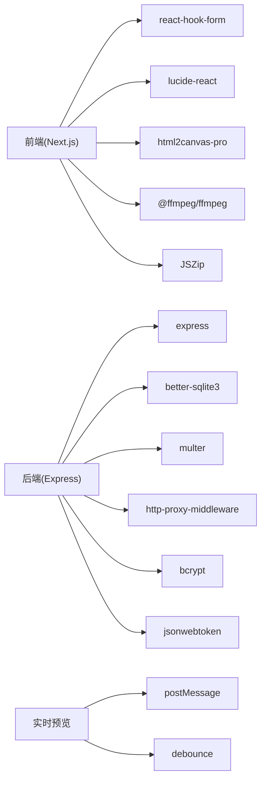

# 内容编辑器

<cite>
**本文档引用的文件**
- [ai-content-project/src/app/create/page.tsx](file://ai-content-project/src/app/create/page.tsx)
- [ai-content-project/src/app/article/page.tsx](file://ai-content-project/src/app/article/page.tsx)
- [ai-content-project/src/app/poster/page.tsx](file://ai-content-project/src/app/poster/page.tsx)
- [ai-content-project/src/components/ui/form.tsx](file://ai-content-project/src/components/ui/form.tsx)
- [ai-content-project/src/components/ui/field.tsx](file://ai-content-project/src/components/ui/field.tsx)
- [ai-content-project/src/lib/data.ts](file://ai-content-project/src/lib/data.ts)
- [business-core/cms-server/routes/content.js](file://business-core/cms-server/routes/content.js)
- [business-core/cms-server/routes/ai-channels.js](file://business-core/cms-server/routes/ai-channels.js)
- [business-core/cms-server/db/setup.js](file://business-core/cms-server/db/setup.js)
- [business-core/cms-server/app.js](file://business-core/cms-server/app.js)
- [business-core/cms-server-go/models/models.go](file://business-core/cms-server-go/models/models.go)
- [admin/assets/js/app.js](file://admin/assets/js/app.js)
- [cms-server/preview-client-v4.js](file://cms-server/preview-client-v4.js)
</cite>

## 更新摘要
**所做更改**
- 新增实时预览功能章节，涵盖 split-screen 编辑器布局、postMessage 通信机制、debounce 优化等特性
- 更新文章编辑器和海报编辑器的实时预览实现细节
- 增强用户交互设计章节，包含实时预览面板的状态管理和性能优化
- 更新架构总览图，反映实时预览的双向通信机制

## 目录
1. [简介](#简介)
2. [项目结构](#项目结构)
3. [核心组件](#核心组件)
4. [架构总览](#架构总览)
5. [详细组件分析](#详细组件分析)
6. [依赖分析](#依赖分析)
7. [性能考虑](#性能考虑)
8. [故障排查指南](#故障排查指南)
9. [结论](#结论)
10. [附录](#附录)

## 简介
本技术文档围绕"内容编辑器"模块展开，系统阐述基于 Next.js 的前端编辑器与 Node.js 后端 CMS 的协同设计与实现。重点覆盖：
- JSON 编辑器的数据结构与字段类型定义
- 表单验证与错误处理机制
- **新增** 实时预览功能：split-screen 编辑器布局、postMessage 通信机制、debounce 优化
- 实时预览与拖拽排序、批量操作、快捷键支持
- 与数据库的同步机制与冲突解决策略
- 扩展性与自定义配置选项

该编辑器包含三大页面：创作引导页（AI 提示词与内容生成）、文章编辑器（富文本块编辑与预览）、海报编辑器（多页海报生成与视频导出）。后端提供内容读写、AI 渠道配置、审计日志与静态资源托管等能力。

## 项目结构
前端采用 Next.js App Router，编辑器页面位于应用目录；UI 组件封装于 components/ui；业务数据常量与工具位于 src/lib。后端采用 Express + better-sqlite3，路由负责内容读写与 AI 渠道管理，数据库初始化脚本创建基础表与默认管理员。

**图表来源**
- [ai-content-project/src/app/create/page.tsx:1-761](file://ai-content-project/src/app/create/page.tsx#L1-L761)
- [ai-content-project/src/app/article/page.tsx:1-1026](file://ai-content-project/src/app/article/page.tsx#L1-L1026)
- [ai-content-project/src/app/poster/page.tsx:1-1443](file://ai-content-project/src/app/poster/page.tsx#L1-L1443)
- [ai-content-project/src/components/ui/form.tsx:1-168](file://ai-content-project/src/components/ui/form.tsx#L1-L168)
- [ai-content-project/src/components/ui/field.tsx:1-249](file://ai-content-project/src/components/ui/field.tsx#L1-L249)
- [ai-content-project/src/lib/data.ts:1-218](file://ai-content-project/src/lib/data.ts#L1-L218)
- [business-core/cms-server/app.js:1-315](file://business-core/cms-server/app.js#L1-L315)
- [business-core/cms-server/routes/content.js:1-104](file://business-core/cms-server/routes/content.js#L1-L104)
- [business-core/cms-server/routes/ai-channels.js:1-113](file://business-core/cms-server/routes/ai-channels.js#L1-L113)
- [business-core/cms-server/db/setup.js:1-115](file://business-core/cms-server/db/setup.js#L1-L115)

**章节来源**
- [ai-content-project/src/app/create/page.tsx:1-761](file://ai-content-project/src/app/create/page.tsx#L1-L761)
- [ai-content-project/src/app/article/page.tsx:1-1026](file://ai-content-project/src/app/article/page.tsx#L1-L1026)
- [ai-content-project/src/app/poster/page.tsx:1-1443](file://ai-content-project/src/app/poster/page.tsx#L1-L1443)
- [business-core/cms-server/app.js:1-315](file://business-core/cms-server/app.js#L1-L315)

## 核心组件
- 创作引导页：提供快捷提示词、AI 生成内容、类型选择（文章/海报）、页数配置与结果使用跳转。
- 文章编辑器：支持标题、摘要、标签、封面图、多种内容块（标题、段落、图片、列表、表格、提示、引用）的增删改查与拖拽排序，**新增** 实时预览面板与 split-screen 布局。
- 海报编辑器：支持多页海报（封面+内页）的标题、标签、背景、价格信息、分节内容编辑，支持图片上传与 Pexels 搜索，生成图片画廊与视频（WebM/MP4），音频 BGM 可选，**新增** 内置实时预览功能。
- 表单组件库：基于 react-hook-form 的 FormProvider、FormField、FormLabel、FormControl、FormMessage 等，统一错误渲染与无障碍属性。
- 字段组件库：Field、FieldLabel、FieldDescription、FieldError、FieldGroup 等，提供一致的字段布局与错误展示。
- 业务数据常量：内容来源、状态、分类、BGM、分享平台、海报标签生成等。

**章节来源**
- [ai-content-project/src/app/create/page.tsx:48-53](file://ai-content-project/src/app/create/page.tsx#L48-L53)
- [ai-content-project/src/app/article/page.tsx:38-48](file://ai-content-project/src/app/article/page.tsx#L38-L48)
- [ai-content-project/src/app/poster/page.tsx:43-54](file://ai-content-project/src/app/poster/page.tsx#L43-L54)
- [ai-content-project/src/components/ui/form.tsx:1-168](file://ai-content-project/src/components/ui/form.tsx#L1-L168)
- [ai-content-project/src/components/ui/field.tsx:1-249](file://ai-content-project/src/components/ui/field.tsx#L1-L249)
- [ai-content-project/src/lib/data.ts:1-218](file://ai-content-project/src/lib/data.ts#L1-L218)

## 架构总览
编辑器前后端通过 REST API 协作：前端负责 UI 与交互，后端负责内容持久化、权限校验与资源托管。AI 渠道配置由后端维护，编辑器通过接口读取与选择。**新增** 实时预览通过 postMessage 机制实现编辑器与预览页面的双向通信。

**图表来源**
- [business-core/cms-server/routes/content.js:67-101](file://business-core/cms-server/routes/content.js#L67-L101)
- [business-core/cms-server/app.js:155-161](file://business-core/cms-server/app.js#L155-L161)
- [business-core/cms-server/db/setup.js:14-107](file://business-core/cms-server/db/setup.js#L14-L107)
- [admin/assets/js/app.js:1218-1263](file://admin/assets/js/app.js#L1218-L1263)
- [cms-server/preview-client-v4.js:323-339](file://cms-server/preview-client-v4.js#L323-L339)

## 详细组件分析

### JSON 编辑器（文章/海报）
- 数据结构设计
  - 文章编辑器：标题、摘要、标签、封面图、内容块数组（含 heading、paragraph、image、list、table、tip、quote），支持图片描述、列表项、表格行列等。
  - 海报编辑器：封面层（主标题、副标题标签、背景、价格信息）与多内页（每页标题、背景、分节 heading 与 items），**新增** 内置实时预览功能。
- 字段类型与验证
  - 文章编辑器：标题/摘要/标签/封面图等基础字段，内容块编辑通过受控组件与局部更新函数实现。
  - 海报编辑器：内页分节 heading 与 items 的动态增删，价格项的金额/标签/说明字段。
- 实时预览
  - 文章编辑器：编辑/预览双模式，预览渲染函数根据块类型输出不同样式，**新增** split-screen 布局与 postMessage 通信。
  - 海报编辑器：html2canvas 截图生成画廊，MediaRecorder 合成 WebM，ffmpeg.wasm 转码 MP4，**新增** 内置实时预览面板。
- 拖拽排序与批量操作
  - 文章编辑器：通过块数组索引交换实现上下移动，支持在任意块后插入新块。
  - 海报编辑器：内页分节项的增删与逐项编辑。
- 快捷键支持
  - 文章编辑器：Ctrl/Cmd+Enter 发送/保存。
  - 海报编辑器：键盘快捷键未显式实现，可通过表单库与输入组件扩展。

**图表来源**
- [ai-content-project/src/app/article/page.tsx:255-262](file://ai-content-project/src/app/article/page.tsx#L255-L262)
- [ai-content-project/src/app/poster/page.tsx:463-535](file://ai-content-project/src/app/poster/page.tsx#L463-L535)
- [admin/assets/js/app.js:1095-1116](file://admin/assets/js/app.js#L1095-L1116)
- [admin/assets/js/app.js:1218-1263](file://admin/assets/js/app.js#L1218-L1263)

**章节来源**
- [ai-content-project/src/app/article/page.tsx:38-48](file://ai-content-project/src/app/article/page.tsx#L38-L48)
- [ai-content-project/src/app/article/page.tsx:227-262](file://ai-content-project/src/app/article/page.tsx#L227-L262)
- [ai-content-project/src/app/poster/page.tsx:159-191](file://ai-content-project/src/app/poster/page.tsx#L159-L191)
- [ai-content-project/src/app/poster/page.tsx:463-535](file://ai-content-project/src/app/poster/page.tsx#L463-L535)

### 实时预览功能详解

#### split-screen 编辑器布局
- 文章编辑器采用三栏布局：左侧编辑表单、中间内容块、右侧实时预览面板
- 海报编辑器采用左右布局：左侧编辑表单、右侧实时预览面板，支持页面切换与缩略图导航
- 预览面板采用 sticky 定位，确保滚动时预览始终可见

#### postMessage 通信机制
- 编辑器端：通过 `sendLiveDraft()` 函数收集当前草稿内容，使用 `postMessage` 发送到预览窗口
- 预览客户端：监听 `cms-live-preview` 消息类型，接收数据后调用 `applyPageContent()` 应用内容
- 双向确认：预览客户端应用完成后向编辑器发送 `cms-preview-ack` 确认消息

#### debounce 优化策略
- 输入事件防抖：对 JSON 字段变化使用 300ms 防抖，对其他输入框使用 100ms 防抖
- 状态反馈：实时预览状态通过 `previewStatus` 元素显示，包含"加载中"、"已连接"、"已同步"、"等待编辑..." 等状态
- 性能优化：避免频繁的 postMessage 调用，减少预览客户端的重复渲染

**图表来源**
- [admin/assets/js/app.js:1218-1263](file://admin/assets/js/app.js#L1218-L1263)
- [cms-server/preview-client-v4.js:323-339](file://cms-server/preview-client-v4.js#L323-L339)

**章节来源**
- [admin/assets/js/app.js:1060-1263](file://admin/assets/js/app.js#L1060-L1263)
- [admin/assets/js/app.js:1218-1263](file://admin/assets/js/app.js#L1218-L1263)
- [cms-server/preview-client-v4.js:323-339](file://cms-server/preview-client-v4.js#L323-L339)

### 表单验证与错误处理
- 表单组件库
  - FormProvider、FormField、useFormField、FormLabel、FormControl、FormMessage 等，统一错误渲染与无障碍属性。
  - 通过 react-hook-form 的 useFormContext/useFormState 获取字段状态与错误信息。
- 字段组件库
  - Field、FieldLabel、FieldDescription、FieldError、FieldGroup 等，提供一致的布局与错误展示。
- 错误处理机制
  - 表单层面：字段级错误聚合与去重展示，支持多条错误列表。
  - 编辑器层面：保存/生成过程中的状态反馈与进度提示。

**图表来源**
- [ai-content-project/src/components/ui/form.tsx:1-168](file://ai-content-project/src/components/ui/form.tsx#L1-L168)
- [ai-content-project/src/components/ui/field.tsx:186-235](file://ai-content-project/src/components/ui/field.tsx#L186-L235)

**章节来源**
- [ai-content-project/src/components/ui/form.tsx:1-168](file://ai-content-project/src/components/ui/form.tsx#L1-L168)
- [ai-content-project/src/components/ui/field.tsx:1-249](file://ai-content-project/src/components/ui/field.tsx#L1-L249)

### 与数据库的同步机制与冲突解决
- 内容读写
  - GET /api/content/:pageKey：读取页面 JSON（无需认证，支持预览）。
  - PUT /api/content/:pageKey：更新页面 JSON（需登录，且按角色与权限校验）。
- 权限与审计
  - 全局配置（nav/footer/consultation）仅超级管理员可写；普通页面需检查 page_permissions。
  - 审计日志记录用户操作，便于追踪。
- 冲突解决策略
  - 前端保存时先本地校验与预览，再发起 PUT 请求；后端写入文件系统与数据库，返回统一响应。
  - 建议在并发写入场景下引入版本号或时间戳字段，结合后端幂等写入与冲突提示。

```mermaid
sequenceDiagram
participant FE as "前端编辑器"
participant API as "后端API"
participant DB as "SQLite"
participant FS as "文件系统"
FE->>API : "PUT /api/content/ : pageKey"
API->>DB : "校验用户角色/页面权限"
DB-->>API : "通过/拒绝"
API->>FS : "写入 JSON 文件"
FS-->>API : "完成"
API-->>FE : "{message}"
```

**图表来源**
- [business-core/cms-server/routes/content.js:67-101](file://business-core/cms-server/routes/content.js#L67-L101)
- [business-core/cms-server/db/setup.js:18-68](file://business-core/cms-server/db/setup.js#L18-L68)

**章节来源**
- [business-core/cms-server/routes/content.js:1-104](file://business-core/cms-server/routes/content.js#L1-L104)
- [business-core/cms-server/db/setup.js:1-115](file://business-core/cms-server/db/setup.js#L1-L115)

### AI 渠道配置与内容生成
- AI 渠道管理
  - GET/POST/PUT/DELETE /api/ai-channels，支持设置默认渠道。
  - 渠道存储 model_list（JSON 数组），便于前端选择模型。
- 内容生成
  - 创作引导页根据用户输入与类型生成模拟结果，支持海报分页自动排版。
  - 海报编辑器支持音频 BGM 生成与视频合成导出。

**图表来源**
- [business-core/cms-server/routes/ai-channels.js:25-110](file://business-core/cms-server/routes/ai-channels.js#L25-L110)
- [business-core/cms-server/app.js:155-161](file://business-core/cms-server/app.js#L155-L161)

**章节来源**
- [business-core/cms-server/routes/ai-channels.js:1-113](file://business-core/cms-server/routes/ai-channels.js#L1-L113)
- [ai-content-project/src/app/create/page.tsx:88-152](file://ai-content-project/src/app/create/page.tsx#L88-L152)
- [ai-content-project/src/app/poster/page.tsx:56-126](file://ai-content-project/src/app/poster/page.tsx#L56-L126)

### 用户交互设计
- 拖拽排序
  - 文章编辑器：通过数组索引交换实现块级上下移动。
- 批量操作
  - 文章编辑器：列表/表格的批量增删项；海报编辑器：内页分节项的批量增删。
- 快捷键
  - 文章编辑器：Ctrl/Cmd+Enter 发送/保存。
  - 海报编辑器：未实现快捷键，可扩展。
- **新增** 实时预览交互
  - split-screen 布局：编辑器与预览面板并排显示，支持独立滚动
  - 状态指示：实时显示预览连接状态与同步状态
  - 性能优化：debounce 防抖减少频繁通信
  - 双向确认：预览客户端应用完成后发送确认消息

**章节来源**
- [ai-content-project/src/app/article/page.tsx:255-262](file://ai-content-project/src/app/article/page.tsx#L255-L262)
- [ai-content-project/src/app/article/page.tsx:410-622](file://ai-content-project/src/app/article/page.tsx#L410-L622)
- [ai-content-project/src/app/poster/page.tsx:357-461](file://ai-content-project/src/app/poster/page.tsx#L357-L461)
- [admin/assets/js/app.js:1060-1263](file://admin/assets/js/app.js#L1060-L1263)

### 使用示例与最佳实践
- 使用示例
  - 创作引导页：选择类型（文章/海报）与页数，输入提示词，点击"使用此内容"进入相应编辑器。
  - 文章编辑器：编辑标题/摘要/标签/封面图，添加/编辑内容块，切换预览模式，**新增** 启用实时预览功能，保存。
  - 海报编辑器：编辑封面与内页标题/背景/分节内容，**新增** 使用内置实时预览面板，生成图片画廊与视频，导出 MP4。
- 最佳实践
  - 数据绑定：使用受控组件与局部更新函数，避免不必要的重渲染。
  - 表单验证：结合表单组件库，统一错误展示与无障碍属性。
  - **新增** 实时预览：合理设置 debounce 时间，平衡响应速度与性能；确保预览状态反馈及时准确。
  - 性能优化：大列表/表格使用虚拟滚动或分页；图片上传采用懒加载与 CDN；**新增** 优化 postMessage 通信频率。
  - 安全：后端严格校验用户角色与页面权限，审计日志记录关键操作。

**章节来源**
- [ai-content-project/src/app/create/page.tsx:408-422](file://ai-content-project/src/app/create/page.tsx#L408-L422)
- [ai-content-project/src/app/article/page.tsx:264-271](file://ai-content-project/src/app/article/page.tsx#L264-L271)
- [ai-content-project/src/app/poster/page.tsx:438-461](file://ai-content-project/src/app/poster/page.tsx#L438-L461)

### 扩展性与自定义配置
- 扩展内容块类型：在文章编辑器中新增块类型时，需在类型枚举、渲染函数与编辑控件处同步扩展。
- 自定义字段：通过字段组件库与表单组件库组合，快速构建复杂表单。
- 配置项：BGM 选项、视频比例、分享平台等通过常量文件集中管理，便于扩展与维护。
- **新增** 实时预览扩展：可通过修改 postMessage 消息格式扩展预览功能，支持更多内容类型的实时渲染。

**章节来源**
- [ai-content-project/src/app/article/page.tsx:188-196](file://ai-content-project/src/app/article/page.tsx#L188-L196)
- [ai-content-project/src/lib/data.ts:137-174](file://ai-content-project/src/lib/data.ts#L137-L174)

## 依赖分析
- 前端依赖
  - Next.js、React、react-hook-form、lucide-react、html2canvas-pro、@ffmpeg/ffmpeg、JSZip 等。
- 后端依赖
  - Express、better-sqlite3、multer、http-proxy-middleware、bcrypt、jsonwebtoken 等。
- **新增** 实时预览依赖
  - postMessage API：浏览器原生跨窗口通信机制
  - debounce 函数：防抖优化，减少频繁通信
  - 预览客户端：独立的预览页面脚本，处理实时预览逻辑

**图表来源**
- [ai-content-project/package.json:15-76](file://ai-content-project/package.json#L15-L76)
- [business-core/cms-server/app.js:1-315](file://business-core/cms-server/app.js#L1-L315)
- [admin/assets/js/app.js:1095-1116](file://admin/assets/js/app.js#L1095-L1116)

**章节来源**
- [ai-content-project/package.json:1-100](file://ai-content-project/package.json#L1-L100)
- [business-core/cms-server/app.js:1-315](file://business-core/cms-server/app.js#L1-L315)

## 性能考虑
- 前端
  - 大量图片与视频处理时，建议采用懒加载与 CDN；html2canvas 截图与 MediaRecorder 合成视频应在空闲线程执行，避免阻塞 UI。
  - 列表/表格组件可采用虚拟化或分页，减少 DOM 节点数量。
  - **新增** 实时预览性能优化：合理设置 debounce 时间，避免过于频繁的 postMessage 调用；预览客户端应缓存已渲染的内容，减少重复计算。
- 后端
  - 文件上传限制大小与格式，防止恶意文件；数据库写入采用事务与幂等写入，降低锁竞争。
  - 预览客户端脚本禁用缓存，确保编辑器与预览一致性。
  - **新增** 实时预览通信优化：预览客户端应实现消息队列，处理可能的乱序消息；编辑器端应实现重连机制，处理预览窗口意外断开的情况。

## 故障排查指南
- 保存失败
  - 检查后端权限与页面权限配置；查看审计日志定位问题。
- 图片上传失败
  - 检查文件格式与大小限制；确认上传目录权限。
- 视频导出异常
  - 检查 ffmpeg.wasm 是否加载成功；确认浏览器支持 MediaRecorder 与 WebAssembly。
- 表单错误不显示
  - 检查表单组件库是否正确包裹；确认 useFormField 的上下文是否在 FormField 内。
- **新增** 实时预览问题排查
  - 检查 postMessage 通信是否正常：确认编辑器与预览窗口之间的跨域设置
  - 验证 debounce 设置：检查防抖时间是否合适，避免过于频繁或过于延迟的更新
  - 确认预览状态反馈：检查 `previewStatus` 元素是否正确显示状态信息
  - 检查预览客户端初始化：确认预览页面是否正确加载并初始化

**章节来源**
- [business-core/cms-server/routes/content.js:67-101](file://business-core/cms-server/routes/content.js#L67-L101)
- [business-core/cms-server/app.js:24-53](file://business-core/cms-server/app.js#L24-L53)
- [ai-content-project/src/app/poster/page.tsx:271-292](file://ai-content-project/src/app/poster/page.tsx#L271-L292)
- [admin/assets/js/app.js:1218-1263](file://admin/assets/js/app.js#L1218-L1263)
- [cms-server/preview-client-v4.js:323-339](file://cms-server/preview-client-v4.js#L323-L339)

## 结论
内容编辑器模块通过清晰的前后端职责划分、统一的表单与字段组件库、完善的实时预览与导出能力，实现了从创作到发布的完整闭环。**新增** 的实时预览功能通过 split-screen 布局、postMessage 通信机制和 debounce 优化，显著提升了用户体验和编辑效率。配合后端的权限校验与审计日志，保障了内容安全与可追溯性。未来可在快捷键支持、块类型扩展、冲突检测与版本控制、以及实时预览功能的进一步优化等方面持续增强。

## 附录
- 数据库模型（Go 版本）
  - 用户、审计日志、AI 渠道、页面权限等模型定义，便于后端 Go 侧复用。

**章节来源**
- [business-core/cms-server-go/models/models.go:1-145](file://business-core/cms-server-go/models/models.go#L1-L145)