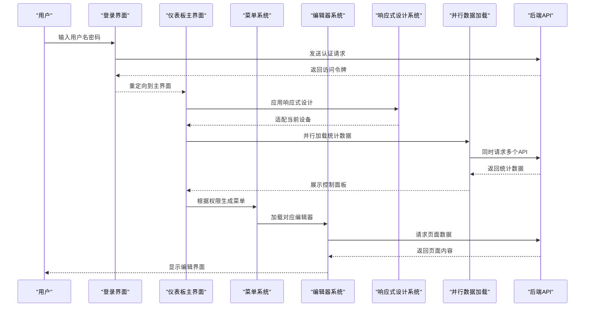
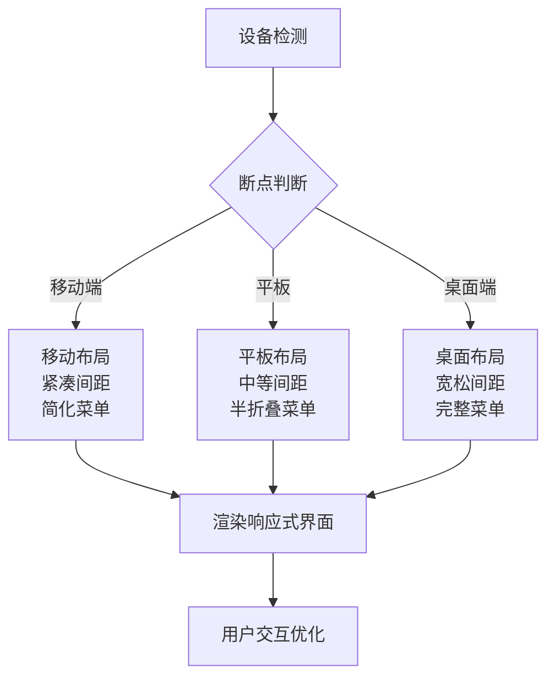
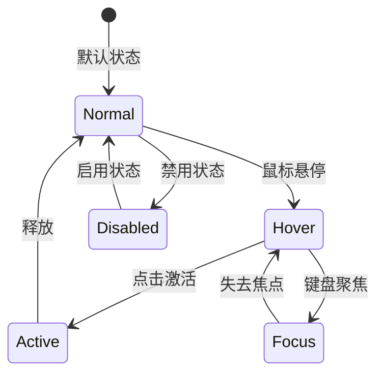
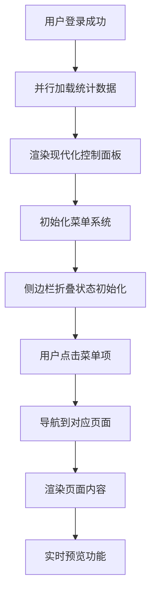
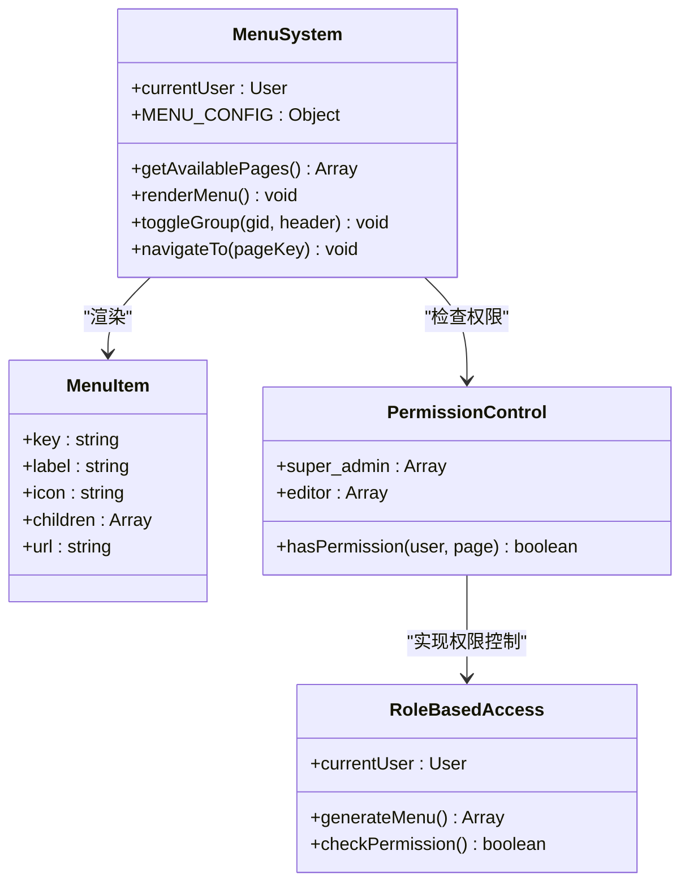
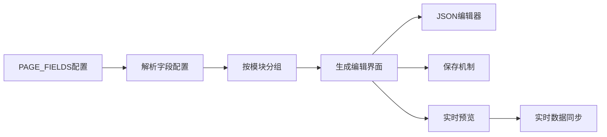
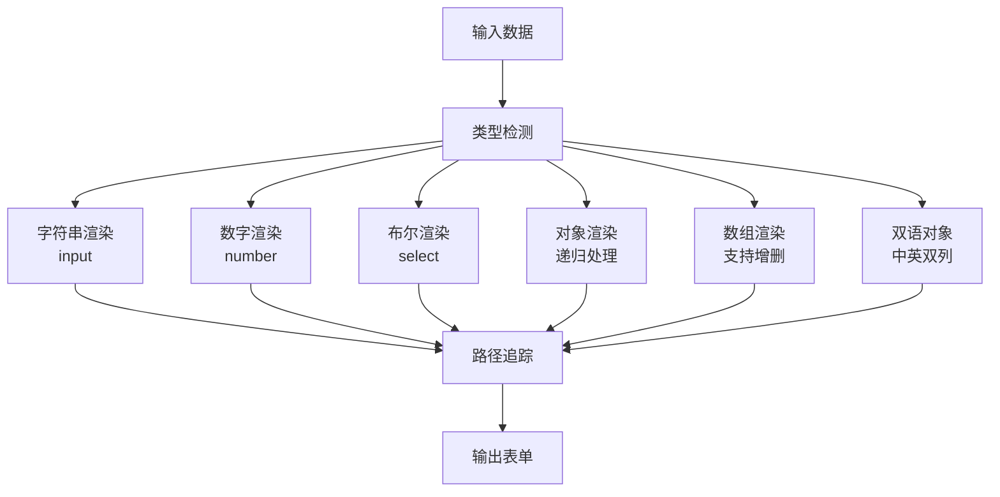
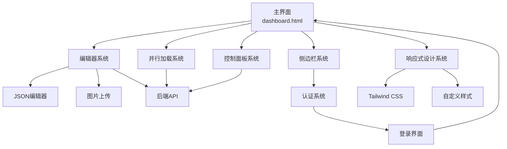

# 界面架构设计

<cite>
**本文档引用的文件**
- [dashboard.html](file://admin/dashboard.html)
- [index.html](file://admin/index.html)
- [app.js](file://admin/assets/js/app.js)
- [json-editor.js](file://admin/assets/js/json-editor.js)
- [global.html](file://admin/assets/js/pages/global.html)
- [tailwind.css](file://local-cdn/tailwind.css)
</cite>

## 更新摘要
**变更内容**
- 仪表盘界面架构获得重大UI改进，包括响应式设计增强、按钮样式优化、布局间距改进、更好的用户交互模式
- 现代化控制面板设计采用增强的响应式网格布局，支持更灵活的屏幕适配
- 按钮样式系统得到全面优化，包括悬停效果、焦点状态和禁用状态的统一设计
- 布局间距系统标准化，提供一致的边距和内边距规范
- 用户交互模式得到改善，包括更直观的菜单折叠、模块展开/折叠和实时预览功能

## 目录
1. [简介](#简介)
2. [项目结构](#项目结构)
3. [核心组件](#核心组件)
4. [架构概览](#架构概览)
5. [详细组件分析](#详细组件分析)
6. [依赖关系分析](#依赖关系分析)
7. [性能考量](#性能考量)
8. [故障排查指南](#故障排查指南)
9. [结论](#结论)

## 简介
本项目采用纯原生JavaScript实现的现代化管理后台界面架构，基于可折叠侧边栏导航系统，实现了动态菜单渲染、模块化内容编辑和响应式设计。系统通过纯原生JavaScript与HTML/CSS结合，提供完整的后台管理功能，包括用户权限管理、页面内容编辑、全局配置管理和操作日志审计等模块。最新版本引入了全面的UI改进，包括增强的响应式设计、优化的按钮样式系统、标准化的布局间距和改进的用户交互模式，显著提升了用户体验和界面一致性。

## 项目结构
项目采用三层架构设计，核心目录与职责如下：
- admin/dashboard.html：主界面，包含现代化控制面板、可折叠侧边栏、动态菜单和内容区域
- admin/index.html：登录界面，提供用户身份验证
- admin/assets/js/app.js：主应用逻辑，包含页面编辑器、图片上传、保存机制
- admin/assets/js/json-editor.js：通用JSON编辑器，支持复杂数据结构编辑
- admin/assets/js/pages/global.html：全局配置编辑器页面

```mermaid
graph TB
subgraph "管理后台界面"
DASHBOARD["仪表板主界面<br/>dashboard.html"]
LOGIN["登录界面<br/>index.html"]
END
subgraph "应用逻辑层"
APPJS["主应用逻辑<br/>app.js"]
JSONEDITOR["JSON编辑器<br/>json-editor.js"]
GLOBALHTML["全局配置页面<br/>pages/global.html"]
END
subgraph "核心功能模块"
SIDEBAR["可折叠侧边栏<br/>导航系统"]
MENU["动态菜单渲染<br/>权限控制"]
EDITOR["模块化编辑器<br/>页面内容管理"]
UPLOAD["图片上传<br/>文件处理"]
SAVE["保存机制<br/>数据持久化"]
DASHBOARD["控制面板<br/>现代化设计"]
PARALLEL["并行数据加载<br/>性能优化"]
RESPONSIVE["响应式设计<br/>增强UI体验"]
BUTTONS["按钮样式系统<br/>统一交互设计"]
LAYOUT["布局间距系统<br/>标准化设计规范"]
INTERACTION["用户交互模式<br/>改进的用户体验"]
END
DASHBOARD --> SIDEBAR
DASHBOARD --> MENU
DASHBOARD --> EDITOR
DASHBOARD --> DASHBOARD
DASHBOARD --> PARALLEL
DASHBOARD --> RESPONSIVE
DASHBOARD --> BUTTONS
DASHBOARD --> LAYOUT
DASHBOARD --> INTERACTION
LOGIN --> DASHBOARD
APPJS --> EDITOR
APPJS --> UPLOAD
APPJS --> SAVE
JSONEDITOR --> EDITOR
GLOBALHTML --> EDITOR
```

**图表来源**
- [dashboard.html:140-162](file://admin/dashboard.html#L140-L162)
- [index.html:76-131](file://admin/index.html#L76-L131)
- [app.js:161-187](file://admin/assets/js/app.js#L161-L187)
- [json-editor.js:12-17](file://admin/assets/js/json-editor.js#L12-L17)

## 核心组件

### 响应式设计增强系统
- **增强的网格布局**：采用CSS Grid实现统计卡片的自适应排列，支持2-4列布局的智能切换
- **多断点适配**：针对不同屏幕尺寸提供优化的布局表现，包括移动端、平板和桌面端
- **弹性容器设计**：使用Flexbox实现内容区域的自适应调整，确保在各种设备上的最佳显示效果
- **触摸友好的交互**：优化移动端触摸操作，提供更好的移动设备用户体验

### 按钮样式优化系统
- **统一的设计语言**：采用ZSTS品牌色彩(#006341)的渐变按钮设计，提供一致的品牌识别
- **悬停动画效果**：通过CSS过渡效果实现按钮的悬停状态变化，包括颜色深浅变化和阴影效果
- **焦点状态管理**：为键盘导航用户提供清晰的焦点指示，提升可访问性
- **禁用状态处理**：为不可用按钮提供视觉反馈，避免用户误操作

### 布局间距标准化系统
- **一致的边距规范**：建立从2px到80px的完整边距体系，确保界面元素间的比例协调
- **内边距统一标准**：为不同组件类型提供标准化的内边距，包括表单控件、卡片和按钮
- **网格间距系统**：采用8px为基础的网格系统，确保界面元素的对齐和平衡
- **响应式间距调整**：根据不同屏幕尺寸自动调整间距，保持视觉平衡

### 改进的用户交互模式
- **智能菜单折叠**：侧边栏支持完整的折叠/展开功能，包括图标隐藏、标签省略和按钮旋转动画
- **模块化内容管理**：编辑器支持模块的展开/折叠，提供更好的内容组织和浏览体验
- **实时预览增强**：改进的实时预览功能，支持更流畅的内容同步和状态反馈
- **表单交互优化**：为各种表单控件提供更好的交互反馈，包括输入验证和错误提示

### 现代化控制面板设计
- **响应式网格布局**：采用CSS Grid实现统计卡片的自适应排列
- **渐变背景设计**：使用ZSTS品牌色彩的渐变背景，提升视觉层次
- **实时数据展示**：支持并行数据加载，显示管理页面、系统账号、AI渠道和操作日志统计
- **快捷操作入口**：提供常用功能的一键访问，包括编辑首页、导航配置、账号管理等
- **页面概况导航**：快速跳转到各个页面的编辑界面

### 并行数据加载优化
- **Promise.all并发请求**：同时加载多个API数据源，显著提升页面加载速度
- **错误容错处理**：每个API请求都有独立的错误捕获，避免单点故障影响整体性能
- **数据合并策略**：将不同来源的数据进行智能合并和展示
- **超时控制机制**：为每个请求设置超时时间，防止长时间挂起

### 角色权限驱动的菜单系统
- **超级管理员权限**：拥有完整的系统管理权限，可访问所有功能模块
- **编辑员权限控制**：根据用户权限动态生成可访问的页面菜单
- **动态菜单渲染**：根据用户角色和权限动态生成侧边栏菜单结构
- **分组展开控制**：支持菜单分组的展开/折叠功能

### 模块化编辑器系统
- **字段配置驱动**：基于PAGE_FIELDS配置，支持文本、图片、链接、JSON等多种字段类型
- **模块分组显示**：按功能模块（hero、section、faq等）自动分组显示
- **实时预览功能**：支持编辑器与预览页面的实时同步
- **结构化数据编辑**：内置JSON编辑器，支持复杂数据结构的可视化编辑
- **保存机制优化**：提供悬浮保存条，支持一键保存和预览功能

### 增强的JSON编辑器系统
- **多数据类型支持**：支持字符串、数字、布尔、对象、数组、双语对象等数据类型的可视化编辑
- **递归渲染机制**：通过renderValue()递归渲染不同数据类型，支持嵌套结构的增删改查
- **实时数据绑定**：自动生成表单控件，支持实时数据绑定和验证
- **路径追踪系统**：通过setValueByPath和getValueByPath实现精确的数据路径管理

### 图片上传与处理系统
- **文件上传优化**：支持JPG、PNG、GIF、WebP、SVG等格式，提供实时上传状态反馈
- **预览功能增强**：上传过程中显示加载状态，成功后显示缩略图和文件路径
- **路径解析优化**：自动解析图片URL，支持相对路径和绝对路径的智能转换
- **错误处理完善**：完善的上传失败处理和用户反馈机制

### 全局配置管理系统
- **导航菜单配置**：支持固定导航项的标签文字和链接地址编辑
- **页脚配置管理**：支持公司描述、联系方式、快速导航等配置的双语编辑
- **咨询弹窗配置**：支持弹窗标题、描述、电话和二维码配置的可视化编辑
- **Tab切换界面**：通过选项卡切换不同的配置面板，提供清晰的界面组织

**章节来源**
- [dashboard.html:28-59](file://admin/dashboard.html#L28-L59)
- [dashboard.html:170-197](file://admin/dashboard.html#L170-L197)
- [dashboard.html:382-543](file://admin/dashboard.html#L382-L543)
- [app.js:161-187](file://admin/assets/js/app.js#L161-L187)
- [app.js:936-1074](file://admin/assets/js/app.js#L936-L1074)
- [json-editor.js:12-132](file://admin/assets/js/json-editor.js#L12-L132)

## 架构概览
系统采用三层架构设计，前端使用纯原生JavaScript实现，后端通过RESTful API提供数据访问。核心交互链路包括：
- 用户通过登录界面进行身份验证，获取访问令牌
- 主界面加载后根据用户权限动态生成侧边栏菜单
- 点击菜单项加载对应的编辑器页面
- 编辑器通过API与后端进行数据交换
- 支持图片上传、JSON编辑、模块化内容管理等功能
- 控制面板采用并行数据加载，提供实时统计数据展示
- 响应式设计确保在各种设备上的最佳用户体验



**图表来源**
- [index.html:97-128](file://admin/index.html#L97-L128)
- [dashboard.html:200-227](file://admin/dashboard.html#L200-L227)
- [dashboard.html:388-400](file://admin/dashboard.html#L388-L400)
- [app.js:936-1074](file://admin/assets/js/app.js#L936-L1074)

## 详细组件分析

### 响应式设计增强系统
- **功能要点**：多断点适配、弹性布局、触摸友好交互
- **关键实现**：使用CSS Grid和Flexbox实现响应式布局，配合媒体查询实现断点适配
- **交互模式**：根据屏幕尺寸自动调整布局密度和元素大小，提供最佳的用户体验
- **性能优化**：通过CSS变量和预计算的样式规则，减少JavaScript的样式计算开销



**图表来源**
- [dashboard.html:28-59](file://admin/dashboard.html#L28-L59)
- [dashboard.html:200-227](file://admin/dashboard.html#L200-L227)
- [dashboard.html:388-400](file://admin/dashboard.html#L388-L400)

**章节来源**
- [dashboard.html:28-59](file://admin/dashboard.html#L28-L59)
- [dashboard.html:200-227](file://admin/dashboard.html#L200-L227)
- [dashboard.html:382-543](file://admin/dashboard.html#L382-L543)

### 按钮样式优化系统
- **功能要点**：统一设计语言、悬停动画、焦点状态、禁用状态
- **关键实现**：通过CSS变量定义颜色和状态，使用过渡效果实现平滑的状态变化
- **交互模式**：提供清晰的视觉反馈，包括颜色变化、阴影效果和动画过渡
- **可访问性**：确保键盘导航和屏幕阅读器的兼容性



**图表来源**
- [dashboard.html:155-158](file://admin/dashboard.html#L155-L158)
- [app.js:76-142](file://admin/assets/js/app.js#L76-L142)
- [app.js:1050-1056](file://admin/assets/js/app.js#L1050-L1056)

**章节来源**
- [dashboard.html:155-158](file://admin/dashboard.html#L155-L158)
- [app.js:76-142](file://admin/assets/js/app.js#L76-L142)
- [app.js:1050-1056](file://admin/assets/js/app.js#L1050-L1056)

### 布局间距标准化系统
- **功能要点**：边距规范、内边距标准、网格间距、响应式调整
- **关键实现**：建立8px为基础的网格系统，提供从2px到80px的完整间距体系
- **设计原则**：确保界面元素间的视觉平衡和比例协调
- **一致性保证**：通过CSS变量和预定义类名，确保所有组件使用统一的间距规范

**章节来源**
- [dashboard.html:28-59](file://admin/dashboard.html#L28-L59)
- [app.js:76-142](file://admin/assets/js/app.js#L76-L142)
- [json-editor.js:74-115](file://admin/assets/js/json-editor.js#L74-L115)

### 改进的用户交互模式
- **功能要点**：智能菜单折叠、模块展开/折叠、实时预览、表单交互优化
- **关键实现**：通过CSS过渡和JavaScript事件处理，实现流畅的用户交互体验
- **交互反馈**：提供即时的视觉和触觉反馈，增强用户的操作信心
- **无障碍设计**：确保所有交互模式对残障用户友好

**章节来源**
- [dashboard.html:287-289](file://admin/dashboard.html#L287-L289)
- [dashboard.html:388-400](file://admin/dashboard.html#L388-L400)
- [app.js:1095-1116](file://admin/assets/js/app.js#L1095-L1116)

### 现代化仪表板主界面（Dashboard）
- **功能要点**：现代化控制面板、可折叠侧边栏、动态菜单、内容区域、用户信息显示
- **关键实现**：采用Tailwind CSS实现响应式设计，通过CSS Grid布局实现统计卡片的自适应排列
- **交互模式**：点击菜单项进行页面切换，支持面包屑导航和实时预览功能
- **性能优化**：使用Promise.all进行并行数据加载，提升页面响应速度



**图表来源**
- [dashboard.html:200-227](file://admin/dashboard.html#L200-L227)
- [dashboard.html:287-289](file://admin/dashboard.html#L287-L289)
- [dashboard.html:388-400](file://admin/dashboard.html#L388-L400)

**章节来源**
- [dashboard.html:140-162](file://admin/dashboard.html#L140-L162)
- [dashboard.html:200-227](file://admin/dashboard.html#L200-L227)
- [dashboard.html:382-543](file://admin/dashboard.html#L382-L543)

### 角色权限驱动的动态菜单系统
- **功能要点**：基于用户角色生成菜单、支持分组展开/折叠、动态高亮当前页面
- **关键实现**：使用getAvailablePages()根据权限过滤菜单项，通过toggleGroup()控制分组展开
- **权限控制**：超级管理员可访问所有功能，编辑员只能访问授权的页面内容
- **交互模式**：点击分组头部展开/折叠子菜单，点击菜单项进行页面导航



**图表来源**
- [dashboard.html:229-237](file://admin/dashboard.html#L229-L237)
- [dashboard.html:240-278](file://admin/dashboard.html#L240-L278)
- [dashboard.html:280-285](file://admin/dashboard.html#L280-L285)

**章节来源**
- [dashboard.html:170-197](file://admin/dashboard.html#L170-L197)
- [dashboard.html:229-237](file://admin/dashboard.html#L229-L237)
- [dashboard.html:240-278](file://admin/dashboard.html#L240-L278)

### 模块化编辑器系统
- **功能要点**：按模块分组显示编辑字段、支持多种字段类型、提供保存和预览功能
- **关键实现**：使用PAGE_FIELDS配置定义字段结构，通过renderPageEditor()动态生成编辑界面
- **实时预览**：支持编辑器与预览页面的实时同步，提升编辑效率
- **交互模式**：支持模块折叠/展开、一键保存、预览前台页面



**图表来源**
- [app.js:824-825](file://admin/assets/js/app.js#L824-L825)
- [app.js:936-1074](file://admin/assets/js/app.js#L936-L1074)
- [app.js:1070-1112](file://admin/assets/js/app.js#L1070-L1112)

**章节来源**
- [app.js:936-1074](file://admin/assets/js/app.js#L936-L1074)
- [app.js:1076-1131](file://admin/assets/js/app.js#L1076-L1131)
- [app.js:1188-1260](file://admin/assets/js/app.js#L1188-L1260)

### 增强的JSON编辑器系统
- **功能要点**：支持字符串、数字、布尔、对象、数组、双语对象等数据类型的可视化编辑
- **关键实现**：通过renderValue()递归渲染不同数据类型，支持嵌套结构的增删改查
- **路径追踪**：通过setValueByPath和getValueByPath实现精确的数据路径管理
- **交互模式**：自动生成表单控件，支持实时数据绑定和验证



**图表来源**
- [json-editor.js:20-54](file://admin/assets/js/json-editor.js#L20-L54)
- [json-editor.js:135-153](file://admin/assets/js/json-editor.js#L135-L153)
- [json-editor.js:156-210](file://admin/assets/js/json-editor.js#L156-L210)
- [json-editor.js:227-251](file://admin/assets/js/json-editor.js#L227-L251)

**章节来源**
- [json-editor.js:12-132](file://admin/assets/js/json-editor.js#L12-L132)
- [json-editor.js:227-251](file://admin/assets/js/json-editor.js#L227-L251)

### 并行数据加载优化系统
- **功能要点**：同时加载多个API数据源、错误容错处理、超时控制机制
- **关键实现**：使用Promise.all进行并发请求，每个请求都有独立的错误捕获
- **性能优化**：显著提升页面加载速度，改善用户体验
- **交互模式**：并行加载统计数据，实时展示在控制面板中

**章节来源**
- [dashboard.html:388-400](file://admin/dashboard.html#L388-L400)
- [dashboard.html:382-543](file://admin/dashboard.html#L382-L543)

### 图片上传处理系统
- **功能要点**：支持多种图片格式上传、实时预览、错误处理和用户反馈
- **关键实现**：通过handleImageUpload()处理文件上传，使用FormData进行数据传输
- **交互模式**：点击上传按钮选择文件，显示上传进度，成功后更新预览和路径显示

**章节来源**
- [app.js:48-71](file://admin/assets/js/app.js#L48-L71)
- [app.js:41-46](file://admin/assets/js/app.js#L41-L46)

### 全局配置管理系统
- **功能要点**：导航菜单配置、页脚配置、咨询弹窗配置的可视化编辑
- **关键实现**：通过renderGlobalEditor()生成配置界面，支持Tab切换和数据保存
- **交互模式**：点击Tab切换不同配置面板，编辑完成后一键保存

**章节来源**
- [app.js:161-187](file://admin/assets/js/app.js#L161-L187)
- [app.js:365-375](file://admin/assets/js/app.js#L365-L375)

## 依赖关系分析
- **组件耦合**：主界面依赖菜单系统和编辑器系统，编辑器系统依赖JSON编辑器和API接口
- **状态管理**：通过localStorage管理用户状态和页面状态，避免刷新丢失
- **外部依赖**：主要依赖浏览器原生API，无第三方框架依赖
- **性能优化**：通过并行数据加载和模块化设计，提升系统响应速度
- **响应式支持**：通过Tailwind CSS和自定义样式，提供完整的响应式设计支持



**图表来源**
- [dashboard.html:140-162](file://admin/dashboard.html#L140-L162)
- [index.html:97-128](file://admin/index.html#L97-L128)
- [app.js:161-187](file://admin/assets/js/app.js#L161-L187)
- [dashboard.html:388-400](file://admin/dashboard.html#L388-L400)

## 性能考量
- **内存管理**：通过模块化设计，按需加载编辑器内容，避免一次性加载所有数据
- **渲染优化**：使用CSS Grid和Flexbox实现高效的布局，避免复杂的DOM操作
- **缓存策略**：localStorage缓存用户状态和令牌，减少重复认证开销
- **并行加载**：使用Promise.all进行并发数据请求，显著提升页面响应速度
- **响应式优化**：通过媒体查询和现代CSS特性实现良好的移动端适配
- **样式优化**：使用CSS变量和预计算样式，减少运行时计算开销
- **交互性能**：通过CSS过渡和硬件加速，确保流畅的用户交互体验

## 故障排查指南
- **菜单不显示**：检查getAvailablePages()权限过滤逻辑，确认用户角色和权限配置
- **编辑器空白**：检查PAGE_FIELDS配置是否正确，确认API返回的数据格式
- **图片上传失败**：检查文件大小限制、格式支持和服务器配置
- **侧边栏无法折叠**：检查CSS类切换逻辑和事件绑定是否正常
- **控制面板数据加载失败**：检查并行请求的错误处理和超时设置
- **实时预览功能异常**：检查postMessage通信和iframe加载状态
- **响应式布局问题**：检查CSS媒体查询和断点设置
- **按钮样式异常**：检查CSS变量和状态类的正确应用
- **间距不一致**：检查CSS变量和间距类的使用是否符合规范

**章节来源**
- [dashboard.html:229-237](file://admin/dashboard.html#L229-L237)
- [app.js:936-1074](file://admin/assets/js/app.js#L936-L1074)
- [app.js:48-71](file://admin/assets/js/app.js#L48-L71)
- [dashboard.html:388-400](file://admin/dashboard.html#L388-L400)

## 结论
本项目通过纯原生JavaScript实现了功能完整的现代化管理后台界面架构，经过本次UI改进后具有以下优势：
- **响应式设计增强**：全面的多断点适配，确保在各种设备上的最佳用户体验
- **统一的视觉语言**：标准化的按钮样式、布局间距和交互反馈，提升界面一致性
- **优化的用户交互**：智能的菜单折叠、模块展开/折叠和实时预览功能
- **轻量高效**：无第三方框架依赖，运行效率高，体积小
- **功能完整**：涵盖用户管理、内容编辑、配置管理等核心功能
- **性能卓越**：采用并行数据加载优化，显著提升页面响应速度
- **权限安全**：基于角色的权限控制系统，确保数据安全
- **用户体验佳**：现代化UI设计，响应式布局，流畅的交互体验
- **扩展性强**：模块化设计便于功能扩展和维护

该架构适合中小型项目的后台管理需求，为后续的功能扩展和性能优化提供了良好的基础。最新的UI改进进一步提升了系统的实用性和用户体验，为用户提供了更加专业和现代化的管理界面。