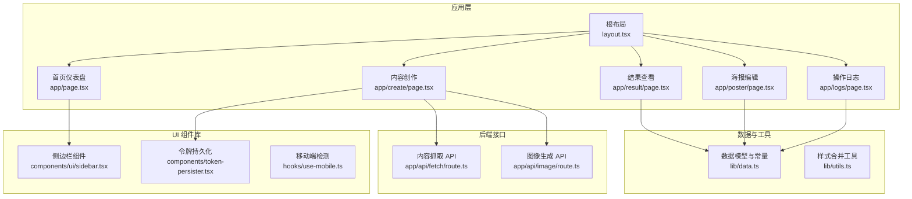
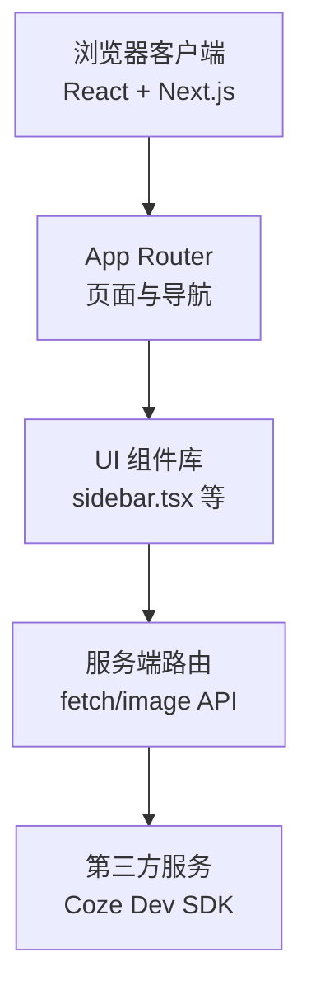
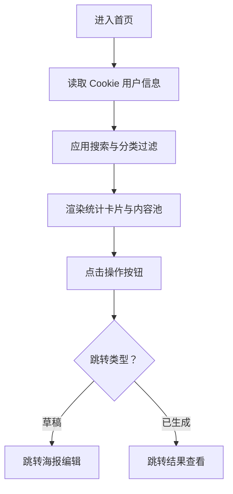
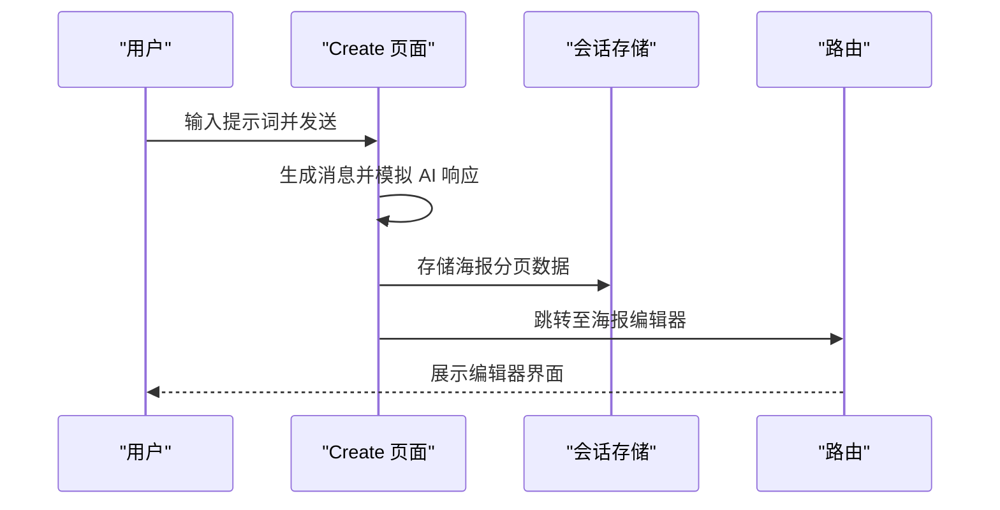
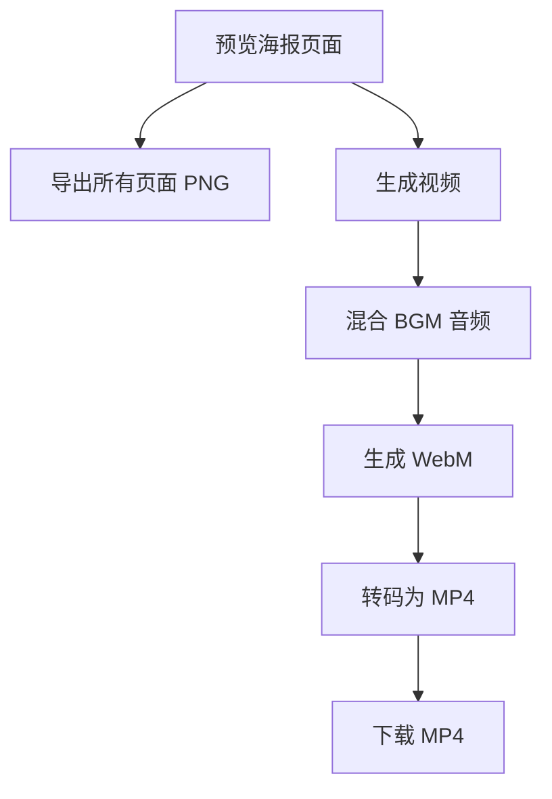
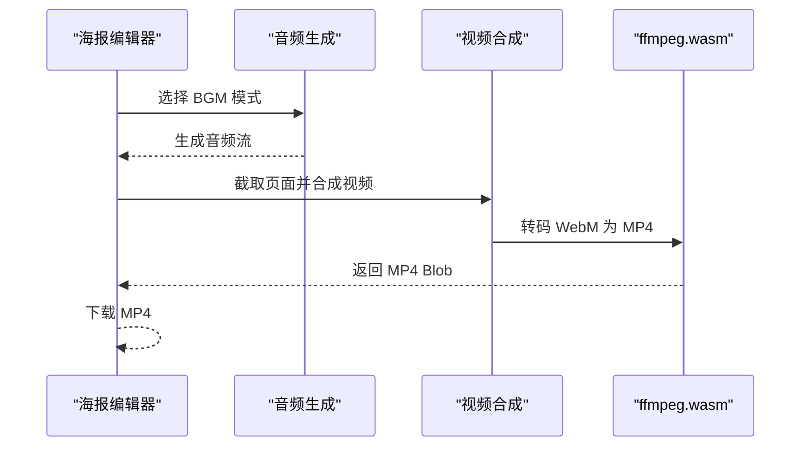
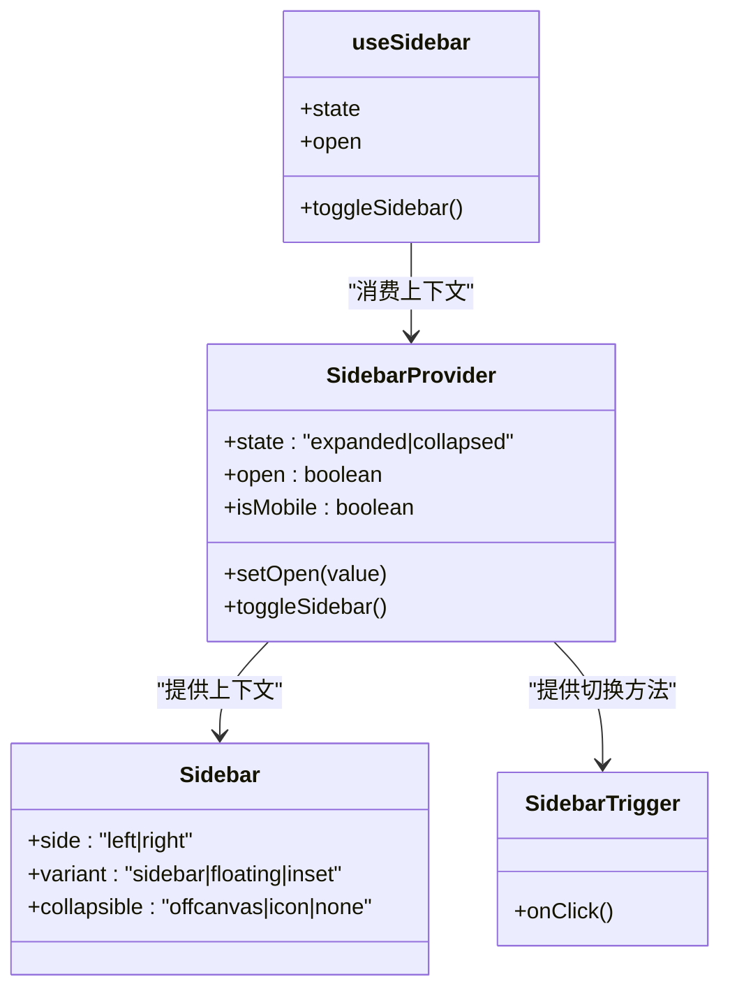
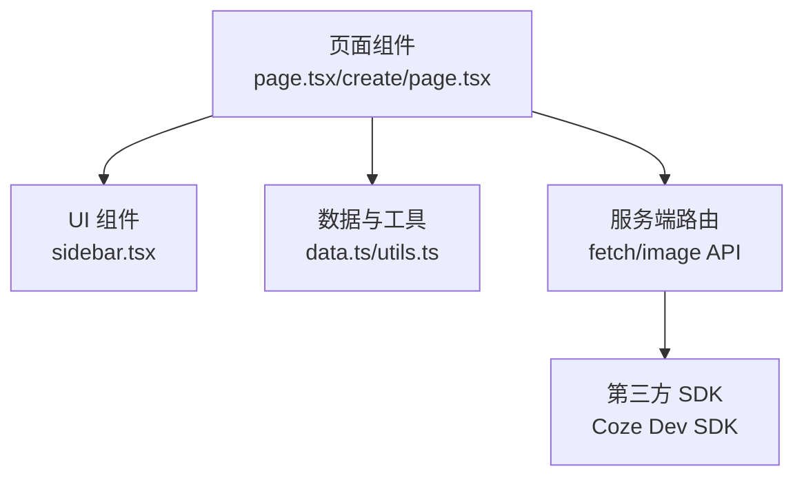

# 界面架构设计

<cite>
**本文档引用的文件**
- [layout.tsx](file://ai-content-project/src/app/layout.tsx)
- [page.tsx](file://ai-content-project/src/app/page.tsx)
- [create/page.tsx](file://ai-content-project/src/app/create/page.tsx)
- [result/page.tsx](file://ai-content-project/src/app/result/page.tsx)
- [poster/page.tsx](file://ai-content-project/src/app/poster/page.tsx)
- [logs/page.tsx](file://ai-content-project/src/app/logs/page.tsx)
- [sidebar.tsx](file://ai-content-project/src/components/ui/sidebar.tsx)
- [token-persister.tsx](file://ai-content-project/src/components/token-persister.tsx)
- [use-mobile.ts](file://ai-content-project/src/hooks/use-mobile.ts)
- [data.ts](file://ai-content-project/src/lib/data.ts)
- [utils.ts](file://ai-content-project/src/lib/utils.ts)
- [route.ts (fetch)](file://ai-content-project/src/app/api/fetch/route.ts)
- [route.ts (image)](file://ai-content-project/src/app/api/image/route.ts)
- [package.json](file://ai-content-project/package.json)
- [next.config.ts](file://ai-content-project/next.config.ts)
</cite>

## 目录
1. [简介](#简介)
2. [项目结构](#项目结构)
3. [核心组件](#核心组件)
4. [架构概览](#架构概览)
5. [详细组件分析](#详细组件分析)
6. [依赖关系分析](#依赖关系分析)
7. [性能考量](#性能考量)
8. [故障排查指南](#故障排查指南)
9. [结论](#结论)

## 简介
本项目采用现代前端技术栈构建管理后台界面，基于 Next.js 16 的 App Router 实现 SPA 架构。系统通过纯原生 JavaScript 与 React 组件结合，实现动态路由、状态管理、组件化布局与响应式设计。核心功能覆盖内容创作（AI 辅助）、海报编辑与视频生成、日志审计等模块，同时提供与后端 API 的安全交互机制。

## 项目结构
项目采用按功能域划分的目录组织方式，核心目录与职责如下：
- ai-content-project/src/app：页面与路由定义，使用 App Router 的嵌套路由与客户端组件
- ai-content-project/src/components/ui：可复用 UI 组件库，包含侧边栏、对话框、表单控件等
- ai-content-project/src/lib：数据模型与工具函数，统一管理类型定义与业务逻辑
- ai-content-project/src/hooks：自定义 Hook，封装移动端检测、状态持久化等逻辑
- ai-content-project/src/app/api：服务端路由（Server Routes），封装对外 API 调用
- ai-content-project/public/scripts：构建与开发脚本
- ai-content-project/next.config.ts：Next.js 配置，包含基础路径、图像远程模式等

**图表来源**
- [layout.tsx:15-33](file://ai-content-project/src/app/layout.tsx#L15-L33)
- [page.tsx:45-197](file://ai-content-project/src/app/page.tsx#L45-L197)
- [create/page.tsx:59-761](file://ai-content-project/src/app/create/page.tsx#L59-L761)
- [result/page.tsx:227-800](file://ai-content-project/src/app/result/page.tsx#L227-L800)
- [poster/page.tsx:203-800](file://ai-content-project/src/app/poster/page.tsx#L203-L800)
- [logs/page.tsx:34-193](file://ai-content-project/src/app/logs/page.tsx#L34-L193)
- [sidebar.tsx:154-254](file://ai-content-project/src/components/ui/sidebar.tsx#L154-L254)
- [token-persister.tsx:15-37](file://ai-content-project/src/components/token-persister.tsx#L15-L37)
- [use-mobile.ts:5-18](file://ai-content-project/src/hooks/use-mobile.ts#L5-L18)
- [data.ts:1-218](file://ai-content-project/src/lib/data.ts#L1-L218)
- [utils.ts:4-6](file://ai-content-project/src/lib/utils.ts#L4-L6)
- [route.ts (fetch):4-24](file://ai-content-project/src/app/api/fetch/route.ts#L4-L24)
- [route.ts (image):4-35](file://ai-content-project/src/app/api/image/route.ts#L4-L35)

**章节来源**
- [layout.tsx:1-34](file://ai-content-project/src/app/layout.tsx#L1-L34)
- [next.config.ts:3-20](file://ai-content-project/next.config.ts#L3-L20)

## 核心组件
- 根布局与全局样式：负责应用元数据、开发者调试工具与令牌持久化，确保客户端导航时的身份验证可用性。
- 仪表盘首页：展示内容统计、搜索过滤与分类筛选，支持跳转至内容创作入口。
- 内容创作页面：集成聊天式交互、快捷提示词、类型选择（文章/海报）与分页配置，支持会话状态管理与结果使用。
- 结果查看页面：提供海报预览、分页浏览、视频生成与导出、平台分发配置。
- 海报编辑页面：支持封面与内页编辑、背景替换、价格与联系方式配置、BGM 音频生成、视频合成与下载。
- 日志审计页面：展示操作日志、统计卡片、搜索与筛选功能，支持超级管理员清空日志。
- 侧边栏组件：提供桌面端与移动端的侧边栏切换、键盘快捷键、状态持久化与响应式布局。
- 令牌持久化组件：解决 iframe 内客户端导航丢失 token 的问题，通过 URL 查询参数写入 Cookie。
- 数据模型与工具：统一定义内容项类型、状态映射、平台配置与标签生成算法；提供样式类名合并工具。

**章节来源**
- [layout.tsx:7-33](file://ai-content-project/src/app/layout.tsx#L7-L33)
- [page.tsx:45-197](file://ai-content-project/src/app/page.tsx#L45-L197)
- [create/page.tsx:59-761](file://ai-content-project/src/app/create/page.tsx#L59-L761)
- [result/page.tsx:227-800](file://ai-content-project/src/app/result/page.tsx#L227-L800)
- [poster/page.tsx:203-800](file://ai-content-project/src/app/poster/page.tsx#L203-L800)
- [logs/page.tsx:34-193](file://ai-content-project/src/app/logs/page.tsx#L34-L193)
- [sidebar.tsx:154-254](file://ai-content-project/src/components/ui/sidebar.tsx#L154-L254)
- [token-persister.tsx:15-37](file://ai-content-project/src/components/token-persister.tsx#L15-L37)
- [data.ts:1-218](file://ai-content-project/src/lib/data.ts#L1-L218)
- [utils.ts:4-6](file://ai-content-project/src/lib/utils.ts#L4-L6)

## 架构概览
系统采用前后端分离的 SPA 架构，前端使用 Next.js App Router 管理路由与客户端状态，后端通过 Server Routes 提供受控的 API 调用能力。核心交互链路包括：
- 客户端组件通过 Next.js Navigation API 进行页面切换与状态传递
- 令牌持久化组件确保跨页面的身份验证一致性
- UI 组件库提供一致的交互体验与响应式布局
- 服务端路由封装第三方 SDK，实现内容抓取与图像生成

**图表来源**
- [create/page.tsx:376-422](file://ai-content-project/src/app/create/page.tsx#L376-L422)
- [route.ts (fetch):4-24](file://ai-content-project/src/app/api/fetch/route.ts#L4-L24)
- [route.ts (image):4-35](file://ai-content-project/src/app/api/image/route.ts#L4-L35)

## 详细组件分析

### 仪表盘首页（Dashboard）
- 功能要点：顶部导航、统计卡片、内容池展示、搜索与分类筛选、创建入口跳转
- 关键实现：使用本地 Cookie 读取用户信息，基于状态过滤内容项，动态渲染内容行组件
- 交互模式：点击“查看结果”或“生成内容”跳转至对应页面，支持面包屑与返回导航

**图表来源**
- [page.tsx:45-197](file://ai-content-project/src/app/page.tsx#L45-L197)

**章节来源**
- [page.tsx:45-197](file://ai-content-project/src/app/page.tsx#L45-L197)

### 内容创作页面（Create）
- 功能要点：聊天式交互、快捷提示词、类型选择（文章/海报）、分页配置、结果使用与复制
- 关键实现：使用状态管理维护消息历史，模拟 AI 响应生成内容与海报分页数据，通过 sessionStorage 传递海报数据
- 交互模式：回车发送、复制内容、继续优化、使用结果跳转编辑器

**图表来源**
- [create/page.tsx:376-422](file://ai-content-project/src/app/create/page.tsx#L376-L422)

**章节来源**
- [create/page.tsx:59-761](file://ai-content-project/src/app/create/page.tsx#L59-L761)

### 结果查看页面（Result）
- 功能要点：海报预览与分页、视频生成与导出、平台分发配置、复制内容与链接
- 关键实现：使用 html2canvas 截图合成视频，支持多种 BGM 与音频轨道混合，生成 WebM 并可转码为 MP4
- 交互模式：点击“导出 PNG”批量下载、生成视频预览、下载 MP4

**图表来源**
- [result/page.tsx:292-483](file://ai-content-project/src/app/result/page.tsx#L292-L483)

**章节来源**
- [result/page.tsx:227-800](file://ai-content-project/src/app/result/page.tsx#L227-L800)

### 海报编辑页面（Poster）
- 功能要点：封面与内页编辑、背景替换、价格与联系方式配置、BGM 音频生成、视频合成与下载
- 关键实现：使用 Web Audio API 生成阿拉伯风格 BGM，ffmpeg.wasm 在浏览器内进行视频转码，JSZip 打包图片资源
- 交互模式：上传自定义背景、编辑内页内容、生成画廊预览、在线预览视频、下载 MP4

**图表来源**
- [poster/page.tsx:462-535](file://ai-content-project/src/app/poster/page.tsx#L462-L535)

**章节来源**
- [poster/page.tsx:203-800](file://ai-content-project/src/app/poster/page.tsx#L203-L800)

### 日志审计页面（Logs）
- 功能要点：操作日志展示、统计卡片、搜索与筛选、清空日志（超级管理员）
- 关键实现：使用 useMemo 进行前端过滤，格式化时间戳，支持按操作类型筛选
- 交互模式：搜索框实时过滤、下拉选择动作类型、清空日志确认

**章节来源**
- [logs/page.tsx:34-193](file://ai-content-project/src/app/logs/page.tsx#L34-L193)

### 侧边栏组件（Sidebar）
- 功能要点：桌面端与移动端响应式布局、状态持久化、键盘快捷键、子组件组合
- 关键实现：使用 Context 传递状态，Cookie 记录展开/收起状态，移动端使用抽屉式弹窗
- 交互模式：点击触发器切换、键盘 Ctrl/Cmd + B 快速切换

**图表来源**
- [sidebar.tsx:56-152](file://ai-content-project/src/components/ui/sidebar.tsx#L56-L152)
- [sidebar.tsx:154-254](file://ai-content-project/src/components/ui/sidebar.tsx#L154-L254)
- [sidebar.tsx:256-280](file://ai-content-project/src/components/ui/sidebar.tsx#L256-L280)

**章节来源**
- [sidebar.tsx:154-254](file://ai-content-project/src/components/ui/sidebar.tsx#L154-L254)

### 令牌持久化组件（TokenPersister）
- 功能要点：从 URL 查询参数读取 token 并写入 Cookie，解决 iframe 内客户端导航丢失 token 的问题
- 关键实现：监听 searchParams 变化，避免重复写入相同 token，使用 Lax 策略保证跨页面携带
- 交互模式：首次进入携带 token 的 URL 自动写入 Cookie，后续导航自动携带

**章节来源**
- [token-persister.tsx:15-37](file://ai-content-project/src/components/token-persister.tsx#L15-L37)

### 数据模型与工具（Data & Utils）
- 数据模型：统一定义内容项类型、来源与状态映射、平台配置与标签生成算法
- 工具函数：提供样式类名合并工具，简化 Tailwind CSS 类拼接

**章节来源**
- [data.ts:1-218](file://ai-content-project/src/lib/data.ts#L1-L218)
- [utils.ts:4-6](file://ai-content-project/src/lib/utils.ts#L4-L6)

## 依赖关系分析
- 组件耦合：页面组件依赖 UI 组件库与数据模型，服务端路由依赖第三方 SDK
- 状态管理：页面内部使用 React Hooks 管理状态，跨页面通过 URL 参数与 sessionStorage 传递
- 外部依赖：Next.js Navigation API、html2canvas、JSZip、@ffmpeg/ffmpeg、Web Audio API

**图表来源**
- [page.tsx:45-197](file://ai-content-project/src/app/page.tsx#L45-L197)
- [create/page.tsx:59-761](file://ai-content-project/src/app/create/page.tsx#L59-L761)
- [sidebar.tsx:154-254](file://ai-content-project/src/components/ui/sidebar.tsx#L154-L254)
- [data.ts:1-218](file://ai-content-project/src/lib/data.ts#L1-L218)
- [route.ts (fetch):4-24](file://ai-content-project/src/app/api/fetch/route.ts#L4-L24)
- [route.ts (image):4-35](file://ai-content-project/src/app/api/image/route.ts#L4-L35)

**章节来源**
- [package.json:15-75](file://ai-content-project/package.json#L15-L75)

## 性能考量
- 路由与渲染优化：使用 Next.js App Router 的客户端组件与 Suspense，减少首屏阻塞
- 图像与视频处理：在浏览器内使用 html2canvas 截图与 MediaRecorder 录制，避免服务端压力；ffmpeg.wasm 转码在客户端完成
- 状态持久化：通过 Cookie 与 sessionStorage 降低重复计算与网络请求
- 响应式设计：移动端检测 Hook 与 Tailwind CSS 媒体查询，确保在不同设备上的良好体验

## 故障排查指南
- 令牌丢失：检查 TokenPersister 是否正确写入 Cookie，确认 URL 中 token 参数是否存在
- 导出失败：检查 html2canvas 截图是否成功，确认浏览器允许跨域与弹窗；视频转码失败时查看 ffmpeg.wasm 日志
- 视频生成异常：确认 BGM 音频生成是否成功，检查 MediaRecorder 兼容性与 MIME 类型支持
- 移动端布局问题：确认 use-mobile Hook 是否正确检测断点，检查侧边栏 Cookie 状态

**章节来源**
- [token-persister.tsx:15-37](file://ai-content-project/src/components/token-persister.tsx#L15-L37)
- [result/page.tsx:292-483](file://ai-content-project/src/app/result/page.tsx#L292-L483)
- [poster/page.tsx:271-292](file://ai-content-project/src/app/poster/page.tsx#L271-L292)
- [use-mobile.ts:5-18](file://ai-content-project/src/hooks/use-mobile.ts#L5-L18)

## 结论
本项目通过 Next.js App Router 实现了现代化的 SPA 界面架构，结合自研 UI 组件库与服务端路由，提供了从内容创作到结果分发的完整工作流。系统在性能、可维护性与用户体验方面均具备良好表现，适合在管理后台场景中推广使用。