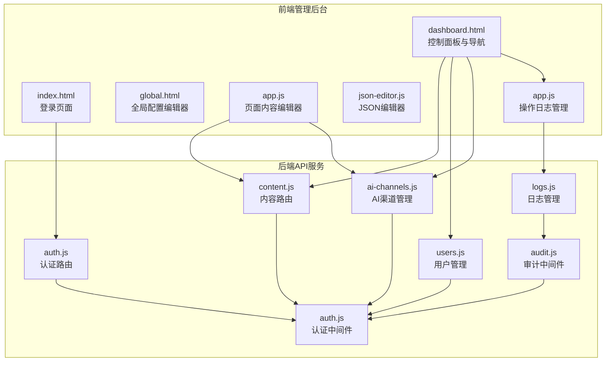
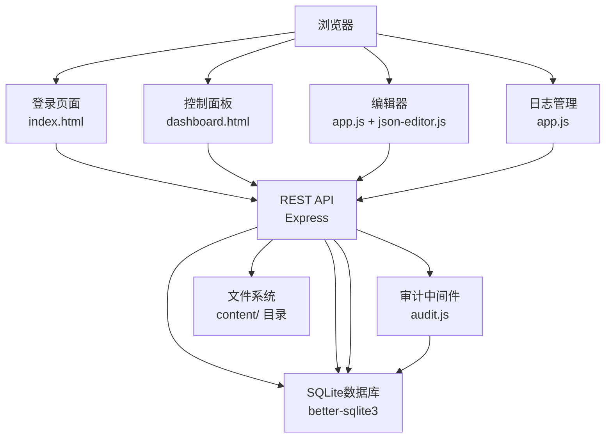
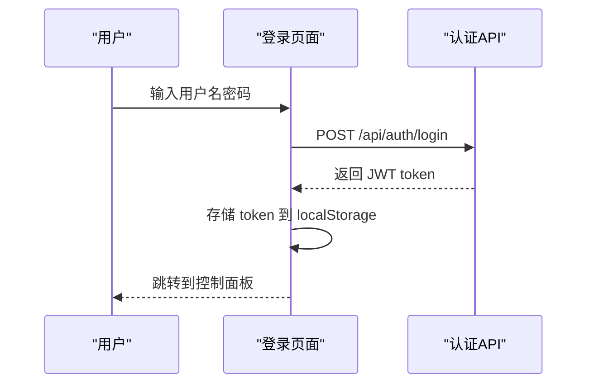
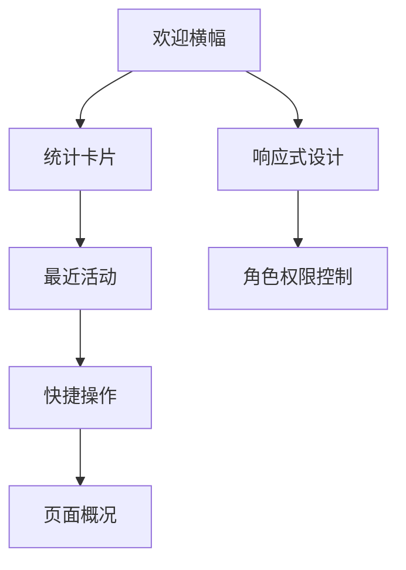
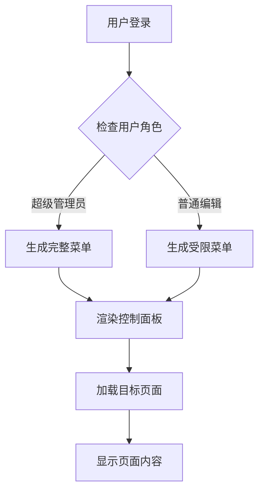
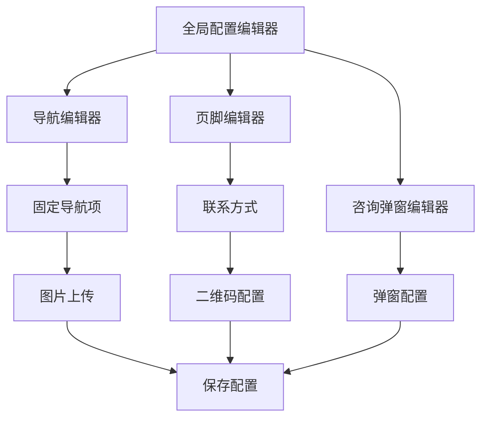
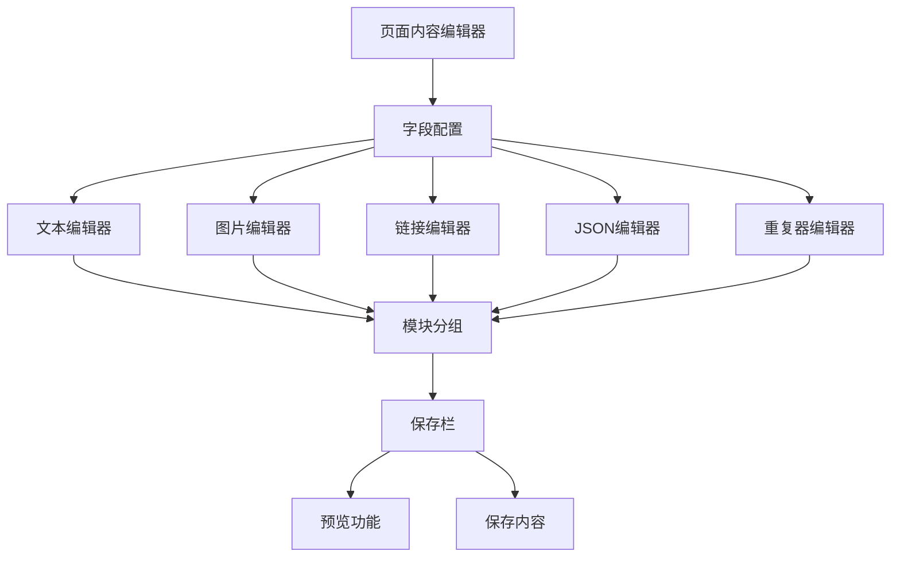
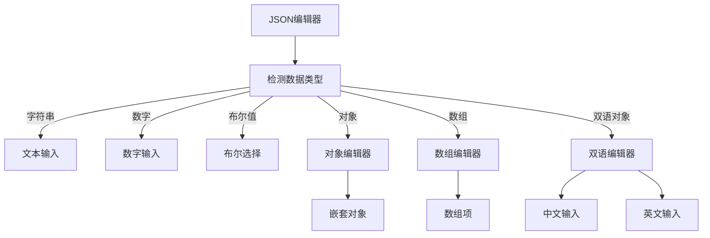
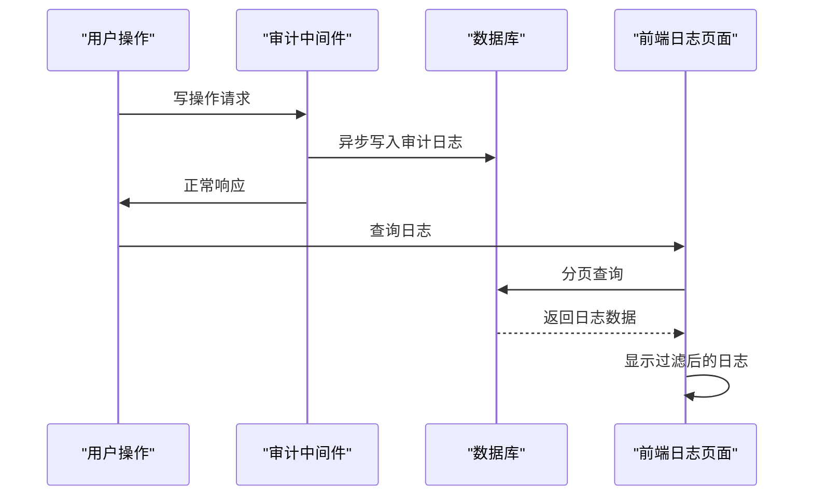
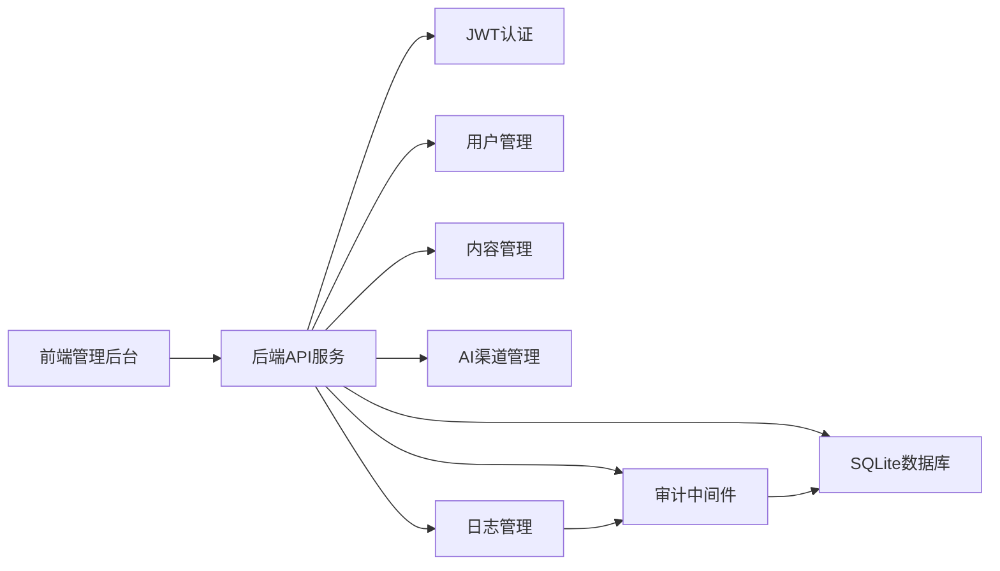

# 管理后台系统

<cite>
**本文档引用的文件**
- [dashboard.html](file://admin/dashboard.html)
- [app.js](file://admin/assets/js/app.js)
- [index.html](file://admin/index.html)
- [global.html](file://admin/assets/js/pages/global.html)
- [json-editor.js](file://admin/assets/js/json-editor.js)
- [content.js](file://cms-server/routes/content.js)
- [auth.js](file://cms-server/routes/auth.js)
- [users.js](file://cms-server/routes/users.js)
- [ai-channels.js](file://cms-server/routes/ai-channels.js)
- [logs.js](file://cms-server/routes/logs.js)
- [auth.js](file://cms-server/middleware/auth.js)
- [audit.js](file://cms-server/middleware/audit.js)
- [setup.js](file://cms-server/db/setup.js)
</cite>

## 更新摘要
**变更内容**
- 仪表盘从简单欢迎页面升级为完整的控制面板系统，新增统计卡片、最近活动日志、快捷操作入口、响应式设计和角色权限控制
- 新增操作日志系统的完整前端实现，包括实时日志加载、高级过滤功能、分页显示和日志清理机制
- 增强审计中间件，实现自动日志记录和异步写入机制
- 完善日志查询API，支持多条件过滤和分页查询
- 添加日志清理功能，仅超级管理员可执行

## 目录
1. [简介](#简介)
2. [项目结构](#项目结构)
3. [核心组件](#核心组件)
4. [架构总览](#架构总览)
5. [详细组件分析](#详细组件分析)
6. [依赖关系分析](#依赖关系分析)
7. [性能考虑](#性能考虑)
8. [故障排除指南](#故障排除指南)
9. [结论](#结论)
10. [附录](#附录)

## 简介
本系统是一个基于原生 JavaScript 的内容管理系统（CMS）管理后台，采用 SPA 架构设计，结合纯原生 JavaScript 实现动态路由与界面交互。系统包含全局配置管理、页面内容编辑器、用户权限管理、AI 渠道配置与操作日志等功能模块，支持从静态页面内容到结构化数据的完整编辑工作流。

**更新** 系统现已具备完善的控制面板功能，能够实时展示系统状态、用户操作历史和关键统计数据，提供强大的日志监控和管理能力。

## 项目结构
系统分为前端管理后台与后端 API 服务两部分：
- 前端管理后台位于 admin 目录，使用原生 JavaScript 实现 SPA，包含登录页面、仪表盘、全局配置编辑器、页面内容编辑器、操作日志管理等。
- 后端 API 服务位于 cms-server 目录，提供 REST API 接口、静态资源托管、权限控制、审计日志记录与查询。

**图表来源**
- [index.html:1-132](file://admin/index.html#L1-L132)
- [dashboard.html:1-767](file://admin/dashboard.html#L1-L767)
- [global.html:1-262](file://admin/assets/js/pages/global.html#L1-L262)
- [app.js:1-1564](file://admin/assets/js/app.js#L1-L1564)
- [json-editor.js:1-260](file://admin/assets/js/json-editor.js#L1-L260)
- [content.js:1-104](file://cms-server/routes/content.js#L1-L104)
- [auth.js:1-99](file://cms-server/routes/auth.js#L1-L99)
- [users.js:1-154](file://cms-server/routes/users.js#L1-L154)
- [ai-channels.js:1-113](file://cms-server/routes/ai-channels.js#L1-L113)
- [logs.js:1-59](file://cms-server/routes/logs.js#L1-L59)
- [auth.js:1-86](file://cms-server/middleware/auth.js#L1-L86)
- [audit.js:1-75](file://cms-server/middleware/audit.js#L1-L75)

## 核心组件
- 登录认证：基于 JWT 的用户认证系统，支持用户名密码登录与会话保持。
- **控制面板系统**：完整的仪表盘界面，包含统计卡片、最近活动日志、快捷操作入口和页面概况。
- 仪表盘导航：动态菜单生成，根据用户权限显示可访问的页面。
- 全局配置编辑器：支持导航菜单、页脚配置、咨询弹窗的可视化编辑。
- 页面内容编辑器：基于配置式字段定义的页面内容编辑器，支持文本、图片、链接、JSON 结构化数据编辑。
- 用户权限管理：支持用户创建、权限分配、密码重置等管理功能。
- AI 渠道配置：支持 AI 服务渠道的添加、编辑、删除与默认设置。
- **操作日志系统**：实时记录用户操作历史，支持高级过滤、分页查询、日志清理等完整功能。

**章节来源**
- [index.html:94-129](file://admin/index.html#L94-L129)
- [dashboard.html:382-543](file://admin/dashboard.html#L382-L543)
- [dashboard.html:147-251](file://admin/dashboard.html#L147-L251)
- [global.html:133-261](file://admin/assets/js/pages/global.html#L133-L261)
- [app.js:161-375](file://admin/assets/js/app.js#L161-L375)
- [json-editor.js:11-260](file://admin/assets/js/json-editor.js#L11-L260)
- [users.js:26-154](file://cms-server/routes/users.js#L26-L154)
- [ai-channels.js:25-113](file://cms-server/routes/ai-channels.js#L25-L113)
- [logs.js:20-59](file://cms-server/routes/logs.js#L20-L59)

## 架构总览
系统采用前后端分离架构，前端使用原生 JavaScript 实现 SPA，后端提供 REST API：
- 前端 SPA：原生 JavaScript 实现路由与组件渲染，通过 fetch API 调用后端接口。
- 后端 API：Express 提供认证、内容管理、用户管理、AI 渠道管理与日志查询。
- 数据存储：SQLite 存储用户、权限、内容配置、审计日志与 AI 渠道信息。
- 文件存储：静态文件存储在 content 目录，支持图片上传与管理。

**图表来源**
- [dashboard.html:177-205](file://admin/dashboard.html#L177-L205)
- [app.js:365-375](file://admin/assets/js/app.js#L365-L375)
- [content.js:48-101](file://cms-server/routes/content.js#L48-L101)
- [auth.js:22-66](file://cms-server/routes/auth.js#L22-L66)
- [audit.js:46-72](file://cms-server/middleware/audit.js#L46-L72)

## 详细组件分析

### 登录认证系统
- 支持用户名密码登录，使用 JWT 进行会话管理。
- 登录成功后存储 token 和用户信息到 localStorage。
- 前端启动时验证 token 并恢复用户会话。

**图表来源**
- [index.html:97-128](file://admin/index.html#L97-L128)
- [auth.js:22-66](file://cms-server/routes/auth.js#L22-L66)

**章节来源**
- [index.html:94-129](file://admin/index.html#L94-L129)
- [auth.js:22-66](file://cms-server/routes/auth.js#L22-L66)

### 控制面板系统
**更新** 控制面板系统现已升级为完整的仪表盘界面：

- **统计卡片**：显示管理页面总数、系统账号数、AI 渠道数和操作日志总数。
- **欢迎横幅**：个性化欢迎信息，显示当前用户和角色信息。
- **最近活动**：实时显示最近的操作日志，支持查看全部。
- **快捷操作**：提供常用功能的快速入口，如编辑首页内容、导航栏配置、账号管理等。
- **页面概况**：显示所有可编辑页面的快速链接。
- **响应式设计**：支持桌面端和移动端布局，侧边栏可折叠。
- **角色权限控制**：根据用户角色显示不同的功能模块。

**图表来源**
- [dashboard.html:418-459](file://admin/dashboard.html#L418-L459)
- [dashboard.html:464-493](file://admin/dashboard.html#L464-L493)
- [dashboard.html:495-541](file://admin/dashboard.html#L495-L541)

**章节来源**
- [dashboard.html:382-543](file://admin/dashboard.html#L382-L543)
- [dashboard.html:389-400](file://admin/dashboard.html#L389-L400)
- [dashboard.html:418-459](file://admin/dashboard.html#L418-L459)
- [dashboard.html:464-493](file://admin/dashboard.html#L464-L493)
- [dashboard.html:495-541](file://admin/dashboard.html#L495-L541)

### 仪表盘与导航系统
- 动态菜单生成：根据用户角色和权限动态生成可访问的菜单项。
- 页面路由：支持全局配置、页面内容、用户管理、AI 渠道、操作日志等页面。
- 权限控制：超级管理员拥有所有权限，普通编辑者只能访问授权页面。
- **响应式布局**：支持侧边栏折叠，适配不同屏幕尺寸。

**图表来源**
- [dashboard.html:177-215](file://admin/dashboard.html#L177-L215)
- [dashboard.html:254-352](file://admin/dashboard.html#L254-L352)

**章节来源**
- [dashboard.html:147-251](file://admin/dashboard.html#L147-L251)
- [dashboard.html:254-352](file://admin/dashboard.html#L254-L352)

### 全局配置编辑器
- 支持导航菜单、页脚配置、咨询弹窗三种类型的全局配置。
- 使用固定字段定义，支持中文和英文双语编辑。
- 图片上传功能集成，支持本地预览和路径显示。

**图表来源**
- [app.js:161-187](file://admin/assets/js/app.js#L161-L187)
- [app.js:189-363](file://admin/assets/js/app.js#L189-L363)
- [global.html:133-261](file://admin/assets/js/pages/global.html#L133-L261)

**章节来源**
- [app.js:161-375](file://admin/assets/js/app.js#L161-L375)
- [global.html:133-261](file://admin/assets/js/pages/global.html#L133-L261)

### 页面内容编辑器
- 基于配置式字段定义的页面内容编辑器。
- 支持文本、图片、链接、JSON 结构化数据、重复器等多种字段类型。
- 模块化组织：按功能模块分组显示，支持展开/折叠。
- 预览功能：支持实时预览前台页面效果。

**图表来源**
- [app.js:387-822](file://admin/assets/js/app.js#L387-L822)
- [app.js:936-1074](file://admin/assets/js/app.js#L936-L1074)
- [json-editor.js:11-260](file://admin/assets/js/json-editor.js#L11-L260)

**章节来源**
- [app.js:387-1074](file://admin/assets/js/app.js#L387-L1074)
- [json-editor.js:11-260](file://admin/assets/js/json-editor.js#L11-L260)

### JSON 编辑器
- 通用 JSON 结构化编辑器，支持嵌套对象、数组、双语对象编辑。
- 自动检测数据类型并生成相应的编辑控件。
- 支持添加、删除、拖拽排序等操作。

**图表来源**
- [json-editor.js:11-260](file://admin/assets/js/json-editor.js#L11-L260)

**章节来源**
- [json-editor.js:11-260](file://admin/assets/js/json-editor.js#L11-L260)

### 用户权限管理
- 支持用户创建、删除、密码重置等操作。
- 页面权限分配：可以为用户分配特定页面的编辑权限。
- 角色管理：支持超级管理员和编辑两种角色。

**章节来源**
- [users.js:26-154](file://cms-server/routes/users.js#L26-L154)
- [dashboard.html:355-563](file://admin/dashboard.html#L355-L563)

### AI 渠道配置
- 支持 AI 服务渠道的添加、编辑、删除操作。
- 支持设置默认渠道，便于内容生成时的选择。
- 模型列表管理：可以为每个渠道配置支持的模型列表。

**章节来源**
- [ai-channels.js:25-113](file://cms-server/routes/ai-channels.js#L25-L113)
- [app.js:1171-1345](file://admin/assets/js/app.js#L1171-L1345)

### 操作日志系统
**更新** 操作日志系统现已全面增强，提供完整的日志管理功能：

- **实时日志记录**：审计中间件自动记录所有写操作（POST/PUT/DELETE），异步写入数据库，不影响响应性能。
- **高级过滤功能**：支持按操作类型、用户名、时间范围进行精确过滤查询。
- **分页显示**：默认每页显示20条日志记录，支持上一页/下一页导航。
- **日志清理机制**：超级管理员可一键清空所有日志记录，提供数据维护功能。
- **详细操作追踪**：记录用户ID、用户名、操作类型、目标对象、详细信息和时间戳。

**图表来源**
- [audit.js:46-72](file://cms-server/middleware/audit.js#L46-L72)
- [logs.js:20-59](file://cms-server/routes/logs.js#L20-L59)
- [app.js:1166-1276](file://admin/assets/js/app.js#L1166-L1276)

**章节来源**
- [logs.js:20-59](file://cms-server/routes/logs.js#L20-L59)
- [audit.js:15-40](file://cms-server/middleware/audit.js#L15-L40)
- [app.js:1166-1276](file://admin/assets/js/app.js#L1166-L1276)

## 依赖关系分析
- 前端依赖：原生 JavaScript，无外部框架依赖，使用现代浏览器 API。
- 后端依赖：Express、better-sqlite3、bcrypt、jsonwebtoken 等 Node.js 模块。
- 关键耦合点：前端通过 fetch API 与后端 REST 接口通信；后端通过中间件处理认证和权限；审计中间件独立负责日志记录；数据存储使用 SQLite。

**图表来源**
- [auth.js:78-86](file://cms-server/middleware/auth.js#L78-L86)
- [users.js:16-24](file://cms-server/routes/users.js#L16-L24)
- [content.js:12-23](file://cms-server/routes/content.js#L12-L23)
- [audit.js:74-75](file://cms-server/middleware/audit.js#L74-L75)

**章节来源**
- [auth.js:78-86](file://cms-server/middleware/auth.js#L78-L86)
- [users.js:16-24](file://cms-server/routes/users.js#L16-L24)
- [content.js:12-23](file://cms-server/routes/content.js#L12-L23)

## 性能考虑
- 前端性能
  - 使用原生 JavaScript 避免额外框架开销，提升加载速度。
  - 图片上传采用异步处理，避免阻塞主线程。
  - JSON 编辑器支持增量更新，减少不必要的 DOM 操作。
  - **控制面板使用并行请求加载统计数据，提升用户体验**。
  - **日志查询采用分页机制，避免大量数据一次性加载影响性能**。
- 后端性能
  - SQLite 查询使用索引优化，特别是用户权限查询和日志查询。
  - 文件操作使用流式处理，避免大文件内存占用。
  - API 响应使用缓存策略，减少重复查询。
  - **审计日志采用异步写入，使用 setImmediate 避免阻塞主进程**。
- 网络与安全
  - JWT 令牌短时有效，降低安全风险。
  - 所有敏感操作都需要认证和权限验证。
  - 文件上传进行类型和大小验证。
  - **日志查询支持参数过滤，防止恶意查询攻击**。

## 故障排除指南
- 登录失败
  - 检查用户名和密码是否正确。
  - 确认 JWT_SECRET 配置是否正确。
  - 查看浏览器控制台是否有网络错误。
- 权限不足
  - 确认用户角色是否为超级管理员。
  - 检查用户是否具有相应页面的编辑权限。
  - 验证页面权限表中是否存在对应的记录。
- 编辑器无法加载
  - 检查 API 服务器是否正常运行。
  - 确认页面 JSON 文件是否存在且格式正确。
  - 验证字段配置是否完整。
- 图片上传失败
  - 检查文件类型和大小限制。
  - 确认上传接口权限验证是否通过。
  - 查看服务器端是否有文件存储权限。
- **控制面板数据加载异常**
  - **检查日志表结构是否正确创建**。
  - **确认审计中间件是否正常工作**。
  - **验证过滤参数格式是否正确**。
  - **检查数据库连接是否正常**。
- **日志查询异常**
  - **检查日志表结构是否正确创建**。
  - **确认审计中间件是否正常工作**。
  - **验证过滤参数格式是否正确**。
  - **检查数据库连接是否正常**。

**章节来源**
- [auth.js:21-44](file://cms-server/middleware/auth.js#L21-L44)
- [content.js:68-101](file://cms-server/routes/content.js#L68-L101)
- [users.js:89-105](file://cms-server/routes/users.js#L89-L105)
- [audit.js:35-37](file://cms-server/middleware/audit.js#L35-L37)

## 结论
本系统通过原生 JavaScript 实现了一个功能完整的管理后台，具有以下特点：
- 纯前端 SPA 架构，无需复杂构建工具
- 配置式编辑器，易于扩展新的页面类型
- 完整的权限控制系统，支持细粒度的页面权限管理
- 结构化数据编辑能力，支持复杂的页面内容管理
- **完善的控制面板系统，提供实时统计和操作追踪**
- **强大的审计日志系统，提供实时操作追踪和管理功能**
- 轻量级后端设计，使用 SQLite 简化部署

**更新** 新增的控制面板系统显著提升了系统的可观测性和管理效率，为内容管理和系统维护提供了强有力的支持。系统适合中小型企业的内容管理需求，既保证了功能完整性，又保持了良好的性能和可维护性。

## 附录
- 常用 API
  - POST /api/auth/login —— 用户登录
  - GET /api/auth/me —— 获取当前用户信息
  - GET /api/content/:pageKey —— 读取页面内容（无需认证）
  - PUT /api/content/:pageKey —— 更新页面内容（需认证）
  - GET /api/users —— 获取用户列表（需超级管理员）
  - POST /api/users —— 创建用户（需超级管理员）
  - GET /api/ai-channels —— 获取 AI 渠道列表
  - POST /api/ai-channels —— 创建 AI 渠道（需超级管理员）
  - GET /api/logs —— 获取操作日志（需超级管理员）
  - DELETE /api/logs —— 清空操作日志（需超级管理员）

**章节来源**
- [auth.js:22-96](file://cms-server/routes/auth.js#L22-L96)
- [content.js:48-101](file://cms-server/routes/content.js#L48-L101)
- [users.js:26-154](file://cms-server/routes/users.js#L26-L154)
- [ai-channels.js:25-113](file://cms-server/routes/ai-channels.js#L25-L113)
- [logs.js:20-59](file://cms-server/routes/logs.js#L20-L59)